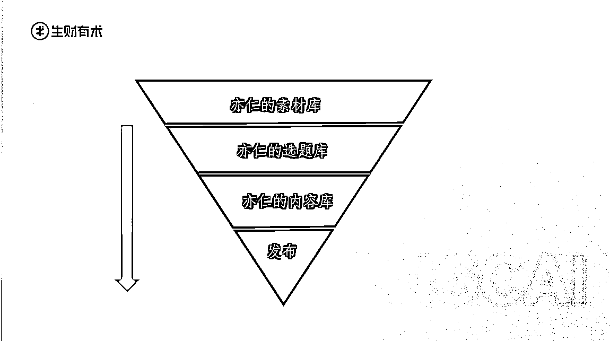
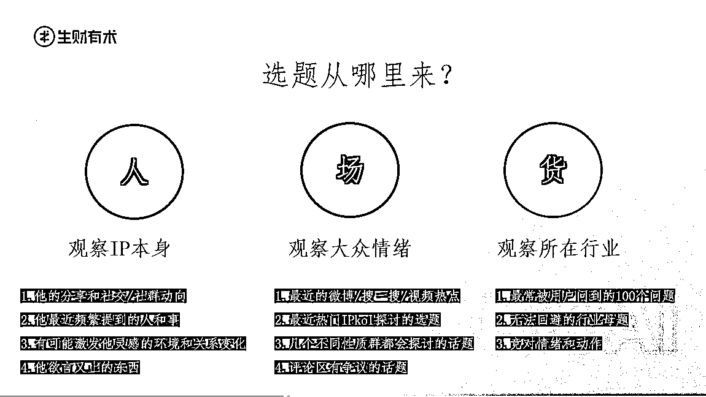
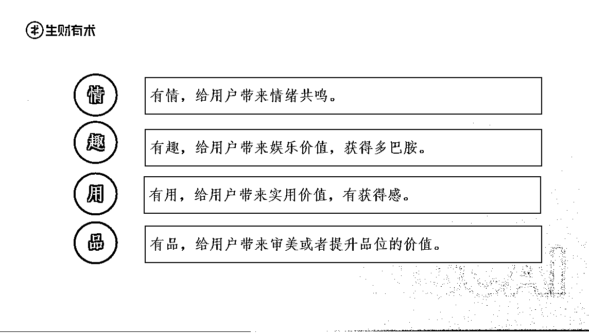
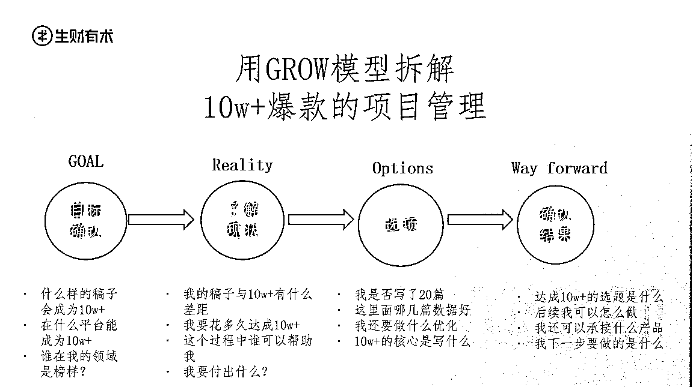
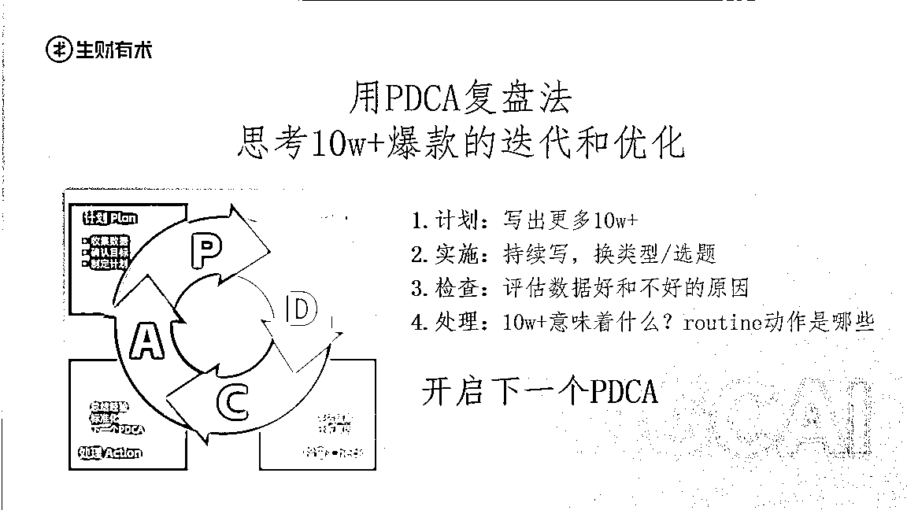
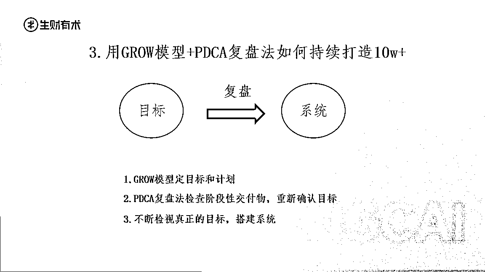

# 作为出过2本书的10年内容人：爆款选题是如何炼成的

> 来源：[https://shengcaiyoushu01.feishu.cn/docx/CtmxdygV8oizIjxgojocK4Axnrd](https://shengcaiyoushu01.feishu.cn/docx/CtmxdygV8oizIjxgojocK4Axnrd)

大家好，我是七天，之前做过百万畅销书《精进：如何成为一个很厉害的人》的营销操盘手，在网易阿里做内容运营5年，自己也写过两本畅销书，一本北漂散文集《大大的城市，小小的我》，也有幸卖出了繁体版权，一本成长散文集《别在成长的年纪选择平庸》，获得2018年当当新人作家的称号。

上一篇给大家分享了：作为出过2本书的10年内容人：聊聊好的内容是什么样的？（链接：https://t.zsxq.com/lDNWy）

今天再来聊聊如何写出爆款选题！

## 谁定义了爆款选题？

在聊爆款选题之前，让我们来想一个问题：谁定义了爆款选题？

是作者自己，还是用户，还是平台？

大家心中浮现出来的第一答案是什么？

用户，还是平台？

这么说吧，平台是一定期间内推荐的内容，一定是它认为的好选题。比如在前两年的时候推荐露营，去年推荐户外夜骑，推荐小马路的逛吃美食店。

但是一个平台上的内容太多了，平台是不可能去管上限的，它首先要管的是下限，也就是什么不能发。

所以你会发现平台会说的是规则，是违禁词，是不让做的事。

也就是说做选题时看平台的态度，只要没说不让做，就可以试试。

那试试的过程中，谁给你反馈呢？

对咯，就是用户！

好的爆款反馈出来是点赞，收藏，评论。

所以一句话总结：能唤起用户反馈互动的都是好选题。

即你的内容主旨是什么，它讨论的话题是某类用户关心的么，讨论的结论是有不同的方向吗。

举个例子，比如亦仁的小灯塔内容里的“心力”这一选题是怎么来的？

当时我意识到在大家都说钱不好挣的大环境下，如果我们一味去强调赚钱机会好找，是不是就没在用户的情绪点上？

刚好看到了李翔写了一篇“论心力”，也看到教员的一篇心之力在“看一看”热点里是爆款，当时就意识到，在大家觉得能量低的时刻，不能一味地强调向前冲，更应该能给到大家抚慰，让大家停下来关注“心力”，更好地蓄力，把赚钱看成一个持久战。

所以大家可以看到亦仁的小灯塔，有干货如《如果财富归0，我去哪里找到好的赚钱机会》，有认知如《如何对听到的各种赚钱信息做出有效判断？》，有情绪如《如何提升自己的心力？》

当一个IP是立体的，能够感知到各种大众情绪，并且在不同的维度做出表达，这个IP才会更丰富，更让用户觉得我愿意跟你反馈互动。

当我们想要持续的生产爆款，那这个IP就不应该的追求爆款，而是追求持续稳定的反馈，从这个目的出发，去创建爆款系统。

## 如何做出爆款10w+？

谈到爆款选题，很多圈友的想法是找对标，看竞对。

这个里面默认竞对的爆款就是好的。那么好在哪里？

是选题，标题，还是内容，还是形式？

所以这里面的核心是：是什么因子塑造了爆款？

这里我分享一个自创的爆款公式：

爆款选题=客观概率（大家都有感的领域，持续创作的均值） × 情感共鸣（用户情绪反应）×角度创新（切入角度，金句）

#### 1.客观概率：好的爆款不是偶然，是大领域的小切口，是持续创造

在延伸一下，我之前去报过人物的写作课，他们提到爆款内容基本都是：

公共议题，互联网议题，情感议题，性别议题 四类。

然后写作切入角度上又分为新议题，和旧议题里的新角度。

比如年轻人对于考公和进入体制的态度变化，就属于旧议题里的新角度。

新议题比如说在报告中为何70%的00后想要成为数字游民或者自由办公等。

所以你找的选题是不是覆盖范围足够广，而切口够不够精准，让大家都有感。

找到了之后，你能不能持续写。

如何持续写？

*   第一步，你有没有自己的素材库，时刻收集对于最新鲜热点和信息

*   第二步，你有没有自己的选题库，不断产出一些灵感和观点

*   第三步，你有没有找到一个好的表达契机，在用户情绪高点，把你的观点配合大众情绪热度抛出来。

再举个例子，我们内容运营部日常如何给亦仁建立他的选题库呢？

*   第一步：用漏斗模型建立素材—选题库—发布库——发布的流程。

*   第二步：利用“人货场”模型把选题类型分类，穷举，并且每周补充新的选题。

#### 2.情感共鸣：什么算是好的选题？可以用4个字归类一下：情，趣，用，品。

有情，给用户带来情绪共鸣。

有趣，给用户带来娱乐价值，获得多巴胺。

有用，给用户带来实用价值，有获得感。

有品，给用户带来审美或者提升品位的价值。

#### 3\. 情感共鸣：选题要让用户有反应

举个例子，我当年写的一篇小红书叫：《一个过得不好女孩的共性：极度拧巴》，没两天就破5000赞了，评论区里最多的不是：哇，你写的好好呀。而是“这不就是我吗！拧巴本拧，焦虑本虑”，所以你看用户对于好内容的反馈，是你说出了我想说的。

所以找竞对的时候，只参考她的观点，而不是参考内容。

参考维度是标题，金句，核心观点。他爆的原因一定是因为选题击中了用户的需求。

#### 4.角度创新：极度有特色的IP风格

举个例子比如意公子的娓娓道来文艺感，tim的极致geek风。就拿脱口秀演员来说，豆豆的表演型风格，呼兰用历史夹带私货的高级嘲讽风格，唐香玉的幽默自嘲+女性视角的风格。

IP的风格就是吸引注意力的优质特点，而注意力又会被转化成用户反馈（点赞评）

IP的风格如何形成？

首先IP没有高低，但有感觉，要去做体系化的自我表达。

*   故事=你的外在，内在，挑战；

*   成就=你的背书，经历，案例；

*   专业=你的金句，资料，知识。

好的IP应该掌握sop，做好各种元素的再组合。

## 最后，8个点，分享我的选题思路

这可是在生财首发的干货，看完了圈友们觉得有帮助，欢迎评论区说说哪个点让你有感触，也可以多多分享你的选题思路。

1 热门爆款的评论区就是用户关注的选题。

2 通过异常值关注选题，比如闲鱼近期有各种二次元产品置换，发布笔记量比较大，那比如二次元的电子茅台在闲鱼就是一个好的选题。

3 自身感受到的日常生活的痛点，比如下班后精力不足，比如想要做副业寻找其他变现业务。

4 去看人物或者36氪近一年的阅读量好的文章，你会发现热门选题基本分为公共议题，互联网议题，情感议题，性别议题4类，所以选题可以分为新议题，旧议题里的新角度。

5 从商业中来：关于拼多多的解读，可以去看创始人的风格，可以去看黄铮自己写的文章。进行提炼和汇总

6 建立自己的素材库：素材库的帮助是让点状的素材为某一个主题服务，而不至于每次要写某个主题的时候现找菜。任何主题的水道渠成，都是菜够了，料齐了自动上来的。

7.从全网热点中思考。思考的不是热点，而是热点背后的为什么，比如电子父母火了，背后其实是一种情感代偿，下一个可能就是电子房东，电子地主，本质上是网络的情绪价值与现实不如意的GAP产生的现象。

8 从学会下定义里来，比如钱是什么，钱是对于你价值的奖励。这就是一个好的选题。再比如：你赚了谁的钱，你就要为谁打工。这是润宇老师提到的如何找目标客户的一个观点。

对于创作者或者想写内容的圈友来说，想要突破同质化内容，成为用户心目中的“宝藏”，爆款选题不应该是目的，而应该是结果。

最后总结3点：

1.打造爆款内容系统，而不仅仅是爆款选题。只有建立系统，才能让正确的事情持续发生。

2.像产品经理一样去写作。学会拆解，学会复盘，目标时间是很重要的发酵剂。

3.当下的任何爆款，多少都是因为它击中了人群在特定的时间、空间里的特定情感需求，在人群中产生了链接和共振。

最后！如果你想做IP，或者做IP遇到哪些卡点，或者想要了解更多关于内容持续化创作的思路，欢迎在评论区留言分享！