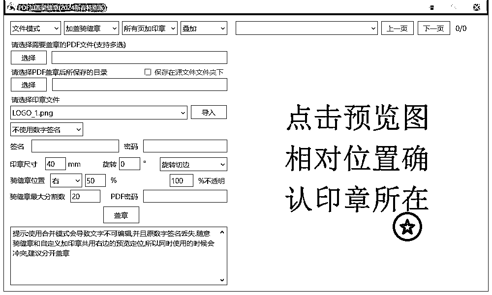
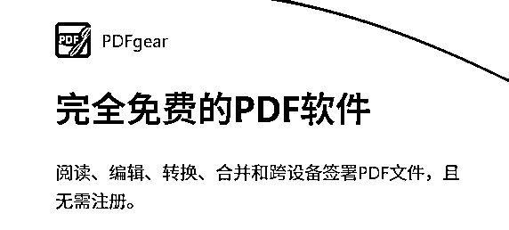
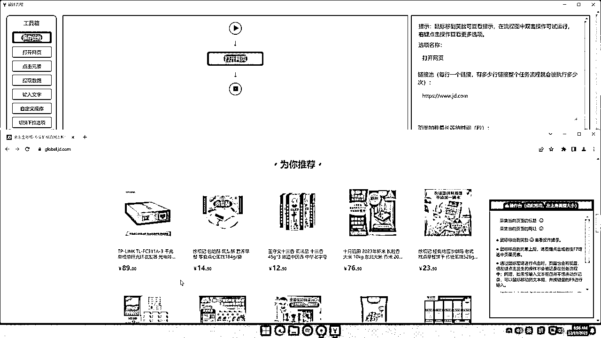
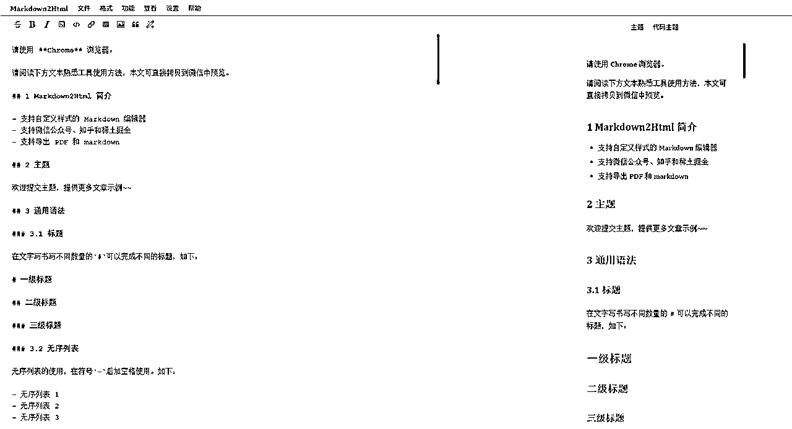
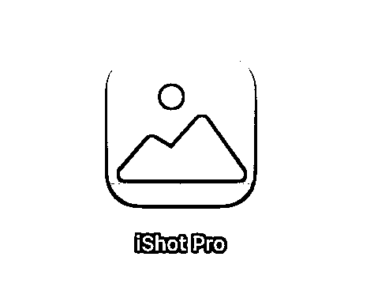

# 效率工具集10/100

> 来源：[https://dg0gcz6gfe.feishu.cn/docx/DBThdCGwEoU7bmxqw58cTKMhnsr](https://dg0gcz6gfe.feishu.cn/docx/DBThdCGwEoU7bmxqw58cTKMhnsr)

# 1.PDF加盖骑缝章工具，免费开源-PDFQFZ

PDF加盖骑缝章的小工具

选择需要盖章的PDF文件或文件夹。 选择保存文件夹。 导入完整的印章图片,工具会根据PDF页数做随机分割。 设定印章大小,骑缝章位置,印章位置等 点盖章，骚等后在保存文件夹中即可看到盖好骑缝章的PDF文件。

### 具体使用步骤：

1.  选择需要盖章的PDF文件或文件夹

1.  选择保存文件夹

1.  导入完整的印章图片，工具会根据PDF页数做随机分割

1.  设定印章大小、骑缝章位置、印章位置

1.  点盖章

Github 开源下载 【点击前往】

# 2.Simple Allow Copy — 内容复制【白嫖神器】

当你在百度文库或CSDN当中想复制一些文字的时候，你会发现绝大部分都是需要登入账号或者会员才可以，

是不是很繁琐。但是这个Simple Allow Copy 插件，无需注册开通会员，就可以直接复制网页中任何文字。为我们节省时间的同时，可以进一步让我们更高效的学习和办公！

Simple Allow Copy 插件下载：

Chrome：【点击安装】

Edge：【点击安装】

# 3.完全免费的PDF转换工具-PDFgear

阅读、编辑、转换、合并和跨设备签署PDF文件，且无需注册。

【点击下载】

# 4.EasySpider 一款可视化爬虫软件，无代码设计和执行爬虫任务！

EasySpider 一款可视化爬虫软件。使用图形化界面，无代码设计和执行爬虫任务。开发者只需在网页上选择爬取内容，并根据提示框操作，即可完成爬虫设计和执行。

实现可视化浏览器自动化测试/数据采集/爬虫软件，可以使用图形化界面，无代码可视化的设计和执行任务。只需要在网页上选择自己想要操作的内容并根据提示框操作即可完成任务的设计和执行。同时软件还可以单独以命令行的方式进行执行，从而可以很方便的嵌入到其他系统中。

下载方式：

Github 开源项目 【点击前往 】

# 5.网赚拉新平台-任推帮

网赚项目拉新平台，包含网盘拉新，信用卡拉新，号卡分销，应用拉新等等（懂得都懂）个人/团队都可以。

PS:大家可以自己注册，不要轻信他人都邀请码!!! 我个人也不分享邀请码⚠️

# 6.巨好用的插件-飞书剪存

1.  一键保存网页正文：用户在浏览到喜欢的网页时，点击飞书剪存插件，即可将网页内容保存至自己的飞书云文档中，告别了手动复制粘贴的繁琐操作。

1.  智能剥离网页广告：能够智能识别并去除悬浮或嵌在网页中的广告，为用户提供干净、无干扰的网页内容。

1.  方便整理和分享：保存下来的网页内容可以在飞书云文档中进行整理和编辑，用户可以为这些内容添加标签分类，方便日后查找。同时，还可以将这些内容分享给其他人或者直接导出为 PDF 文件。

插件商店搜索添加即可！

# 7.微信视频号下载器 WeChatVideoDownloader 2.0.0 视频解密下载

食用说明

下载地址

# 8.微信公众号一键编辑排版（免费）

食用地址

# 9.强大的macOS全局截图软件

iShot 是 macOs 上最全面的屏幕截图和屏幕录制工具截图、长截图、多窗口截图、延迟截图、注释、贴图、取色、录屏..众多丰富的功能满足你的各种需求。

下载地址：【点此进入】

# 10.重磅压轴-RSSHub

RSSHub 是一个开源、简单易用、易于扩展的 RSS 生成器，在信息爆炸的今天你是否经常会被各种各样的信息流投喂，被动吸收。有时候你只想要一根绳子，最后你却牵出了一头牛。

利用rss可以根据你个人感兴趣的版块，收集优质信息源，只需在 RSS 阅读器中集中查看订阅的内容，大大节省了时间和精力，能够高效地获取自己关注的信息。

