# 借助AI+RPA实现小绿书图片一键生成自动发布，可矩阵（小白级详细讲解，附：影刀脚本）

> 来源：[https://b121w2zgwyx.feishu.cn/docx/DFJrd1G1KozPCHxCNG7csGoLntb](https://b121w2zgwyx.feishu.cn/docx/DFJrd1G1KozPCHxCNG7csGoLntb)

听说最近，小绿书流量不错？于是我去大致看了一下小绿书的形式，发现好多形式挺简单，很多其实没有做的很绚丽的，数据也不错。也就是说，估计又是一个吃流量红利的一波。以下是小绿书的展现形式


我一瞅，这么简单的形式，按我的习惯，不管三七二十一，先自动化了再说，后面再根据情况优化内容，这个是我目前一键生成的简单效果：


照例，先来看一下我的示例演示:

我发现群里很多朋友都是刚接触工作流，他们在用我工作流的时候，老习惯一个卡点就问我问题。不是说问问题不对，而是问的问题不对。就是感觉，纯粹是为了搭建而搭建，却没理解整个原理和思路。

因此，这一篇分享，我将详细讲解搭建思路，方便刚接触的小白用户，可以更好理解

# 整体功能思路

首先，我们分析了一下，小绿书的展现形式，小绿书主要由，标题，简介内容，以及多张图片内容组成。标题，内容简介，这几个都可以通过coze的工作流实现。

但是，我看了一下微信接口文档，暂时没有图片形式的发布接口，因此，自动发布这部分，要交给RPA实现，没法像之前的图文一样，一个工作流一步到位

因此为了让工作流产出的内容，可以转接给RPA拿去发布，所以我选择了飞书作为存储媒介。所以整体流程如下：

开始 ==》工作流产出内容 ==》录入飞书表格==》RPA拉取表格内容，批量发布 ==》结束

需要注意的是，本教程还是沿用创作罐头作为多账号发布的工具，如果大家不知道这套方案，需先了解一下

这篇文章

接下来开始具体的步骤：

# 一、一键生成小绿书图片工作流搭建

工作流源码我已经分享到社群团队，社群成员朋友，可以直接查看复制。工作流的搭建与讲解，大家可以看下面介绍

## 1、整体工作流搭建前的准备。

在完成，主体工作流前，我们分析一下，整个工作流需要哪些元素。

① 一个大模型节点，为我们写简介内容。

② 一个大模型节点，为我们产出正文内容。（理论上可以用一个大模型搞定。但我习惯一个大模型尽量只干一件事，太复杂不稳定）

③ 一个封面图制作工作流

④ 一个内容图制作工作流

⑤ 一个主体图片生成图像流

⑥ 一个录入内容到飞书的插件，这个在上一篇文章有介绍，没有做好插件的，要先去做一下插件（很重要）

## 2、主体图像流的搭建

为什么先搭建这个呢？因为我打算简单布局（看最开头的效果），只生成一张图片作为配图，然后搭配纯色背景实现图文排版。

图像流的搭建节点如下：

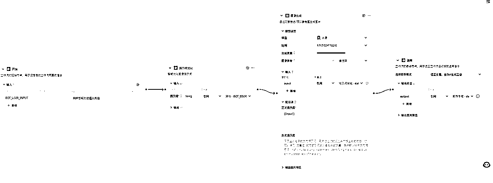

图像流很简单，大家照着这个节点，拉一下就有了，就不细说了。

## 3、 搭建一个封面制作工作流

我们先来看一下这个封面的要素：

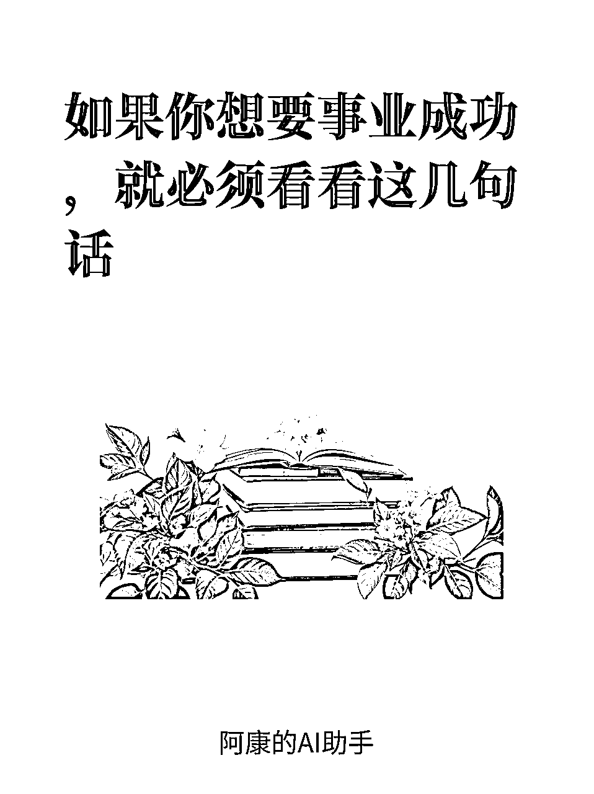

主要有：封面标题、主体图片和 公众号名称。

① 因此我们这个工作流的输入项就是： 标题、图片、公众号名称 所以，开始节点是这样子的

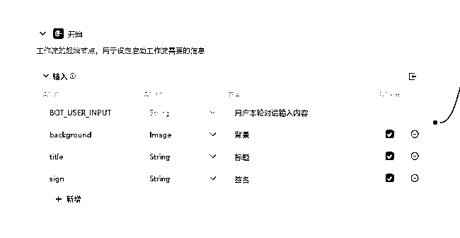

接下来，因为我们的主体的图片是用AI生成出来的，比如下面这个样子：

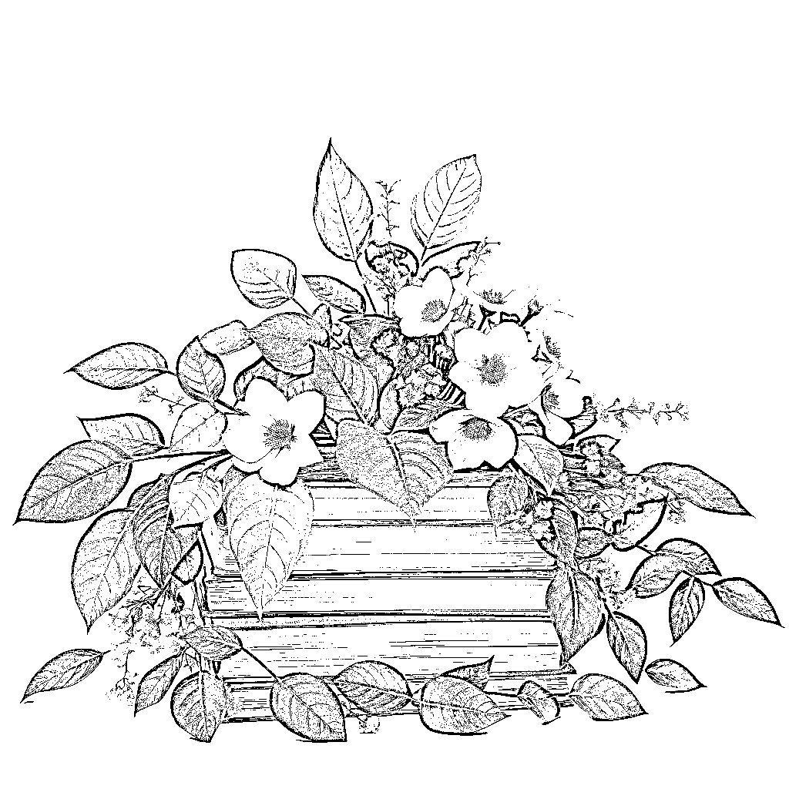

② 如果这样整张图放到我们的背景里，就很不协调，因此，我们下一个节点，需要将主体抠出来，所以第二个节点长这样：


③ 接下来，我们要将、标题、抠完的图像，和公众号名称拼到一张图片上，因此我们用到了一个画板的节点：


可以根据你们自己喜欢的排版去调节一下。整体工作流如下，记得试运行，发布一下：

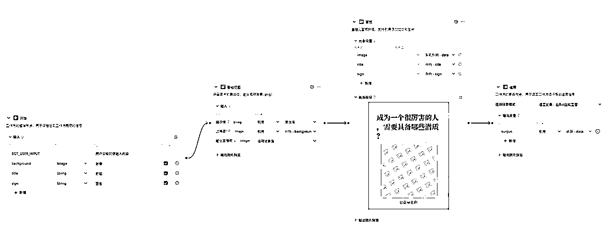

## 4、用同样的方法搭建一下内容图的制作工作流

整体如下，不同的地方只在开始节点传的参数不一样，记得试运行，发布一下：

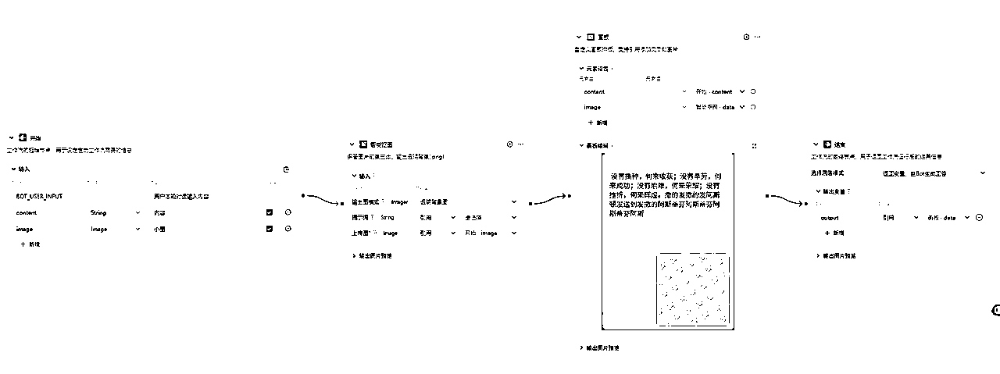

## 5、开始搭建一键生成的工作流

### ①、我们先创建一个按格式创作内容的大模型

为我们生产内容，大模型需要一个标题输入，而后续的封面还需要公众号名称，所以前面两个节点如下：


大模型的创作内容提示词如下，我只是做个基本的展示，大家自己的内容，还是要自己调提示词。我这只是抛砖引玉：

```
# Role: 名人名著金句摘抄大师

## Profile:
- Author: konger
- Version: 1.0
- Language: 中文
- Description: 作为名人名著金句摘抄大师，你能够根据用户提供的主题，精准地摘抄出符合特定特点的金句。

### Skill:
1\. 熟悉各类名人名著。
2\. 能够根据主题快速定位并摘抄金句。
3\. 理解并识别金句的普遍性、深刻性、简洁性等特点。
4\. 确保金句的出处准确无误。
金句有如下特点：
普遍性：句子表达的是人类普遍的情感或经验。
深刻性：句子具有深层的内涵和意义。
简洁性：句子简短而有力，易于理解和记忆。
文学性：运用修辞手法，如比喻、象征，增强表达效果。
情感共鸣：能够触动人心，引起情感上的共鸣。
哲理性：包含对生活、人性等方面的深刻见解。
社会批判：反映对社会现象的批判或讽刺。
道德指导：提供道德上的指导或建议。
现实主义：反映现实生活，揭示社会的真实面貌。
跨时代性：超越时代限制，对不同时代的读者都有启发。
示例：
1.我们的心是一座宝库，一下子倒空了，就会破产。一个人把情感统统拿了出来，就像把钱统统花光了一样得不到人家原谅。《高老头》
2.释放无限光明的是人心，制造无边黑暗的也是人心，光明和黑暗交织着，厮杀着，这就是我们为之眷恋而又万般无奈的人世间。——雨果（法国）
3.生活总是让我们遍体鳞伤，但到后来，那些受伤的地方一定会变成我们最强壮的地方。——海明威（美国）
4.黑夜无论怎样悠长，白昼总会到来。——莎士比亚（英国）
5.聪明人的特点有三：一是劝别人做的事自己去做；二是决不去做违背自然界的事；三是容忍周围人们的弱点——托尔斯泰（俄国）
6.勿以善小而不为，勿以恶小而为之。惟贤惟德，可以服人。——罗贯中《三国演义》
7.人间不会有单纯的快乐，快乐总夹杂着烦恼和忧虑，人间也没有永远。——杨绛《我们仨》

## Goals:
1\. 根据用户指定的主题摘抄金句。
2\. 确保摘抄的金句符合所列特点。
3\. 确保金句的出处准确，不捏造来源。

## Constrains:
1\. 必须确保金句的出处准确。
2\. 不能随意捏造金句的来源。
3\. 金句必须来源于某本书或某个名人之口。

## OutputFormat:
1\. 金句需符合用户指定的主题和特点。
2\. 金句与金句之间请用“|”符号分隔
3.不要任何解释，直接输出格式化后的金句

## Workflow:
1\. 确认用户指定的主题和金句所需符合的特点。
2\. 根据主题和特点在名人名著中搜索合适的金句。
3\. 核实每句金句的出处，确保准确无误。
4\. 摘抄金句，并按照要求格式化输出。

## Initialization:
作为一名名人名著金句摘抄大师，我将遵循您的指示，用中文与您交流，并向您问好。然后，我将介绍我的工作流程，并开始为您摘抄金句。

```

还记得我们的内容图片制作工作流吗? 它的主要输入是一句话内容，因此我们要让大模型 输出的内容，可以拆分成多句话，所以我在大模型的输出限制里，加上了


### ②、拆分大模型输出的短句为数组

我们要用文本处理节点，将所有句子拆分成列表，为什么要拆分成列表？因为后续的内容节点要用到。

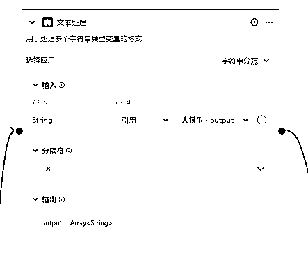

### ③、接下来我们先来做封面

我们来加入封面节点，封面需要用到标题，公众号名称，以及图片

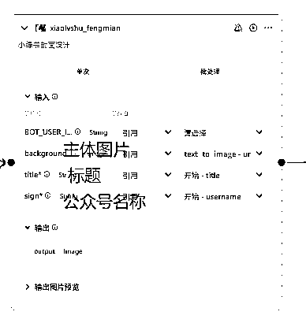

标题名称，和公众号名称，都是开始输入的，现在还缺个主体图片。 因此，我们现在要添加一个图像流，用来生成图片。

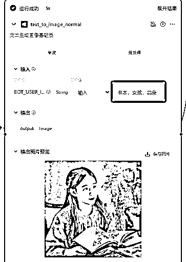

我加入图像节点，提示词固定用书本、女孩、花朵；我现在是觉得固定这个风格就行了，大家如果希望每次都换提示词，那就得考虑，再加个节点，生成提示词了。具体的优化，就看大家自己了。

好了，来看一下现在的工作流情况：

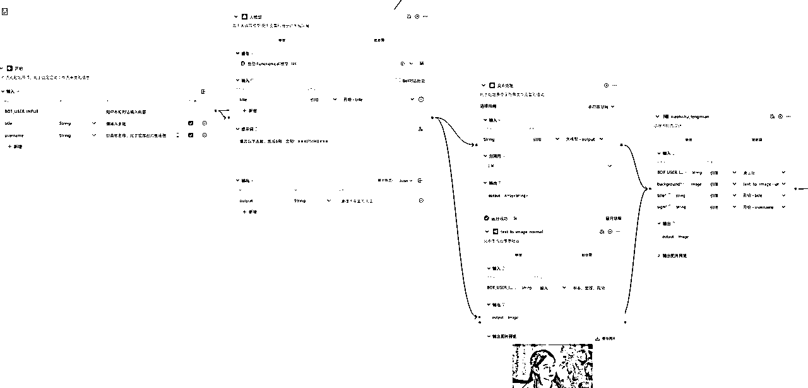

### ④、接下来开始做内容图片了

我们加入前面做好的 内容制作工作流，正常情况下，我们的工作流是输入一个内容，生成一张图片，那我们如果生成多张图片，难道要加入多个工作流？明显不合理，所以我们应该用到节点的，批处理功能，批处理需要传入的是列表或者是数组。 这就是之前我们为什么要用文本处理，将句子分割成数组的原因了。所以这里我们选择的输入是前面文本处理之后的输出。图片用前面图像流生成的图像就行了。注意的是内容的输入项，要用当前节点的 item1；代表从数组里面循环取值。

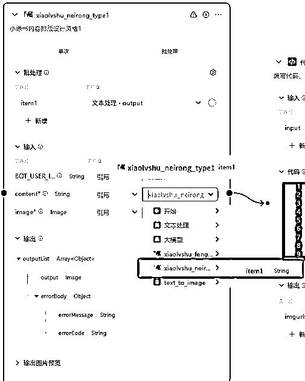

大家注意，批处理要设置一下，并行运行数量，太多会报错

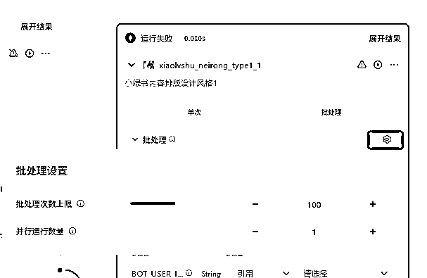

### ⑤、用代码做一下格式化处理

因为批处理出来的数组格式，他不符合我最终录入文章的参数需要，所以我这里要用代码稍微处理一下。代码节点的源代码如下，大家记得选python模式：

```
async def main(args: Args) -> Output:
    params = args.params
     # 将JSON字符串转换为Python字典
    # data = json.loads(json_data)

    # 提取"String1"键对应的列表
    string1_list = params['input']

    # 提取列表中每个字典的"output"键的值，并构建新的列表
    output_list = [item["output"] for item in string1_list]

    # 返回转换后的列表
    ret: Output = {
        "imgurls": output_list
    }
    return ret
```

这个断代码主要是将批处理的输出类似[{output:1.jpg},{output:2.jpg}{output:3.jpg}] 这种格式，转化成了["1.jpg","2.jpg","3.jpg"]; 因为这种格式，可以通过拼接处理，变成 “1.jpg，2.jpg，3.jpg ” 这个是我录入插件需要的格式；所以接下来拼接字符串

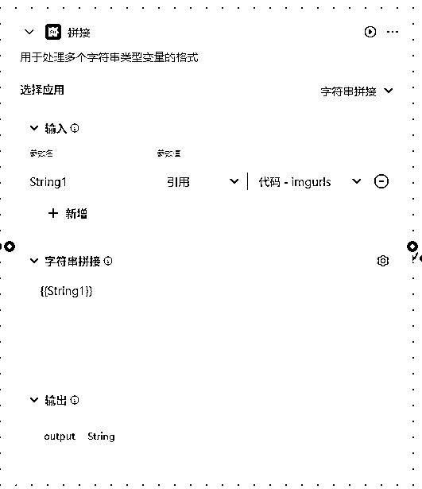

拼接完之后，我们发现封面图是单独生成的，步骤内容图片里面，而且封面图必须是第一张才行、所以我们又写了一个代码。将封面图拼接到内容图片之前；

```
async def main(args: Args) -> Output:
    params = args.params
    ret: Output = {
        "output": params['image1'] +","+ params['image2'],        
    }
    return ret
```

### ⑥、最后加入我们之前用到过的文章录入飞书的插件

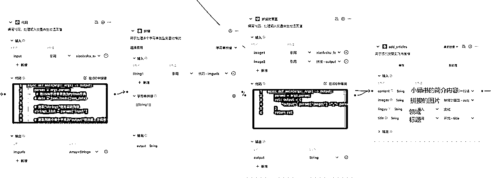

录入到飞书的插件，图片，填的就是最后拼接完封面图的输出，领域，看你们想发什么领域的，跟你们需要发布的账号能对应上就可以。 标题为开始节点的输入的。我们发现，我们应该还少了个简介内容

### ⑦、添加简介内容生成


输入参数，为开始节点的标题，然后用提示词写一段简介，我的提示词是这样的，大家根据自己的需求优化，我只简单写了一下。

```
请以"{{input}}" 这个主题，写一段引入入胜的开头，引导用户继续往下读，注意，开篇直击痛点，不要打招呼，要口语化表达，字数要求100字。 
```

最后，将这个节点连上录入文章那里，把内容填到文章录入节点的内容上，我们整个工作流就搭完成了，我们来看一下整体的情况：

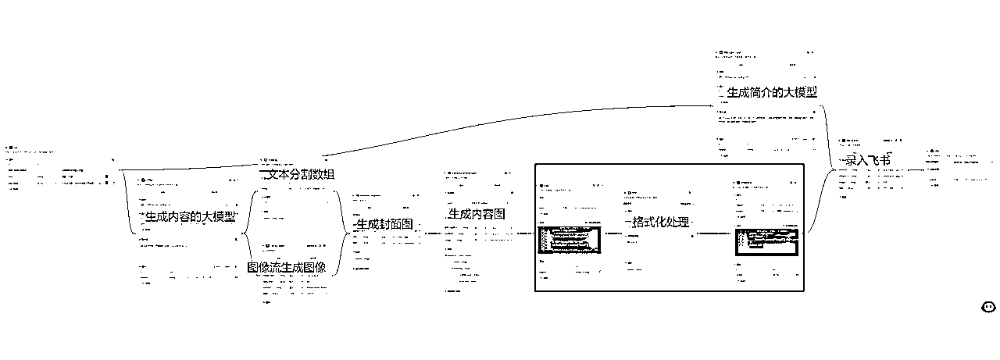

# 二、一键自动化发布脚本编写

一键发布的思路就是，从我们的飞书待发布文章拉取内容，这里对代码进行标注说明

## 1、配置信息与提取批量发布的账号

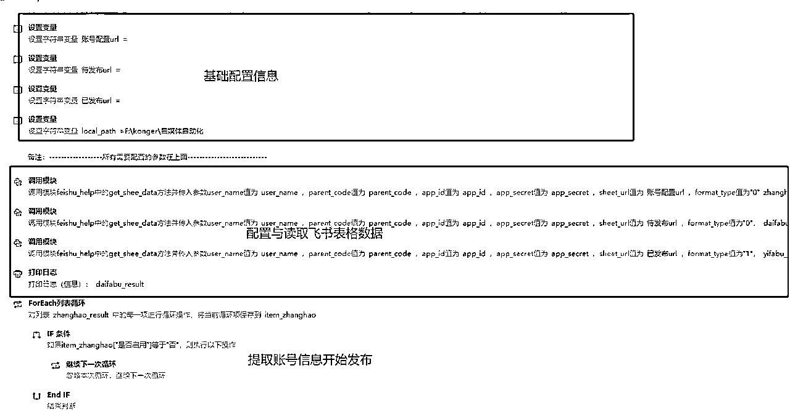

## 2、提取待发布文章进行发布

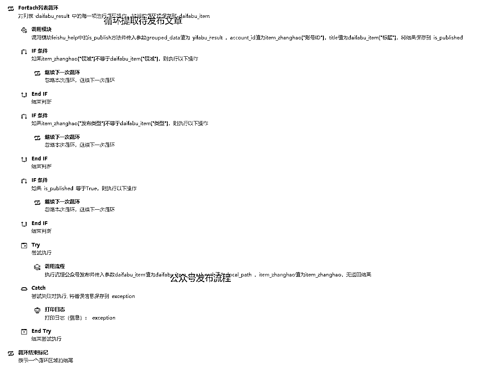

## 3、公众号的发布流程

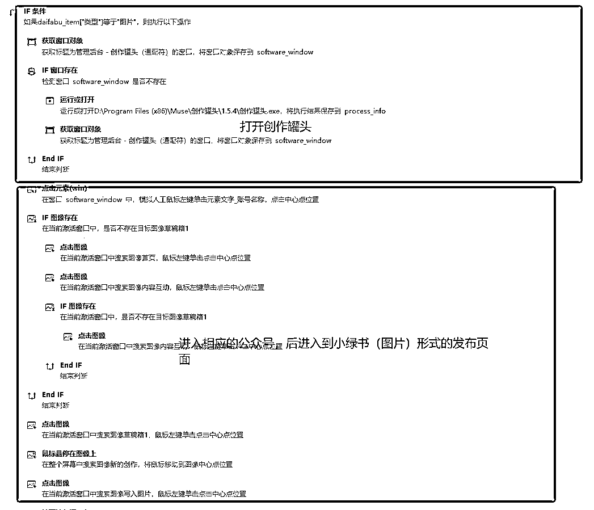

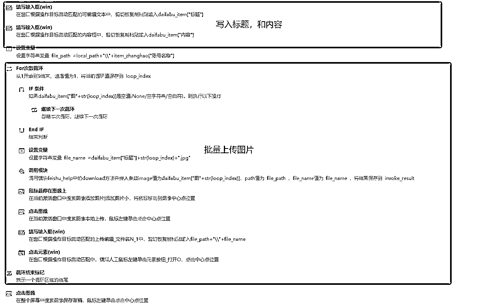

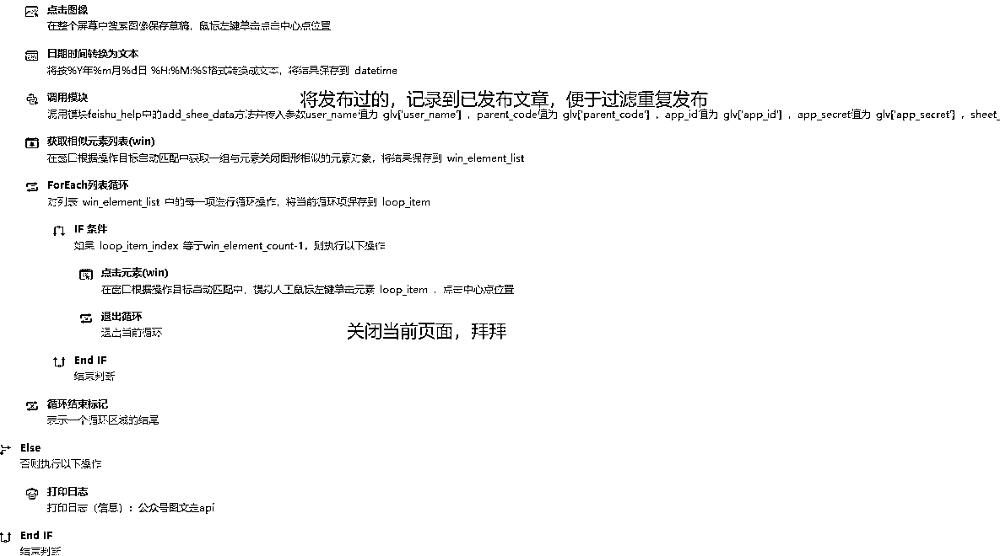

# 最后

做个自我介绍，本人12年经验的大龄程序员。

我可以提供：RPA自动化脚本编写，网站软件开发，平面设计、手绘；

# RPA附件：

小绿书一键发布脚本

链接: https://pan.baidu.com/s/15wr4H-5XZhoJ6ift5OENMg?pwd=4geq 提取码: 4geq