# 微信公众号爆文变现的正确姿势与未来展望

> 来源：[https://t2wey3hi7h.feishu.cn/docx/EVjNdKJ6moLiF0xaWo3cCXTAnW2](https://t2wey3hi7h.feishu.cn/docx/EVjNdKJ6moLiF0xaWo3cCXTAnW2)

大家好，我是财火，主业程序员，副业是自媒体。

我是2015年开始做自媒体的，应该算是国内最早做图文自媒体的那一拨人了，做过头条、百家、大鱼、企鹅、趣头条、搜狗号、网易等各大自媒体平台，其中单号单平台的最高收入超过95万：

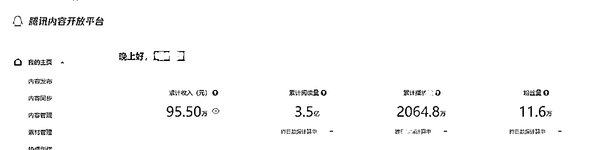

现在的公众号项目，个人感觉和之前的头条号等自媒体项目很像，在航海期间，我通过学习航海手册以及教练的分享，同时运用自己之前做自媒体的经验，在航海期间也有一些收获，以下是航海期间的每日收入情况：

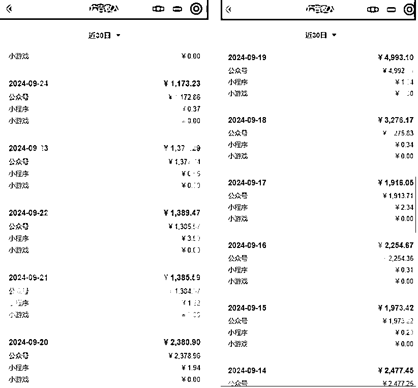

以下是其中一个公众号的总体收入情况：

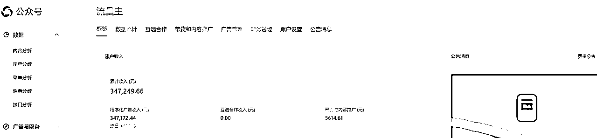

今天我的分享可能不是那么实操，但是我个人认为还是比较重要的，因为公众号的实操，比如账号的注册、选题、RPA以及AI等等，在航海手册中已经写得很清楚了。

我想分享的更多还是公众号爆文项目中，我认为的“道”，另外也想分享我对公众号这个项目的未来展望，内容主要分为3部分内容：

1、图文自媒体的历史；

2、公众号爆文的心态与正确姿势。

3、公众号项目的未来趋势以及应该如何应对。

## 一、我经历的图文自媒体历史

我算是经历过图文自媒体的生长、爆发以及衰退。

2015年头条号刚出来的时候，做的人还不多，官方给的收益也很高，1万阅读，收入有100块，相比如今，头条号1万首发大概也就10-20元，非原创的可能更低了。另外，规则也不严，新奇特的内容很容易爆，我记得当时有一个号，天天发外星人之类的消息，每篇都能爆。

从2016年开始，大鱼号、企鹅号、百家号等各大平台都在大肆招募作者入驻，给出的单价都比较高，除此之外，后来有很多小平台也纷纷出炉，吸引读者入驻，比如惠头条、搜狗号、趣头条等等，连优信二手车也除了一个内容创作平台吸引创作者入驻。

各大平台为了竞争优质内容，纷纷推出了首发、独家等功能，标记这些功能，文章收益会翻倍。企鹅号还会和作者签订独家协议除此之外，各大平台还推出了各大榜单吸引创作者。

除了百家号之外，百度百科也推出了一个内容平台，叫做百科他说，邀请一些垂直领域的头部作者入驻，还给出了一个月3000的保底收入。

那个时候，真的算是图文自媒体作者的春天，创作者创作一篇文章，分发到各大平台，“一鱼多吃”，一个号在各大平台的月收入之和很容易就超过10万了，如果百家号上了百家榜，每个月还有至少5000的奖励（最高是2万），大鱼、企鹅上了榜单，一样也有月奖励。

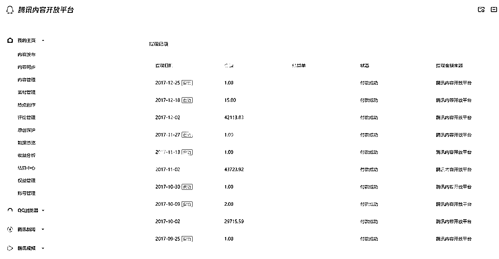

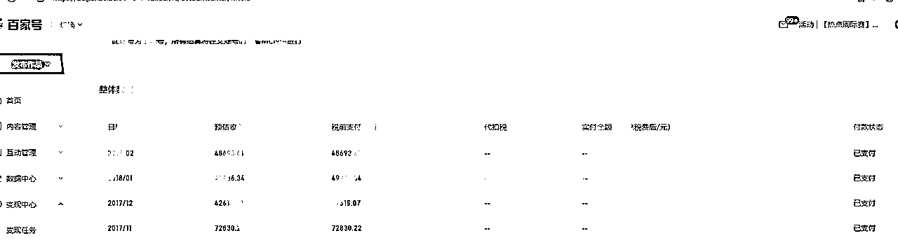

从2018年下半年开始，各个平台开始更加注重内容质量了，之前的“标题党”等老套路纷纷受到打击，头条号率先降低了平台单价，1万阅读收入从之前的100元慢慢降到了后来的1元（现在又回升了），后来各个平台也纷纷跟进降低单价，许多工作室一片哀嚎。

此时，各大平台纷纷推出了图文带货的功能，在这块，头条也是做得最早的，它当时推出了一个特卖创作平台，邀请中头部作者入驻，在一个QQ群里交流。对于特卖平台，我印象最深的一句话，就是官方讲的，“你们的文章要有信息增量”。

到2019年，平台纷纷将重心转向视频功能，图文自媒体也就慢慢没落了，到后来，单号单平台要想月入过万，都已经很难了。很多创作者也纷纷弃更了，要么转行做视频，要么就干脆不做自媒体了。

## 二、公众号爆文的心态与正确姿势

之前的微信公众号，其实是一个订阅制的私域平台，只要你有足够的粉丝，就不怕不赚钱，但是后来随着公众号打开率的下降，官方渐渐将公众号往公域方向转，这对很多新号来说，是一个机会。

现在的公众号平台，个人感觉很像2017年时期的各大自媒体平台。很多人说，“公众号爆文项目是最简单的入门项目”，个人感觉这句话对，也不对。说对，是因为公众号流量主要想有收入，很简单，但是如果要能持续地保持月入5万~10万甚至更多，是不容易的。

### 1、收益起伏很正常，心态要平稳

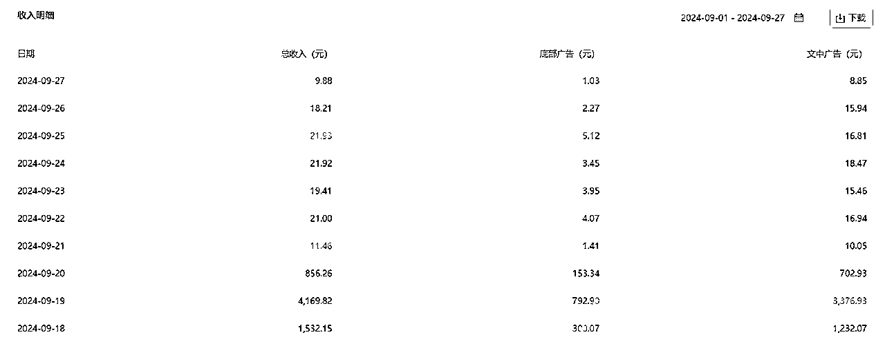

这是我其中一个号的收入，可以看到前天流量主收入是4169元，到第三天就掉到11元了，而且这个账号的推荐流量占比依然超过80%，账号仍然在推荐池。

做自媒体的时候，经常会遇到收入起伏的情况，记得我之前有时候晚上觉都睡不好，总是想追溯收益起伏的原因，要么怀疑标题，要么怀疑内容选题，要么怀疑是不是被同行举报，搞得很焦虑，动作也变形了，在分析了很多次之后，我发现这是一门玄学，对于我们普通人来说，其实根本就不用分析。

只要账号状态正常，按照自己之前的选题思路，持续发布就行，流量不好就少发一些，流量好就发满。

### 2、矩阵化运营、用数量对抗概率

单个公众号的收入经常会出现波动，我们能做的就是用数量对抗概率。之前有一个台湾“名嘴”闹出个笑话，说他们的飞弹命中率是70%，3枚的命中率就是210%，很多人都笑他数学不好，他的数学确实不好，我们知道3枚命中的概率应该是 1 - (1-70%) x (1-70%) x (1-70%) = 97.3%。

尽管这是一个笑话，但这也说明了，用数量对抗概率的道理，所以做公众号，我们一定要“下狠手”，要矩阵化运营，之前自媒体的时候，要想做矩阵，需要招募员工，招聘写手，成本还比较高。

但是现在有AI了，我们可以直接让AI生成文章，只需要解决账号的问题就行，矩阵化运营的成本大大降低。

那么，如何拿到更多账号呢？有三种方法：

1、 用家人的信息来注册账号。

2、考虑公司主体来注册账号。

3、代运营。

关于代运营，大家可以参考教练兔子鱼的这篇文章：

### 3、公众号的更多变现模式

#### 3.1 带货

【图文商品】功能就是大家在正常进行文章创作的时候，可以在文中插入与内容密切相关的商品小卡片。一方面是为了对文章内容进行补充，另一方面也是为了有相关购买需求的读者能通过文中链接直接跳转到相应页面进行商品选择。

每当有用户通过你在文中插入的商品卡片跳转到相关付费界面，完成购买之后，你就会获得该笔交易的部分收益作为佣金。商品卖的越多，作者获得的佣金数额就越大。

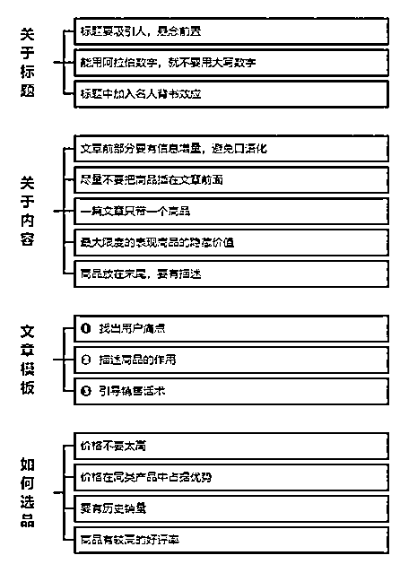

##### 关于标题

一篇好的文章，好的标题其实是成功的一半，其实带货文章也同样如此。

我观察了很多带货优质的文章，一般来说，这些文章的标题就足够吸引人，比如我们在取标题的时候，能用阿拉伯数字的时候，尽量不要用大写的数字。

比如3万写成30000，还有一种就是标题中尽量加入名人背书效应。

什么是背书，这里跟大家解释一下，背书就是对你的商品进行介绍，而这些介绍，尽量关联到名人，名师，出版社，甚至是一些有特色的卖点

但是标题中带有这些字样的时候，文章中也要及时兑现承诺，尽量要去多写，不要一笔带过，否则会被机器人判定为诱导，会被直接毙掉。

##### 关于内容

带货文章的内容，我们一定要懂得慢慢引导读者，前期的文章尽量多一些信息增量，避免口语化的内容。

这里解释下什么是信息增量。

信息增量指的是读者看到我们的文章，能够学到一些知识，增长一些见识，对读者做出正向的引导和启发，这点其实非常的关键，这将决定我们的文章是否会触发2次推荐甚至多次的推荐。

还有一点需要注意是带货的文章插入商品内容，尽量不要插在文章的前面，一般来说选择在结尾处是比较理想的。

一篇文章可以插入多个商品，但是我们写带货文，一般以一个产品进行介绍是最稳妥的方法，一般介绍产品选择在文章的收尾处。

##### 文章模板

比如文章的结构是总分总的写作模式，那么带货文的产品介绍，是写在结语后的，但这之间如何衔接，其实要看你之前的话术铺垫。

比如我们以历史文章举例。

有一篇文章写楚汉之争的故事，这篇文章提到了韩信，我们如何把文章进行巧妙的带货话术转换呢？

可以在结尾处抛出一个问题，韩信，如果你问小学生或者中学生，他们肯定会说韩信是打野的，这其实就是中华文化传承的缺失，韩信怎么可能是打野的呢，他可是给刘邦打江山的名将。

然后进而抛出另外一个问题，现在的中小学生历史文化不过关，其主要原因是如何如何，很多家长也希望孩子能有更多的文化知识，这里给大家推荐一款历史文化的课外读物。

这样很容易就把图书的商品引入进来了。其实，所有的带货文，归根结底，都是有一种规律的，这种规律叫做三步走：

第一步，就是找出用户的痛点

读者为什么要买你带货的商品？很大程度上是他们需要。

这里我举个例子：

很多人切菜，总是不小心伤到自己的手指，这样一来，十分的疼痛，导致天天叫外卖，额外花了不少钱。

这就是找到了用户的痛点，然后针对性的拿出我们的带货商品，比如护手的工具。

再比如很多小孩子对历史文化感兴趣，但是又不愿意看四书五经那些枯燥的书籍

我们就可以推荐一些漫画历史书籍

那么用户痛点找到了，就进行到第2步了，就是描述商品的作用，利用名人背书，宣传产品的好处

比如这个商品是哪里制造的，谁代言过，月销量如何？

利用对商品有优势的数据，结合轻松的话语，把产品的性能表现出来

第三步是引导销售话术

比如读者买到这个商品，能给他带来什么好处？

解决他生活上的哪些问题？

比如一套历史书，可以让孩子产生浓厚的学习兴趣

这样是不是就增加了他文化的修养，对于以后考学都会提供很大的帮助

与人交谈也更加自信了

以上这三步，可以应用在所有的带货图文当中，是一个万能公式。

大家在写作的同时，可以刻意地去套这个模板，当然，每个人写作的方式不同，至于如何引导，还要善于观察和思考，毕竟我们写文虽然卖的是商品，但更多的是一份信任。

切记不能夸大产品，比如用了这个产品就长生不老，或者如何如何的，我们可以适当给读者营造一个购买的意象：

比如在某个阳光微醺的午后，躺在阳台的靠椅上，一边品茶，一边看书，生活是多么美好惬意

这样营造意境是可行的，这其实是渲染场景。

大家有兴趣的，可以多去看看一些比较好的带货文章，看多了，也就会了。

##### 如何选品

几类适合挂载在多个领域的相关商品：

美妆护肤类产品：这类产品的主要用途是对皮肤进行保养、防护。比较适合时尚、生活、旅游、健康、娱乐、美食等领域的作者挂载。

居家用品类：家用“神器”，生活好物推荐，适合生活、家具、育儿、美食、综合等领域的作者挂载。

书籍类：“书籍是人类进步的阶梯”，书籍更是知识的源泉。对于书籍类商品，比较适合人文、文化、历史、教育、育儿、科学等领域的作者挂载。

衣服穿搭：爱美之心人皆有之，衣服穿搭比较适合时尚、娱乐、旅游、生活、体育、健身等领域的作者挂载。

小零食：很多用户都有对美食的不懈追求，各类小食品、小零食比较适合美食、时尚、健身、育儿等领域的作者挂载。

数码产品：数码爱好者们的“最爱”，比较适合数码、科技、生活、科学等领域的作者选择挂载。

盆栽花卉：植物具有美化生活的用途，比较适合生活、三农、健康、时尚、家居等领域的作者挂载。

#### 3.2\. 小说

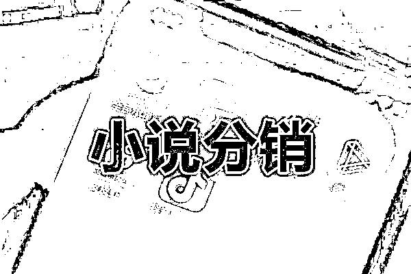

##### 为什么做小说分销？

小说分销一直是一个热门的话题，尤其是通过抖音、快手等短视频平台发布短视频，推广像番茄、知乎等平台上的小说来获得收益。

然而，这种方式存在一些局限性。

首先，推广时需要申请关键词，这一过程可能会相当繁琐。

其次，需要通过多个代理才能被允许推广小说，这不仅增加了复杂性，也可能影响收益的稳定性和透明度。

微信公众号作为一个广泛使用的社交媒体平台，提供了一个独特的机会来推广小说。与短视频平台相比，使用微信公众号推广小说有几个明显的优势。

首先，微信公众号允许发布更长的内容，这意味着你可以分享更详细的小说摘要或章节，吸引读者的兴趣。

其次，微信公众号提供了更直接的互动方式，使你能够建立起与读者之间更紧密的联系。

最重要的是，通过微信公众号推广小说，可以绕过繁琐的关键词申请过程和复杂的代理链路，使小说推广变得更加直接和高效。

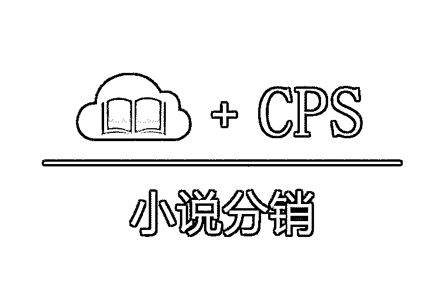

##### 小说分销项目搭建过程

###### 1、如何选择分销平台?

之前有很多分销平台。但是很多小说没有版权，很多做没有版权小说的朋友被专门侵权的公司收割。所以在这里我推荐两个比较大的平台，都是正版小说。

①掌中云小说分销平台

掌中云包含多种原创小说，需要条件，必须要有认证服务号，对于服务号的名称也有要求，这也是财火目前对接的平台渠道。

②微小宝小说分销平台

微小宝小说分销包含的原创小说种类比掌中云要少，但也比较丰富，这也需要条件，有认证服务号+公司账号。

###### 2、没有认证服务号如何搭建？

可以找开通过了认证服务号的，帮你开一个代理链接。

#### 3.3 提升公众号流量主收益

在开始之前，我们先了解一个广告行业的通用概念—ecpm。

ecpm是衡量广告收益的重要指标，指的是每千次广告曝光获得的收益。

小程序或者公众号文章发布以后，底部的广告有的人会一滑而过，有的人会停留一段时间而后一滑而过，有的人会感兴趣点击。

一滑而过会至少产生一个拉取，因为网络各种原因反复拉取会使拉取量有偏差；

停留一段时间而后一滑而过会产生一个有效曝光，不要问几秒才算有效曝光，系统有一套自己的评判标准，可以确定的是停留时间越长越好；

点击广告会产生一个有效点击。

打开流量主-广告数据-每日数据明细，这些数据都会清晰的在流量主后台展示出来，所有的优化也都是依赖这些数据指标。

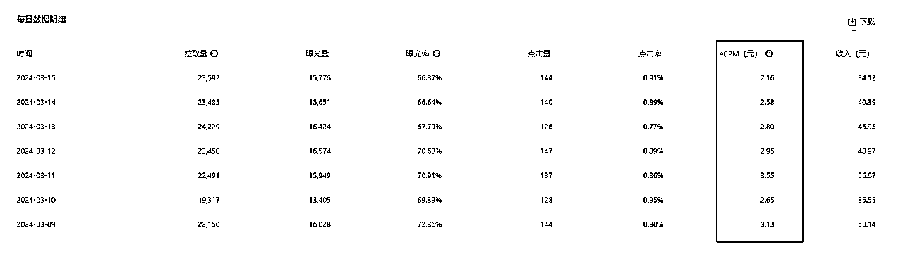

那么，该如何提升提高ecpm？关键是提高用户质量，即广告曝光率和点击率。通过精细化运营广告，我们可以显著提高ecpm值，进而提升收益。

##### 1、提高广告曝光率

许多人误以为只要广告被浏览就等同于有效的曝光，但实际上背后有一套复杂的算法来判定什么构成有效曝光。

虽然我们不清楚具体的规则，但是可以肯定的是，广告展示的时间越长，其成为有效曝光的可能性就越大。因此，在微信公众号上，发布含视频的文章比仅含文字的文章能获得更高的每千次展示收益（ecpm）。

视频能够使用户在观看时持续产生对底部广告位的曝光，比如一个5分42秒的视频。

通过比较我的个人公众号和我另一个专门发布视频内容的公众号，视频内容的ecpm比图文内容高出许多倍，后者的ecpm大约为140。

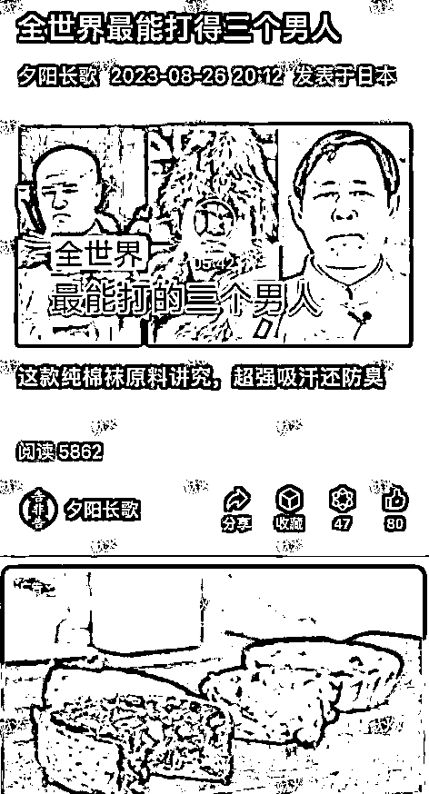

然而，在当前GPT爆文的趋势下，如果公众号文章全部是视频，则可能会失去系统推荐。为了既不失去系统推荐，又能增加用户在文章底部的停留时间，可以在文章末尾添加视频或吸引人眼球的图片等内容，以最大化底部的停留时间。

总结：

*   广告有效曝光取决于系统算法，显示时间越长，可能性越高。

*   视频文章ecpm高，但大量发布视频会影响推荐。

*   可在文章底部放视频或其他内容，延长用户停留时间。

##### 2、提高广告的点击率

很多使用微信公众号作为流量来源的人可能会忽视一个重要功能，那就是广告屏蔽。

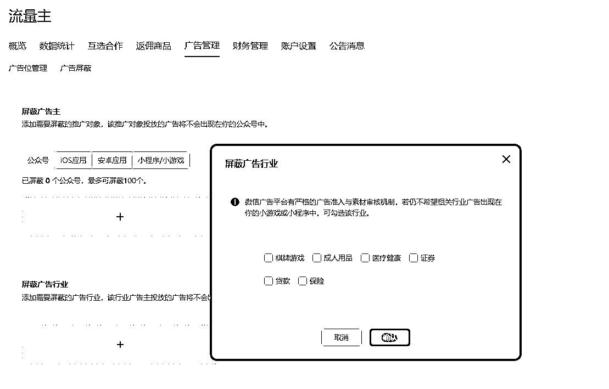

这个功能允许我们基于公众号粉丝的特征来屏蔽那些他们不可能感兴趣的广告。例如，如果你的目标受众是中老年人，你可以选择屏蔽那些针对年轻人的游戏广告，如“电动车”等。

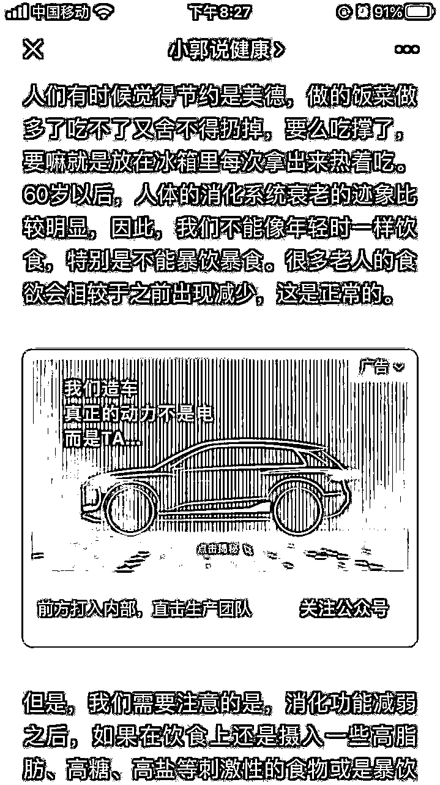

相反，对于那些中老年男性用户可能会感兴趣的广告，则应当保留，因为这些广告的点击概率很高。这告诉我们，注意到并优化这些细节非常关键，因为没有优化点击率就永远不会有提升，而一旦开始优化，就有可能大大提高收益。

总结:

*   利用广告屏蔽功能，根据粉丝属性屏蔽不相关的广告。

*   投放与粉丝群体相关的广告，提高点击率。

*   优化广告策略，即使微小的调整也能带来收益提升。

##### 3、建立私域流量池，实现粉丝变现

在公众平台的流量红利逐渐减退的今天，建立并维护一个私域流量池变得尤为重要。通过吸引读者加入微信群、订阅号等，你可以更直接、更频繁地与你的粉丝互动，从而提高他们的活跃度和忠诚度。

在私域流量池中，你可以更自由地进行内容分发、产品推广及用户调研等活动，这些都是提升流量主收益的有效手段。同时，通过精心策划的活动，如线上研讨会、限时优惠等，可以进一步激发粉丝的消费欲望，实现更高效的粉丝变现。

平台推荐机制无法改变，但我们可以通过沉淀私域流量来提升收益。

具体方法是将公域流量引流到私域群，例如通过文章引导用户扫码加群、参与活动等方式，私域群可以反复触达用户，建立信任关系，从而提高转化率和复购率。

如下图所示，可以利用公众号文章、朋友圈、视频号等多种渠道引流到私域群。

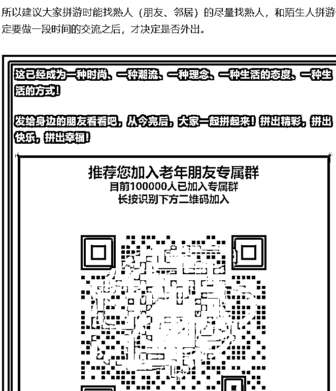

沉淀私域流量可以让我们更稳定地运营用户，获得更高的收益。

总结:

*   公域流量不可控，私域流量可反复触达。

*   通过多种渠道引流到私域群，建立信任关系。

*   沉淀私域流量，提升收益和抗风险能力。

## 三、公众号项目的未来趋势以及应该如何应对。

为什么讲自媒体的历史呢？

是因为我觉得公众号未来，也会和头条号、百家号一样，会走向单价降低、内容质量要求更高的方向。

趁着还能捞公域流量的时候，尽快开始规划做IP、做私域，开始谋划卖产品了。

另外，公众号图文内容，未来必然也会和头条、百家一样，支持投放，现在有一些号就已经收到【账号成长】的邀请了，其中包括2部分：【内容助推】、【成长足迹】。内容助推就是投放了。

如果你布局好自己的产品以及带货文章，未来只要ROI为正，就能通过投放持续放大了，让我们做好充分准备，迎接这个美好未来吧。

最后，祝大家国庆假期快乐，流量暴涨，财富暴涨，健康值暴涨！