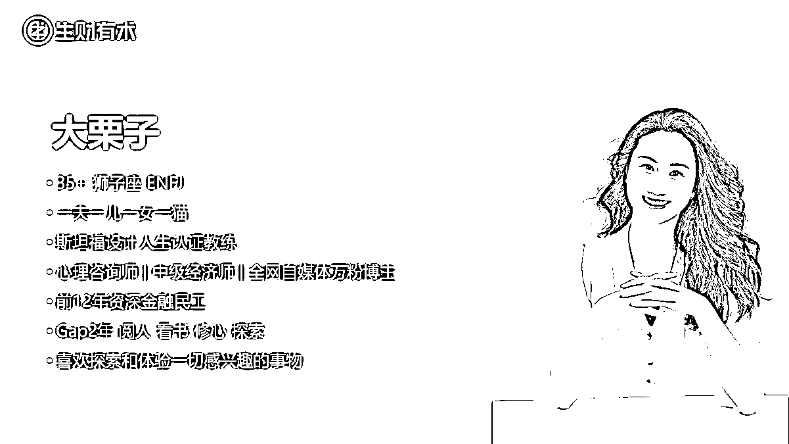
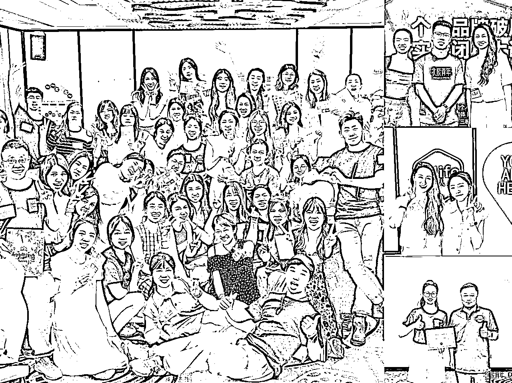

# 88年已婚宝妈，裸辞GAP的第823天，她活成了什么样？一个折腾十连败正在上岸的人生故事

> 来源：[https://t2hixgbynr.feishu.cn/docx/EWuldIVEGoByaEx3o9ncOaXbnvc](https://t2hixgbynr.feishu.cn/docx/EWuldIVEGoByaEx3o9ncOaXbnvc)

各位圈友好，我是大栗子，今年418加入生财的新人，在生财主动链接过项目、跑过航海（均全勤上岸）、当过志愿者，是一位身体里住着不安分的灵魂，却循规蹈矩生活35年+的人间小太阳ENFJ。

以下是我暂时的名片，很高兴能被大家认识。

前天我在公众号上发布了第一篇文章，是关于我自己的人生故事，原先一直以为普通人的故事应该没人感兴趣，但没想到发布后还是掀起了一些小波澜，收获了很多认可和赞许，给很多朋友带去了共鸣和力量。

雪姨鼓励我把故事分享到生财来，帮助我一起调整了内容，希望可以给正在迷茫而求索或者被焦虑包围的圈友们带来一些力量。

全文5763字，阅读时间约15分钟。

我曾是一位资深的金融民工，在银行度过平平无奇又夹杂着酸甜苦乐的12年。

*   享受过单位福利，收编了一位老公，生养了两个孩子；

*   面对过不公和不甘，拥有特别悲伤痛苦的5年转正经历；

*   也感受过一飞冲天的快乐，直接从一线的乡下员工竞聘至一位难求的总行管理岗。

工作内容本身对我来说没什么难度，凭着不会就学的心态，学的又好又快的实力，应对的得心应手，总体来说，混得不错，领导认可，同事喜爱。

* * *

# 一、那为什么要裸辞？

## 1、因为家庭

提离职时，同事都觉得特别突然和意外，因为我看着就是不会辞职的人。

几位高层领导给我做思想工作，直属领导也找我谈话好多次，他们一致以为是因为工作太忙导致我没时间照顾孩子。

有些说给我介绍好的阿姨，也有提出让我再坚持一下，有空闲的岗位腾出来就给我。

这确实是原因之一，因为家里长辈都有事业，没时间来帮衬我们这个双职工小家。我时常觉得自己像个陀螺，单位里上班、加班忙完，还得应对家庭和孩子，接送、辅导作业、三餐、洗衣拖地等等，同事吐槽我“周末总有一天是失联的”，因为我得“沉浸式”做家务。

但就算这么辛苦，我做的这些，就跟社会中众多被隐形家务淹没的女性一样，常常“不被看见”。

我的确这些事情“崩溃”过，但这并不是无法解决“重力问题”，就像我们领导说的：

请个阿姨就能解决大半。

所以，这个理由其实并不足以让我裸辞。

## 2、因为工作本身

让我印象比较深刻的是跟直属领导的最后一场对话，他在问了一堆问题后，终于抵达我离职的根源，因为我觉得：

有些工作的存在根本没有意义，且特别消耗时间和精力，而我们又必须为了漂亮的数据不得不做，甚至得加班做，人只活一世，我不想让自己的余生浪费在这种无法获得成长，又无法产生价值和效益的事情上。

对！我的确是一个追求个人成长、价值感、意义感、归属感高过高薪、权力的理想主义者。

## 3、因为那是别人的期待

这份工作从一开始就是不我内心的选择，而是父母的期待。

大学是我截止目前人生曲线中最精彩的一段，当团支书、协会会长，拿奖学金、优秀学生干部、市优秀志愿者等，组织义卖捐助山区小学、开展志愿者活动，混的那是风声水起。

2010年，临近毕业，班导和辅导员都劝我留在大城市，我也有意向。当时我有一家开了两年的淘宝店，虽做的不大，但从供应链到渠道到销售都已跑通。我跟父亲说，我想在大学边开家女装店然后顺便做淘宝。

我爸当时说：

“你一个大学生出来，开小学生也能开的服装店像什么话？”

在他的强烈要求下，我回家考了银行。我至今都记得，他们站在边上看我练点钞，欣慰的说：

“咱家栗子，就是天生的银行料。”

11年时，我还是不甘心，便再三让堂妹开淘宝店，帮她注册店铺，教她操作，短短三五年，她财富自由，全家搬去准一线城市，买大房换豪车，孩子也在那上学了。

我为堂妹高兴，但并不妨碍这成为我的“遗憾催化剂”，我打趣爸爸错失一位“富婆女儿”。

我爸笑笑说：

“你现在这样一家四口安安稳稳不也挺好的吗？”

安稳，确实挺好，也确实是父母最希望看到的样子。

但“没做自己想做的事而错失机会”却是我心里最大的遗憾。

我承认我很孝顺、很贤惠，但我也不否认我向往自由、很叛逆、很不安分。

* * *

# 二、裸辞面对的不同声音

## 1、被理解

离职报告提交后，我给大学好友打电话，跟她说我提离职了。

她叹了口气，沉默了一会，然后跟我说：

“也好，这么多年真的辛苦你了，去做想做的事吧。”

我当时泪如雨下。

中年裸辞对于大多数人来说是件高风险的事，尤其是女性。

作为一个资深金融人，照理说，我不该做这么高风险的事。

但，我始终有个坚定的信念：

我相信自己可以，相信人生有无限可能，相信自己终将得到想要的。

## 2、被嘲讽

之后，常有同事跟我说：好羡慕你！

我回复：你也可以，什么时候开始都不晚。

回复：天真了，真是心灵鸡汤喝多了。

* * *

# 三、裸辞就遇见低谷，我都做了些什么？

我对这位同事的嘲讽嗤之以鼻，但他的话真的一语成谶。

没想到，裸辞即低谷，我独自一人在迷茫中摸爬滚打800多天。

*   低谷期确实不是一件让人舒坦的事儿~

*   重启人生也真不是一朝一夕就能成的容易事儿~

## 1、疯狂考证，难逃焦虑

一开始不知道干些什么，我就报考各种证书，为了躲避孩子吵闹，每天5点钟起床上课，两年时间考出了中级经济师、心理咨询师、高级家庭教育指导师、高级婚姻关系指导师，4个证书。

但是，生活的巨变还是引起了心理上的巨变，我内心被未来的焦虑、恐惧吞噬：

*   担心只出不进的经济状态

*   担心未来的发展情况

*   担心万一老公变心，我没有工作怎么争抚养权

*   担心给不了孩子更好的生活

*   ……

“担心”充斥在我生活的各个角落，我感觉自己又被淹没了。

## 2、排满To do list，搞到崩溃

于是，我又每天给自己排满了TO DO LIST，疯狂地看书、阅读、运动、学习、听播客、冥想，却时常因为完不成、做不好而更加懊恼，状态并不比“陀螺时期”好，甚至有时更差，崩溃时只能一个人跑到黑漆漆的车库里哭，家庭氛围每况愈下。

所幸，学习过心理学，也看了很多成长类、修行方面的书籍，开始慢慢疗愈自己。

（当时的TO DO LIST）

## 3、探索项目，十连败

我一边收拾自己的情绪，一边探寻想做且能做的事，除了接连考证顺利，其它探索却遭遇了十连败：

*   做书单号一个月，无涨粉，失败；

*   做VLOG，觉得过于耗费精力，放弃了，失败；

*   做混剪卖货，觉得自己像个机器，不想做，失败；

*   做口播，还特别去上了文案课，因为特别不自然，拍了几条也没发，失败；

*   做图文，每天耗费大量精力，发了四五十篇没有浏览量，断更，失败；

*   开聊天直播一个多月，有涨粉无变现，断播，失败；

*   做好物社群，有收入，但很少，也不是自己特别想做的，失败；

*   做AI+公众号爆文，日更一个月，没入池，断更，失败；

*   又重新找赛道做口播，小有所成，但卡在转化变现，失败；

*   另外又做了个号，涨粉飞速，无法变现，失败；

我是个特别愿意知识付费的人，以上学费，估算算也是超了5位数。但都没做成，我就嘲笑自己是棵绿到发蓝的大韭菜。

一开始真的很挫败，尤其看到社交平台上其他人裸辞翻身、月入几十万的，就更加焦虑了，甚至开始自我怀疑：

*   我真的有这么差吗？

*   为什么别人可以，我做就不行？

*   我真的太笨了！

后来，我麻木了，一边保持行动，一边对结果放手，给自己更多耐心去沉下心来向内思考：

*   我只知道自己要做自己想做的事，那我到底想做什么？

*   如果不是金钱，那我要追求的到底是什么？

*   我又可以给别人带去什么？

* * *

# 四、转机

## 1、初遇雪姨和生财

慢下来后，我不再自己瞎琢磨项目，开始感受生活，这个时候转机却来了。

一个百无聊赖的中午，我随机选了一档头部播客主理人陈雪的栏目（现播客叫：搞钱学姐），准备边洗碗边听。

那是她采访明白老师的一期，身体残疾、工作受限的明白老师竟通过生财年入百万，听完后我对“生财有术”产生了浓烈的好奇，虽然我两年前就知道生财有术，但当时并没想过加入，当再次听到，因为被明白老师的经历触动，我立马主动链接了雪姨，加入雪姨的社群，然后又加入了生财。

## 2、把手弄脏，急于求成

加入生财后，我发现这里简直就是搞钱项目的天堂，不仅有详细的项目操作手册、大佬的经验分享，还有陪跑航海。

回想上班时，曾经说过无数次：

“好想辞职啊，就是不知道可以做什么。”

当时就想，如果上班时就知道生财，也许我早就开始无痛副业，哪里还需要一边担心现金流一边找项目。

如果两年前就加入生财，我是不是已经小有所成，也不用在外面交那大几万的学费，毕竟这里一站搞定。

（这是部分航海截图）

我就像老鼠掉进米缸，强烈的信息冲击，使我眼花缭乱，恨不得天天泡在精华贴里看大佬们的风起云涌、看中标项目、参加航海，就想快点拿到结果。

1.  我参加了航海，还一次性报了好几个，整场体验下来，虽然全勤上岸，知识点是学到不少，但操作时总是精力不足，不能深耕，所以，结果是试过，但没坚持，也没结果。

1.  除了航海我也关注精华贴的项目，根据自己的情况主动链接了一个项目，变现闭环很快跑通，虽然操作简单，但体验过后也觉得不适合自己的长线发展的需求，变现不多但是没丢，当作一个小副业有一段没一段地经营着。

1.  除此之外，我想更了解生财、做一些利他的事，便在9月航海的时候报名了志愿者，联系船员、批改日志，体验下发现很多圈友正做着跟我一样的事，同时做很多事，精力被大幅切割，操作不深入，甚至连30个字的日志都写不好。

## 3、玩生财的反思，再度照见自己

生财半年，看过、体验过很多项目后，仍然没有拿到结果，甚至有一阵子看到星球里的赚钱贴就焦虑，但却给了我很多感悟思考，为我下一步的经历做了很多技能上和心理上铺垫。如果你也正处于这个阶段，我想跟你分享几点：

*   只关注自己会省去很多烦恼，，每个人每个阶段进行的课题都不一样，不要被外界裹挟，接纳自己的节奏，去关注今天的自己和昨天的自己进步了多少，距离自己的目标还差多少，而不是一看到别人做的好、别人赚钱就焦虑、感觉自己不行，开始自我否定。

*   试过的项目中途放弃没有关系，只要你有改变的念头、你还在生财，从这里摄取信息和知识、参与体验其它项目，都是收获，就算没有获取到金钱收益，也绝对有一些微小的改变，比过去的自己有了更多的经验和认知；

*   李笑来老师说过：速成是不可能的。大多数事情的质变，是由很多不同的量变组合而成的，同一个项目，你看到别人成功，却没看到人家在此之前的原始积累，我用参加过的公众号爆文航海打个比方，一个985本硕的文学生跟我一个普本的理工科生，在写作上的水平肯定是不一样的，他能快速拿到结果是必然，这是最底层的差距，在这个项目上，人家是真的从0到1，而我是从-10到1。我们当下做的每一件事都有可能成就未来，看清自己当前的位置，如果还未成，那说明我们还处于积累阶段，给自己更多时间和耐心不求立刻结果地去学习、经历和成长，改变是一个漫长的、螺旋形上升的过程。

*   找到自己，求财其实也是一个修内在课题的过程。这是最重要的一点，但我发现常常被忽视，这也是为什么很多人赚够了很多钱，在项目上拿到了大结果却仍然不开心的底层因素。在找项目的同时，也别忘记内观自己真正想要什么？自己有什么？自己擅长什么？没有金钱束缚你会想做什么事业？在这个“人生罗盘”的基础上，不足就去填、去学，去试，才不至于走很多弯路。

## 3、遇见新起点

想通这些后，我不再盲目跟风、急于求成，重新慢下来，决定先搞明白自己，找到一个可以沉浸下来深耕的项目。

我回归日常，按部就班地学习看书觉察成长，偶尔刷刷生财精华贴，每天在雪姨打卡群里发阅读打卡。

有一次，雪姨看了我的一篇文章后，问我要不要加入帮助1000个女孩找到自己的商业位置和价值的“千人计划”，成为她新播客的核心成员，但需要先学习斯坦福设计人生课。设计人生是利用积极心理学和设计思维，配套系统工具，帮助人们解决卡点问题的一种咨询。

因为接过个案，正愁心理咨询并不能满足我，总感觉差点东西，似乎斯坦福设计人生可以给我补齐，能融合我的经历、经验以及热衷的积极心理学，还有可落地的配套工具，简直就是量身定制。既有意义又有用，虽然费用近3W，但我还是果断参加了。

2024年7月是我GAP两年后最精彩的1个月，飞去广州开启了北辰青年超哥的闭门课，面基了一群相同价值观的人，然后是连着2次杭州的DT.School线下课学习，这个过程我真正体会到了社群相互支持的力量，真诚又温暖。

（右上：宣鱼&北辰CEO超哥&我；右中：我&雪姨；右下：我&DT.School 创始人王成老师）

学习完设计人生课后，我发现我真的找到了自己喜欢的新身份——设计人生教练。

因为淋过雨，我太知道孤身一人被卡在这个中间地段有多痛苦了，所以我想给同样被卡住的朋友带去一丝启发和温暖，成为他们的同行者和陪伴者。

但又遇见了新问题：从哪里找案主呢？

虽然有几个平台的千粉账号，但因为粉丝属性不同，引流效果并不理想。

我在朋友圈招募了一波，这时，曾经链接过的圈友应需而来。

因此，我在一个月内快速完成了30h+的教练认证任务，成为同批教练中的第一波取证人。

我热爱与案主的每一次深度对话，就像一面双面镜一样，照见我自己，也帮助案主照见自己，我也真心地为案主的收获和改变而感到开心。

生财为我的新启程做了“最佳暧场”。

## 5、终于对曾经的失意释怀

学过生财思维和设计人生，我对过去的失意开始释怀。

*   曾经的那些尝试并不是半途而废，而是“最小MVP”，是“原型设计”；

*   所谓的低谷期也只是人生常态，那是从过去到未来的中间地带，我只是暂时被卡住，只需要放平心态、保持行动、保持耐心，终能遇见曙光；

*   项目中断也不是三心二意，想做的事可以不止一件，人生也可以有多个可能性。就像我热爱教练，但不代表我今后只做教练这一件事。

拥有了稳定的内核之后，曾经的失败似乎都变成了工具，每一次行动都有价值，自我否定才是虚幻。

*   以前的十连败、在生财学过的各个项目都变成我的最好辅助；

*   学过的心理学、看过的书、对金融的见解成为了我的教练厚度；

*   加入的各种社群、链接过的人也渐渐变成另一种资源的转化。

就像纪录片《施图茨的疗愈之道》里的“珍珠串”理念：

“我是把下一颗珍珠串在绳子上的人”。

不管结果好坏，你要做的是保持行动。

画一串珍珠，一条线，一个圆圈，以此类推，每个圆圈代表着一个行动。

别给行动贴上不同的价值标签，它们都有相同的价值，只需要去做就好！

* * *

# 五、说在最后

那天写完去收了个快递，有了个有意思的新发现：

*   这天除了是我裸辞的第823天

*   也是我正式拿到设计人生认证教练实体证书的第1天

意义在此刻得到了美好的闭环。

之前，对于自称“心理咨询师”没有底层自信，

但今天我却可以自信满满地介绍我自己：

你好圈友，

我是设计人生认证教练大栗子，

很高兴认识你！

如果你的人生暂时被卡住，不要灰心，一定要相信美好终会到来。

我很喜欢设计人生的一个理念：

保持好奇，不断尝试，早点开始，早点失败，早点成功。

尽管下场把手弄脏，你我终将完成那串独特的璀璨夺目的“珍珠串”。

