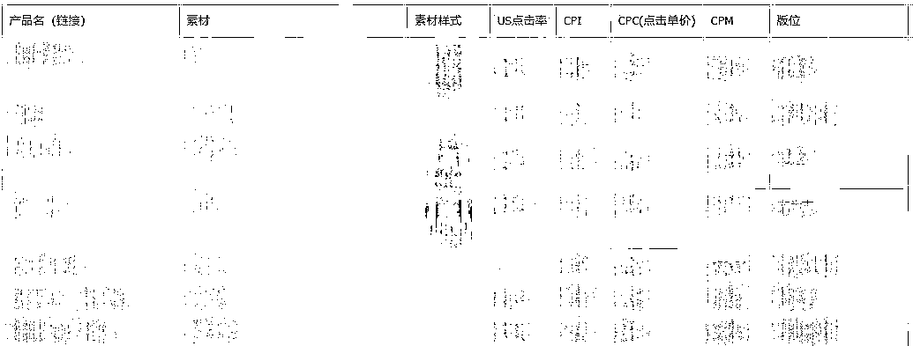
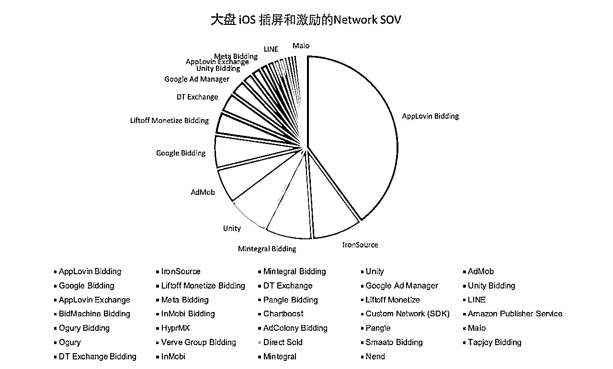
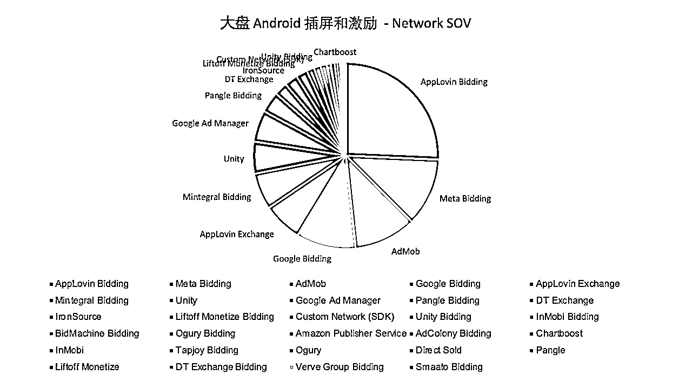
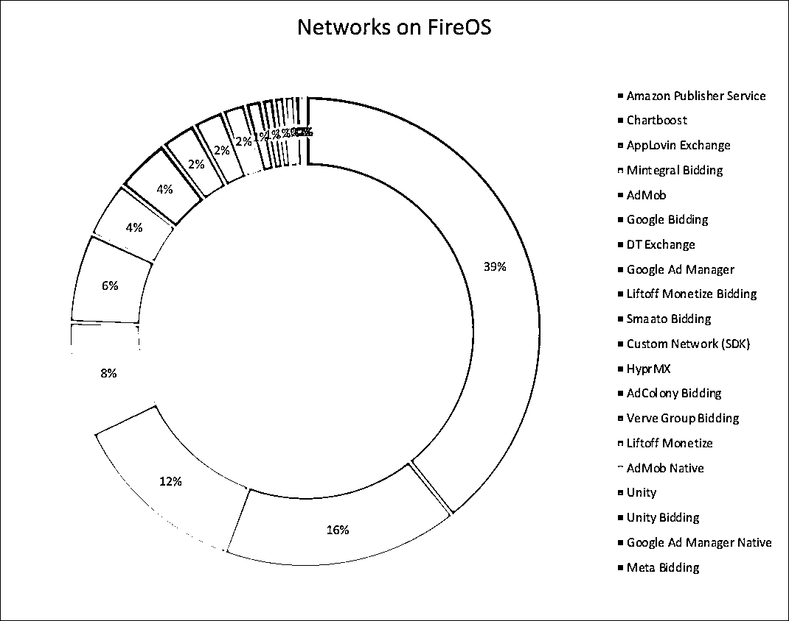
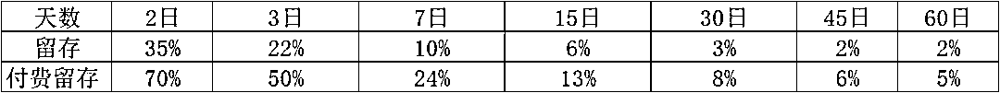
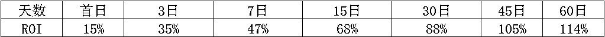
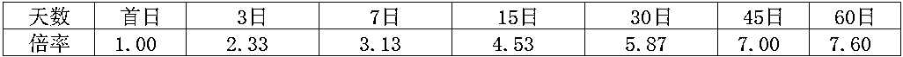
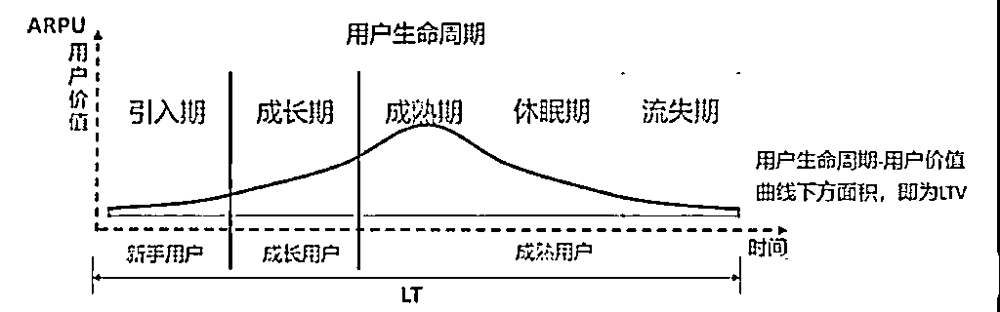
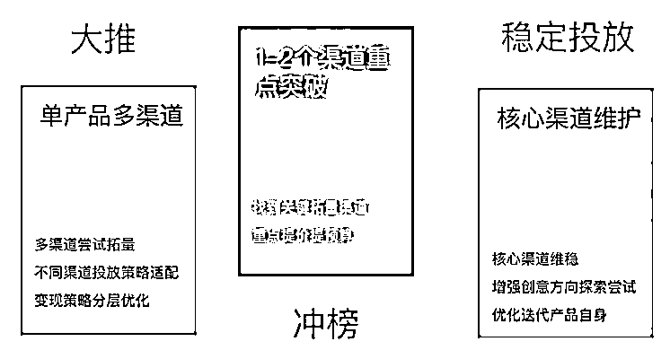
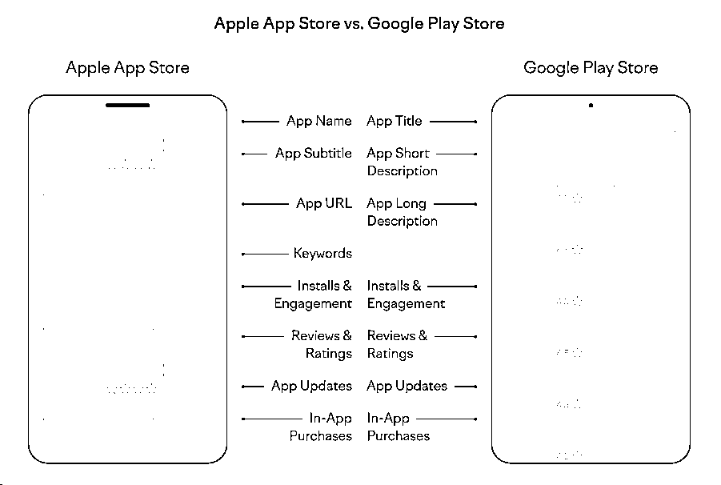

# 如何发行一款风靡全球的游戏

> 来源：[https://lakyojchrz.feishu.cn/docx/Ejc0dFHOQobgGzxDmurc8sVxnXb](https://lakyojchrz.feishu.cn/docx/Ejc0dFHOQobgGzxDmurc8sVxnXb)

引言：

不知大家是否好奇如何发行一款风靡全球的游戏？一般会有哪些流程以及需要关注哪些指标？

时间有限，我将简要介绍海外游戏发行要点（其他品类可参考），欢迎同行补充~

# 一、立项阶段：

## 市场调研

市场调研：俗话说知此知彼，方能百战百胜。市场调研是游戏发行的第一步，它帮助我们了解市场环境、竞品情况以及目标用户群体。近几年呈现出重度游戏轻度化，以及休闲游戏往中重度发展趋势，不同题材的融合以及创新玩法需要重点关注。

### 竞品分析

*   竞品游戏内容：常见从核心玩法、数值、美术画风、商业化等角度分析

*   竞品用户画像研究：了解竞品的用户群体特征，画风喜好、付费能力等

*   竞品基础数据调研：收集竞品的下载量、收入、留存等信息

*   竞品市场打法分析：研究竞品的营销策略和用户获取方式，在不同地区的市场表现等

游戏圈推荐公众号：

以下是我常关注的号，经常会分享些亮眼的新游、游戏拆解、对话游戏制作人等内容，值得日常刷刷

曾嵘胡扯的地方、SensorTower、GameLook、罗斯基、出海斯基、游戏陀螺、游戏日报、游戏葡萄、DataEye、dataai CN、游戏产业报告、游戏茶馆、GameRes游资网、姑婆那些事、竞核、手游那点事等等

### 市场环境分析

*   IP渗透率调研：评估目标市场的IP接受程度。

*   本地支付调研：了解目标市场的支付习惯和偏好。

*   本地渠道调研：研究目标市场的推广渠道和效果。

*   本地政策调研：了解目标市场的法律法规和政策限制。

推荐工具：

如下平台可满足竞品分析、分品类榜单、广告素材分析等日常需求。

| 平台名称 | 网址 | 服务范围 | 优势 | 劣势 |
| 广大大 | https://www.socialpeta.com/ | 国内外 | 1\. 提供广泛的广告素材资源； | 1\. 主要覆盖海外市场，国内数据积累有限； 2\. 订阅费用较高，且限制设备数量； 3\. 用户界面操作不便。 |
| 热云 | https://www.insightrackr.com/ | 国内外 | 1\. 价格实惠，支持多人共享； | 素材数据精确度略低于广大大。 |
| Sensor Tower | https://sensortower.com/ | 海外 | 1\. 素材查询界面设计优良； | 设备和邮箱双重绑定，对小团队而言成本较高。 |
| App Annie（data.ai） | https://www.data.ai/ | 海外 | 提供深入的应用性能、市场趋势和用户行为分析，优化应用策略。（现已被Sensor Tower收购） | 数据不太精准 |
| DataEye | https://www.dataeye.com | 国内外 | 能深入分析广告投放背后的运营信息。 | - |
| AppGrowing | https://data.appgrowing.cn/ | 国内外 | 1\. 界面优化，满足优化师需求；2\. 操作便捷，适合竞品调研； 3\. 价格实惠，无设备和账号限制。 | 素材覆盖范围和全面性略逊于广大大。 |
| Similar web | https://similarweb-china.com/ | 国内外 | 具备分析竞争对手网站和应用的关键功能，能够深入洞察流量、用户行为和流量来源等方面 | - |
| 头条广告情报 | https://bigbigads.io/main/ads | 国内 | 提供游戏、应用和电商广告素材查询；支持下载素材和查看素材着陆页。 | 基础版免费（查询数量有限），高级版需要付费或者邀请好友获得。 |
| 七麦数据 | http://qimai.cn | 国内 | 提供App Store和安卓市场的应用基本信息和深入数据分析。 | - |

## 投放测试

在当今同质化严重非常卷的市场环境下，测出便宜且合适的买量素材成为立项初期最为关键的一环，这里强调合适，是因为测出便宜的素材的同时，还需要关注产品留存和变现情况。（我们曾测出单价为平时1/3的素材，围绕这个素材去做了几次demo，然而次留都只有十几，最终放弃了这条素材）

### 吸量测试

1.  吸量测试的重要性：

*   吸量能力是判断游戏潜力的首要因素

*   吸量测试有助于节约买量成本，提高ROI

*   画风和玩法是影响吸量的关键因素，决定产品方向

1.  画风测试：

*   画风测试的目的是节约买量成本，提高LTV（用户终身价值）

*   画风对SLG等重度游戏的LTV提升困难，但可以通过控制成本来提高利润

*   画风对同类玩法下的产品规模有显著影响

1.  如何进行吸量测试：

*   渠道选择：海外推荐使用Facebook、Google等主流渠道进行测试，国内一般使用巨量

*   测试时间：选择投放地区的黄金时段进行测试，通常1-3天内完成

*   广告搭建：确保素材有公平的曝光机会，避免素材消耗不均

*   出价方式：建议使用自动出价，或根据CPI进行手动出价

*   预算设置：为每套测试素材设置独立预算

### 留存测试

*   核心玩法验证：通过留存测试，我们可以评估玩家对游戏核心机制的兴趣和参与度。这包括关卡设计、游戏挑战、奖励系统等是否能够激发玩家的持续兴趣。

*   用户体验优化：留存测试不仅帮助我们了解玩家的留存情况，还能揭示可能影响玩家体验的问题。通过分析玩家在游戏中的行为数据，我们可以识别并解决可能导致玩家流失的痛点。Voodoo家混变产品标准为次留45%，7留15%，30留10%。

### 测试分析

*   画风测试可以确定核心玩家画像和吸引玩家的元素

*   通过多组素材对比测试，筛选出CTR（3%以上比较好）、CVR、CPI较好的素材

*   多轮测试有助于积累偏好数据，如角色的CTR反馈和商店主页的CVR转化率

常见问题：

*   不吸量可能是由于渠道不全或规则压制

*   吸量但留存差可能是用户画像出现偏差

*   测试时需注意渠道全面性和人群画像精准性

广告归因平台选择

1.海外除了Google和Facebook外，大多数广告渠道要求使用第三方归因平台。

2.多数海外广告归因平台都提供了一个月的免费试用期，其中AppsFlyer和Adjust两家占据了大约80%-90%的市场份额。

3.不过也有像Kochava和Tenjin这样的小众，不但便宜功能又基本够用的，特别适合小的开发者。

常见归因平台及其特点：

| 归因平台 | 官网 | 服务范围 | 优势 | 劣势 |
| AppsFlyer | https://www.appsflyer.com/ | 国内+海外 | 提供快速、精准的归因分析和深度链接功能，ANR和崩溃率很少 | 价格昂贵 |
| Adjust | https://www.adjust.com/ | 海外 | 功能与AppsFlyer类似，但价格更具优势 | 部分高阶功能需单独额外付费 |
| Singular | https://www.singular.net/ | 海外 | 适合需要精细化管理大量广告渠道的企业 | 价格相对实惠 |
| Kochava | https://www.kochava.com/ | 海外 | 提供每月1万次免费转化的基础套餐， | 适合预算有限的小开发者 |
| Tenjin | https://tenjin.com/zh/pricing/ | 海外 | 提供免费的2000次月度归因量，付费版提供高级分析功能。 | 适合中小型企业 |
| Adspark | https://www.csjplatform.com/adspark | 国内 | 完全免费，可支持多方投放渠道，以及广告聚合以及内购收入回传，迭代较快客服响应支持也做得不错 | 可能存在数据安全问题（数据全都让平台知道了，利润空间变小~） |
| 热云（TrackingIO） | https://new.trackingio.com/#/home?apptype=wap&campaignid=d7dbd2242cf75f2922d3eade6e313487&cid=8048&null | 国内 | 基础功能免费，比较合适内购较重的产品使用 | 不太适合IAA类产品，可提供分析的数据颗粒度较粗糙。按流量收费。 |
| 友盟 | https://www.umeng.com/ | 国内 | 基础功能免费，行业的老前辈，除了数据统计还发展了很多其他的相关业务 | - |
| TalkingData | https://www.talkingdata.com/product-AdTracking.jsp?languagetype=zh_cn | 国内 | 基础功能免费，涉及行业广泛，游戏数据统计在友盟基础上有一定的进步 | - |

# 二、测试阶段

### 产品迭代

调优目标：平衡产品的留存和变现能力，最终保证LTV>CPI（做产品不是搞慈善，赚钱才能长久活下去）

留存优化：

*   设定进度目标、分析流失原因、每日奖励、运营活动、设置关卡奖励，调整游戏数值等，以提高玩家留存。

*   核心玩法、玩法深度、目标进度、成就指引是影响用户在线时长的主要因素。

### 商业化调优

广告变现：

*   广告策略测试：测试广告展示频次、时机以及用户接受度

*   增加广告渠道以提升Ecpm

MAX聚合不同系统，各渠道占比情况：

聚合选择

看到圈友@Louisa 曾写过关于海外聚合精华帖《高效使用广告聚合 & 优化竞价策略，让海外应用广告收入提升 30%》https://scys.com/articleDetail/xq_topic/218242112828881

两年过去，变现领域发生了翻天覆地的变化，全面Bidding时代已经来临。关于聚合选择，按照市场占有率以及实际表现供参考：

| 聚合 | 服务范围 | 品类 | 优势 | 劣势 |
| Admob | 海外 | 工具类 | 可与Google Adwords、Firebase等谷歌自己产品直接打通 | 对其他家不友好，没什么填充。除Meta外的bider的收入参与分成。 |
| MAX | 海外 | 游戏类等 | 官聚渠道多，ecpm高 | 运营可操作空间较小，数据颗粒度较粗 |
| Ironsource | 海外 | — | 支持各种维度的数据，支持多种运营策略操作 | IS自身表现太差，整体ecpm比较差 |
| Topon | 国内+海外 | 工具居多 | 1、支持精细化运营策略操作 2、自家的ADX效果尚可 | 主要只有国内开发者知晓 |
| Tradplus | 国内+海外 | 工具+游戏 | 提供Saas服务 | 主要只有国内开发者知晓 |
| Gromore（穿山甲） | 国内 | 网赚 | 迭代很快，有很多隐藏功能需要找AM开白名单即可试用 | 对自家流量倾斜 |
| ToB（Sigmob） | 国内 | 游戏居多 | 自家独有按用户展示频次做用户分层 | - |

内购：

*   通过优化关卡难度、礼包物品组合、礼包展示时机等手段提升付费率及付费arpu

### 买量测试

素材准备：优化广告素材对于吸引用户和降低买量成本至关重要 。具体的设计所需工具圈友也已有详细整理

优化素材的手段：

*   创意裂变：不断对现有素材进行调整和创新，以适应市场变化和用户疲劳

*   用户视角：从用户的需求和兴趣出发，制定更具吸引力的素材创意，常见如真人素材，解说类，可玩素材等

*   游戏视角：突出游戏的特色、玩法、福利和更新，直接反映游戏内容

*   数据驱动：利用数据分析来测试和优化素材，确保素材的持续吸引力和转化效果

*   灵感与套路：结合创意灵感和经过验证的素材创作套路，提高素材的成功率

投放回本估算：

目的：

*   根据测试版本数据估算回收模型，确定不同国家及渠道合理的回收周期和首日ROI目标。

*   观察ROI增长曲线，结合留存数据，制定游戏优化策略。

计算回收倍率：

*   倍率即是某时间段内总回收/首日回收比值，倍率高代表产品回收效果好。以某产品为例：

那么相对应倍率为：

可以看出，这款产品留存衰退非常快，但7天后留存衰减明显减缓，D45天已经回本。往后就是利润了。

LT计算：

根据留存数据模拟留存曲线，估算人均CPI与每日ARPU计算回本周期。

LTV = LT * Darpu

高效在线拟合工具：https://tools.logiconsole.com/

### 本地化

内容本地化

*   本地习俗文化要点提炼：了解目标市场的文化习俗，调整游戏内容以避免文化冲突。

*   本地语文本翻译&校验：将游戏文本翻译成目标市场的语言，包括界面文字、帮助文档、教程等。

*   本地语配音：为游戏角色提供本地语配音。

*   美术和设计：调整游戏的视觉元素，如角色设计、颜色使用、图形风格等，以符合当地审美。

推荐工具:

*   翻译和协作平台：

*   Crowdin：提供游戏翻译管理，支持多种文件格式。

*   Lokalise：专注于软件开发的协作翻译和本地化管理平台。

*   Transifex：提供翻译管理和本地化服务，支持API集成。

*   音频本地化：

*   Iyuno Media Group：提供高质量的媒体本地化服务，包括配音、字幕和音频描述。

技术本地化

*   支付系统适配：确保游戏的支付系统与目标市场的支付习惯相匹配

*   社交平台集成：将游戏与目标市场的社交平台进行集成

# 三、全面推广

### 上架应用商店

国内商店：硬核渠道（华为小米oppovivo）、TapTap、好游快爆、233乐园、应用宝、百度手机助手、360手机助手、豌豆荚、魅族、联想、三星商店

海外商店：GooglePlay、Apple store、Amazon Appstore、Aptoide、三星Galaxy Store、华为AppGallery、OPPO App Market、Vivo App Store 韩国：One store、俄罗斯：Ru store

### 市场预热

1.  渠道首发准备：

*   与渠道沟通以预估首发量级，这有助于制定精确的市场策略。

*   设计并制作吸引用户注意的首发素材，如横幅、图标、截图和预告视频。

*   确立视觉宣传策略，包括主平面、视觉风格和主要平面符号，以保持品牌形象一致性。

*   确认首发时间和相关预热及后续推广活动，确保活动与首发时间相协调。

*   设定分阶段、分轴线的宣传主题，明确每个阶段的目标和信息传递。

*   规划新闻发布和软文推广的时间轴线、新闻点、主要标题和数量分布，以维持市场关注度。

1.  资源位置确认：

*   确认首发资源在渠道上的具体位置，例如应用商店首页推荐或特色栏目。

*   对准备发布的所有素材进行最终检查和优化，确保在不同设备和平台上的展示效果。

*   列出包括社区、论坛、社交媒体在内的非投入型媒体清单，并规划如何有效利用这些渠道进行宣传。

### 投放大推

素材创意设计与制作

*   素材方向确立：根据市场趋势和用户偏好，确定广告素材的创意方向。

*   素材审核与优化：审核素材成品，优化制作流程，提升素材质量。

投放方向工作

*   制定推广方案：根据明确投放渠道、广告定向、出价方式以及数据考核标准，推广节奏

*   渠道选择：基于历史买量数据、竞品分析、地区特性以及团队的渠道擅长情况来选择适合的投放渠道。

*   账户结构搭建：构建账户结构，包括通投、人群包等，研究市场流量趋势和竞品投放情况，以优化广告效果。

*   测试与调整：持续测试不同的广告定向和素材，根据数据反馈调整投放计划。

*   定期报告产出：积累一段时间数据回滚后，对回收和素材进行复盘，为后续推广提供数据支持。

广告批量发布工具：bidalgo、XMP

海外投放渠道：

Google（量最大最多）、Meta（用户年龄偏大、付费较高)、Unity、Applovin、Mintegral（适合IAA游戏）、Tiktok（用户偏年轻）、Yandex\VK(俄罗斯）、CPE渠道（Mistplay、Adjoe）等

国内投放渠道：

巨量、腾讯（偏中重度）、快手、硬核厂商（华为小米OPPOVIVO）等

### 应用商店优化 (ASO)

App Store和Google Play在ASO方面有一些关键差异。App Store独有关键词和副标题这两个元素，而Google Play则允许添加一个简短描述字段，这是App Store不具备的。在Google Play，关键词的索引方式与Google搜索相似，会考虑应用的所有文本元素，因此建议在各个字段中重复关键词3-5次以提升排名。相反，在App Store中，重复关键词并不能提升应用的搜索排名，因此这种做法是无效的。

针对这两个平台，以下是影响应用排名的关键因素：

| ASO优化目标 | 描述 | 推荐工具 |
| 关键词优化 | 获取APP在海外市场的关键词排名、得分、推荐关键词、用户评分、转化率等数据。 | Mobile Action、Meatti、App Radar、Priori Data、ASOdesk、TheToo、Keyword Tool |
| 产品页面优化 | 提供ASO报告，分析APP产品，给出标题、截图、图片、视频、描述等优化建议。 | AppTweak、Meatti |
| 评分分析 | 了解用户对APP产品的评论，分析用户喜好。 | Appbot、Apptentive、Mobile Action、TheTool |
| A/B测试 | 提供上线前优化建议，测试不同图标、截图、视频说明对应用安装的影响。 | Splitmetrics、Store Maven、TestNest |
| 搜索广告优化 | 优化Apple Search Ads广告，跟踪用户从广告点击到应用内操作的路径，合理利用预算。 | SearchAdsHQ |

### 社交媒体运营

*   Facebook：适合建立粉丝页面、官方品牌页面和游戏社区，进行视频、图像和内容的推广，制定粉丝页的拉新策略。收集用户反馈意见，保持粉丝页的活跃度，提高用户粘性

*   Instagram：以其年轻化的用户基础和高用户活跃度，适合进行网红营销和视觉内容推广

*   Twitter：适合发布游戏更新、新闻和与玩家互动，尤其是对于关注游戏新闻和电竞的粉丝

*   TikTok：以其年轻用户群体和创意内容形式，适合进行游戏预告片和挑战赛等互动性内容的推广

*   YouTube：作为视频内容的主要平台，适合发布游戏预告片、教程和幕后视频

*   Discord社区：搭建Discord社区，提高用户交流和参与度。

KOL营销

*   竞品KOL打法调研：研究竞品的KOL营销策略。

*   KOL信息验证：验证KOL的影响力和真实性。

*   代言人效果评估：评估代言人的效果和价值。

*   KOL推广全案制定：制定KOL推广的全案策略。

推荐工具：

*   Hootsuite：管理多个社媒账号，安排内容发布和监控社媒表现

*   Sprout Social：提供全面的社媒管理解决方案，包括内容发布、客户互动和数据分析

*   Buffer：简化内容计划和发布流程，提高运营效率

*   Brandwatch：社交媒体监听和分析工具，追踪品牌提及和市场趋势

*   SEMrush：监控社交媒体上的关键词表现和竞争对手活动

推荐工具：BuzzSumo, NinjaOutreach，Famepick、 CelebExperts、talentresources

### 用户数据分析

在游戏发行中，数据分析是至关重要的环节，它帮助我们理解玩家行为、优化游戏体验，并推动游戏的成功。以下是一些关键的数据分析方法，以及它们在游戏发行中的应用：

1.  目标拆解法：

*   用于KPI拆解，将整体目标分解为可执行的小目标，以便于落地和跟踪。

*   在游戏发行中，可以拆解游戏收入目标，分析不同因素如用户获取成本、转化率、留存率等对收入的影响。

1.  5W1H分析法：

*   通过回答“什么（What）、为什么（Why）、谁（Who）、何时（When）、何地（Where）、怎样（How）”来全面分析问题。

*   在游戏DAU下降的情况下，这种方法有助于识别导致下降的具体原因。

1.  漏斗分析法：

*   用于分析用户在完成特定目标路径上的转化率，如注册、购买等。

*   在游戏发行中，漏斗分析可以帮助识别用户在游戏过程中的流失点，从而优化用户体验和提高转化率。

1.  用户分群法：

*   根据用户属性和行为特征将用户分为不同的群体。

*   在游戏发行中，用户分群有助于实施精细化运营策略，针对不同用户群体提供定制化的推广和维护措施。

1.  AB测试法：

*   通过对比测试不同版本的游戏设计或功能，评估其对用户体验和关键指标的影响。

*   在游戏发行中，AB测试可以用来测试新的游戏特性、营销策略或定价模型，以找到最佳方案。

1.  TGI指数分析法：

*   TGI指数用于衡量特定用户群体对某个特征或行为的偏好程度。

*   在游戏发行中，TGI指数可以帮助识别对特定活动或游戏内容偏好较高的用户群体，从而设计更有针对性的营销活动。

用户行为分析工具

| 工具名称 | 应用场景 | 优势 | 产品类型 | 官网链接 |
| Google Analytics | 网站流量分析、移动应用分析、广告效果跟踪 | 免费使用，全面数据跟踪，与Google服务集成 | 网站、移动应用、电商平台 | https://developers.google.com/analytics |
| Firebase Analytics | 移动应用数据分析、用户行为跟踪、应用内事件分析 | 实时分析，集成Firebase服务，免费使用 | 移动应用（尤其是Android应用） | https://firebase.google.com/docs/analytics |
| Apple App Analytics | iOS应用的下载和使用分析、用户行为跟踪、广告效果评估 | 原生集成，用户隐私保护，易于使用 | iOS应用 | https://developer.apple.com/app-store-connect/analytics/ |
| 数数科技 | 可深入了解用户行为，优化产品体验，提升用户留存和转化率。 | 实时数据分析、多维度分析、集成便捷 | 移动应用、小程序均可 | https://mtsyx.higgsyx.com/ |
| Mixpanel | 用户行为分析、漏斗分析、用户留存和转化分析 | 用户行为分析详细，实时数据，易于使用 | 移动应用、Web应用、SaaS产品 | https://mixpanel.com/ |
| Tableau | 数据可视化、商业智能分析、高级数据分析 | 强大的数据可视化，灵活的数据连接，高级分析功能 | 各种业务数据分析需求 | https://www.tableau.com/zh-cn |

## 后记：

1、随着国内游戏市场的日益饱和，众多开发者开始将目光投向海外，寻求新的增长机会。然而，随着越来越多的参与者加入这场全球竞争，海外市场的成本也在悄然上升，回本周期逐渐拉长，市场竞争愈发激烈。在这样的大环境下，游戏发行的复杂性和挑战性也在不断增加。

2、本文所分享的发行内容，仅仅是对游戏发行这一庞大话题的浅尝辄止。游戏发行是一个涉及众多环节的复杂过程，它不仅仅关乎市场运营和广告投放，还涉及到用户研究、创意设计、变现策略、社交媒体运营以及项目协调等多个部门的紧密合作。

3、每个部分的工作都值得深入探讨和研究。由于篇幅和时间的限制，本文只能对这些环节进行简要的介绍。但我相信，通过本文的分享，对游戏发行感兴趣的朋友至少可以对发行的基本流程有一个大致的了解。