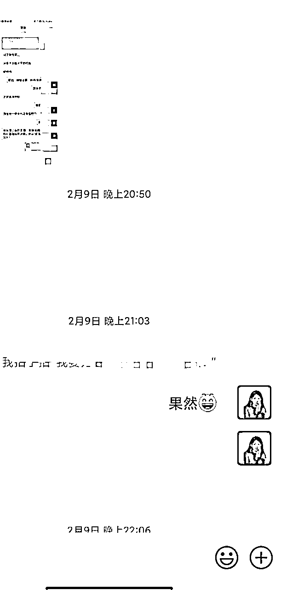
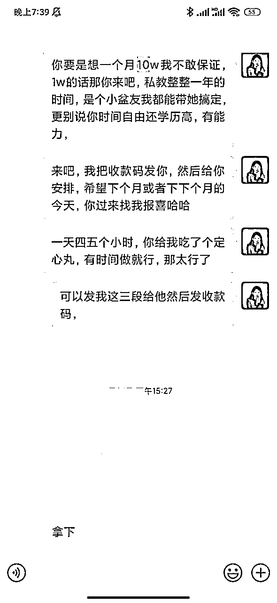

# 40个高客单私域谈单心法，助力你轻松做转化

> 来源：[https://s1db162mjkr.feishu.cn/docx/FeDodK0swoDGCBxOkMvcNgzqnAb](https://s1db162mjkr.feishu.cn/docx/FeDodK0swoDGCBxOkMvcNgzqnAb)

你好，我是葡萄，一名谈单教练，助力普通人靠沟通逆天改命，做人生的销冠，换取金钱与幸福。

下面是我的一些谈单业绩，以及帮助我的私教谈单的业绩，战绩可查，大家自己看就好：

不知道大家有没有一种感觉，就是有时候明明对方来咨询你了，你感觉她好像很有意向，

你特别认真的回复了她的每个问题，聊了三天，对方还是说，我再考虑考虑吧。

明明她问你的问题，你都好好回答了。

可她还是拍拍屁股走人了，留下你在风中凌乱，还被他掏空了你的所有内容

如果有同样的情况，大家可先给我点个赞。

01谈单心法之分析客户【成交3000】

一、分析客户

很多 IP 谈单时一般都只看对方在微信上发来的只言片语，。

然后重复跟对方聊一些几乎没有意义的基础信息，

类似你现在多大了，正在做什么业务之类的。

沟通战线拉的越长，成交的可能性越低。

而且只学“销售话术”不学“思路”。

最后结果只能是西 施效颦适得其反。

我们今天说的所谓分析客户，就是在对方提问我们时，先去看看她的朋友圈视频号公众号，

甚至知识星球或者在任何场合你能搜到的对方的信息。

比如之前有个 3000 的单子，我帮合伙人谈完后问他，你有翻过她的朋友圈嘛？

她说没有。

我说我有，我从你俩的聊天记录看到了他的名字，去搜了一下发现我们在共同的群聊里，我还看到了他的自我介绍，

摸去了他的朋友圈和公众号还有视频号，这些基础信息当你不问也

能自己找到时，对方会觉得你很神奇，很懂他。

所以我知道他有个社群产品，群成员一百多个，小报童产品用户十几个。

他有个公众号，带视频号很厉害，还是生财 xxx 嘉宾。

我知道他在什么时候付费进了共同群聊，他的困惑是啥，对我这个私教的需求是啥。

提前分析客户信息，分析她的需求和情绪，从大战略的程度上为对方提供方案，就是最好的销售方式。

这单最后成交了 1500↑ ，私教还给我发了个188的红包hhh。

02谈单心法之妙用yes和and

这里的“yes and.”，就是肯定对方的购买意图，

比如“你有这个保养意识很好啊，你有这个储蓄意识很好啊。”

但大部分人学到了第一层的夸奖对方，却没有 get 到第二层信息。

就是肯定对方的“购买意图”未必一定要夸奖，还可以顺着她的说法，放大她的痛点。

比如这个单子是这样的。

客户想买储蓄类的保险，强制让自己存钱。

对方说“我的资金流不健康，经常花钱，所以想买个理财。”

你可以立刻说“是的是的，很多朋友就是理财意识不是很好，所以明明赚得很多，却存的很少，

像钱包里有个小偷。”

痛不痛？痛，太痛了。

所以对方露出一点点话头的时候，咱们就要打蛇随棍，给它跟上。

——

03谈单心法之说大白话。

很多人成交不了客户，本质上是因为说的不是大白话，或者是因为“不说人话”。

我接触的 IP 大部分都是卖课程的类型，所以面向的客户必然是认知没有 IP 高的。

而大家习惯了用专业词汇，就会增加客户的理解成本。

成交的路径复杂一分，成交的可能性就会降低一分。

譬如我们告诉客户“这个产品能够提高你的认知”。

就不如告诉他“你可以从这个产品中，获取很多内行人才知道的信息。

比如买了 xx 姐的珠宝课，以后买珠宝不怕被坑。

04谈单心法之塑造场景

举个例子，有个客户咨询我私教的英语课程怎么买，聊了五分钟，

我让我的私教对她说了一句话。

“一年以后别人会问你，为啥你英语这么厉害？！你苦笑一声说，害，被逼的”。

下一秒，对方直接打钱了。

这一单对方 11 点加她好友，11:15 就打钱了✓。

全程五分钟，葡萄的闪电成交法。

一个活灵活现的场景塑造，意味着你描绘出了她心目中的向往的美好画卷，

为了这个美好的未来，她的情绪会立刻主导她的理智，让她马上付费。

05谈单心法之占据心智

有句广告词大家一定听过“今年过节不收礼，收礼只收脑白金。”

这句话就是把产品植入客户心智。

比如客户需要找你学习如何做自媒体变现，

我们要学会随时把“跟着我可以很赚钱”这个感觉植入到我们聊天的每个过程中。

“你看到时候你来了直接收钱就可以啦。”

“之前我的学员也是大概三个月就跑出来，已经开始赚钱了。”

随时把她跟着我们学习能够得到什么样子的成果，作为话头。

比如对方询问“如果我希望找您学习如果做社群，我需要做什么呢？”

“你就认真跟我学习，直接收钱就好啦”

比如这单，对方咨询学习视频号带货。

三句话，发收款码，十分钟之后这个姐姐告诉我，成交了 4580。

有句话：“希望下个月或者下下个月，你来找我报喜”

大家可以品味一下。

06谈单心法之亲密关系

我发现即便你是社恐，即便你完全不会沟通，即便你完全不了解销售技巧。

但只要你懂得“人性”，同样可以拿下客户。

人性就是“亲密关系、损失厌恶、期待美好”。

丹尼尔·卡尼曼的《思考快与慢》中提到过，他说人的大脑有两个系统。

第一个是直觉、情感，快速思考和决策的系统。

第二个是推理、逻辑、数据，要高度集中注意力，慢速决策系统。

而人的主要决策是通过感性完成的。

也就是当你们进入到一段让她感到信任的亲密关系时，

下单这件事的阻力机会为 0。

因为她的决策会用情感去推动。

我在加上新好友之后，会反复收回成交需求

不断强调“不购买也没有关系，我们依然是朋友”，

会不断强化“我们都是 xxxx 的朋友的身份”，

会跟她聊聊我的生活和情感，

我希望我不是销售，而是她的一个，正好在卖某某产品的朋友。

葡萄|只收 zfb:

这些动作，会有效降低对方对“销售”的警惕心。

同时，交朋友一定比做销售重要。

我之前写过，最好的利他就是利己。

只有我们一心为对方提供价值和好的方案，把她当成朋友而不是客户，才能更好的成交她。

我有很多加新好友 24 小时内成交四位数单价产品的经历。

全部都是我先回复了对方很多问题，提供了很多思路，还送了很多资料。

才告诉对方，我有个产品，你可以购买，

多付出一点点，我们得到的就会更多一点点。

而且就算无法成交，交个朋友也很开心呀∼

07谈单心法之损失厌恶

如果大家经常刷小红书，就会发现，

“新手妈妈必学的三件事”

跟“新手妈妈不看就完了！新生儿真的很脆弱很危险”。

同样的内容，不同的标题，后者必定是大爆款。

因为人就是害怕损失的。

你告诉她做这件事能得到十块钱，她可能不在乎，

你说不这样做，她钱包会莫名其妙消失十块钱，还会一直消失，她会立刻问你她该怎么办。

当客户表现出，不知道是不是需要报名买课，比较犹豫时。

我让私教学员立刻抛出，“其实小玉姐你比我优秀多了，我根本就没有你厉害，你的私域做得这么

好，如果能做好小红书的公域流量，你能比我多赚十倍，我现在赚的比你多一些只是因为我

学到了方法。”

当天她的客户就付费了 2980 的小红书课程。

08谈单心法之期待美好【成交3980.】

我们面向客户的身份，不要做销售，不要做客服，要做导师。

成交客户的顶级思维，是给予她一幅美好的未来生活画卷。

绝对不是像销售那样，反复的对用户逼单做营销。

譬如这个客户是做美容院，私域有 7000 用户，但是几乎没有成交，所以想跟我的私教学习朋友圈文案。

于是我给私教的谈单思路，是：

“7000 客户，你们的单价都 1w 多，只要发好朋友圈，出四五单就是四五万啦，

而且这个技能永远都用得上，你以后改行改赛道也有用，多好呀是不。”

最后客户加上我的私教学员六个小时内，付费了买了朋友圈私教课程。

09谈单心法之坦坦荡荡说话

九、节日逼单

应该怎样利用举国同庆的日子，让你的学员心甘情愿为你付费呢？

来聊聊节假日逼单心法。

举个例子，菜市场的大妈跟你说，孩子这个菜好，那个菜也好，所有菜都好。

你心里会觉得，这个大妈就是为了让我买菜，王婆卖瓜自卖自夸。

但如果大妈说，

“孩子你上这边挑，那边的菜被晒蔫吧了。”

你就会觉得哇塞，这大妈人真好，我还要去她家买菜。

所以一个真诚的销售，业绩不会差。

单子已经差不多了，就差临门一脚让她交钱了。

那不如大大方方的说，我就是希望可以在节日成交你，我也会因为节假日，给你优惠。

这样咱俩都开心。

这单葡萄最后跟进过，最终成交了 5980。

010谈单心法之情绪价值

在春节期间，送爱的人一份礼物。

伴随节日诞生的，必定是礼物，这份礼物不仅仅具有金钱价值，更重要的是其中蕴藏的“情感”。

比如爸爸妈妈想要给孩子买个金首饰，但是在犹豫，我们就可以打出爱的感情牌

葡萄|只收 zfb:

泡泡玛特总裁讲过一句话，

就是如果盲盒手办开发一个可以当做 U 盘的功能，那么你根本不会买那么多个的。

手办的价值在情绪价值，情绪价值很贵，贵到一个一千也有人倾家荡产的买，只有功用价值

反而卖不出去。

那我们的产品只有功用价值，咋办？上情绪价值。

葡萄|只收 zfb:

比如我之前帮自习室老板谈一个单子，有个家长想给孩子定自习室。

我说这个宿舍的女生考公考研都上岸了，

你来不来，今天预定我就把这个屋子给你留下。

当天家长就直接打钱了。

葡萄|只收 zfb:

再比如你是个保险销售，怎么让父母给孩子买一份健康保险 or 学业基金呢？

葡萄|只收 zfb:

[图片]

葡萄|只收 zfb:

把一份保险，

变成“从你出生时，爸爸妈妈就已经为你准备了礼物，跨越十八年来到你身边，再多风雨，爸

爸妈妈都没有动过你的教育基金。”

这种情绪价值，是会让很多父母心甘情愿为孩子付费，毕竟钱有价格，而爱没有∼

我们自己舍不得吃车厘子，给爸爸妈妈买却是整箱买，

这个就是爱的力量啦∼

011谈单心法之“具体化对方需求”

举个例子，客户说老师我有家实体店，想学做线上。

·

你就要问他为什么想做线上，是你们在线下这个流量不太够，还是说想要再扩充一个渠道。

·

另外你目前的业绩是多少，你想通过线上达到一个什么具体的业绩呢？

·

引导他自己有了一个具体的数字之后，他就会想说，那我怎么达成这个几十万的目标，哦我得跟你学习。

·

同样家长来问也是这样，她说老师我们想补英语，你就得仔细问她为啥想学英语，差多少分，想要多少分，让她把自己想要的说出来，有具体场景更好。

·

场景越具体，她越想跟你学，是这样的。

012谈单心法之把话说到对方心坎里给他种下锚点。

把话说到心坎里，他是什么人，重视什么东西，咱们就夸什么。

比如有个男的找你想学做项目，说自己想多赚点钱给家里人花。

那就说“哇现在您这样的好男人真的不多了，有你这样的好丈夫好父亲，你的家人太幸福了，”

一方面给了他情绪价值，让他愿意继续跟你聊，另一方面肯定了他的付出，让他愿意为这个付出更多。

再比如对方过来帮孩子问学习，那就说“您真的很懂教育，有您这样的父母是孩子的幸运，以后肯定可以xxxx。”

一方面让这个家长觉得自己的付出没有白费，一方面给他正反馈，让她愿意为孩子付出更多——也就是钱。

013谈单心法之面对挑刺的客户如何回复

挑刺儿分两种：

第一种呢，他就是过来挑刺儿的。

纯粹的过来质疑你的，你说这个，他说那你那个是怎么做到的，你给我看一下。

要么他是过来搞你的，要么他是过来打探同行信息的。

这两种就不需要跟他往深里聊，你就说你说的对，我这边确实是不行，然后不聊了

第二种呢，是想买东西又忍不住质疑一下，

那我们就压着他打，火力集中，把我们的实力都晒给他看，不要给他牵着我们的鼻子走的机会，他问啥我们就不答啥。

这种人一定要在他面前强势，让他服你，他才能静下心来好好听你说话。

直接戳着他的痛点说，比如他说我们流量挺好的，就是转化不行。

我们全程抠住这个痛点：那你们流量一周有多少啊，能转化多少啊，把具体情况发我给你们诊断一下呀之类的

“我们的学员做私域成交做得都很好，起码是能帮助你提高成交率的，

不然你们前面吭哧吭哧做直播，流量来了，到了微信转化不了。

最后一步抓瞎，图啥呢，图做直播热闹吗”

一句话：打他，上意大利炮！

温柔型客户/别扭型客户/贱嗖嗖性客户/不同客户，方法都不一样。

014谈单心法之如何询问对方需求

每个来咨询我们产品的人，无论她是想问孩子补课，还是想问搞钱项目，还是想买减肥产品，

我们都一定要做好一件事情：挖需。

挖掘对方需求，才能更好的揪住痛点成交对方，比如她想减肥因为有喜欢的男孩，那我们肯定要说，你瘦了以后五官像范冰冰，绝对把你的crush迷死了，

得，直接拿下✔️

但是挖需不是只能傻傻的问：“你为啥要买xxx呀？你为啥想学xxx呀？”

你还可以说：

1、你是看了哪条朋友圈来的呀

2、你是被海报上哪个部分吸引了呀

这个也能问出来她为啥想学，更细致一点，你也能知道自己哪个部分吸引她，也就知道用自己的哪个卖点拿下她。

015谈单心法之线上谈单诀窍

线下能够看到客户的表情，可以揣摩对方怎么想的，说出合适的话，

但是线上却很难。

这个部分正好是我研究过的事情，以前我为了写小说，专门研究过如何通过对话，表现人物性格和心理活动。

所以现在可以很轻松的倒退，客户一句话，表达了她什么想法。

大家也可以看看相关书籍试试，亲测极其有效。

016谈单心法之低价产品要快刀斩乱麻

我们的高单价产品因为权益比较多，所以这个时候有客户过来咨询我们反而要慢一点，

去跟他聊聊他的痛点，看看他是因为什么想要来购买我们这个产品。

但是低单价产品，因为它可能就是一套小课，或者就只是一个社群，

这个时候客户来问了，就是针对你这个小课的主题过来了，

所以没有必要跟他把战线拉得太长，因为一个一两百块钱的课程，

他买也就买了，不买也就不买了。

他转念会很快，所以不要把战线拉长，快刀斩乱麻，直接成交就好了。

017谈单心法之客户问怎么学习？

这个问题可能的意思：

1、用哪种方式学习？看课还是听录音？

2、如何才能学习呢？

3、其他……

我们直接假设她的问题是2，那我们直接圆回来：

付费199就可以学习了，老师在群里讲课，你们跟着实操。

学习21天以后，就大概能拍出比较🈶美感的xx类照片啦，可以吸引更多客户下单！

有时候我们要学会“误解”客户的意思，在边缘试探，不管她是问哪种怎么学，咱们都直接定义成：学习途径。

学习途径就是交钱学习，您交费吧[憨笑]请~

非常自然的收费过渡。

018谈单心法之多晒肌肉多放锚点

①比如这个客户的成交，就是我发了大量的学员成绩和案例，

有时候再多的话术，都比不上客户的真实好评跟学员的成绩。

因为我发现很多人不知道借助图片，所以专门cue一下。

②随时随地提自己的产品和学员。

比如：“等你来了，你们如果做了线上直播，我们先给你诊断一下，你们直播做的怎么样，需要扩大流量不，

然后带你们过一遍私域，比如客户问茶咱们怎么介绍能成交更快，朋友圈怎么发让客户看了就下单。”

这里就是植入了我们的产品。

再比如：“你看我有个学员，她就是卖xxx珠宝的，想做线上，我们带她做了个小红书，现在粉丝xxx了，微信引流了xxx人，上个月业绩是xxx。”

这里就是，又举了例子让客户明白你的意思，又秀了肌肉。

019谈单心法之抓住客户与我们产品的关系

举个例子，你是卖盖洛普优势相关产品的，客户说我在职场很迷茫。

那两者之间的联系就是：

你迷茫是因为你不知道自己的优势，没有找到适合你的方向。

正好我们盖洛普优势测评，可以帮助你找到自己的优势，让你在自己擅长的领域大放光彩。

ps：最后一句是爽点，我们一定要随时给他们描绘爽点画面。

再比如你问客户要不要来参加摄影课？

客户说不了吧我要带孩子出去玩。

你就可以说：“好呢好呢[憨笑]也可以每天抽二十分钟学一学，带孩子出去玩的时候给宝贝多拍点照片记录，把美好留下来”

这也是对方跟咱们产品之间的联系。

020谈单心法之学会具象化一切需求

前面我们说过，具象化客户的需求。

这里我们就要学会，具象化一切，比如今天就是，具象化客户需要付出的，和她能得到的东西。

比如我们在【销冠孵化基地】中讨论的东西，

客户觉得，购买一个求职辅导星球太贵了，那我们咋说？

我们说：

其实是这样的，很多985和211的同学，甚至是留学回来的大牛在跟咱们竞争同一个岗位，

那你想一下人家花费了那么多时间和精力金钱去把自己的简历填满，咱们只需要通过学习299的课程就能把简历丰富，找到跟他们一样的工作，

这才是咱们最值的部分......

这里就是告诉她，她其实用299，得到了别人花十几万才得到的东西，时间，精力，金钱，都帮她省下来了。

021谈单心法之：你以为的痛点并不是痛点

昨天跟一群姐讨论她的茶行业客户，我让她总结出她的客户痛点。

然后她说，客户痛点是转化太低。

我说你这个不够具体，也不够深。

一群姐可能没有get到，我接着说，比如我有的客户，加上我以后说，葡萄，我想做线上独立老师，但是我不知道怎么开始。

这个时候我应该总结的客户痛点就是：对方不知道怎么开始做线上的独立老师。

但是问题来了，我并不认为这是能够让她立刻想要掏钱的痛点。

在我持续的询问之下，我得到了一个答案：在。线下做独立老师时间太不自由，并且完全是在拿时间换金钱，他不想再继续这样下去了，想要花更多的时间陪伴家人。

这才是真正的痛点。

回到前面，所以茶行业老板咨询一群姐，如何提高茶店的转化率？背后的痛点是什么？

再问下去，答案是：今年生意普遍不太好做，每个月流水的钱投进店里的运营，但是转化率太低，钱回不来，感觉自己都要吃糠咽菜了。

这个时候我们再去聊天，就可以真正的打痛点，去说：

“对呀对呀，本来生意就不好做，如果我们再不学习一套系统的销转体系，投进去那么多钱，客流量来到了咱们店里，咱们却转化不掉，多可惜啊，这不是真金白银的烧么？心痛的死了都快。”

所以今天的谈单心法是：你以为的痛点，并不是真正的痛点……

# 022谈单心法之捧着扎。

大部分销售都知道扎痛点的重要性，却总是拿捏不好扎痛点的力度。

扎的轻了客户没有兴趣买，扎得重了客户说你在诅咒他。

所以今天给大家分享一个，一扎就中，客户还开开心心付费的心法：捧着扎

举例子，如果你想让对方购买你的养老保险这一类的产品，你就要说：

低情商：不买保险，以后你老了只能去养老院

高情商：你看你又喜欢画画又喜欢书法又喜欢旅游，我觉得你就算老了也是那种很自由很文艺的老太太，到时候咱们肯定不会像别人一样颤颤巍巍没钱只能在家里转，每个月拿上咱们的养老金天南地北潇酒走一回多爽啊~

聊到这里，大家还有什么想提问的谈单问题呢？都可以在评论区和我聊聊呀。

022谈单心法之捧着扎。

大部分销售都知道扎痛点的重要性，却总是拿捏不好扎痛点的力度。

扎的轻了客户没有兴趣买，扎得重了客户说你在诅咒他。

所以今天给大家分享一个，一扎就中，客户还开开心心付费的心法：捧着扎

举例子，如果你想让对方购买你的养老保险这一类的产品，你就要说：

低情商：不买保险，以后你老了只能去养老院

高情商：你看你又喜欢画画又喜欢书法又喜欢旅游，我觉得你就算老了也是那种很自由很文艺的老太太，到时候咱们肯定不会像别人一样颤颤巍巍没钱只能在家里转，每个月拿上咱们的养老金天南地北潇酒走一回多爽啊~

聊到这里，大家还有什么想提问的谈单问题呢？都可以在评论区和我聊聊呀。

023谈单心法之渣男谈单法则

很多人都觉得谈单特别难，把钱从客户兜里掏出来更是难上加难。

这个时候我总是会想起那些年，被渣男欺骗的那些年和那些小姑娘。

为什么他们总是能空手套白狼让一群小姑娘为了他们生生死死的呢？

“我觉得你和别人都不一样，在我心里你特别漂亮，见你的第一眼我就觉得世界被照亮了。”

“等以后咱俩结婚了，就养一只猫再养一只狗，温暖的灯光下你做饭我洗碗，吃完饭咱俩穿着拖鞋去散步。”

然后小姑娘轻轻松松被拿捏。

所以很多人的产品卖不出去，本质上是因为没有描述画面的能力。

把客户拥有产品以后的幸福场面具象化出来，才是促进客户迅速为你买单的那个点。

举个例子：如果你要卖钙片，你就说，上了年纪的人，骨头里的钙会流失，这就是为啥很多老人慢慢越长越矮。

但是你不一样啊，咱们从现在开始吃钙片，将来你家老头只能做在轮椅上，然后看着你潇洒跳广场舞，对着年轻小伙子跳广场舞咱们蹦擦擦对不？

好，看完这条心法，如果大家能写出一个，客户买了你的产品以后的“幸福画面”，我相信你们的成交率一定会蹭蹭涨~

024谈单心法之学会做比喻。

很多时候，夫妻吵架的样子，很像卖不出去东西的销售。

老婆没有办法说服老公听自己的话，销售没有办法说服客户买自己的产品。

为什么呢？因为他们没有办法利用沟通达成共识，不懂比喻的重要性。

比如老婆说，我很喜欢口红，我要买最贵的口红，老公觉得不都是红色吗？有啥不一样。

下一次还是从代购那买口红。

两个人最后吵架到闹离婚的程度，但是如果老婆会比喻，她就会说，对我来说好的口红就像你的帅气aj一样重要，如果你总是给我买假口红，那我就天天花钱给你买假aj，让你也天天穿假鞋去打球。

老公就消停了。

所以一个好的销售想卖出去自己的课程or产品，也要学会比喻。

比如你想让客户理解买课程和买私教的区别，你就要告诉她：

买课程相当于你对着视频学帕梅拉练直角肩，有很大的几率能够自学成功，也有很大的几率让你在自学的过程中练错动作，导致你有了斜方肌。

买私教就可以实时检测你练得咋样，还能根据你的具体情况，给你下任务，时刻调整你的成长姿势。

以上，就是谈单过程中，学会比喻的重要性。

大家如果能在介绍自己产品的时候，为自己的产品，想一个客户能够轻易get到的比喻，相信你的成交率一定是蹭蹭蹭往上涨的。

可以想个比喻出来，葡萄给大家看看哦~

——

025谈单心法之像医生问诊一样去销售

最近有几个单子，我犯了很大的错误。

那就是在对方还没有彻底讲清楚诉求的时候，我就直接推荐了我的产品，并且详细介绍了产品是什么。

最后当然没有成交。

这个错误，99.999%的人都会犯，那就是客户说：你的xxx产品是什么？

一看到对方这么问，心里立刻特别火热的就开始介绍自己的产品，完全把之前我说过的，一定要挖掘充分的需求，有了好时机，才能介绍产品这个原则给忘了。

那什么是好时机呢？其实不是客户自己问你的产品是什么，而是你充分的了解，客户到底需要什么。

但是大部分，包括我自己，都会被客户询问xx产品这个动作，给搞晕，忍不住就想介绍。

所以我说，要像医生一样谈单。

为啥呢？因为病人不会直接问，医生，我买点啥药or你们医院的手术咋做？

就算问了，医生也不会理他，而是继续问你哪里痛？痛多久了？吃了什么？哪种痛？

正是因为医生充分的问诊了，所以当医生指挥病人，去做手术，去做检查时，病人才会指哪打哪，让干嘛干嘛。

如果你也希望自己的客户能够像病人一样，你希望他买什么产品，他就会购买的话。

那么不妨复盘一下自己上一次的谈单记录，有没有做到充分的问诊呢？

——

026谈单心法之学会筛选

经常在网上看到很多女孩子用心学习，如何跟男朋友相处，如何跟男朋友沟通等等等等。

但如果一开始就选了个烂男人，再优秀再懂沟通的女孩子，也没办法在他身上获得幸福。

就像谈单，无论你的产品多好，你的销售技巧多么高超，一旦对方不是你的目标客户，那你都绝对是卖不出去的。

所以学会筛选，其实是成为谈单高手的第一步。

这种筛选的能力，是可以通过大量的实战和练习得来的。

除此之外，我们还有一些简单的筛选技巧。

付费能力＞付费意向。

以及，在哪些阶段可以看出来对方没有付费意向呢？

特别简单，我们有个小窍门。

在对方向你提出三个问题，并且你都认真回复以后。

在他提出第4到5个问题时，就可以推出你的产品了。

比如对方说：xxx老师，我的小红书怎么做产品呢？

你就可以说：我们的小红书陪跑服务中，正好就有产品定制服务，你可以过来看看呀~

如果你连续推两次产品，对方都避而不谈，既不问价格，又不问产品的具体交付。

这个客户就可以暂时先放弃啦。

——

027谈单心法之了解产品

一个销冠，能够在一分钟之内，讲出自己产品至少五个卖点，使用场景，以及能够客户带来怎样具体的好处。

这个就是足够了解自己的产品。

只要你足够了解自己的产品，哪怕你完全不懂所谓的沟通方式，销售法则，

业绩也一定能够做得很漂亮。

相反，如果是一个很擅长卖东西，很懂沟通的人，比如我这种人。

你给我一个完全不了解的产品，我也卖不出去。

就像经典的把梳子卖给和尚，就是因为销售Q在短时间内，迅速想到了属于梳子的几个卖点，才能立马适配到合适的场景。

所以如果你觉得，自己总是卖不出去东西，甚至自己的员工，转化率也不够高。

那么不妨先从，在白纸上写出产品的卖点和具体使用场景，开始训练。

028谈单心法之“没头脑和不高兴”

今天一群姐给我发了没头脑和不高兴的故事，我觉得太有意思，太好玩了。

因为把这个故事放在“谈单过程中”也是完全成立的。

有些客户是没头脑，过来找你问产品时，憨憨的，啥都问，没有坏心，就是纯问。

对应的销售就是不高兴，客户问了我就答，聊了三小时还是没有聊到位，客户不买我就不高兴。

太有意思了哈哈。

乐归乐，我觉得这种“聊了半天好像在瞎聊”“嘴皮子磨破了他为啥不买？”的状态。

跟销售的两个技能有关。

1、准确识别客户需求的技能。

2、随时拉回主线的技能。

比如：

你问客户：“要不要参加我们的摄影培训？”

客户说：“不参加了哦，我得去陪小孩旅游。”

普通销售在这个时候，如果顺着这个话题，就会说，啊旅游快乐呀，或者问一嘴，去哪里玩呀。

但是销冠会把对话拉回产品线，

销冠会说：“好呀，那妈妈以后有机会来参加我们摄影培训，陪宝贝出去玩的时候就可以留下宝贝的温馨瞬间啦。”

你看，这就是顶级销冠的拉扯能力。

所以为什么销冠不内耗呢？

因为他们不会陪着客户扯闲话。

今天的作业就是，不如回过头来复盘一下，自己在过去的谈单过程中，

有没有“明明应该拉回主线，却和客户扯闲篇了”的情况呢？

做个改进吧~

029谈单心法之“进度条5+5”

所有销冠都明白，谈单这个事儿，永远不可能做到百分百成交。

就像谈恋爱，哪怕你是景甜，人美声甜气质佳，对爱情真心还事业有成，也有可能遇到离谱渣男。

所以我们能做的，唯有努力把自己修炼到特别优秀，拉高成交率。

如果说成交进度条满分是10，销售占5，客户占5。

只要进度条超过6，客户就会愿意付费。

有时候销售谈单可能谈的不是特别好，不太会说话，只能拿2分。

但是因为前期产品很好，引流宣传不错，所以客户付费意愿很高，达到了5分。

5+2就＝7分，这一单就是可以成交的。

有的时候可能客户不太想买课，意愿只有2分，但是销售特别会聊天，把谈单这个事儿发挥的淋漓尽致，直接5分，

5+2也＝7，也是可以成交的。

——

进度条这个概念是我自创的，所以大家完全可以自查一下，每次成交到底是因为自己的进度条拉满了5，还是因为客户本身意愿拉到了5。

复盘多了，就会更加知道自己可以在哪个部分发力，是否应该更多的提高自己的“谈单技能。”~

030谈单心法之顾问式销售

顾问式销售，不是强调产品多好，而是能够为客户解决怎样的问题。

比如之前帮助老师们成交学生家长，以及帮助ip们成交课程。

能够在短期内成交高净值客户，就是遵循“顾问式”销售。

以帮助客户解决问题为前提，产品只是解决问题的附带价值。

当客户的问题被解决了，购买产品只是顺手的事情。

比如有客户向我咨询“销售私教”这个产品的问题，我会先问他，想买这个产品，是不是觉得自己在卖自己的东西或者课程时，在谈单上有卡点。

这样聊下来，就会发现，对方买产品只是为了解决问题而已。

而只要你能帮他解决前期的问题，后期卖产品就只是顺手的事儿。

可以思考一下，客户买自己的产品，是为了解决什么背后的问题呢？

031谈单心法之撬开蚌壳

“他羡慕什么/尊重什么/在乎什么/恐惧什么，什么就是付费点。”

为什么这么说呢？

有个刚加我的好友，先是表达了对我内容的肯定，说葡萄老师您写得真好。

接着说，好的圈子真的很重要啊。

请注意：这句话就是蚌壳，当你撬开，就会发现里面有一颗大珍珠。

于是我给她推荐了我的社群，并且跟她说，待在一个好的圈子里，进步一定是飞快的。

下一秒，她立刻给我转了账。

所以，如果想要提高你的转化率，一定要学会找“蚌壳的缝”

他羡慕什么/尊重什么/在乎什么/恐惧什么，什么就是付费点。”

现在可以回过头复盘看看，你的哪条谈单记录中，找到了客户的蚌壳缝。

又在哪条谈单记录中，客户的蚌壳缝儿出现了，你却没有撬开它。

——

032谈单心法之把对方当人

有一种销售方式是完完全全的反面案例，如果你是老板，你有员工用这样的方式去销售产品，记得赶快开除他。

这种销售方式就是，不把对方当人。

我前几年很讨厌买保险，医疗险/意外险/等等等等，这些产品我一个都不买，而且我对卖保险的人，避而远之。

为什么呢？因为我觉得他们既听不懂人话，又很烦人。

比如我告诉她，我想买一个预算在3000左右的产品，具体需求是123，你告诉我有哪几个产品就好了。

但是他还是会巴拉巴拉的说半天，而且根本不管我要什么，也不管我在干嘛，就缠着我说说说。

给我的感觉就是：他根本没有把我当人看。

这就是我前两年遇到的那种销售。

后来我遇到一个姐姐，我把需求清楚的告诉她以后，她会特别清晰的告诉我产品有几个我可以选择。

而且她会关注我的朋友圈，如果我说我病了，她回先问问我的身体，给我一点建议，再说现在有xx产品，你要不要看看。

这就是两者不同，我觉得这个姐姐是把我当一个人看的，她会关注我这个人，而不是好像只把我当成一个提款机，使劲从我身体掏钱。

至于我这个提款机是啥样，跟她完全无关。

很多人卖不出去自己的店里的产品，或者卖不出去自己的课程。

是因为他们也没有把对方当人看。

但是这点很重要，

所以在卖产品之前，在开口推销自己的产品之前，不如先后退一步，审视一下，如果对面这个人是我的朋友，她现在需要什么呢？

033谈单心法之不要直接回复价格。

重点一：不要直接报价。

无痛点不报价，没有问清楚客户需要买什么产品，痛点在哪里，因为什么需求买产品之前，不要急着报价。

譬如你的私教课8000一年，对方预算只有6000，这个时候直接报价了，就什么都没有了。

不如先聊聊看，痛点爽点，聊着聊着对方预算说不定就起来了。

重点二：报价的时候要带权益

这种权益并不是简简单单给个海报，或者一大段话就结束了。

大部分客户对于微信上这种大段大段的信息，都不会好好看的。

034谈单心法之为对方考虑

以前想让同桌陪我去小卖部买辣条，但是同桌说课间十分钟她想休息。

小孩说但是你知道吗，我听说小卖部新进的杂志，有你最喜欢的爱豆。

同桌开开心心的以前去买辣条。

你看这就是是“利他式”话术的威力，你确实全心全意的在为对方考虑，考虑的同时还能把这份考虑表达出来。

那客户是一定会被你的诚意打动的。

ps销冠孵化基地类似的精彩案例真的好多！我要挨个拆解！

035谈单心法之描述场景之外的场景！

​

​现在卖什么产品都不如卖“情绪”，这是真的！

​

​就像卖水晶手串，你说手串漂亮，销量+1，你说这个手串好美，漂亮的女孩子就应该年轻时拥有亮晶晶，销量+100，你说这个手串招财啊招财！招财霸！销量+10000！

​

​所以我让宝子们列出来用户的痛点和爽点场景就是这个原因，而且一定要学会挖掘场景之外的场景。

​

​举个例子，如果你的客户找你做AI代写，本质上就是为了节省时间对不？那我们除了可以跟她说，我们可以节省时间保证效率保证质量，还可以跟她描绘一下，节省出来的时间能用来做什么呢？

​

​譬如：你现在就去点杯冰冰凉凉甜甜的奶茶然后点开甄嬛传看去吧！我们来帮你干活啦！！！

​

​此时此刻，一个在职场辛苦打工的打工人轻轻的碎了，然后又被你轻轻的捡起来拼好了，你看，这不就又成交啦！！[憨笑]

036谈单心法之学会装傻

​

​学会合理装傻，不管对方想白嫖你什么东西，都告诉她，我们有啊，就在xx产品里，你可以过来买呀~

​

​然后再用上咱们之前那些谈单技巧over！

​

​就像有时候有人问我谈单上的问题，我就会说，这个正好我的小报童里有提到，你可以扫码进来看看呀

037谈单心法之学会克制

昨天晚上有个新朋友加了我，特别兴奋的表达了对我的喜欢，甚至说出“我现在就想给你付费了”这样的话。

但即便如此，我也没有向她介绍任何产品。

这个行为在销售中，听起来可能有点傻。

但我觉得，在谈单时，学会克制，是很重要的。

有些客户她可能后面有需要了，真的会来找你付费。

但她现阶段，没有付费的需求，她没有需要向你求助的部分。

这个时候就没有必要特别积极的去向她推荐产品。

珍惜客户的真心，是更为重要的事情。

试想你加了一个很厉害的老师，满心欢喜去链接她。

结果对方上来就推荐产品，而且还是在你根本没有任何需求的情况下。

即便你不想付费，可能也因为不好意思不得不付费了。

但是之后你就不会再想买她的产品了。

因为你会发现，对方把你当成客户，而不是人。

没有把你当成一个活生生的人。

心理学领域有个概念，是说，如果对方没有向你求助，心理咨询师是不能主动去找这个人，说我要帮助你的。

卖产品也是一样的。

如果客户一点困境和需求的意思都没有表露出来，那就不要去主动推销。

除非你能确定的她现在真的很需要你这个产品。

学会克制，赢得客户真心。

这种真心，才是能让我们走得更远的东西~

038谈单心法之时间

今天的心法很简单，是一个小问题。

源于一个学员问我，客户聊完，直接没有回复她了，过了一段时间才回她。

这怎么办呢？

我一看，这个理和不理的时间，特别妙。

理她的时间是中午十二点，过了两点半就没有回复了，晚上九点才继续回她。

这个意味着，并不是咱们沟通有问题。

而是客观上的问题。

客户大概率上，是上班去了。

就像我的客户很多都是教培的老师，所以他们周六周日全天，周一到周五下午到晚上，都是没有时间的。

如果真的想要成交对方，我肯定是挑上午和中午，或者晚上九点以后跟他们聊。

那大部分普通人，也大多是中午两个小时，和下午七点以后，才有时间。

如果你的客户是宝妈，那或许她十点钟以后才有时间。

所以把握客户有空的时间，也是谈单很重要的一个小点~

039谈单心法之及时抽离

很多小伙伴学了特别多谈单技巧，买了很多课程跟社群甚至是私教。

但偶尔谈完一个单子，还是觉得自己没有谈好。

为什么呢？

为什么明明懂得很多谈单技巧，却仍然谈不好这一单呢？

今天给大家讲一个耳熟能详的点：“当局者迷”。

看着朋友谈恋爱，你可以清楚明白的看到那个男人的烂。

轮到自己时，却总觉得自己的男朋友好像也还好，没那么烂啊。

因为身在局中，激烈的情感因素会影响你的理智判断。

回过头来，谈单也是一样的。

因为当下这一单与你利益相关，导致我们很难保持客观冷静。

也就会不知不觉，忘掉技巧和心法。

解决这个问题，有两个方式。

1、熟能生巧，形成本能。

2、经常抽离出来看看。

我自己谈单的时候，谈到一半，会突然把手机放下，或者把手机捧起来，从远处看客户发给我的信息。

通过距离，来帮助自己冷静下来。

然后再回头，看看从客户加上我的那一刻说了什么，反复从大局去观察，客户是谁，想要什么，需要什么。

反复观察她说的每一句话。

这样才能冷静下来，继续针对客户痛点去攻击他。

而且要知道，很多时候客户问你的问题并不是问题，而是问题背后的点。

比如她问你是专业做这个的吗？还是副业？

如果你傻傻回复了，成交会变慢。

但是如果你能抽离出来，就会意识到：

她一开始说自己是某某公司员工过来跟你对接的，为了公司购买这个产品，她需要对公司负责，希望你是一个主业专门做这个的，更有保障。

所以她想问的不是你主业还是副业做这个，她主要是想再确认一下你的可靠程度。

——

这个动作其实就相当于是你把谈单结束之后的复盘，放在了谈单过程中，更有利于帮助你们成交。

下一次谈单，记得抽离哦~

040谈单心法之兵器库

可能会有人问，谈单也有武器库啊？

最近我在帮朋友做谈单，我一开始信心满满，我在想，我是谁啊，我可是葡萄诶，谈个单，还不是手拿把掐？

结果第二天灰溜溜的找好朋友求助了关于这个产品的很多信息，我这才想起来，我最开始谈单，都是要给产品做总结的。

没有这个步骤，神仙也谈不好单子，如果普通人没有做谈单武器库，那就更谈不好了。

1、用户痛点

举个例子，如果卖情绪减肥产品，那就要列出来用户的痛点是：反复暴饮暴食以后心情焦虑/无法控制进食/失去信心等等。

小红书获客产品，痛点则是：店铺没有客流量，发了小红书曝光量差。

每个产品，我都会至少列出五个痛点，同时给痛点搭配上细致的痛点场景，这样痛点才能最大化的痛。

2、产品买点

举个例子，小红书获客训练营的产品，买点就是🈶更加系统的指引，从正确的对标账号，评论区怎么引导，再到怎么提高引流人数等等~

这个也是需要写大概五个买点。

3、产品爽点

这里的爽点，其实就是买点的进阶，也就是把买点细化成场景。

就是需要把客户买完产品以后会获得什么列出来，把人➕画面给她写出来。

举个例子：买了小红书训练营以后，到时候你就不用自己苦哈哈的一条条的发完没数据了，老师可以直接指导，到时候你就准备好微信号承接爆棚的流量吧，

再举个例子：现在买了xx减脂陪跑，到时候咱们夏天穿着吊带裙出去浪，随便拍照都好看，你的朋友圈点赞都要爆了，

4、用户画像库

这里的用户画像，是指不同产品的受众，关注的点都不一样，性格也不一样，所以谈单风格必须随之变化。

比如做项目产品的，客户大概画像就是，敢想敢干，愿意付费，更看重金钱而非情绪价值。

再比如一些ip的产品，客户画像就不同，想做ip的人大部分都更有信念和价值感，所以谈单的时候，要更加注重使命感，太提金钱反而影响成交进度。

再比如如果是传统线下老板，就需要专业度和日常用语的交换使用，否则这类传统线下老板会觉得你在吹牛逼，直接不理你。

等等……（写到这里突然考虑把不同的用户人群都做个简单的分类，并且配上谈单的风格和方式hhh，大家觉得这个想法可行，可以给我点赞！我就去试试）

5、素材库

放素材库就是为了我们在谈判的过程中能够随时拎出一个素材来佐证我们语言的说服力。

论点就是我们的观点，这类型的素材就是我们的论据。

其实谈谈就像写文章，你想要对方信任你，一定要层层铺开，又要有论点，又要有论据。

这里的素材库，我大概分为成功客户案例、成功同类案例、大场景案例。

举个例子，都是做小红书培训。

客户案例：你看这个xxx学员是我的客户，现在三万粉了。

成功同类案例：你看你同赛道的xxx，变现20w，也做的很好啊。

大场景案例：你看新东方这样的大公司已经入场小红书，矩阵号都铺了200多个了。

这就属于各种层级的素材库。用来成交客户。

如果是老师，那就是↓

客户：“你看这个是我的学生，现在已经考上985了”

同类：“你看那个大学的状元本身英语很差，也是因为学了某某单词速记法，他自己说的英语成绩提升快”

大场景：你看北京深圳这种一线城市，都已经用上这样子的学习方法了~

好啦，今天的日课就到这里写的还蛮多的，快2000字了~

对大家有用的话，可以给葡萄点点赞呀~

041谈单心法之尊重客户认知

昨天帮一位ip朋友梳理成交逻辑时，我第三次提出要1+1，不要3*3/2的观点。

有人疑惑，这是什么意思？

举个例子，有一位做营销的教练，遇到了一位传统实业的老板，这个老板想学习一下私域营销相关的内容，但这个教练一直说，转化率可以提高，流量更大化，跑通闭环之类的东西。

这个老板有点一头雾水，最后说我再想想吧。

于是老板回去思索，转化率和闭环是什么意思，正是这一思考，他把自己需要学习私域营销这事儿给忘了。

面对一个对知识付费领域完全不了解的老板，我们要做的是尊重对方的认知，把话说成他听得懂的形式。

这就是你说话要明确让对方看到，1+1＝2，特别简单，而不是给他一个复杂的公式，让她苦苦思索。

再比如同样都是老师，为什么教培行业会有这种说法：“很多名校出来，专业好的老师未必能教好小孩，成绩好跟会教是两回事。”

也是因为很多老师，自己都没有意识到，潜意识里，自己是不够尊重孩子的认知的。

六岁小孩有六岁小孩的世界，八岁小孩有八岁小孩的世界，只有能把自己的教案，转化成孩子们能直接听懂的语言的老师，才能教好孩子。

当年白居易写诗简单，宋人写书骂他写诗给老太太看。

但后人却把这件事当作一个美谈来传颂，恰恰证明大家都喜欢那些从认知上重视所有人的人。

所以同理，只有能够把自己的东西跟客户讲明白，才能把自己的产品卖出去。

在尊重对方认知的前提下，尽量平视对方。

042谈单心法之发售记得分类谈单

发售期间的谈单，是需要按照新用户的情况不同来分类的。 最近帮朋友做发售，微信一瞬间涌入了大批新流量。 大部分老板或者老板团队里的销售人员，可能就统一发自我介绍➕送资料就结束了。 这样省时省力，但对成交率不太友好。

我在沟通过程中，会根据对方的以下几个因素来分为ABC三类。

因为这次主推的是五位数的产品，可以说是高单价了。

那么有付费能力的、本身业务不错的、能力比较强同时对主理人有一些信任与明确意向的这类人群，就可以打A类客户标签。

A类客户是重点关注对象，前期沟通可以多挖需，多展示主理人的风格和实力。

同时尽量不要群发骚扰对方，影响对方对主理人的信任。

极个别需要通知对方来观看的直播和课程，也一定要记得挨个去私聊，哪怕话术相同，也要在开头注明对方名字。

一轮二轮回访，都要做到专门私聊，绝不群发。

B类客户，则是态度比较好，会主动领资料，在公开课过程中有互动，会主动复盘的，对主理人有需求的客户。

这类客户在有余力的情况下，也同样尽量一对一去回访，不要群发，可以点对点去私聊。

C类客户，是来了就领资料，除此之外什么都不说的客户，但如果他们的朋友圈业务跟主理人的业务能衔接上，可以适当私聊，同时群发回访。

D类客户，是加好友以后什么都不说，资料也不领。 甚至朋友圈业务都不一样，大概率只是看看发售活动，来看热闹的，这类客户大概率只能放在朋友圈养一养，如果需要回访，可以使用群发话术做回访。

这样分类的好处在于，可以用80%的精力，来成交20%有成交需求的客户，也不需要担心群发回放，影响客户对ip的印象。

截止今天，大概一周的时间，收到A类客户定金五名，B类客户定金两名，后续尾款顺利，总成交额刚好10w。

同样，C类和D类客户暂时没有转化，期待后续数据~

除了发售，日常谈单，大家也可以根据自己产品的不同，来做个简单的标签分类，成交效果会更好。

ps:因为本次发售产品单价较高，所以有独特的分类标准~具体问题具体分析最好啦~

#100个谈单心法