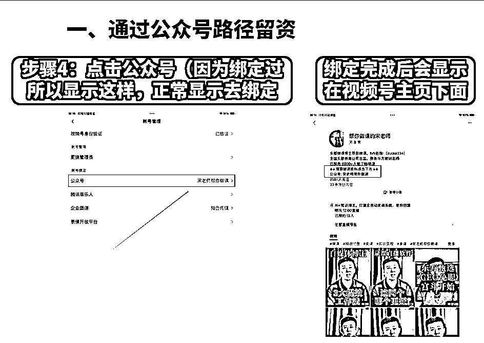

# 快速跑通视频号变现全路径--动作大公开

> 来源：[https://b16xnqwk20.feishu.cn/docx/Fg2Yd9BcEoLNsJxM0YLcAPy0nYb](https://b16xnqwk20.feishu.cn/docx/Fg2Yd9BcEoLNsJxM0YLcAPy0nYb)

我是宋老师（账号叫宋老师帮你做课），做了5年的知识付费，自己也是一位知识博主，全网30W+粉丝。同时我现在有22000+的知识博主学员，5万多的私域用户

同时也是一家MCN的创始人，欢迎家庭教育赛道、中老年、保险赛道的朋友来聊🤝

抖音、小红书、私域之前都做过一些分享👇精华内容大家可以看下

来到了24年下半年，抖音知识付费进入了瓶颈期，我们毅然开始攻克视频号阵地。拿到了一些小结果，单场能有5w+的知识付费课程

今天我分析的实操经验主要分为5个板块：

1.深度解读视频号平台的机制和玩法

2.灵活留更多钩子，让用户最快时间找到你

3.在视频号巧妙留资，让微信号越滚越多的方法

4.全方位增加互动性，增加视频号用户互动就像呼吸一样简单

5.视频号加热技巧

一个账号的变现强度，一定是定位+产品+内容+商业模式的有效结合

# 一、深度解读视频号平台的机制和玩法

首先我们要了解视频号的生态机制，视频号有区别于抖音和小红书自己独特的特点：

### 1.观看人群

40-65岁左右的中老年人，也就是60-70年代的长辈们，他们为什么喜欢刷视频号呢，因为他们就是有钱又有闲的阶段，他们的下一代是90-00后，各位试想一下，孩子处于上大学或者未婚的阶段，家长手头有一定积蓄，且目前没什么压力，自然有很多时间来刷刷视频，也有一定的消费意识。视频号就是承载这类人群最好的平台，方便又快捷，就像源源不断的金矿。

### 2.推送机制

视频号主要从四个方面进行推荐：

用户兴趣（也就是标签）：视频号没有标签的精准概念，需要人进来踩一遍给你的号打上标签，视频号的算法不像抖音那么智能，所以你踩一下我踩一下，这样给视频号打标签的形式。

如果我要开一个店起名叫做小宋茶，看谁看的人多，最后发现，好像六零后看的人比较多，最后给我的视频号打上一个60后的标签，是这样的打标签形式。所以我们mcn一般签同类型博主，这样可以互相打标签。

社交关系（好友点赞推荐）：好友点赞，相互推荐，吸引定向粉丝相互关注，可以把朋友圈的定向好

友叫来点赞，这样又可以给自己的帐号打一波标签。有粉私域

内容质量（知识干货）：干货类的视频，看的人越来越多，你的视频流量也就越来越好，你的粉丝也就越垂直。

如果让我说哪个平台的用户认知最高，我觉得第一的是抖音，第二是小红书，没有第三。视频号还有一点好做的地方在于，视频号说一些很宽泛的小知识就会有人来给你点赞，把干货内容量稀释，也是一种视频号批量持续做内容的好方法。

地理位置（同城推荐）：适合线下实体店想做线上的老板进行引流，也适合私域引流。

### 3.视频号最应该做的动作

①拉预约：我认为是任何一个博主都应该干的动作，视频号的预约机制可以帮助我们快速的积累粉丝.

②微信豆撬动:帮助预约的撬动

### 4.视频号博主生长模式

视频号的博主成长不是孵化模式，而是慢慢成长的模式，所以新媒体相关的课程内容是会限流的，这个需要谨慎。视频号用户要比抖音有耐心

视频号的内容密度不需要那么高，在直播间最重要的动作是拉长用户停留，保证一场直播的质量

所以前期一定不要播很短的时间，视频号后台会把直播时间拉长到10分钟的时候再给你推流，这个动作对于直播间引流的效果是很明显的。

视频号一般30-45分钟是一个有效时长，如果你播不到一小时你就暂时不要播了，视频号的起手必须要播两个小时。

如果视频号起不来的原因还有一个就是内容太杂，你今天发一个内容，明天发一个新的打点，不知不觉自己的视频号已经乱了都不知道，自然起号会增加难度。

# 二、灵活留更多钩子，让用户最快时间找到你

## 1.视频内容层层递进，每句话都是一个风向，每个词都是一个钩子

做课慢，怎么办，为什么，这种词汇天然就会引导看视频号的人点开的欲望。

为什么6000人观看找我互动和转发的却有这么多？看封面自然知道答案。

## 2.剪辑手法，让留资更上一层楼

这种技巧先学现卖，现在平台还没有监控。大家可以用起来。

tips：不要超过3s

# 三、在视频号巧妙留资，让微信号越滚越多的方法

## 1.主页部分留资

以 宋老师知识付费 为例，简介末尾进行留资，方便用户点开主页第一时间加到微信。

## 2.评论区留资

①在用户刷到视频的时候有几率会在评论区进行互动，故在评论区进行留资也是一种重要的留资路径，如下图。

但注意视频号的评论区首条评论留钩子之后，需设置评论置顶，

置顶评论后，需回复该置顶评论进行留资。

②在每一条评论回复时，及时留资，进行针对性回复，根据用户的评论进行引导性对话，引到留资。

## 3.地理位置留资

在发布视频时，视频号有添加地理位置的选项，我们可在地理位置处巧妙留资，设置地址为自己的微信号进行留资。

## 4.主动私信留资

粉丝关注我们后，会在视频号动态中显示关注列表，我们可根据该粉丝关注列表进行主动私信留资。

须注意的是每次私信留资数控制在50个左右，安全留资。

## 5.公众号留资【保姆级教程】

## 6.视频号留资组件【要求较多】

想了解的文末，有官方的资料，可以学习下

## 7.短视频&直播间挂低价课

以上这些足够大家去吸引精准用户了，当然话说回来，文案还是要过硬的，光有技术很难拿大结果

文案之前我也写过一些帖子，可以看下

《1年800万，知识博主流量➡变现闭环系统》

# 四、全方位增加互动性，增加视频号用户互动就像呼吸一样简单

## 1.建立视频号互动群组

视频发布后第一时间看完本条完整视频，转发到视频号群组。

如存在多个视频号互动的情况下，可将群组成员设置成序号方式，方便分配点赞和转发动作。

## 2.转发视频号到朋友圈

这一步有三个作用，一是让你微信群里的人给你的账号踩一遍打标签，二是保持自己账号每天的内容输出，让自己私域的粉丝增强互动，三给自己的视频号浏览量扩容。

## 3.保持每条即时互动

顾名思义，互动越多，视频浏览量越多，是一个正循环的动作。

# 五、视频号加热技巧

视频号短视频的投放机制在逐渐的完善

## 如何投放既有效又省钱？

1.准备5条垂类视频一组批量投放100元

2.投：点赞数/定向加热/作者粉丝数/投放时长 24h

3.投放至30-40元时是关键节点，要及时查看数据调整加热策略

【点赞成本＜0.3元/个，粉丝转化成本＜1元/个，完播率＞20%。3秒以上播放比＞40%，如果粉丝成本低于0.7元，直接追】投

4.第1轮24H后根据数据来决定是否追投或者停投

【做到亏损及时关停、高产及时复投】

## 什么样的内容值得投?

## 1.自然流加热--钩子获客

一般是选择微信豆加热，选择关注

## 2.短视频挂车加热--商品获客

一般是选择商品成交，或者商品点击。目前做一元课的效果更好些，下面是做的比较好的，可以参考

## 3.加热短视频引导直播间

之前看到圈友已经有输出的玩法了，大家可以爬楼看下精华贴

# 写在最后

其实视频号的0-1建立乃至变现没有想象中的那么难，是每一个动作每一个步骤操作叠加拿到的大结果，知识付费的核心其实就是用最小的付出去学别人拿时间和知识乃至实操得到的有效经验。

送大家一个超级福利，官方正版👇知识博主必看

【必备】视频号直播知识教培运营指南 2.0

选择＞努力，平台是决定你翻身最好的机会

希望大家能在人均自媒体的时代绽放属于自己的光芒，成为超级个体，为这个世界做出一点点的贡献，有任何知识付费的问题欢迎随时与我交流。

我是宋老师，24年帮助500位老师卖课50w，欢迎和我一起卖课生财！