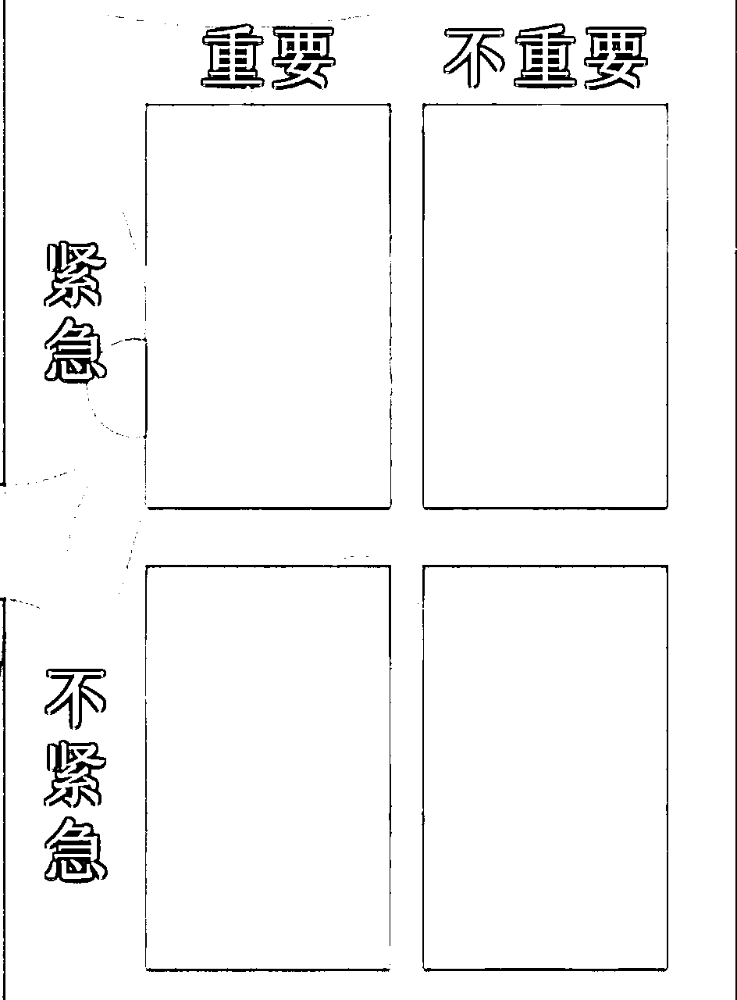

# 【生财技能】我是如何做自己的时间管理体系、让工作效率能维持在挺不错的状态。

> 来源：[https://oee5lr7gsk.feishu.cn/docx/FlEBdnT02oJ1sOxVQ5fcvGtKnmd](https://oee5lr7gsk.feishu.cn/docx/FlEBdnT02oJ1sOxVQ5fcvGtKnmd)

全文共：11,520 字

预计阅读时间：4.88 分钟

我想提升效率这个主题，应该是大多数有着项目或者是创业者，

或者是同时拥有主副业的人都很常会面临到的状况。

我觉得自己的时间管理跟做事情的效率还是挺高的

像现在每天固定工作的时间在5~6个小时，

每一年基本都还可以有将近7位数出的收入。

所以单纯就做事情的效率上，

我觉得有一些挺好的方法论，

这个方法论也是我自己执行的方式，可以提供给各位参考，

也能够一起讨论，一起聊聊。

* * *

# 时间管理的前置条件——人生罗盘

我对于提升效率的方式用的就是时间管理。

那这一套时间管理，我其实已经用了将近快10年。

那经过每一年的持续迭代优化，我发现我对于时间管理的这件事情有更多不一样的看法。

那我的时间管理总共分七个阶段，我也称它叫第一代到第七代的时间管理，

也是第一代到第七代的提升效率的好方式，它是一个迭代式的增长。

那在谈时间管理之前呢，其实有一个很重要的点叫做

我们人生到底想要过成什么样子。

## 人生罗盘（价值观排序）的5个维度

那我把过成什么样子这件事情定义为我们人生的价值观，

也就是我为何而战？

可能是为了家庭而战，

可能是为了生存而战，

也可能是为了爱情而战，

也可能是为了能够有成倍的收入而战，

……

每个人其实对于自己这辈子到底想要什么的方向是不清晰的。

如果越清晰，我们的时间管理或者是人生中的提升效率，就可以更有方向。

但如果说我们在做时间管理之前，对自己的人生方案如果不清晰，

就有可能走着走着就不小心走偏了。

如果说把人生为何而战的价值观分为几大类，我可能会区分为

1.  健康

1.  家庭

1.  事业

1.  金钱

1.  爱情

* * *

## 人生价值观不同维度的定义

我会把事业跟金钱分开，是因为事业观跟金钱观是两种不一样的事情。

然后，家庭观跟爱情观也是两种不一样的，

就是家庭更多的像是陪孩子或者是跟父母亲沟通，我会定义成家庭。

但是，爱情是独立的，爱情是我跟另一半的关系。

有大多数的绝大多数的人，会把家庭跟爱情混在一起，

那最后就会导致一种情况，他的爱情普通、家庭也普通。

因为他的另一半总感觉你都没有把时间留给我。

所以，在价值观的分类方面，我的五大类里面会把家庭跟爱情区分开来。

我也把价值观的分类定义为罗盘，就是我们在这个开船在航行的时候，

罗盘是决定我的船能不能够到达目的地的重点。

因为在大海里其实什么都看不见，没有对标物的。

但罗盘可以让你知道这个地方是东，这个地方是南、是北，还是西？

所以呢，罗盘就是我人生的价值观，是我人生到底要往什么样的方向走。

那当有了罗盘之后，我就能够去寻找我的方向了。

* * *

# 第一代时间管理：便条式

那定完人生罗盘，也就是人生价值观排序之后，我们会正式进入到人生的时间管理。

我的第一代时间管理叫『便条式』，

这其实是一个最简单的时间管理方法，也是一个最粗浅的。

便条式，就像是以前的那种便条纸，我今天需要做什么事，我就把它写在这个黄色的便条纸上。

然后写完之后，把它贴墙上，或者是贴在这个电脑屏幕上。

我完成了一项，就把一张纸撕掉，然后丢了。

那如果说我写了10张便条纸，我到了晚上发现还剩下2张，

那就代表我知道今天有两件事情我是还没做完的。

所以，能够做到便条式的时间管理最大的好处就是我可以不忘事。

每当发现有新的事情，我就可以把新的事情写上，并且贴在最显眼的地方，

或者是我可能有一个时间管理相关的APP，我就能够把这个内容写在我APP的待办事项里面，

所以便条式的管理也叫做待办事项管理。

就是有多少事情做多少事，最少我能够做到不忘事，我就能够把事情做完，

我就能够知道我每一天到底要做多少事情，我就能够开始分配。

所以，便条式其实是我用了两年的时间管理方法。

这个时间管理方法最大的好处就在于，当我的老师每次跟我讲什么事情的时候，我都会记得，

而不会老师说过的这个事情，我有遗漏或者忘记。

便条式有一个最大的重点就是当下记录。

当我发现当下有一件新事情的时候，我得马上的把它写下来。

我不能够隔夜，不能够隔一个小时再记，当我隔一段时间再记录，我就会忘记。

那便条式的时间管理最好的方式就是当下写，

第二个就是可以睡前写，也就是每天睡觉之前，我会把隔天的事情全部规划好。

因为我如果早上起床写便条式就会出现一个问题，就是可能早上要上班，

如果不小心起晚了或者有别的事情耽误，那我可能就没有那么多时间去整理。

那晚上，因为夜深人静，也没有人跟你聊天，

所以晚上的时间做隔天的便条式规划是最好的时机点，也是最有效率的。

因为如果我们在睡觉前整理，脑子就会有一段整理，那个整理就会让我们可能对于做事情的数据更清晰。

所以，这是我自己的第一代的便条式时间管理的方法。

* * *

# 第二代时间管理：优先次序

那后来发现，就是便条式有点不太够用。

就是我当下写有时候一天可能得写三四十件事，可是我时间没这么多，那怎么办？

我做不了那么多事。

所以第二阶段的管理就叫代叫『优先次序』。

我得开始把每一天的事情做优先级的排序，那我们在做优先级排序的关键就是

### 我们在写便条式之前，我的人生价值观到底是什么？

可能我有工作，我有投资，然后又有陪伴家庭……

如果说我的爱情价值观是最靠前的，那我一定会把陪伴我的另一半当成每一天最重要的事。

当然，排成最重要的是不代表说我一定要花很多时间做它。

可是我必须得在时间到的时候，我一定要做。

就类似于，

我可能晚上10点到11点都是陪老婆看电视，

跟她聊天沟通的时间，

一天可能只有短短的一个小时，

但是我不会因为要开会，

不会因为要赚钱，

不会因为工作的忙碌，

我就把这一个小时挪开。

所以在与另一半沟通的这件事情上面，就是我在优先次序里面的很靠前的设定。

我可能每一天我都一定会花一段时间跟我的另一半有相处，或者是一起看电视，或者是一起刷手机，

反正我们两个会相处在一起。

也就是，我们在做第二个优先级排序的时候，我们必须要先去理清楚我的价值观到底是什么。

那如果说可能是一个20~30的年轻人，我都会建议把赚钱的价值观放优先。

因为这个阶段我们的体力好，我们的想法会比较活跃，我们的脑子会比较灵活，

这个时候，我们赚钱的动力也会比较足够。

所以，在不同的年龄段会有不同的价值观排序。

那第二代时间管理，我们实际操作就是

当我每一天便条式写完之后，我会把便条式的内容重新排序，

我可能今天写的是带孩子上学，

然后写了股东开会、经营社群，

然后跟另一半聊天

以及煮饭、扫地、洗衣服，

……

像这类的待办事项，便条式可能就是12345往下写。

但我如果开始去做优先次序的时候，我可能原本12345的声音就变成34126，它就会有不同的不同的排列。

可能煮饭、扫地、洗衣服就会被我放在靠后，

这事情我如果要真的自己没法做，那我肯定可以请个阿姨做，

它可能就不是一个每一天最重要的事。

就我那天我如果发现我的社群、我的运营不当，

或者是我那天没有那么多时间去管理我的社群，这时候，我的社群就会出现这个负面的声音，

他们可能就不会再续费。

那这个一发生，我的金钱现金流可能就会出问题，他们就不愿意续费，我就没有钱进来。

所以重新排序之后，我这一天可能就不会扫地洗衣服，就会放在经营社群之后。

那经过优先排序有一个好处：

### 就是每一天我做事情的时候，开始知道轻重缓急。

假设我就剩下两个小时，但是我有10件事情没做，我真的要把10件事情同时做完吗？

肯定不是的。

我一定得先设定，前三件事最重要的事情，

可能经营社群、股东开会、与另一半沟通，这是最重要的。

我就会把这个事情放在最优先处理，这个如果处理完，我时间还允许，

我就可以去做一些煮饭、扫地、洗衣服的工作。

但如果这些事情做完之后发现时间不允许，那我肯定就会把一些事情挪到明天再做。

这个是优先排序的重要性。

那当我开始能做到优先排序的时候，

我每一天就不会这么慌张，我做事情就可以有章法，

而不会有一件事就做一件事。

像以前可能我在做一个档案的时候，那档案可能晚上讲课需要用。老师突然说：

根源，你帮我整理一个最新的内容，我等一下要用的，

我可能就会把时间挪去做这个，但最后，老师晚上讲课发现没档案

因为我都把事情去做老师临时分配我的事情。

那这时候我可能就会说：

老师，我能知道一下，

就是这个事情的重要性到底高不高。

如果高的话，今天你要急着用，我就先做。

但是可能会对于晚上的档案有拖延，

所以想知道老师哪一个优先。

这个是排优先级的重点，所以有了优先级，我做事情的效率就可以有章法。

那一般来说，就是只要能够做到优先级的排序，

能够做到第二代的时间管理，其实做事效率就可以有很大的提升。

就是如果说一年想要赚个50万以上，我觉得能够做到优先级的排序，并且每一天严格的执行，

想赚到这个收入，我认为是非常足够的，

这个能力就足够让我们可以有一笔稳定的收入，比一般上班族要来的更高的收入。

* * *

# 第三代时间管理：重要紧急四象限

那接着呢，第三代时间管理就叫『重要紧急四象限』。

也是我们常听到的四象限（见下图）

⭕️第一象限叫做「重要紧急」。

重要紧急就是类似以前的银行，我们存钱是有时间的，可能3点半，银行就关了，

我只要不把钱存进去，可能我的这个票钱就没法兑换出来，

或者我想搭的高铁是3点的票，我如果说提早一个小时前没有买这个票，可能就锁了。

那如果买不到，我就没法坐上车了。

又或是还信用卡、还债、以前的做核酸、证件过期、.....。

⭕️第二象限叫做「不重要紧急」

类似上洗手间、临时的电话、别人的委托、.....。

当下不做都没关系，但别人会一直催促，这也是处理事情的时候

最可怕的偷时间杀手。

⭕️第四象限叫做「不重要不紧急」。

就像是临时的电话插拨、像是刷手机、像是做白日梦。

这些事情不这么重要，同时不做也没有任何关系。

⭕️那第三象限叫做「重要不紧急」。

就类似运动，我当下不运动其实没关系的，

我当下不阅读，其实没关系的，

我当下我不去做我的资产规划，其实没有关系的。

但是，如果时间一长，这些我都不做，我的竞争力就是弱于别人。

到了第三代时间管理，我开始谈的就已经不是当天的优先次序了。

谈的是人生的一些次序。

那在读过很多的成功者的传记，跟我的老师过去的时间管理的排序方法，

我发现80%以上的成功者，他们人生会花很多时间在做重要不紧急的事情，

就类似阅读、运动、思考、经营人际关系，或者是写遗嘱，他们会提早的规划晚年我应该怎么做。

也就是，重要不急的事情越多，我们的时间一拉长，做事情的效率就会越高。

也就是他可以随着我的年纪提升，我做事情可以越轻松。

## 在每天的安排中多做一些重要不紧急的事项

像现在对于我来讲，每一天的讲课，对我来说，就属于重要不紧急的事情，

每一天讲课可以让我一直保持在一个很好的思考水平上面。

每一天讲课可以让我的表达力处在一个相对好的情况，那他也可以让我的口齿变得很清晰，

像是每一天写文章对我来讲就是属于重要不紧急的事情，

因为我当练习文笔可以练习我的逻辑，那每一天我会固定花时间去经营我的人际关系，

可能是我社群的学生或者社群的学员，每一天我都会花每一周可能都会花时间去跟固定的学生做沟通。

今天谁没聊过，我就找他聊个三四句，聊个五六句。

这些都是我平时在做，重要不紧急管理的事项，

可能爱情的沟通，比如跟老婆会有固定出去玩、看电影，这些都很重要。

那每天能够安排进来的重要不紧急的事情做的越多，

我们的人生就会越不容易出现这个重要并且紧急的事情。

我如果说平时有很好的财务规划，那我就不会出现信用卡要还款的结果，我没有钱。

重要不紧急的事情，它决定我人生的长轴到底该怎么走。

像现在我的价值观排序其实是爱情优先，然后再是家庭，再是赚钱。

所以我每一天都会花时间送孩子。

像现在我们学校，其实孩子的学校其实是有校车的，但是我没有让孩子坐校车，

因为每一天送他们上学，至少可以有维持一点还可以的亲子关系。

然后，我们家是平时会做饭，那做饭的时候就会跟孩子有相处。

他们会知道说，爸爸平时我们会在家一起吃饭。

所以，这些其实都是每一天，我用很少的时间去维护某一段很长期的关系，

这个也是重要不紧急象限的重要性。

* * *

# 第四代时间管理：行程表

接着就是我自己使用的第四代时间管理，叫做『行程表』。

那行程表，顾名思义就是把每一天的行程放进我的这个日程里面，

可能我今天我要做的事情是股东开会，那股东开会，

我如果只是用便条式或者是优先次序来写，他可能就是在一个表格里面写了今天该处理这个，

但行程表可以很好的规划我的时间，就是什么时间点我得完成这件事。

可能今天我早上的8点到9点需要股东开会。

那这件事它就不会只是在我的表格上，他会写在我的每日行程里面，就这时间点就得做这件事。

当我可以很好的把每一天的行程表排序排排的井然有条的时候，

### 有一个好处是，我不止不忘事，我还能够准时的把事情办完。

### 我可以很合理的去分配我今天什么时间，我到底该干些什么。

那行程表有一个很大的重点，就是颜色的分配。

因为行程表的目的是为了看我的人生到底有没有平衡，

就是我每一个月我是否花固定的时间在赚钱上，

是否花固定的时间在工作上，

是否花固定的时间在家庭上，

是否花固定的时间在经营关系上，

……

像我自己就会把我的大事项做分类。

健康相关的就是绿色，

爱情相关的就是黄色，

工作赚钱相关的就是红色，

每天的固定事项就是蓝色，

我的学习事项就是黑色。

像看书、每天的讲课，这一些都是学习，然后像运动就是我的绿色，

我如果说把每个颜色很好的去做分配。

它的好处就是，当我每次看到我一周的行程表，我就会知道什么颜色是少的。

假设我设定的红色是赚钱，但是，我那一周的行程表基本上都没有红色。

这个就代表我那一周都没有做任何跟赚钱相关的事情，那赚不到钱很正常呀。

如果我设定我的爱情是这个黄色，我如果那个月我发现我的行程表里面没有一个是跟黄色有关的，

那就代表我的爱情出了问题也是很正常的。

### 所以其实当我到了第四阶段的行程表，就是一种对于人生的检视。

### 检视我的人生什么地方少了，什么地方多了，我该怎么去调整。

同时，我也可以尽量在时间范围之内完成。

所以，这时候，当我开始结合到第四段时间管理，我就可以管理到团队。

因为，我如果有一个团队的行程，我就能够让他们去写上什么时间应该做什么事，

我就可以去分配他们每一天做事情的时间点，应该怎么做，会不会冲突到。

再一个点是，如果我有个人的业务，当做到行程表的管理，

那就代表我跟业务的见面、跟客户的见面一定不会有冲突，就是我不可能在12点到1点的时间同时约两组人。

因为我的时间表都有很清晰的列在上面，这时间已经有约人了，那你可能只能约其他的时间。

所以，第四代时间管理算是前三代时间管理的总合，

就是我从开始个体的去分配事情，变成是我更全局的看我的人生到底有没有失去平衡？

所以，这个是我使用的第四代的行程表时间管理。

* * *

# 第五代时间管理：角色管理

那一直到了第五代就会有点复杂了，因为第五代时间管理其实是我到了近几年我才开始使用的。

第五代时间管理就是『角色扮演』。

我得开始去知道我有爸爸的角色，

我有爱人的角色，

我有员工的角色，

甚至我是小创业者、小老板的角色

……

其实每个角色我们要使用的情绪都不太一样。

角色扮演的管理其实对我来讲非常的困难，就我其实有过很长一段时间的不习惯，

就像是在公司里面，我得去跟组员对话，但是跟组员对话，我更像是一个上位者。

可是我如果把跟组员对话的沟通方式变成跟我老婆对话，这就出大问题，

因为他会觉得你为什么要把我当你的下属？

### 所以其实角色扮演管理的最大的点在于，

### 我能不能够更好的去调整我的状态。

回到家，那我就是得回到父亲跟老公的状态。

在公司，我总不可能用跟老婆的沟通看我的员工聊天吧，这也很怪，他们也别扭，我也尴尬。

所以，角色扮演的管理，最难的地方在于如何能够快速的切换我的身份。

切换身份就得管理到情绪，就是我在公司，我是不开心的。

那我能不能够有一些动作让我的能量可以恢复？

所以，角色扮演管理最难的是，我们能不能够有一套属于自己的提升能量的系统，

就是我能不能够让我做一些事情可以瞬间恢复到心情平稳。

就类似：

我以前学魔术，我手上只要拿着扑克牌把玩个不到10分钟，我就可以静下来，

那我可能听音乐，听我喜欢的歌手唱的歌，我听完之后呢，我就可以让自己静下来，

又或者是我煮饭，又或者是看书，我看一本喜欢的书，

或者是我看脱口秀，或者是我刷个短视频，刷15分钟，我就可以让自己的心情静下来，

……

也就是我们在角色切换的那个中间点。能不能够找到一个很好的转场方式？

只要转场得当，我就能够很好的去让我自己的身份可以有一个更好的分配。

我不会把主管的威严带到家里去面对孩子，去面对老婆，

我不会把跟老婆的甜言蜜语的这种歪腻的情绪，用在跟我的下属说话，用在跟我的朋友对话。

就是角色扮演管理里面，我觉得最难，但是也很有用的一块。

* * *

# 第六代时间管理：能量管理

那我自己的管理方式到了第6代，其实跟第5代有一点相似，

第六代的管理叫『能量管理』。

能量管理我也称它叫做情绪管理，也就是我会不会在不该出现这个情绪的时候出现。

就这时候其实我是不能在大庭广众之下生气的，

在这个公司开会的状况之下，我是不可以就是对所有人大小声的。

但如果说今天我的情绪不好，我可能就会在不适当的时机去展现出不恰当的情绪，

这个时候所有的人对于我的观点就会有一种，

这个老板平时看起来这么的儒雅，怎么今天突然就暴躁了呢？

他是不是跟想象中的不一样？墙？它的样子是不是都装出来的？

也就是能量管理如果管理不好，会遇到一个最大最严重的风险，就是我的关系可能会离我而去。

所有人对我的评价可能会从原本100分的评价，就因为我一次的情绪管理不好，或者是能量管理不好，

就瞬间变成了50分或者是30分，甚至能量管理做不好，也会让别人感觉我是一个不靠谱的人。

那能量管理最难操作的其实是

### 让自己冷静，我们得拥有一个让自己冷静下来的能力。

这是第一种。

第二种最难的是如何让自己拥有情绪高涨的能力，

我能不能够知道做什么事情可以让我当下情绪能够缓和。

就像前面提到的角色扮演一样，我在角色扮演中间的转场，我要做的就是能量管理，

我做了哪一件事情可以让我心情好。

像现在对于我来说，想让我快速能够拥有好心情，让我能够笑起来的方法。

我看脱口秀可以，还是我在看过去跟老婆的影片也可以，或者是我在看孩子小时候的影片也可以。

我们有没有一套让自己可以情绪高涨的方法论，或者是技术，或者是方式？

如果有这个方式，最少我会知道如何调动自己。

就像是每次的开会，因为开会谈的是公事，但是一起做事的人，我们私下其实都是很好的朋友，

可是谈到公事，不免就会有一些指责，或者是讲一些比较严肃的事情。

那每次公事一谈完我们就得马上一起去吃饭，但吃饭的时候不谈公事。

这时候，刚刚才骂完一个人，结果骂完之后，我们又得开开心心的像朋友一样吃饭，这得多别扭啊。

那我可能就会在吃饭之前，给自己10分钟或者15分钟的时间，

在车上冷静一下，去转换一下我的能量状态。

又或者是我会直接告诉这个朋友们，我就说：

我们现在工作已经结束了，我们恢复到朋友的相处。

所以，刚刚如果在讲公司上有得罪到很抱歉，就是我不是有意的，

就是我只是希望我们在工作跟交情这件事情我们可以分开，

这样子我们才可以让交情可以长远，并且工作能够有更好的稳定度。

所以，先跟你们说声抱歉，那我们接着好好吃饭。

这时候，我可能会用这样子的话先去告诉自己，告诉他们，我准备转换情绪了，

不然的话，如果总用一些不好的能量去做一些就是可能相对正确的事情，我就会得到错误的结果。

所以能量管理对于我来讲，在时间管理里面其实是贯穿在每个阶段的一环，

就像是我都已经知道，我的早上写待办事项总会让我做事情拖延，

或者是我一早起来，我觉得特别没精神。

或者是每次晚上只要写待办，那个时间我的朋友都是晚上出现，他们会跟我聊天，那时候我就无法静下来写，

……

这个时候，我就得做到能量管理，

找一个可以让我静下来的时间去做一件我认为相对重要的事情。

这时候，我如果能量管理得当，其实我前面的六代时间管理都可以做的非常的好。

因为我的能量是对的，一个人能量只要对，做事情一定会正确。

但一个人能量如果错，他做什么事情都怪。

就像我在心情不好的时候，接下来要谈客户，那这时候该怎么办？

假设可能刚刚我刚好跟我的另一半吵架，但是一个小时之后，我要接一个线上咨询。

那这时候我的能量管理我可能会说：

老婆

我觉得我们能不能够晚点再说

因为等一下我得工作

那目前我们家的经济状况

是非常需要花时间去巩固的

我怕我现在继续跟你讲下去

我会没有好的能量去咨询我的客户。

所以，我们能不能够稍等一下，

你等我一下，

我们可以咨询完之后，

我们再再说

这个其实是一种阻断，也就是能量管理，当我们想让自己能能量平静的时候，

有一个诀窍就是阻断，我能不能更有方法去阻断自己当下的那个暴躁或者是冲动的情绪。

### 一个拥有阻断情绪的人才是一个相对成熟的人，

### 我们才是一个时间管理可以真正做到有高效率的人。

* * *

# 第七代时间管理：习惯管理

那最后一个第七代时间管理，就是我认为最困难的，

也是我近一年才开始放进我自己的效率管理系统里面的，这个叫『习惯管理』。

这其实我们的人生有很多时候都会浪费掉一些时间，

就有些事情，它其实可以提高效率的。

就像是：

我曾经有一次，我看过一个美团外卖，我们电梯同样都上了19楼，

那上19楼之后，电梯门一打开，你就看到这个骑手他很快速的跑到某一间这个办公室，把外卖放在他门口，

但是，当他往前跑的那一刻，他做了一个举动，他把对向电梯按了一个下。

当他跑到对向电梯按下的时候，然后才去送餐。

我就知道这个骑手是有经验的，因为他等一下把餐送回来，他就可以少一点等电梯的时间。

他可以因为他的某一个好的习惯为他的效率多争取到一些时间。

⭕️又或者是我们平时在像原本我家的鞋柜跟电梯是摆在一起的，

那一般来讲，一早准备要出门有两种选择，第一个是穿鞋，第二个是按电梯。

这时候我会怎么选？

我一定会先按电梯再穿鞋，因为电梯有可能在很高的地方。

我如果说先按电梯，是不是它就可以提早下来？我鞋子可能一穿好，我就能够进电梯了。

或者煮饭的时候，我到底是要先炒菜先煮汤，还是先洗米？

如果说这个煮汤可能需要熬两个小时，那我肯定是熬汤优先，再来煮饭才炒菜。

因为煮好一锅大米可能得一个小时，那我不可能就是在炒菜备菜都弄完了，

剩最后10分钟的时候才发现，哎呀，我大米忘了蒸该怎么办。

所以，习惯管理其实是一种我们做事情的时候的优先次序，

### 我们把优先次序放到习惯里面。

⭕️又或者是我在去商场的时候，

如果说这商场是我熟悉的商场，我一定会先把车开到一个我最常走的那个电梯，

然后向外绕圈，去找一个离电梯最近的停车格。

那如果这商场不熟，我去找一个有编号的电梯，我会把这个编号记起来，

然后开始以这个编号为主往外辐射去找停车位。

因为当我开始有一个固定的习惯的时候，我找电梯口就快，

重点是我在离开商场准备找车的时候，我也不会迷路。

因为我知道我停车的路径是什么，

所以我每次只要到一个不熟悉的商场，我基本上都不会出现车子找不到的状况。

因为我都会按照原路走回去，以及按照原路去寻找我车子在哪边的路径。

⭕️又或者是我在工作的时候一早起来，

我到底是要先去安排我自己的事情，还是先把组员的事情安排跟他们说「今天你们要做些什么」？

我肯定是先做后者，一定是先安排他们做些什么，我再安排我要做什么，

因为，当我把事情安排下去之后，他就可以开始行动。

我就可以先让他们知道说今天你要做什么，你得先准备一下，我就可以省掉很多的时间。

有时候，可能我的事情做完两个小时就过了，

我才发现，我竟然忘了跟团队的人讲今天要干些什么事，我就浪费了时间。

所以很多时候我只是把每一天的习惯做一个调整跟做一个改变，我就可以增加一个很好的做事效率。

应该说，我就可以提升非常高的做事效率。

可能每一天我一个小习惯，我可以挪出个20分钟。

那如果因为三个小习惯，我是不是就可以挪出来一个小时？

那我每一天我就多出了一个小时可以用。

那这个小时我可以拿来休息呀，我可以拿来恢复我的能量跟状态。

* * *

# 如何练习第七代时间管理？

那在做第七代习惯管理的时候，有一个最好的方法就是去借鉴，

可以多跟一些，你认为很优秀的人聊聊，他平时的生活状态是什么，他们每一天都会做什么。

然后聊完之后，可以把他们的习惯列举下来，

然后问自己哪些习惯是我觉得很好，但是我暂时没有的。

当我开始能够去列举这些习惯，我在做事情的时候，

我就能够让我自己在耳濡目染，或者是在不经意之间，我每一天就可以为自己多省下很多的时间。

可能原本每一天需要工作8个小时，但就会因为习惯管理得当，我有一些很好的习惯，

可能是我习惯性去关注我的人际关系，我习惯性每一天我会这个花半个小时写写文章，打打字，

像这些都叫做好的习惯。

好习惯只要越多，就可以让我每一天做事情省掉更多的时间，

我可以少浪费掉那些原本不需要花的时间。

⭕️就像是写文章，写完之后，我得去改改错字，改完错字我得排版，

那我到底是要先写重要，还是先排版重要，还是先改错字重要？

对我来讲，我认为最快的方法就是我先写完，边排版边改字。

但是我以前不一样，我以前是这样，我写一段我就改错字排版。

我发现同样写一篇文章，用那种方法来写，就会让我降低我的写作效率。

所以，这种就是因为我平时的习惯好坏去改变我的做事风格。

当我的习惯能够做一个优先次序的调整，

我觉得有机会可以让我的效率可以每一天多争取出一个小时，或者多争取出2个小时。

⭕️又或者是我有个习惯是每工作50分钟，我一定给自己休息10~15分钟，

因为我连续做事3个小时，我的效率都不如我做两个小时，中间休息20分钟，

因为人的能量是有上下波动的，当一件事情连续做太久，我会觉得烦躁。

那我要怎么去杜绝这个烦躁？

我先让自己多休息一个10分钟，可能刷刷短视频，可能是回回微信，

可能是跟老婆聊聊天，可能是玩一下游戏，这时候就可以让我的能量有所回升。

所以，这些其实都是做事习惯。

* * *

# 结语

也就是习惯管理，它可以让我们的做事效率可以提升。

这个也是我自己在这两年开始去迭代我的时间管理，使用的最后一个方法，

也是因为我开始一直我的我的习惯管理，

我才发现，每一天竟然可以挪出好多的时间。

那这些时间我就可以拿来休息，我就可以拿来做我自己喜欢的事情。

所以，以上的这种7个方式是我自己在管理我的事情，

并且提升我做事效率的一整套时间管理体系，用了将近快12年的方法。

也希望这一套方式能够对于你有一些启发，

说不定你把其中的一项用在人生里面，每一天就可以多挪出一个小时，

或者每一天工作效率就可以多提升个一倍，那这也挺好的。

* * *

# 尾声的过去历史介绍

我是根源，同时也是第四期的生财圈友

一个有 2w+ 实战案例的心理咨询师

12年线下销售、团队管理经验。

2022 年开始转型线上，做一些知识付费的项目。

过去曾发表过几篇文章

都能看到这，代表你对文章的喜爱

肯定有一定的程度！

也欢迎阅读过去我写过的历史文章。

2021年的文章（精华x1）

1.  精华《直觉式萨克斯 透过社群成功变现146万》 https://t.zsxq.com/116B1bcYc

1.  《73项被动收入打造》 https://t.zsxq.com/11EHjTH0P

1.  《杭州夜话02场，夜话官复盘》 https://t.zsxq.com/19IkX4UMl

1.  《年入百万，团队从20人到4万人》 https://t.zsxq.com/19JYt77hL

1.  《主题：如何更有效的链接见面会认识的圈友》 https://t.zsxq.com/19VY2LWg4

2022年的文章

1.  《互联网小白，第 1 次做线上产品，7 天赚回 10 倍门票》 https://t.zsxq.com/11ooZZbM7

1.  《把捣乱分子『逆势』转成爱用者的好方式》 https://t.zsxq.com/19lipLhJ5

1.  《 好的内容，是目前依旧没退旧流行的变现方式 》 https://t.zsxq.com/19BLMAYw1

1.  《明白老师的一个启发，让我从100天日耕的过程赚了30W+》 https://t.zsxq.com/19BgNoxfi

2023年的文章（精华x6）

1.  《私域的意义不是管理，而是经营》 https://t.zsxq.com/19WEsfSq1

1.  精华《9年传统行业 1 年时间，从一无所有，到年入 200 万》 https://t.zsxq.com/10nmEr1cA

1.  精华《25个提高微信成交率的小技巧》 https://t.zsxq.com/11AgRW24F

1.  精华《35 个让私域收入翻 3 倍的技巧》 https://t.zsxq.com/11FmV2aqZ

1.  精华《续篇 - 25个提高微信成交率的小技巧（26 - 50）》 https://t.zsxq.com/13yRbmUwo

1.  《 私域话题：涨价之后，如何回复以及留住客户？》 https://t.zsxq.com/11UJk9HxQ

1.  精华《成为自由职业者的20个必备特质 》 https://t.zsxq.com/14XTxhh15

1.  《 36个让私域成交率翻倍的实战指南！ 》 https://t.zsxq.com/17zSrYzvk

1.  精华《产品线有引流体系，如何通过沟通促成升单？》 https://t.zsxq.com/17ocUJEFA

1.  《知识付费赛道，如何透过处理『反对问题』，增加用户粘性和复购率？》 https://t.zsxq.com/181fSc5rv

2024年的文章（精华x7）

1.  精华《第一次尝试「问答群形式」的公域往私域转化，7天变现11万》 https://t.zsxq.com/18gBXlWxE

1.  《 线上新手，我是如何用一套固定流程，累计成交 300 万高价产品？ 》 https://t.zsxq.com/18IWgDiXo

1.  精华《 私域话题-如何在客户咨询过程中，透过三个步骤提高2倍成交率？ 》 https://t.zsxq.com/196Ad34aR

1.  《私域的十倍增长话题：不同信任程度的客户，如何提升成交率？》 https://t.zsxq.com/YKHGT

1.  精华《 为什么都是做副业，我能第一年就达到七位数？ 》 https://t.zsxq.com/APodD

1.  《 写作赛道，如何使用「算账思维」精准地评估产出？》 https://t.zsxq.com/ymcEE

1.  《 私域+知识付费话题：如何通过增加合理的触达次数，提升2倍以上成交率？》 https://t.zsxq.com/elSxU

1.  《9年传统行业转型第2年，如何维持百万利润》 https://t.zsxq.com/61VlK

1.  《把副业做到超过主业收入，你必须得知道的20件事！》 https://t.zsxq.com/bkbd1

1.  精华《用这 13 个思维，我做过的副业全都成功变现！》 https://t.zsxq.com/1q1Re

1.  精华《如何找到靠谱的人，让项目成功几率提升十倍？》 https://t.zsxq.com/hJZfN

1.  《私域筛选流程小尝试，四位数产品课程，转化率40%》 https://t.zsxq.com/o2dJx

1.  《 30个『提高5倍微信成交率』的小技巧 》 https://t.zsxq.com/oThQB

1.  《私域话题—引流来的客户，用什么样的话术，可以提高2倍成交率？》 https://t.zsxq.com/RuaIy

1.  精华《如何处理退费(反对)问题，让高客单产品的退费率大幅降低？》 https://t.zsxq.com/X2PEX

1.  《如何善待恶贵人，增加项目赚钱的稳定度？》 https://t.zsxq.com/aspYc

1.  精华【生财技能】如何透过几个标准、筛选出合适的合伙人？ https://t.zsxq.com/h1J4J