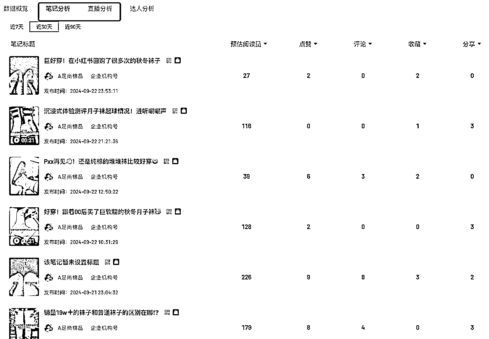

# 了解爆款规律，用Cursor搞定小红书爆款笔记分析

> 来源：[https://av6ec5kbn6.feishu.cn/docx/G6WJdSBAeoWRDYx0GsNceIpdnSc](https://av6ec5kbn6.feishu.cn/docx/G6WJdSBAeoWRDYx0GsNceIpdnSc)

大家好，我是蘑菇ᯤ⁶ᴳ，在我们做自媒体中，大家都知道要抓热点、跟爆款。比如小红书把几篇爆款笔记糅合成一篇、提取抖音热门视频文案重拍、公众号爆款文章二创等。时间有限很难完全靠自己去刷爆款，怎么借助工具快速提取爆款内容呢？

在专业领域，很多大佬会使用脚本抓取数据进行分析，一些0基础的编程小白只能望而却步。如果你也想写出自己的抓取数据的脚本，现在，有这么一个AI工具，能让小白也能像大佬一样写出抓取数据的代码并成功运行。这就是我今天要跟你们介绍的——Cursor。

本文会以小红书“K12赛道”为例，带你实现通过Cursor抓取6小时/12小时/24小时/近3天/一周内出现的爆款笔记，并分析共性，来指导内容创作。

这个流程其他赛道也同样适用，比如美妆、穿搭、美食、家装、宠物、母婴、科技、汽车、健身、减肥、旅游、职场……

Cursor官网：https://www.cursor.com/，官网首页打开就能下载

# The AI Code Editor

Built to make you extraordinarily productive, Cursor is the best way to code with AI.

我们一般使用python写数据抓取的脚本，但Cursor是可以支持任何编程语言的，本文以Python为例

# 1、总体流程

大体流程可以分为从平台获取数据、导出详情文件、脚本抓取数据、不同平台按目标抓取四个步骤，其中编写脚本步骤可以通过很多方式实现，甚至直接写python代码，这里我们只讲最简单最容易上手的Cursor来编写脚本

# 2、结果示例

我们先看以下示例

## 2.1 灰豚+小红书笔记详情

小红书爆款笔记可以通过灰豚平台获取笔记的链接，然后我们可以通过脚本获取每一个笔记链接对应的内容和话题，最后我们就可以根据抓取到的数据进行话题、内容等进行分析

# 3、爆款笔记抓取实操流程

接下来我带大家进行一次简单的实操，我们以灰豚+小红书笔记为例

## 3.1 获取爆款笔记榜单

这里我选择小红书爆款笔记，并以细分赛道K12赛道为例，在笔记榜单筛选出K12近7天的数据，然后导出数据到CSV文件，为我们下一步脚本分析做准备。

## 3.2 聚合榜单数据

如果下载了多个榜单的数据可以把数据先进行下聚合，只有一个榜单的话可以忽略掉这步

这里我用Cursor进行代码编写处理，ctrl+K（Win）/cmd+K（Mac）写明我的需求

在本地目录下XXX下有多个格式一样的csv文件，文件的列分别是官方笔记地址、笔记标题、笔记标签、点赞数、收藏数、评论数、分享数、发布时间、笔记类型、达人名称、粉丝数、达人主页地址，写Python代码把所有的文件合并到一个文件里，合并完后的内容按点赞数倒序排序同时以"官方笔记地址"为准过滤掉重复的数据，保存排序后的前5000条数据

生成代码后点击Accept，把目录替换成我的实际目录，运行代码，多维度的数据就去重整合成一份数据了。

可以看到此时拿到的数据是没有笔记内容和话题的，但是我们在做小红书时是需要爆款的笔记的内容和话题进行模仿的，我们可以把文件中官方笔记地址这一列的url链接在浏览器中打开就可以获取到笔记的内容和话题

灰豚本身的页面/接口其实是可以直接看到笔记详情内容和话题的，我用的免费版一天只能看10条数据，我需要处理的数据有几千条，所以我们需要想其他办法来抓取小红书笔记的详情和话题

## 3.3 抓取笔记详情和话题

终于到了最关键的一步了，完全不会写代码的也不用担心，我们可以放心大胆的交给Cursor帮我们完成脚本的编写，即使中间出来报错，也可以扔给它解决，直到运行成功为止！

这里我们需要提前在网页版的小红书笔记页的html上找到笔记内容和话题的id，如果不会看网页标签的记住下面2个标签就行，id="detail-desc"是小红书笔记内容、id="hash-tag"是小红书笔记的话题

这里我们让Cursor写代码抓取笔记详情和话题，然后更新到Excel中。ctrl+K（Win）/cmd+K（Mac）写明我的需求（需求用大白话描述就可以，不需要描述的很专业）

读取路径为XX的csv文件，文件首行是标题，第一列是 小红书官方笔记地址，循环取第一列的数据，然后在网页中打开，网页打开后取网页的数据，分别取id="detail-desc”和id="hash-tag”的数据，追加到每行数据后面作为新的一列，注意每篇内容的hash-tag有多个，要取完所有的。笔记中的detail-desc可能是空的，hash-tag也可能是空的，如果为空则写入空数据。最后把生成的新数据写入到新文件

过程中如果遇到报错，可以在当前页面上直接让Cursor进行修改

比如上面的代码第一次执行因为请求没有Cookie数据获取失败了，这里选中请求的代码，ctrl+K（Win）/cmd+K（Mac）让Cursor重写这一段代码，可以看到绿色部分是修复后的代码,点Accept就是修复后的代码了

如果遇到看不懂的报错、不知道怎么解决的报错、其他问题非代码的问题也可以让Cursor解决，ctrl+L，打开聊天框，可以把问题或者报错信息复制到聊天框

比如我这里不知道怎么取cookie，就可以问AI，按照它回答的方式去网页上拿到cookie后粘到代码里

继续运行，遇到错误重复上面的修改方式，看到下方控制台有打印就是正常了，可以来杯☕️等程序跑完就ok啦

代码执行完成后，打开文件可以看到我们需要的笔记详情和话题数据都成功抓取和写入到文件中了

整个流程到这里，借助Cursor已经完成爆款笔记内容的抓取工作了。剩下的部分，是用抓取的数据，结合Cursor来做内容创作。

对于一篇小红书笔记，可以拆成3部分：标题、封面、正文。接下来我们来看看每一部分该如何创作。

## 3.4 爆款笔记标题

### 3.4.1 总结爆款笔记标题

先用Cursor提取之前抓取出的CSV文件“笔记标题”那一行，让Cursor对笔记标题中重复出现的关键词出现的次数做降序排序，统计关键词、出现次数和笔记的标题

我们看下执行完的效果，从表格中可以看到笔记中每个关键词出现的次数，比如“假如 你 从”这几个关键词，出现了13次，那我们笔记的标题就是 “假如你从XXXX，XXX”

假如你从9.20开始备考英语二，考试=抄答案

假如你从9.6开始做TikTok🇲🇾照做真的简单

假如你从9.20日开始备考25公考（完整版攻略）

假如你从9.23备考银行从业，背完稳了👏

假如你从9.21日开始备考25考公计划，熬夜背

假如你从中秋开始备考导游证，考试=抄答案

假如你从9.19号开始备考25国省考（完整版）

假如你从9.20开始25考公计划🔥跟学上岸

假如你从9.21开始备考事业单位🔥背完稳

假如你从9.22备考25国考省考，进一个救一个

假如你从9.22开始备考25公考，进一个救一个

假如我从9.24开始备考成考，考试=抄答案

假如你从9.20开始备考事业编🔥直接抄我的

### 3.4.2 笔记标题改写

## 3.5 爆款封面

封面图我们可以重点参考那些“小号爆款”使用的封面。

比如100、400这种粉丝的账号，如果它某一条作品爆了，很大原因是它“抄对了爆款”，找到了一些不错的封面形式来进行模仿。

那么，我们自然可以学习他们的封面制作，对于我们而言，这就是天然的爆款封面素材库。大致思路是：

①取粉丝数小于500，点赞大于1000的笔记；

②抓取前50或者20的作品封面，并保存到一个文件夹里，比如桌面文件夹。

这样一批细分赛道下的低粉爆款笔记的封面就下载下来了，我们就可以快速的模仿的最近的低粉爆款封面

## 3.4 笔记内容

内容这部分，我们主要做的就是仿写。大致思路是：

①抓取相关标题的正文；

②用文章仿写指令，进行仿写。

第一步正文内容我们在前面已经抓取过内容了，这里直接用就行，在之前下载的内容文件里选1篇笔记的内容进行仿写，比如原文内容

还没开始刷阅读的姐妹们别急

九月开始做，也能刷三遍！

给大家做好了计划表，我去年按这个节奏刷题成功上岸，姐妹们赶紧拿上kuku学！⬇️

需要提前准备好：

①2005-2024年真题

②各题型阅读技巧

三刷规划：

①05-10年只做四篇阅读

②11-19年英一/二只互刷阅读 小三科题型不同

③20-24年留着用来定时模拟考试

【解题步骤】

🔴先看题目、再读文章

1️⃣看题目类型：细节题、倒证题、主旨题等

2️⃣先不看选项（避免先入为主）

3️⃣找题干定位关键词

👉🏻定位词4种: ①名词 ②动词③大写 ④数字

🔴回到文章、确定范围

1️⃣定位到｛段落开头句｝—答案范围为｛全段｝

2️⃣定位到｛人说话｝—答案范围是｛他说过的话｝

3️⃣定位到｛段落中间｝—答案范围是｛上下句｝

4️⃣定位到｛段落尾句｝—答案范围是｛本句｝和｛上

句｝

👉🏻不用全读，只在范围内找与题干强相关、或有逻辑的句子即转折、因果、否定句、特殊标点句。

🔴确定【选项】在文中的位置

1️⃣选项和文章的｛原词复现｝就是其出题句

2️⃣正确选项是有出题句的

3️⃣错误选项一般也有出题句，没有出题句的选项一般是无中生有，直接排除

👉🏻复盘的时候可以对照一下各类题型，值得二刷三刷的题我都po在图里啦，大家自取～

📌附上我的阅读高分小tips：

✅阅读题目题文同序，即一题答案出现在前面、一般为1-2段，后面段落依次为2、3、4、5题

✅zui后一题一般为主旨题，答案在开头段或尾段关键词

✅做题痕迹要保留，尤其是错题、哪里错、为什么错

✅ 明确一刷错得多很正常、且是好事儿，重要的是汲取经验

💞祝大家都顺利上岸！用张建老师的阅读技巧正确率蹭蹭涨！！有任何问题欢迎来问我呀~

先新建一个文件，把内容复制到文件中，然后Ctrl+K/Cmd+K,输入仿写指令，看到第2张图中红色部分是原文，绿色是仿写后的内容

仿写后的内容我们还可以单独对部分内容修改，比如某个词/某段话不合适我们要修改，可以直接在生成的文章中修改，也可以对要修改的内容单独选中后，给AI指定让AI修改，同样红色是修改前的内容，绿色是修改后的

## 3.4 热门话题

我们发布笔记的时候需要带上笔记话题，话题要怎么选呢？怎么知道哪些话题最热门呢？

继续把上一步抓取的结果数据让cursor分析，总结最受欢迎的话题。

处理路径为XX的csv文件，取文件的 话题标签一列，格式如下"#七年级上册语文,#新初一,#月考,#名著考点”，先把话题按,进行拆分,汇总所有的话题，总结出现次数最多的500个话题，写到txt文件中

运行结果

# 4、热门商品实操流程

## 4.1 获取热门销量商品数据

商品的销量榜单，灰豚提供商品销量榜、直播销量榜、销量飙升榜，这里的销量数据是笔记带货和直播带货的销量汇总，如果我有个诉求不看直播数据只想看笔记带货的商品怎么办呢？

我这里以销量榜下的"家居百货"类目昨日的销量为例进行演示，选择对应的品类导出数据

## 4.2 对数据进行过滤

这里我的诉求是只要笔记带货的商品数据，过滤掉有直播带货的商品，同样把代码的事交给Cursor就好了

遇到错误或者没有结果，同样把错误复制让Cursor解决，同时为了观察方便添加必要的打印信息，这样我们在执行时也能实时看到数据情况

最后执行完我们就得到一份只有笔记带货的商品销售数据

## 4.2 更多的探索

灰豚的详情页下还有笔记分析和直播分析，我们还可以对带货商品的笔记和直播进行分析

# 5、写在最后

以上就是我用Cursor对小红书爆款分析到生成笔记的全过程。这里分享给大家，希望对大家做小红书内容有一些帮助。

Cursor对于会一点代码甚至完全不会代码的人非常友好，它的出现让我们人人都能成为产品经理，我们只要能说清楚需求，它就能帮我们实现，相当于拥有了一个全能的程序员小伙伴，大大提高我们的效率。

小红书作为流量平台，目前还是有很多入场机会的，大家不妨亲自动手实践起来，有任何问题欢迎大家留言，最后再次感谢大家阅读!