# 半夜睡过广场，也月赚过16.5万，我是怎么一步步找准「AI+做课」这条蓝海赛道的？

> 来源：[https://d037mrmszsw.feishu.cn/docx/GAzndhraEoR0gCxsgOXccikQnig](https://d037mrmszsw.feishu.cn/docx/GAzndhraEoR0gCxsgOXccikQnig)

👀嗨，我是半目，一枚85后奶爸，曾穷到半夜睡广场，也月赚超过16.5万，一路磕磕绊绊，最终找准「AI+课程制作」这条垂直赛道进行深耕。目前与「玩赚新媒」主理人 @芷蓝 合作，共同交付「AI做课卖课」的陪跑服务。

本文将展现一枚中年男人有些奇奇怪怪的成长经历，通过梳理这些时间线和事件点，大家将会无比清晰的看到：我是怎么一步步找准「AI+做课」这条蓝海赛道，并持续深耕的。

我在知识付费领域深耕6年，曾创下新课发售首月收入即达16.5万+的战绩，先直接上图：

以下截图内容均可实时演示 ⬇️

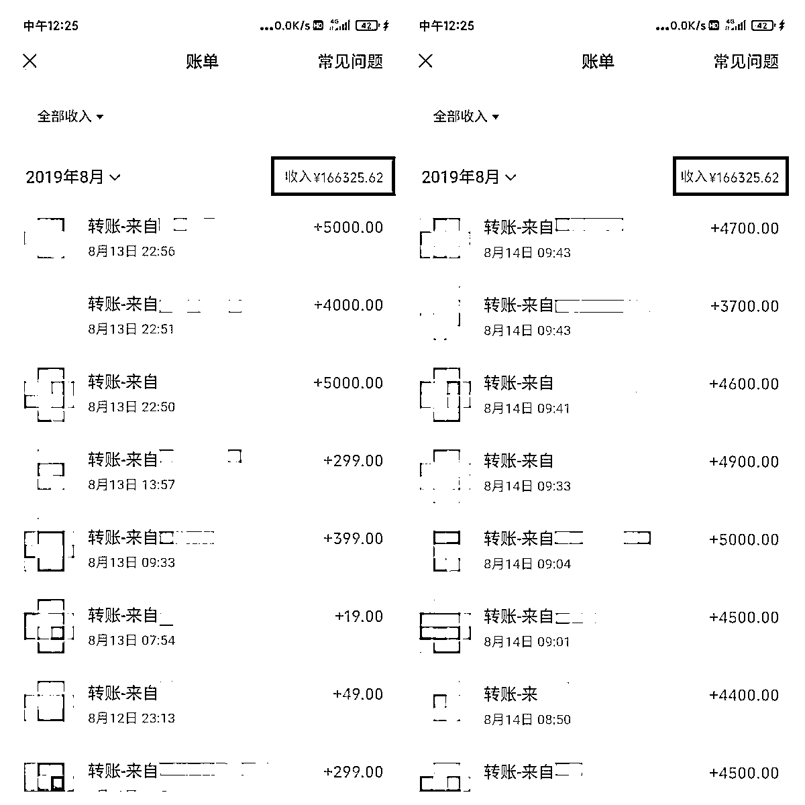

16.5万还仅是一个微信号的收入，支付宝当月收入有4万多，合计20多万 ⬇️

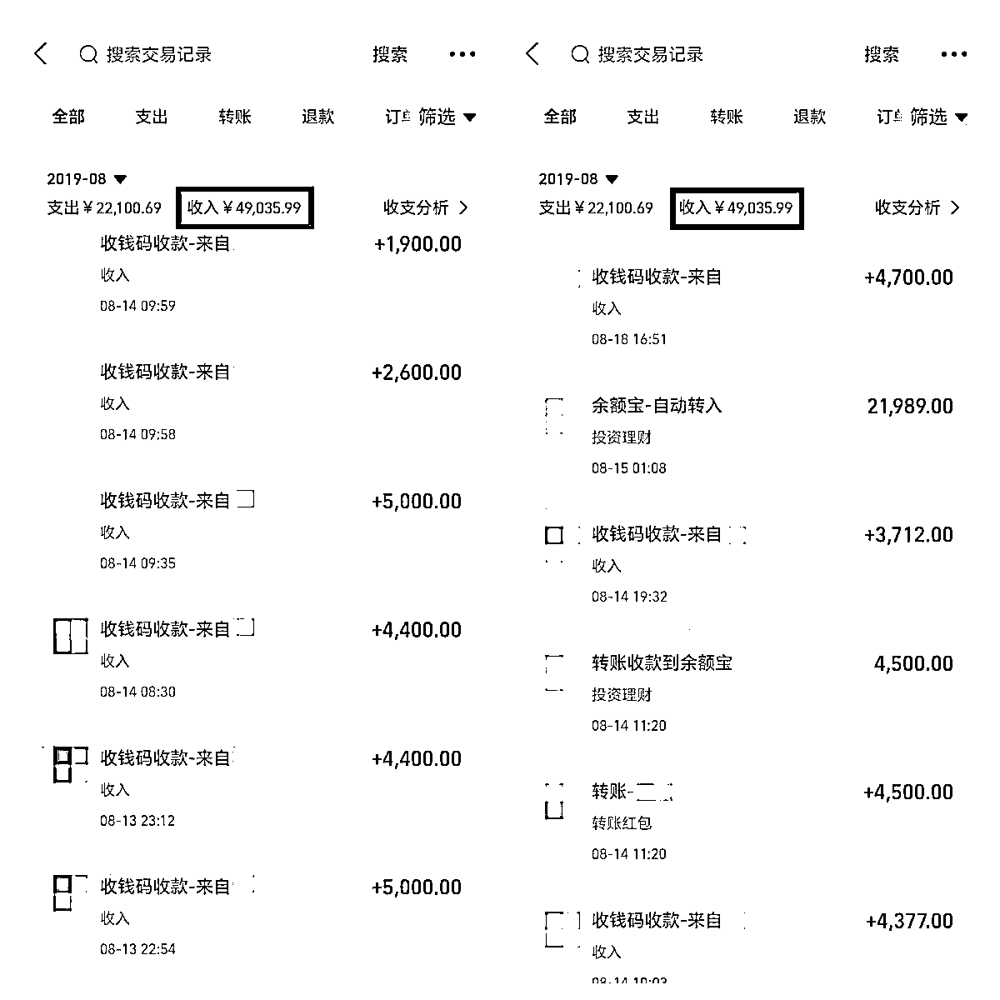

有图有真相，本文从构思、材料梳理、动笔撰写到完稿，耗时一个多月，这个过程痛苦无比，过往经历像过电影般在我脑海里铺开又卷起：从奥运会志愿者，混到半夜睡广场，再到月赚16.5万的高光时刻，之后更是起起伏伏，艰难转型苦寻新方向，直至「AI+做课」跑通闭环，吸引大佬合作迎来事业第二春，真的是感慨万千 ……

# 一、那个夏天，我在发光

## 陕北小山沟沟里走出来的「小镇做题家」

我出生在陕北的小山沟沟里，面朝黄土背朝天，当年父亲是第一个从村里考上师范走出去的，让我家有幸从土里挖的窑洞住上了石头磊的窑洞。

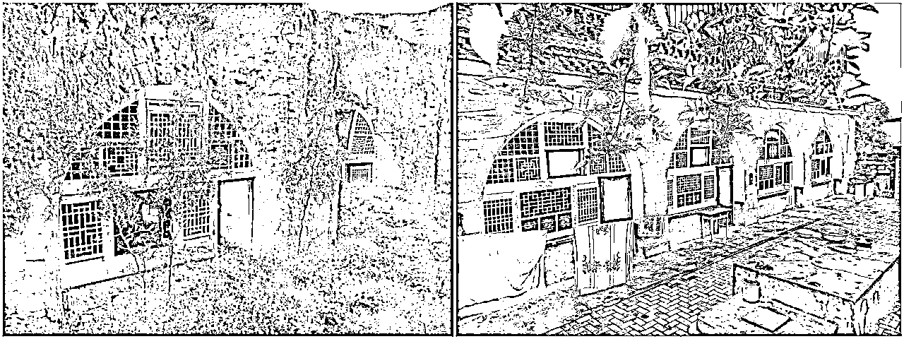

穷人的孩子早当家，于是乎我不落俗套地变成了传说中的「小镇做题家」，从小在我们那个小地方品学皆优，甚至还考上了陕北地区唯一的重点高中。

高三的时候，如偶像剧那般，我看上了隔壁班的一位女同学，长得像孙燕姿，还会打篮球 …… 心心念念篮球场那一抹又飒又靓的身影，我不禁有些心乱……（怎么感觉偶像剧男女主情节反过来了？）

然后，我，我没怎么把持住 …… 最后高考成绩也一般，不过还是考上了一所全国重点大学。这事儿主要怪我，怨不得别人！

## 北京奥运会志愿者，校刊杂志主编

刚上大学，多少有些不服气，老觉得自己本该能上更好的学校，凭着这股劲儿，我有一点点开挂的意思，平时跑家教，主持院系活动，给活动拉赞助，钻山区做公益，甚至兼职往宿舍楼上抗水，抗一桶能挣5毛钱。

2008年，北京夏季奥运会开幕，举世瞩目，我如愿以偿光荣的成为了一名奥运会志愿者，还是蓝2牌，在运动员休息区工作。那年我亲眼看到了习大大的背影（🤭），和小罗纳尔多本人面对面对视过（😄），还收获了巴西球星迭戈的亲笔签名帽（已送给老爸收藏）。那个夏天，我感觉自己也星光闪耀！

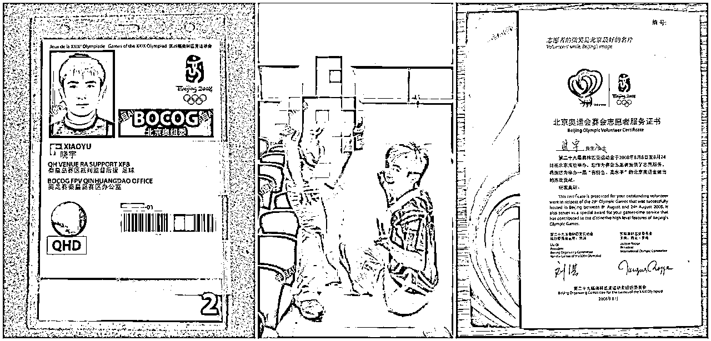

在大学那几年，因为有不错的文字功底，我还成为院刊杂志主编，并在青年报发表过文章，还正式谈了女朋友（仍旧没把持住😂）。

# 二、穷困潦倒，折腾副业

## 开胸手术留遗书

紧接着小高峰的，不一定是低谷，很可能直接就是大深渊。

2009年，拖了挺长时间的咳嗽，突然加重，我直接给咳吐血了，没错，就是吐血！

场面吓人，舍友见状，整个呆住，反应过来赶紧打电话帮我联系父母，父母知晓，顿时心急如焚，连夜接我回家，一刻也不敢再耽搁，住院、输液、穿刺、化验，发现肺部有囊肿，局部纤维化，但具体什么性质，不好下论断！当时全家人神情紧张，不知所措……

我们决定转院，去西北最好的第四军医大学，重新住院抽血化验拍片建档，胸外科专家几轮会诊后，最终给出了边手术边化验的治疗方案。什么？边手术边化验？父亲一脸不可思议，满脸褶皱挤成一块，没办法，只能艰难地在手术方案上签下字，手发抖，心在滴血。

手术前的那天下午，清楚地记得，父亲反常的和我聊了些平时不太会聊到的，比如问我有没有觉得从小对我管的太严，再比如问我从小家里没钱会对我的性格造成多大影响 …… 我知道可能会发生什么事，不想让家人太过担心，所以显得反倒比较平和，并很认真地回答了父亲我的真实所想。

晚上，我自己偷偷写了份儿遗书，悄悄塞到父亲背包的夹层，静静地等待第二天的手术判决。

手术过程很奇妙，我现在依稀记得手术室很漂亮，到处都是明晃晃的感觉，医护小姐姐还开玩笑的说我好年轻好帅呀，然后，然后我就什么都记不得了 ……

睁眼就已经在重症监护室了，我第一时间赶紧深呼吸一口，诶？发现竟然不想咳嗽了！我好了？这时候护士小姐姐凑过来对我轻轻的说手术很成功，良性的，放心吧，我悬着的心立马落了地。

后来听我母亲说，父亲当时守在手术室门口，听到医生推开门说：“手术很成功，良性！”这句话的一瞬间，哇的一声就哭了出来，然后瘫倒在地上；后来也听我父亲说，母亲整宿整宿坐在屋外、路边，看着明汪汪的月亮，发呆，抹眼泪，再发呆，再掉眼泪。

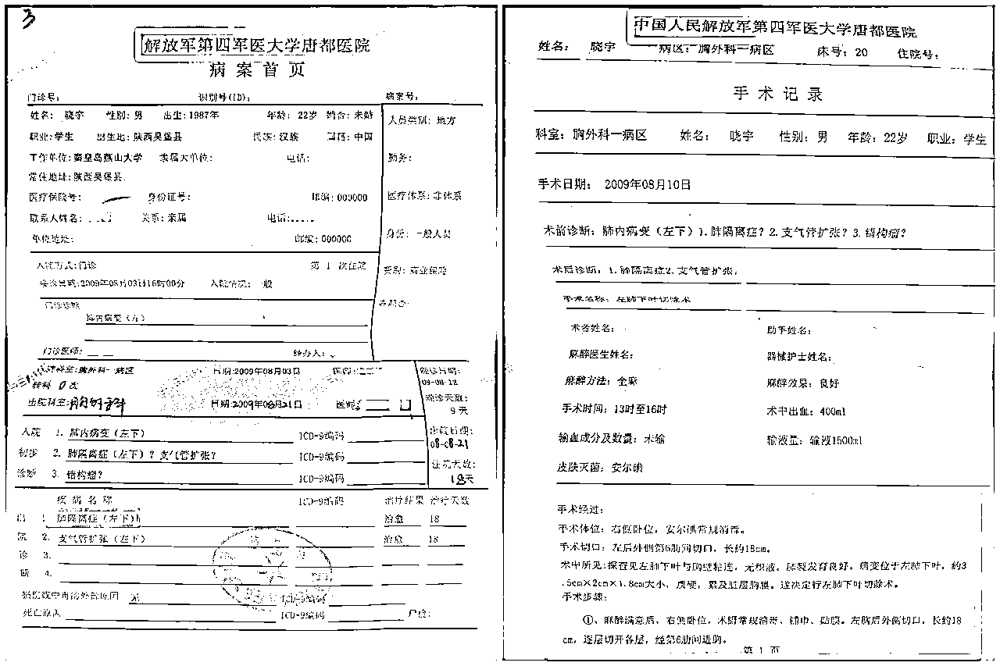

## 初尝网赚，赔个底儿朝天

家里穷，给我动手术钱不够，还欠了外债，父母一直没告诉我，但我心里跟明镜似的。手术前后正值考研阶段，我也没心看书，因为术后行动不便，有点儿时间就卧在电脑旁研究起了网络兼职，想办法看能不能挣点儿外快，补贴生活费，好让家里负担轻一些。

这一研究可不要紧，从此打开了网赚的大门。2009~2010年的互联网，鱼龙混杂，我先后尝试了满屏飞广告的“打字挣钱”和“挂机项目” …… 可世上哪儿会有天上掉馅饼的美事，想不劳而获，打打字挂挂机，就想挣外快？初尝网赚的我，不仅一毛钱都没挣，还把仅有的一个月600块的生活费也快嚯嚯没了，接下来只好饱一顿饿一顿，艰难窝在宿舍度日。

尽管如此不堪，但初尝网赚，让我开始持续关注互联网副业项目，为以后要蹚的路埋下了伏笔。

人生没有白走的路，每一步都算数。

## 穷到半夜睡广场

2010年，我大学毕业，随大流应聘到一家央企集团国企大厂，搞技术（我是学电气工程的，工科）。

初入职场，无比青涩，我就像个只呆萌的好奇宝宝，凭着一股新鲜劲儿，在社会这趟浑水里划呀划。过了8个月，发现不对劲儿，不喜欢，我很不喜欢这个工作，再加上和大学女友感情不合，一气之下，裸辞单位正式编制，打道回府，直奔西安，重启人生。

一生不羁，向往自由的我，注定不会毫无波澜，离开校园、抛弃组织，愣头青的我，狠狠被现实无情鞭挞。

2011年，我流浪西安，窘迫的抠脚。那时候城中村有20多个床位隔间的普通三居室，两层铁架床，彼此空间就隔个挂起的床单，我就住这里边。有次在小卫生间洗澡，门坏了，一位女室友不小心闯进来，我一丝不挂杵在人家面前，尬出了天际，恨不得原地爆炸，女孩儿也慌不择路，那场面，简直不要太刺激（🧐）！

但，毕竟大学表现优异，该拿的证也都拿到了，也没过多久，就找到不错的新工作，是家研究所，只不过出差频繁，需要全国各地到处跑，但我喜欢，自由。

2012年起，我几乎跑遍了国内沿海各大城市。从西北黄土坡坡风尘仆仆而来的我，恨不得瞪大眼珠子，生怕错过什么，使劲儿贪婪的吮吸着充满物欲而又温润的沿海气息，脸前的灯红酒绿和现实的窘迫形成了强烈的反差。印象特别深，有次临时出差到郑州，凌晨一点多，拎着电脑包推着行李箱，面朝着火车站广告茫茫打地铺的打工人，我犹豫了，要不要也在这广场席地蜷一晚，能省一晚住宿费 …… 我找了角落蹲下抱起双膝试了试，瞬间心酸，随手拍了这两张照片后，就这么硬生生挺了一晚。

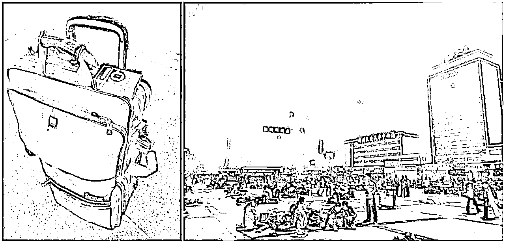

穷是逼迫男人进步的第一推动力！

况且在我最穷的时候，还认识了现在的媳妇，当时她还在读研究生，你说我要面子也好，迸发了责任心也罢，穷则思变，工作之余我又开启了自己的副业之路。

## 干淘宝、做微商，月赚1万

2013-2015这三年，我先后算是踩中一些风口：先开始做淘宝，代理一款软件，980元的售价，利润一半左右，卖的不错，并且持续挺久；后来去做网站论坛，卖会员，也还不错；紧接着微商兴起，我又去做微分销系统源码，经营的也还可以。这三年，我在互联网副业项目上感觉突然开窍，平均每个月能赚个1万左右，那时候我上班工资才6-7千，所以过得还可以，和小女友悠哉悠哉的，好不快活，水到渠成，我们趁势还结了个婚（🤗）！

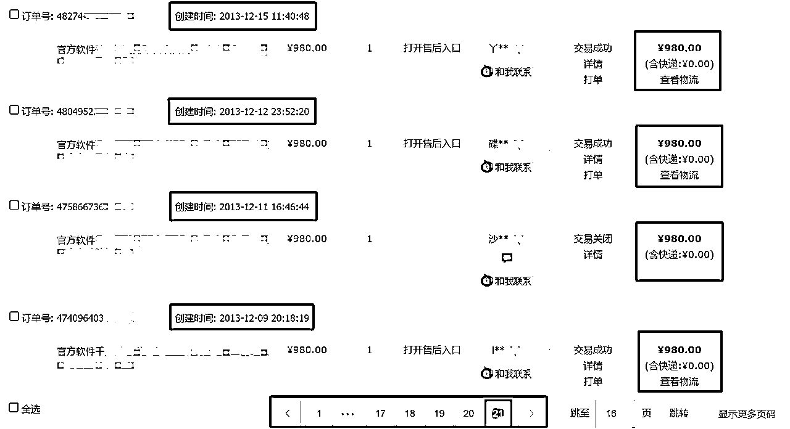

## 裸辞工作，摆地摊儿、直播卖书

2016年，福祸双至：我的女儿意外降临，欣喜之余，也意味着我不能再出差全国各地到处跑，女儿需要陪伴，我必须做一个好爸爸；同时，淘宝对个人卖家政策逐步收紧，加上我对微商认知不足，手头的几个副业项目几乎同时萎缩。

多重重压之下，我做了最终取舍，辞去工作，举家搬去成都（孩儿她妈研究生已毕业，工作在成都，有编制），我打算在成都，再次，重启人生 ……

2017年，我在成都开始折腾，摆地摊儿卖书、直播出镜卖书 …… 读书人还是彻底放不下身段，这些几乎全无起色，生活一团乱麻，我再一次深陷低谷 ……

# 三、月赚16.5万，我飘了

## 知识付费，从0到1

2018年，我冷静下来，不再像没头苍蝇那样乱闯乱撞，开始系统学习，职场、副业、炒股 …… 什么都学，什么都涉猎，好比一头受伤的猛兽，趴在水塘边，吮吸、疗伤。

我突然发现一片新大陆，得到、喜马拉雅、千聊，这些网课平台，花个几十几百就能系统学习一门课程，各行各业，想学什么基本上都有，这也太方便了吧，而且，我在思考，这些讲课的老师，只要做一门课程出来，挂到平台上去，卖一份和卖一百份，边际成本基本为零 ……

这，是个好生意！

可是，不能一上来就做门课程，没有客户，空窗期太长 …… 不管那么多，我索性边学边分享：先把自己学到的付费课程理解消化，然后加上自己的理解，并结合当下热点案例拆解，最后输出内容到贴吧、论坛、知乎、朋友圈、微信群等，吸引精准同频人群 …… 最后怎么变现呢？我尝试了三种方式：

① 收取月度、年度会员费，结合会员的问题，分享自己吸收内化后的知识，帮客户解决具体问题；

② 推荐分销知识付费课程，赚取佣金；

③ 适当推送淘宝客商品链接，赚取佣金。

一开始，为试错，我什么都学，也什么都分享，然后根据客户的反馈和我自己的兴趣，最终锁定职场、副业和炒股这三个领域，客户最多，需求较大。

结果：成功了！！！

2018年1月份收入¥8000多，2月上万，之后的几个月都稳定在1万多甚至2万。

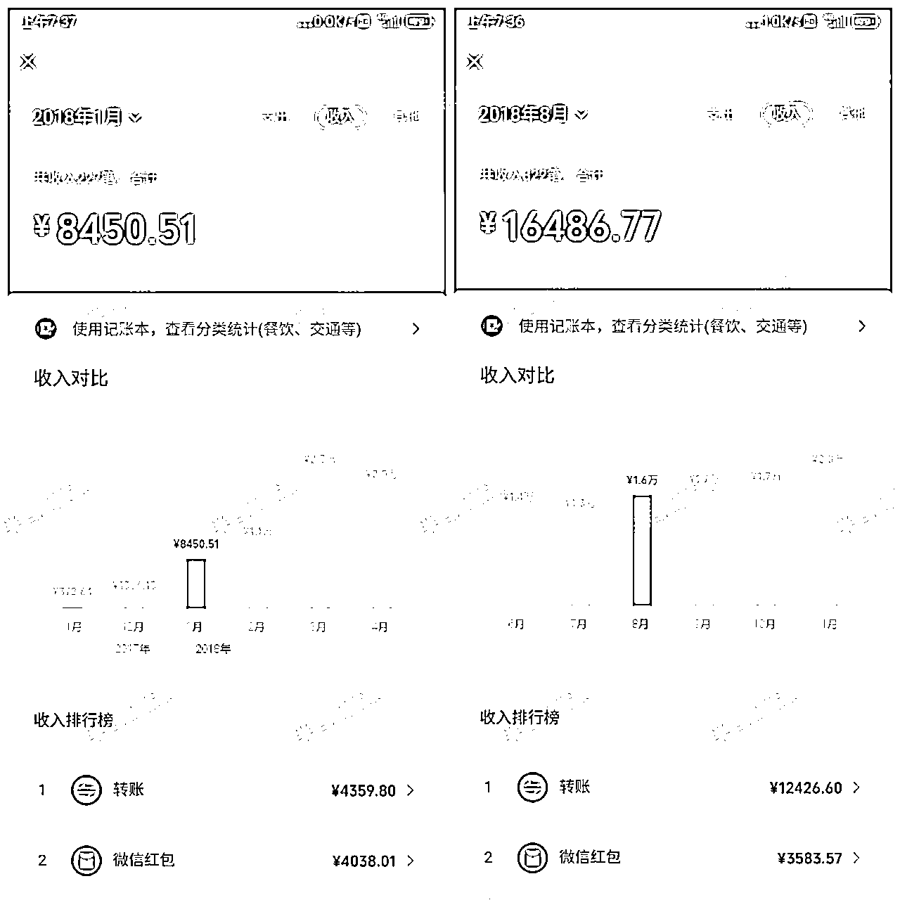

于是，我们过了一年多滋润的小日子，给女儿力所能及的“富养”，也买了车，当时第一次自驾去川西，哇哦，什么神仙地方，雪山、草地、牦牛 …… 可惜，好景不长 ……

安稳，它并不是什么好事情。

## 第一次转型，月收入提升至4万

2019年4-6月份，收入逐步下降，而且下降得厉害，4月份9千多，5月份6千多，6月份5千多，我坐不住了，抓心挠肝，好不容易开辟出一条收入还不错的副业线，不能就这么不明不白香消玉损掉。

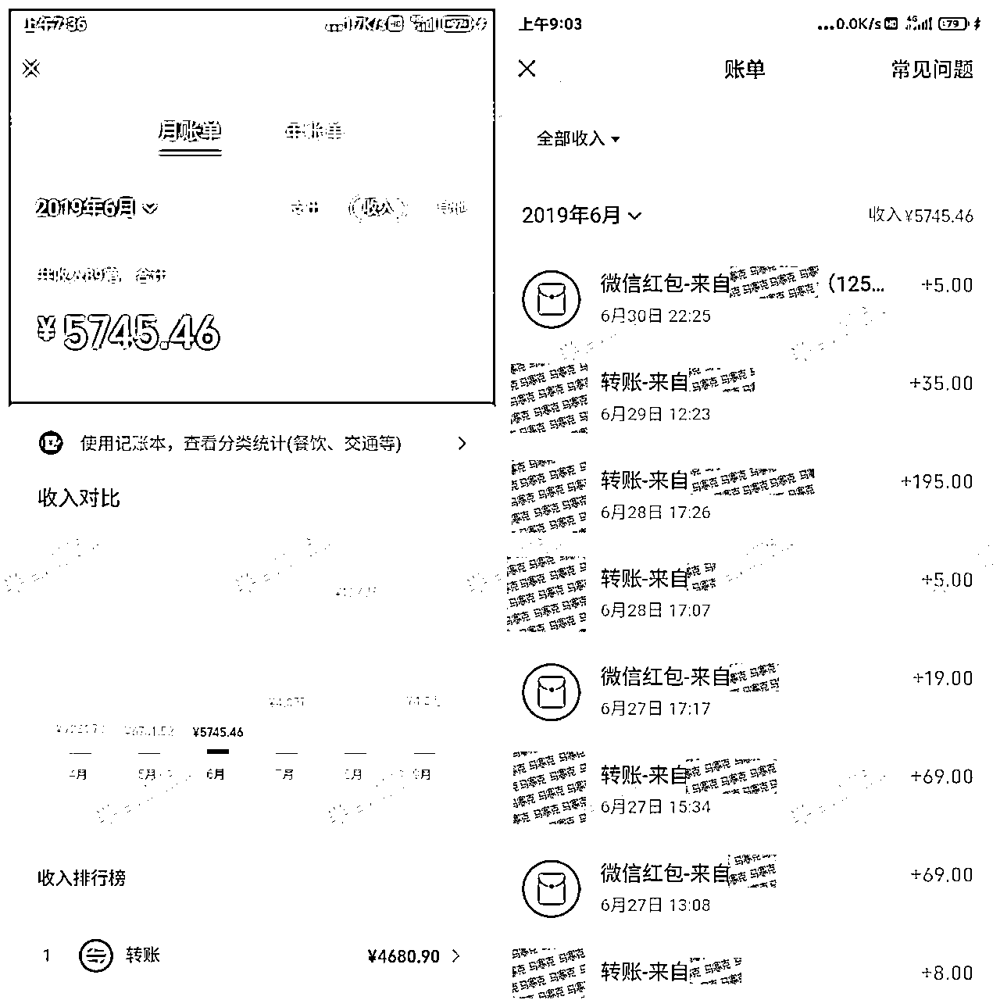

这几月简直太难熬了，而且还正值我们买房的档口，来成都好几年了，我一直拎着老婆孩子租房住，眼看着女儿一天天长大，那么可爱，9月份马上又要上幼儿园，再苦再累说什么也得给女儿一个好学校上，可要上好学校，就得咬紧牙槽买好一点儿的学区房，我和媳妇盘算了一下积蓄，另外把能借能贷的钱都算上，死活还差个20来万 …… 不能就这么让我最爱的女儿拌倒在起跑线上，可，可连续几个月收入这么直线下降，我上哪儿扣这20万出来买房？

几经沉浮，亲历生死的我，已经顽强的像块儿石头，遇事首先冷静下来思考，已然成为肌肉记忆。我开始坐下来仔细梳理自己的业务线，分析收入下降的具体原因，也小范围咨询一些核心客户的建议，自己的反思，再加上客户的反馈，让我几乎清晰的得出了2个结论：

① 职场、副业，这2个领域的课程价格一般较低，对应的课程分享佣金少，客户消费金额和粘性也都不高；而投资炒股类的课程价格一般比较高，对应的课程分享佣金多，客户消费金额和粘性相对来说要高的多。

② 我这里的产品体系结构单一，只有前端的引流低价课程和服务，没有后端利润产品，导致整体利润不高。

基于以上结论，对症下药，于是我做了2个明显的针对性动作，让接下来几个月的收入，直线上升翻了几倍不止，而且直接攀上“人生巅峰”！

2019年7月份，第一个动作，我开始全面转型，逐步剥离利润和客户粘性低的职场、副业这2个版块，专攻利润和客户粘性较高的投资炒股版块。这是我的第一次转型，效果立竿见影，2019年7月份，我的收入直接提升至4万，上图可以看出这个明显的趋势。

## 第二次转型，月赚16.5万！

2019年8月份，第二个动作，我把自己这次副业赚钱的成功路径和方法细节打造成为一门5000元的高价课，作为后端利润产品，也就是说，客户只要复制我的实操经验，也可以做和我一样的业务，也可以赚和我一样的钱，领域可以不同，但路径和方法可以复制。这个高价课一经推出，立马爆了，有些核心客户，都懒得看我精雕细琢的新课介绍，随便问几句，了解个大概，就直接转账，把我给干懵了。大家可以仔细查看下方截图，自从8月13日晚上10点多高价课发售开始，4000多、5000的转账，基本就没停过，隔几分钟来一单，隔几分钟来一单，我的一个微信在短短两三天内，额外收入接近10万，整个8月份收入超过16.5万，加上支付宝的收入，8月份的整体收入超过20万！钱都是几千几千的收，简直把我吓到！

20万，1个月时间，我像变魔术一样，硬生生给掏了出来 …… 把买房款凑齐的时候，媳妇一脸不可思议地望着我，请注意，这时候可是仰望，还连哭带笑的，女儿也学着妈妈的样子围着我连蹦带跳 …… 那一刻，我明白了努力的意义，明白了反思和复盘的力量，明白了直面问题转型升级的必要性，明白了枪顶在脑门后人究竟能释放出多大的潜力，明白了掏心掏肺服务客户培育信任的重要性，明白了知识付费这个行业高客单的价值 ……

## 生财有术「邂逅」AI，不解之缘

2019年7月-2022年11月，这3年多的时间里，沿着这个思路，我月均收入持续着小几万，老婆孩子热炕头，快乐且忙碌，幸福且安康。攀上“人生巅峰”后，我属实飘了，飘在水里，然后被温水煮着，就像只舒适的蛤蟆，沉浸在不思进取的快感中，整整3年多！直到 ——

2022年12月2日，那天，我正悠哉悠哉的逛生财有术知识星球，突然看到这样两篇帖子，直觉让我虎躯一紧：

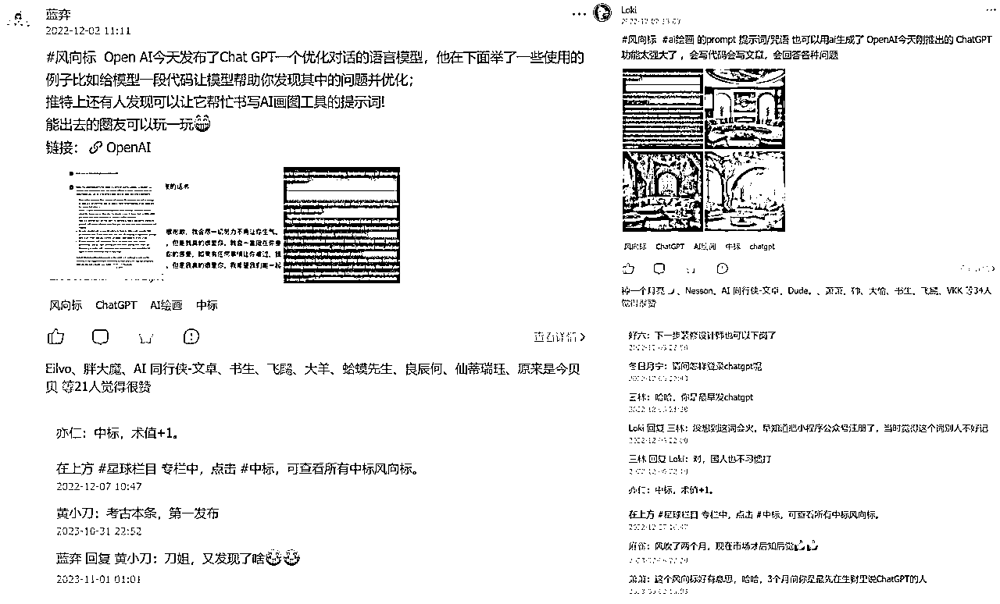

AI大模型，像一道闪电，炸醒了凡间的瞌睡虫。

理工科出身的我，本来就对科技前沿一直保持着浓厚的兴趣，AI大模型，也太好玩了吧！一发不可收拾，我开始贪婪的关注AI大模型的动向，不断去尝试和精进 …… 这，绝对是我的菜，我心里已悄悄埋下了菜籽，静待日后开花、发芽，直到长成小白菜，甚至将来的大白菜。

## 温水煮青蛙，第三次转型

与此同时，因持续受【Yi·情】和【贸易Zhan】影响，股市开始频繁波动，股民惨声连连，投资股票类的课程，自然不怎么受待见，买的人慢慢减少，我这边的收入也跟着波动，并逐步下降 …… 可挣过“大钱”的我，还在飘 ~ 仍执迷于旧的业务线，赚着还算可观的收入，像极了井底之蛙，一直不肯从日渐式微的循环中逃跳出来，还坐井观天，抱着一亩三分地，持续“啃老”！这个状态一直持续到 ——

2023年6月份，AI应用如火如荼，股市持续低迷，收入骤降，我终于坐不住了，直觉告诉我，必须立马转型，不然会屎的很惨，连喝汤都赶不上趟儿的那种。

下定决心后，我把原先的业务一篮子全部打包，转交给群里有意接手的小伙伴。我，又一次故意“裸辞”，破釜沉舟；我，再次，重启人生，继续超前摸索新方向。这就是我的性格，也是命，骨子里的自信，让我从不服输，这是我命里的底色。

# 四、AI+做课，跑通闭环，迎来事业第二春

## 苦行僧苦寻新方向

2023年7月-2024年7月，这整整一年时间，我像尊苦行僧，和家里人很少交流，一个人沉默，一个人旅行，一个人寻找方向 ……

成都往西走，就是川西，自驾的天堂。这一年，我经常一人一车往川西山里开，郁闷了就去，苦闷了就去，纳闷了也去。一路上随处可见的雪山、冰川、草地、牦牛，就像我的前世情人，频生情愫。有次，玩脱了，爬上雪山，过于兴奋，我一个没忍住，裸奔半圈，回来更是题诗一首：“裸奔雪山头，暴走肥膘肉；仙女身边过，只看山明眸”。

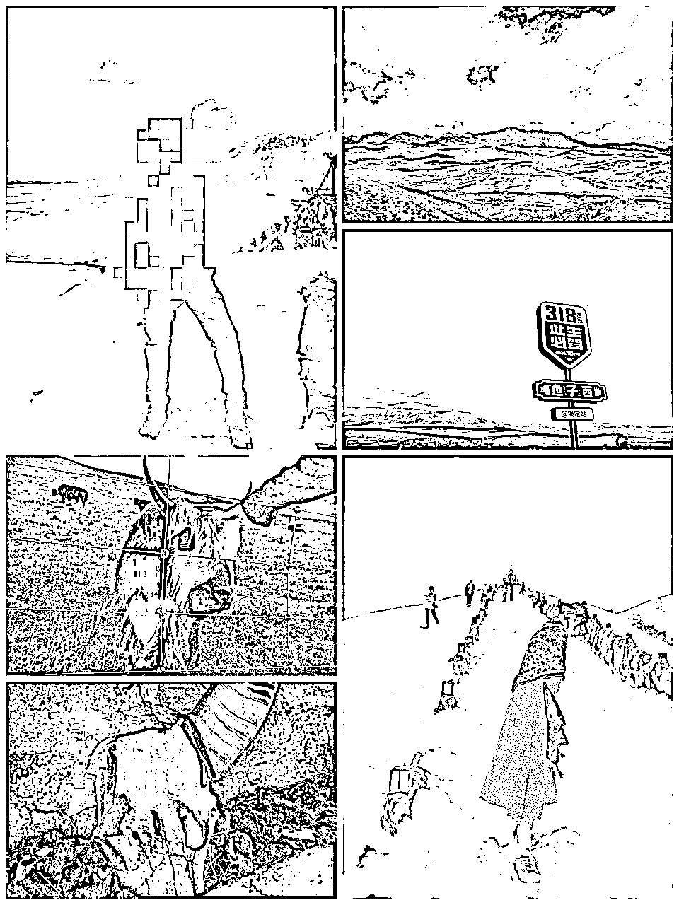

这一年，正事儿我也没闲着，一边各种知识付费学习，一边研究AI，苦寻业务结合方向。

直到有一天，我正在洗澡，边搓边想事情，外放音乐声还放得老大 …… 突然，突然就悟了！诶？既然我学过这么多课，也做过那么多课，懂AI又热衷AI，那为何不把「AI」和「做课卖课」这两个事情结合起来呢？AI应用已白热化，但AI在细分领域的应用还远远没有挖掘殆尽，AI和课程制作的结合，直觉上首先是个不错的方向，我又有长达6年多的做课卖课经验，还擅长AI技术，这两块儿业务结合，不就是我苦苦求寻的全新业务方向吗？

光想还不行，说干就干，我开始仔细摸排整个知识付费市场，梳理和研究了做课卖课领域的知识博主，发现把AI深度结合起来的不多，但有，且还做得不错，有跑通的优秀案例，更难能可贵的是，该细分领域仍属蓝海 …… 于是，「AI做课卖课」这项全新的业务方向，徐徐在我眼前展开，并且越来越清晰。

## AI+课程制作，筹备

我开始疯狂的报课、学习、摸索、研究，把课程制作的每个环节，尝试用AI提效，就像铺地板砖美缝一样，把我早就驾轻就熟的做课流程的每一个环节的缝缝，用AI提示词、工具来优化，这个过程，前前后后，大概持续了有多半年，这期间，我真的像尊苦行僧，学习、研究、融合，再吸收、优化、打磨 ……

提前布局，早做准备，而且要往正轨走，这期间，我还办妥了营业执照，成立起实体工作室（不怕跑路），并买全各类琳琅满目的录课直播设备（做测试），咱要做就往极致了做，要让客户对「AI做课卖课」这个领域的深入学习，充分建立在我们极致专业的软硬件配套之上！

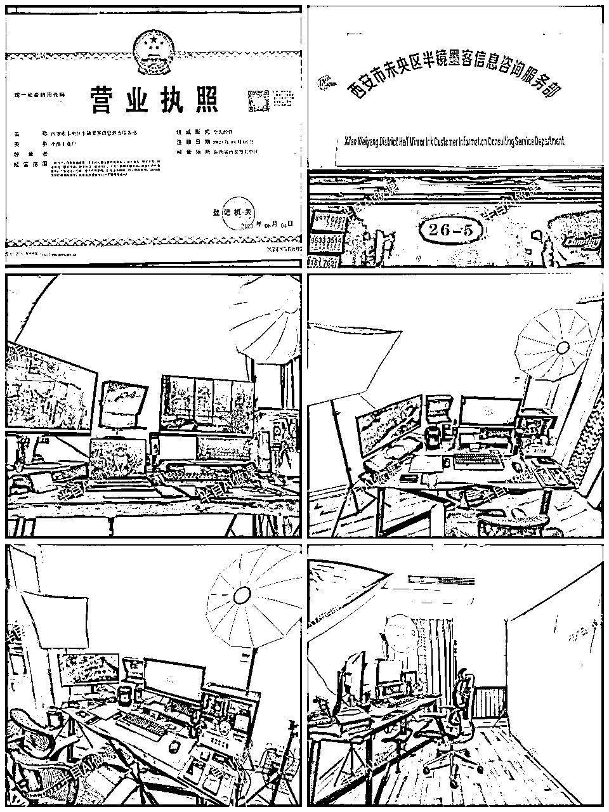

## AI+课程制作，启动

2024年8月份，课程制作每一环节的AI提示词已经打磨得尽显丝滑，那这个新项目，该怎么启动呢？流量又从哪里来？@张可粒 老师曾这么评价过我：“有种必成大器的感觉”，这句话给当时正处极度低谷期的我莫大的鼓励。是的，没错，就是这么有魄力，我眼睛都不眨一下（还是捂着心脏），直接拿出几万块钱，一口气加入了几个平时早就心仪已久的高质量社群，比如 @张可粒 老师的「超级个体孵化基地」、「粥左罗·10年顶峰会」、@芷蓝 老师的「玩赚合伙人」等等，我需要站在巨人的肩膀上，让老师们帮我修正整个业务线，并进行流量冷启动。

事实证明，以上斗胆决策，无比英明。整个8月份，在老师们的带领下，我仔细梳理了「AI+课程制作」这条全新业务线，从新课定位，到目标人群，再到价格体系，还有海报细节，都进行了非常细致的打磨。

新业务以《AI·7天做课营》这个课为开端，初始特惠价定为199元，（课程海报我就不贴出来了，避免引流嫌疑），大纲目录设计、卖点权益罗列，还有色系搭配，我认为挺出彩的（🤭），有值得借鉴的点。

## 1个小时17分钟，7单，收入693元！

海报有了，新课待发售，缺一个引爆点。8月26日，💡灵感乍现，我发了一条「烫头明志，为新课发售而烫」的朋友圈，@芷蓝 大佬帮我转发了这个「烫头梗」，一下子，有点爆了的感觉。

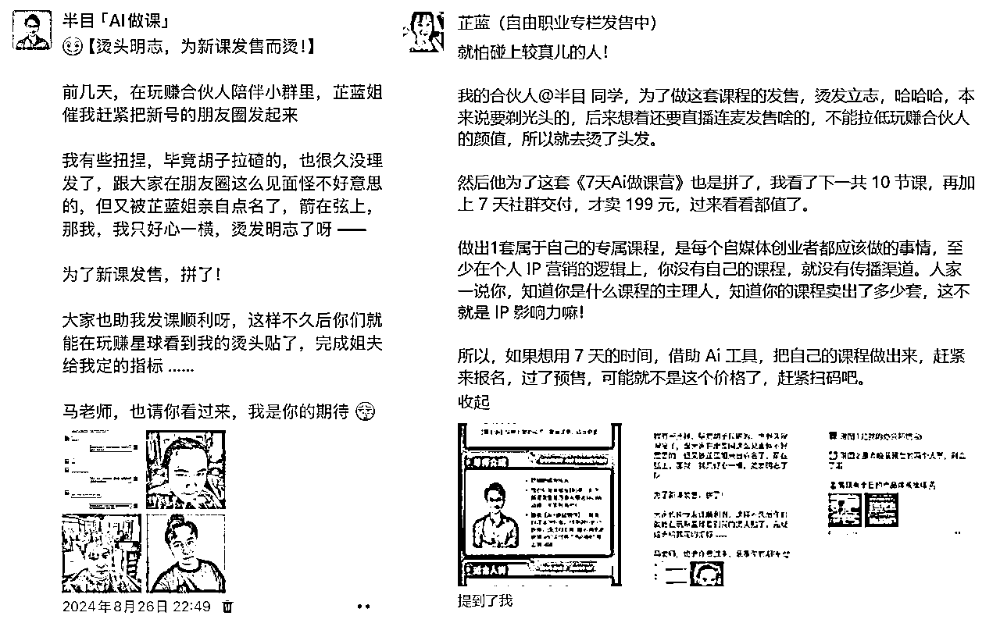

2024年9月2日，14:07-15:24，1个小时17分，总共来了8个微信好友，转化成交7人，收入693元！

这个成绩，完全符合预期，这个事儿，可行！不枉我为期一年的心理建设、物料准备和内容打磨。在这里要特别感谢 玩赚新媒 @芷蓝 和 @王斯基 还有 @马热爱 的认可和大力支持！

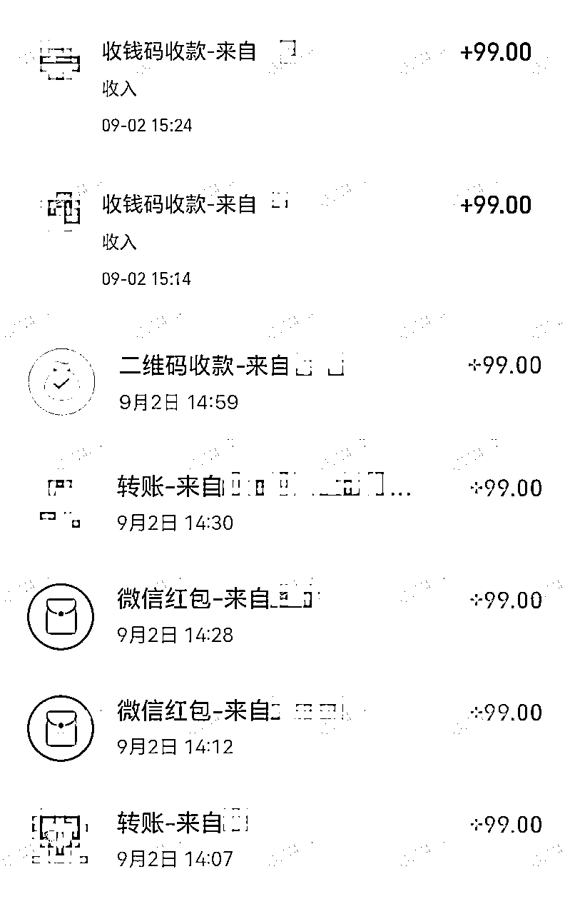

2024年9月2日-2024年9月13日，《AI·7天做课营》第一期火热开启，总计招收共85名学员，我讲的非常实操，也特别卖力，训练营事无巨细，内容干的能齁si人那种，基本没什么水分，大家对课程质量也非常认可，收到不少实打实的好评：

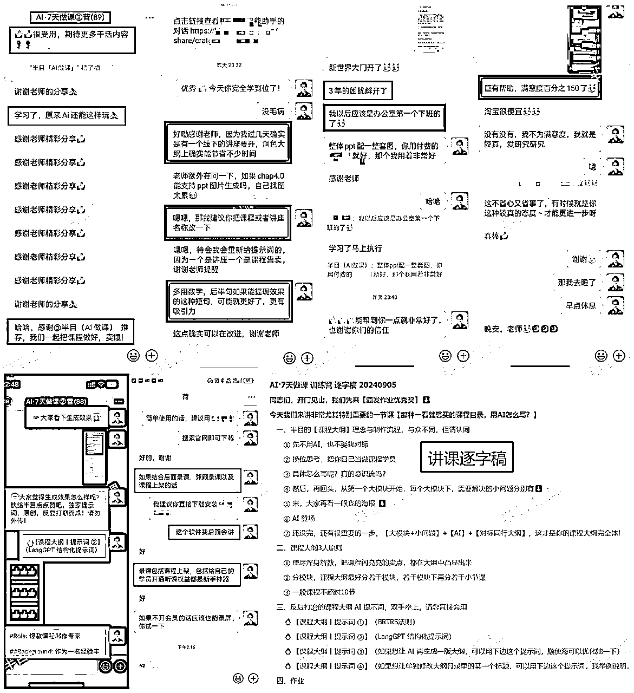

## 大佬主动链接，合作陪跑项目

人呐，果真是，越努力，越幸运，好事来了！

2024年9月4日，万人知识星球主理人—— @芷蓝 大佬，在听了我的两次课后，觉得我做交付的逻辑很清晰（可能觉得我的人品也还行🤭），所以，竟然，主动来找我合作，共同开发一款以「AI做课卖课」为主的私教陪跑产品，正好可以填补「玩赚体系」的「中客单价」服务，小群一对一指导，我们一起双倍交付：

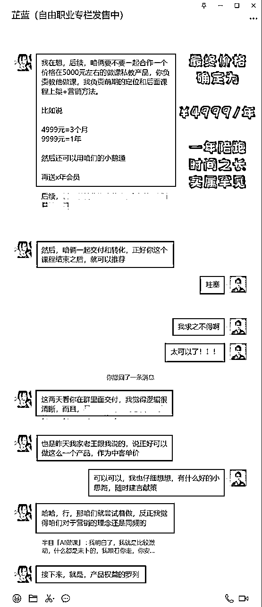

我除了兴奋，就只剩激动。「玩赚新媒」一直是我常年置顶的知识星球圈子，目前付费用户接近一万人，其主理人 @芷蓝 大佬更是我仰望般的存在，她的内容输出，十年如一日，发人深省，激励着我始终以内容为王，坚持长期价值。

兴奋和激动之余，自然更是不敢怠慢，我深知这是自己弥足珍贵的一次向上生长的绝佳机会，坚持和努力这么多年的意义，在这一刻凸显，既然被大佬看见，而且这么看得起我，再抓不住、抓不好，那就是我的问题。

说干就干，一刻也不耽搁，价值观和脾性相投，合作起来异常顺畅，往往我们同时头脑风暴互相抛出的一个点，竟能出奇的一致：

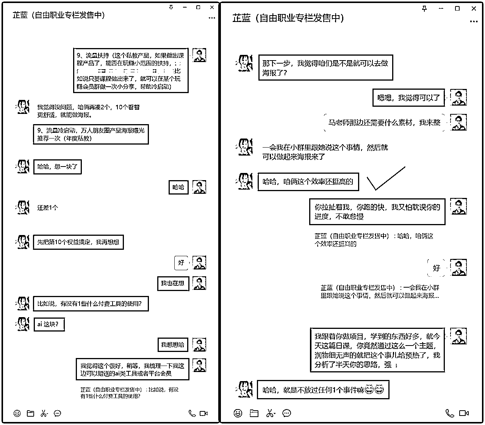

## 半目迎来事业第二春

就这样，经过近一个月连轴转的仔细打磨，我和 @芷蓝 大佬，从陪跑权益挖空心思的罗列，到陪跑流程的详细制定，再到sop的仔细梳理，还有课程海报的各种细节修改敲定，半目和万人星球「玩赚新媒」主理人 @芷蓝 深度合作，小群一对一指导，双倍交付，绝对硬核的《玩赚AI做课卖课陪跑》服务项目，就此诞生！

（课程海报我就不贴出来了，避免引流嫌疑🤭）

我觉得，苦行僧即将要迎来属于他的事业第二春，「AI+课程制作」这个蓝海赛道的闭环已完全跑通，且站在了 “巨人” 的肩膀上，接下来只要认真踏实做好内容，并用心服务客户，就一定错不了~

见字如面，大家一定能够从以上「字里行间」窥得出半目💯的真诚，相信大家也无比清晰的看到了：我是怎么一步步找准「AI+做课」这条蓝海赛道，并持续深耕的。✔️

也希望大家多关注半目，我也相信并且很自信，半目后续一定会携带更亮眼的成绩再次给大家汇报并分享，哪怕其中有一点点能触动到你的地方，或者我的经历和经验你能够借鉴到哪怕一丁点儿，那半目就很知足，说明我的汇报和分享有价值！

这是我第一次，细致梳理自己的过往，虽有不堪，但也有光亮。

期盼大家的点赞和评论，第一次长文分享，不知深浅，期盼各位多多点赞鼓励，更期盼大家就「AI+课程制作」这个我最擅长的领域进行提问，任何问题都可以，我定会毫无保留的分享和解答！

如果首贴反响还可以🤭，后续半目打算连载分享【AI+做课】的各种日常实操细节，给大家带来更多干货内容❤️