# 实现躺赢，用AI+Rpa从小红书爬取笔记，自动提取内容，自动改成小绿书，并自动发布整体思路分享（附：RPA脚本）。

> 来源：[https://b121w2zgwyx.feishu.cn/docx/GMDtddD10oQWlSxWUZEcuUFInof](https://b121w2zgwyx.feishu.cn/docx/GMDtddD10oQWlSxWUZEcuUFInof)

# 背景说明

小绿书最近很火，于是很多人就想到是不是可以直接搬运小红书的笔记来发呢？

但是有个问题，肯定不能完全一样的搬吧？

所以，就有人就提出是不是可以提取图片内容，进行修改然后替换背景图，改成小绿书呢？

当然可以！但是，这些操作，人工做起来还是相对繁琐的。

当然！目前，已经有很多大佬已经用AI+RPA实现了自动化了。包括我自己也整过影刀rpa的小绿书发布。从我自己的使用，以及交流群朋友的反馈来看。目前的AI+RPA工具，或多或少存在如下问题：

# 目前的问题：

1、rpa工具五花八门，对于不熟悉rpa的人，想用上工具，真的是九九八十一难。

2、有些工具封装的好，但内部流程我们看不到。当有些场景不适用的时候，自己想改又很难改。

3、当rpa操作的东西越多的时候，就越不稳定，只要链路上的某个软件做了调整，就有可能导致整体失败。

# 优化与改进：

为了解决以上问题，这一次的脚本思路我进行了以下优化：

1、尽量使用易分享的RPA，让大家在脚本的安装上更方便。

2、减少RPA工具调用的环节，能用接口就用接口。

3、工作流拆分零件化，让有需要修改需求的朋友，可以通过灵活替换节点，完成自己的迭代。

4、在使用上进行一定的封装，让即使不懂工作流的朋友，只要脚本跑通，也能正常用上功能

换句话话来说，小白有小白的用法，同时给予了已经上手的朋友，自我调整的空间。

废话不多说，老惯例，先来来看看这套脚本的展示：

接下来，我来分享一下整个脚本的思路，以及如何使用这套脚本

# 一、整体流程思路

1、使用rpa爬取小红书笔记，并将爬取内容存入到飞书。

2、coze工作流中，从飞书读取爬取的链接，进行ocr识别读取内容和修改，将修改后的内容，一键批量生成新的图片，最后录入到飞书的待发布文章中。

3、通过rpa触发coze工作流的自动执行。

4、rpa读取待发布文章，进行批量发布。

5、第4步的脚本，如果配合上 比特浏览器，就能实现多账号发布，并且还可ip隔离

6、所有脚本都设置成定时执行的话，就能实现整套流程自动化

# 二、脚本工具环境配置

## 1、比特浏览器安装

https://www.bitbrowser.cn/ 没什么特别说明的，直接安装就是了

## 2、比特浏览器配置

### ①、打开比特浏览器，做个基础配置

点击系统配置=》找到文件下载目录配置 改成你想要的目录

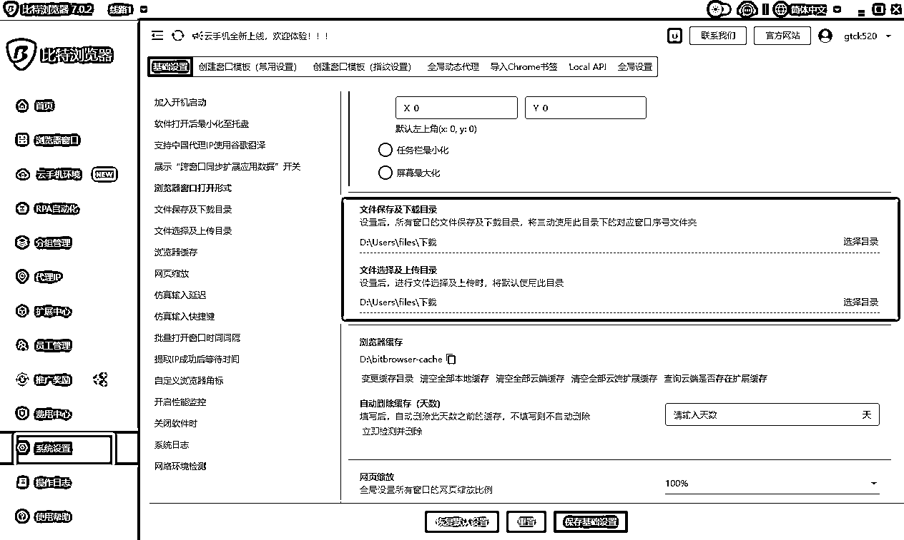

这个目录是后面 小绿书的图片下载时要用到的。

### ②、导入rpa脚本

需要导入的三个脚本为

1、

2、

3、

分别下载以上三个脚本到本地。

然后, 打开比特浏览器=》 点击 “RPA自动化” =》进入流程设计

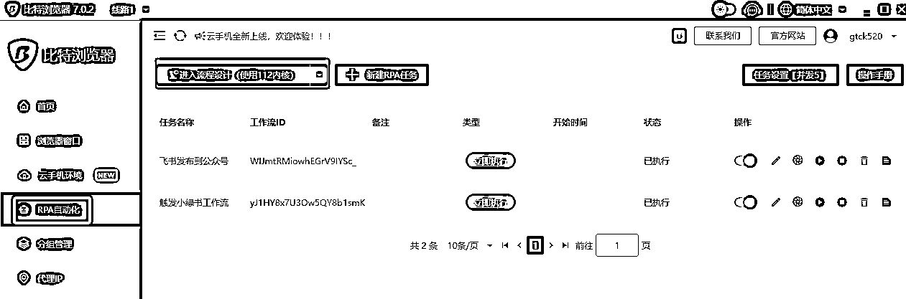

浏览器会初始化，并打开一个用于调试的RPA窗口，以及自带安装好的Automa 插件。

打开automa窗口，进入工作流页面=》点击下拉标志=》点击导入工作流，将前面下载的工作流导入

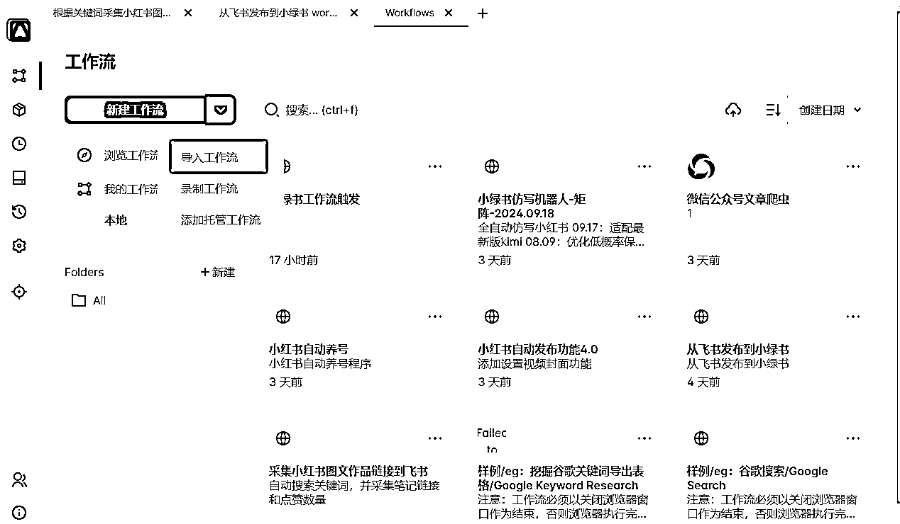

## 3、rpa配置

### ①、飞书账号以及链接的配置

【飞书appid与appsecret的申请（重要！！）】

我的AI方案都是基于飞书做存储数据，所以飞书应用的建立是必须的。这一步如果配置不好，工具跑不通。请大家严格按照教程操作。

进入我的飞书表格

创建一下副本

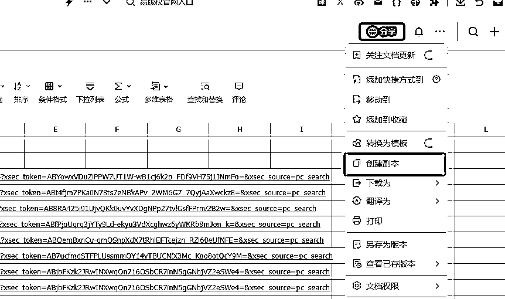

然后获取飞书表格链接，注意了，每个表单点击一下，链接都不一样的，后面的配置会用到，一定要对应正确的表格链接

### ②、脚本默认配置

接下来，我们开始进行脚本的基本配置，每个脚本都要配置哦。我们首先打开比特浏览器=》 点击 “RPA自动化” =》进入流程设计。

然后进入工作流页面找到我们的刚刚导入的脚本，点击进入脚本编辑页面。找到触发器的后面一个节点叫做“插入数据”，我们双击“插入数据”，然后点击左边的 “insert data”按钮；

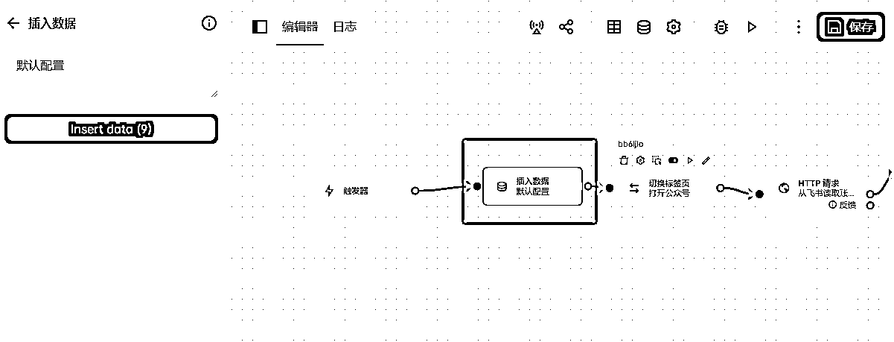

我们会看到这个配置页面，我们把这里里面的值，全部替换成我们自己的值就行了。切记变量名不要去修改，否则会出错

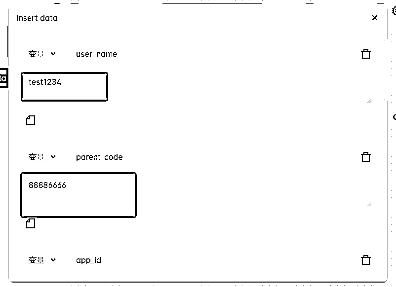

字段对应如下，配置的时候注意对应清楚；

app_id 填你前面飞书得到的app_id;

app_secret 填你前面飞书得到的app_secret ;

daifabu_sheet_url 填你的飞书待发布表单的url（前面有说明过了）

yifabu_sheet_url 填你的飞书已发布表单的url

zhanhao_sheet_url 填你的飞书账号配置表单的url

sheet_url还有xhs_sheet_url 填你的飞书的小红书爬取表单的url

save_draft 这个填1 代表发布到草稿箱，填0代表直接发布（待测试完善）

download_path 这个填前面第2步，比特浏览器的下载目录就行了

is_bite 如果是其他浏览器或者在比特浏览器rpa调试时这里设置为0； 如果是正式绑定到窗口使用时，记得设置为1；

三个脚本都有这个默认配置项，记得修改！！

配置完成记得点击右上角的 保存！

## 4、将rpa配置到比特浏览器，以实现定时执行，和ip隔离。

上面的配置完，其实直接运行就可以用了。不过为了实现多账号，以及定时执行，我们还需要将rpa脚本绑定到浏览器的窗口中。

### ①、点击浏览器窗口=》创建窗口

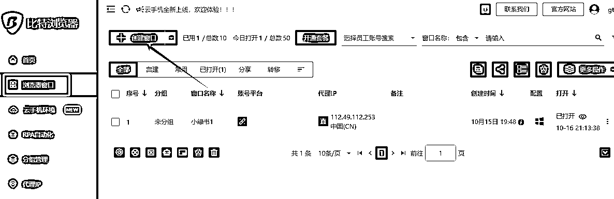

### ②、设置一下窗口名称，其他的用一键随机生成就行了

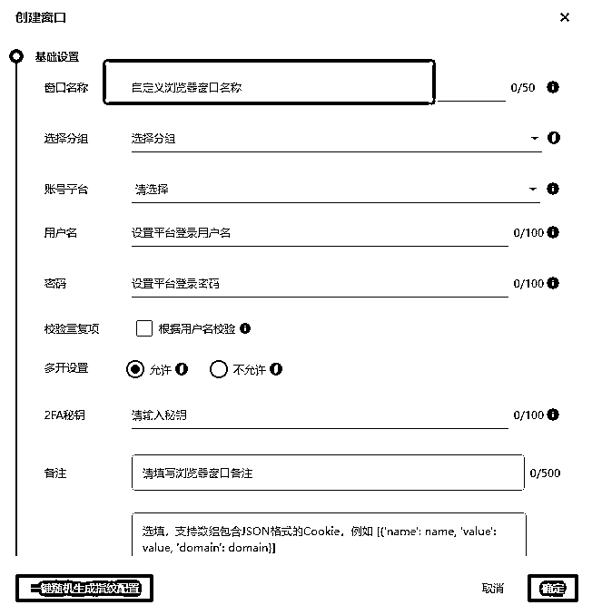

创建成功的话，这里会出现你命名的窗口

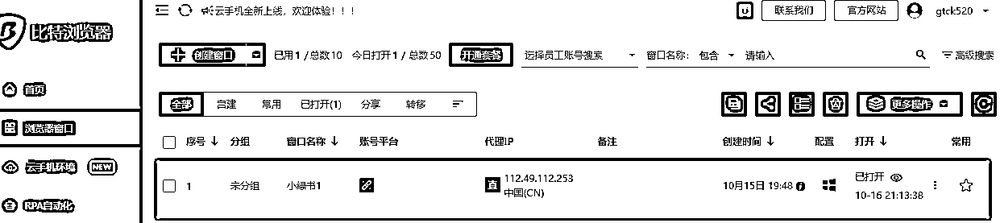

这里的窗口，你们就理解成一台小电脑吧，他只运行了一个浏览器。 但是每个窗口可以有不同的ip地址，这样你如果有不同的账号，就能模拟出不同电脑登录的效果了。

因此，你要做几个账号，就创建几个窗口，然后将不同的微信在不同的窗口里面登录就行了。

### ③、点击rpa自动化=》新建rpa任务

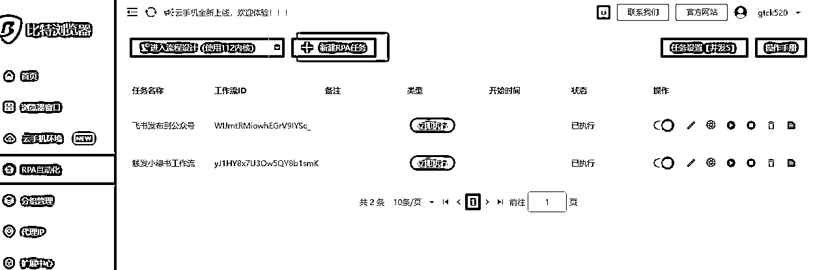

### ④、填写任务名称，工作流ID，然后点击绑定：

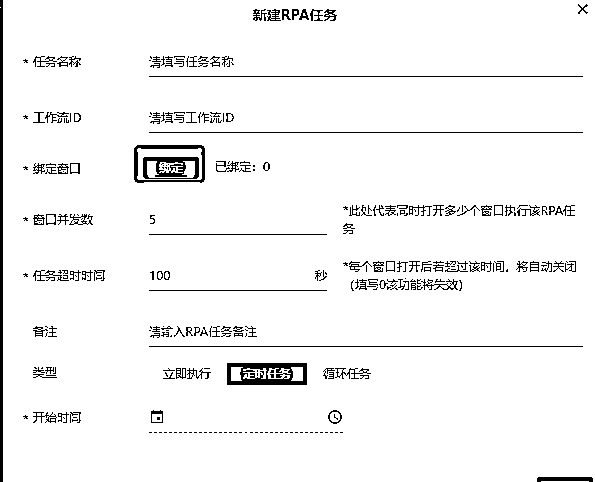

### ⑤、在弹出的绑定窗口中，选择你要绑定的窗口

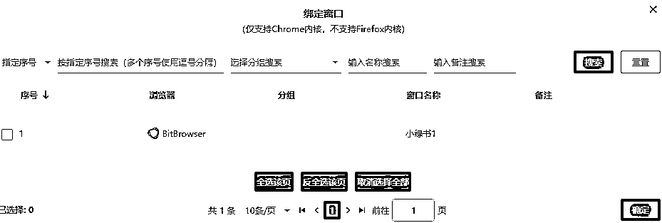

脚本就绑定好了，其他脚本一样的操作，不过要注意，采集小红书的脚本，运行前有个输入参数要填，如果绑定到窗口执行会不方便。建议暂时不要绑定。除非你知道怎么优化脚本。

### ⑥、两个脚本都绑定后，会出现如下页面

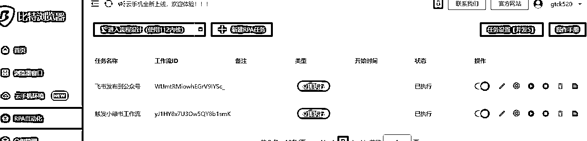

### ⑦、这里提一下重点注意项

以上绑定脚本时，有个工作流id是从这里复制的：

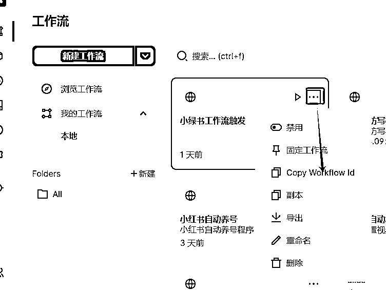

绑定到默认的窗口后，从飞书发布到小绿书的脚本里面，有个保存资源的控件，默认没有写入下载目录的权限，我们要去修改一下。

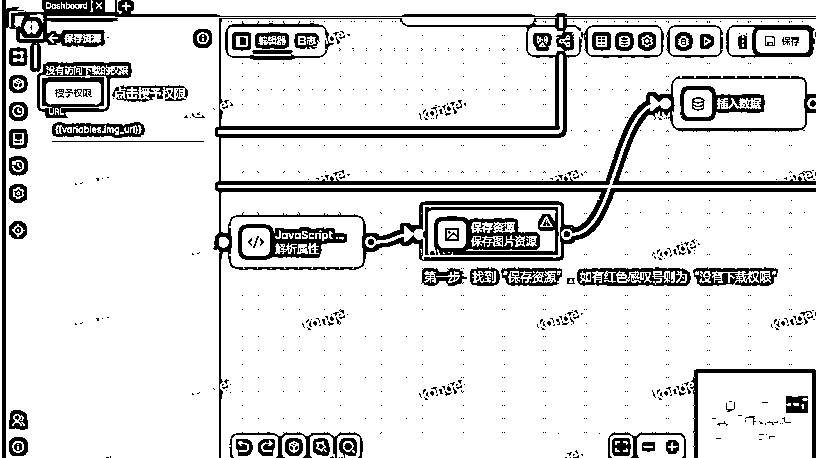

到这里基本没什么问题了。开搞吧！！

# 三、脚本问题说明

目前，我这套流程，还是存在不少问题的，比如说，对于图文结合比较多的小红书笔记，例如这样子的：

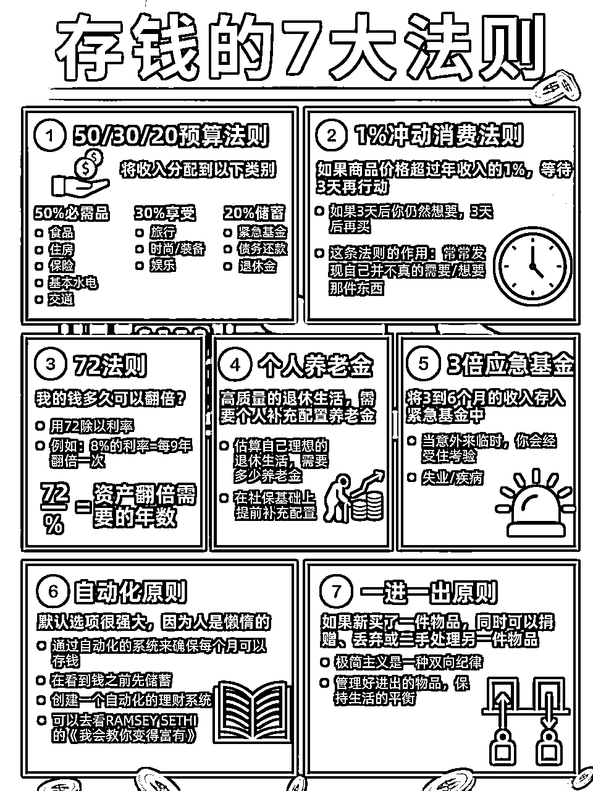

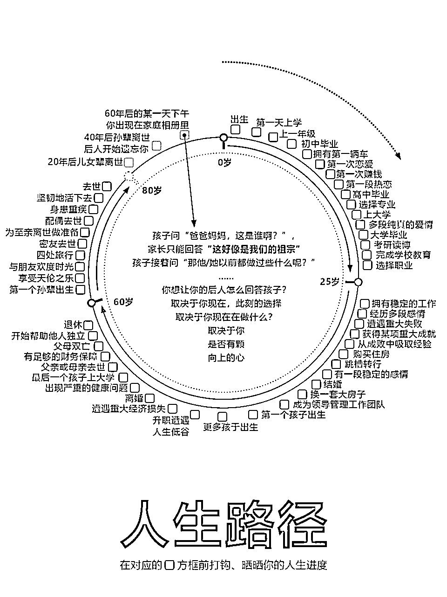

OCR能提取到内容，但是里面的内容是所有的拼凑在一起，无规律的 例如：

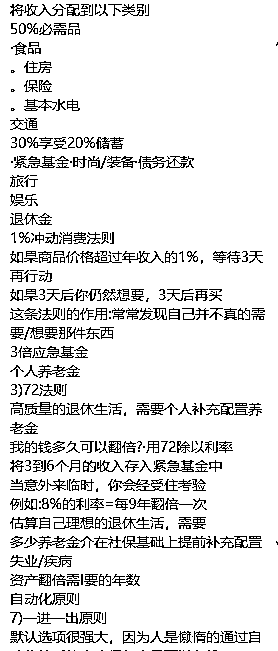

虽然大模型可以根据语义，大致理解和修改出来。 但是很难还原出笔记原来的精髓！！我测试过，我目前的工作流这种改出来的基本不能用。期待有大佬能搞出更牛的方案

目前，图片只有干净背景，文本比较简洁的才容易转换成功，内容太多的也有可能导致，跟预设的模板不匹配的问题。

不过总体来说，总能挑出一些基本能用的拿来发了，比自己动手做强多了。

# 四、常见问题

## 1、采集小红书运行成功，但没有录入到飞书。

所有不能正常录入飞书的情况，99%是权限配置和表格没对应的问题，请先排查配置情况。我已经增加了一篇飞书的详细配置教程，自行参照操作：

## 2、小绿书工作流触发脚本运行报错

“很抱歉，同步失败。请检查网络连接是否正常，或者稍后再试。” 或者 运行中止 之类的。 只要脚本不是一运行就失败。而是转圈圈，转了很久才失败的话，基本是因为coze工作流的超时导致的。 但是，超时了，实际上飞书可以正常生成文章内容，大家检查飞书待发布表格是否有内容。有内容就忽略报错就好了。

## 3、飞书发布小绿书脚本报错：Cannot read properties of undefined (reading '账号名称')

还有类似的Cannot read properties of undefined (reading '标题') 。是因为读取的表格里没有内容。请先检查内容是否为空！或者待发布文章表格链接是否配置正确

## 4、脚本运行无报错，但公众号没有执行发布

账号配置里面有 领域和 类型， 只有当待发布的文章，领域跟类型跟账号配置的能对应上，才会发布。并且账号配置里的 账号名称 要跟公众号的名称一致才行。脚本靠名称识别是否发布。

## 5、Mac电脑路径构造跟windows是不一样，请修改脚本里面 提取图片内容 代码块 的路径格式

# 感谢

感谢圈友@朱越的小绿书精华文，本文的脚本是参考了大佬分享的脚本改的！省了挺多事。