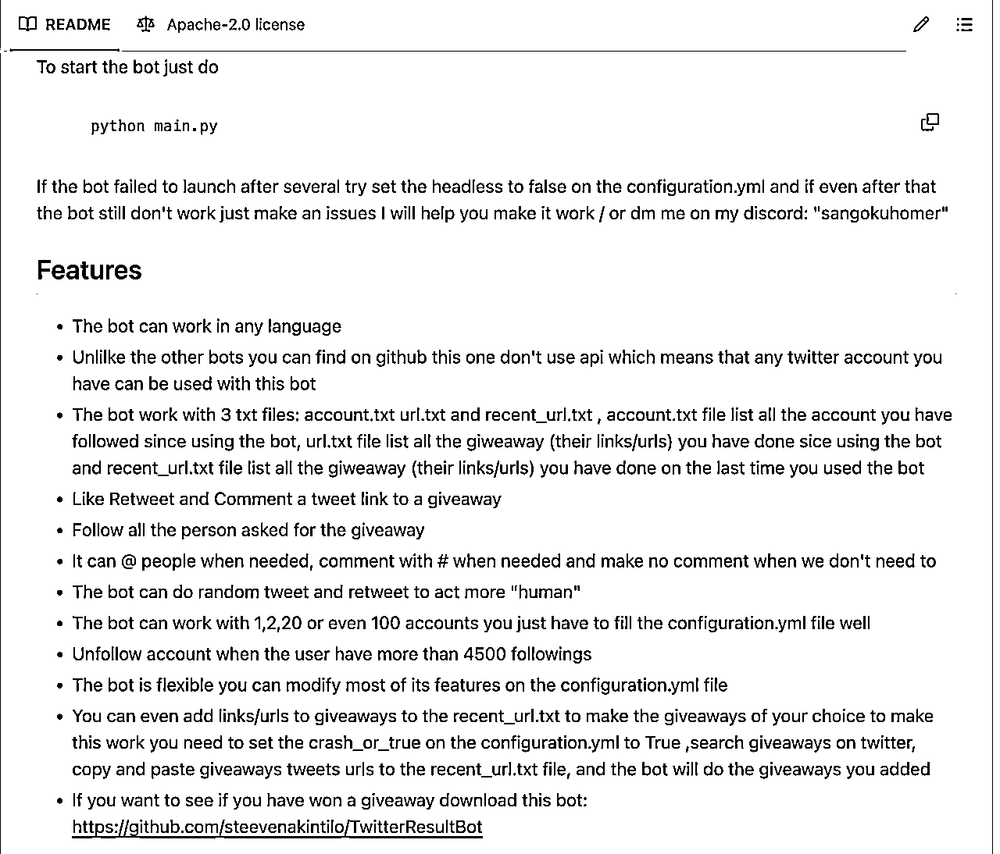
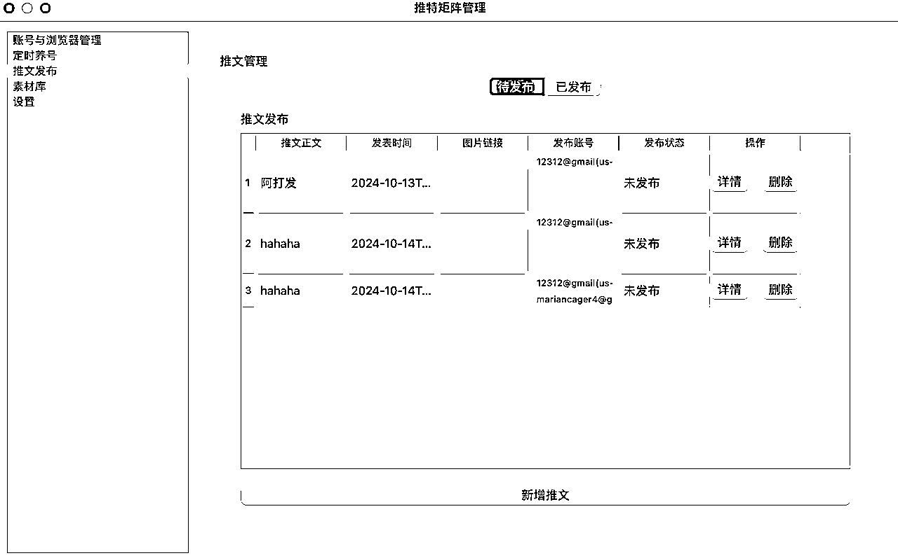

# RPA+指纹浏览器自动化，借助AI实现海外社媒矩阵运营工具的开发

> 来源：[https://ia0969wpr2.feishu.cn/docx/Gp5SdjLOJokzwcxtHGHcFCGqnCc](https://ia0969wpr2.feishu.cn/docx/Gp5SdjLOJokzwcxtHGHcFCGqnCc)

使用AI完成一个社媒矩阵运营自动化的工具，完全模拟人工阅读推特进行养号与发推。

最近因为有几个住宅IP在指纹浏览器空闲着，觉得浪费掉也是浪费掉，为什么不充分利用这些资源，开发一个全自动的海外社媒运营工具呢，把海外的社交媒体都注册起来多养几个号，这样不仅可以用于自动化营销和内容分发，还可以在Web3项目中薅羊毛。今天终于有了时间，开始来干这件事。

目标是开发一个全自动化的社交媒体运营工具，至少要支持以下平台和功能：

- 支持多平台：Twitter、YouTube、Reddit、Pinterest、Instagram、ProductHunt、Discord等主流海外社交媒体

- 全自动运行：设置参数后，无需人工干预，每天全自动运行

- 功能多样：包括账号养成、内容发布、互动、矩阵分发、dashboard看板集成作品数据等、

实现上我们使用指纹浏览器+playwright，本质上是更加高效的RPA，因为影刀类的RPA会接管鼠标和键盘，只能串行地执行任务，无法形成矩阵并发操作，我们借助指纹浏览器实现环境隔离，playwright实现自动化控制，最终实现矩阵运营自动化。

第一阶段是想法验证，借助AI从0到1能够完成了整个工具的构建，目前已完成Twitter平台的功能开发。当前完成的功能有：

1.  单台电脑矩阵化操作，多账号+指纹浏览器+代理环境隔离，本地测试每次运行10个账号完全无障碍，每天晚上自动运行即可。

1.  主页信息流推文阅读，大于一定临界值的推文进行点赞与转推；包含关键词，点赞数大于临界值的推文使用gpt4o进行自动评论

1.  随机点赞、随机转推

1.  指定推文进行点赞、转推、评论

1.  关注指定人

1.  一键分发所有内容、集成小红书自动同步

界面如下：

自动养号与发推：

### 开发流程

下面是整体的开发流程

第一步是新建项目，这里我使用的是cursor，因为就不需要我们来回粘贴提示词到网页了，再加上cursor的绝佳开发体验，效率直接翻倍。我们打开cursor，输入快捷键ctrl+i，调起composer模式，直接输入提供我们的需求即可：

提示词：

我想基于playwright新建一个社媒自动化项目，包括Facebook、Twitter、Pinterest、YouTube的自动化浏览、点赞、发帖、上传等功能。从而尽可能模仿真人完成社媒养号与运营自动化。请你为我创建一个新的项目目录，包括必要的目录、文件等。

可以看到，cursor已经为我们生成好了目录：

这时我们看到一个完整的项目目录和必要的Python文件他都已经帮我们创建好了，并且写好了入口类，真正的一键生成，剩下的就是我们根据具体需求再次进行深入沟通

因为我想优先实现推特平台的自动化，就先从养号开始，首先就是随机点赞。随机点赞的话我们就需要知道页面元素信息，这里大家可以使用谷歌开源的visBug插件，方便我们快速地复制页面元素并且发送给推特。

谷歌商店地址：

https://chromewebstore.google.com/detail/visbug/cdockenadnadldjbbgcallicgledbeoc?hl=zh-CN&utm_source=ext_sidebar

我们打开推特主页，找到一条推文，然后选中点赞按钮点击，这时候直接ctrl+c，发现点赞部分的页面元素已经复制下来了，接下来我们把点赞的页面元素和我们的需求发送给cursor:

给出源码之后我们运行测试，发现很完美，我们的需求完整实现。

#### 关键词点赞

接下来问题又来了，随机点赞可能影响后续算法推荐，不利于账号定位。所以这里需要继续优化，使用关键词识别，例如，设定包含特定关键词的内容才会被点赞或评论

因为我没有提供压面元素，所以第一次cursor写的代码样式定位是不准的，获取不到推文正文内容，我们再次使用visbug这个插件提取页面元素信息给到AI，让他帮我我们准确定位。

下面是对点赞大于100的推文进行点赞或者转发操作，当然100这个数也可以加到自定义设置中，这里为了方便开发我先设定为100：

这是我们发现控制台已经打印了所有的点赞数，完美：

同样的提示词也可以应用到随机转发和指定链接推文的点赞评论上。 因为提示词的结构类似，都是描述需求和页面元素，Claude 就能给出相应的源码。所以就不再赘述了。

#### 推文发布

接下来我们完成推文发布部分的开发，这里我刚刚输入了一个post_tweet，我们可以看到cursor就已经自动提示补全了，tab 接受之后测试发现一次通过无需修改。既然那样我们就可以立即想到，代码补全功能之所以能准确预测代码，是因为它学习了大量开源项目的代码。类似的，如果AI能够完整无误地生成推文发布的逻辑代码，那这些代码很可能已经在开源项目中存在。为了验证这个想法，我们可以去GitHub上搜索一下相关项目。

我们打开github，在搜索输入框输入关键字："https://x.com/compose/tweet"，发现果然有自动发布的机器人

monica翻译总结一下，我们发现我们想做的功能这里已经都有了，不过遗憾的是他是使用selenium，我们是使用playwright，这时候我们可以选择拷贝推特操作部分的代码交给cursor参考修改一下，开发效率会更高。

关于推特操作这部分我们就不再赘述了，不管是参考现有的项目还是使用cursor继续进行开发都是一件很简单的事情，我们继续下面的部分，接入AI自动评论，提高我们的账号权重，和接入指纹浏览器只限多账号隔离矩阵操作。

#### GPT-4o接入

接下来我们接入GPT-4o，我们找到刚刚的评论部分的代码，ctrl+i唤起cursor，接入ChatGPT。

请新增一个AI交互功能，对符合要求的推文结合正文使用openai的gpt4-o-mini模型进行AI生成回复，另外为了方便应用后续扩展，请你抽像一个单独的AI类，满足不同平台对AI的需求，不同节点通过输入prompt直接获取回答即可。请按照需求生成代码

代码直接apply即可，也可以使用composer一键保存，这种简单代码cursor几乎是必过的，毫无问题。

#### 接入指纹浏览器矩阵分发

这里我使用的是比特浏览器，我也横向对比了几个指纹浏览器，比特的API相比来说更全全面，可操作性也更强，免费用户也有十个环境，即使后续需要其他套餐收费和其他hubstudio相比也便宜一些，所以比来比去最后选择了比特浏览器。

如果没有账号的话点击链接 比特浏览器官网地址 进入比特浏览器官网直接下载安装，然后注册即可。

安装完成后登录打开比特浏览器，我们可以创建浏览器，输入自己的代理，这样可以尽可能地伪装我们的环境，不同账号使用不用IP相互独立，避免平台的关联检测。

在比特浏览器主窗口我们点击“创建窗口”，在弹出框中根据自己的代理类型输入即可，然后生成随机指纹，这样我们就可以使各个环境独立开了。

我们继续后面的步骤：使用API控制多浏览器。

首先打开官方的API文档：https://doc2.bitbrowser.cn/jiekou/ben-di-fu-wu-zhi-nan.html

这里我们使用的是Python，所以直接下载python 示例代码。我们把demo信息扔给cursor，让他帮我们写一个browser类，封装下基本的方法

这部分就开始因人而异了，每个人要根据自己的需求针对AI生成的代码进行适当地改动了，如果单线程处理的话通过AI生成的代码基本满足需求，但是后面的多窗口同步操作因为给的参考代码和文档上下文太长，导致生成的代码错误率有些高，建议这块可以分块完善。

我们执行下AI生成的第一部分代码，发现可以正常地打开和关闭指纹浏览器窗口，这时候说明接入成功了，因为本质上我们是通过端口替换掉了默认浏览器，仍然是通过playwright进行操作，所以我们后面直接忽略指纹浏览器就好，因为不会给我们的开发带来任何困扰

#### GUI 可视化界面开发

我们实现了基本的操作逻辑后，下面就是搭一个可视化的界面降低我们的操作成本了，下面是我在开发过程中使用到的提示词，帮我成功封装了上面的代码流程。

首先创建一个主页

请使用pyside6帮我实现一个推特矩阵管理的GUI界面，左侧菜单栏包括：账号与浏览器管理、定时养号、推文发布、素材库、设置等菜单项。右侧主体页默认为账号与浏览器管理，分为两个tab，分别为账号管理、浏览器管理，均为列表。账号列表包括用户名、密码、浏览器（下拉框可以选择）、备注，界面按钮有新增。浏览器列表包括：分组、窗口名称、代理IP、浏览器ID、备注、创建时间。请注意界面设计合理、元素布局间距适中，美观大方。

一次性生成的效果如下，看起来比较丑，不过没关系，最后我们可以去美化下，这里先维持默认样式不变：

接下来继续生成养号主体页：

请帮我实现养号主体页，分为两个tab，一个tab为账号动作，一个tab为定时任务，账号动作tab包括一个表格，字段有：账号、别名、动作、创建日期、操作（编辑按钮）。另外在上方添加“删除”、“新增”两个按钮。注意删除按钮可以批量操作，可以同时选中多条数据进行。点击新增按钮时候跳出弹窗，需要选择账号、选择动作（多选，包括随机点赞、随机转发、关键词点赞、关键词转发、关键词评论。当选择关键词类的动作的时候，需要在下方输入关键词，注意当选择的不是关键词类动作的时候则不需要显示关键词输入框）；定时任务tab页包括表格，字段为：任务名称、任务账号、定时表达式、备注、创建时间、操作（编辑按钮）。按钮为删除与新增，删除同样支持多选删除。点击新增按钮后跳出弹窗，输入任务名称，选择账号（多选）、输入定时表达式、输入备注。

这样养号界面算是开发完成了，账号动作中我们可以配置随机点赞、关键词评论等等，把刚刚的推特页面操作都加进来：

推文发布主体页：

请帮我实现推文发布主体页，包括一个表格，字段有：推文正文、发表时间、图片链接、关联账号（可以多选）、发布状态。操作列按钮：立即发布。

按钮包括：新增、批量修改。点击新增后弹窗输入推文正文、选择发表时间、选择或者输入图片地址（在线或者本地地址均可）、选择关键账号（动态数据库获取且可以多选）。批量修改中可以多选数据，然后弹窗修改发表时间和关联账号，注意批量修改只可以修改关联账号和发表时间两个字段。

这个页面也是我们最重要和核心的页面了，我们要在这里新增推文和定时任务，帮助我们全自动地进行发布，同时后续如果有其他数据源或者素材库的文本，也可以直接导入进来，一劳永逸地解决素材来源问题：

后面数据结构部分就不再赘述了，基本上是相通的，就是要把数据持久化到我们本地，数据存储可以有很多选择，比如Excel、飞书、本地数据库等等，这里我们根据个人实际需求进行选择即可，这里我使用的是数据库，方便联动其他来源的素材：

请帮我新建一个推文 tweet_post 表，包括tweet_id、tweet_text，pic_urls、videp_urls、create_time、source字段。一个tweet_account关系表，包括tweet_id，account_id、publish_time、status、create_time

#### 业务逻辑优化与bug修改

下面就是最繁琐和考验耐心的debug环节了，我们把刚刚实现的逻辑串到GUI可视化界面后，难免会有一些小的错误，但是也不用担心，实测 90%的问题AI都可以解决，我们需要付出的就是耐心点而已，在这里我们的工具1.0就已经问世了，已经可以实现简单的养号和批量发布了。我们可以根据需要添加一些小功能，比如账号一键登录，我们买来或者注册账号录入到我们的工具后，加一个一键登录按钮，帮助我们批量登录所有账号

#### 定时执行

我用 PyInstaller 将一个带有 GUI 界面的 Python 程序打包成了 EXE 文件。程序中保存了一些需要定时发布到 Twitter 的推文信息，推文发布逻辑已经实现，但我现在面临一个问题：如何才能实现定时发布功能？

我对定时发布的时间精度要求不高，前后误差 10 分钟都可以接受。

由于程序已经打包成 EXE，无法使用系统级别的定时任务。我希望程序在打包后，可以在程序内部设置定时或者轮询实现这个功能，请问有什么可行的方案吗？如何实现？

上面是claude给出的定时发布的解决方案，因为对发表时间不是很敏感，最终我选择了第一种的后台线程轮训方案，第一版代码几乎就是可用的，我们要做的就是尽可能地提供更多的上下文。

### 样式优化

到这为止我们的功能基本上就已经实现了，但是还有一点就是界面实在太丑了，左边的list都挤在一起，视觉效果很差，所以我们继续优化一下样式，这里因为做的是推特矩阵，所以我使用推特主题色进行以下美观，提示词如下

这是我们开发的推特矩阵管理工具，请你把左侧帮我改成菜单的样式，这样视觉效果会更好，默认为自然色，hover和选中的时候背景为推特的天蓝色主题色，注意菜单大小适中，不要太大，过度自然，不要太突兀，另外所有的按钮也都改为天蓝色的推特主题色，这样更加一致。

我们直接apply cursor生成的代码，重新启动应用，发现样式已经变成下面这种推特蓝主题色的风格了，左侧菜单栏视觉效果较以前也有了很大的变化。

### 后续规划

1.  数据采集：采集所有同步数据与评论信息；另外去年写过一个推特数据采集的分享，原链接：https://t.zsxq.com/l10gc 后面打算集成进去，可以一键采集关键字推文、用户推文、时间线推文等等

1.  集成小红书分发，之前写了小红书笔记采集的APP端与web端脚本，见之前的生财分享：https://t.zsxq.com/un0Cm https://t.zsxq.com/Xpvu2 后面打算集成进来作为素材库数据来源

1.  素材库搭建：克隆小红书笔记、克隆抖音、批量采集小红书、批量采集抖音、自动裁剪图片，AI修改去重AI改写等，可以一键添加到待发布

1.  可以计划任务执行时间，24小时无休群发图文、视频、链接等形式内容的消息。

经过近一天的开发，我也成功从0-1开始构建了一个推特营销矩阵工具，这也证明了完全可以使用cursor完成一个项目的开发工作，所以后面在完成上面的规划内容后，我打算下个计划挑战使用cursor开发完成一个生产级项目：YouTube矩阵化运营，包括关键词数据视频采集、本地视频文字转录、24小时无人值守，环境隔离，作品矩阵分发，自动Google账户登录、自动点赞、根据作品内容评论。环境隔离与多账户矩阵批量上传、播放数据统一管理查看等功能。相信借助cursor在一周内可以完成1.0版本的开发。