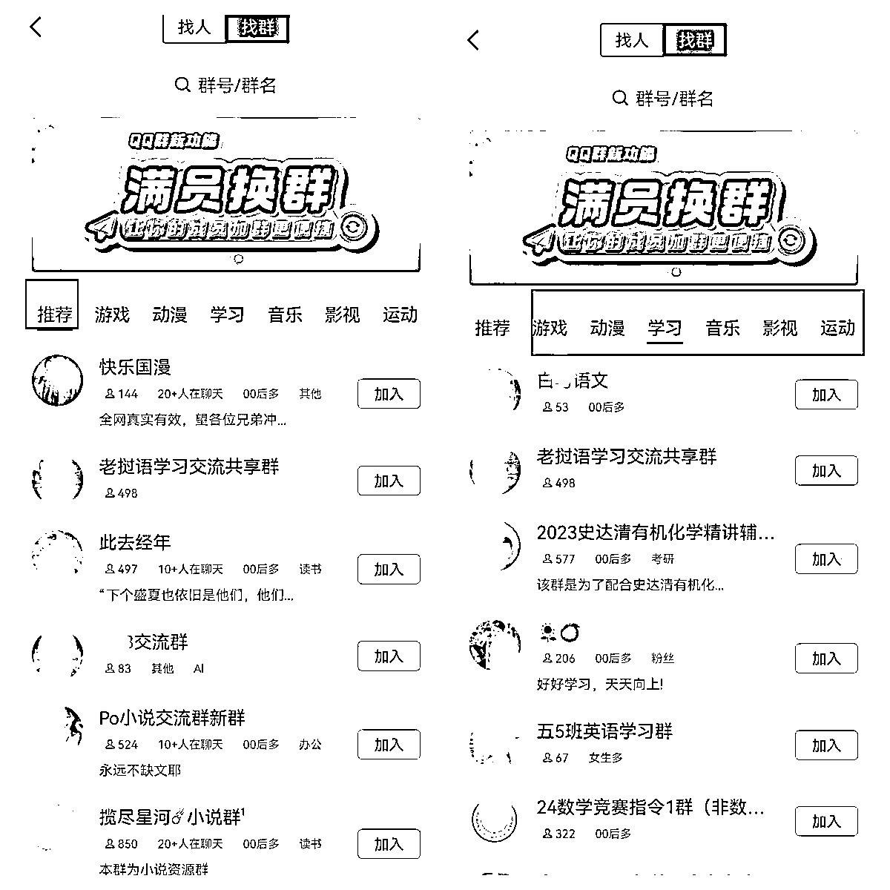
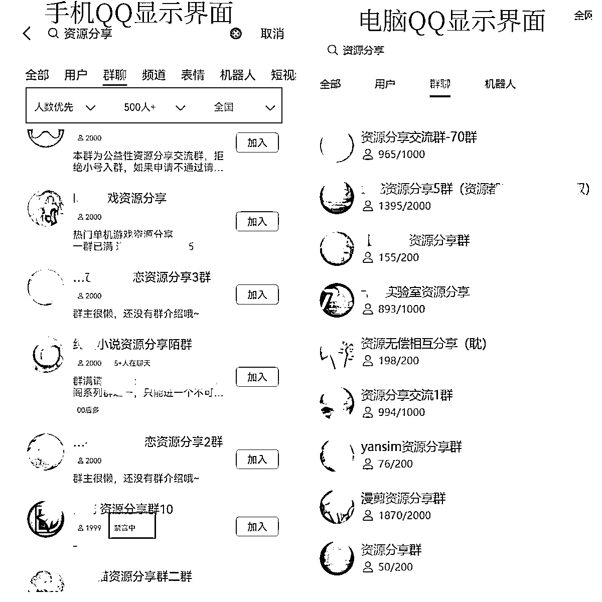
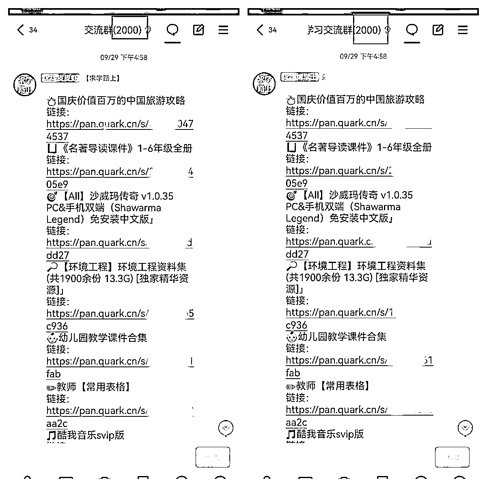
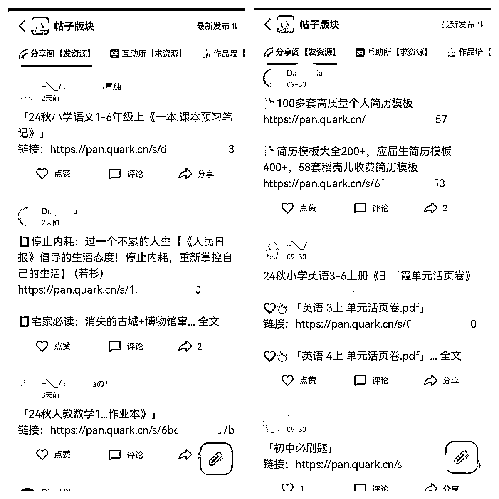
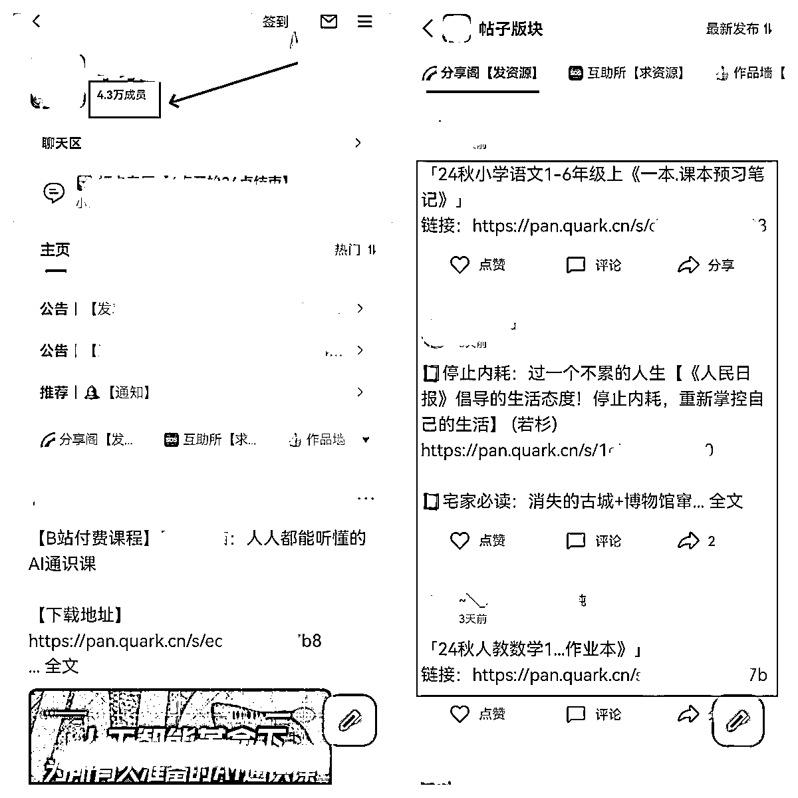
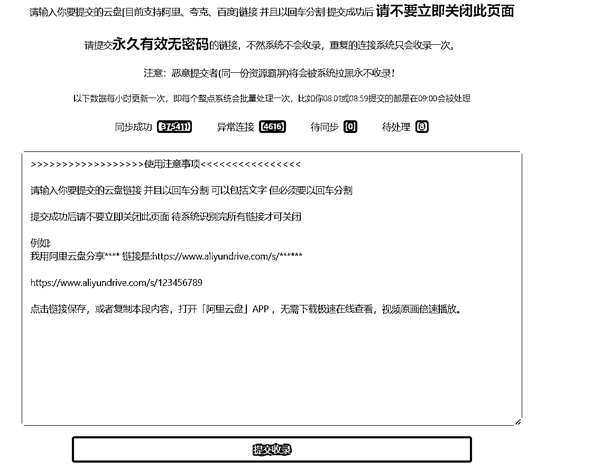

# 资源无脑分享玩法教程（网盘拉新）

> 来源：[https://z7h6phhn3p.feishu.cn/docx/GvF2dBIrgo6H3CxguNWcQiZenRf](https://z7h6phhn3p.feishu.cn/docx/GvF2dBIrgo6H3CxguNWcQiZenRf)

圈友好，我是一网，专注网盘拉新变现，三年生财圈友，今年是生财第4年。

任何项目，都需要做流量，而做流量，就是做内容。

做内容，要么纯文字，要么图文，要么音频，要么视频。

但是网盘拉新项目的有些玩法，以上那些统统不需要，也一样可以做好网盘拉新！

下面我给大家分享一种新玩法：资源无脑分享玩法。

不需要写文章，不需要做图片，不需要做音频，不需要做视频，甚至不需要对标同行。

只要一部手机，无脑分享资源，就可以做网盘拉新。

适合所有网盘拉新的新手和老手。

# 资源分享玩法简介

原理：我们通过收集和整理可以分享的平台地址，然后转存需要分享的资源到网盘，每天不定时的无脑往平台分享即可。

# 资源分享玩法优势

门槛低，只需1部手机就可以操作，每天30分钟。

简单化，只需要对接网盘拉新后，每天无脑分享资源即可，小白也能操作。

收益稳，只要每天分享资源，用户转存，就有转存收益。

适用广，不需要写文章，不需要做音频，不需要做视频，甚至不需要对标同行！

# 3种资源分享玩法

QQ群分享，QQ频道分享，网盘搜索站分享

# 网盘拉新渠道

拉新渠道：https://dt.bd.cn/#/pages/login/register?invite_code=678678

注册后，要下载APP登录，如果看不到网盘项目，可以联系我帮你处理

# 资源分享玩法怎么做

## 资源分享玩法1：QQ群玩法

（1）准备QQ号

建议选择老号，如果确实没有老号，可以去某宝看看。

（2）QQ养号

不管是注册的新号，还是通过其他途径获得的新老号，都是需要养一养。

不需要很复杂的养号流程，每天就像正常用户一样，登录QQ，随便浏览QQ上的功能就行。

（3）确定赛道

确定你想推广的网盘资源赛道，一般来说，我们建议综合赛道。

只要不违法、不违规，什么资源都可以分享，用户需要什么资源，你就分享什么资源。

（4）整理关键词

我们分享资源之前，要先找到那些可以分享的QQ群，并加入到里面。

我们一般会根据自己所做赛道，选择对应的QQ群。

只有加入到垂直类的QQ群，分享相关的资源，转存的效果才好。

找QQ群，本质上就是找关键词。

比如:我们想分享学习资料，那么可以搜索“学习资料”、“小学学习资料”、“中学学习资料”、"初中学习资料”、“高中学习资料”......

比如：我们想分享影视资源，那么我们可以搜索“电影”、“电视剧”、“短剧”、“美剧”、“韩剧”.......

能否找到更多的精准QQ群，取决于你能否找到精准的关键词，找到这些精准的关键词，就可以搜索到很多精准人群的QQ群。

怎么解决关键词的问题呢，我给大家提供一个关键词的获取方法，我称之为：词根加减法。

词根加减法思路如下：

确定一个核心关键词，把它作为词根。

比如你要分享的资源是学习资料，那么核心关键词就是学习资料，这个“学习资料”也就是词根。

以词根“学习资料”为核心词，我们进行更多长尾关键词的拓展，拓展的方法有词根加法和词根减法。

词根加法是指在词根（比如学习资料）前后增加前缀或者后缀，形成新的词根，也就是形成新的关键词。

比如：学习资料，用户希望找到符合自己学习阶段的资料。

我们可以根据学习资料的适用范围，在词根“学习资料”前面添加小学、中学、初中、高中、大学.....

这样就可以得到新的关键词：小学学习资料、中学学习资料、初中学习资料、高中学习资料、大学学习资料......

比如：学习资料，用户希望找到不同类型的学习资料。

我们可以根据学习资料的类型，在词根“学习资料”前面添加政治、英语、日语、语文、物理、地理、历史、数学、化学.....

这样就可以得到新的关键词：政治学习资料、英语学习资料、日语学习资料、语文学习资料、物理地理学习资料、历史学习资料、数学学习资料、化学学习资料......

比如：学习资料，用户希望找到合适的免费或者付费学习资料。

我们可以根据学习资料的免费性和收费性，在词根“学习资料”前面或者后面添加免费、下载、卖....

这样就可以得到新的关键词：免费学习资料、下载学习资料、卖学习资料、学习资料分享.....

我们通过词根加法拓展，就可以获取很多我们需要的新关键词。

词根减法是指在原有的词根中，删除部分关键词，形成新的词根，也就是新的关键词

比如学习资料，我们删除资料，那么新的词根就是“学习”。

然后在新词根“学习”，利用前面讲过的词根拓展加法，我们就可以形成新的关键词，比如：学习资源，又可以继续拓展，英语学习资源，英语学习资源分享......

这样我们就可以拓展很多的关键词，在利用这些关键词去搜索QQ群，找到我们想要的QQ群。

如果你很熟悉自己做的赛道，你自然会想到该赛道对应的各种关键词。

但你不熟悉自己所做的赛道，或者你做的是综合赛道，很多关键词你都不知道，该怎么办？

借助工具搜索就行，你只需要知道某个关键词，然后把关键词丢到工具里面搜索。

推荐下面的关键词挖掘工具，可以去注册试试：

https://www.5118.com/ci?promote=1F9C8B

我们的目的是为了尽可能把词根的全部长尾词都找出来，而不是为了做SEO，所以我们找到这些关键词，在进行关键词的筛选，就不需要考虑关键词的搜索量。

那么我们通过什么指标来筛选关键词呢？

我建议两个指标：竞价公司数量和长尾词数量。

竞价公司越多，说明商业价值越高，用户的需要越高，往往这种资源群也比较多，长尾词数量越多，说明搜索需求越多，用户的需要高，这种群往往也比较多。

虽然思路都给大家分享了，但是还有部分新圈友还是懵逼，还无法找到自己想要的QQ群。

比如你都不知道自己应该搜索什么关键词，那么你也可以通过QQ群的分类来找，这种比较费时费力，但是也能找到一些合适的群。

如果你还是不会，下面再给大家一个简单粗暴的方法：

直接搜索热门词，比如：“资源”，“资料”，“资源分享”，“资料分享”。

当你搜索这些关键词比较多，QQ就会在推荐那里给你推荐很多相关QQ群，这样你也就可以通过推荐那个板块找到自己想要的部分QQ群了。

（5）搜索QQ群

我们通过上面的词根加减法，找到很多自己需要的关键词后，就一个个复制去QQ搜索框查找你要的QQ群。

这里要注意：不要使用电脑端的QQ，因为入群之前无法查看群是否禁言，加入后才能看到。

而且电脑端QQ，无法筛选QQ群，我们需要在找QQ群的时候，先进行第一批次的筛选，根据人数优先进行筛选，尽可能选择人数多的QQ群。

当然了，你如果有地域需求，还可以根据地域进行筛选，而这些筛选按钮，电脑端QQ不具备。

（6）加入QQ群

找到QQ群后，就一个个加入QQ群。

如果QQ的权重不是很高，短期加入的QQ群比较多，可能会提示异常，这个时候就要把加群的时间拉长。

那种禁言的群，就没有必要进去了，因为进去也无法发言。

（7）筛选QQ群

加入QQ群里后，不是马上就分享资源，而是先筛选一下QQ群

比如哪些QQ群是允许分享资源的，哪些QQ是不允许分享的。

如果群主都不允许分享资源，你一分享就会被踢，如果QQ经常被各个群踢，可能会导致QQ异常。

当然，如果你的QQ小号比较多，进一个群，发几个就跑，也是可以考虑的。

（8）转存资源

你想分享什么资源，就去转存什么资源。或者你做什么赛道，你就转存什么资源。

如果你没有合适的资源，可以去网盘拉新圈子星球，求学路上资源导航网，资源汇总表等等地方找找，也可以在我们的交流群找圈友。

（9）分享资源

转存好资源后，就可以往你筛选好的QQ群里分享资源了。

比如我在这些资源Q群，每个都是2000人，如果你能放大100个，那就是20W的用户，放大到1000个，就是200W的用户，你自己建100个这种群可能很难，但是进100个这种群，不会很难，每天就发发资源，赚点转存还是很不错。

但是需要注意分享的时间段，因为每天每个人的有效转存只有一次。

如果你想提高有效转存，那就必须让大部分用户第一时间看到你资源信息。

根据我们圈友的实战效果看，建议分享的两个最佳时间段：晚上12点后或者每天早上7点30-8点之间。

12点后就算是新的一天开始，这个时候分享，还在线的用户，他们转存的基本都算有效转存。

但是这些用户都是夜猫子，是少部分，大部分用户一般都睡了。

所以早上7点30分到8点，他们在上班路上，那个时间段，他们一打开手机QQ就看到你的资源，如果资源有吸引力，一般转存的概率也比较高。

QQ群分享资源玩法总结：

查找QQ群，尽量选择手机QQ，因为可以提前看到QQ群是否禁言，电脑上是无法看不到QQ群是否禁言，禁言的QQ群加进去没有意义。

QQ群分享资源，每个群每天不需要分享多次，每天分享一次就好，因为每个用户的有效转存收益只有一次。

分享的资源，一定要加入文字描述，尽量是比较吸引人的文字描述，而不是直接丢个网盘链接。

每天不要一次性添加太多的群，避免QQ异常。

尽量使用多个QQ，把进QQ群的量铺开！

整个QQ群资源分享玩法主要就三个动作：找群，加群，分享。

## 资源分享玩法2：QQ频道玩法

（1）找QQ频道

找QQ频道的方法和上面说的找QQ群一样，就是根据自己想分享的资源，搜索相应的关键词就可以找到很多的QQ频道。

（2）加入QQ频道

找到QQ频道后，可以选择加入人数比较多的，人数太少的话，就没有必要加入了。

（3）筛选QQ频道

有些QQ频道是不允许分享资源的。

所以我们进入频道后，需要快速浏览该QQ频道的各个板块内容，如果允许分享内容，则保留，不允许分享内容就可以退出了。

（4）转存资源

你想分享什么资源，就去转存什么资源。或者你做什么赛道，你就转存什么资源。

（5）分享资源

无脑分享就行，不需要一天分享很多次，每天分享一次就行！

建议分享的两个最佳时间段：晚上12点后或者每天早上7点30-8点之间

很多的QQ频道都是上万的用户，如果你加入的QQ频道越多，意味着你分享的资源能够触达到的用户越多，你只管分享，就能达到不错的效果！

整个QQ频道资源分享玩法主要就三个动作：找QQ频道，加QQ频道，分享资源.

## 资源分享玩法3：网盘搜索站玩法

网盘搜索站，就是一种资源搜索引擎，它除了提供资源的搜索查找，还提供资源的收录，你只管上传资源，当你的资源被收录后，网站用户搜索到你资源，便会转存你的资源。

（1）找网盘搜索站

网盘搜索站不太好找，所以我给大家提前找了一些种子网盘搜索站。

易搜:https://yiso.fun/

混合盘:https://hunhepan.com/

咔帕搜索:https://www.cuppaso.com/

小云搜索：https://www.yunso.net/

爱盘搜：https://aipanso.com/

fastsoso：https://www.fastsoso.cn/

毕方铺 ：https://www.iizhi.cn/

为什么叫种子网盘搜索站呢？

因为很多的网盘搜索都是通过底部的友情链接模块进行互相推荐的。

所以你有了种子网盘搜索站A，通过A就能找网盘搜索站B，通过B就能找到网盘搜索站C.....

（2）筛选网盘搜索站

有一些搜索站只能分享某个网盘的，比如该搜索站是只能分享百度网盘内容，而你是专门做夸克网盘，这种网盘就可以PASS掉。

有一些搜索站只能搜索资源，不能分享资源，这种搜索站也要PASS掉。

（3）注册网盘搜索站

筛选好的网盘搜索站，一个个去注册账号。

(4)转存网盘资源

你想分享什么资源，就去转存什么资源。或者你做什么赛道，你就转存什么资源。

(5)上传网盘资源

资源分享到网盘搜索站

整个网盘搜索站分享玩法主要就三个动作：找网盘搜索站，注册网盘搜索站，上传资源。

# 资源分享玩法高阶思维

1.一定有放大思维，比如，获取更多QQ，加入更新的QQ群，加入更新的QQ频道，挖掘更多的网盘搜索站。

2.一定要有引流思维，比如，不要单纯分享资料就完了，一定要制作自己资源承载体和引流钩子，比如资源聚合页，比如资源公众号，分享的同时引流到自己的私域。

3.一定要有私域思维，比如，创建自己的私域流量池，比如QQ资源群，QQ资源频道。

以上内容仅供参考，欢迎和一网交流