# 如何只使用扣子AI工作流，将文章自动生成+自动配图+批量发布多个公众号，完全自动化？

> 来源：[https://b121w2zgwyx.feishu.cn/docx/HDE0dSuocoXWPQxGyESc1YKon8b](https://b121w2zgwyx.feishu.cn/docx/HDE0dSuocoXWPQxGyESc1YKon8b)

# 背景介绍

之前分享了一个工具 ，广受大伙好评。但是在大家使用过程中的问题反馈看来。发现目前最主要有以下2个问题。

1、对于不熟悉软件行业的人来说，搭建和调试RPA还是有点困难。

2、RPA对于不同的环境，稳定性有点不好保证。比如，假如豆包网站更新了，或者其他使用的软件更新了，我们就有可能需要同时更新操作元素，才能使用。

是否有更加简便和减少上手复杂度的方式呢？

为了解决这个问题，我又琢磨着把我的流程升级了一下，之前有看到微信公众号有提供Api可以直接发布公众号的。我在扣子上也有看到相关的插件，但是，还是那句话，对于软件行业不熟悉的人自己搭起来，还是需要花点时间的。

所以，我最新研究了一个工作流方案， 就是，只要能用插件或者工作流实现的，功能全部转移到工作流，RPA只解决实在解决不了的部分。这样可以尽量确保大家搭建跑通的成功率。甚至一步到位！

目前，我的工作流对于公众号来说，已经可以实现，文章一键生成+自动配图+批量多账号发布；

接下来，先来展示一下这个工作流。

并不是每次都要填链接什么的，我这只是演示，按我后面介绍的方法添加了插件以后，后续使用就不用填那些链接了

完整的视频教程已经更新！有需要的请跳转 ，下面是文字教程

# 工作流的流程原理

我有看到已经有人分享过类似的一键发布了，但我通过自己编写的插件做了升级改良，可以自动配图和批量发布。

1、首先我还是借助飞书表格当成我们的控制中心，也当作数据库

2、扣子大模型生成文章之后，直接存入飞书文档，之所以选择存下来，是为了后续可以批量发布到多个账号；

3、coze读取飞书文档中需要发布的文章，调用微信API发布。

理论上呢，工作流里的工具是足以满足完成这个工作流的，但是我感觉工作流上并不适合做太多编码，因此我将许多比较麻烦的操作，都封装到了插件里面。

# 目前这套工作流的优点。

## 1、文章生成可替换

我将选题生成，文章生成，和发布 拆成了三个部分。 每个部分都可以替换。例如 我们目前的文章生成 用的是一个（国学感悟文生成的工作流）。如果你不是这个领域，你完全可以参照我的工作流，调试一个，你所发文章类型的工作流。把我的工作流替换。就可以一键生成你自己需要的文章了。

## 2、图像生成可替换

同理，如果你觉得我的图像流生成的图像不是很适合。也是可以自己重新搭一个更好的图像流。

## 3、发布不依赖RPA，且独立

发布也是一个独立的模块。它可以用工作流触发，也可以单独调用。避免加入工作流，导致生成时间过长。目前微信有api支持可以全程工作流完成。其他的如果没有api。后期会加入RPA替代。

# 那么接下来，开始详细说明一下这套工作流的搭建流程

## 1、复制一份我的飞书模板

进入我的飞书模板表格： 创建一份副本 。如果还有人不知道飞书怎么申请应用app_id的，先去看下面那一篇教程，因为后面会用到。https://open.feishu.cn/community/articles/7298446935350231044

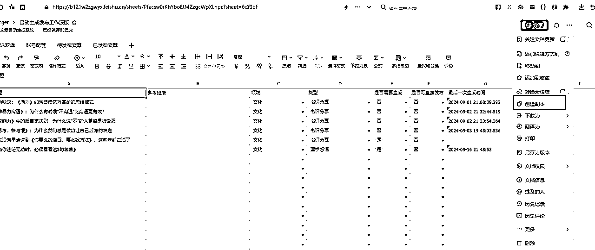

## 2、配置 一键飞书发布插件工具

### ①进入我的coze团队，点击插件，找到我开发的插件

对于不是我社群团队成员的，我会将插件代码附在后面。

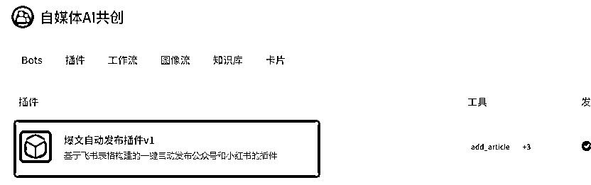

### ②找到将文章录入飞书的这个工具add_article.点击右边的... 然后点击进入Code Snippet

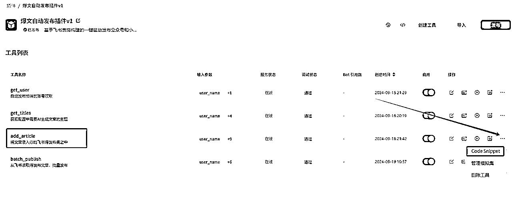

### ③ 直接用默认的选项CURL，点击复制

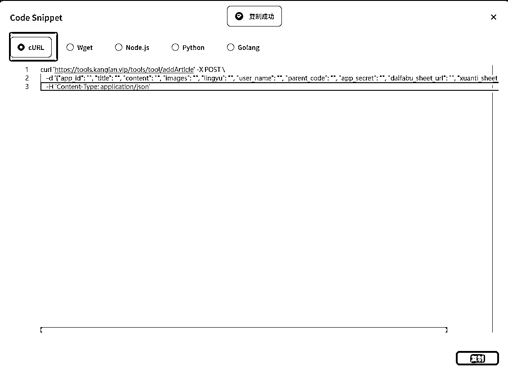

### ④进入个人空间的插件里面，点击导入。

这里说个题外话，为什么不是直接使用这个插件，而是重新导入到自己空间，因为在团队群里面，大家都能看到彼此的工作流，而我们这个工具使用过程中，需要飞书app_id和密钥，还要配置微信的app_id和密钥，这些都是要保密的，不能让别人知道，否则容易被人搞破坏哈

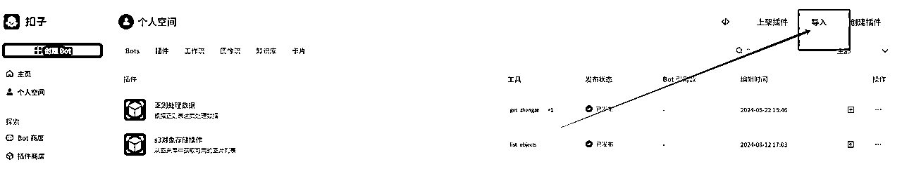

### ⑤进入导入页面后，选择url和原始数据选项，把刚刚复制的代码粘贴到里面，点下一步。

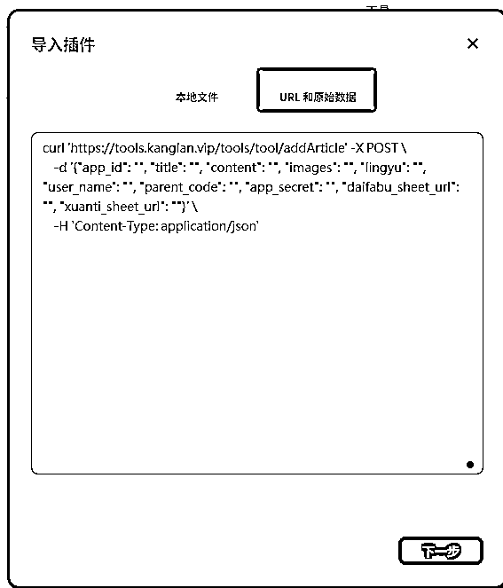

### ⑥填写插件名称和插件描述。其他的默认

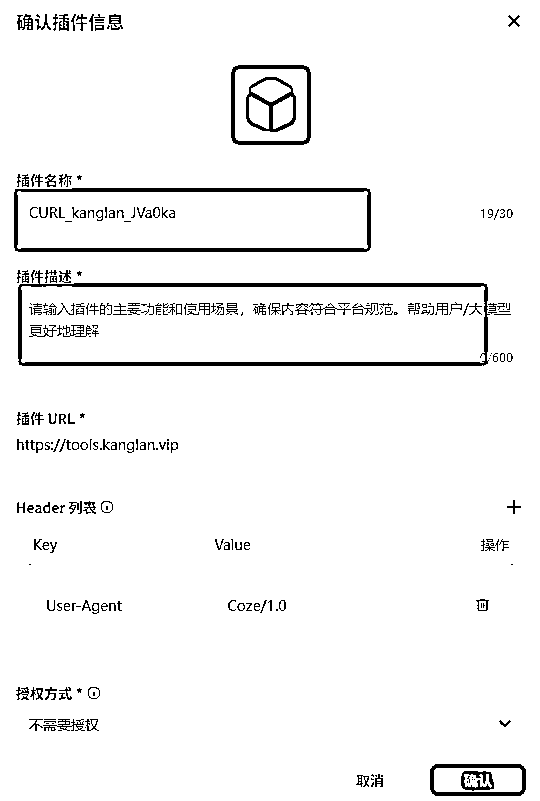

### ⑦然后可以看到工具已经导入进来了，先点击启用

因为不启用，等下无法调试，点完启用，点击工具名称，进入详细的参数修改

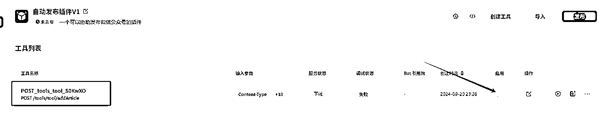

接着点击编辑工具

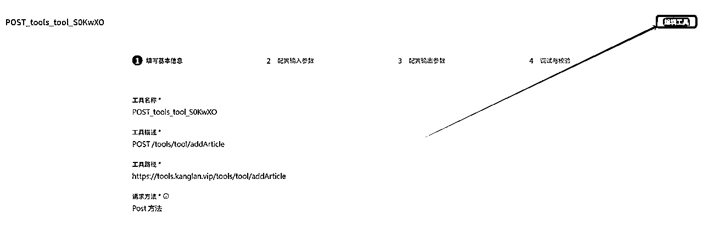

进入插件编辑页面，这里的名称改一下，改成自己习惯的命名，也可以不改。

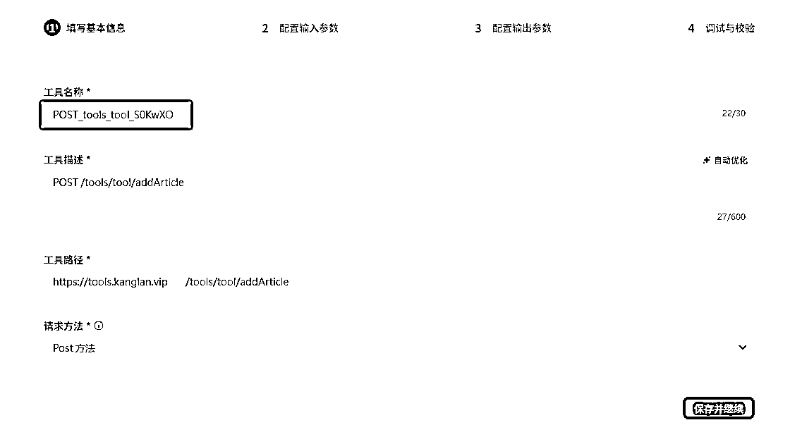

保存并继续，如下图，将我红框内的几个参数，把你的配置信息，如对应的飞书表格链接填入默认值这一栏，然后将可见关闭，这样你这个插件，之后使用，就不用每次都填这些本来就是固定的参数了。

对了，还有最上面有个Content-Type的参数，可以删除的。

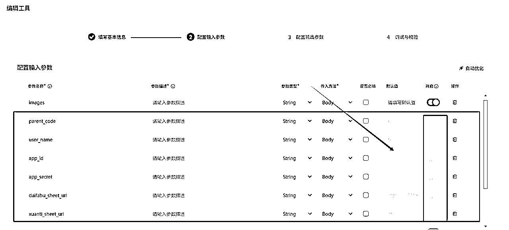

然后，就是参数描述是必填，直接在我的原始的插件那个地方，也就是我共享的那个插件那里复制就行了

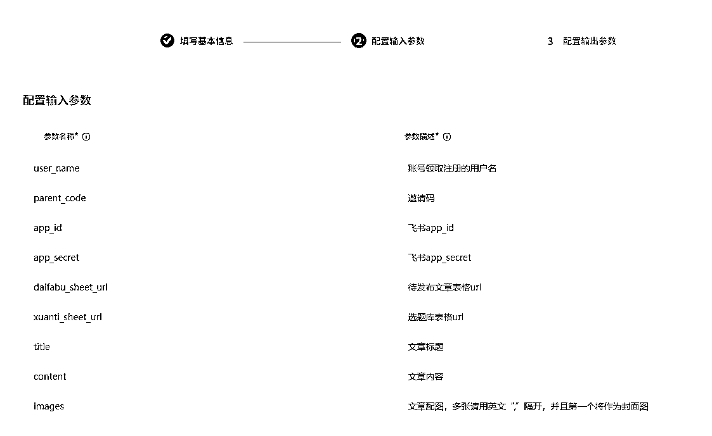

然后是输出参数：

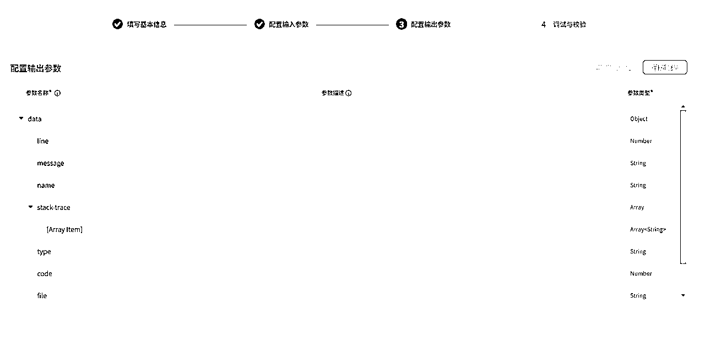

全部默认就行了，直接下一步

### ⑧最后进行调试，随便输入，当出现如下图信息，就说明，配置成功啦。

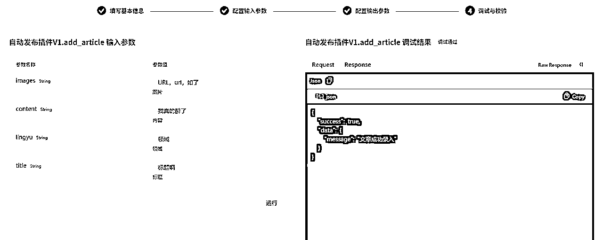

### ⑨按照同样的方法，添加一下批量发布的插件

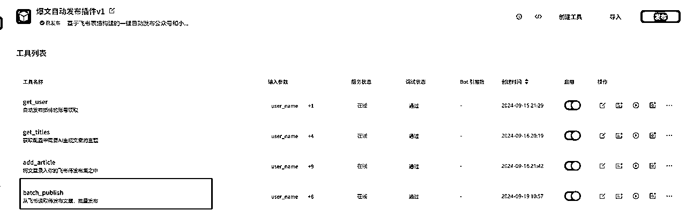

## 3、飞书文档配置项介绍

### 1、待发布文章表格

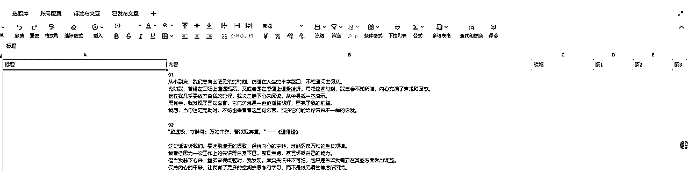

主要包含 标题、内容、跟领域，以及配图。

要注意的是领域，要跟账号配置的领域对应，那么这篇文章才会发送到该账号

### 2、账号配置

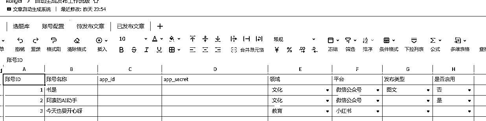

账号ID：用于后面登记已发布文章的，过滤重复发布的情况

这里的app_id,和app_secret填的是微信的开发者配置里面的

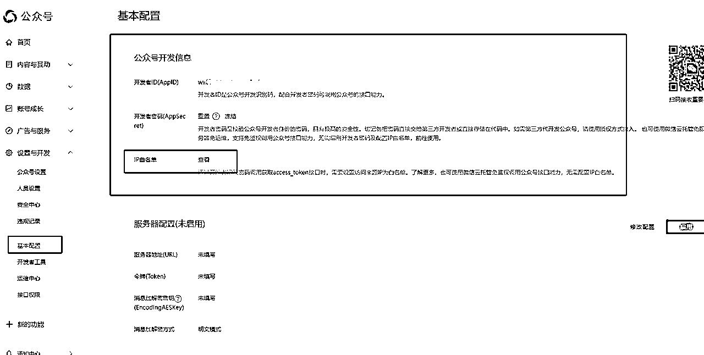

记得白名单要配置一下我的IP 106.55.181.114，不然用不了。

领域：要跟待发布的对应

平台；微信公众号要选上微信公众号，程序会判断。

发布类型，暂时没有用到。

是否启用：启用了才参与发布，不启用就不发布。

### 3、选题库暂时没用到， 已发布文章可以不用动。

## 4、搭建一键发布工作流

以下所有工作流，已经加入社群团队的成员，可以到coze团队下自己搬运。

### ①首先做一个配图的图像工作流，目前我只是简单做，大家可以根据自己的需要优化提示词，做成你们想要的效果

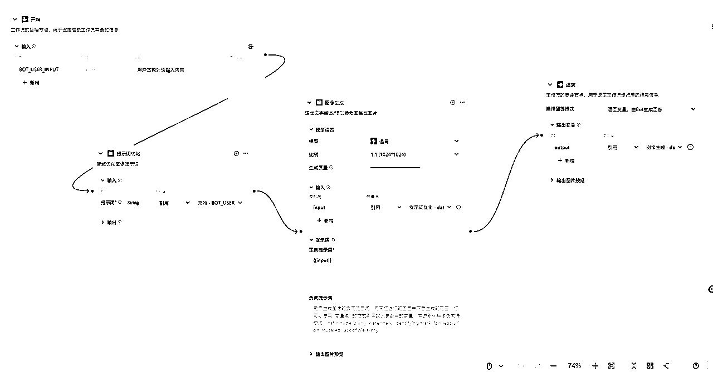

### ②搭建文章生成工作流。

我这边做的国学文，大家可以根据需要，调教成你们的发文类型，保证，输入一个主题，生成一篇文章就行了。

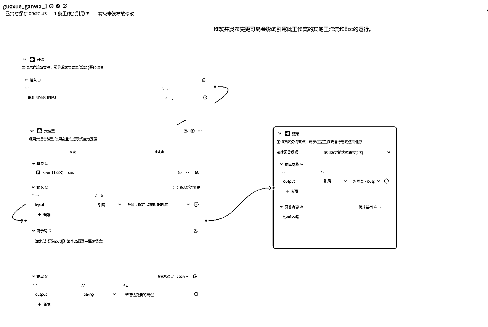

### ④做一个根据文章内容拆分出配图提示词的工作流

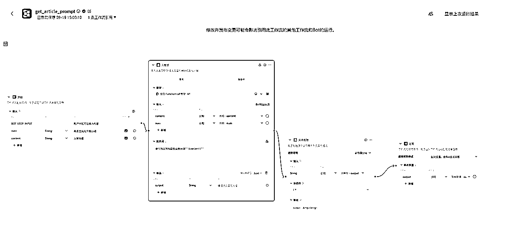

### ⑤将这些工作流和我的插件串联起来

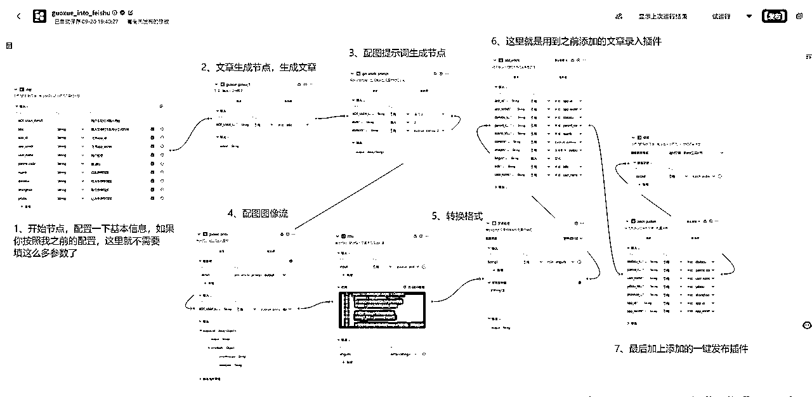

按照要求传输参数即可，这里有涉及用到一个代码块，代码如下，大家记得切换python环境，默认是js的：

```
async def main(args: Args) -> Output:
    params = args.params
     # 将JSON字符串转换为Python字典
    # data = json.loads(json_data)

    # 提取"String1"键对应的列表
    string1_list = params['input']

    # 提取列表中每个字典的"output"键的值，并构建新的列表
    output_list = [item["output"] for item in string1_list]

    # 返回转换后的列表
    ret: Output = {
        "imgurls": output_list
    }
    return ret
```

### ⑥ 调试

到这里，整个工作流就完成了，调试修改一下就行了

# 本套方案待完善的地方

1、目前小红书没有找到api调用方式，后期还是会沿用RPA的方式做一个一键发布的。已经减少了很多RPA操作了。

2、选题库功能未完善，后期会考虑用RPA写一个自动根据热点选题，或者根据关键词自动选题的工作流，以形成从选题到发布的自动化闭环。

3、因为加了很多处理，这一套工作流跑下来，要花一分多时间，如果后期要做批量发布，时间会更长。所以会将一键发布优化成，定时执行。我们只需要选题，和生成文章入库就行了。

4、还有的，就看小伙伴们的使用反馈啦.

# 附件

录入飞书插件代码：

```
curl 'https://tools.kanglan.vip/tools/tool/addArticle' -X POST \
    -d '{"user_name": "", "parent_code": "", "xuanti_sheet_url": "", "content": "", "images": "", "lingyu": "", "app_id": "", "app_secret": "", "daifabu_sheet_url": "", "title": ""}' \
    -H 'Content-Type: application/json'
```

一键批量发布代码：

```
curl 'https://tools.kanglan.vip/tools/tool/publish' -X POST \
    -d '{"yifabu_sheet_url": "", "app_id": "", "app_secret": "", "user_name": "", "parent_code": "", "daifabu_sheet_url": "", "zhanhao_sheet_url": ""}' \
    -H 'Content-Type: application/json'
```