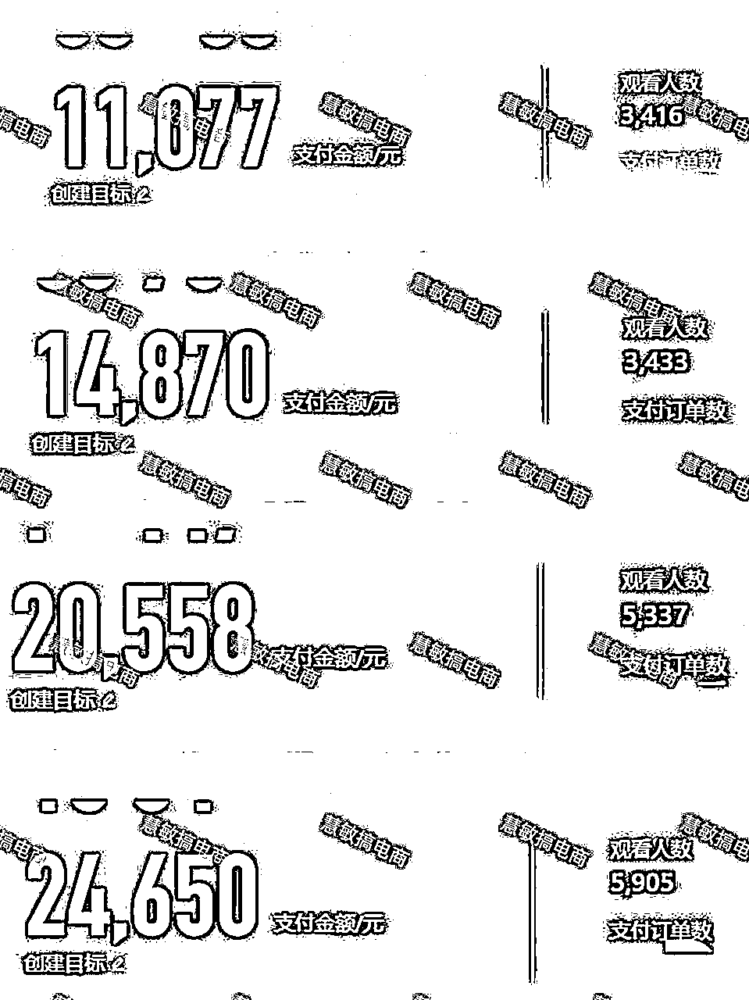

# 慧敏小红书笔记+直播（无人）笔直群联动3.0玩法更新

> 来源：[https://nn5wp654xf.feishu.cn/docx/HP8KdnkQVonMopxbNw0ctCMAn9e](https://nn5wp654xf.feishu.cn/docx/HP8KdnkQVonMopxbNw0ctCMAn9e)

大家好！我是慧敏。之前分享过小红书的2次玩法，这次分享一下，我们最新的玩法。

随着小红书平台规则的变化，准确来说就是平台规则越来越严格，在小红书赚钱的空间也越来越小了。在这个狭小的空间里，我们也研究出了一套属于自己的打法，笔记+直播（无人）笔直群联动3.0玩法，分享给大家！！

废话不说，先看数据！！！

一些人可能乍一看数据，觉得也会一般般，场观不高，GMV也不是很突出。但是少数人看到这些数据，已经看出了端倪！！！这些场观明明不高，为什么用户的UV价值却这么高？？？是客单价高还是转化率高？？？但如果我再告诉你，客单价在50—100左右，这只是一个账号一天多次开播的GMV，你是不是就明白了！！！

废话不多说，直接讲玩法！！！

* * *

# 一、什么是小红书“笔直群“联动？

笔直联动之后，小红书最近又提出了“笔直群”“联动。如下图所示，之所以会增加“群聊”的这个概念，是因为小红书官方数据显示，用户通过群聊去购买商品的GMV增长较快，而且占比越来越高。这就要求我们在产品品质保证的前提下，不仅要做好小红书笔记和直播，还要做好群聊的维护和转化。

# 1、笔记

*   笔记不带车，引流到直播间（不考核笔记电商数据）

*   直播前，发布预告笔记，引导客户预约直播，给直播预热

*   直播中，发布普通笔记，引导客户进入直播，直接引导购买

*   笔记数量建议至少10篇以上，引用爆款封面+热门脚本，混剪发布

### 1.1小红书笔记组成的四要素

#### 1.1.1 封面

封面为王，至关重要！！！

*   在小红书平台寻找同行的爆款封面，下载、混剪后使用

*   以小红书的爆款封面推理出相似封面，如爆款封面显示的是两姐妹坐电梯的封面，则可以推理出，去全网搜索两姐妹坐电梯的封面，可以找到很多类似的画面去使用

*   在笔记短视频里截取合适封面（在剪映app可设置导出），剪辑后使用

*   实拍相似封面

*   小红书爆款封面需交错使用

#### 1.1.2 标题

一个产品需要先搜集至少10个爆款标题

*   笔记标题在表格里选用，可适当添加小红书表情（“window+句号”调用）。

*   注意：不能采用一模一样的标题，需做出部分改动。

比如：被同事问了10000遍的**来了。。。。

可改为：被闺蜜问了10000遍的**来了。。。

被姐妹问了9999遍的**来啦。。。

#### 1.1.3 正文+话题

一个产品需要先搜集至少10个爆款正文

*   如产品是玩具，可添加 #我的玩具分享[话题]# #玩具[话题]# #潮流玩具[话题]# #家有玩具大推荐[话题]# #新款宝宝玩具[话题]# #好物推荐[话题]# #宝宝玩具怎么选[话题]# #宝宝玩具[话题]# #我的玩具日记[话题]# #儿童益智玩具[话题]# #玩具推荐[话题]# #玩具分享[话题]# #对讲机[话题]# 等相关热度高的热门话题都可以添加

#### 1.1.4 笔记

以短视频混剪为主！

搬运素材的注意事项

*   尽可能不要搬运真人出镜过多的视频，实在需要，可加剪映人脸卡通特效

*   尽可能不用蹭大牌明星，如果已经去世的可以随便蹭

*   素材可以在全网搜索，抖音，小红书，快手，视频号，多多视频，youtube，tiktok

*   抖音可分为手机版和网页版。

网页版直接搜索产品，点击视频，按最新发布或者最多点赞排序；手机版按框搜索商品名称，商品里面会显示达人带货的视频素材，可下载使用。

抖音最新发布的优质素材，在小红书平台上没有对应的达人账号或者未被搬运，则可直接搬运，不做混剪，立即发布；抖音上点赞较多（点赞100以上）的爆款视频，可收集为小红书的爆款脚本。

*   小红书上搜索商品名称，看点赞量50以上的笔记，其脚本可收集为小红书的爆款脚本。注意：小红书的爆款笔记下载后不可直接发布，需要混剪后方可发布，否则被必判违规，笔记限流，账号违规！！！

### 1.2笔记的发布

#### 1.2.1 小红书PC端笔记发布

网址：https://creator.xiaohongshu.com

#### 1.2.2笔记发布规则

*   一个账号一天发布8-10个短视频笔记。

#### 1.2.3 笔记发布时间

*   早7到早9；中午11点到13点；17至22点，可提前预约发布。

*   发布间隔需1个小时以上

#### 1.2.4 笔记流量判断标准

*   以24小时小眼睛为准

情况1，不超过200，视频重复，或者违规，不推流（判定为搬运，违规）

情况2，200至500，点赞个位数，封面，标题一般，基本不违规（少量推荐）

情况3，超过1000，封面，标题正常，正常推荐（有机会被系统推荐）

情况4，超过10000，笔记优质，通过人工审核，不断推荐（小爆）

情况5，超过10w，爆款，数据表现好（大爆）

*   若连续几篇笔记小眼睛均不超过200，可发个实拍随拍原创视频，看看流量是否正常。

### 1.3优质的笔记模型

#### 1.3.1强攻略

商品有具体的适用场景，能提升用户的生活幸福感。通过商笔内容，消费者能GET到新知识、解决生活痛点（穿搭攻略/送礼攻略/生活攻略/知识科普等）。

#### 1.3.2重细节

通过展示商品的上身/使用/原生态/成品细节，体现商品的品质感，同时提升商品的吸引度，快速抓住用户眼球。一般搭配和谐的构图、光影色彩结构，具备社区笔记的美观性。

#### 1.3.3超实惠

适用于较高客单价的行业。通过展示「有品质且优惠」或者「一手价」的利益点，搭配美观配图和适当的花字，让用户有「赚到」的感觉。超实惠不等于超低价

# 2、直播

### 2.1直播形式

*   直播形式多样性，真人、无人、半无人、绿幕、手播都行，不多介绍。

### 2.2直播封面与标题

*   直播封面与标题可选用爆款笔记

### 2.3直播流量来源

*   直播的主要流量来源

直播间上下滑，通过上下滑的方式进入直播间，流量大且泛，转化率最低

发现频道，通过点击直播封面加入，转化率也不算高

笔记，在发现页，点击呼吸灯头像进入，或者在笔记详情中点击头像进入，流量最精准，转化率最高

### 2.4直播小结

小红书笔直群联动3.0玩法，要求我们更加重视笔记的直播来源，通过笔记的筛选，获得更加精准的购买用户，直播的转化率也特别高，如下图所示。

# 3、群聊

### 3.1群聊的建立

手机端app点击下方“消息”，右上角“发现群聊”—“创建群聊”

### 3.2群聊设置

群广告、群欢迎语、群昵称、群优惠、群小号等等

### 3.3群聊玩法

*   在小红书笔记和直播间设置各种钩子引导用户进群

*   产品品质ok的前提下，群聊才有意义

*   群聊可以引导用户多次复购

*   每次账号开播群聊都会有消息提醒

*   群聊引私域的各种玩法不做深究

# 二、总结

小红书笔记+直播（无人）笔直群联动3.0玩法是在小红书笔直联动2.0玩法上做的一个小升级，一个小小的升级诞生了更多的玩法，利好于产品品质好且高复购属性的玩家。想要长期稳定的在小红书获利，还是要顺应平台的规则，我想我现在做到了。当然所有的玩法，都是不断地尝试出来的，人总是会在自己的舒适区，特别是曾经拿到过结果的地方，想要转变就很难！但是想要赚更多的钱，就得跳出舒适区！！此致共勉！！！

欢迎大家相互交流更多的小红书玩法，可加V 17816628276