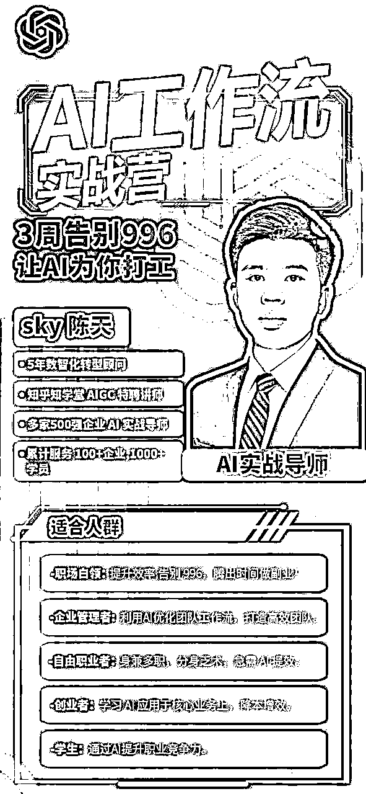

# 左手个人 IP，右手 AI 企培，如何成为 AI 企业培训讲师经验分享

> 来源：[https://uyna8i1s6g.feishu.cn/docx/HQ6cdNSLzoS8JSxsf6hcG2sfnWd](https://uyna8i1s6g.feishu.cn/docx/HQ6cdNSLzoS8JSxsf6hcG2sfnWd)

大家好，我是 sky 陈天，一名 AI 讲师、企业 AI 业务提效顾问，也是 23 年 5 月份加入生财的圈友。

后来探索了很多副业，也开始做个人 IP，从去年 6月份开始聚焦研究 AIGC 企业培训，并开始做个人 IP、探索 AI 在企业侧的应用，一年变现了近 50w，看着之前刚加入生财的时候，非常迷茫，写下了以下的目标，找到方向，小目标是一年后副业变现 1w，没想到吹的牛逼加倍实现了，还是很开心的。

这篇文章给大家分享一下我的 AI 企业培训业务和副业转正到自由职业之路，希望给到大家一些启发。

先说一下我拿到的成果：

1、在 AI 企业培训部分，直接培训场次 20+场了，如果算上参与或者间接转介绍的应该有 30 场了。

2、从去年副业到现在营收累计 50 w+，因为是企培业务，所以大部分都是纯利润。

3、日更输出 400 天，全网累计 1 w 粉丝，粉丝数虽然很少，但粉丝还是比较精准，低粉高变现也挺香的。

4、和上海交通大学、知乎、三节课都有长期 AI 培训合作，给多家 500 强企业授课（国家电网、国家能源集团等企业）。

回顾这过去的半年时间，真的感受到了 AI 时代的推背感，而在生财我也学到了很多，从打工人思维转变了副业项目思维。

在这个 AI 时代真的是我们普通人弯道超车的最大机会了！

文章会分为 2023 和 2024 两个部分来介绍我的成长过程，2023 的时候我也是一个副业和 AI 领域的纯小白，职场 995 的打工人，这部分从 0-1 的经验会对很多小白有帮助，而 2024 我裸辞创业， ALL IN AI 企业培训，也就刚创业了半年，远远还不算成功，但也算是走通了 1 到 1.5。

本篇文章目录：

# 一、 995 打工人，氪命肝出来的2023

2023 年的从 0-1 起盘是很难的，尤其是我的主业是经常 995 的情况，所以2023 确实是氪命肝的，我把所有的娱乐时间砍了，每天下班回来，一般都要到 1 点多才结束副业工作，周末也是无双休，经常调侃自己上了两个班，下班后继续上班！

但健康还是很重要的，不推荐大家这么做！（狗头保命）

## 一）食之无味，弃之可惜的工作

在去年 5 月份，我通过 IDO 老徐加入了生财，而事情的起因，可能和绝大职场人一样，是因为面对未来的焦虑感。

当时的我在一家 B 端头部的软件公司，过着 995 的日子，面对经济下行，我们公司由原来的福利厂，也变得非常卷。

我的工作就是负责 40 个 KA 大客户的工具使用推广，也叫客户成功，也就是给客户当这个软件的咨询顾问，帮助企业用好这个工具，为企业降本增效，发挥价值。

工作中一周的节奏是在上海的各个大楼里穿梭，上午一个客户，中午从客户现场出来，企业微信里又有一堆客户找我，回复客户信息，很多时候都没办法好好吃一中午饭饭，下午又打车去另一个客户现场，然后回到酒店整理今天的客户信息，晚上各种客户会议和部门会议，忙到 9 点，就开始第二天客户会议的准备，又要忙到 11 点。

甚至如果有客户出现了系统宕机等紧急问题，经常 12 点还会被客户叫起来处理问题。

别看我的工作光线靓丽，穿梭于各个顶级企业的办公室，服务顶级的 500 强大客户，如肯德基（百胜中国）、阿迪达斯、历峰集团、上汽集团、太平洋保险等等，作为客户的企业顾问，和客户谈笑风生，但其中的酸甜苦辣只有自己知道。

首先工作非常累！ 而且压力很大，对接的都是世界 500 强企业的业务部门负责人，客户要求很高，来自客户的压力，来自部门的业绩压力，来自跨部门团队配合的压力，以及做不完的待办和开不完的会。

其实累和压力其实还好，毕竟人总是能适应的，但更绝望的是在这种忙碌的状态下，我已经找不到我的意义和价值。

*   我每天这么疲惫工作的意义是什么？

*   这份工作我真的有能力的成长，有积累吗？

*   我真的喜欢这份工作吗？

*   我所有的时间都耗在这里，要 24 小时随时待机，我能坚持个 2 年，但长期有了家庭后我该怎么办呢？

虽然以前的工作强度也很大，但这次我的状态明显不太对了，以终为始，在这家公司已经没有办法达到我的诉求。

我期待的Work life balance，不好意思，基本上看不到。年薪达到百万，不好意思，业务部门负责人都达不到。而且业务部门负责人更是忙成狗，这也不是我期待的生活状态。

和所有成熟的大厂一样，我相信你们在大厂里工作都会有这种感受，蛋糕已经被分得差不多了，就算你有满腔抱负，也没有办法施展，更无法获得超额收益。

别说超额收益了，现在不失业，已经算是很幸运了。

所以从那个时候开始，意识到加薪很难，且不那么喜欢大厂的这种 996 工作的我，开始想办法看看有没有其他新的出路，跳去其他大厂是一种选项，但我想可能是类似的，一样无法满足我的诉求。

## 二）瞎搞阶段，就应该被市场教育

陈天的第一个探索是做淘宝电商无货源，源于朋友推荐，他是某大厂跨境电商的 BD，一起搞了 2 个多月，一毛钱也没赚到，花了大量的时间，去看课实操。

后边发现淘宝就不适合我们这种职场人，要随时盯着客服，还要拍照上架，压根没有那么多时间。后边也作罢了。

但人生的每一步都算数。

这次失败的经验，有最大的3个收获：

1）有了市场需求和选品意识，有需求，给到产品就能变现

2）间接省了一大笔钱，无货源低买高卖，现在买东西只去拼多多和1688，因为都是从这批发的。

3）选择适合自己的赛道，压根不熟悉，或者没熟人带，一定会被割韭菜。

## 三）通过副业赚到的第 100 块钱

在 23 年 5 月份最开始我跟着 IDO 老徐搞了一个天涯神贴的项目，这个项目当时在生财里也很火，一开始瞧不上这种项目，觉得不就是拉人头吗？

但大家都说先下场弄脏手，干了再说，我还是认真去做了，变现了 100 多块钱，但是花了我大概 5、6 天的时间，我觉得非常兴奋和激动。

回顾第一个副业，我觉得这个赚到的 100 块钱是我兴奋感最高的，后边赚个几万块钱，说实话还没这个印象深刻，我还特地发了一个朋友圈记录了一下。

这也让我慢慢有了商业化的思维，因为陈天家里是做生意的，大学读的商科，大学创业开过咖啡馆，所以我发现一个项目能跑通，一定是因为发现了市场的需求，然后我推出了对应的产品和服务满足了客户。

但第一次搞项目，还有很多知识都不懂，比如引流私域、前端收费、平台规则、矩阵化等等，要是真做好了其实能赚更多，真是赚不到认知以外的钱。

## 四）开启 AI 变现之旅，搞 AI 绘画获得正反馈

因为小红书我已经会了，而 AI 绘画又很火，我又探索了一个 AI 绘画猫猫的项目来做，取得了还不错的成绩，但后边放弃了这个赛道，因为对于我来说 ROI 太低了，不存在复利效应。

但同样，我写了一篇复盘贴分享出来，让我被更多人看见了，也意识到了个人 IP 巨大的魅力，这是一个巨大的杠杆。

后来我在生财看了一篇文章解析了做个人 IP 很有必要，所以我也开启了我的 IP 之旅，开启了公众号日更。

## 五）AI 企业培训萌芽，聚焦定位

得益于我公众号日更，以及在群里积极链接大佬，我也被更多人看见，所以做 IP 的好处就来了，有很多人想和我聊 AI 到底对企业有什么用，也会有一些朋友，希望能够合作去做一些事情。

所以我链接了我的第一个线下合作伙伴，并且迅速推进了一次试点的企业培训，也通过这次试点的企业培训，我积攒了一个案例，也写了一篇复盘，被更多人看到了。

在这个过程中，我也发现了一个问题，我的精力又不足了，我得再次聚焦我的定位了，做小红书宠物号、又要日更短文，已经严重让我喘不过气来，就算做外包动作，也无法让我真正聚焦。

我最强的能力是 TOB 这块有较多的经验，深刻的行业认知，有过丰富的工具类产品企业培训、客户咨询经验，会课程研发、也构建过我们公司的讲师体系，而且我负责的工具类产品和 AI 工具属性极其类似 ！

我开始思考自己的IP定位。

最终还是决定做减法，聚焦于 AI 企业培训，TOB 为主。

## 六）个人 IP 开始赚钱啦，但真的应该这么走吗？

因为我小红书做得不错，所以我在某星球担任了小红书的教练，我围观了 IDO 老徐的小报童发售，也很想做自己的，在小林哥的贴身指导下出了一个 AI 小红书 IP 起号小报童，当时卖了 930 份，直接搭建起了 小红书小报童-陪伴群-合伙人的产品矩阵。

单月收益就超过了 3w+，在副业前半年基本没怎么挣钱，直到年底 IP 的影响力逐渐发挥出来了，开始有了变现，所以我觉得还是很幸运，也证明了个人 IP 真的需要坚持，需要长期主义

## 七）2023 总结回顾

总结一下我的 2023，我大概经历了四个阶段。

### 1、迷茫期

找不到方向和定位，且情绪低落，厌倦职场，走出这个阶段必须要多多探索新的事物，开阔自己的视野。

人生不是轨道，而是旷野，只有看得多了，才会发现，你的迷茫和焦虑大多数人都会遇到，而每个人都会有自己的道路，你一定可以探索并且找到的！

### 2、探索观望期

在这个阶段，我也作为小白积极听各位大佬分享，看了生财的很多帖子，探索不同的方向和道路，看到可能性。

### 3、积极行动期

在这个阶段，我开始积极行动，把手弄脏，做各种资料引流、免费 AI 训练营、AI 绘画、公众号日更、问一问，企业培训，甚至短暂地做过抖音美女号，非常不聚焦。

在这个阶段其实也没咋挣到钱。

但我觉得对小白来讲，行动起来是最重要的，实践是检验真理的唯一办法，只有通过实战你才会逐渐掌握项目手感，才会发现自己到底喜欢做什么不喜欢做什么，光想是想不出来的。

如果你也处于纠结阶段，不知道定位、不确定哪个项目好，那我建议你先挑一个自己不反感的，干了再说！

### 4、聚焦收获成果

陈天在最后的阶段聚焦 AI 小红书 + AI 企业培训。陪伴群155人，小报童1000人。

而真正把一件事情做好之后，你会发现财富自然会来，我做个人 IP 这件事，基本上半年就跑通变现了，算是很幸运了。

# 二、2024职场晋升，裸辞创业，我疯了吗？

## 一）职场晋升，高薪裸辞，ALL in AI

时间逐渐来到了 2024 年， 从去年分销生财一单卖不出，我分销拉新的时候，也拉了 3 个人，千元客单价的产品，也证明了我的 IP 已经树立起来了，算是小有起色。

有些单月的收益也超过了主业收益，我有点开始想出来自己单干了，毕竟 AI 企培这个业务，副业搞真的不太好做起来。

在这个时候，我咨询了很多大佬，大部分其实都劝我不要出来，因为现阶段有稳定的收入很重要，风险太高了！

因为我是福建人，相对来讲比较迷信一些，也找大师算过，能不能出来，大师说可以，但 3 月份会有一笔意外收入，可以再等等，我一开始以为会是裁员，领个大礼包走也挺香的，没想到等来了升职...

没错，我在职场晋升了，首先我的职级升了，另外还通过业务调整，我负责的业务变成了公司 B 类战略任务，要带一个 5-6 人的团队，并且这个业务直接向大老板汇报。

所以在开年我忙起来了，不出差了，每天在公司，在公司要花费大量的精力，开各种会做各种拉通，写很多的目标计划、做数据分析看目标如何制定，业务策略如何制定，我的业绩压力也变大了，不能随随便便应付了。

脑力劳动加大了，回到家后肝不动了，而且之前肝了一年，每天弄到 1 点多，基本上是打两份工，我感觉我的身体已经到了极限，再这样下去，我身体健康都会有问题。

但随着结婚生子，以后家庭的经济压力又会变大，想到这我又觉得裸辞风险太大了，要不先苟着吧。

这时我面临着两个选择。

1）我应该放弃副业，回归到主业，好好把我的团队负责人做好，然后拿到更好的简历和薪水？

2）还是放弃一个稳定的高薪工作，放弃战略任务的负责人，九死一生地去创业呢？

这个决定整整纠结了3 个月。 但这种纠结状态，本身就是一个内耗。在经过缜密的推算和思考后，我还是做不了决定，最后还是要靠感性。

直到一天我看到了亚马逊创始人贝索斯的最小化遗憾原则，我恍然大悟，如果我不出来，当我 80 岁回想起来的时候，一定会很后悔！

我不想让自己后悔。所以我还是出来吧。

而在风险层面，“还能扛半年，大不了就去大厂做 AI 产品经理”。

凭借着不怕死和这种精神胜利法，我在 4 月上旬提出离职，4 月底正式离开了前司，副业转正了！

## 二）厚积薄发，先利他，后利己

### 1、厦门航空开发AI 企业内训

在裸辞前后，发生了两个事情，我觉得还是蛮有趣的，也让我更加坚定地走出来。

在辞职前，有个厦门的培训机构，给了我一个 AI 企培的订单，给厦门航空开发做 AI 企培课程，而这个培训说来很神奇，因为我们完全没有见过面，我也没去试讲过，却给了我这个机会去上课，这需要多大的信任啊？

后边我去问为什么会信任我，才发现他是因为我在去年 8 月份写的一篇文章看到了我，我分享了我的 AI 企业培训的复盘和用 AI制作 PPT 的思路，觉得写得特别好，肯定是有实力的老师，所以选择相信我，而这篇文章，都已经过去了大半年了。

真是印证了这句话：越分享越幸运

### 2、国家电网500 强 AI 企培

而在 4 月份，我提离职后，我又接到了一个国家电网的 AI 培训案例，这个案子更是神奇。

我是通过自媒体分享链接的朋友Micheal，给我介绍认识了一个的国家电网老师，他那会在研究 AI，想找一个懂 AI 的老师和他一起研发一个 AI 课程，micheal 是在去年上海认识的，他推荐了我。

我们在上海开了一间酒店，从上午 10 点，我们一起搞到晚上 2 点。

我们把 AI+绩效管理的课程主体开发出来了，我也不知道我会得到什么，我也没有获得任何的报酬，但我觉得这个事还是挺有趣的，我抱着学习的心态，能够和企培的前辈学习，还能共创课程。

而这位老师得知我要独立创业后，直接送给我一个大礼，说他们国家电网要搞 AI 培训，要找我去上课，最后我们在国家电网开办了可能是国家电网的第一次的 AI 培训！

而这次培训，也让我拥有了一个全国知名的客户案例背书，并且和这位老师达成了深度的合作，我们后续还一起参加了百度的 AI 大赛，一起做了版权的课程。

先利他，后利己。

释放自己的善意，释放自己的价值，先成就他人，后成就自己。

## 三）积攒案例，不断让自己被看见（2024年5 - 6 月）

自从离职后 5 月份开始，也变得忙碌了起来，我把原来公司的渠道激活了，恰好国能集团需要做 AI+BI 的企业内训，于是我离职了后，依赖前东家的资源，拿到了另外一个 500 强集团企业的 AI 企业培训订单。

开启了全国飞的模式，分别给国家能源集团，重庆、武汉、江西、福州、西安等做 AI 企业内训，而通过这些案例，我又快速地将自己的案例滚了起来，让更多人看到了我，也收到了很多的新的机会。

说个插曲，在对接这个客户的时候，还顺带做了两个 AI 智能体，因为信息差存在，两个智能体报价上万，但基本上我自己一天就搞定了，难度也不大。

依靠着私域积攒的人脉和案例，我在圈子里算小有名气，又收到朋友邀请给无锡市教育局的领导做 AI 赋能教师的 AI 企业培训，这个案子也非常感谢 MQ 老师提供的帮助和支持。

## 四）陷入焦虑，我到底想要什么呢？（2024 年 6 月底）

刚出来的 2 个月，收入就超过了主业收入了，我觉得已经是很顺利了！

但创业哪有不焦虑的，随之而来的也是担忧。

我的下一个客户在哪里？

我下个月还能有这么多的收益吗？

企培老师越来越多，我的优势在哪，打价格战怎么办？

如果要突破年入百万的上限，我应该怎么做？做什么？

我做的事情真的有复利吗？

AI 企业培训最终也只能是个项目，也是有生命周期的，也是通过时间换钱的生意，因为可能过两年，AI 足够普及了，足够智能了，不需要人教了，就像现在人人都会微信。

而且上课是重复的，我其实不太喜欢把一个东西反反复复讲 N 遍，没意思，且 AI 发展得这么快，必须要保持学习。

而如果要保证课量就没有时间学习，如果有一天我的精力也跟不上 AI 的发展了，我比不过年轻人了，那我怎么办？

我只是在低水平重复。

而且一年累死累活上 200 天课，也只能赚到 100w，这真的是我想要的吗？

我真正想要的是什么呢？（我觉得这个问题大家也可以思考一下）

抛开创业的宏大叙事，我觉得离我太远了，而且做了很大后又何尝不是一种束缚，变成工作狂，无法享受生活，也无法照顾到家庭。我好像也不需要那么多钱。

所以回到我想要什么，以终为始，出来单干目前肯定是为了赚钱，那我要赚多少钱呢？

不知道有没有人算过，我还真花了一个下午好好算了一下，我想在 35 岁前过上"退休生活"，退休指的是没有任何经济压力，我可以选择不工作，也可以选择做其他事情。

我需要有 1400w，各种买房、买车、养老、物质想要的东西，另外还要有 300w 存款，在我不想上班的时候，每个月存银行，利息就能覆盖支出。

另外我想多做启发他人，帮助他人的事情，写作和自媒体就是一个很好的方式。

所以以目标倒推，还有 9 年的时间，加上后续钱越来越难赚，我给自己定的目标是，截止 25 年底，趁着红利期赚 300w，也算是一个合理的小目标。

推荐大家以终为始，也可以算一算。

## 五）10 倍增长比 2 倍更容易（2024年 6 月底）

所以出来创业跑了 3 个月，我就知道这个不是我想要的，而且按照这个玩法，一年跑死我都达不到我的 300w 目标，我应该怎么做呢？

刚好我阅读了一本书，《10 倍比两倍更容易》，我非常认同里边的观点，为什么 10 倍比两倍更容易，因为你用两倍的模式是没有办法达到 10 倍的目标的。

如果我做讲师，惯性的思维就是上更多的课，拿更多的钱，那我从 100 天上到 200 天，最多也就是 2 倍，按照这个模式，我永远也无法达到 10 倍增长。

只有思考如何 10 倍增长，才会让你去思考真正可行的路径。

而想好路径后，我们要把那些不能达到的路径全部砍掉，要把 80% 的时间花到那些 20% 重要的事情上。

所以我想着必须要有自己的一个复利的产品，必须要做 C 端的线上课，因为这个课程是可以不断放大，不需要我售卖自己的时间，被更多人看到的。

第二个动作是，低于一定单价的企业培训我都不接了，只做高客单。

第三个动作是，等我课程体系打磨出来后，我将会全力把 AIP 做起来，把自己的影响力做起来，今年的目标是 20w粉丝

## 六）AI 工作流课程，放大时间价值（2024年 7 - 8 月）

经过思考后，我决定做一个 AI 线上的课程，可以一份时间重复售卖，说干就干！

### 1、先卖了再说，MVP 跑起来

其实课程出来之前我是非常没底的，因为不做副业类的课程很难卖，毕竟我这个是工作的职场提效的，现在职场类的什么样子，大家做知识付费产品的肯定知道。

但遵循着创业的小步快跑，MVP 思维，我没有着急一开始就打磨课程，做课，而是先卖海报，再开发。

### 2、差异化定位

我就先开始琢磨一个大概的定位，即然大家都在做副业类的，那我就反其道行之，做一个帮助大家节省职场时间的，那不也相当于帮助大家赚钱和省钱，实在不行，大家摸摸鱼也可以呀。

另外我发现很多课程更多是一些通用场景，但是并没有教大家一些其他场景怎么办，那我是不是教大家怎么结合自己的场景定制一个自己的自己的 AI 工作流。

所以我就切了一个定位：AI 工作流实战营，3 周让 AI 为你打工。主打卖点就是教会大家用 AI 定制一个 AI 工作流，真正帮你的工作提效。

课程大纲，然后用 AI 辅助我写了一个长海报的文案，并且找了一个设计师，帮我搞了一个 海报。

朋友圈先卖了再说，先定 399，后续再涨价 699 的策略。

最开始发出去，陆陆续续有 10 来个人买了。

后边我说要涨价了，一晚上又收了 20 来个同学，总共收到 30 多位付费学员，完全是我的纯私域卖的，于是我在3 天的时间，收入 1w+。

虽然数量不算多，我觉得已经非常好了，这也给了我很大的动力和压力，我必须要好好把这个课程交付好，于是从 7 月到 8 月份，我都在闭关磨课，一般一周三节课，压力巨大，好在课程整体效果还不错，但是也踩了一些坑，这块后续可以再写一个详细的复盘。

### 3、意外之喜，线上课程与国家工程实验室签约合作

而拥有了线上课程体系后，我发现有很多渠道都缺好的课程，所以我准备把我的这个课程上线到时代光华，而且也和国家工程实验室签约了 AI 课程的合作。

后续我也会继续把这个课程打磨好，变成我的一个拳头课程，并且真正做好咨询交付，走高端定制的路线。

## 七）构建你的增长飞轮

由于前期的 500 强实战案例，我正在构建自己的增长飞轮，从最开始的知乎 AI 讲师，到国家电网 AI 讲师，基本上现在所有类型的企业我都能 cover 住了，而这些案例增强了我的个人 IP，让我能够接到更多难度更大的 AI 培训。

所以最近我也收到了上海交通大学MBA 的邀约，作为他们的 AI 分享嘉宾，开展后续的合作，不限于 AI 企业培训，包括后续的企业咨询和产品落地都包含。

目前我们已经有一个 6 位数的AI 智能体商单在跟进，如果成交了后，后续可以在和大家来分享。

而因为前期的积累，目前也有非常多的培训案例。

比如我给职高院校的老师们做了 AI 辅助教师提效的 AI 培训。

给一家 5 亿营收做的 AI 办公提效训练营。

以及收到了其他一些知名 KOL 的社群分享邀请。

# 三、拿到当前的结果，我做对了什么？

AI 时代是百年未之有大变的时代，过去的时代属于专家，而这个时代属于创新者、属于行动者、属于跨界者。最后我提炼几点我觉得大家都可以参照模仿的。

## 一） 私域：价值 30w 的朋友圈怎么发

对于各位想做 IP，但没有时间做公域的小伙伴，我觉得最应该做的事情是抓住表达者红利，从私域朋友圈日更开始。

我是 INFP，也是一个社恐，我曾经发个朋友圈都会犹豫半天，最后想想算了还是不发了，但截止到今天，我已经日更了 430 天了，为什么我现在每天都发朋友圈，是因为我喜欢吗？为什么要日更呢？

不，是因为它真的能为我带来收益！不夸张的讲，我的朋友圈累计已经为我带来了至少 30w 的收益了。

对于做生意的来讲，最重要的是信誉，朋友圈发好，做好表达就是新时代的 BBA，过去老板做生意都必须要买一辆 BBA，为什么?

因为让合作伙伴觉得他有实力，至少不会卷钱跑路了。

而现在大家都买的起车，而像日更这种事情，能坚持下来的很少，能坚持 400 天的那就是更少了，这里边代表了很多东西，而我做 TOB 的，是可以帮我快速打穿信任的。

日更现在变得像是我的一个旅程回顾日记，我可以很清晰地记录每一天最值得我回忆的事情，持续记录，意义自然浮现。日更还有一个好处，就是可以让你被持续高频看见，产生熟悉。

那要怎么做到日更呢？

分享一个最简单的办法：立一个 flag，或者拉一个围观群，让大家看到你的承诺，你也可以说日更失败了发个多少的红包。

先承诺再做到，而有了这个公开输出的压力后，你也顾不上那些担心害怕内耗，纠结别人看了会怎么想。

每天都是想着，如何把今天的分享写好。

做事的动力来源于欲望和恐惧。

如果日更失败了，你可能会在朋友面前丢脸，或者损失一笔巨款，这种恐惧则会逼着你先完成最难的日更冷启动，而一但启动后，惯性就会让你一直坚持下去，不写就难受。

那日更到底发什么好呢，我好像没有这么多内容可以发？

所看所听所想所思所感都可以发，陈天把我的内容分为了 5 个类别，这 5 个类别的内容都可以发。

1、客户案例，用户证言

2、AI 专业知识类

3、学习笔记

4、生活类

5、广告类

### 1、客户案例，客户证言

这类内容可以让自己做的业务被别人看到，而且告诉潜在的客户，我做得很好，这样别人才能来找你。

而这个又不是广告，但可能比硬广更加有作用。

陈天的有个培训机会就是我发了朋友圈，有个高校老师看到了我能做，就直接来找我去给他们学校老师做了一场 AI 培训。

### 2、AI 专业类知识

这类内容是为了塑造专业的形象，让别人知道你到底在研究什么领域，对某个领域是有很深的见解的。

这个专业非常重要，你的 IP 定位是什么，你就要根据用户的痛点，发对应的内容，而这些内容也可以让用户相信付费给你，你是真的有货的。

### 3、学习笔记

学习笔记是让别人看到你是在不断成长和进步的，大佬不一定吸引人，但小白成长为大佬的过程一定非常吸引人！不断学习也能让别人看到你的潜力，是不断在成长的。

### 4、生活类

这部分朋友圈也很重要，很多人会觉得我为什么要发生活类的朋友圈，发专业的内容不就行了吗？

其实大错特错，现在知识付费，付费的不是知识，本质上是为了人付费，只有生活类的朋友圈，才能让别人意识到你是一个活生生的人，更加立体，这样才能拉进你与粉丝的关系，更容易构建信任。

而且在这个层面也可以植入你的一些兴趣爱好标签，吸引同频的粉丝，也可能扩展你的第二曲线，假如我植入我爱旅游，那我未来 AI 做不了了，我是不是可以做朋友圈比较懂旅游的人设，也能卖一卖旅游产品。

### 5、广告类

第五个是广告，广告就是直接带来收益的内容了，经过前边的客户案例、专业知识铺垫，想要赚钱，就得大大方方卖。

这类内容最重要的就是一些具体的文案技巧，用尽量短的文字，介绍清楚产品价值，并用一些促进客户购买。

这里很容易踩坑的是广告过多，有人天天朋友圈发广告，我大部分都直接屏蔽了，一定是要干货夹杂湿活。

如果你不是销售类的 IP，建议不要天天发广告，广告本身对用户是一种消耗，是在消耗你构建起来的信任度的。

## 二）公域：极致效率，一鱼多吃

私域主要是构建信任，公域主要是挖掘流量，那陈天的公域是怎么做的呢？

其实陈天的公域在去年认真做了一段时间，也拿到了不错的结果，小红书 1 个月起千粉号。

知乎一篇想法爆了 150w 播放量，给我带来了 300 多个粉丝。

公众号每篇都入池推荐，推荐流量一度占到接近50%。

后边并没有时间太好好做，导致现在公域是比较差的，所以觉得非常可惜。

一方面是在职，时间本来就比较少，而AI 企培业务比较耗费时间，私域基本上就够吃了。

另外一方面也是自己认知的问题，没有意识到断更后再起来会这么难，所以建议大家不要轻易断更。

我分享一下我的公域内容涨粉做法，这个做法可能是错误的做法，但可以做到每周 1 小时把公域的内容全部做好分发好。

我现在秉承的是极致的效率，就是我的公域顺带做一做，能捞点流量就多一点，我的业务属性是 TOB，本身就可以不需要特别大的流量，所以TOC 我并没有特别重视，也是一个偷懒的做法。

我现在主要做的内容是 1000 个 AI 场景，会分享 1000 个 AI 的场景，让大家知道 AI 可以做什么事情，但每一个都会比较短，不会特别详细，因为价值在于告诉别人可以做，而不是详细的怎么做。

我一周一般发5 篇 AI 场景，而这 5 篇的总成本是 1 个小时，这个效率可以说非常非常高了。

而产出内容后，我会让我的小助手，把这个图文做成小红书笔记的风格，一鱼多吃，发到所有的平台：小红书、即刻、知乎、公众号、知识星球。

另外我一周会尽量更新两篇长文章，每篇文章大概 1-2 小时。虽然每篇流量不多，但胜在持续，且花时间少。

靠着这个策略，我每个平台都是千粉左右，总共万粉，虽然不多，但也好歹是一个万粉博主，而且加我的基本上都是精准的客户或者渠道粉。

真的时间花在哪里，结果就在哪里，后续我还是会投入更多时间，好好做视频号、公众号和小红书这三个平台，并且尝试做视频化，把公域自媒体做好！塑造更大的个人影响力。

## 三）变现：左手个人 IP，右手 AI 企培

以上私域公域都是获客手段，那么如何变现呢？

那就是 AI 企业培训，一场 AI 企业培训讲师可以拿到大几千、上万的收入，而企业也愿意花2-3万 / 天的钱来购买企业培训。

所以我的变现方式很简单，就是通过自媒体让客户以及渠道看到我，然后推进企业培训商单，我去讲课，拿钱。

就和 AI 代写一样，客户、流量端、写手端，AI 企业培训讲师相当于是交付的写手端。

AI 企业培训这个业务我不想介绍太多，因为对于大多数人是很难做的，门槛太高了（我说的是作为一个持续性的业务，偶尔接到几单不算入行）

要有好背书和履历、要有授课演讲能力、要有案例、要有渠道资源，这每一个条件都要长期的积累，正反馈很慢，不是一蹴而就的。

如果你真的想成长为一名 AI 企培讲师，可以参考我的成长路径，也可以看我的另外一篇文章：

说一说我对 AI 企业培训一些新的认识。

### 1、AI 企业培训是强信任强资源的业务

陈天一直都是做 TOB 的，在前东家里有句话前同事都很认可。

"关系是第一生产力"

虽然多少有点戏虐成分，但中国当下的国情确实如此，尤其是中国的软件行业，不然中国的 SAAS 不至于这么惨，AI 如果要做 TOB，做 SAAS，出海才是正确选择。

在满足硬性门槛后，有资源、强信任你的人才能拿到订单，获得变现。

### 2、左手 IP，右手企培是必选项

为什么我花了很大的篇幅强调 IP，因为 AI 企培业务需要强信任强资源，而个人 IP 刚好可以构建信任，以及积攒人脉和资源，如果你先天没有资源，没有人脉，那么IP是你必修要做的事情，不做就会死。

但我也不是让你一定要去做粉丝，而是要做专业性的 IP，靠谱的 IP，有影响力的 IP，因为做 AI 企培，重要的不是粉丝，而是精准的资源。

10000 个粉丝，抵不过一个精准给你资源的人

如果你能在某个领域做到最专业，资源都会自动找到你，比如提到提示词，我们就会想到提示词最专业的人，然后找到提示词最专业的人。

而 IP 不仅能让业务找到你，还能让你产生品牌高溢价，不至于陷入低价竞争的内卷中。

### 3、保持对企业服务的敬畏，客户成功你才能成功

很多小伙伴提到 TOB 业务，都觉得心怀向往，毕竟都是上万、几十万、几百万的客单价，收个 99、9.9 得收多久才能赚到这么多钱啊。

但其实企业服务是一个幸苦活和慢活，要求你真正能把客户服务好，真正产生效果，把你吹的牛实现了，不然是无法做长久的。

因为你一旦有一个客户没做好，是很容易影响你的其他客户的，因为 B 端的采购都很理性，尤其是在当下经济下行，企业的预算也更紧了，也会更期望真正有效果。

这意味着做这行必须要有风险管理意识，没有把握的尽量不做承诺，充分沟通清楚客户预期。

也要有客户成功意识，单子签下来只是万里长征第一步，能服务好客户，让客户满意，才是长久之计。

## 四）别想准备好了再开始，开始了才会准备好

总想着什么都准备好了再开始，但往往是开始了才会准备好。毕业第二年就开始独立负责业务，带小团队，我准备好了吗？完全没有。

我完全不懂管理，还要做业务，还要带比我大好几岁的同学，不断学习不断试错，请教各种老师，才摸着门道顶住了。

想着自己足够专业了再分享 AI 做个人 IP，但反倒是决定日更了，才逼迫自己不断学习AI、学习小红书。

AI 企业培训也是一样，我不认为自己准备好了，真正足够专业可以做企培了，但在路上了，接到了客户需求了，就会发现，问题来了自然会各种办法解决，各位老师都会来帮助你。

真的，好多东西我都不会，都没准备好，但最有效的是什么，就是逼自己一把，只有问题才是最好的老师。对于战略思维拉满+成就第三的卷王来说，最爽的就是看着自己定的目标和规划一个个完成。

我一直没有出自己的产品，是因为我觉得没有准备好。直到今天，我才深刻地发现，世界等不到万事俱备只欠东风，只有不断在问题中磨炼自己，开始了才能准备好。

## 五）一切皆有可能，不要给自己的人生设限

我以前有个臭毛病，喜欢做很多职业测评和性格测试，老是给自己设限，套一个框架，觉得自己适合做这个，不适合做这个，所以我做不好，是因为我本来就是这个性格，

如果按照 2 年前我的想法，我一定是做不好企业培训和个人 IP 这个事的。

为什么呢。因为我是一个INFP，非常社恐，如果熟悉我的朋友都知道，我是一个不爱说话，更擅长倾听的人，而过往的听得多，也导致了我的表达能力不够强，表达欲望非常非常低！

有两个事情非常典型，我是小镇做题家，我从小就很不喜欢对外沟通，小时候我爸让我去买一瓶水，我都不敢和陌生人沟通，甚至宁愿不喝水，高中的时候，才第一次被英语老师叫上台做一个公开分享，然后我当时一句话的说不出来，脸涨的通红，台下的同学就这么看着我，就想找个地缝钻下去，从此对公开上台产生了巨大的恐惧感，我不认为我能分享表达好。

另外关于公开表达，在做 IP 前，你可能无法在互联网上找到我的任何痕迹，在所有的社交平台，我都是不点赞不评论不发内容的三不选手，朋友圈一年也就几条，而且发朋友圈也要犹豫半天，这个被别人看到会不会不好，算了算了还是不发了。

我从来都是与沟通、分享、口才、演讲这些词绝缘的，如果我给自己设限了，告诉自己算了，你就不是那块料。那我就永远也无法成为现在的我。

性格、喜好不等于能力。

不要被自己的性格和能力设限，每个人的潜力都是巨大的，但我也不是完全否定性格喜好，选择喜欢的事情、又很擅长的事情也非常重要。

## 六）聚焦，把一件小事做到极致

想要有大成果，聚焦把一件事情做到极致，并且通过个人 IP 告诉别人你能搞定，你自然活得不会太差。

回顾我的成长过程，我一直都在做选择题，放弃了 AI 绘画宠物项目、放弃了AI 小红书的定位和产品，放弃了高薪的工作和团队负责人的岗位，放弃了一些 AI 企培的商机机会。

尽管这些项目我都能做得很不错，但我知道想要取得更大的成果，我必须要放弃这些，把时间花到更有价值的事情上。

关于聚焦，推荐大家去看一下《10 倍比两倍更容易》和《最重要的事情只有一件》，你一定会有收获。

## 七）以投资 ROI 来看待知识付费

最后说一下知识付费本身，我给很多大佬付费过，也有很多人给我付费，知识本身不值钱，值钱的是结果。

如果从投资角度来看知识付费这件事，我觉得我还是挺赚的，加入了生财、也加了其他好多知识星球、还有合伙人，最终我觉得都加倍赚回来了，但很多人没赚回来，一定是因为不行动，赚点小钱真的有手就行，但赚大钱又是不一样了，想要拿到大结果，背后是信息差、行动差、资源差、智慧差。

抓住了 AI 的信息差，用快速行动积累自己的资源差，从滚起来的资源里，不断获得更高级别的智慧，而不是简单无法实践的知识。

好了，我的故事讲完了，在 AI 时代，拥有着大量的机会，因为 AI 本身就是一个风口，也是一个巨大的生产力工具，希望这篇文章对还没开始的副业小白有一些启发，另外 AI 的红利真的挺大的！

人类的赞歌是勇气的赞歌，愿我们都能乘上 AI 的东风，一起 AI 创富！

本文提到的一些复盘文章，感兴趣的朋友可以深入阅读：