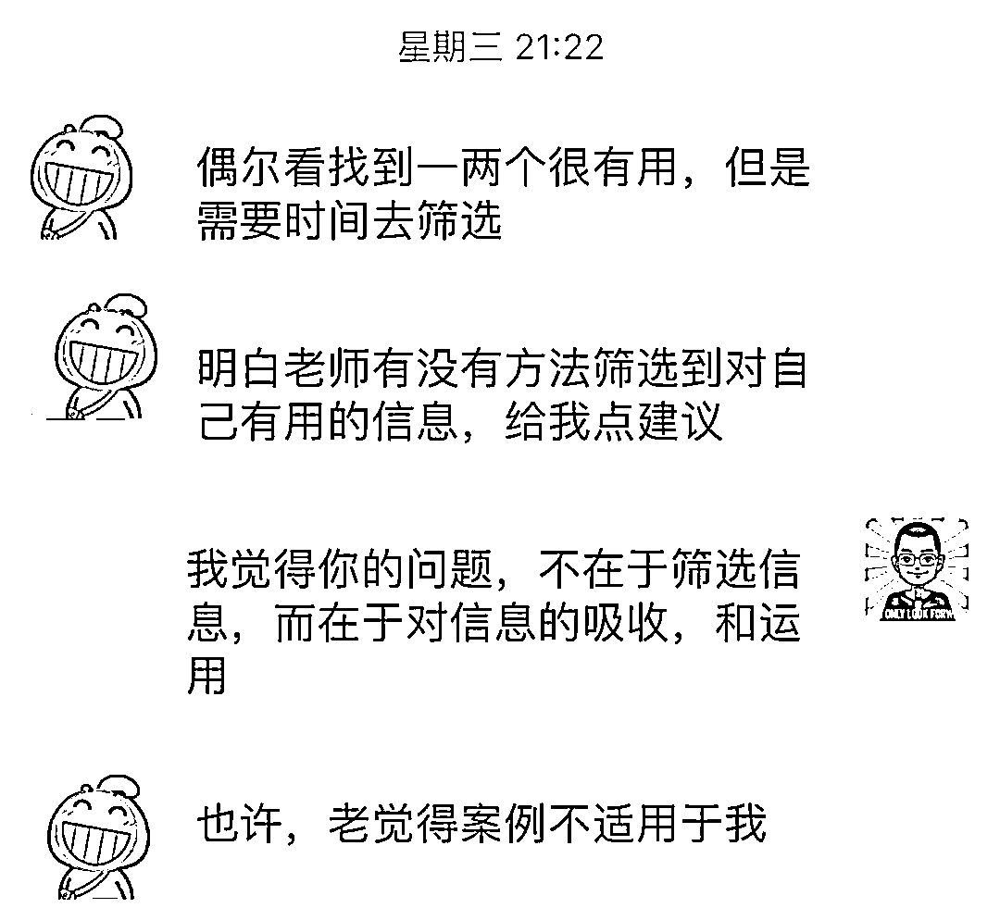
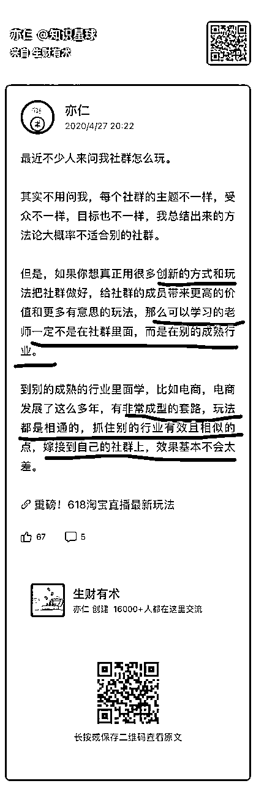
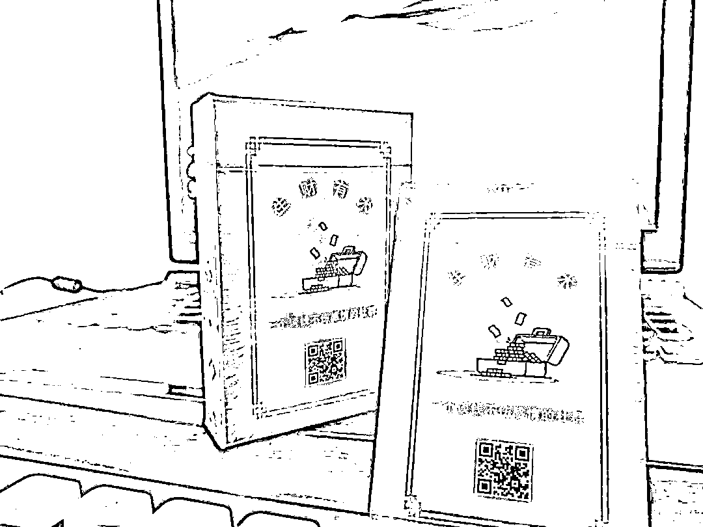
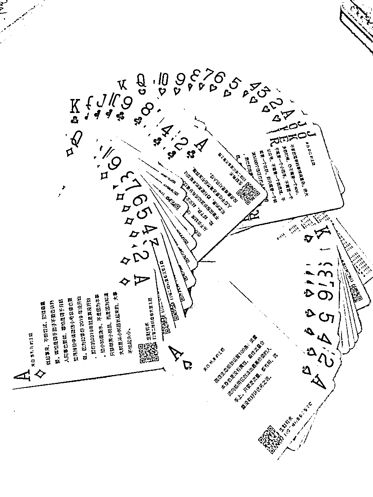
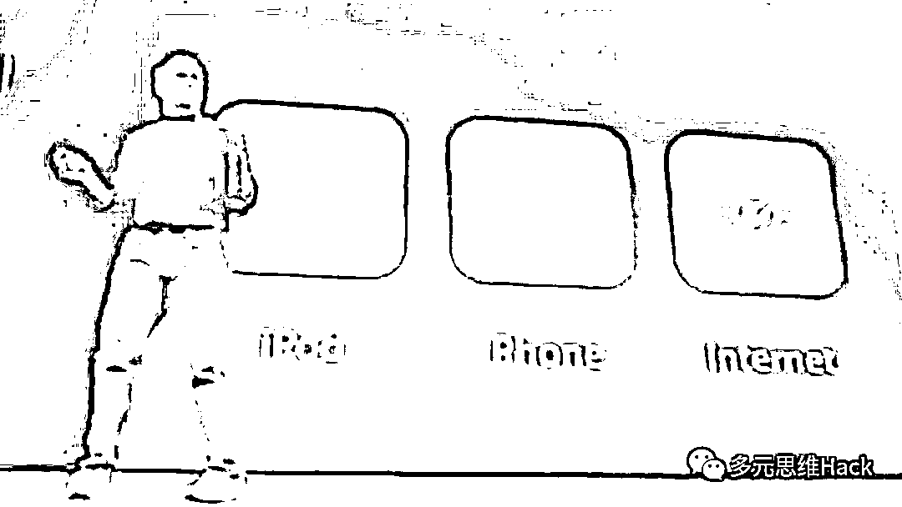
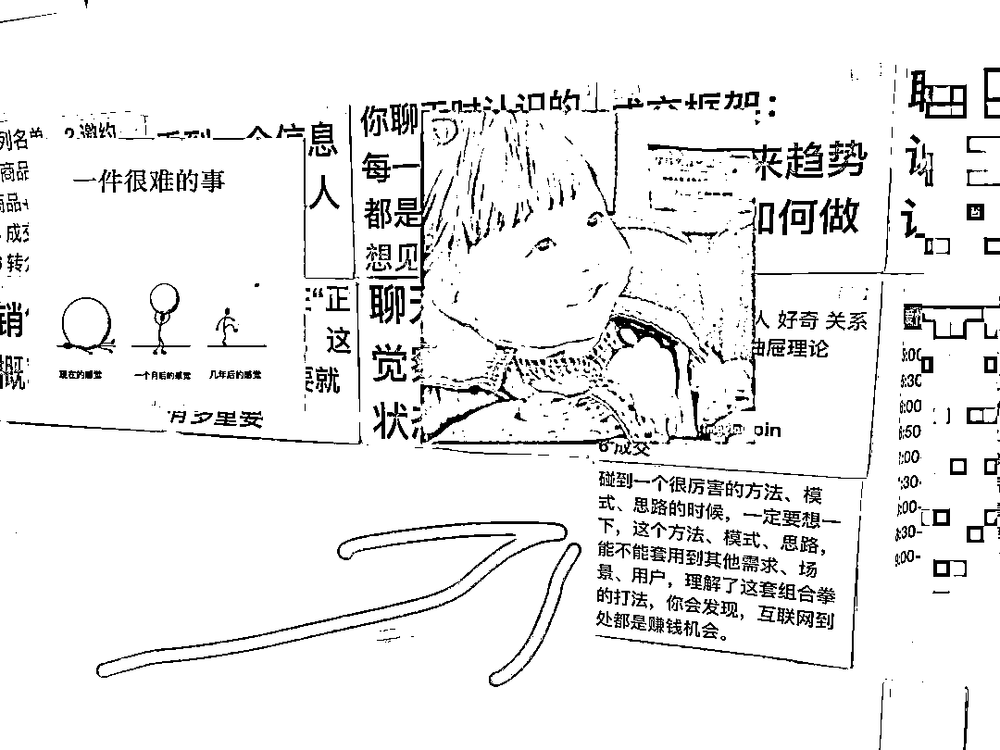
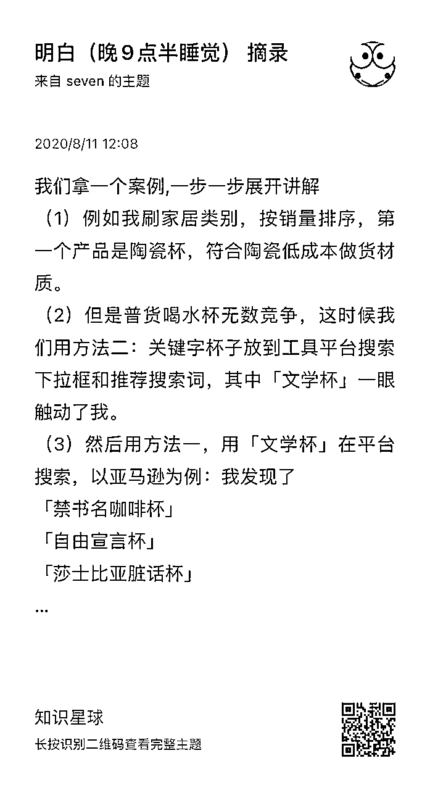
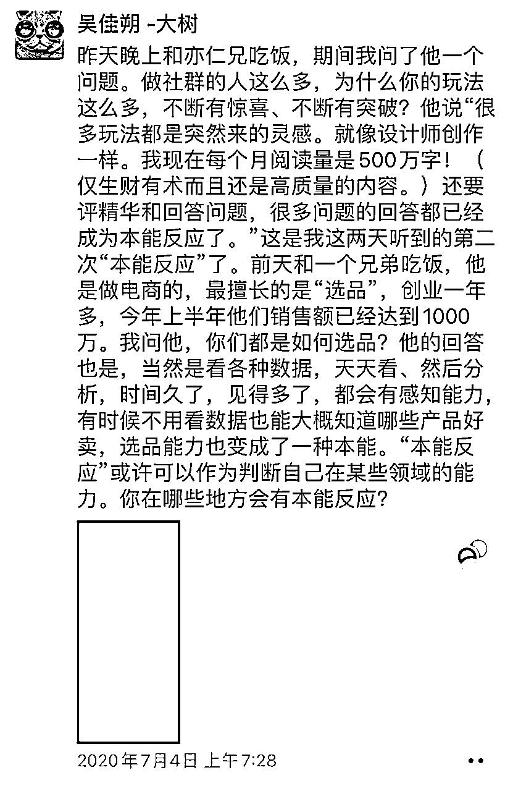

# 如何参考其他行业的成熟套路，举一反三帮自己拓展出更多赚钱思路？

> 来源：[https://pznme756ly.feishu.cn/docx/HrJgdLpkDoR847xmrjccPH5Ynph](https://pznme756ly.feishu.cn/docx/HrJgdLpkDoR847xmrjccPH5Ynph)

大家好，我是明白，生财 8 期老圈友。

前几天我和一个朋友聊天，她说自己在做一些副业项目，但找不到思路，不知道怎么去突破。也看过一些其他的案例，但感觉不适合我。

如果我们学习一个案例、思路，只停留在表面的信息上，就会出现一种情况 ——我只有看到，和我一模一样的案例，用户、业务、环境、流程都一样，才会觉得它有用。

但事实上，这就不可能出现，同样一个项目，同样的教程步骤，让两个人去照着操作，一定会遇到不一样的问题，和卡点。

要解决这个问题，就一定需要把其他案例中方法、思路、拆解到原理层面，这样我们就能在实际场景中，做到举一反三，灵活变通，达到万物皆可为我所用的状态。

今天来分享一点，我对于这个话题的思考。从用户、需求、场景 3 个角度来举一反三，可以很容易组合出多种赚钱的思路。

先从亦仁 4 年前的一个帖子出发 ——

亦仁说，社群要做出创新的玩法，可以

# 参考别的成熟行业。

这个帖子乍一看，让人摸不着头脑。

按照正常思维，我们做一件事情，第一想到的是参考同行。因为大家做的事情都有共同点，方法、思路应该更容易借鉴。但亦仁却说，要参考别的行业，让人想不通。

但后来我认真琢磨了一下，发现确实有道理。

而且，以这个思路作为起点，举一反三后，我发现这种方式，还可以用到其他各个领域，比如很多人感兴趣的赚钱方面，能拓展出 1000 种赚钱思路。

今天就来详细拆解一下，这种参考其他行业的创新方式，是如何做的，原理是什么，以及如何将这种思路复制到赚钱领域。

如果你也希望找到一份副业，拥有独立赚钱的能力，或者在工作，或者副业、赚钱过程中，遇到一些卡点，不知道如何突破，这篇文章可能会给你一些启发。

# 1 生财有术如何参考其他行业？

正常来说，做社群就应该参考其他社群。

但亦仁却说可以参考其他行业，好像有点奇怪。

不过，我们可以先来研究一下生财有术的产品，看看是不是符合这个思路。

## （1）阶梯式涨价策略

生财有术第一期开放时，价格是这么定的：圈子定价 365 元一年，每满 100 人，入圈费涨 100 元。

这种阶梯式涨价的形式，在当时的社群玩法里几乎没见过，所以就很新奇，当然效果也很好。

很明显，这不是参考其他社群。我想了一下，这种情形在电视里看过：

一个卖衣服的店家，有 100 件衣服时，每件卖 100 元。

剩 50 件时，每件卖 120 元。

剩 10 件时，每件卖 200 元。

因为衣服越少，就越稀缺，而物以稀为贵，说明价值更大，就能卖更高价钱。

生财有术的涨价策略，和这个有类似的地方。不过不同点是，它是随着人数增长而涨价。因为人数越多，就说明社群被人认可的越多，也说明价值越大，就值更多钱。

## （2）生财日历

生财有术提供的产品是内容，如果按照参考同行思路，可能就做个内容合集，或者整理成电子书，或者打印一个实体书。

而生财日历，是把内容用另一个形式呈现，这参考的肯定不是同行。

而是其他行业，比如豆瓣日历，或者其他平台。

目前看，效果不错，2021 年生财日历已经卖出 60000 册了。

还有生财扑克，参考的是实体产品。

## （3）会员日

每月 4 月 18 日是生财有术的会员日，社群会提供近万元的奖品，给用户抽奖。

这个活动之前在社群领域是没见过的。但大家在公司上班时，每月一次的团建，能促进团队的氛围。这可能也是亦仁参考的地方。

除了上面这些，还有大航海计划，是参考企业立新项目，还有龙珠、夜话、线上团队……等，都能从其他行业找到相同点。

当然，上面几点只是我从个人角度，从外部的分析，不一定准确，甚至就是错的。

但这并不妨碍我们从中得到一些启发，也能从侧面验证，这个参考其他行业的思路是有效的。

可能还会有人说，那些玩法我都见过，不是最新的。这其实也正常。但个例不能说明问题，我们参考其他行业做创新，只要大部分人、或者说自己的大部分目标用户觉得有意思、有价值就够了。创业从来都是一个概率事件，而不是 100% 成功。

所以，亦仁帖子里说的，要想做出创新的玩法，可以参考其他行业的思路，是可行的。

# 2 为什么这种方式会有效？

我一直认为，学习一个优秀思路，不仅要看怎么做，还有研究它的原理。

只有搞清楚原理，我们才能根据自己的实际情况灵活变通，找到解决方案。

否则，只知道一个「参考其他行业」的说法，可能无法落实到行动。因为其他行业太多，他们的案例、模式、产品当然就更多，参考什么？怎么参考？这都是问题。

那「参考其他行业」的原理是什么？

万维钢在《精英日课》里介绍过一个公式 —— 喜欢 = 熟悉 + 意外。

人们之所以喜欢一个东西，是因为比较熟悉这个东西。这个效应叫做“多看效应（Mere Exposure Effect）”。

如果面对一个完全陌生的东西，人第一反应肯定是恐惧。因为面对未知事物，人缺乏安全感。而是原始社会遗传下来，基因里留存的东西。就和有人不敢学习新东西一样，因为是新东西是未知的，怕遇到各种困难，所以不去接触。

因此，当你想要做一个让人喜欢的东西，一定要先保证它是用户熟悉的。当然，单纯熟悉还不够，需要加一些意外因素，这样才能人喜欢。

比如，phone 刚出来的时候，乔布斯说，这是【 Ipod + Phone + Internet 】。

*   Ipod：音乐播放器，大家熟悉。

*   Phone：电话，大家熟悉。

*   Internet：互联网，大家熟悉。

3 者加一起，用户会觉得 ——这还能加在一起？—— 意外。

于是，用户会觉得惊喜，有意思，进而喜欢。

换到这里，我们在本行业做事，用户就会觉得熟悉。这时候，如果我们把其他行业的陌生玩法嫁接过来，用户就会觉得意外：怎么还能这么玩？于是，用户就会觉得有意思。

相反，我们思考一下，如果在本行业做事，总是参考同行业的玩法，这些玩法用户基本都见过，所以无论怎么变，都不会有太大的意外，就更不可能会觉得惊喜了。

熊彼特在他的名著《经济发展理论》里说：创新 = 旧元素 + 新组合。

本行业的东西，是旧元素。其他行业的玩法，是旧元素。但 2 者结合到一起，就会变成创新。

乔布斯也有一个观点，他说创新不是创造全新的事物，而是把不同的事物关联起来合成新事物，这叫创新。

所以，我们就知道了，这种「参考其他行业」的思路能有效，是因为它把旧元素重新组合，在熟悉中增加了意外，于是就让用户产生了惊喜的感觉，也就有了更大价值。

可是，这虽然研究清楚了原理，但依然没有一个具体的思路，指导我们该如何做，比如，哪些是旧的？怎么组合就能变得新的？具体该如何实施？

好，我们继续。

# 3 举一反三，创新很简单

2020 年的生财日历中，有一篇我的内容 ——

当我们碰到一个很厉害的理论、模式、产品的时候，一定要想一下，这个理论、模式、产品，能不能套用到其他需求、场景、用户，理解了这套组合拳的打法，你会发现，互联网到处都是赚钱机会。

我有一段时间，这句话是贴在家里墙上，当时每天看，至少看了 100 遍 ——

这段话其实就在讲：如何把旧元素重新组合，得到创新。

当我们碰到一个很厉害的理论、模式、产品：这是旧元素。

套用到其他需求、场景、用户上：这是新组合。

也就是，如果你在其他行业看到一些优秀的理论、模式、产品，但不知道如何用到自己身上，那可以从用户、场景、需求 3 点来入手——

## （1）用户

一个优秀的理论、模式、产品，是否可以换成另外一个用户群体？

比如，我有一个《不用写代码的爬虫课》，它原本是用来抓数据的，是属于程序员才会做的事情。

*   换到运营领域，可以帮他们搜集热点信息做活动。

*   换到产品领域，可以帮他们整理用户的反馈。

*   换到设计领域，可以帮他们下载图片。

在一个领域里验证过有需求的产品，在另一个群体里，大概率也会有类似的需求。

因为人性是相通的，比如，爬虫能提高效率，每个用户群体都会追求效率。这就需要我们去研究一下，如何将同一个产品，做成不同的形式，帮不同的用户解决问题。

这里的关键点是，要通过表象，分析出理论、模式、产品的底层用户需求。然后根据底层需求，对应到不同的用户群体，拓展出不一样的功能、或者服务，就能起到很好的效果。

## （2）场景

一个优秀的理论、模式、产品，是否可以换到另外一个场景？

比如，我们看到一个店家卖衣服，它根据衣服数量变少，就把价格变高。

这时候，我们可以思考，这个「根据某个因素变化来让价格变动」的策略，除了卖衣服的场景，还能换到哪些场景？

注意，上面的「某个因素」要根据自己的情况来变通，否则就又变成死的了，只能卖衣服。

后面的「价格变动」，可以换成增加、或者减少，还可以把价格，换成其他具有相同作用的东西。

亦仁换到了社群上，「某个因素」变成了社群人数增加，价格变高。

我可以换到课程上，「某个因素」变成课程销售数量增加，价格变高。

还可以换到运营活动上，「某个因素」变成活动参与人数增加，门槛提高。

这里的关键，要通过表象，分析出理论、模式、产品的原理。思考哪部分需要变通？为什么要变通？换到不同场景下该如何变通？剩下的就是实践、改进了。

## （3）需求

一个优秀的理论、模式、产品，是否可以换到另外一个需求上？

比如，2020 年的「七夕孤寡蛤蟆」活动，把里面的元素拆开，可以想到相似的需求——

于是就可以继续思考，如何把「七夕孤寡蛤蟆」活动的方法、思路、换到这些需求上。

这点可以参考《七夕孤寡蛤蟆日入10万，人人可复制的赚钱思路》https://t.zsxq.com/Yx8Pb

上面 3 点只是一个抽象层面的思路，具体细节上还需要个人去研究。

对了，其实上面日历中的这 3 点：用户、场景、需求，并不是我原创，我也是参考亦仁的文章。

# 4 如何举一反三，拓展出 1000 个赚钱思路？

回到亦仁的帖子，他说做社群，可以参考其他行业。

琢磨一下这句话，它其实是一个无限拓展的思路。因为「其他行业」就是一个无穷大的集合。

既然做社群，可以参考其他行业，效果很不错。

而且我们已经搞清楚了原理：喜欢 = 熟悉 + 意外。

那做任何事情（熟悉），都可以从用户、需求、场景入手，参考其他行业的成功模式、产品、案例（意外），组合出一个创新。

赚钱也一样。

举几个例子 ——

颜过老师星球里分享过 2 个跨境电商的案例：

（1）把刮胡刀的功能，迁移到理发的场景上，就变成了剃光头的神器。

（2）把卷发的功能，迁移到胡子的场景，就变成了日常打理大胡子的神器。

seven 老师在生财有术也分享过他做亚马逊选品的思路，把文学的艺术，迁移到杯子上，就成了各种细分的文学杯。

我 2019 年升级《不用写代码的爬虫课》时，虽然我的课程是技术类，但我也是大量参考其他类型课程、书籍，比如，理财、赚钱、副业、学习等领域，把自己课程的功能、卖点全部罗列出来，和别人好的地方各种组合，然后才有了最终的版本。

你发现没，这些思路简化一下就是 ——

*   1 我有一个东西，但不知道怎么能做的更好（赚钱）。

*   2 我看到其他一个好（赚钱）的东西，把它的优点拆出来，和自己组合到一起

甚至可以说，那些让我们惊喜、意外、喜欢、效果好、赚钱的东西，都是组合出来的。

再细化一点，放到个人身上。

我的公众号经常有一些读者提问，说自己想找到一个赚钱方向，但一直找不到。

但事实上，每个人都有一些独特的知识、技能、信息、兴趣、专业（熟悉），我们要做的，就是参考其他行业、领域的成功模式、产品、案例（意外），从用户、场景、需求入手找出一些元素，然后组合到一起，肯定能找到突破点，也就能找到赚钱思路。

可能有人会说，不就是组合嘛？我现在知道了，那又怎么样呢？我还是不知道怎么做呀？

这是肯定的。因为拼凑看起来简单，但它也是有前提的。前提是，你有至少 2 个元素能拿来拼。

很多时候，我们不是不会拼，而是没有东西可拼。

我们平时没有花时间看一些优秀案例、产品、模式，所以肚子里没有东西。这种情况下，无论看多少好方法，都没用，因为没东西可以拿来用。

那如何才能有东西可拼呢？只能多看。

多看需要什么能力？

只需要一个能力：勤奋。

就像亦仁，你知道亦仁一天看多少信息吗？

（截图经大树老师授权，500 万是笔误，实际上是 100 万。）

你看的越多，积累的元素越多，到了需要用的时候，就会自动冒出来大量可以供你「组合」的东西。

否则，想破脑袋都没用。

有人又会说，光勤奋没用，要有方法，否则就是无效勤奋。

对的，如果想要让自己的勤奋，更高效的产生结果，那就不能仅仅是看，而是需要有目标的拆解，然后举一反三，结合到自己身上，灵活变通。

当一个人足够勤奋，那他的赚钱兵器库就会越来越丰富，然后可以「组合」的元素就越多，赚钱思路、方法就会源源不断，这种人怎么可能赚不到钱呢？

其实，这篇文章除了分享创新方面的思考，还有同样一个格外重要的意义——

通过了解、并分析亦仁参考其他行业做社群的原理、方法、以及在赚钱方面举一反三的应用，让我们深刻的理解，要想拥有和高手一样的赚钱洞察力，平日里要下的苦功夫有多大。

这个认知真的非常重要，因为如果没有这个认知的话，有人就会误以为那些赚钱高手的信手拈来是靠聪明的。不对，我们靠的是耐心、勤奋以及锲而不舍的精神。

所以，我们就知道，只要自己像亦仁一样勤奋，就一定能进步很快，慢慢向高手靠近，最终变成高手。

# 小尾巴：历史介绍~

我是明白，生财有术 8 期老圈友，星球编号 20。

程序员出身，目前自己创业，做一个成长社群《日新月异俱乐部》

以下是我在生财的历史 27 篇精华帖合集

也代表我的一个成长轨迹，

如果有兴趣，点击链接直达 ——

2024年（x1）

1.  《参加航海实战，如何让自己每天都有正反馈？》https://t.zsxq.com/9e2ns

1.  《详解：写作和赚钱的 4 个关系！看完你一定会忍不住想开始写！》 https://t.zsxq.com/192OLDlds

1.  《7 年生财拉新 1100 +，我只做对了一件事》https://t.zsxq.com/19SqL7McC

1.  《当思考成为习惯，赚钱会更容易》https://t.zsxq.com/19vgy7kcp

(这个还没得精华，但我觉得写的很好哈哈，是赚钱最重要的一个环节）

2023年（x1）

1.  《身体残疾卧床 3 年，我在人生最低谷加入生财有术，有哪些成长？》 https://t.zsxq.com/19KWDvzz0

2021年（x3）

1.  《复盘 | 亦仁 3 年前的帖子，帮我每月被动收入 1 万块》 https://t.zsxq.com/19jaotwbv

1.  《嘉宾问答|“想去更好的公司，我该如何利用好时间？”》 https://t.zsxq.com/1952Q3a92

1.  《2883 人向朋友介绍生财有术时，说的最多是 16 个词！》 https://t.zsxq.com/19MYWwvCl

2020年（x6）

1.  《产品想要获得更大收益，应该不断向用户的真实需求靠近》 https://t.zsxq.com/19kQ7NILy

1.  《 我的2019：普通人如何培养自己的用户视角？》 https://t.zsxq.com/19fyFdZRL

1.  《如何通过分析成功案例，帮自己建立赚钱清单》 https://t.zsxq.com/19FNjtIjB

1.  《思路详解：如何为某个细分领域用户提供产品，并赚钱》 https://t.zsxq.com/19qoI1QQB

1.  《学习和赚钱是什么关系？》 https://t.zsxq.com/19uQcuMzJ

1.  《5000 字深度拆解 | Manchuan 公众号 2 个月涨粉百万，普通人如何复制？》 https://t.zsxq.com/19cD1keUB

2019年（x8）

1.  《在生财有术，普通人如何从 0 到 1，培养赚钱思维》 https://t.zsxq.com/19rA0kWrD

1.  《生财有术第 3 期，我是如果做到邀请 245 个用户的？》 https://t.zsxq.com/1968tlTAx

1.  《公众号和抖音之间的赚钱机会》 https://t.zsxq.com/19OfzDckK

1.  《可复制，零门槛 | 如何借别人的流量，打造一个稳定的被动收入系统》 https://t.zsxq.com/19sVRn6Yx

1.  《做自己擅长的事，把技能树打通，然后再去赚钱》 https://t.zsxq.com/19evWC1Xl

1.  《信息整合：一个可复用，低门槛的成熟商业模式》 https://t.zsxq.com/192zoSooT

1.  《产品名字，只有一个目的：降低用户认知成本》 https://t.zsxq.com/19QUBrDOT

1.  《数据是需求的抽象化 | 帮你快速找到 100 个赚钱思路 》 https://t.zsxq.com/19QrIpsuC

2018年（x3）

1.  《分享一下，抓取其他微信号的方式，而且是精准粉》 https://t.zsxq.com/19sKQT9bF

1.  《如何几乎零成本做到1w多付费学员？》 https://t.zsxq.com/198XWAGhV

1.  《36 个小而美赚钱项目之一：蛋黄酥白皮书》 https://t.zsxq.com/19G4PKUXr

2017年（x2）

1.  《一个零成本，为公众号增粉，并高转化率为付费社群，进而再次付费转化加入小密圈的案例》 https://t.zsxq.com/19WJ8NILt

1.  《一款软件，webscraper，帮助非技术领域的朋友，做到爬虫可以做的事情》 https://t.zsxq.com/19RSl40n5