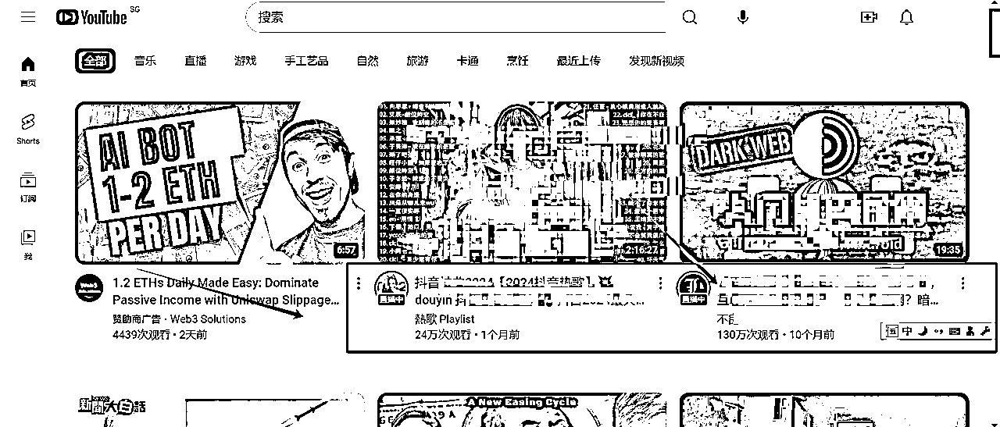
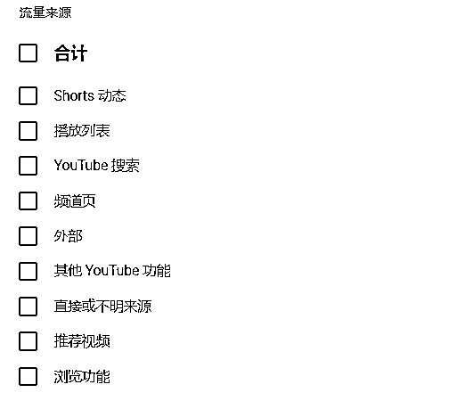

# 纯小白从0到1做油管如何做？

> 来源：[https://rlwxa0zgke.feishu.cn/docx/IR3od2lUoocqltxidX4clne8nJb](https://rlwxa0zgke.feishu.cn/docx/IR3od2lUoocqltxidX4clne8nJb)

在前面这篇文章 看了后，如果真打算做，一个纯小白又如何开始做呢？这篇文章就给一点小思路。

我们先看一个视频，这个叫TODD的人算是权威人士，看看他怎么说

中文翻译如下：

如果我从外部链接获得了大量流量，但留存率很低，这会判断我的视频为劣质视频吗？不会。

我们主要从我们提供的推荐和搜索结果中进行对算法的判断，在决定向每位观众推荐什么内容时，我们不会考虑外部流量。

从上述信息可以得知一点，我们可以从外部把流量引过来，这是第一步，但是其实油管的推荐算法其实是不把这个外部流量当做推荐的一个指标，准确来说这个指标放到很低的权重。

那么怎么才算到推荐算法中呢？如下图，我红色箭头指的这两个视频，属于推荐视频，还有在文章 中也给过一张图

这张图，右下角的视频也是推荐视频，还有比如说short，这是属于你浏览观后的视频，还有一种是你通过关键字搜出来的视频，这也会影响到推荐算法中。

所以的话，说这些有什么用呢？那就是前期可以通过网站、群组facebook、X、电报、微信、微博、分享YouTube视频链接。

通过外部链接让别人订阅你的频道，后期通过自然浏览的方式让youtube算法把你的视频铺到页面上，从推荐的页面上再打开视频。

在youtube不太建议纯僵尸粉，这个被查出来会有风险，国内的一些玩法可以来玩，几个人组队，互相观点，这起码是可以提升观看时长。

youtube官方后台会给你列出关注视频的流量来源，推荐跟浏览占比高，那就恭喜你，其实如果你懂SEO，YouTube搜索这一块是可以做得高的，也是一个不错的选择。

之前的一个帖子 YouTube认知:真正决定推荐量的最重要的因素是什么? 给出了建议，这个视频怎么做有流量，剩下的就是多更新，多更新你才能多曝光，多曝光，你才能有更多的视频被推送。

早期以数量以胜是一个策略，后期做精品也是一个策略，如果说早期只做精品，那其实出的视频太慢的话，那可能注意力被其他频道抢走了。

一个频道要有生命力持续更新不可少，那么下面有一个套路也是非常有意思，自古深情留不住，唯有套路得人心啊，下面说的一位youtube博主满满套路。

一位著名吃播博主，在前后间隔两周发布的视频里，从一个体重360斤的肥胖人士，变成了140斤重的瘦子。

没错，两周减掉220斤。这显然已经不符合科学常识了。那么，这一切是怎么发生的呢?

这位网红，他叫尼古拉斯·佩里，网名叫尼可卡多、牛油果。尼古拉斯从2016年开始做吃播，现在几个账号加起来，粉丝超过了860万，视频播放量超过25亿。

过去几年，尼古拉斯把自己从140斤吃到了360斤。什么概念?他已经胖得走不动路，出门必须坐助力车。他有一次还因为咳嗽了一声，就伤到了自己的肋骨。

但是，就在9月7日，尼古拉斯突然更新了一条视频，播放量3000万。因为这回，他瘦得太多了。从360斤瘦到了140斤。要知道，这距离尼古拉斯上次发视频，只过去了两周。

两周减掉220斤，怎么做到的?尼古拉斯自己说了事情的原委。他不是在两周之内瘦下来的。他的减肥从2022年就开始了。从2022年开始，他发布的所有视频都不是新拍的，而是减肥之前拍好的存货。他隔一段时间，就放一期吃播视频出来。但背后，真实的生活里，他一直在玩命减肥。

有人评价说，这家伙是个天才。他在开始策划的时候，就想好了怎么保持娱乐性、关注度和争议性。同时，他这个策划，展现了高水乎的认知操纵技巧。

比如，他提前两年录好了所有的视频，并且精心规划了发布节奏，让观众以为自己一直这么胖，观众忍不住一直劝他减肥。

再比如，他很会制造反转，故意在视频里说，自自己2023年和2024年都减肥失败了，让观众觉得他没有决心也没有瘦下来的希望。

小结一下：

1、前期可以外链引流，最好是吸引到人订阅到你频道

2、持续更新内容，内容多才能更多视频被推荐

3、几个人组成小组，互相看对方的视频，注意一点，最好是通过关键词搜索或者是推荐的模式让对方来看你的频道视频

4、使用套路把人留到你的频道上