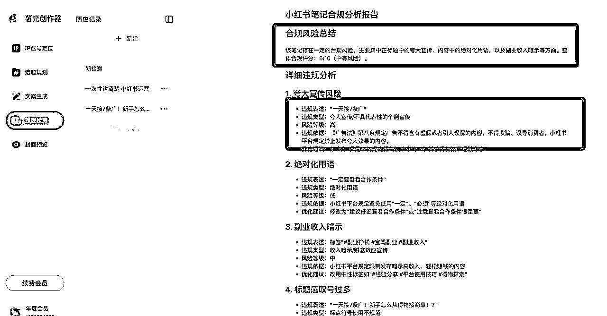
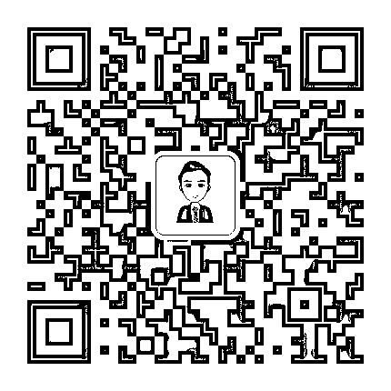
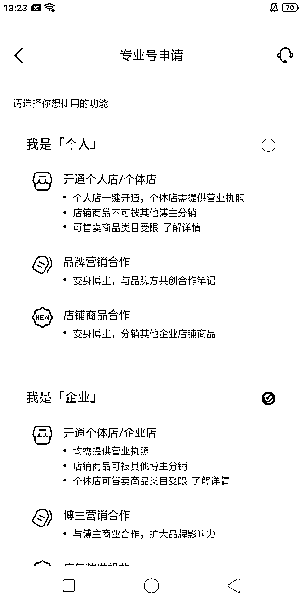
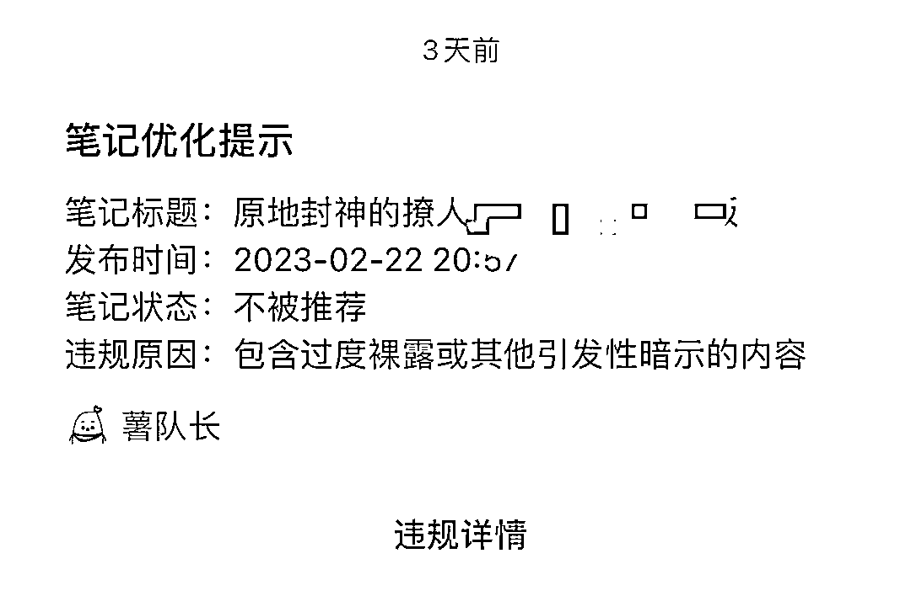
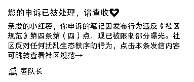
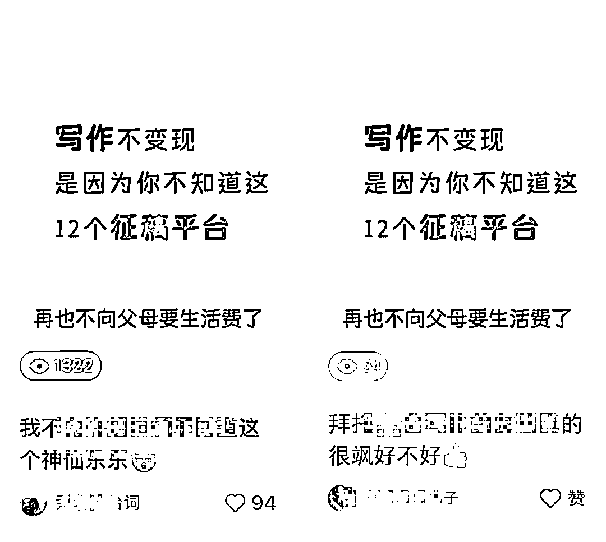
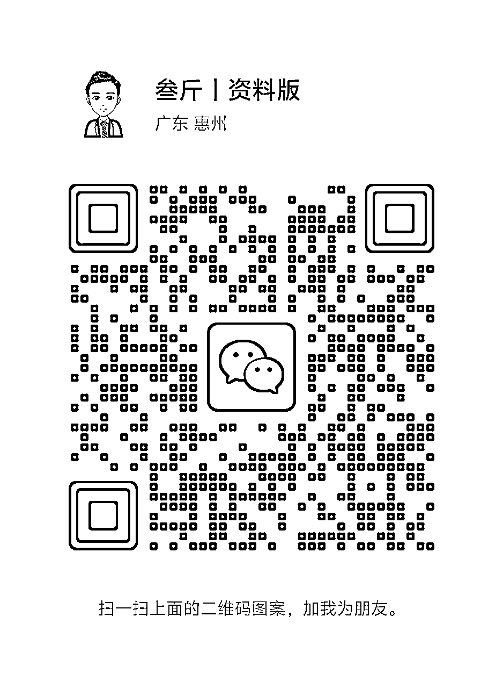

# 小红书运营常见问题汇总-叁斤问答手册

> 来源：[https://p03a4vs9s2.feishu.cn/docx/IkpcdPywzoTEF9xSvqScDhDVn0g](https://p03a4vs9s2.feishu.cn/docx/IkpcdPywzoTEF9xSvqScDhDVn0g)

Halo，我是叁斤，95后自由职业者，公众号：叁斤，微信：Msan53

我发现在小红书运营过程中，大家都会遇到各种各样的问题

为了不重复回答，我把一些重复提问较多的问题汇总成问答集，方便我在看到相同问题时，可以直接复制答案过去

这两天我把提问次数最多的问题也汇总进来了，目前问题有一百多个，后面还会继续更新

## 问答集说明

本文档为叁斤对小红书问题的回答汇总，内含账号、运营、变现、引流……等问题，供大家参考，问题不分难易顺序，内容不定时更新；

如本文档不能解决您的问题，可以向叁斤（Msan53）提问，我会挑合适的问题收录进来，每周一清；

发布时间：2024年 9 月 23 日

更新时间：2025年 9 月 07 日

## 违规检测：

发布笔记之前，可以在：https://sgcreator.zhimoxiezuo.cn/ 这个网站检测一下笔记情况。

## 小红书官方规则与政策链接汇总

遵守平台规则是你在小红书进行任何商业活动的前提。建议定期查阅小红书官方发布的最新规则和政策。

以下是一些核心规则的参考入口（请注意，平台可能随时更新链接，建议以小红书App内或官方网站的最新指引为准）：

《小红书社区规范》：https：//agree.xiaohongshu.com/h5/terms/ZXXY20221213003/-1

《小红书社区公约》：https：//www.xiaohongshu.com/crown/community/agreement?fullscreen=true

《社区商业公约》https：//school.xiaohongshu.com/rule/detail/5d67e65f0000000000000000/62738ce116a4f800136cbe3a?jumpFrom=school

《小红书专业号禁入行业有哪些》https：//school.xiaohongshu.com/helper/detail/1416?jumpFrom=pro

《蒲公英审核规范》： https：//ad.xiaohongshu.com/help/docs?id=2760

《蒲公英审核指南》：https：//ad.xiaohongshu.com/help/docs?id=2756

【蒲公英合作笔记-低差营销案例解读】https：//doc.weixin.qq.com/doc/w3_AIoA6QbFAO0P60xgVqCTHaEGU3Pgp?scode=ANAAyQcbAAgeDqhv4dAIoA6QbFAO0

《薯条审核规范》：https：//ad.xiaohongshu.com/help/docs?id=2761

## 违禁词清单：点击直达>>>

## 小红书术语表：点击直达>>>

## 叁斤公众号：

# 运营问题

## 新手做小红书是不是要新手机卡、新小红书号？

不需要，老手机卡、老小红书号也没问题。老小红书号没用过也没问题，但是不能是违规、限流状态的

## 新号到底需不需要养号？

不需要！新号不需要养号，注册账号就能发布笔记。但如果是长期不登陆的账号，或者之前违规过的，可以养一下号再运营。

特殊情况：如果是新号要发布带营销性质的内容，就需要养一下号再发稿

但这“养号”并不是浏览点赞，而是要发一些日常内容去给平台“看”，告诉平台，你是真实用户来分享的

## 平时浏览的内容，跟发布的内容不相关，有影响吗？

平时刷什么跟发什么不相关，刷什么内容，只能证明你喜欢看什么，跟你内容推荐给谁没关系

兴趣标签和内容标签是分开的

## 两个新号，养号期间是同时刷还是分开刷？

同上，养号不是靠刷的。刷内容只能让系统认为「你喜欢什么内容」，不能帮助你的笔记推送给对应人群

## 小红书账号可以用刚注册没多久的，但有发过其他项目的帖子，会有影响嘛

没影响，只要账号没有明显违规限流都可以用

## 新号没粉丝，是不是不好引流？

如果是引流私域，有没有粉丝对你不重要。只要笔记能做得好，0粉一样可以引流私域

开店的也一样，0粉开店，笔记做好可以马上出单

## 2个账号，能否来回切换？一个账号是发笔记用的，一个账号是个人使用，不参与工作

这个情况下可以切换使用，不会有什么影响

但是跟引流的账号要区分开，引流的账号很容易违规

## 新号怎么打标签？

账号标签不是靠刷内容打上的，新号注册，刷垂直内容，系统只能认为你是喜欢这个内容的人，而给你推送更多这个内容。并不代表你发的内容会推送给相同人群！

要让你笔记按标签推送给相关人群，还得从内容本身出发。内容打上对应标签，布局好相关的关键词，才能让你的笔记推送给相关标签的人

## 修改笔记会不会影响后续曝光量？

笔记修改后会影响曝光。

数据不好，修改一下首图和标题，有可能数据会更好。

数据好的，如果修改内容时添加了违规词，也可能会违规限流。

另外，修改很大概率会再次触发审核，如果内容比较敏感，处于违规边缘的，尽量不要修改。

如果投放薯条的时候提示广告，可以把可能违规的措辞改一下或者删减掉，审核通过时再次投放薯条，也可能会通过

## 笔记发布间隔时间最少多久？

笔记间隔1～2小时比较好

## 什么样的主页更吸引人？

1、首图尺寸统一，建议都调整成3:4格式（视频也可以）

2、主页色调统一，重点突出，最好加上封面标题

## 账号昵称、头像和简介怎么做更好？

昵称：简单、好记、无生僻字、小众

头像：与个人赛道、定位风格一致

简介：突出自己身份，展示自己的价值点

## 想换赛道的话，应该换什么比较合适

如果有粉丝基础换赛道的话，首先考虑粉丝人群，换的赛道跟原有粉丝人群相似或者重叠的会好一些

如果没有粉丝基础的话，直接换就行。

具体换什么赛道，可以从变现方向考虑，离钱越近越好

## 什么时候该投薯条？

小红书薯条属于内容加热工具，投放效果是根据内容优质度来看的，内容越优质，投薯条效果就越好

所以，如果笔记发布后，隔天发现数据不错，互动率高，可以适当投一些薯条加热一下

数据差的笔记没必要投

## 投薯条发现不能投，说不符合内容加热推广规范怎么办

1、自检、申诉看笔记是否违规

2、如果是广告笔记，则降低广告营销型重新试

3、把一些可能敏感的词删掉，或者用谐音代替（用查词工具找），改掉并重新审核通过后，再试试投放

## 什么时间段投薯条最好？怎么设置投放规则？

投放时间没有严格规定，根据自己内容类目的用户人群来判断，有些人下午投放数据好，有些晚上好，都不一定。

规则设置的话，一般人群这些选择智能推荐就行，投放时间6~24都可以，如果测试笔记，可以拉长12h，测试效果不错，可以追加6h集中曝光

## 手机走纯流量还是Wi-Fi？

账号少的话，20个内，走流量和Wi-Fi都没问题，如果账号很多，超过20个，就要做好账号隔离，尽量不链接同一个Wi-Fi

20个也不是标准，实际要看平台当下的规则怎么样

## 能不能几台手机同连一个WiFi运营

1、账号是容易违规的类型，比如需要引流的，就用4G，否则1个账号违规，容易连带同一WiFi其他账号

2、正常做账号矩阵，如博主接广告变现的或走平台转化，就不需要担心WiFi问题，不要超过20个账号在同一个WiFi下一般都没问题

但是如果你要引流私域，最好还是用4G，安全一些。

## 手机推荐用哪一款 苹果手机还是安卓呢

如果要更方便管理，建议用苹果手机，相互传输数据也很方便，还能直接使用live图

现在iphone xr以上的会好一点，如果预算有限，也可以iphone 8以上

## 多台设备之间资料怎么传输比较方便呀

苹果设备的话，可以直接用隔空投送。如果是安卓设备，可以用数据线，或者飞书、微信、QQ等工具，亲测飞书文档就很好用

## 一个账号一天建议发几篇？什么时间段发？有讲究吗？

一个账号建议一天3～5条，如果做不到这个频率，也可以日更1条。还做不到的，至少也应该做到周更3条，任何时间段发布都没影响

## 笔记发布后没数据，可以找人刷赞吗？

少账号之间互相点赞没问题，但是通过大量买赞、刷赞的行为，小红书是不允许的。刷完之后虚假数据会被小红书删掉。

## 可以批量删除/隐藏笔记吗？

不要大量删除，可以先隐藏，慢慢删

## 违规的笔记怎么办？

显示“已违规”的，直接删了

## 为什么发出去的评论别人看不见？

评论有违规营销，或者引流嫌疑，就会被平台限制

## 做矩阵，多设备发的图文都要不一样的吗？可以内容一样，排版不同？

矩阵账号之间最好内容是不一样的，否则没了矩阵的意义。

矩阵的每个账号发布不同类型的内容，可以快速测试哪个类型转化率最高

## 矩阵账号应该同一个赛道好，还是做不同的赛道

看个人项目，大部分情况下，矩阵都是同一个赛道去放大的。比如旅行社的，可以做多个旅游矩阵，不同目的地的号等，都属于旅游赛道

## 笔记发出去多久才会被推流？自然流能推多久？

正常情况下，审核通过后就在推流了。在不火的情况下，自然流大概推3-5天，如果一两天没到100，大概率内容不好

## 可以用小号在评论区进行评论互动吗？

如果笔记流量明显上升，可以用小号在评论区引导评论，带一下评论区节奏

日常情况下不需要

## 有流量券，但提示没有可推广笔记是什么原因？

流量券只能推广「获得流量券之后发布的笔记」，比如，9月22日获得流量券，9月22日之前发布的笔记，都不能使用。之后发布的笔记才能使用

## 笔记下不好的评论，能直接删吗，删除影响不影响流量？

不好的评论可以直接删除。看到有人打广告、截流，都可以删除，对笔记没什么影响

## 泛娱乐的笔记，几万的小眼睛，有价值吗？

这种内容没什么商业价值，对账号权重之类的也没什么帮助

## 只有专业号能对接到人工客服嘛？

目前只有专业号有人工客服的入口

## 爆款文案怎么扒下来汇总？

网页版小红书就可以直接复制笔记文案啦，如果是图片文案，可以用微信截图识别文字，视频文案可以用“轻抖”

## 小红书发笔记 是固定一个模板好 还是可以发不同的封面模板

先用不同模板发布，测试一下哪个点击率最高。然后把最高点击率的封面固定下来

## 小眼睛每篇都不过50，持续一周了，需要重开吗

不用，小眼睛能到50，至少说明没被限流。主要内容不行，可以从选题开始调整

选题、封面和标题，全都换一遍

## 为什么要把图文的内容做成视频呢，是视频类的推荐更好么

小红书是双列瀑布流展示，用户看到封面、标题，感兴趣了才会点击进去笔记

如果点击进去的是视频笔记，那用户可以上滑、下拉，切换到下一个视频，类似抖音

切换到的视频不需要用户点击，直接展示在用户面前

所以从点击率方面，视频的内容天然比图文要高，能做视频，当然选择视频

## 剪映里面的Bgm不够用？有没有什么好的资源

酷狗、qq音乐、网易云，都有很多bgm推荐，先从这些网站找到合适的音乐，记下名字，去下载mp3格式就行

## 怎么高效快速的建设对标赛道的素材库，用于快速稳定的发布？

关注一个对标账号，小红书会推荐相似账号给你。给对标笔记点赞、收藏，小红书也会推荐相似的笔记给你。

在别的账号的收藏页，也可以找到其他优质的笔记，把这些笔记提炼成选题，收集在自己的选题库中

# 账号问题

## 新账号刚发布，没有自然流量需要用薯条推吗？

不需要，新账号没流量的话大概率都是内容出了问题

薯条是加热工具，只能让原本就能火的笔记更火，不能让不火的笔记变火

## 新号发笔记 几分钟就有几个点赞 但是过了一会就没有了

这种情况一般就是内容不好，平台给推了流量，但是笔记内容不好没承接住

正常情况下，小红书新笔记会有“保量推荐”，大概意思是，笔记发布后24小时内保证有一定量的曝光，但曝光不是平均分配，是有波动的，如果提前给完了保量，后面就正常跟旧笔记竞争了

举个例子：

假设新笔记24小时内保1000个曝光，笔记发布后前1小时已经给了900个曝光，那剩下23小时就只有100个保量曝光了

所以会出现笔记发布短时间内有点赞，之后就没数据的情况。就是笔记质量不够好，保量之后竞争不过其他笔记

具体的流量推荐可以看这篇：

## 一个手机两张卡，切换登录小红书，有影响吗？

只有这两个账号的话，没问题的。一卡一机一号在账号少的时候不用太关注

## 一台电脑切换多个账号可以吗

可以的，账号不多的时候没问题，我也经常来回切换3～5个账号

## 手机不登陆小红书的时候是不是可以共用网络？

只要是正常运营的，都可以链接公共网络

如果是做大批量矩阵，或者违规的内容，就要注意IP隔离，整个手机不管有没有运行小红书，都要隔开网络

手机app会自动后台运行，即使关闭软件，后台依然有程序在运行的

## 账号半年没运营了，重新启动会影响流量吗

长时间没有运营的号，可以浏览一下再发。

日常浏览、互动，活跃个3~5天再发稿，会好一些。

如果数据还是很差，看小眼睛情况，个位数的，可以申诉看是否违规。

如果几十几百的，那可能只是笔记质量太差

## 老账号没违规，很久没用，是注销后再申请？

不需要注销，只要是没有违规的，都可以直接用

可以发一下日常笔记看看数据是否正常

## 实名认证可以取消吗？注销才能取消实名认证？

实名认证不能取消，只能注销账号才能释放实名认证

## 不进行实名认证，会影响笔记流量吗？

不实名认证，对笔记推荐没有任何影响。但如果要开通专业号，开小红书店铺和蒲公英的话，必须要做实名认证

## 一部手机可以同时登录、切换多个账号吗？

如果是双开应用，是没问题的。切换登录也没什么问题。

但如果一开始就发营销信息，或者要用于违规引流，就不可以。否则违规可能导致连坐

## 小红书等级会影响到账号的权重吗？

小红薯等级是很早之前的东西了，对账号权重没什么影响，也不用刻意去养这个等级

## 以前乱发内容，想重新运营起来，需要换号吗？

不需要，原来账号没有违规，浏览量也正常的话，可以换了类型发

发布一段时间，浏览好一些的时候，陆续把之前的笔记隐藏起来“仅自己可见”就行了，不需要删除

## 小红书注销再注册，还是会算新号吗

如果注销前严重违规过，则重新注册也极容易违规。如果注销前无违规无限流，重新注册也不会违规限流

至于算不算新号，其实不重要，新注册后一样能获得成长流量券

## 小红书能不能一机多号运营？

跟Wi-Fi同理，如果你做的事跟平台博弈，动不动就违规的内容，那就一卡一机一号，否则容易封设备

如果你是正常运营，跟平台和平发展，一机多号没问题

小红书还专门出了“切换登录”，足以证明一机多号不会有影响

我已经运营账号好几年了，只有几次笔记违规，也不牵连账号，一机多号从没出过问题

## 多个矩阵号差不多的时间里发类似的内容，会有影响吗

会的，小红书有个“笔记相似度推荐”，笔记与笔记过于相似，大概率会推送到相同人群

同一时间被用户刷到2个一样的内容，她只会点击一个

但如果把时间间隔开，她可能会重复点击，也可能她不在线，就推送给其他人

## 1个手机用数据，2台手机连热点，不引流， 对账号影响不大不

不大，只要不做引流、不发太多过分违规的信息（如恶意虚假宣传），一般都没问题的

我就是用手机开热点给另外3个设备用

# 店铺问题

## 关于「物流模板」和「发货地址」

刚开店，如果还没确认选品的话，可以先不填写物流模板和发货地址

等确定好了供应商，就按照供应商的发货地址填写就行了

## 一个手机号只能开一个店铺是吗？

一个手机只能开一个点，一个实名认证也只能认证一个店

## 小红书店铺的产品不出单，需要下架重新来过？

如果卖的东西是一样的，就不需要下架，在内容上调整一下就好了

如果卖的东西都不一样，就要把产品全部下架，上架新产品

## 用个人身份证开店好，还是要申请个体户执照开店好？

这个跟品类有关，大部分品类用个人身份证开店就行，少部分品类必须企业店，具体的可以看看小红书的经营大类一览表

另外，如果后期有投流计划，或者有投放博主计划的，就企业店会好一些

## 为什么个体户开店时，显示身份证被占用？

一个身份证，可以开一个店铺。一个营业执照，可以开2个店铺

如果用个体营业执照开店，显示实名认证被占用，大概率是选择的时候点错了

在申请专业号时，虽然「个人」和「企业」都可以申请「个体店」

但是点「个人」这里申请，可能会出现身份证占用的问题。点「企业」申请，就直接用营业执照

## 账号实名开店了，是不是得注销账号才能关店呢

要先把店铺关了，过了公示期再注销账号

## 小红书店铺需要养号吗？可以直接发笔记带产品链接？

店铺账号不需要养号，发的笔记都可以带产品连接

## 小红书开店的话会不会变得流量更少了？

不会，小红书开店跟流量分配没有直接关联

但是开店后笔记内容可能会不自觉的往硬广方向写，导致没人观看

## 小红书做无货源，有哪些货源渠道？

服装类：一手app、搜款网、人人货源。其他百货：1688、拼多多、义乌购。

最常用的货源渠道：1688、拼多多

但需要注意规避无货源代拍风险

## 运营小白，推荐小红书店铺的无货源吗？

不了解电商，也不了解运营的话，不太推荐直接做无货源电商，很容易违规

## 一件代发算无货源吗，有账号风险吗？

一件代发不等于无货源，有很多批发商都支持一件代发，这种属于正常商业合作行为

## 小红书店铺限流，要投流才解除限制怎么办？

如果已经限流了，就先养号，限流期限过去后，把内容做的更精细，需要原创

## 小红书店铺的类目还能更换吗

可以，店铺类目可以后期增加。但是增加类目后，保证金可能会变化

比如，原本交了1000元保证金，添加了别的类目后，该类目保证金为20000，则需要补交19000保证金

## 多个账号绑定一家店怎么做？

开企业店，每个企业店可以绑定3个个人主理人和3个企业主理人，也就是可以7个账号绑定同一家店

## 虚拟商品怎么选品类啊？

大部分可以选择：艺术品及周边>艺术定制>虚拟定制

## 产品已经发货，快递在途中，但是买家发起退款，这种情况怎么处理呢

先打电话问问快递能不能追回，有些快递公司就有这种服务，不行就跟买家说，只能收到货退货了

## 商品错挂类目，系统提醒商品违规有影响吗

没有影响，按提示把类目改回来就行了

## 小红书店铺违规、被封了，会影响账号吗？

小红书是号店一体，如果店铺严重违规，可能会影响账号，具体要看违规情况。比如，有些违规会提示限制商品笔记曝光。

如果是绑定了主理人，那这些关联账号是不会影响的

# 企业号相关

## 为什么小红书品牌号涨粉那么慢

品牌号给人第一感觉都是营销、广告，所以运营方式跟个人号不一样，涨精准粉也会更困难。但如果要泛粉，可以通过抽奖的方式获得

## 企业号要怎么运营好一些？

企业号一般都是扩大品牌影响力和卖货的需求，遵循一个道理：

产品是1，运营是0，产品不好，运营多厉害都没用。

如果产品好，运营方面定位就好做好，你是以什么身份去卖？卖的东西能帮人解决什么问题？满足什么需求？为什么要买你的？

企业号可以跟个人号打配合一起做，或者加入一些企业号的人设，效果会更好

## 本地门店开企业号，要怎么引流？

1、先把店铺的地理位置弄好

2、笔记内容增加地区属性（加入地区关键词），然后笔记添加店铺定位

3、企业号可以设置一个店铺地址，具体操作看企业号后台

## 按小红书的KFS模型，投达人和信息流、搜索流，能做到多少ROI？

不一定，每个类目投放成本都不一样，现在投放商家的数量越来越多多，信息流的投放成本也随之增加。

现在的投放需要更专业、更精细化去筛选达人、目标人群以及搜索关键词

搜索流的转化目前是最高的，需要在小红书造势，还得结合KOC、KOL和信息流一起做

## 能不能让几个账号同时给一个店铺带货？

可以，企业账号可以绑定3个个人主理人和3个企业账号，这些账号不用开店，可以关联到同一个主号店铺，可以挂主店的产品链接

需要注意的是，3个个人主理人账号必须实名，且认证为主理人账号。企业号认证企业即可

## 一个营业执照能认证几个企业号？

一个营业执照（含个体户执照）只能认证2个企业号

## 一个主体怎么认证多个企业号？

可以，但需要特殊申请报白，具体条件需要咨询官方直客

# 引流问题

## 引流的助手小号需要养号不

不需要，这个随时可能封号的

## 引流如何规避风险？

引流怎么做都有风险，不收费的规避方法，就是用小号来引流，把风险转移到小号

收费的方法：直接投聚光客资收集，平台开白名单，最安全

## 怎么注册多个手机号？

拼多多可以购买注册卡、流量卡，月租在19.9、29.9左右，流量很多，也可以注册“和多号”，和多号是虚拟卡号，可以注册小红书

## 小红书怎么找精准人群？

挖客，做搜索

1.  挖客

找到自己同行的账号和爆款笔记，看他们评论区，只要有评论是在咨询的，就去私信他，要联系方式

1.  做搜索

最精准的流量，就是用户主动搜索来的。在笔记中做关键词布局，再找一批人，主动去小红书搜索某个关键词，模拟真实用户找到你的笔记互动，这样能有效提升搜索排名，但不稳定

最稳定的方法，开通聚光，做搜索广告，可以把有关的关键词都买下，这样能保证展现

如果需要排在最前面，就去做抢占赛道，能保证你的笔记在广告位的第一位或者前三，但费用很高

## 小红书能放邮箱吗？

不能，大概率不会审核通过。但如果你是有比较多粉丝量（至少5万+），那可以放上去，用一些emoji或者🐧来替代，平台不会马上下架

## 小红书的群里可以放网盘的链接吗？

不能，所有外链都会被识别

## 商家想在私信向用户发自己的手机号、微信号等联系方式是否只能通过私信获客工具完成？

是的，自2025年1月7日起，商家只能通过私信获客根据完成引流，私信获客工具包含留资卡、企微/个微/电话等商家名片，能满足不同的联系方式交换需求，禁止其他在私信内发布或者在欢迎语中配置自己联系方式的行为。

## 商家在私信沟通时用户主动留下联系方式，商家是否会被判为违规？

不会，平台允许商家在私信内对用户提供咨询服务后，用户主动留下联系方式的行为。但商家需要注意不要出现频繁向用户索要联系方式的骚扰行为。

## 哪些引流话术是禁止行为？

即使投放聚光广告，也禁止商家在私信内明文发出自己的手机号/微信号或引导到其他第三方平台交易

话术举例：“可以加老师的V【Msan53】详细为您介绍哦

"+18X11111111领福利”、“去XX平台搜索可领福利哦”。

聚光投流用户，可以使用私信获客组件引导用户点击/添加，话术举例：“感兴趣您可以点击这个【企微卡片】

添加我们顾问老师哦”、“服务定制可点击卡片上的「复制微信」联系我们哦~“

解答完用户问题邀约有意向的用户主动留资是允许的行为，话术举例：“您留个电话号码吧，我们为您预约上优惠活动”、“需要可以留下您的微信，为您详细介绍~”

# 变现问题

## 哪些赛道持续性比较好？

持续性最好的，就是小红书频道分类和及千瓜、新红等第三方平台中有专门分类的

## 小红书赛道很多，看起来都能赚钱，如何选？

每个赛道都有变现好的和变现差的，如果要看大盘数据，可以从灰豚数据、蒲公英等渠道看每个赛道的博主报价，按大盘来说，接广告的肯定是美妆护肤和母婴、家居是最多的

但是这个没法覆盖引流变现和电商变现，电商要在小红书平台看销量，引流变现的无法统计

所以建议根据自身优势、喜好来选择若干个赛道，在一个个去查这个赛道的变现能力，选择最适合自己的

## 小红书最高效的变现模式是什么？

变现模式主要有三种，电商、广告和带货

引流私域没算进去，引流私域也是变现能力很强的，但是引流的项目有非常多

每个类型的变现效率都不错，也都有做的很好的人，具体看自己的优势在哪

## 什么类型账号变现最好？

首先确定你想怎么变现？常见的有接广告、带货和卖货，如果你想接广告，那可以做成买手人设，不仅可以接广告，还可以带货赚分佣

## 出了一篇爆文，但是没有人咨询购买，怎么回事

爆文和转化没有直接相关的，一般在做爆款的时候，围绕自己产品去介绍，可以植入产品的使用场景。

不是所有爆款都会带来转化，卖货的账号不需要过于追求爆文，内容跟产品相关、引流精准粉丝，比爆款笔记更重要

## 一发广告就没流量，怎么回事

做小红书接商单变现的经常会遇到一个问题：平时流量很好，一发广告就没流量

不知道怎么把产品和笔记结合起来，导致广告很硬，播放量很低

提供一个思路给你们：

把你账号所有关键词、产品卖点、痛点都列出来，找交集，找每个点之间的关联

这个关联就是个能把产品和笔记结合的好选题

例如：个人成长号跟养生茶

账号关键：努力工作、赚钱

卖点：养身体…

工作和赚钱之间可以插入“熬夜”，熬夜和养生之间就有了关联，这就是你的选题

## 笔记带货什么门槛？

博主笔记带货，需要满足粉丝>1000，并且完成专业号认证

# 违规、限流问题

## 小红书笔记限流要怎么解决？

在确定笔记限流后，要先判断笔记问题出在哪里？是笔记问题还是账号问题？

有些限流是会告诉你限流原因，按官方提示去修改就没问题了，有些则需要自己去申诉看问题出在哪里

1.  笔记问题：

按上述方法直接申诉，官方会给申诉结果，按官方给的结果去调整笔记就好。

如果给的结果很模糊，比如这个

违反社区规范第四条第四点，但里面还有很多小点，不知道具体哪个问题的，可以看看是不是账号本身的问题

1.  账号问题：

方法1：同样是按上述操作，但是把“笔记申诉”换成“账号申诉”，看申诉结果是否账号有问题，如果账号有问题，一般会直接告诉具体问题，可以按提示调整或者养号

方法2：遇到模糊不清的违规，如上面提到的第四条第四点，那可以把笔记放到另一个正常的号上发，看是否同样限流。

换号也限流，那就是笔记问题。换号不限流，那就是账号问题。换号发布笔记不限流，原账号的申诉也没问题，那就可能是账号太新、权重太低，平台盯得紧，这时就不要发明显营销的内容了

1.  笔记优化

一般申诉后，平台会给比较准确的违规信息，如前面笔记违规提到的，包含过度裸露内容等，把对应的图片删掉或者找不那么暴露的图片替代即可，一般替换审核通过后，流量会恢复正常

常见的违规很多都发生在“广告营销”、“引流”、“低质量内容”、和“伪科学”等等，发生这些违规的时候，按要求修改掉对应的句子即可，流量可以恢复原状

1.  账号优化

如果账号确实有问题的话，一般会告诉你是什么原因导致，要怎么修改。但一般账号违规只能进行养号或者放弃账号

养号方法1：如果没有说明限流几天的情况下，可以发布一些不带任何营销的日常内容，并在平时刷一下小红书互动一下

发布日常内容的时候看一下互动量，看流量是否正常。（一般发一些带话题性的段子很容易测试出来）

养号方法2：如果说明了限流几天，那这几天正常浏览互动即可，不需要发布任何笔记。到期限后再发笔记，一般就会回归正常

## 简介和瞬间等内容被判违规，会影响笔记的流量嘛？

偶尔一两次不影响，但是次数太多，可能会判永久重置简介

## 笔记爆了之后突然违规了，是什么原因呢？

小红书笔记审核有很多次，发布时有初次审核，当笔记达到一定曝光量后，会再次进入审核

也就是说，如果笔记本身存在违规，即使发布后能通过，火了，也有概率在后面审核中被判违规

## 笔记发布后 5 个小时还显示审核中，正常吗？

正常的，偶尔会遇到审核特别慢的情况，有啥一天都没审核过

这种情况比较少见，只要删掉重新发布就好了

## 发小红书是不是需要先检测文字和图片内容？如何检测？

一般用零克查词可以查询敏感词，现在工具也很多，网上搜一下 敏感词查询，大量工具

## 把对标的作品图片下载去重直接发，会对账号有影响么？

现在平台对二创、搬运的识别水平越来越高，即使现在可以审核通过，但火了之后也有可能被二次审核违规

## 爆款打印出来，再实拍，会不会被判搬运啊？

不一定，可以把爆款内容里面的顺序打乱再实拍，会好一点

直接拍的话可能自然流上没问题，投流会审核不过

## 如何看自己笔记有没有限流？

1、看阅读量，如果发布后隔天阅读量还是个位数或者小2位数，那可能被限流了

2、直接申诉笔记，看平台反馈

3、查看有没有收到站内违规通知

4、点击薯条 投放界面，看是否可以投放薯条

申诉最直接，有问题也会给你指出来

## 怎么判断账号有没有被限流？

1.  如果后台提示账号限流，就一定限流了

1.  新笔记发出去24小时后，小眼睛依然低于50，大概率也是限流了

1.  发布“互动类”笔记，24小时候也低于50小眼睛，大概率限流

1.  互动类笔记是：任何能引起讨论的话题，如：月入3W的大佬进来……

1.  后续的笔记，数据中心里，首页推荐和搜索比例远小于主页，大概率都是限流了

## 笔记被人连赞会被限流吗？

不会，但如果很担心的话，可以拉黑他。

## 正常发布的笔记，投放薯条显示违规怎么回事？

投放薯条的审核标准比正常笔记的要高，如果笔记中带有产品推荐等营销性质，是不能投放薯条的

但不能投放薯条不意味着违规，依然可以正常获得推荐流量

如果连正常推荐流量都没有，那才是违规了

## 被封过账号的手机上，用其他手机号注册新账号，对新账号笔记流量有影响吗

看情况，如果只是封号，没影响

但如果是封设备，就有影响，会直接封号

## 账号违规后需要注销换号吗？

普通违规、单篇笔记违规、简介昵称违规等轻度的，不需要

轻度限流，有明确时间限制的，有也不需要

如果限流期限结束后也没恢复的，建议换号

## 自己的笔记和图片可以反复发吗，会被判定抄袭吗？

新规定，自己的笔记如果重复发，只修改个别字的情况下，也可能判违规

## 违禁词比如"最"能出现在视频里吗？还是文案不出现就可以？

小红书查的不是词语本身，而是「词意」

举个例子，你说：我最好的闺蜜、我和我闺蜜天下第一好，不违规。因为这是你的主观判断

但如果你说，这个产品是全国最好用、这个产品的去屑效果是所有同类产品中最好的。这就有可能违规了

# 投流问题

## 小红书怎么开通下面这种自动回复？

开通企业号，并且充值“聚光广告”，在聚光广告中，近30天消耗满1000后，下一个周二可以开通“私信服务组件”

在小红书专业号平台，打开“私信服务组件”，再打开“欢迎语助手”，就可以设置自动回复了

## 找官方开户，有最低充值要求吗？

找官方直客开聚光账户，最低充值5000，自己开户，最低充值2000

找代理开户，可以拿到5~10%不等的返点

## 官方开户、代理开户、自己开户，有什么区别？

找官方开户，如果遇到好的直客，解决问题的速度会比较快。如果遇到不好的，可能开户后不怎么管你，而且没有返点

找代理开户，解决问题的速度不如官方直客，如封号，要捞账号，效率会慢很多。好处是有一定返点

## 封面优选和标题优选有必要开启吗？

如果小红书图片，包括首图在内的每张图片都很类似，不介意哪张图片做首图的话，可以开启封面优选

如果首图是经过设计，其他图片都不适合做首图的话，就不要开启封面优选

标题优选也一样

## 一个笔记能同时投放在不同计划中吗？

可以投放在不同计划中，但最好每个计划之间存在变量，不要建立2个一模一样的计划，里面的笔记也一模一样

## 聚光广告和千帆ARK有什么区别？

千帆ARK主要给开店的商家投放，操作比较简单，可以快速出单。但是不好放量，人群不能细化圈选。

聚光可以投放商销，也可以投放互动，投放的选择性更多，自由度更高，容易放量。但操作难度比千帆ark要高

## 如果是开店铺的账号，建议投聚光还是千帆ark？

开店账号，要快速出单，预算有限的话，建议投放千帆ark。如果预算充裕，想放量投放，就千帆ark结合聚光一起投

## 一个账号如果经常投放聚光广告，会不会导致自然流量变差？

不会，广告流量和自然流量是分开的。而且广告流量拉动数据，在一定程度上是会帮助自然流量破圈的

## 投放的时候经常会有同行来点击广告，有办法避免吗？

没有，只能手动拉黑同行

## 如何自查自己的行业能不能投放聚光？

境内主体准入规范：https://ad.xiaohongshu.com/help/docs?id=2767

## 聚光广告投放期间，账号被封了，有办法解封吗？

不严重违规的话，可以找直客捞回。严重违规捞不回

## 新的营业执照注册多久后，可以认证企业号？

出证书后马上就可以认证企业号

## 广告计划中有一个创意违规了，影响其他创意吗？

不影响，创意之间互相独立

## 广告投放不起量，钱花不出去，应该怎么调整？

主要从几个方向调整：

1.  计划本身，先看计划关键词和人群圈选是不是太窄了导致钱花不出去？

1.  成本太低，人群没问题，再看下出价是不是远低于行业平均出价？太低的价格也会导致花不出去

1.  内容本身，都在平均水平的话，就看看内容制作是不是太差？

## 企业号投流过程被禁言，怎么办？

先判断被禁言的原因

如果是满足当下消耗条件的情况下，因为违规引流被禁言，大概率是误判，可以找直客解封

如果未满足消耗条件的情况下被判定违规引流，也可以找直客捞回来

这种情况一般会发生在刚开始投流的时候

但是，被禁言如果是因为其他原因，比如截流被平台发现、发表不正当言论等等，这种情况大概率不能解除

## 千帆里面建计划相同素材会不会撞线？

相同素材，不同计划，就不会撞线，计划与计划之间要存在变量。

比如，相同素材，计划中人群不同，可以

或者相同素材，相同计划，一个roi设置为3，一个设置为2，也可以

## 一个笔记同时投产品种草和客资收集会互相有影响吗？

不会，产品种草是投互动和曝光比较多，客资是投引流，互不干扰

## 先投种草拉一下互动数据，再投开口留资会不会提升roi呀

会的，用户都有从众心理，如果一个笔记互动比较高的，投放出去的成本会降低一些，成本低了，roi就高

## 全站开口和信息流开口两个计划设置一样的预算、笔记可以吗

可以的，全站是把笔记同时投放在搜索、信息流和视频流（视频笔记）中，信息流只投放在信息流中，两个计划互不影响，互相独立

## 投信息流自动出价，跑不出去是什么问题呢？

计划跑不出去的，大概率是人群定向太窄，或者出价太低，还有就是笔记内容本身不好

## 两条计划，内容不同、关键词一样，投放时会不会自己跟自己撞车？

不会，都是自己的笔记，两条计划一样，内容不同，还能帮助我们测试出哪个笔记才是优质的投放素材，测试一两天，把不出量的给关掉就行了

## 笔记投放一段时间后，又被拒了是为啥？

小红书笔记审核有多个层级的，笔记发布时审核一次，广告建立时审核一次，广告过程中还会审核多次

每次审核员都可能不一样，要求也会有细微差别

如果笔记本身存在问题的，再次审核的时候就有可能被拒绝

以上，就是目前收集的问题集，内容会持续更新，希望对大家有一定帮助！

公众号：叁斤，微信：Msan53

