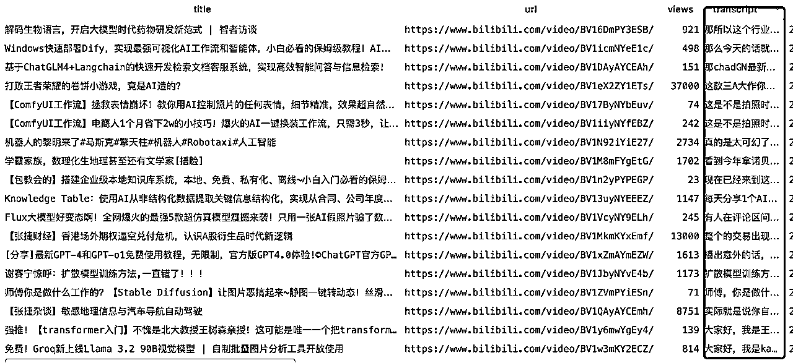

# 100个B站AI KOL up主视频采集转录数据与实现过程分享

> 来源：[https://ia0969wpr2.feishu.cn/docx/J0ladnb61oyj8SxwSCBcqDZvnad](https://ia0969wpr2.feishu.cn/docx/J0ladnb61oyj8SxwSCBcqDZvnad)

大家好，前两天写了一篇“153个公众号AI KOL十万加文章采集与分析” ,背景是亦仁提出的首个“超级标”，今天我再次采集了B站100个AI UP主的所有视频共计超过了 3.2 万个视频，其中观看量比较多的10320条使用 whisper 转录为了文本，表格数据包括UP主的基本信息、视频标题、观看次数、视频文案等等，帮助我们更好的定位账号和模仿对标。

原始数据在：

下面是完整的数据和实现过程分享。

我们首先依旧是在新榜找到哔哩哔哩的AI KOL榜单，这里新榜限制了导出表格，我们还是直接用影刀两行代码搞定。获取当前网页，点击数据采集，在网页中选中表格数据，点击确定自动识别，这时候直接运行我们就可以采集到这部分数据了：


直接执行影刀，这是我们发现数据已经采集完成了，采集到的表格数据如下：

采集到对标的AI领域UP主后，我们需要采集UP的所有视频信息，这里为了方便我们还是直接用影刀完成即可，不需要研究js或者逆向，毕竟对于不懂代码的人来说，爬虫的上手成本有点高。

还是和刚刚一样，我们新建一个流程获取当前网页对象进行调试，然后打开一个B站主页，点击影刀数据采集，这时在跳出的采集弹框中点击新增一列，选中我们要采集的数据，这里我需要的是标题、视频链接、观看次数、发布日期，逐个选中即可，结果如下：


我们看到单页视频都已经被采集上了，但是我们需要的是采集个人空间下的所有视频，影刀本身是支持多页采集的，我们只需要勾选多页，然后页面上选中下一页的页面元素，这样就可以采集到UP主所有的视频信息了。


执行影刀代码，这时我们可以看到影刀已经采集了个人空间下所有的视频信息了，数据列表中已经有了这些数据，一共四列，符合我们的预期：


到这一步基本采集就完成了，我们可以把采集到的数据保存到Excel或者飞书、数据库等不同的数据源，这里为了方便处理，我保存到了数据库中。

接下来就是针对文本的转录了，我之前分享了一篇 "借助AI打造高效短视频工作流，日均提取2万+视频文案"，生财链接是：https://t.zsxq.com/hA0FV，这篇文章里介绍了如何自动化批量提取视频文案，主要是使用sensevoice 或者 whisper 对视频进行转录，这里我们使用的仍然是这个方法，我们修改下数据源，把采集到的B站视频接入到工作流中。

执行之后我们发现视频文案已经成功提取到了并且保存到我的表中了



我们重新梳理一下采集到的数据字段情况：

用户主页、UP主昵称、描述、粉丝数、视频总播放次数、视频总点赞次数、视频标题、视频地址、观看次数、发布时间。

接下来就交给cursor写代码就OK了，提示词如下：

我采集到一些B站 UP主的公开数据，采集的字段包括：用户主页、UP主昵称、描述、粉丝数、视频总播放次数、视频总点赞次数、视频标题、视频地址、观看次数、发布时间等，详细表结构如下：CREATE TABLE bilibili_videos (

id int NOT NULL AUTO_INCREMENT,

title varchar(1000) DEFAULT NULL,

url varchar(1000) DEFAULT NULL,

views int DEFAULT NULL,

publish_time date DEFAULT NULL,

up_homepage varchar(1000) DEFAULT NULL,

up_nickname varchar(255) DEFAULT NULL,

up_description text,

follow_count varchar(1000) DEFAULT NULL,

fans_count varchar(1000) DEFAULT NULL,

likes_count varchar(1000) DEFAULT NULL,

play_count varchar(1000) DEFAULT NULL,

transcript_time varchar(255) DEFAULT NULL,

PRIMARY KEY (id)

) ENGINE=InnoDB AUTO_INCREMENT=19264 DEFAULT CHARSET=utf8mb4 COLLATE=utf8mb4_0900_ai_ci;

以上表中有不同的UP主的所有视频信息，下面我想研究该UP主所有的视频观看次数曲线、热门视频，随着发布时间观看次数变化曲线图，不同观看次数区间范围视频数柱状图；

请你对所有UP主账号进行逐个账号级别的分析并最终输出报告，每个UP需要有UP主名称，UP主描述、UP主主页地址、粉丝数、总获赞数、总播放数、最早视频日期、最新的视频日期、根据所有视频观看数计算出来的平均观看次数。还要帮我列出观看最高的20个视频以及视频地址、还要画出阅读数随时间的变化趋势图、视频观看数分布图、以月为单位的观看数趋势图。

接下来请你使用python代码实现，并输出一份最终的PDF文件


请你对所有UP主账号进行逐个账号级别的分析并最终输出报告，每个UP需要有UP主名称，UP主描述、UP主主页地址、粉丝数、总获赞数、总播放数、最早视频日期、最新的视频日期、根据所有视频观看数计算出来的平均观看次数。还要帮我列出观看最高的20个视频以及视频地址、还要画出阅读数随时间的变化趋势图、视频观看数分布图、以月为单位的观看数趋势图。

接下来请你使用python代码实现，并输出一份最终的PDF文件

```
import pandas as pd
import matplotlib.pyplot as plt
import seaborn as sns
import mysql.connector
from reportlab.pdfgen import canvas
from reportlab.lib.pagesizes import letter
from reportlab.pdfbase import pdfmetrics
from reportlab.pdfbase.ttfonts import TTFont
import tempfile
import matplotlib
import os
matplotlib.use('Agg')
from matplotlib.font_manager import FontProperties

# 指定字体文件的完整路径
font_path = r"C:\Windows\Fonts\simsun.ttc"

# 确保字体文件存在
if not os.path.exists(font_path):
    raise FileNotFoundError(f"找不到字体文件：{font_path}")

# 注册中文字体
pdfmetrics.registerFont(TTFont('SimSun', font_path))

# 设置matplotlib使用的中文字体
font = FontProperties(fname=font_path, size=10)
plt.rcParams['font.family'] = ['SimSun']
db_config = {}
# 连接到MySQL数据库
conn = mysql.connector.connect(
       **db_config
    )
# 从数据库中获取数据
query = "SELECT * FROM bilibili_videos"
df = pd.read_sql(query, conn)

# 关闭数据库连接
conn.close()

# 将publish_time列转换为日期类型
df['publish_time'] = pd.to_datetime(df['publish_time'])
def plot_views_over_time(up_data):
    plt.figure(figsize=(10, 6))
    plt.scatter(up_data['publish_time'], up_data['views'])
    plt.title('观看数随时间变化', fontproperties=font)
    plt.xlabel('发布时间', fontproperties=font)
    plt.ylabel('观看次数', fontproperties=font)
    plt.xticks(rotation=45)
    return plt

def plot_views_distribution(up_data):
    plt.figure(figsize=(10, 6))
    sns.histplot(up_data['views'], bins=20)
    plt.title('视频观看次数分布', fontproperties=font)
    plt.xlabel('观看次数', fontproperties=font)
    plt.ylabel('视频数量', fontproperties=font)
    return plt

def plot_monthly_views(up_data):
    monthly_views = up_data.groupby(pd.Grouper(key='publish_time', freq='M'))['views'].sum()
    plt.figure(figsize=(10, 6))
    monthly_views.plot(kind='bar')
    plt.title('月度观看次数趋势', fontproperties=font)
    plt.xlabel('月份', fontproperties=font)
    plt.ylabel('观看次数', fontproperties=font)
    plt.xticks(rotation=45)

    # 修改x轴标签为年月格式
    ax = plt.gca()
    ax.set_xticklabels([d.strftime('%Y-%m') for d in monthly_views.index])

    plt.tight_layout()
    return plt

def wrap_text(pdf,text, max_width, font, font_size):
    pdf.setFont(font, font_size)
    words = text.split()
    lines = []
    current_line = []
    for word in words:
        if pdf.stringWidth(' '.join(current_line + [word])) < max_width:
            current_line.append(word)
        else:
            lines.append(' '.join(current_line))
            current_line = [word]
    lines.append(' '.join(current_line))
    return lines

def generate_up_report(up_data, pdf):
    def set_chinese_font():
        pdf.setFont("SimSun", 12)

    up_name = up_data['up_nickname'].iloc[0] or "未知"
    up_description = up_data['up_description'].iloc[0] or "无描述"
    up_homepage = up_data['up_homepage'].iloc[0] or "无主页"
    fans_count = up_data['fans_count'].iloc[0] or "未知"
    likes_count = up_data['likes_count'].iloc[0] or "未知"
    play_count = up_data['play_count'].iloc[0] or "未知"
    earliest_video = up_data['publish_time'].min()
    latest_video = up_data['publish_time'].max()
    avg_views = up_data['views'].mean()

    set_chinese_font()
    y_position = 750
    line_height = 20

    for label, value in [
        ("UP主", up_name),
        ("描述", up_description),
        ("主页", up_homepage),
        ("粉丝数", fans_count),
        ("总获赞数", likes_count),
        ("总播放数", play_count),
        ("最早视频日期", earliest_video),
        ("最新视频日期", latest_video),
        ("平均观看次数", f"{avg_views:.2f}")
    ]:
        text = f"{label}: {value}"
        wrapped_lines = wrap_text(pdf,text, 500, "SimSun", 12)
        for line in wrapped_lines:
            pdf.drawString(50, y_position, line)
            y_position -= line_height

    pdf.drawString(50, y_position, "观看最高的20个视频:")
    y_position -= line_height

    top_20 = up_data.nlargest(20, 'views')
    for _, video in top_20.iterrows():
        title = video['title'] or "无标题"
        url = video['url'] or "无链接"
        views = video['views'] or "0"
        text = f"标题：{title[:50]}... -观看次数：{views} 链接： {url}"
        wrapped_lines = wrap_text(pdf,text, 480, "SimSun", 12)
        for line in wrapped_lines:
            if y_position < 400:  # 如果剩余空间不足，创建新页面
                pdf.showPage()
                set_chinese_font()  # 在新页面上重新设置字体
                y_position = 750
            pdf.drawString(70, y_position, line)
            y_position -= line_height

    # 确保有足够空间绘制图表
    if y_position < 400:
        pdf.showPage()
        set_chinese_font()  # 在新页面上重新设置字体
        y_position = 750

    views_over_time = plot_views_over_time(up_data)
    with tempfile.NamedTemporaryFile(suffix='.png', delete=False) as tmp:
        views_over_time.savefig(tmp.name, format='png')
        pdf.drawImage(tmp.name, 50, y_position - 300, width=500, height=300)

    pdf.showPage()
    set_chinese_font() 

    views_distribution = plot_views_distribution(up_data)
    with tempfile.NamedTemporaryFile(suffix='.png', delete=False) as tmp:
        views_distribution.savefig(tmp.name, format='png')
        pdf.drawImage(tmp.name, 50, 500, width=500, height=300)

    monthly_views = plot_monthly_views(up_data)
    with tempfile.NamedTemporaryFile(suffix='.png', delete=False) as tmp:
        monthly_views.savefig(tmp.name, format='png')
        pdf.drawImage(tmp.name, 50, 100, width=500, height=300)

    pdf.showPage()

def main():
    pdf = canvas.Canvas("bilibili_up_report.pdf", pagesize=letter)

    for up_homepage in df['up_homepage'].unique():
        up_data = df[df['up_homepage'] == up_homepage]
        generate_up_report(up_data, pdf)

    pdf.save()

if __name__ == "__main__":
    main()
```

生成的PDF如下：