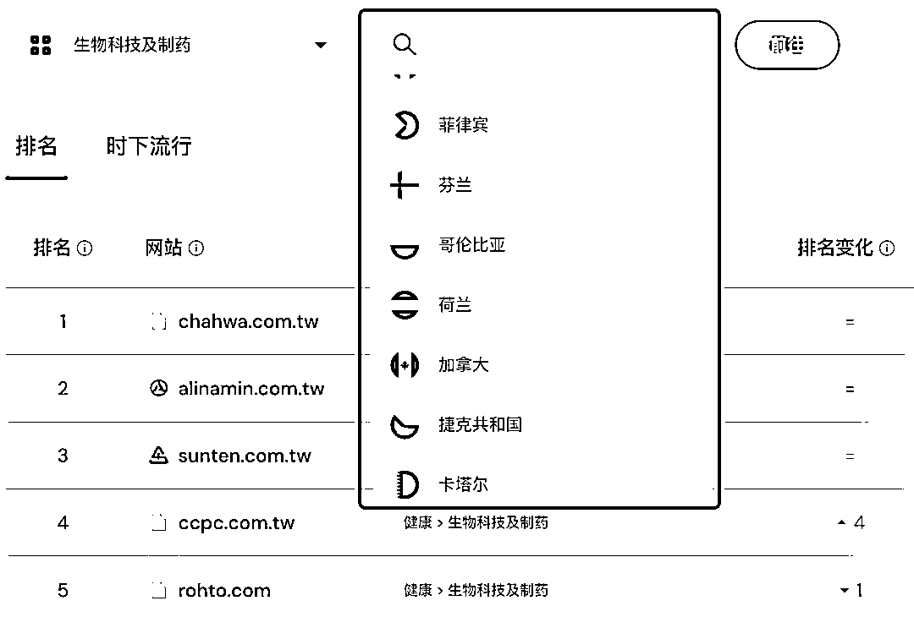
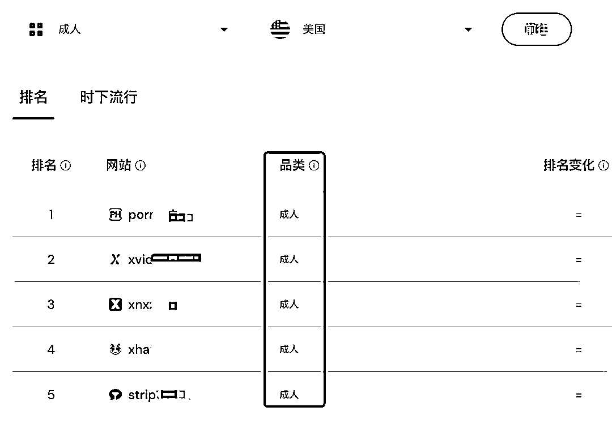
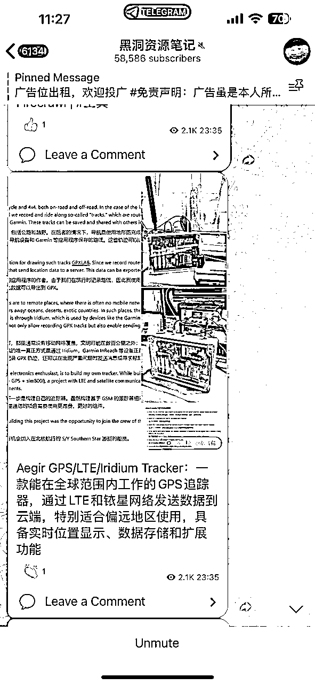
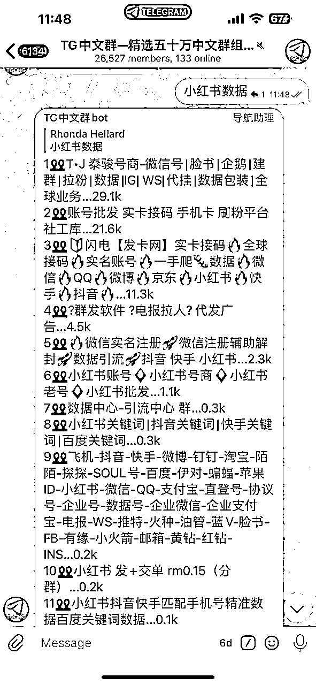

# 龙珠悬赏-挖掘全球网站流量排行榜

> 来源：[https://qnfoes1o78.feishu.cn/docx/JWdfdSjZmoVNT9xpu0Cc70N2nic](https://qnfoes1o78.feishu.cn/docx/JWdfdSjZmoVNT9xpu0Cc70N2nic)

作为一个资深信息检索爱好者，这个话题可谓是命中爱好了，

先问大家一个问题：全球网站流量排行最高的网站，都有哪些？

这是比较好玩的事情，通过这个问题能摸索出全球的流量分布情况。

# 一、我要分享的工具网站就是：Similarweb

## 1）打开谷歌，关闭安全搜索。

口令：https://www.google.com/#newwindow=1&q=abcde&safe=off

## 2）搜索Similarweb，第一行就是我们要的信息。

## 3）打开之后，直接是全球TOP10的网站列表

基本都是大家耳熟能详使用过的网站，

百度排行第六，还是挺厉害的。

第11-20的网站呢，

会发现里面混进来几个成人类目，P站、X站都有。

网飞、chatgpt也在其中。

一直往下拉，是可以TOP50的信息

完整列表是需要充值会员才能看了。

## 4）还有一个非常好玩的功能（免费版就能用）

固定品类、固定国家地区，

通俗点说，可以利用它，查询出某个国家的某个行业，当地哪个机构是地头蛇，

对于快速渗透当地某行业，是一个非常好的风向标参考办法。

种类非常多，截图给大家看下部分的品类。

举个例子，看一看

查询美国成人网站↓

俄罗斯电商市场↓

台湾的生物科技↓

每一种排列组合都能挖掘出，之前不曾接触到的网站，

非常好玩，有一种探险寻宝的新奇感。

闲暇无事，从这里找寻一些新鲜感，放松一下大脑。

# 二、X（原推特）很多搜索的语法

1、在搜索关键词后空格加上 “lang:zh” 可以只显示中文推文内容。

2、在关键字表达式后面加上 filter:links 就只返回带链接的推，这在搜资源的时候极为有用。

3、当一个词成为敏感词，在搜索引擎里被完全屏蔽时，可以给关键词加上双引号或者空一格加减号后面跟一堆乱码。比如搜索：["马斯克"] 或者 [马斯克 -jsdkskf]

YouTube 搜索技巧：

特定频道，关键字：royal wedding, channel；

搜索最新，关健字：oprah winfrey, this week；

原创视频，关键字：never say never, partner

时长电影，关键字：jackie chan, movie

精准匹配，关键字：allintitle:”google goes gaga”

混合匹配，关键字：ted talks, hd, this month

# 三、纸飞机中有专门寻找资源的群组，通过一两个关键词，挖掘出十几个高质量的群组，如下图

时间原因，写的比较仓促，就先分享到这里（先完成再完美）

如果大家对信息检索比较感兴趣，我后面再来分享一些其他搜索技巧，

不同平台+不同搜索技巧，可以解决不同的问题，或者说寻找到不同的资料。

是一门软技能！

虽不像硬技能那般受关注，但需要的时候，会极大提高办事效率。

虫部落；

超级搜索；

信息源：

1、x，找这些技术专家

2、纸飞机，找到各种资源群

3、quora，他们在用什么

4、