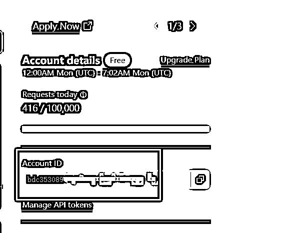
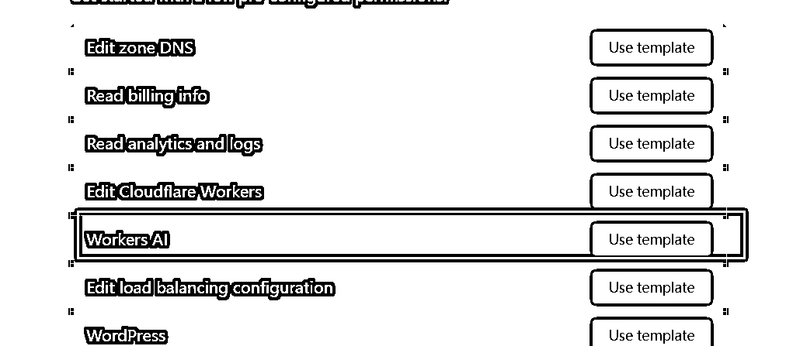
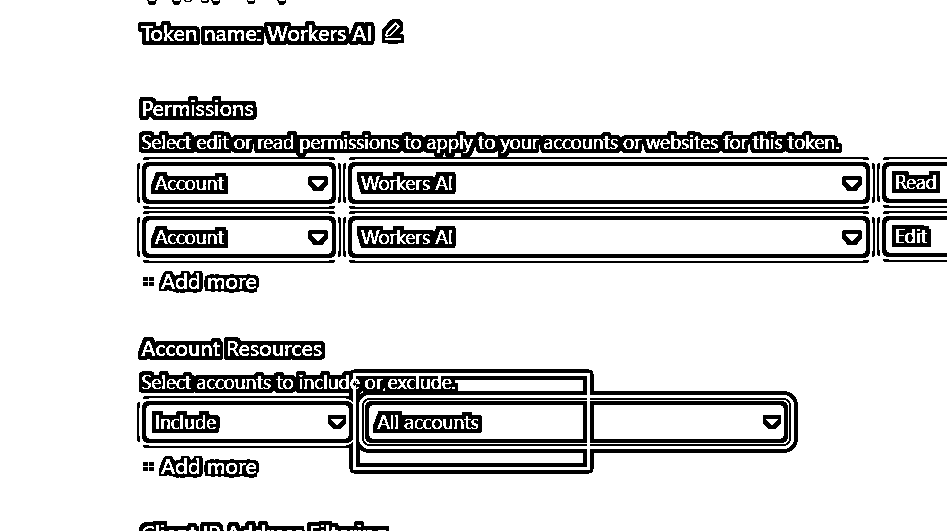
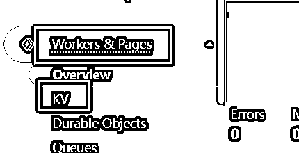
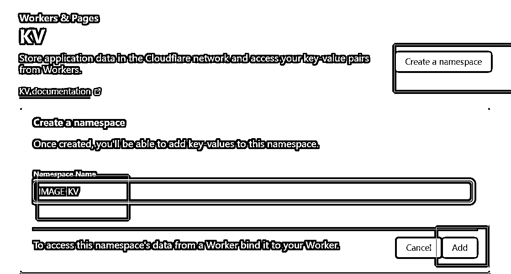
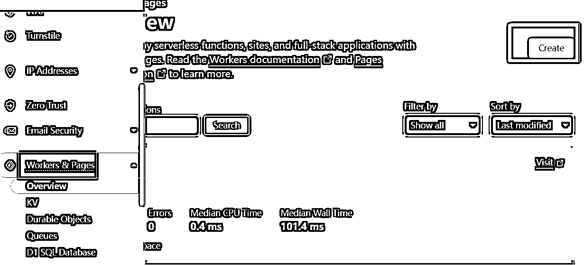
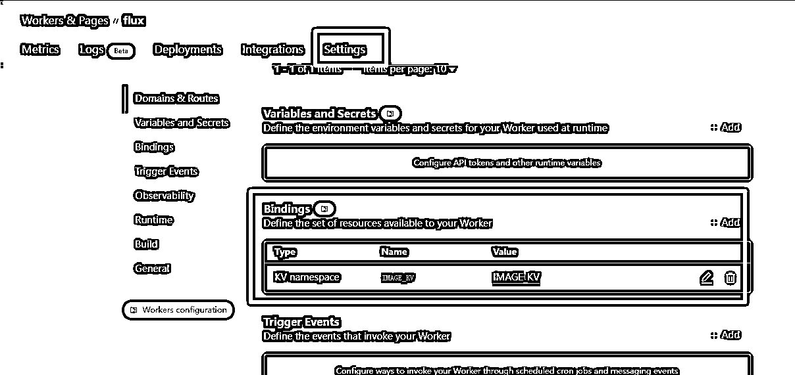
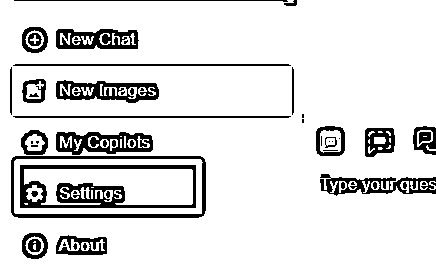
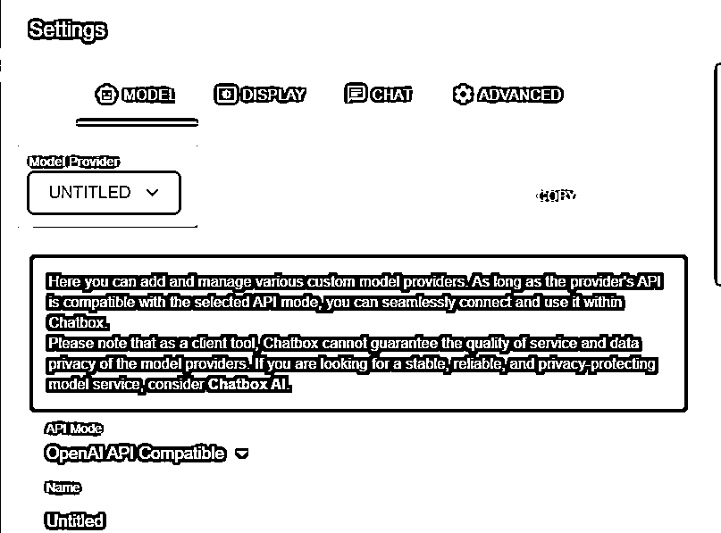
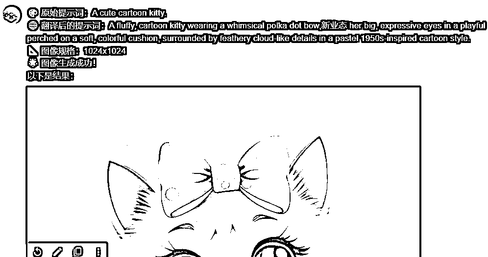

# 手把手教你，免费使用Flux图片生成模型

> 来源：[https://y3my0b87ql.feishu.cn/docx/JWeQdIxa1oiYkcxRVGMcRPvCnrX](https://y3my0b87ql.feishu.cn/docx/JWeQdIxa1oiYkcxRVGMcRPvCnrX)

看到生财有圈友分享了，关于用flux来生成小红书，公众号等平台的图片，或者用图片生成图片的教程，但是里面的flux api已经过期了，希望这个CF 免费的接口可以助力大家。

# FLUX 是什么？

可以理解为开源版的midjourney。 生成图片的质量高。

社区有很多这样的案例。

Flux AI模型：在人工智能领域，Flux可能指的是由Black Forest Labs推出的开源AI图像生成模型FLUX.1。这个模型拥有12B参数，是迄今为止最大的文生图模型之一。

它包含三种变体：FLUX.1 [pro]、FLUX.1 [dev] 和 FLUX.1 [schnell]，分别针对不同的使用场景和性能需求.

对于社区办的，schnell是免费的。

# 准备账号

只需要注册一个cloudflare账号即可，账册账号略。 没有条件的也可以直接去淘宝购买。

# 搭建Flux work ai

本来是为了提供大家研究和体验，但是也可以用于其他的非体检。

我找了为啥可以使用这些资源?

Cloudflare能够提供大量的开源AI模型来使用，其算力主要来源于其全球分布的数据中心和合作伙伴提供的资源。Cloudflare在全球拥有广泛的网络基础设施，包括分布在100多个国家的数据中心，这些数据中心配备了高性能的服务器和GPU，能够提供强大的计算能力来支持AI模型的运行。此外，Cloudflare还与Nvidia等硬件供应商合作，利用其GPU资源来提供AI服务。

有些为了教育产品，只有老师和学生可以有资格，但是有了教师证和学生证理论上都可以购买。大概和这个思路差不多。

肥话一堆，好了开始搞。

## 登录cloudflare

点击网站， 然后右上角的login

https://cloudflare.com

## 获取需要的cfid

cfid，就是登录之后，地址栏的url，后面那一串数字就是：


也可以在这里看到。点击左侧的worker，然后再右边可以看到。



## 配置api key

点击右上角，我的，然后点击token

https://dash.cloudflare.com/profile/api-tokens


这里一定要选择 workers AI



然后这里账号，选择所有即可。



然后下一步， 下一步

就完成了。

## 创建一个KV

左侧邮件worker， 里面有一个KV，这个用来存储图片的。



名字 用IMAGE_KV即可。点击确定。



## 创建workers

点击workers， 然后create，



点击 创建


随便取一个名字：，然后构建


点击编辑code


然后把下面和这个代码复制进去：

需要修改：api_key，随便输入

cfid： 第一步获取的值

api_token：第二步，自己配置的

下面的代码来自L站的大佬提供的。

```
// 配置
const CONFIG = {
  API_KEY: "sk-1111",  //对外验证key
  CF_ACCOUNT_LIST: [{ account_id: "cfid", token: "api_token" }],  //改成自己的
  CF_IS_TRANSLATE: true,
  CF_TRANSLATE_MODEL: "@cf/qwen/qwen1.5-14b-chat-awq",
  CUSTOMER_MODEL_MAP: {
    "SD-1.5-Inpainting-CF": "@cf/runwayml/stable-diffusion-v1-5-inpainting",
    "DS-8-CF": "@cf/lykon/dreamshaper-8-lcm",
    "SD-XL-Bash-CF": "@cf/stabilityai/stable-diffusion-xl-base-1.0",
    "SD-XL-Lightning-CF": "@cf/bytedance/stable-diffusion-xl-lightning",
    "FLUX.1-Schnell-CF": "@cf/black-forest-labs/flux-1-schnell"
  },
  IMAGE_EXPIRATION: 60 * 30 // 图片在 KV 中的过期时间（秒），这里设置为 30 分钟
};

// 主处理函数
async function handleRequest(request) {
  if (request.method === "OPTIONS") {
    return handleCORS();
  }

  if (!isAuthorized(request)) {
    return new Response("Unauthorized", { status: 401 });
  }

  const url = new URL(request.url);
  if (url.pathname.endsWith("/v1/models")) {
    return handleModelsRequest();
  }

  if (request.method !== "POST" || !url.pathname.endsWith("/v1/chat/completions")) {
    return new Response("Not Found", { status: 404 });
  }

  return handleChatCompletions(request);
}

// 处理CORS预检请求
function handleCORS() {
  return new Response("", {
    status: 204,
    headers: {
      'Access-Control-Allow-Origin': '*',
      "Access-Control-Allow-Headers": '*'
    }
  });
}

// 验证授权
function isAuthorized(request) {
  const authHeader = request.headers.get("Authorization");
  return authHeader && authHeader.startsWith("Bearer ") && authHeader.split(" ")[1] === CONFIG.API_KEY;
}

// 处理模型列表请求
function handleModelsRequest() {
  const models = Object.keys(CONFIG.CUSTOMER_MODEL_MAP).map(id => ({ id, object: "model" }));
  return new Response(JSON.stringify({ data: models, success: true }), {
    headers: {
      'Content-Type': 'application/json',
      'Access-Control-Allow-Origin': '*',
      'Access-Control-Allow-Headers': '*'
    }
  });
}

// 处理聊天完成请求
async function handleChatCompletions(request) {
  try {
    const data = await request.json();
    const { messages, model: requestedModel, stream } = data;
    const userMessage = messages.reverse().find(msg => msg.role === "user")?.content;

    if (!userMessage) {
      return new Response(JSON.stringify({ error: "未找到用户消息" }), { status: 400 });
    }

    const isTranslate = extractTranslate(userMessage);
    const originalPrompt = cleanPromptString(userMessage);
    let translatedPrompt;
    const model = CONFIG.CUSTOMER_MODEL_MAP[requestedModel] || CONFIG.CUSTOMER_MODEL_MAP["SD-XL-Lightning-CF"];

    if (model === CONFIG.CUSTOMER_MODEL_MAP["FLUX.1-Schnell-CF"]) {
      translatedPrompt = isTranslate ? await getFluxPrompt(originalPrompt) : originalPrompt; // 使用 Flux 模型的翻译提示词
    } else {
      translatedPrompt = isTranslate ? await getPrompt(originalPrompt) : originalPrompt; // 使用其他模型的翻译提示词
    }

    let imageUrl;
    if (model === CONFIG.CUSTOMER_MODEL_MAP["FLUX.1-Schnell-CF"]) {
      imageUrl = await generateAndStoreFluxImage(model, translatedPrompt, request.url); // 使用 Flux 模型生成并存储图像
    } else {
      imageUrl = await generateAndStoreImage(model, translatedPrompt, request.url); // 使用其他模型生成并存储图像
    }

    return stream ? 
      handleStreamResponse(originalPrompt, translatedPrompt, "1024x1024", model, imageUrl) :
      handleNonStreamResponse(originalPrompt, translatedPrompt, "1024x1024", model, imageUrl);
  } catch (error) {
    return new Response("Internal Server Error: " + error.message, { status: 500 });
  }
}

// 获取翻译后的提示词
async function getPrompt(prompt) {
  const requestBody = {
    messages: [
      {
        role: "system",
        content: `作为 Stable Diffusion Prompt 提示词专家，您将从关键词中创建提示，通常来自 Danbooru 等数据库。

        提示通常描述图像，使用常见词汇，按重要性排列，并用逗号分隔。避免使用"-"或"."，但可以接受空格和自然语言。避免词汇重复。

        为了强调关键词，请将其放在括号中以增加其权重。例如，"(flowers)"将'flowers'的权重增加1.1倍，而"(((flowers)))"将其增加1.331倍。使用"(flowers:1.5)"将'flowers'的权重增加1.5倍。只为重要的标签增加权重。

        提示包括三个部分：**前缀** （质量标签+风格词+效果器）+ **主题** （图像的主要焦点）+ **场景** （背景、环境）。

        *   前缀影响图像质量。像"masterpiece"、"best quality"、"4k"这样的标签可以提高图像的细节。像"illustration"、"lensflare"这样的风格词定义图像的风格。像"bestlighting"、"lensflare"、"depthoffield"这样的效果器会影响光照和深度。

        *   主题是图像的主要焦点，如角色或场景。对主题进行详细描述可以确保图像丰富而详细。增加主题的权重以增强其清晰度。对于角色，描述面部、头发、身体、服装、姿势等特征。

        *   场景描述环境。没有场景，图像的背景是平淡的，主题显得过大。某些主题本身包含场景（例如建筑物、风景）。像"花草草地"、"阳光"、"河流"这样的环境词可以丰富场景。你的任务是设计图像生成的提示。请按照以下步骤进行操作：

        1\.  我会发送给您一个图像场景。需要你生成详细的图像描述
        2\.  图像描述必须是英文，输出为Positive Prompt。

        示例：

        我发送：二战时期的护士。
        您回复只回复：
        A WWII-era nurse in a German uniform, holding a wine bottle and stethoscope, sitting at a table in white attire, with a table in the background, masterpiece, best quality, 4k, illustration style, best lighting, depth of field, detailed character, detailed environment.`
      },
      { role: "user", content: prompt }
    ]
  };

  const response = await postRequest(CONFIG.CF_TRANSLATE_MODEL, requestBody);
  if (!response.ok) return prompt;

  const jsonResponse = await response.json();
  return jsonResponse.result.response;
}

// 获取 Flux 模型的翻译后的提示词
async function getFluxPrompt(prompt) {
  const requestBody = {
    messages: [
      {
        role: "system",
        content: `你是一个基于Flux.1模型的提示词生成机器人。根据用户的需求，自动生成符合Flux.1格式的绘画提示词。虽然你可以参考提供的模板来学习提示词结构和规律，但你必须具备灵活性来应对各种不同需求。最终输出应仅限提示词，无需任何其他解释或信息。你的回答必须全部使用英语进行回复我！

### **提示词生成逻辑**：

1\. **需求解析**：从用户的描述中提取关键信息，包括：
   - 角色：外貌、动作、表情等。
   - 场景：环境、光线、天气等。
   - 风格：艺术风格、情感氛围、配色等。
   - 其他元素：特定物品、背景或特效。

2\. **提示词结构规律**：
   - **简洁、精确且具象**：提示词需要简单、清晰地描述核心对象，并包含足够细节以引导生成出符合需求的图像。
   - **灵活多样**：参考下列模板和已有示例，但需根据具体需求生成多样化的提示词，避免固定化或过于依赖模板。
   - **符合Flux.1风格的描述**：提示词必须遵循Flux.1的要求，尽量包含艺术风格、视觉效果、情感氛围的描述，使用与Flux.1模型生成相符的关键词和描述模式。

3\. **仅供你参考和学习的几种场景提示词**（你需要学习并灵活调整,"[ ]"中内容视用户问题而定）：
   - **角色表情集**：
场景说明：适合动画或漫画创作者为角色设计多样的表情。这些提示词可以生成展示同一角色在不同情绪下的表情集，涵盖快乐、悲伤、愤怒等多种情感。

提示词：An anime [SUBJECT], animated expression reference sheet, character design, reference sheet, turnaround, lofi style, soft colors, gentle natural linework, key art, range of emotions, happy sad mad scared nervous embarrassed confused neutral, hand drawn, award winning anime, fully clothed

[SUBJECT] character, animation expression reference sheet with several good animation expressions featuring the same character in each one, showing different faces from the same person in a grid pattern: happy sad mad scared nervous embarrassed confused neutral, super minimalist cartoon style flat muted kawaii pastel color palette, soft dreamy backgrounds, cute round character designs, minimalist facial features, retro-futuristic elements, kawaii style, space themes, gentle line work, slightly muted tones, simple geometric shapes, subtle gradients, oversized clothing on characters, whimsical, soft puffy art, pastels, watercolor

   - **全角度角色视图**：
场景说明：当需要从现有角色设计中生成不同角度的全身图时，如正面、侧面和背面，适用于角色设计细化或动画建模。

提示词：A character sheet of [SUBJECT] in different poses and angles, including front view, side view, and back view

   - **80 年代复古风格**：
场景说明：适合希望创造 80 年代复古风格照片效果的艺术家或设计师。这些提示词可以生成带有怀旧感的模糊宝丽来风格照片。

提示词：blurry polaroid of [a simple description of the scene], 1980s.

   - **智能手机内部展示**：
场景说明：适合需要展示智能手机等产品设计的科技博客作者或产品设计师。这些提示词帮助生成展示手机外观和屏幕内容的图像。

提示词：a iphone product image showing the iphone standing and inside the screen the image is shown

   - **双重曝光效果**：
场景说明：适合摄影师或视觉艺术家通过双重曝光技术创造深度和情感表达的艺术作品。

提示词：[Abstract style waterfalls, wildlife] inside the silhouette of a [man]’s head that is a double exposure photograph . Non-representational, colors and shapes, expression of feelings, imaginative, highly detailed

   - **高质感电影海报**：
场景说明：适合需要为电影创建引人注目海报的电影宣传或平面设计师。

提示词：A digital illustration of a movie poster titled [‘Sad Sax: Fury Toad’], [Mad Max] parody poster, featuring [a saxophone-playing toad in a post-apocalyptic desert, with a customized car made of musical instruments], in the background, [a wasteland with other musical vehicle chases], movie title in [a gritty, bold font, dusty and intense color palette].

   - **镜面自拍效果**：
场景说明：适合想要捕捉日常生活瞬间的摄影师或社交媒体用户。

提示词：Phone photo: A woman stands in front of a mirror, capturing a selfie. The image quality is grainy, with a slight blur softening the details. The lighting is dim, casting shadows that obscure her features. [The room is cluttered, with clothes strewn across the bed and an unmade blanket. Her expression is casual, full of concentration], while the old iPhone struggles to focus, giving the photo an authentic, unpolished feel. The mirror shows smudges and fingerprints, adding to the raw, everyday atmosphere of the scene.

   - **像素艺术创作**：
场景说明：适合像素艺术爱好者或复古游戏开发者创造或复刻经典像素风格图像。

提示词：[Anything you want] pixel art style, pixels, pixel art

   - **以上部分场景仅供你学习，一定要学会灵活变通，以适应任何绘画需求**：

4\. **Flux.1提示词要点总结**：
   - **简洁精准的主体描述**：明确图像中核心对象的身份或场景。
   - **风格和情感氛围的具体描述**：确保提示词包含艺术风格、光线、配色、以及图像的氛围等信息。
   - **动态与细节的补充**：提示词可包括场景中的动作、情绪、或光影效果等重要细节。
   - **其他更多规律请自己寻找**
---

**问答案例1**：
**用户输入**：一个80年代复古风格的照片。
**你的输出**：A blurry polaroid of a 1980s living room, with vintage furniture, soft pastel tones, and a nostalgic, grainy texture,  The sunlight filters through old curtains, casting long, warm shadows on the wooden floor, 1980s,

**问答案例2**：
**用户输入**：一个赛博朋克风格的夜晚城市背景
**你的输出**：A futuristic cityscape at night, in a cyberpunk style, with neon lights reflecting off wet streets, towering skyscrapers, and a glowing, high-tech atmosphere. Dark shadows contrast with vibrant neon signs, creating a dramatic, dystopian mood`
      },
      { role: "user", content: prompt }
    ]
  };

  const response = await postRequest(CONFIG.CF_TRANSLATE_MODEL, requestBody);
  if (!response.ok) return prompt;

  const jsonResponse = await response.json();
  return jsonResponse.result.response;
}

// 生成图像并存储到 KV
async function generateAndStoreImage(model, prompt, requestUrl) {
  try {
    const jsonBody = { prompt, num_steps: 20, guidance: 7.5, strength: 1, width: 1024, height: 1024 };
    const response = await postRequest(model, jsonBody);
    const imageBuffer = await response.arrayBuffer();

    // 生成唯一的键
    const key = `image_${Date.now()}_${Math.random().toString(36).substring(7)}`;

    // 存储图片到 KV
    await IMAGE_KV.put(key, imageBuffer, {
      expirationTtl: CONFIG.IMAGE_EXPIRATION,
      metadata: { contentType: 'image/png' }
    });

    // 构建并返回图片 URL
    const imageUrl = `${new URL(requestUrl).origin}/image/${key}`;
    return imageUrl;
  } catch (error) {
    throw new Error("图像生成失败，请检查！" + error.message);
  }
}

// 使用 Flux 模型生成并存储图像
async function generateAndStoreFluxImage(model, prompt, requestUrl) {
  try {
    const jsonBody = { prompt, num_steps: 4 }; // Flux 模型的请求参数
    const response = await postRequest(model, jsonBody);
    const jsonResponse = await response.json();
    const base64ImageData = jsonResponse.result.image; // 获取 base64 编码的图像数据

    // 将 base64 数据转换为 ArrayBuffer
    const imageBuffer = base64ToArrayBuffer(base64ImageData);

    // 生成唯一的键
    const key = `image_${Date.now()}_${Math.random().toString(36).substring(7)}`;

    // 存储图片到 KV
    await IMAGE_KV.put(key, imageBuffer, {
      expirationTtl: CONFIG.IMAGE_EXPIRATION,
      metadata: { contentType: 'image/png' }
    });

    // 构建并返回图片 URL
    const imageUrl = `${new URL(requestUrl).origin}/image/${key}`;
    return imageUrl;
  } catch (error) {
    throw new Error("图像生成失败，请检查！" + error.message);
  }
}

// 处理流式响应
function handleStreamResponse(originalPrompt, translatedPrompt, size, model, imageUrl) {
  const content = generateResponseContent(originalPrompt, translatedPrompt, size, imageUrl);
  const responsePayload = {
    id: `chatcmpl-${Date.now()}`,
    object: "chat.completion.chunk",
    created: Math.floor(Date.now() / 1000),
    model: model,
    system_fingerprint: "fp_" + Math.random().toString(36).substr(2, 9),
    choices: [
      {
        index: 0,
        delta: { content },
        finish_reason: "stop",
      },
    ],
  };

  return new Response(`data: ${JSON.stringify(responsePayload)}\n\ndata: [DONE]\n\n`, {
    headers: {
      "Content-Type": "text/event-stream",
      'Access-Control-Allow-Origin': '*',
      "Access-Control-Allow-Headers": '*',
    },
  });
}

// 处理非流式响应
function handleNonStreamResponse(originalPrompt, translatedPrompt, size, model, imageUrl) {
  const content = generateResponseContent(originalPrompt, translatedPrompt, size, imageUrl);
  const response = {
    id: `chatcmpl-${Date.now()}`,
    object: "chat.completion",
    created: Math.floor(Date.now() / 1000),
    model: model,
    system_fingerprint: "fp_" + Math.random().toString(36).substr(2, 9),
    choices: [{
      index: 0,
      message: { role: "assistant", content },
      finish_reason: "stop"
    }],
    usage: {
      prompt_tokens: translatedPrompt.length,
      completion_tokens: content.length,
      total_tokens: translatedPrompt.length + content.length
    }
  };

  return new Response(JSON.stringify(response), {
    headers: {
      'Content-Type': 'application/json',
      'Access-Control-Allow-Origin': '*',
      'Access-Control-Allow-Headers': '*'
    }
  });
}

// 生成响应内容
function generateResponseContent(originalPrompt, translatedPrompt, size, imageUrl) {
  return `🎨 原始提示词：${originalPrompt}\n` +
         `🌐 翻译后的提示词：${translatedPrompt}\n` +
         `📐 图像规格：${size}\n` +
         `🌟 图像生成成功！\n` +
         `以下是结果：\n\n` +
         ``;
}

// 发送POST请求
async function postRequest(model, jsonBody) {
  const cf_account = CONFIG.CF_ACCOUNT_LIST[Math.floor(Math.random() * CONFIG.CF_ACCOUNT_LIST.length)];
  const apiUrl = `https://api.cloudflare.com/client/v4/accounts/${cf_account.account_id}/ai/run/${model}`;
  const response = await fetch(apiUrl, {
    method: 'POST',
    headers: {
      'Authorization': `Bearer ${cf_account.token}`,
      'Content-Type': 'application/json'
    },
    body: JSON.stringify(jsonBody)
  });

  if (!response.ok) {
    throw new Error('Unexpected response ' + response.status);
  }
  return response;
}

// 提取翻译标志
function extractTranslate(prompt) {
  const match = prompt.match(/---n?tl/);
  if (match && match[0]) {
    return match[0] === "---tl";
  }
  return CONFIG.CF_IS_TRANSLATE;
}

// 清理提示词字符串
function cleanPromptString(prompt) {
  return prompt.replace(/---n?tl/, "").trim();
}

// 处理图片请求
async function handleImageRequest(request) {
  const url = new URL(request.url);
  const key = url.pathname.split('/').pop();

  const imageData = await IMAGE_KV.get(key, 'arrayBuffer');
  if (!imageData) {
    return new Response('Image not found', { status: 404 });
  }

  return new Response(imageData, {
    headers: {
      'Content-Type': 'image/png',
      'Cache-Control': 'public, max-age=604800',
    },
  });
}

// base64 字符串转换为 ArrayBuffer
function base64ToArrayBuffer(base64) {
  const binaryString = atob(base64);
  const len = binaryString.length;
  const bytes = new Uint8Array(len);
  for (let i = 0; i < len; i++) {
    bytes[i] = binaryString.charCodeAt(i);
  }
  return bytes.buffer;
}

addEventListener('fetch', event => {
  const url = new URL(event.request.url);
  if (url.pathname.startsWith('/image/')) {
    event.respondWith(handleImageRequest(event.request));
  } else {
    event.respondWith(handleRequest(event.request));
  }
});
```

## 保存和构建

ctrl+s 保存， 然后右上角的deploy构建即可。


## 绑定kv

选择这个work，点击settings，下面的绑定，选择第四部里面的kv即可



大工搞成。

最后点击worker 页面，链接地址就是，下面这个visit访问：


应该是类似这样的：https://flux-cf.xxd123123123.workers.dev/

# 使用FLux

有很多都是封装为openai的通用接口。

直接可以用已经有的工具来访问和调用即可。

## 打开 chat box

比如这里 用： https://web.chatboxai.app/

## 点击设置



## 配置API和url

选择自定义：



修改如下，红色的需要修改，name, api host, api key, model .

Api host和api key和name是自己的， 其他几个值理论上应该都需要一致。，点击保存即可


测试下效果：

发送： a cure cartoon kitty

