# 做亲子研学旅游，高客单玩法的干货拆解！

> 来源：[https://qahsph8ma5.feishu.cn/docx/Jz69dYNmpocNQkxmkjCcjSrrnDg](https://qahsph8ma5.feishu.cn/docx/Jz69dYNmpocNQkxmkjCcjSrrnDg)

圈友们好，我是潘浩，目前在职一家广告公司担任客户数字总监。同时也有自己广告公司～

目前也在探索一些平台流量玩法以及会帮助品牌做一些抖音红书培训课程等服务。

最近暑假期间跑通了亲子研学赛道，一个半月变现84W..

感兴趣希望你能耐心看完，希望以下内容能给你现阶段带来一些帮助。

一共会分为三个部分：

【第一部分】是关于我，我的经历，价值观以及思考方式，如果想了解直接案例解析，可以直接跳转第二趴干货拆解项，如果对于我人感兴趣，欢迎占用你几分钟。毕竟是我的第一次发帖。

【第二部分】项目的核心拆解与思考的底层逻辑

【第三部分】感悟与重点

## 一、自我介绍

在分享案例之前，我希望能快速让大家了解我，一直在思考如果要去快速了解一个人，

应该是从家庭学历文凭工作经历家境文化等方面去建立认识，

我反而觉得更快找到正确或者合适的朋友，是直接展示你的价值观。

展示你对某些普世话题的理解 包括社交 包括财富 包括生活 包含爱…

价值观趋同的人才是最终能走到最后，成为真诚的伙伴的人。

一、社交观

之前我一直是一个以目的导向作为社交驱动的人，以前不做泛社交的原因觉得目的性太弱，意义感不强。

但是还是会有隐藏的优势，我会称之为“社交福袋”，有些机会都是在意料之外的人身上获得的。

社交的意料之外 情理之中 无目的反而带来意料之外的收获，

想到那句话，你赚不到认知意外的钱，同样，太过于目的导向社交，也社交不到你认知以外的人，

留点意外给生活，或许有惊喜。

二、财富观

1.如何理解赚钱

对我而言，我一直认为赚钱或者积累财富对我而言 其实就是做一道题，

对有些人而言是必选题，出身贫寒对于钱的缺失很大影响生活的那部分人...

对有些人而言是选做题，上一辈的财富积累的先天优势，家境优渥的人群...

有些人没有意识到要做这道题，做艺术，摄影，文化等手艺人，他们在热爱的事物中创作了价值而带来一定的物质基础，所以对于财富的执念并没有很强烈，他们活在生活的体验里

所以它只是一道题，和生活幸福本无很大关系。所以不要以财富论人生

2\. 赚钱的选择问题

世界上有很多种赚钱的方式，如果没有意识到这点，你会在很多决策中产生觉得，有很多的钱会在你违背，而是否选择要赚钱而违背出行，这就是你如何绘画自己人生体验的方式了，笔在自己手上，选择你最舒适的 或者说装，或者说财富对于你而言在生命中的分量占据多少，也就确定了你是一种什么样的人。

3.财富是附属品

钱是附属品，流通在价值对等的过程中，当产生了价值，自然会，所以核心记住创造价值就会带来财富的。

4.赚钱与生活

之前思考一件事，当你很有钱的时候，你会做什么，你可能会发现你想要做的和当下的是完全一样的。

三、关于生财有术

一开始听到这个社群的名字：生财有术，名字似乎会有种适得其反的效果（因为觉得一个社群不会瞑目张嘴说自己能赚钱，反而有种割韭菜之嫌）但是当我看到以赚钱这种方式来吸引到，我大概就能感受到这个社群的价值观和氛围，

一个社群的 DNA 一定和创始人有着息息相关，利他 空杯不当当是生财的社群价值观，亦是生活的价值观，价值观驱同的人终究会走在一起，希望生财会成为赚钱人的乌托邦。而且一定会越来越好。

四、思考方式

我一直给做平台需要有三种思维，「用户思维+拆解思维+流量思维」

用户思维：顾名思义是在用户视角来思考问题，你的人群画像是什么（who），在什么年龄端，什么性别，他们的性格特点是什么？你的产品是什么？解决了用户什么需求？这群人在做决策的时候会考虑到哪些因素？价格？服务？情绪？等等，可以套用 WYH 的认知模型去思考这件事。

拆解思维：对于一个整体性的事情拆解细分，例如红书笔记我会拆解为笔记的六要素：【选题>标题>封面>内文>话题>评论】，因为它的底层逻辑按照 CES 的权重分来计算，所以很容易知道一篇好的笔记应该怎么去创作

项目拆解：例如目前的这个项目的商业模式： 后端产品选择-内容选题获客-笔记付费投放-私信客资转化-私域销售转化等核心四个步骤，在按照每个步骤去拆分重点内容。

流量思维：这个很多人会忽略，平台是具备差异性的，不同平台的流量也是具备差异性的，小红书是女性的百度，主要群体是女性居多，所以到底是做大流量里的差异性产品，还是做小流量里的小而美产品，这是选项目的选择问题。

就包括例如你想选择一个目的地旅游，你可以通过聚光来去看搜索指数来让用户告诉你哪里最受欢迎。

切记不要自己产生新的创意想法和产生（这种就是自嗨），要去平台验证是否有需求有流量，没有流量就说明没有需求，没有需求就不会产生价值和收益，你大可以说你可以尝试教育消费者，但是这个通常是大品牌才会去做的事情，让愚蠢庸俗的人类改变想法或者改变习惯很难，尽可能去迎合他们，是更快产生价值的方式。

## 二、案例解析与细节拆解

### 2.1 项目概况和成果

#### 成果

先说下成果，我比较喜欢文字信息浓度更高的方式表达，这样更高效，更容易与消费者达成共识。毕竟沟通是为了更快达成共识。

项目：高可单旅游亲子研学赛道

模式：小红书高可单获客（前端流量操盘手角色）

玩法：聚光付费流

合作形式：CPS 合作分佣

周期：一个半月

成果：GMV：80W

先贴几个截图吧，没贴很多，就大概知道意思就可以，以下是一些成单截图（执行群）

然后这是我们的销售人员记录表，因为有些客户今年不来下次还是会来，所以他们会可能成为潜在客户，所以那些客户就需要做好私域营销的部分（微信内的），所以要做客户分级管理，它是一个持续触达用户和反复种草并成交的过程。

以下是当时的销售额，会按照不同颜色标注状态，并针对客户群做分层管理（这个就涉及到微信内的用户管理里）..

#### 2\. 概况

高可单旅游亲子研学赛道：专门针对亲子也就是带着孩子的家庭的研学性质的旅游体验。

例如，我们就是 XX 目的地六天五晚的亲子营的旅游产品，这里面包含酒店+司机+所有活动体验（例如当地少数名族上文化课/手工课/骑马射箭等等）（PS：大交通都是不包含的），差不多客单价在（一大一小差不多在 1.6W，人均在 7-8K），然后以此类推，两大两小差不多在 2.7-2.8W 左右，有的家庭甚至出行旅游的会是四大两小，带着父母老人以及小朋友，算下来客单价有高的在 5-6w 左右的。

关于研学旅游产品我大概解释下：

以前的旅游产品基本就是纯玩感受风景的，配车订酒店安排司机什么的，基本上完事了。

但是带有研学的性质的旅行产品的区别是【亲子体验+纯玩风景结合】的方式，孩子可以体会到当地人文风情，研学的点就是当地的活动体验包装成课程来安排，例如骑马喂养牛羊或者做当地的有名的手工以及以及当地美食还有当地少数民族教学文化课等等，让孩子和父母一起体会当地人文体验同时又可以感受当地特色风景，让孩子在旅游中学习，在旅途中边学边玩，增加家庭的互动关系。

所以现在基本带家庭的家长，都对于带有研学性质的旅行产品很感兴趣。

我们通过小红书开启蓝 V 账号的形式然后出优质的笔记内容来吸引精准客户，我配合聚光的投放工具平台来精准投放用户来获得精准的用户（投放的钱和笔记制作的钱都是我们自己出），然后通过私信引流精准客户到私域。

因为的合作形式是按照佣金 CPS 的形式，也可就是协助销售完成用户下单并飞往目的地参与旅游，结束行程之后，我们才算赚到了佣金比，合作佣金基本旅游类的在 10-18% 之间的返佣。

这里提一下，选择 CPS 的原因有几点：

第一点：和后端产品是共进退的，利润是来自于用户的，有利于长期合作。

第二点：这种是需要筛选优质后端产品的，品牌优势，产品优势以及销售转化能力等，需要有一定的选后端品的能力

第三点：这种形式比较好谈成合作，对于客户前期是不需要投入成本的，利润是来源于最终成交的销售额，这也是客户或者后端产品很喜欢的合作形式。

我们前期的笔记制作内容以及流量聚光投放的费用和精力都是我们自己出的，后端产品只需要提供营业执照和一些素材即可。（记住营业执照的问题，投放研学的相关内容，用旅行社的营业执照是没办法投放的哦）

这里要提醒一下，大家需要去考量对方的产品是不是有吸引力能不能做转化，如果不能做转化，我们投流的成本还有做笔记的成本（更多是时间成本）相当于是浪费了的而且还有亏本的可能。但是有些赛道的转化比还是很高的，客资按照 50 一个人的话（我们基本是在 30-60 之间波动），那你一单如果利润有一两千，那就是基本上你只要二三十人里有一个人成交至少是不亏损，相对还是可以尝试的哈。

我这边是每次按照 10W 的金额（游客确定完成了旅游后）提供一次返佣的形式，这个因人而异，看你们自己如何谈的。

说下投放数据情况：

我们差不多一个半月的时间，开口私信人数差不多在在获取在 700-900 之间，消耗了差不多 2.5W 左右，看了下私域微信号的用户数量 330 多个（我们自己也有具体用户记录表），公转私域差不多是在 30%多（这块我增加了人工私信回复所以快一些） ，成交是 40 单不到，成交率差不多在 12%，成交率其实不算是很高，但是佣金额还是个不错的数据，但是每单金额都是几万的～

### 2.2 项目细节拆解

#### 第一步：选择合适的赛道和后端产品

然后下面讲，为什么我选择到这个赛道，按照我的思考逻辑：

1\. 【客单价】：选择高客单还是低客单就决定了玩法的不同，以及对应的人群也会不同。

以小红书平台为例：高可单产品基本注定了无法在平台上直接销转（直播卖货），除非有很强的品牌认知或者 IP 背书等，而低客单的产品就决定了一定是靠走量爆量的形式才能形成有规模的收益。所以在一开始就确定了你是要做哪一类人的生意。

高可单》私域引流

你会通过看到一篇笔记或者一篇种草视频就直接在线上下单一个过万的陌生产品么？（而且不存在比价的消费动作），基本不会，所以决定了它的玩法一定就是通过到私域通过服务等方式进行二次信任才能完成转化。

另外今年免费流引私域很废号，成本高，所以用在低客单上的产品划不来哦。

低客单》站内销售转化

你会买一包两块的纸巾还会比价么？不会的，低客单决定了缩短了你决策成本，所以更合适做直播卖货，或者视频笔记挂车卖货。记住当你下次想在红书上卖东西的时候，就按照这个模式来。

2.【趋势性】：去做平台顺势而为的事情，这个就涉及到你是坚持长期主义还是短期主义的问题。

想做长期主义的钱是有可能有指数增长的意外惊喜，所以我一开始去做平台趋势性的事情，可以去看看关于平台的小红书白皮书趋势报告以及关注一些红书平台的公众号来提高对于平台趋势的意识

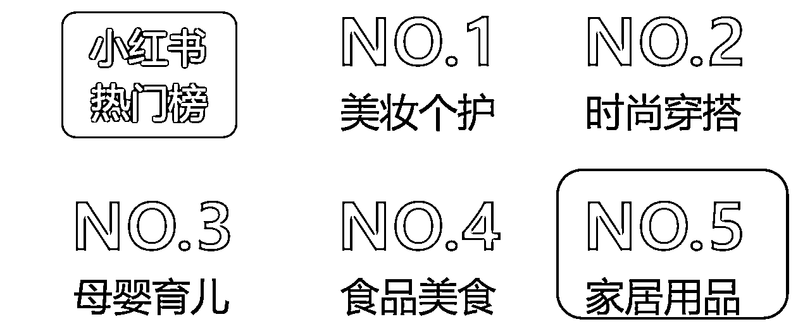

还有一种办法就是直接去搜索这个行业的关键词，或者用灰豚或者聚光都可以，看笔记的数量是否很多即可。例如家居，旅游摄影，美妆等。建议大家用聚光，这个是官方的，比较直接能看得出来搜索需求量哈。

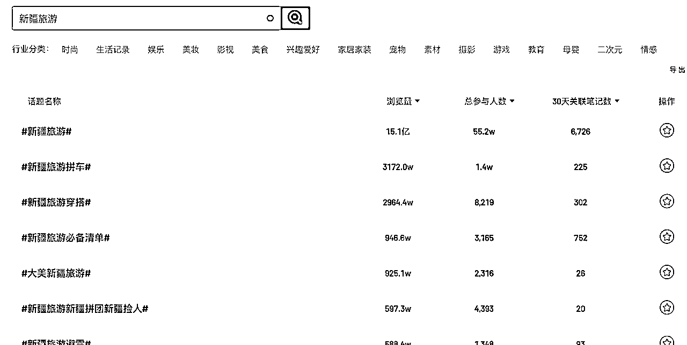

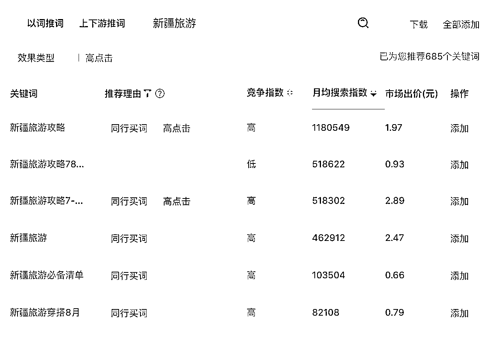

3.【熟悉程度】：选择自己熟悉的赛道或者行业，或者选择结构或者变量比较少的，这样你越熟悉越简单的赛道对于你而言成功几率越大。

4.【非标品】：极可能我会选择一些非标品因为太过于标品产品用户会关注价格，价格成为了用户决策权重第一个动机的话，那他会选择不同平台比价，如果你的价格没有优势，也很难做得到交付成交。

5.【品牌感与产品线垂直】： 我选择的的旅游赛道是专注一个目的地的深度游以及亲子研学营，同时具有品牌多年的品牌在的，他们在其他渠道会有销售渠道，同时还搭载自己微信私域小程序端口的支付平台，所以更容易解决用户下单最后一步的问题。

我有看到有用户做好多路线的，但是对我而言账号是需要有垂直性的，所以最好找的产品或者说品牌也不要太多，尽可能垂直一些会更好。例如我们是一个旅行社只有一个目的地这种形式。

高端研学旅游赛道恰恰满足了我以上的选品诉求，至于怎么找到的，这个是个机缘巧合朋友推荐的。然后当时就决定合作尝试一下。大家可以通过生财或者一些朋友推荐等方式来选择看有没有合适的。同时是具有一定风险性的，前期精力投入以及付费投流的成本都是需要自己承担的...

#### 第二步：账号与笔记选题

关于做账号和内容笔记几个重点：

1\. 关于做账号的几个要点，一卡一机，账号内容垂直性，笔记统一性，关于笔记的六要素（选题>封面>标题）这个细分的专题改天再写一篇文章希望能对圈友有帮助，今天就不赘述了！

2\. 做账号之前首先要确认两种主流玩法：粉丝变现是 IP 的玩法，低粉精准客户是后面的玩法。

所以我们的账号粉丝不重要！！！我们的目的是精准流量客户！让你们看下我们的账号后台

我们的想要的客户群体和我们预期客户群体是一致就说明是正确的👇

我们做亲子研学的客户我们目测应该是在 28 以上 女性为主，这样的就很方便后续你投放还是你的账号后台人群画像来验证是否正确，下面的这个人群画像就完全和我们预期是一致的【女性 妈妈 高净值 年龄层在 35-44 岁】

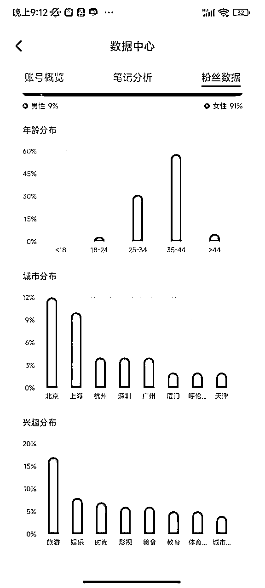

为什么要去理解这件事，本质你需要知道你的流量笔记流量从哪里来：

如果你作用一个消费者打开小红书能看见他是分三个板块的（发现页｜推荐页｜同城），所以平台是个什么样的模块就注定了是什么样的流量分配，以下是我做培训的时候的一页关于流量的分配：

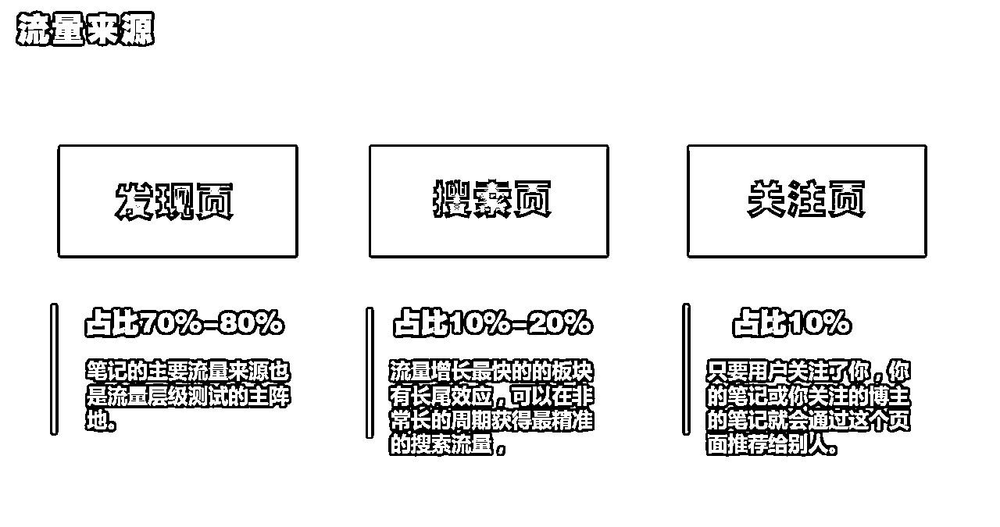

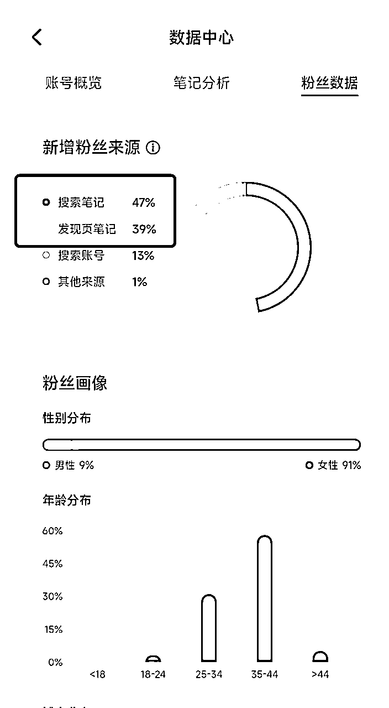

发现页的流量都是来源于新流量，不是粉丝流量，所以粉丝不是你的笔记流量的来源哦！记住了！！

所以记住选题才是核心，和粉丝没关系！！因为你的粉丝不会贡献你的流量！

起号的核心策略

接下来来分享下关于起号的核心策略-- 【起号初期做泛流量拉权重+ 账号中期做精准流量获客】

大家可以把笔记分为爆款泛选题和获客笔记选题两种类型。

爆款泛选题是为了做账号权重和拉新人群，而获客笔记选题是告诉别人你的产品是什么针对什么人群，针对什么通电去的选题。

举个例子，对于刚刚起的账号是需要做账号权重的，去做账号权重的过程我可以打个形象的比方：把小红书当作一个 AI，，所以你输出的所有内容都在告诉它，我在给你传递什么信息，你应该给我提供什么样的人，有点像是告诉平台，我是谁我需要什么人群的过程，认识是需要时间沉淀，信任也是需要时间建立的，所以你的核心是你只需要确定了你的核心人群，你做的选题大概率不会跑偏。

刚开始做的泛流量选题，什么是泛选题，例如亲子游｜暑假应该是去哪儿｜出门必备的旅游清单等选题来去获得大量的互动评论点赞转发以此拉高账号权重：

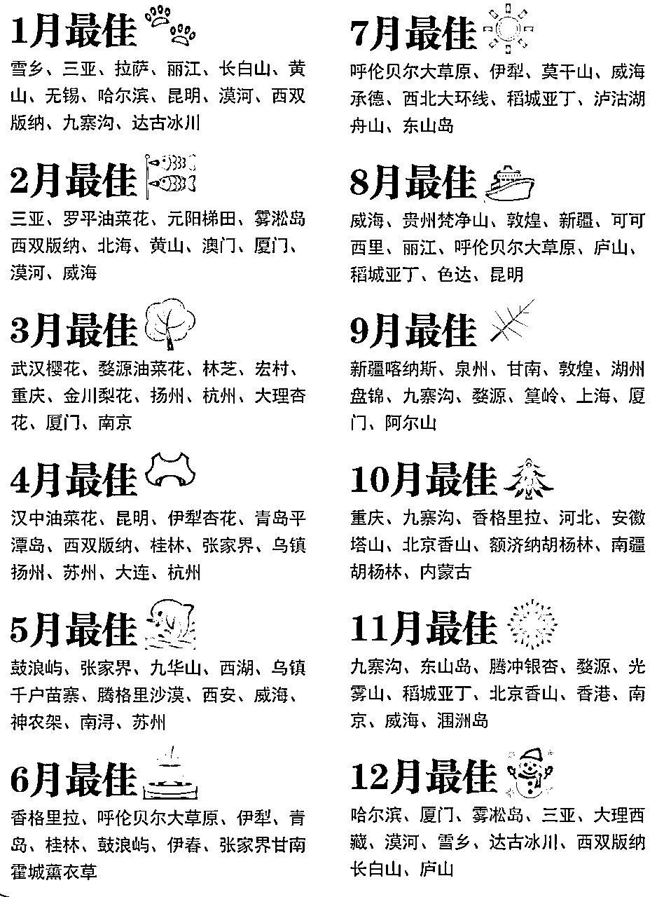

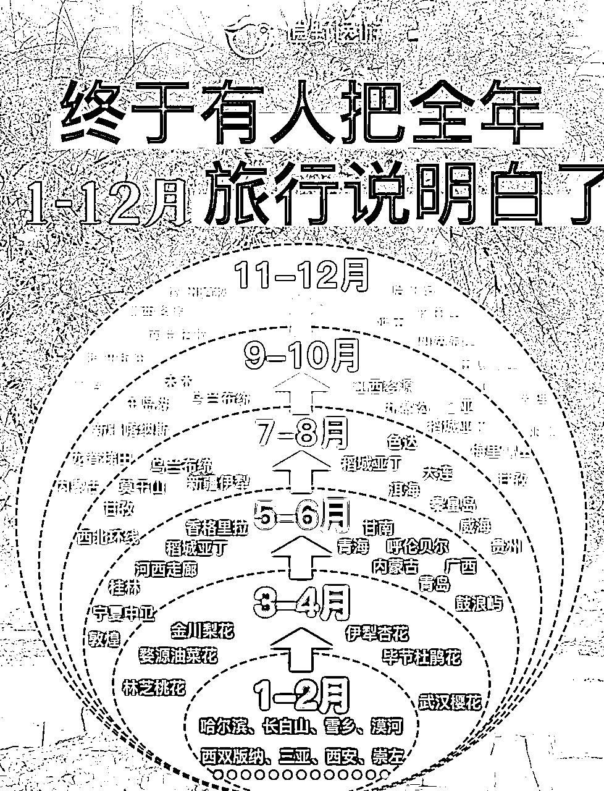

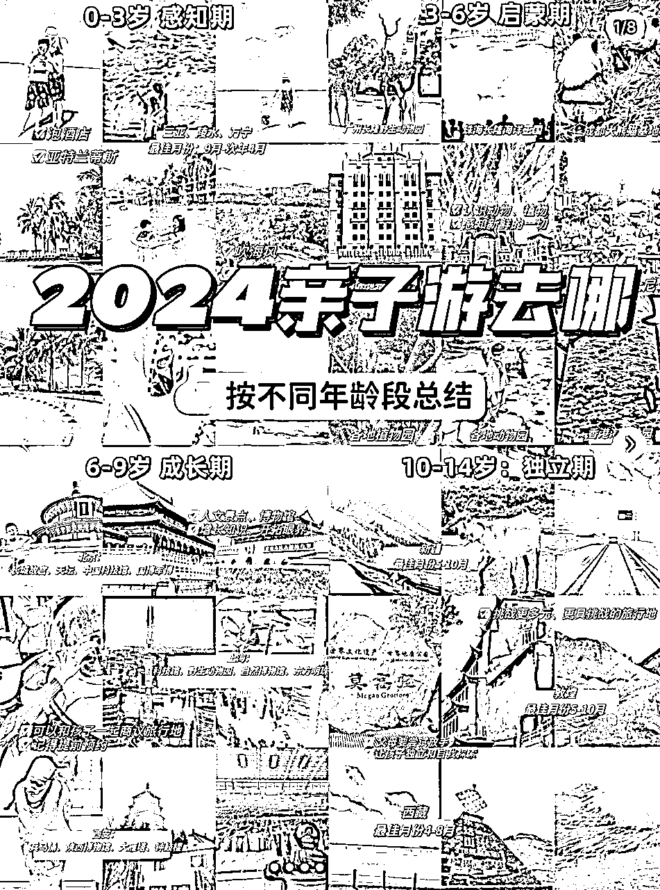

这是我之前一个起号的开始拍的数据的后台，差不多是这样的。这个不是具体跑的账号，但是意思是这个意思，主要是为了拉权重。

当自己基本上发布一周左右，就可以持续性做第二个方向的内容笔记，称之为精准流量获客笔记

这种笔记的特点是数据可能不会很高，也就称之为不太会是大的爆文（高可单旅游是，如果是很低价格的产品的话那就可能会是爆文），但是很精准，流量很精准，其实就够了。

而且你会发现一个现象：

爆文的特点是在当日或者隔天流量就明显提高，但是对于搜索来的流量，笔记的流量是当天可能很低，但是随着时间延长，流量会慢慢上来，这个就说明流量来源搜索流量，是精准流量，这就是获客笔记的意义。这种笔记的特点是评论区基本就会有很多询单，去参考这些就好，可以跟进自己的目的地开始做一些内容选题，例如下面这样：

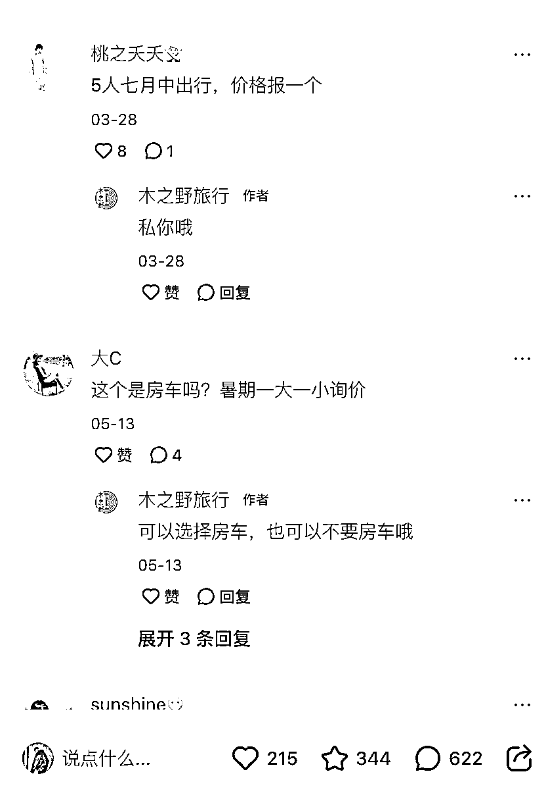

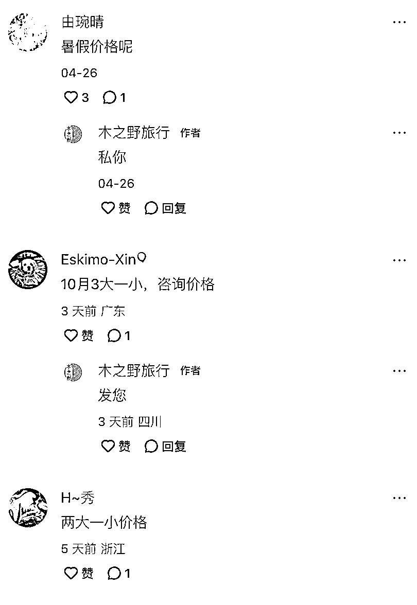

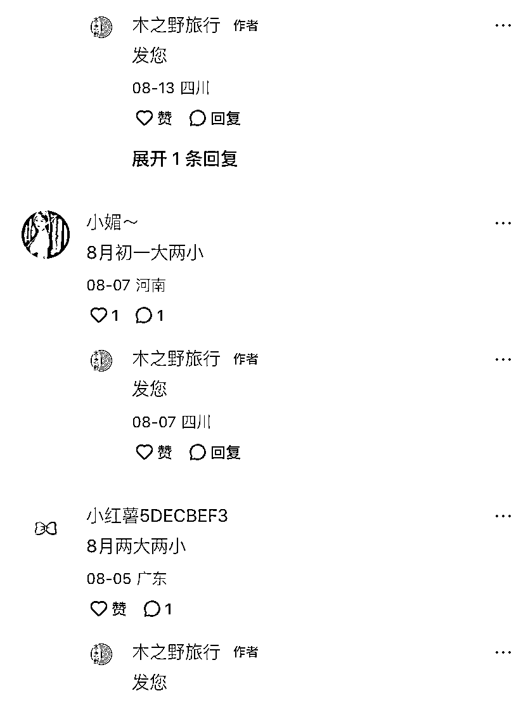

这类获客笔记大概是什么样的选题，可以参考下面的：

基本上是说清楚：你的产品是什么，有什么优势，然后我们是谁，这三个段落的形式来做文案的内容，其实就是一个产品推荐的笔记内容，懂得小伙伴应该可以领悟到的，付费笔记投放的就是这类的内容笔记。

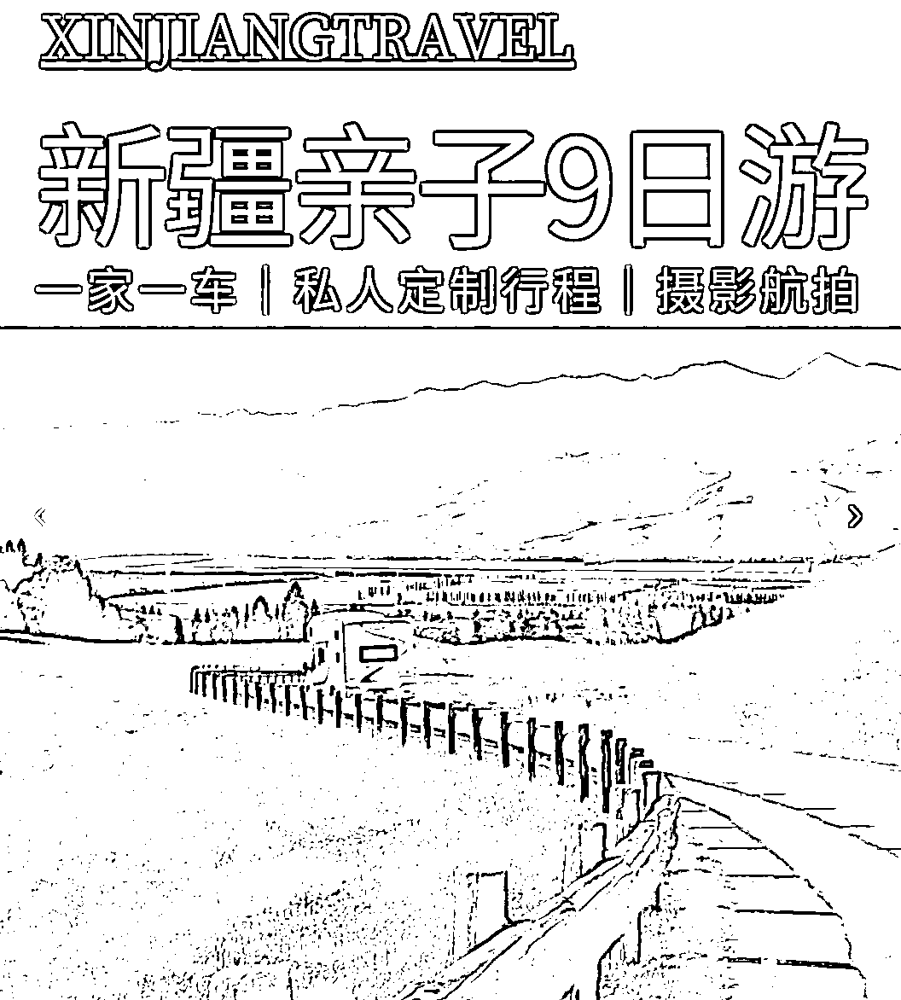

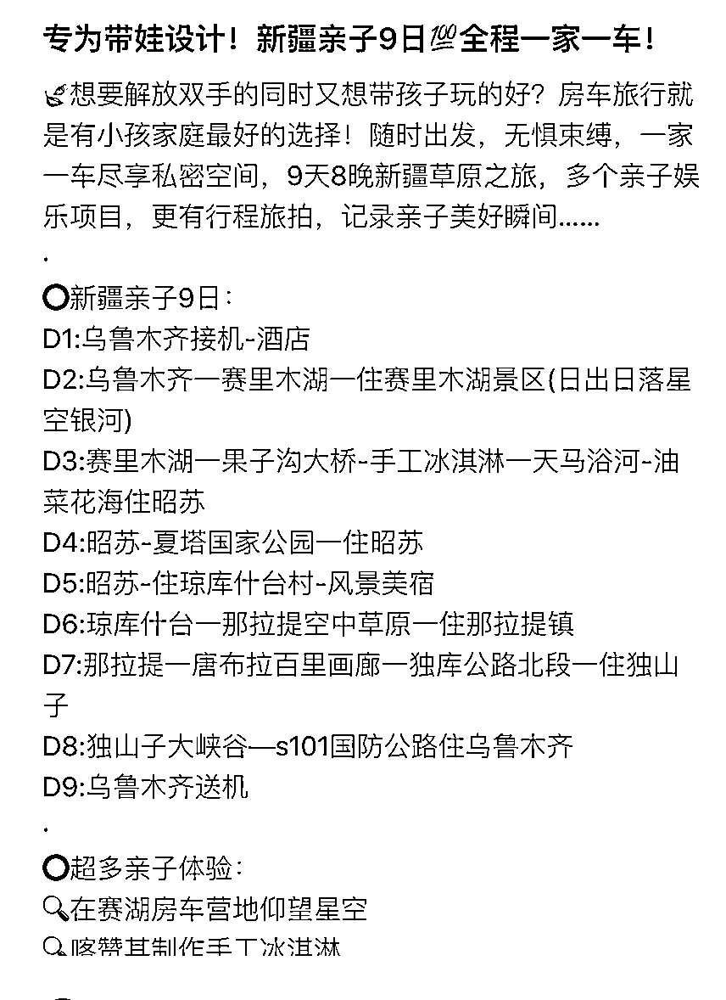

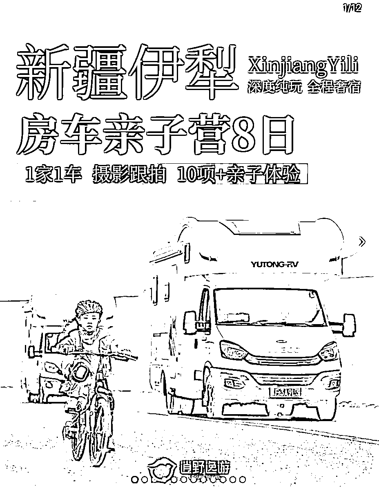

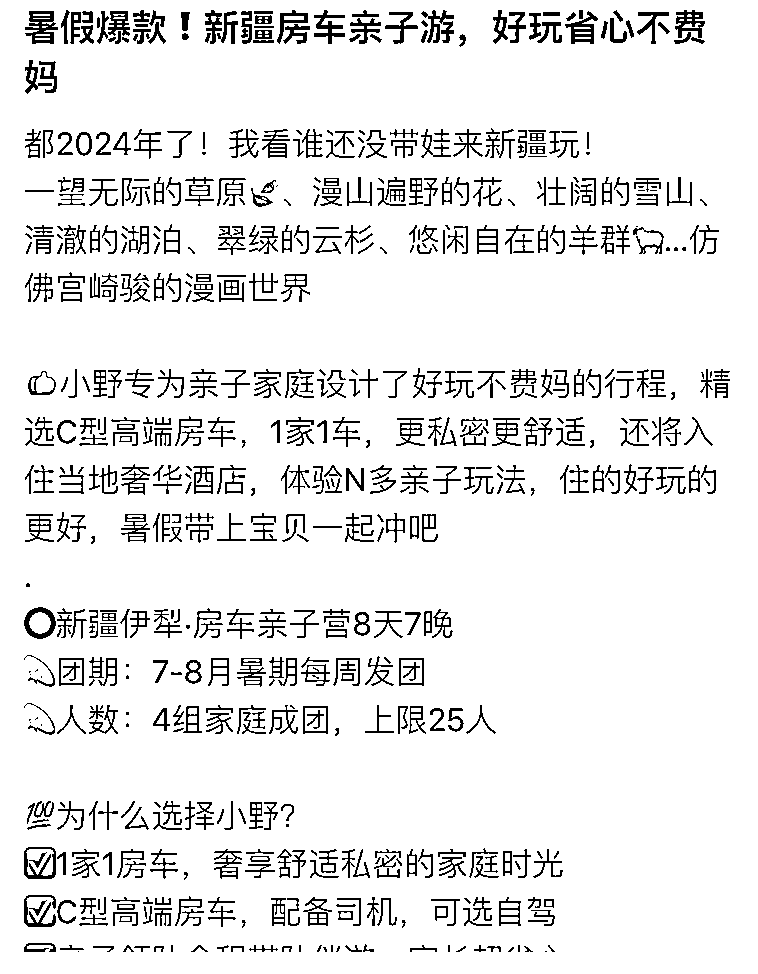

因为核心小红书是按照 CES 机制来算笔记的流量和权重，这个一般做小红书的小伙伴都会知道，不知道可以收藏下：

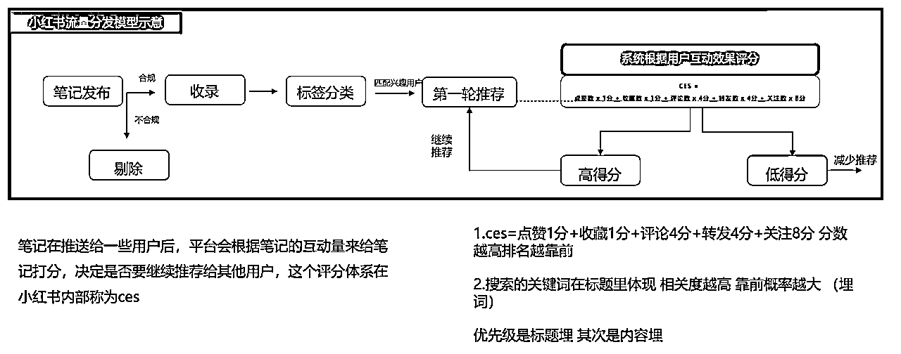

#### 第三步：私信销售转化

走付费流量还是走免费流量？

第一点：为什么不走免费流量引流玩法，是因为本身它是违背平台的事情，之后会越来越难，而且靠的废号，增加了用户的引流链路，会很影响引流到微信上的效率。

第二点：很废号，初期创业时候，这种废话带来的负面反馈会直接影响到大家执行的信心，让环节简单化才是项目成功的原因。

第三点：24 年基本都是付费流玩法居多，而且是顺势平台的事情，能减少很多琐碎的事情。

小红书聚光日消耗 100 就可以开通私信通，会在专业号里直接显示例如下面这样，可以在私信服务组件里编辑自己的回复语。

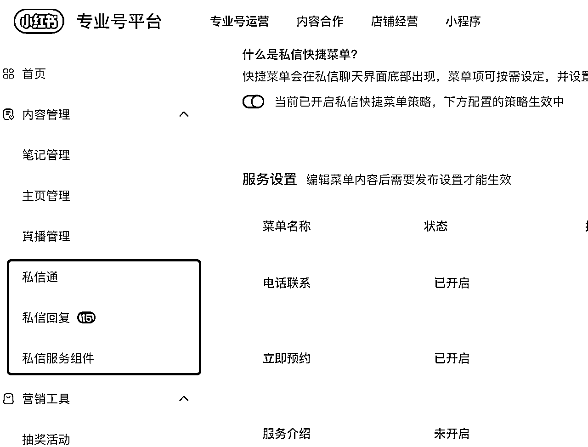

这里说一个要点：私信通的欢迎语只能回复 100 个字，欢迎语很重要，是否可以让用户感兴趣同时回复你或者直接加你微信这个是需要自己思考的，我们针对不同用户沟通的要点略微不同。

例如：网红亲子酒店的笔记选题进来的用户，我们希望的是网红酒店 XXX 之类作用一级沟通点，

而如果是关注研学体验活动的，我们会沟通 20+研学体验 XXX 作为一级沟通点，

目前我们还是人工回复。尽可能提高公转私的效率。

还有个隐藏操作-因为私信通只能解决评论的用户，但是忽略了点赞以及关注等用户，所以此时需要手动的去关注你的行为用户，让平台记住你想要什么样的人群，因为此时来的都是你的精准客户。这个估计很少人会说道。

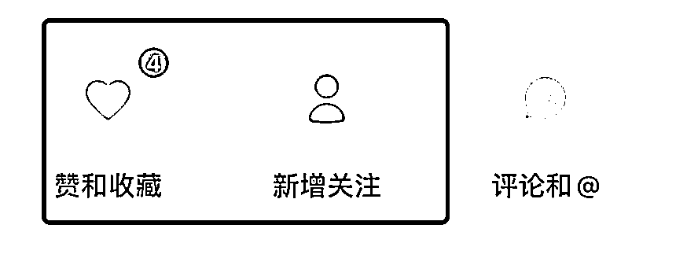

#### 第四步：聚光获客投放

大家直接申请企业蓝 V 就可以，需要对方提供营业执照，或者自己去弄，企业号认证 600 一次即可。

然后直接就可以开通聚光平台了，一个营业执照可以绑定 2 个企业蓝 V，我这边是同时跑了 2 个号。为了解决有小伙伴有些跑不好和本身开的户也有关系，所以我直接用 2 个号，减少账号的变量因素。

投放直接去投获客笔记内容，因为我们的目的是为了客资。

投放遇到的 2 个主流问题：

1.  内容素材过于重复

所以最好后端产品可以持续提供新的素材最好，或者你有很强的二次剪辑能力把图片能过审就可以。

1.  一般旅行社的营业执照都只能从事常规旅游业务

所以针对研学的一些笔记投放之后会出现没有资质的情况，这个时候只有修改自己的笔记的内容，去优化你的关键词，类似把研学改成游学，或者活动体验等等，但是意思不变的，看能不能过审核。

先看下目前投放的情况吧，日消耗差不多在 300 左右，目前消耗在 1.3w 左右，（我这边返点还不错，在 14 左右，需要可以联系我），客资成本在 20-50 左右，整体成本和利润比起来还是很可观的。

其实投放聚光合适是笔记，只要你笔记是 90 分的笔记，你投放能力只有 60 分，一样可以获得不错的结果。

所以我们更多是在笔记内容上去下了一些功夫，关于聚光的部分我就不细致赘述了，感兴趣可以加我了解。

投放的几个重点（以下不适配任何人哦，只是给了一种方式，可以参考）：

1\. 直接开全站智投（机器比小白更聪明，让平台先去跑一段时间），看看客资情况

2\. 核心筛选你的人群（年龄/地域），这个你们可以自己测哪种合适再验证

3\. 出价按照提示的出价上涨 20%即可，

4\. 核心的核心是内容笔记，笔记做得好，投放更轻松

5\. 有个大的投放策略，这个是后期长期运营的，就是：泛选题做深度转化目标，精准内容做浅层行为目标

#### 第五步：私域沟通成交

用户加到微信后，基本上会做两部分：

1\. 帮后端承接人员做初步筛选，有意向或者比较合适的用户就可以进行拉群让细致的销售人员来做销售转化即可。

一般发了很多信息的要么客户需要时间了解路线和行程，所以耐心等待下，客户如果有需求还是会主动找你的，不用一直频繁发信息，反而对于用户沟通体验会适得其反。这里我就不一一截图了。

2\. 拉群让销售人员去进行销售转化就好了，我们只需要定时看下群的进度信息实时跟单和或者提醒销售人员跟单即可。

用户加微信后需要 SOP 化两部分，把所有 sop 的一些话术直接放在收藏里面，这样会比较好发布，当有好多客资加你的时候。

第一部分是用户的沟通话术

可以尝试把 基本上第一句我是谁，我有什么优势去解决信任问题。

然后就是询问对方咨询，通常是几大几小，然后预计什么时间来，不要被客户的问题框住的让客户跟着你的问题走就好，然后就是把你所有 SOP 的话术，放在你的收藏里，这样当客资多了，这样发起来效率会很高。

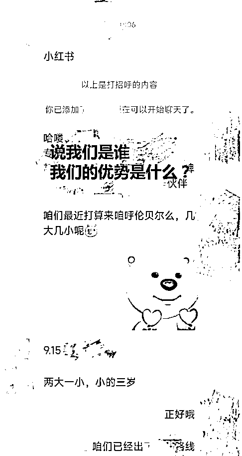

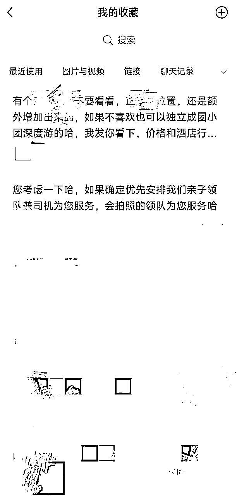

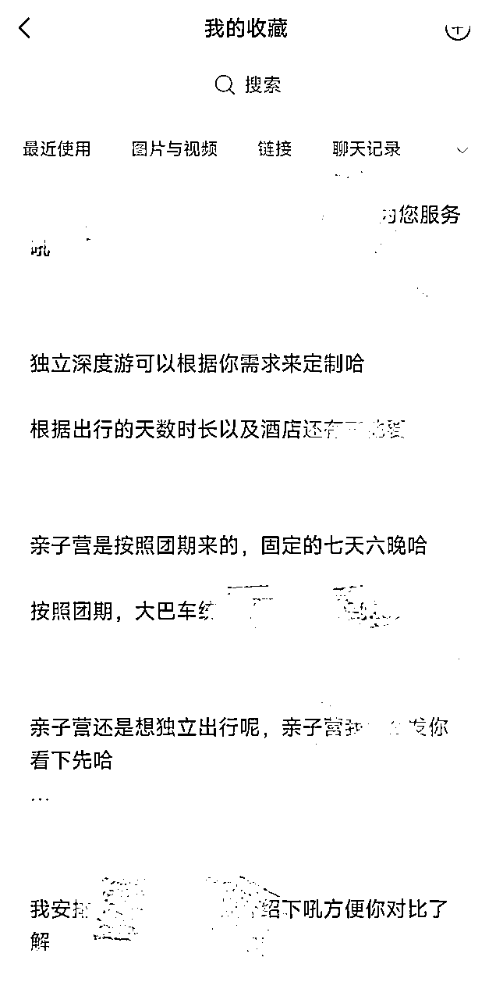

第二部分是用户私域的管理

先看下我们用户的命名，这个是为了了解用户是个什么状态，没有拉群的要看是否要自己跟单提醒，如果拉群的只需要看群内信息同步，以及及时与销售人员沟通进度情况等。

我们群命名会按照结构：【几大几小-体验类型+到达时间+拉群时间】来做 SOP 化

为什么需要这样命名的原因，在于我们可以时刻知道用户的到达时间，方便我们跟单。

一般我们会一周内到达用户会每日催单，

超过两周以上用户会一周跟进一次单，

同时如果我们成交了会备注群名称➕⭕️，如果拒绝成交我们会打❌，这样会比较容易管理。

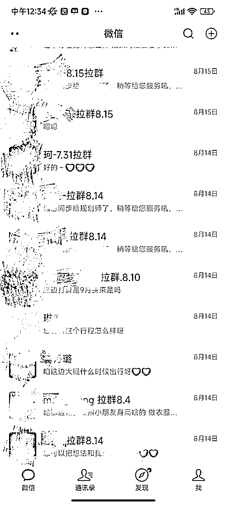

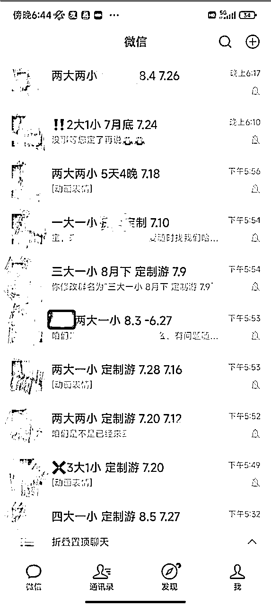

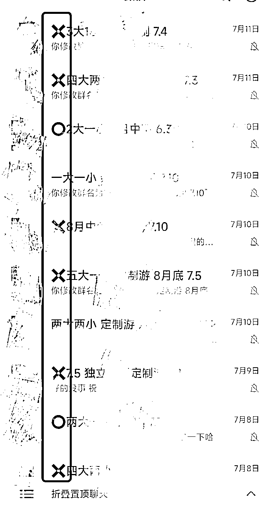

记住我们是做高可单，并不在意成交这件事情，或者叫今年成交，也有很多用户预订了明年来也会找到我们，高可单产品注定了决策链路久一些，高可单用户的特点也是服务高于价格，所以把你的沟通的服务体验做好，才能更好的完成高可单的转化。

不同有些客户只是换了行程或者改了时间，所以就算是明年旺季，依旧可能是你的潜在客户，此时要记住做好你的私域运营，朋友圈的内容以及视频号的内容。即便用户预订了其他，也需要保持好你的服务与格局，这也是为服务的旅游目的地带来好的口碑。

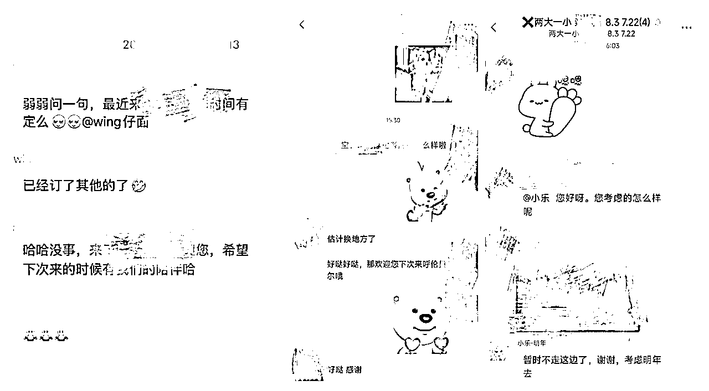

## 三、感悟与重点

说几个我觉得很重要的重点和感悟：

流量：

流量本质是数据，数据产生价值才叫信息。

流量的作用是一个放大器，只是一个载体。流量是产品与用户需求的桥梁。把合适的产品输送到合适的人群的面前，流量才产生价值。所以好的产品本身才是价值本身，而流量或者说选题恰恰是把产品的优点以用户视角和用户表达方式去呈现。所以好的后端产品与服务就变得尤为重要。

平台：

当你选择一个平台的时候，其实是选择了一个场，做电商进场说人货场，当你选择了一个平台，其实就确定了一个变量，在什么样的场域做什么样的产品销售给什么样的人它是一整个环环相扣的系统，是有内在关联的。

小红书 人群主要女性为主，同时保持高消费高净值的人群，这是是为什么它可以做很多高可单的项目的原因。

细节感：

细节需要执行中才能看得见，即便很多大佬在精华贴中分享，其实已经受益匪浅了，但是细节决定成败，例如我们旅游项目，会同步观察投放城市的机票波动到我们的目的价格，我想这种细节干货其实很难在这种帖子中能变现出来..

美感的把握：

什么样的场域决定了什么样的人，小红书就是一个女性为主的平台，是颜值审美就成了优先抢占流量的利器。如果你对于视觉的把握占优势，建议可以在小红书平台上持续深耕，一定会拿到一些结果。

精细化：

环节精细化，例如笔记内容上》选题精细化，公域转私域上》回复语精细化，不同环节针对不同人群应该是不同动作，这样你很容易形成优势和壁垒，例如我们的一些通过亲子酒店选题的点击的私信页面，我的回复语就会把网红酒店这样的重点放在最前面去回复用户，从而提高转私域的能力。

行动力：

行动是焦虑的敌人，是创新与创造的前提。只要你在行动，你就一直在创造一直在创新..就像我们经常做选题的时候要找对标，对标的这个标准其实是那个敢于创新和行动的人留下的脚步和痕迹，你也可以成为被别人对标的标准。

再次感谢生财这个社群，无论是生财的社群体系还是圈友氛围以及内容干货都是做得十分优秀的，同时涉猎不同平台和玩法的圈友也倾囊相授了很多宝贵的知识与经验，猜想终其原因还是认可生财社群的利他等等的核心价值观，持续向大家生财圈友学习！！