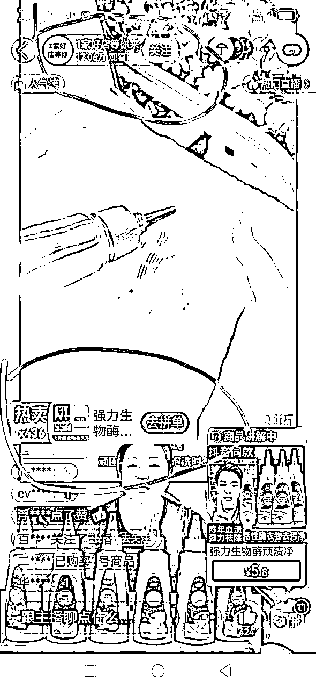

# 拼多多无人直播最新玩法

> 来源：[https://uzmlh09ou8.feishu.cn/docx/K7xHdFU2soFDHuxfRNEcaMRUnFb](https://uzmlh09ou8.feishu.cn/docx/K7xHdFU2soFDHuxfRNEcaMRUnFb)

### 拼多多无人直播带货：开启赚钱新机遇

首先不要做一夜暴富的梦。不是每个人都可以成为董宇辉李佳琦之类的

在电商直播日益火爆的今天，拼多多无人直播带货项目正悄然崛起，为广大创业者提供了一个全新的、极具潜力的赚钱途径。

做不了大网红的那就做个卖货主播。有条件有直播能力就自己播。没条件没直播能力怎么办呢那就只能干无人直播

你随便打开一个拼多多直播间看一下

这些主播长得也没有多好看多牛逼。就和你身边的你我他是不是一样的。但是一天卖下来他能干个几百单。就算每单只挣一块钱。一天也是大几百上千的收入。况且这种爆品它的佣金在50%。也就是一单大概可以挣个3~5块。你们自己算一下播的好几天大概几千块。是不是顶过很多在工厂打螺丝的一个月的收入了。所以看直播还是很香的

那么作为普通的我们该怎么干呢

如果我没有直播能力也想干直播。就只有搞无人直播。借一下有能力的主播来帮我们挣点小米米

1.  几个平台的对比

*   拼多多，大部分的都是购物的。当然也有别的平台可以搞。为什么首选拼多多。通过测试。拼多多给的流量相对较多。大部分都是几万几十万的场观，虽然转化不精准。但是他推的人多啊。 新号启动比较容易启动

*   抖音。流量最大。但是它包含了娱乐只有部分人购物。主要是新号冷启动基本不给流量。破万的都很难。竞争也大。

*   快手。用户量没有抖音大。同样也是娱乐加购物。自然流基本没有。一般都要投流起号。对新人新号新主播不友好。基本没有流量扶持。播一场下来可能100个人不到。投流的话方法不对，基本不出单

*   淘宝。全是购物的。因为是老平台。对新号不太友好基本没有什么流量，要播得久也要付费。

*   小红书。流量非常大，品选得好机会很大。现在最好模式就是要自己押货。钱少了玩不动。假如一天卖个10万货款压力大。没实力很容易死

1.  多多怎么做

*   拼多多无人直播带货操作简便，无需自己出镜，也没有押金、开橱窗、养号、积累粉丝和发布作品等繁琐要求。只需一部手机和一个拼多多账号，即可随时随地开播。而且出单就能获得佣金，佣金可直接在多多进宝提现，真正实现了低门槛、高回报。

二、操作流程详解

1.  硬件和软件准备

*   硬件要求：为了确保直播的流畅性和稳定性，建议电脑配置达到 CPU I5 十代、显卡 1660 以上、内存 16G、系统 Win10（64 位）、硬盘固态 512G。

*   软件需求

*   电脑软件：

*   剪映专业版：用于剪辑直播素材，使视频更加吸引人。

*   抖音：可通过网页或客户端登录，在选品时提供参考。

*   OBS：作为直播素材播放的关键软件，能实现直播的多种功能设置。

*   多多直播伴侣：是拼多多平台直播的专用软件，保障直播的顺利进行。

*   直播录制工具：用于录制其他平台的优质直播素材。

*   手机 APP：拼多多、拼多多商家版、多多进宝。这三个软件都需要实名注册，且注册信息为同一人。

1.  软件注册指南

*   拼多多商家后台注册：在手机上下个拼多多商家然后开始注册。【注册的人最好是新人。没在拼多多开过店没有违过规没有直播过。老号也可以。以前开过店没有直播过的也行。建议注销了重新注册】平台也和男人一样喜新厌旧。所以新人新脸新号是最好的。这里说的不是手机号 。是多多商版账号。手机号没关系。只要没有开过店的都行。最好不要连WiFi用4g ,用不了你多少流量

*   注册方法。注意注册好了最好在手机上放一天不要换手机登录

多多进宝注册：

手机在应用商店下个多多进宝 用自己手机号 直接手机注册登录设置密码绑定银行这个是你收款很重要

这个太简单了不演示，如果这个都搞不定，哪你可能不适合干

拼多多商家版押金缴纳：注册完成后，开播前需向拼多多缴纳 500元的开播押金，以前是1000。如果这个号死了直接选择退店然后押金大概三天左右就能退给你。很快

怎么绑定多多进宝

打开拼多多商家版。点击多多直播。边上有个带货选品，会弹出来一些产品随便选一个。然后就会弹出绑定多多进宝的流程。这里用你多多进宝的手机号进行登录接个验证码绑定成功。这里只是教你怎么绑多多进宝。不要直接开播如果你没准备好

1.  直播核心流程

*   品定生死关于选品

1.  【注意事项】，前面三场直播的尽量选那个便宜一点的。假如在外面看10块点进去也是卖10块。不要选那种在外面看上去10块点进去那100块的那种。会转化不好 ，

1.  前三场的品有没有佣金无所谓只要够便宜。能够最大可能的出单最好

1.  假如这个账号准备卖日用品尽量都去选日用品不要老换。实在干不动再换。假如说一开始就选的是服装就一直搞服装。这样对账号好，流量会越来越精准。出单会越来越多。

1.  这个选品是重中之重。搞到一个好的品一个好的素材，干一场够你吃一年。这个是玄学眼光加运气多刷多多直播间，参考别人好卖的品，觉得佣金不错就去找直播间，选单品直播间，尽量在视频号选，选多多上别人没在用的比较好，人家用过的容易限流

1.  建议选单价50以下的，应季吃的用的都可以，选单品

1.  直播间挑选：真人露脸、最好正脸的、主播状态好、在热卖、真实背景的；卖惨的、明星、网红、绿幕背景、不露脸、旗舰店、有其他平台标识、文字贴纸不要挡脸。

大米、小米、葡萄干、肉、油、跟功效有关、明显假的东西都不要选

1.  素材录制时间：2小时以上，4-6小时最好

1.  优先建议的视频号选。抖音快手淘宝的都行。不要选大网红的不要选那个明星的上去就挂

1.  主要原则是。你打开他的直播看个3~5分钟。假如你觉得他都没有感染力你都看不下去了、这种的就不要了。一定要选画面干净的不要有贴纸那些乱七八糟的。

1.  还有一个重点的指标，看一下他的场观和在线人还有那个热卖了多少。如果他都卖不你把它录下来你也卖不动。

1.  前两三场不挣钱没关系。后面就要挣钱了。然后要去多多进宝看一下那个产品。上架的时候选那种佣金稍微高一点但是它又有销量。又不是没有销量。可以提高转化

1.  产品上架的注意事项。如果如果主播直播间说这个产品的销售价是59。那么你上的品最好是也是59。但是这个一模一样的品不一定好找。因为规格不一样价格不一样。所以上架的时候可以上比主播说的那个价格便宜的、不要比主播说的价格还要要贵去上架这样卖不动。

1.  理论是产品价格可以不一样。如果实在找不到同样价格的。但是要比直播间说的那个价格一样或者说比较便宜

1.  多刷直播。搞对一个爆品和好素材干几场够吃一年，

*   录制素材要点

*   录制素材应选择真人出镜、真实场景（室内户外均可）且为单手机摄像头直播的直播间，避免选择绿幕素材（虚拟背景）和手播素材。录制的直播间不能有明码标价（除非多多进宝价格能完全对应）、运费险、快递、假一罚几等明显提示牌的，要保持直播间画面干净简洁。建议前期准备两个同品类素材。

*   视频录制的方法

*   视频号的直播要用小绿点这个要收费。几十块钱儿

*   抖音快手免费的软件一大把。你喜欢用哪个用哪个

*   软件打包下载点我通过百度网盘分享的文件：ZBYJ

链接：https://pan.baidu.com/s/1zYSET5Pv-wL8qgg5XahkyQ?pwd=q1a0

提取码：q1a0

--来自百度网盘超级会员V8的分享

*   素材处理关键

*   在处理素材时，要特别注意语音识别违禁词，因为语音识别可能会识别出谐音违禁词。使用自动剪辑软件时要谨慎，确保素材符合平台规定，同时要对素材进行去重处理，避免重复内容。

*   详细操作视频

*   搭建直播间步骤

*   安装 OBS 后，首先添加主素材并设置循环播放，然后添加辅助素材（如实拍的人群流动素材，可降低被封风险）。接着在拼多多中选择 OBS 摄像头，启动虚拟摄像机，设置直播参数，包括创建直播封面（需调整像素，添加直播标题和商品），最后添加商品（可选择店铺商品或通过商品 ID 添加），即可开始直播。

*   开播准备事项

*   获取拼多多商品 ID：在多多进宝里点击立即推广，然后点击长链接，“goos_id=” 后面的 11 位数字即为商品 ID。

*   直播间商品上架和封面准备：

*   封面准备：制作一张不低于 800×1200 像素且不大于 5M 的图片作为直播间封面。

*   商品上架：打开拼多多直播，点击创建直播，添加商品，输入商品 ID（多个商品以英文逗号隔开），点击下一步即可完成商品上架。

*   直播间设置：点击准备直播，在音视频管理中选择 OBS 摄像头，麦克风设置选择虚拟麦克风（VokeMeeter）。

*   开播流程

*   检查设备：开播前检查麦克风图标是否为红色，若不是则返回相关设置调整。

*   确定开播时间：第一场开播建议晚上12 点后或者早上7:00之前，播 4 个半小时下播。第二场比第一场晚几分钟（如 6 点 5 分或 6 点 10 分），同样播 4 个半小时下播，以此类推到第八天可根据情况调整。前期账号保证每天播一场就行。号起可以搞两场最多不超过三场

*   开启直播：按照上述准备工作完成后，点击开始直播按钮，正式开始直播带货。在直播过程中，主播需关注直播间的互动情况，及时回答观众的问题，介绍商品的特点、优势和使用方法等，引导观众下单购买。同时，要注意查看数据大屏，关注新主播流量扶持和真人验证提示等信息。

*   直播结束：按照预定时间下播，下播后可查看直播数据，分析直播效果，总结经验教训，为下一次直播做好准备。

三、开播注意事项

1.  设备检查

*   开播前要检查麦克风图标是否显示为红色，如果不是，需返回 OBS 直播画面搭建中的相关设置进行调整，确保声音正常输出。

1.  开播时间安排

*   第一场开播建议晚上12 点后或者早上7:00之前，播 4 个半小时下播。第二场比第一场晚几分钟（如 6 点 5 分或 6 点 10 分）

1.  数据监控与验证

*   开播后要打开数据大屏，新号第一场播一个小时后左上角会弹出新主播流量扶持。同时要注意数据大屏右上角红条是否变灰色，如果提示长时间无互动则需要进行真人验证。如果出现素材撞车情况，新号开播一个小时或第二场开播一个小时可能会出现真人验证要求。

1.  素材专一性

*   一个账号只能播放一个品类的素材，不要随意更换，否则会影响账号的流量。

四、流量分发逻辑与提升技巧

1.  流量分发逻辑

*   刚起号时遵循赛马逻辑，即在同一时间段开播的直播间中，数据表现好的直播间（如观看人数、订单量等指标）会获得更多流量。随着直播的进行，需要提升单观众 - GMV（商品交易总额），同时保持订单数据的稳定增长，并且要同步提升直播间的停留时长、互动率、粉丝关注量等权重因子，这样才能持续获得更多流量，提升直播间的竞争力。

1.  不同阶段提升技巧

*   刚直播账号：当粉丝数量较低时（几千以下），可以适量多次地售卖低价引流款商品（如 10 元日前 5 日，订单金额 50 元以下），同时可以适当投放广告（但在没有做好承接大流量准备时，不要大量投放广告）。通过这种方式获取更多订单量，帮助算法更好地学习，同时积累粉丝，为后续直播提供更高的初始流量和更好的数据表现。但要注意引流款商品的质量，避免因质量问题导致粉丝流失和大量退单。

*   运营一段时间账号：当粉丝数量在几 w 以上时，在保持单量稳定的基础上，要提升账户的 GMV 和单观众 GMV。除了低价引流款商品外，要尝试售卖更有竞争力的货品，如丰富多样、高性价比、高质量的商品，这些商品更容易成交且能产生更多复购。同时，要打造有竞争力的直播内容，通过优质商品讲解和引导观众高互动，营造店铺人设，提升每场直播的停留时长和互动率，从而留住观众并转化为粉丝。此外，要运营好自己的粉丝和老客，准备一些粉丝福利和老客福利，让他们为每场直播带来更高的初始流量和更好的数据。

*   其他建议：当账号做好了承接流量的准备时，可以尝试购买更多的广告，加快账号成长速度。但如果没有做好准备，建议少量多次尝试，根据效果进行调整。

*   现在的号都容易出真人验证看运气有的能扛半个月有这几天就挂

解决方案

最好是新人新号新脸，准备好绿幕摄像头随便找个产品。然后可以报平台的新超星扶持活动

但是这个一般人搞不了你要机构帮忙。要用站外的一个大号去进行申请认证

优点是不容易出真人。如果报了新超星可以真人播前几场。随便在家里找个样品纸巾啊什么的都行。对然后稍微讲两句不一定要让你很会讲主要是过真人验证。如果起号成功基本上能扛到三个月

主要是他会给这个广告红包，如果能报名成功基本上有8000到1万的红包。用拼多多官方的钱去进行推广100%出单，除非你选的品和素材都很垃圾出不了。正常都会出。

基本上的玩法都在这里不要被割韭菜市面上的东西大差不差

如果你是个人也可以解决号的资源那就可以直接干起来

如果是团队你就可以批量放大了，前提是你得开得出很多号把身边的亲戚朋友多

只是用他的身份去开店，

提现还是到你自己的银行所以无所谓

最后祝大家多多爆单。有新的方法也会在文档里更新

快手小红书抖音淘宝网还差不多。只是素材处理和这个直播间搭建有些小区别。还有找素材的要求有些不一样

免费分享不要拿去割韭菜。我们是不收费的

更新内容

# 无人直播出人脸识别怎么处理

# OBS摄像头硬改

obs常用插件安装

https://www.bilibili.com/video/BV1h2SLYhEom?t=2.8