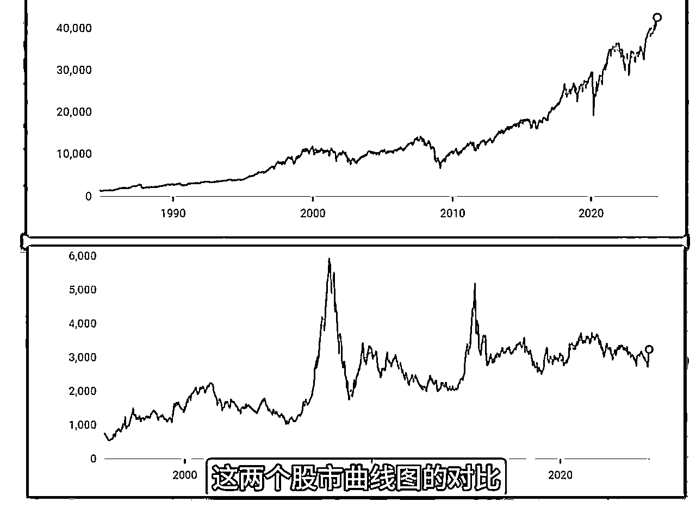
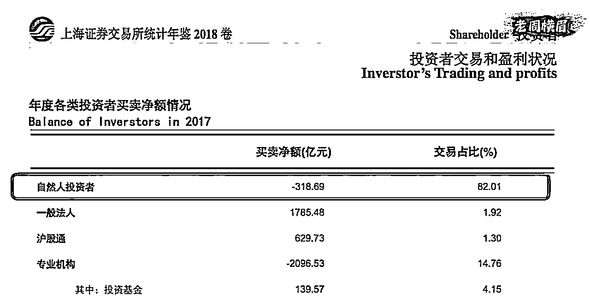

# 如何从数据分析看股市，以及一些投资工具总结

> 来源：[https://kj259khusm.feishu.cn/docx/KKnydnolAoNnZWxdgzCcTtQmnif](https://kj259khusm.feishu.cn/docx/KKnydnolAoNnZWxdgzCcTtQmnif)

大家好，我是浅笑。

前段时间 A 股很火热，很多人去开户去入市去加仓，这段时间看了一个视频，也引发了我一些思考，还看了一些其他有用的工具，总结一下分享给各位。

# 上海证券交易所统计年鉴分析

人类历史上最聪明的五个人之一，现代物理学、经典力学和微积分的开山祖师爷，数学天才牛顿于1720年在股市中亏光了他几乎所有的积蓄。

他因此说了一句经典名言，我能准确的计算出天体的运行规律，却无法计算人性的疯狂。

文章数据来源于上海证券交易所统计年鉴（2005～2023）视频作者是老周横眉，通过数据来分析 A 股的本质，我将他的文字稿整理出来，然后结合一些我的补充。

接下来用最全面和深入的数据分析来告诉你为什么中国股市里的大牛市恰恰是散户股民们的金融坟墓，是中产阶级返贫的最快途径。

很多中国股市相关的数据都是公开的。 上海证券交易所每年都会发布一份上海证券交易所统计年。

网站链接🔗：

https://www.sse.com.cn/aboutus/publication/yearly/

如果仔细去阅读这些报告，你就能看清楚很多事。 但你也看到了这份年度报告每一份都长达八九百页，有些上千页。 所以一般人根本没有这个精力、决心和能力去把它研究透彻。

作者花了一百多个小时看了过去15年来所有的统计年鉴和报告，不仅提炼出了最精华的部分，也从中找到了中国牛市当中的规律。

## 🐂中国牛市规律与美中股市对比

首先 我们来看一看这中美两个股市曲线图的对比。

上面是美国股市道琼斯工业指数过去40年来的曲线图，下面是上海证券交易所综合指数过去30年来的曲线。

可以看到美股整体是非常稳健的在上升的，只有真正出现了黑天鹅事件，比如2008年金融危机，2020年新冠疫情这样的事件时，股市才会暴跌，但是随后总是会复苏，所以把时间放长来看，总体是不断在上升的。

如果你在1985年用10万元购买纳斯达克综合指数ETF并持有到今天，你的持股市值现在已经上涨了7%千350，价值745万元。 那么我们再来看看上证综合指数，它总是会在某一个时间点突然暴涨，随后又突然暴跌，然后几十年来整体并没有什么增长。

中国股市每一次的疯牛必定会有伴随而来的股灾。 之后用数据来给大家论证，在A股每一次的大涨和大跌之间，中国都会经历一次极其大规模的财富再分配。

但这种财富分配并不是马克思思想里所谓的让富人的钱分配到穷人那里，恰恰相反，中国股市里的每一次牛市，都会让富人变得更富，中产变穷，穷人变得赤贫。

而造成中国股市这种大起大落现象的原因有两个，

第一，中国股市是一个政策市，所以它其实并不遵循市场规律，大环境好的时候它不涨，大环境差的时候它也未必跌。

比如说从1992年到今天，中国的经济已经翻了多少倍了，GDP从4270亿美元增长到了现在的18.5万亿，翻了43倍，但你看上证指数并没有什么变化。

再比如2020年全球都陷入疫情所带来的经济萧条，2022年中国也不断的在封城停工停产，但是你看A股也不怎么跌，所以中国股市它是不反映经济状况的，所谓的股市是经济的晴雨表，跟中国股市丝毫不沾边。

第二个，造成中国股市大起大落的原因更为重要，也正是我们今天要讨论的核心重点，那就是中国股市的投资人结构。

在美国股市当中，80%的交易量是来自专业投资机构，只有20%是来自散户。

但中国是正好反过来的，82%的交易量都来自散户，只有18%是来自机构。

不过要真正了解中国股市的问题，我们还必须更进一步的去深挖跟投资人结构相关的数据。

截至2022年底，中国总共有4638万个持股账户，这其中的机构投资者和企业投资者只有12.49万，而个人投资者也就是散户则为4626万，占比达到了99.73%。

在这些个人投资者当中，有将近90%的投资者是股本金不超过100万人民币的小散户。

其中股本金低于10万元的股民数量高达2305万户，也就是说，中国股市当中将近一半的投资人都是股本金低于10万元的超小型散户。

而那些可以被业内称为专业级投资者的，也就是账户资本在300万元以上的个人投资者，总共才不超过146万户，只占股民总数的4%左右。

## 💹 散户股市困境：小资金难盈利

那么中小散户的基本特征是什么呢？ 股本少，缺乏专业的金融知识，抗风险能力差。

散户严重缺乏投资判断能力，又加上急于求成的心理，导致他们对市场的反应过于敏感，交易过于频繁。

比如美国散户年平均交易次数为15次左右，而中国散户一年的平均交易次数却高达60次。

## 🌪️ 散户频繁交易与盲目跟风

小散户还有一个特性就是盲目跟风，每次一出现牛市，或者国家颁布了什么似乎对股市有利的政策，就会有大量散户奋不顾身的涌入股市。

就拿这一次国庆假期前的疯狂来说，整个国庆假期各个券商都在加班加点的给个人投资者开户，九月下旬以来新增账户就增加了六百多万个，这当中尤其是90后、00后的新投资者显得尤其着急，因为他们还没有被A股烧到过手指。

如果不是节后重新开盘两天就开始大跌，估计还有几百万甚至上千万人在排队进仓，这些人真的是应该感谢老天没让他们成功开户。 那么伴随着散户疯狂入市而来的必定是交易额的井喷。

在平时A股每天的交易额大约为九千多亿，但10月8号国庆回来开盘的第一天才20分钟，交易额就突破了1万亿，到下午两点就突破了3万亿，创下了历史记录。

所以中国股市中散户的这种跟风效应，一涨就买，一跌就卖，超高的换手率就严重加剧了市场的波动。 这是中国股市总是在急涨和急跌中跳跃的其中一个原因。 而中小散户虽然贡献了绝大多数的交易量，但只有极少数人盈利，并且盈利的金额也很小。

在股市整体盈利的年份，比起机构投资者，散户赚的很少，在亏钱的年份散户又亏的特别多。

我们来看看上海证券交易所公布的这些数据，比如2017年是一个盈利的年份，根据统计，2017年散户贡献了中国股市当中82.01%的交易额，但却仅仅获得了股票市场中不到9%的盈利。

2017年A股市场总盈利金额为3万4535亿，但是散户仅仅获利3108亿。 也就是说，机构投资者用了仅仅不到18%的交易额，就获得了91%以上的利润，机构和散户的利润率差达到了46倍以上。

而在那些亏钱的年份，散户的亏损率又远远大于机构，比如说2016年投资机构的持股市值为14.34 万亿，散户只有5.66万亿，是投资机构的39.5%，但是当年散户亏的钱却达到了机构亏损的72%，机构亏了9820亿，散户也亏了接近7100亿。

我们来比较双方的亏损比，也就是亏损金额除以持股市值。 那么机构的亏损比是亏损金额9821除以持股市值14点三四万亿，等于6.85%。 而散户的亏损比是7100亿除以5.66万亿，等于12.54%。

所以散户的亏损率是机构亏损率的2倍。

也就是说散户们在大家都赚钱的时候赚的特别少，在大家都亏钱的时候又亏得特别多。

还有一个值得注意的点， 散户也不全都是一个级别的这当中也分成大散户、中散户和小散户。

上面说的赚钱没他份，亏钱他先先行的散户，其实都是中小散户，跟股本金在1000万以上的顶级大散户无关。

要看清楚中国股市是如何将穷人的财富重新分配给富人的本质，我们要从一次超级大牛市，也就是疯牛以及随后必定伴随而来的股灾来分析。

大家印象最深刻的必定是2015年的疯牛，那一次的牛市从2014年7月份开始一路攀升，到2015年6月12日达到了顶峰5178点，然后股灾开始一路狂跌，两个月后就已经跌到了3500点，半年后2016年1月27号跌到了谷底2638点，到今天都还没有完全恢复元气。

现在我们就来彻底解剖这一段历史。

我们将分析时间段设定在2014年7月到2015年12月。 这18个月当中，我先把中国股市当中的投资人分成三个大组，即投资机构企业和散户企业，当中包含了大量的国家队，也就是有政府背景的企业。

为了更精准的看清楚中国小散户的困境，我根据账户资产金额又把散户分成了四个阶层。

所谓的账户资产金额就是该散户在股市账户里所持有股票的总价值加上现金金额。

第一个阶层我取名为G1，为账户资产少于50万人民币的小散户。

第二阶层G2，为账户资产介于50万到300万之间的散户。

第三阶阶层G3，为账户资产介于300万到1000万之间的散户。

第四阶层G4为账户资产大于1000万元的顶级大散户。

首先，机构和企业的账户数量只有2% 左右，散户账户数量占到了99.9%。

这其中，资产金额最小的G1散户远远占了最大基数，达到了总投资人数当中的85%。

G2，12.6%。

G3，1.9%，

1000万资产以上的顶级大散户 G4，只有5%。

但除了账户数量，我们真正需要关注的是这几个阶层的股民所持有的股票市值以及交易量占比。

在这18个月期间，企业平均持有中国股市当中64%的市值，但交易量却不到2%。 投资机构掌握了11%的市值，贡献了12%的交易量，而散户只占了25%的市值，却贡献了将近90%的交易量。

散户对市场的反应过于敏感，一有什么风吹草动就一惊一乍的，交易过于频繁，这组数据就非常清晰的展现了这一点。

而在散户之间，四个阶层之间的资本占比和交易量基本都差别也不大。 G1的账户市值占总量的5.9%。 G2，7.1%。 G3，4.3%。

G47.8%，各阶层所贡献的交易量差别不大，在16%到26%之间。

我们来看看这18个月期间的三个不同时段，也就是在疯牛即将开始前，疯牛最鼎盛时期，以及股市开始往下急速下跌的时候，这三大组四大阶层分别都是怎么对市场进行反应和投资的？ 我们来仔细研究下面这张图。

## 🐂 中国股市散户投资行为分析

首先虚线代表了上证综合指数从2014年7月到2015年12月期间的走势曲线。 另外四条实线分别代表了四个散户阶层在该时间段的净资金流入和流出曲线。

如果曲线往上走，就代表更多的人买入股票，也就是进场。

如果曲线往下走，就代表更多的人卖出股票，也就是离场。

蓝色代表G1 最小散户，绿色代表G2，橙色代表G3，红色代表顶级大散户 G4。

那么我们把这18个月的疯牛加股灾分成三个阶段来看。

第一个阶段是从2014年7月到大约2015年3月这段期间，这时股市已经在逐渐上升当中了。

你可以清楚的看到，这个时候有钱人已经在开始进场，尤其是G4大散户已经开足马力在大幅加仓了。

G2和G3就相对保守的多，但起码也是在进场的，但资产50万以下的小散户却是唯一在离场了，一直到2015年3月都还是呈现净卖出的情况。

到了第二阶段正式进入疯牛的时候，那当然是大家都在全力加仓，但即便是这个时候，你看G1 还是摇摆不定，高频交易，在净买入和净卖出之间来回切换。

这一轮疯牛的拐点出现在2015年6月中旬，峰值达到了5178点，这里你可以看到股市一开始下跌，G4 大散户就已经毫不犹豫大幅撤出资金，在这段期间内减持超过4000亿以上，成功大幅盈利撤退。

而G1 小散户到了这个时候，还在以为这是下一轮暴涨前的小调整，还在疯狂加仓，成功的成为了大户的接盘侠。 G1 散户的进场峰值要一直持续到8月份才达到峰值，当时指数都已经跌掉了30%，到了3500点，小散户才总算是幡然醒悟，但为时已晚。

而代表国家队的企业则一直等到8月底跌到3000点左右的时候才大踏步进场，接收了中小投资者抛售的资产。

当一切尘埃落定，我们看着一地鸡毛，总结这18个月时会发现，这期间专业投资机构的新进场资金仅有800亿，而散户则有1.3万亿。 新资金进场是专业投资机构的16倍，企业和国家队就更厉害了，不仅没有新资金进场，而且基本都在趁机抛售套现，总共套现了1300亿。

所以说其实这场疯牛的前半场完全是靠散户新进的1.3万亿硬拖起来的，然后以散户下半场被收割作为收场。

最终占股民总数不到5% 的顶级大散户，以及2% 的机构和企业，赚走了占总数97.5%的中小散户的钱。

在这18个月当中，拥有1000万以上资产的G4顶级大散户们的资产从1万2446亿增加到了2万1977亿，暴增了76%，也就是9531亿。

而资产低于30万的小散户总资产从13005亿下降至8691 亿，减少了33%。

中国股市里的大牛市是普通人财富流失的最主要原因，是中产返贫的最快途径。 每一次的疯牛都是中国的财富在分配，从穷人那里分配到富人和国家队的口袋里。

其实如果你是散户，你真的应该期望中国股市永远不要有牛市，在没有牛市的平稳年代里，虽然散户整体还是亏损的，但起码亏的少，跟大散户和机构之间的差距也小得多。

比如在2014年6月牛市开始之前的两年半，是属于股市平稳期，没有大起也没有大落。

在这段期间内的任何18个月当中，G4大散户的资产增长大约为31%的资产依然在缩水，但也只有3%左右，比起牛市当中缩水的33%，那已经是小巫见大巫了。

当我们把时间拉长来看，小散户的资产永远都是在缩水的。

我们来看看下面这张表，记录了从2008年至2022年这15年间，企业专业机构资产1000万以上大散户以及资产10万元以下的超小型散户的持股市值变化。

这里我们可以看到，所有人的持股市值都在增长，只有10万元以下的小散户这个最需要赚钱的群体资产是在缩水的。 首先，大散户的持股市值从693亿增长到了5.4万亿，翻了75倍，企业增长25倍，专业机构增长12倍，但只有小散户资产缩水了32%。

在这15年间，机构、企业和大散户都是小跌大涨，总体资产升值，只有小散户是大跌小涨，资产总额不断在缩水。

散户的资产蒸发绝大部分都是发生在牛市之后必定跟上的股灾。

比如在A股史上最高点的2007年，上证指数一度高达6124点，但在短短一年后就跌破1800点，全国散户因此损失了2.1 9万亿元，平均每个账户亏损超过7万元。 2011年小牛市散户总共损失8759亿元。

而 2015年资产30万以下的小散户，在亏损了4000亿之后，当年有三百多万人销户。

但是你看看今年国庆节前的开户盛况，就像德国哲学家黑格尔说的，人类从历史中学到的唯一教训，就是人类没有从历史中吸取任何教训。

各位自己的生活中应该也有碰到过，有很多股民在股市中遭受了重大亏损之后，都会宣布金盆洗手，发誓永远不再踏足股市半步，但才过了没多久，只要一有什么牛市，看到大家似乎都在赚钱的时候，他们又会开始抓耳挠腮，忍不住再次进场。

## 🎲 股市赌徒：亏损与再入场的循环

几年前，世界卫生组织就已经将游戏成瘾定义为一种疾病。 但从症状上来看，中国股民炒股成瘾的程度丝毫不亚于那些沉溺于打游戏的青少年。

中国父母们总是批评孩子们沉迷于游戏，但起码你在游戏当中的大部分时候都是获得了满足感的。 而沉迷于股市，在亏得连裤衩都没了的同时，换来的只有心酸和抑郁。

当我们回过头来看这张图表的时候，相信所有人都会对小散户们匪夷所思的愚昧感到不可思议，但这是因为我们在用未来人的角度去回看历史的全貌。这是事后诸葛，事实上就是我们当中的85%都是G1。

当你真正身处在那个漩涡当中的时候，你几乎一定也会做出跟这张图里G1 同样愚昧的行为。 因为2015年并不是唯一一次同样的是在中国股市当中一次又一次的历史重演。

即便你今天已经知道数据和其中的道理，或许可以对你下次的判断能够有所帮助，但如果下一轮疯牛你还是选择进场，很难说你就一定不会犯同样的错误。

所以作为小散户，对于一个本质上是在为富人和国家队收割老百姓财富的中国股市，其实选择不进场就是守护你财富最好的方式。 把心态摆正，有些钱注定就不是你能够赚到的。

下一次牛市来临时，不管菜市场里的王大妈眉开眼笑的跟你说他又赚了多少，你都要坚定的相信，股市进去了，基本就是赌博。

如果真的要研究股市和投资，这里@渊杰老板分享的一些工具，我也用 AI 整理了一下，排版得更加舒服一些。

生财原贴链接🔗：https://t.zsxq.com/0OJGA

# 工具分享

## 国内

### 中华人民共和国中央人民政府门户网站

🆔 网站名称：中华人民共和国中央人民政府门户网站

⭐ 网站功能：政府信息发布与服务平台

📁 网站简介：中华人民共和国中央人民政府门户网站是国家级的官方门户，提供最新的政府政策、法规、新闻、公告等信息。该网站为公众提供在线办事、政策解读、政府公开等服务，涵盖多个政府部门及政务领域，旨在提升政务信息透明度，方便公民和企业获取政务服务。

🔗 网站链接：[https://www.gov.cn/]

### 中国10年期国债收益率

🆔 网站名称：中国10年期国债收益率

⭐ 网站功能：金融市场数据与分析

📁 网站简介：提供中国10年期国债收益率的实时数据及其历史走势。该网站为投资者提供详细的国债市场分析，包括收益率变动、市场动态以及相关的经济指标。通过该网站，用户可以轻松跟踪和分析中国国债的表现，并获取全球金融市场的最新信息与分析工具。

🔗 网站链接：[https://cn.investing.com/rates-bonds/china-10-year-bond-yield]

### 经济日历

🆔 网站名称：经济日历

⭐ 网站功能：全球经济事件与数据发布追踪

📁 网站简介：经济日历提供全面的全球经济事件和数据发布时间表，涵盖各国重要的经济指标如GDP、通胀率、失业率等。该工具帮助投资者及时了解经济数据的发布及其对市场的潜在影响，从而做出更为明智的投资决策。用户可以自定义筛选经济事件，按地区、重要性和时间段查看相关信息。

🔗 网站链接：[https://www.investing.com/economic-calendar/]

### 生意社 - 商品价格指数

🆔 网站名称：生意社 - 商品价格指数

⭐ 网站功能：商品市场信息与价格指数发布

📁 网站简介：生意社是一个专业的商品市场信息平台，提供大宗商品价格指数的实时数据、市场分析与行情走势。涵盖能源、化工、钢铁、有色金属、纺织等多个行业的商品价格变化，生意社为企业和投资者提供决策依据，帮助用户掌握市场动态、分析供需关系，进行风险控制和市场预判。

🔗 网站链接：[https://m1.100ppi.com/]

### 理杏仁

🆔 网站名称：理杏仁

⭐ 网站功能：指数、行业及公司估值查询

📁 网站简介：理杏仁是一个专注于提供指数、行业和公司的估值分析平台。用户可以通过该网站查询各类金融数据和估值指标，获取实时市场信息与分析报告，帮助投资者更好地理解市场动态和个股表现，从而做出更明智的投资决策。

🔗 网站链接：[https://www.lixinger.com/]

### 上海证券交易所

🆔 网站名称：上海证券交易所

⭐ 网站功能：证券市场信息与交易服务

📁 网站简介：上海证券交易所是中国大陆主要的证券市场之一，提供股票、债券、基金等金融产品的交易和相关信息。该网站为投资者提供市场公告、交易数据、公司信息及各类金融产品的实时行情，旨在提高市场透明度，支持投资者进行有效的市场分析和决策。

🔗 网站链接：[https://www.sse.com.cn/]

深圳证券交易所

🆔 网站名称：深圳证券交易所

⭐ 网站功能：证券市场信息与交易服务

📁 网站简介：深圳证券交易所是中国大陆主要的证券交易市场之一，提供股票、债券、基金等金融产品的交易服务和市场信息。该网站为投资者提供实时的市场数据、上市公司公告、交易规则及政策法规解读，帮助用户了解市场动态和进行投资分析，促进市场的透明化与公开化。

🔗 网站链接：[https://www.szse.cn/index/index.html]

### 巨潮资讯网公告中心

🆔 网站名称：巨潮资讯网公告中

⭐ 网站功能：上市公司公告与信息披露

📁 网站简介：巨潮资讯网的公告中心提供中国上市公司最新的公告信息和数据披露，包括财务报告、股东大会信息、重大事项公告等。该平台为投资者和市场参与者提供实时的公司信息，帮助用户及时了解各类市场动态和投资机会，提升投资决策的透明度。

🔗 网站链接：[http://webchat.cninfo.com.cn/home/notice]

### 禄得网

🆔 网站名称：禄得网

⭐ 网站功能：可转债多因子回测

📁 网站简介：禄得网是一个专注于可转债市场的金融数据分析平台，提供多因子回测工具。用户可以通过该网站对可转债进行深度分析与研究，使用多种因子模型评估投资策略的有效性，帮助投资者优化投资组合并提高回报率。

🔗 网站链接：[https://lude.cc/]

### 集思录新股数据

🆔 网站名称：集思录新股数据

⭐ 网站功能：新股信息查询与分析

📁 网站简介：集思录新股数据平台提供最新的新股发行信息和市场分析，涵盖A股和港股的新股上市情况。用户可以查询新股的申购信息、发行价格、市场表现以及相关的财务数据，帮助投资者把握新股投资机会，做出明智的投资决策。

🔗 网站链接：[https://www.jisilu.cn/data/new_stock/#hkipo]

## 港美股

### 集思录新股数据

🆔 网站名称：集思录新股数据

⭐ 网站功能：新股信息查询与分析

📁 网站简介：集思录新股数据平台专注于提供最新的新股发行信息，涵盖A股和港股市场。用户可以通过该网站查询新股的申购信息、上市时间、发行价格和市场表现等，帮助投资者评估新股投资机会，了解市场动态并作出更为准确的投资决策。

🔗 网站链接：[https://www.jisilu.cn/data/new_stock/#hkipo]

### TradingView 股票市场热力图

🆔 网站名称：TradingView 股票市场热力图

⭐ 网站功能：股票市场表现可视化工具

📁 网站简介：TradingView 股票市场热力图是一个通过图形方式展示股票市场表现的平台。用户可以根据市值、价格变动及行业分类查看个股的表现情况。热力图使用颜色和大小来直观反映市场趋势，帮助投资者快速识别行业热点和领涨领跌的个股，支持做出更精准的投资决策。

🔗 网站链接：[https://www.tradingview.com/heatmap/stock/

集思录新股数据

🆔 网站名称：集思录新股数据

⭐ 网站功能：新股信息查询与分析

📁 网站简介：集思录新股数据平台专注于提供最新的新股发行信息，涵盖A股和港股市场。用户可以通过该网站查询新股的申购信息、上市时间、发行价格和市场表现等，帮助投资者评估新股投资机会，了解市场动态并作出更为准确的投资决策。

🔗 网站链接：[https://www.jisilu.cn/data/new_stock/#hkipo]

### Seeking Alpha

🆔 网站名称：Seeking Alpha

⭐ 网站功能：股票市场分析与投资社区

📁 网站简介：Seeking Alpha 是一个提供股票市场分析、投资建议及金融新闻的平台。通过汇集专业分析师和投资者的观点，用户可以获取关于股票、ETF、商品及宏观经济的详细研究报告和市场评论。该平台还提供个股财务数据、估值分析及投资组合管理工具，帮助投资者制定更有针对性的投资策略。

🔗 网站链接：[https://seekingalpha.com/]

### r/WallStreetBets

🆔 网站名称：r/WallStreetBets - Reddit

⭐ 网站功能：股票与金融投资讨论社区

📁 网站简介：r/WallStreetBets 是 Reddit 上一个以大胆的股票交易和高风险、高回报投资著称的社区。用户分享自己的交易经验、市场见解和投资策略，讨论内容常涉及期权交易、投机性股票及市场情绪。该社区对股市动向有一定影响，吸引了大量活跃的投资者和交易者。

🔗 网站链接：[https://www.reddit.com/r/wallstreetbets/]

### Odd Lot Arbitrage

🆔 网站名称：Odd Lot Arbitrage

⭐ 网站功能：股票套利策略信息与分析

📁 网站简介：Odd Lot Arbitrage 是一个专注于股票市场的套利策略分析平台，主要提供关于奇数手套利（Odd Lot Arbitrage）的详细信息和市场机会。该网站帮助用户了解和利用股票市场中的定价异常，通过奇数手交易策略实现稳定回报。平台还提供相关的套利机会分析和市场工具，帮助投资者进行精准操作。

🔗 网站链接：[https://oddlotarbitrage.com/]

### Special Situation Investments

🆔 网站名称：Special Situation Investments

⭐ 网站功能：特殊情况投资策略与机会分析

📁 网站简介：Special Situation Investments 是一个专注于特殊情况投资的分析平台，涵盖并购套利、破产重组、分拆及其他市场异常事件带来的投资机会。该网站为投资者提供详细的投资策略分析，帮助用户发掘不依赖市场整体走势的高潜力投资项目，从而在复杂的市场环境中获得收益。

🔗 网站链接：[https://www.specialsituationinvestments.com/]

## web3

### Dune Analytics

🆔 网站名称：Dune Analytics

⭐ 网站功能：区块链数据分析与可视化

📁 网站简介：Dune Analytics 是一个提供区块链数据分析和可视化的平台，用户可以通过自定义查询和仪表板获取加密货币及其生态系统的实时数据和洞察。该平台支持用户创建和分享分析报告，涵盖多个区块链项目的数据，帮助投资者和研究人员理解市场动态及趋势。

🔗 网站链接：[https://dune.com/browse/dashboards]

### Token Terminal

🆔 网站名称：Token Terminal

⭐ 网站功能：加密资产估值与数据分析平台

📁 网站简介：Token Terminal 是一个专注于加密货币和区块链项目的估值与分析平台，提供实时的财务数据和市场指标。用户可以访问各类加密资产的财务分析、收益模型和市场趋势，帮助投资者做出更明智的投资决策。该平台致力于提升加密市场的透明度和可理解性，为用户提供深入的市场洞察。

🔗 网站链接：[https://tokenterminal.com]

### DeFi Llama

🆔 网站名称：DeFi Llama

⭐ 网站功能：去中心化金融（DeFi）数据聚合与分析

📁 网站简介：DeFi Llama 是一个专注于去中心化金融（DeFi）领域的数据聚合平台，提供多种DeFi项目的总锁仓价值（TVL）、流动性挖掘收益、协议分析及市场趋势。用户可以通过该网站了解不同 DeFi 协议的性能，比较各个项目的市场表现，从而帮助投资者做出 informed decision。

🔗 网站链接：[https://defillama.com]

分析项目情况，可以通过上述这三个链接：仪表盘Dune、Token Terminal 和 DeFiLlama去查。 （来自张秋兴的WEB3如何看项目）

### CoinGlass

🆔 网站名称：CoinGlass

⭐ 网站功能：加密货币市场数据与分析

📁 网站简介：CoinGlass 是一个提供加密货币市场数据和分析的综合平台，涵盖交易所行情、期货和衍生品市场数据、链上指标等。用户可以通过该网站获取实时的市场信息、交易策略和风险管理工具，帮助投资者做出更明智的投资决策。

🔗 网站链接：[https://www.coinglass.com/zh/pro/i/ahr999]

### CoinGlass Funding Rate

🆔 网站名称：CoinGlass Funding Rate

⭐ 网站功能：加密货币融资利率监测

📁 网站简介：CoinGlass Funding Rate 页面专注于加密货币市场的融资利率数据，提供不同交易所的融资费率信息和历史趋势。用户可以通过该页面了解期货合约的融资费用变化，帮助投资者分析市场情绪、评估交易成本，从而制定更有效的交易策略。

🔗 网站链接：[https://www.coinglass.com/FundingRate]

# 最后分享

分享孟岩的一个三十分钟的视频，五小时就能读完的书，以及一个用时一小时的测评。

如果文章有什么问题，欢迎指出～