# 小红书店铺蓝海选品实战篇

> 来源：[https://j0l90ocbq2.feishu.cn/docx/KYsydDw88oirurx58abcMievnVg](https://j0l90ocbq2.feishu.cn/docx/KYsydDw88oirurx58abcMievnVg)

各位圈友好，我是叶声，是生财的老圈友了，做过很多项目，也参加过很多次航海，因为个人原因和认知不足，并未拿到过什么耀眼的战绩，今年在小红书店铺的蓝海方向上终于取得了一点小成果，所以跟大家分享一下关于这块的收获。

# 一、方式简介

做小红书的圈友都知道，小红书现在主流变现方法就是做IP接商单、做获客拿佣金以及开薯店卖货。而我要分享的是开薯店卖货这种方式，但不同于常见的卖女装、卖零食、卖百货，而是偏向于蓝海。

什么意思？就是选择需求更细分、产品更小众、竞争也没那么大的类目或单个产品。这类产品在小红书其实有很多，利润也不低。我发现过的一些账号月利润从过万到10万甚至更多的都有，所以小红书不仅只有女装，蓝海也有很大市场。找到这些产品或类目，测算具体利润、评估竞争对手的实力，觉得干得过就可以去复制。

举个栗子

夏天很多女生爱穿得清凉，但又对身体某些部位不够满意，就衍生出来蓝海需求，比如去黑产品，去脖子黑、去膝盖黑、去腋下黑等；还有一些寓意不错的小众摆件，产品偏小众，外观也受年轻人喜欢，比如寓意生财的水晶；还有养生赛道，身体各个部位的保养也有很多蓝海方向，如颈贴、脐贴等。

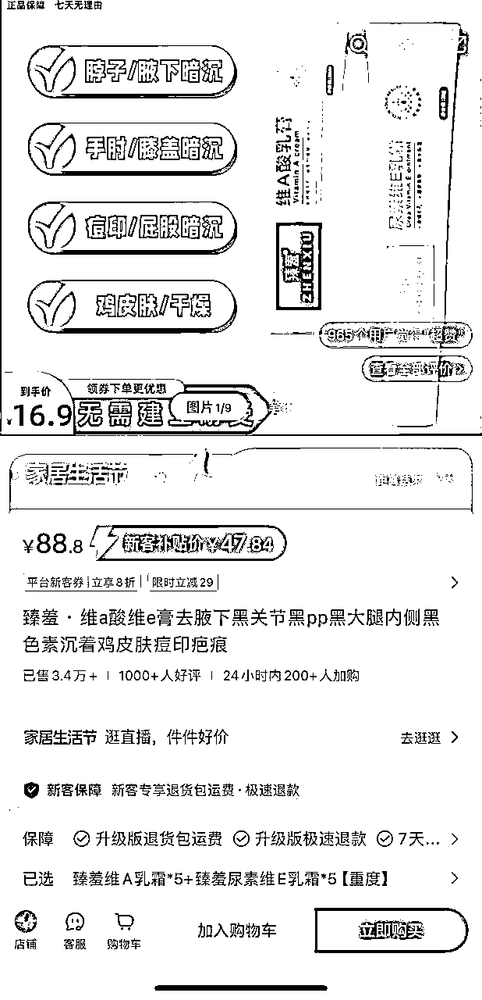

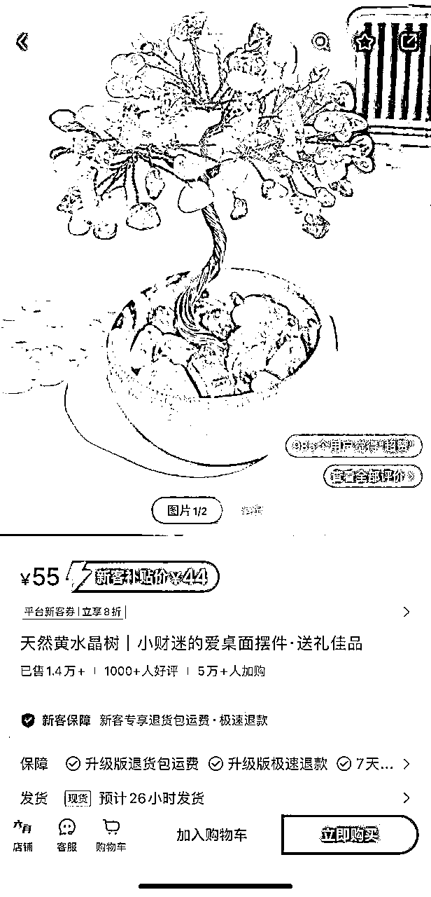

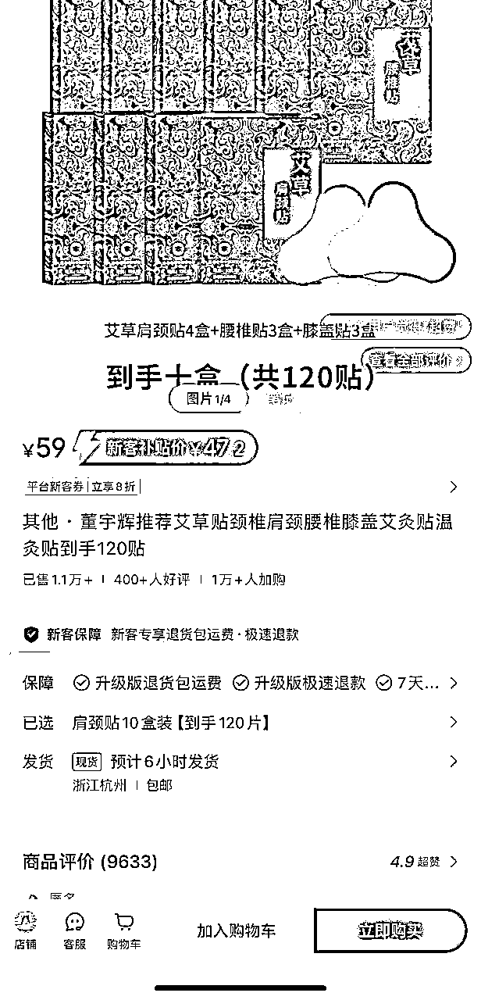

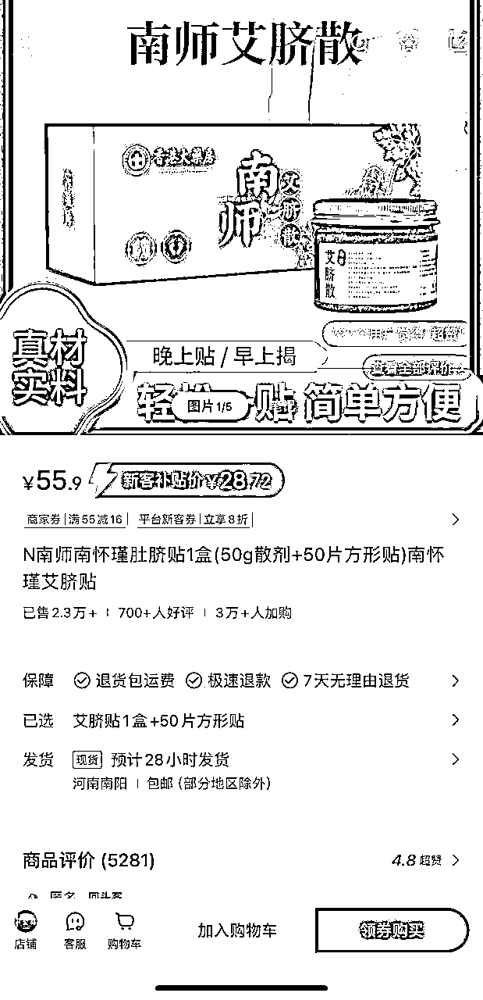

# 二、运营模式

关于小红书店铺的运营方法生财已经有很多精华帖子了，航海手册也有非常全面的指导，我就从自己实操的经验简单介绍一下我的操作模式。

## 选品

通过搜索蓝海词、细分关键词，找到合适的蓝海产品。

## 调研

找到蓝海产品后，对该产品进行全面的调研，包括：

*   产品月平均利润有多少？

*   看链接的总销量。一般需要1000以上

*   看竞争对手近期的销量。因为只有近期也有销量，才代表产品在当下依然有需求。我一般是这几个维度去判断，一是从对手链接的最近评价看，最近是否有商品评价；二是做统计，统计对手链接的销量数，统计7天，平均下来每天销量有多少（此方法只适合销量万件以下的链接，万件以上不展示具体销量数）；三是看对手链接24小时内加购人数，一般显示24小时内xx人加购，基本上都代表着当下正在出单，尤其是几百上千加购的，肯定是大爆品。

*   找到产品货源，看货源价格是多少（一般粗算的话就在1688上以图搜图看一件代发价格），再用对手的价格乘以销量再减去货源价，就是毛利（这里先不考虑退货率，或者用经验去判断）。再看对手的上架时间，平均下来就可以粗略算出月利润。同时，根据跟踪对手每日销量，也可以粗略算出对手当下每日利润有多少。

*   产品竞争度如何，笔记质量能否复制？

*   商品页搜索产品关键词，按销量排序，看销量前10的店铺里，旗舰店占比有多少，一般不要超过50%

*   商品页搜索产品关键词，按销量排序，看销量在300以上的店铺有多少，这个越少越好

*   推荐页搜索产品关键词，按最新排序，发布时间选最近一天内/一周内，看周期内有效竞争笔记数量（也就是挂车笔记），越少越好

*   推荐页搜索产品关键词，按最新排序，发布时间选最近一天内/一周内，看对手的笔记质量是否能复制，比如拍摄场景、出镜人物（如果有）、构图等能否去复制

## 上架

确定可以做就可以认真找货源，然后上架商品了。我一般找货源的渠道是1688和咸鱼，一般可规模化生产出来的产品1688上都有，对于比较小众的产品可在咸鱼搜索看看。

PS：两个找货源的小技巧

*   有时候在1688上找不到某个产品的货源，可能并不代表没有卖，而是商家并没有上架产品，但是他们是有货的，可以找到卖相似品的商家，再发图片问他们有没有你想要的这款

*   如果非常看好某个产品，但是找不到货源，可以尝试直接去淘宝、PDD、或者对手那里买回来再申请退货，他们给的退货联系电话可能就是货源方的，然后再联系这个货源方谈

## 拆解

确定对标账号后，就可以开始做拆解，因为要复制，就要知道怎么去复制，对标笔记为什么爆，它的爆点在哪里

*   收集对标

我一般在商品页搜索关键词，就能找到大部分的对标账号了，然后推荐页再搜一下笔记，基本上可以收集好

*   拆解爆款

拆解爆款是很重要的步骤，可以让自己在制作笔记的时候有方向，同时在不断拆笔记的过程中，也能增强自身的运营思维。

比如拆封面图，

布光方向是什么？

光线类型是什么？

搭配背景是什么？

搭配道具有哪些？

出镜的脸或手，是什么样的表情、动作？

产品拍摄是怎么构图的？

整体画面是怎么构图的？

搭配的文案内容是什么？文案是怎么放置的？

整个画面调动了怎样的情绪价值：塑造了什么样的场景感、氛围感、自我实现感

或传达了什么实用价值：自己少费力+神器+及时享受

*   分类存放

分类存放的意思是，下载对标的爆款笔记后，不是一起放在一个文件夹里，而是进行分类、重命名等，存放于不同文件夹，这样查找的时候才能更高效。因为有些对标做得时间比较久，爆款笔记也多一些，所有爆款笔记全部混在一起很容易乱成一团。

## 生产

因为我是走原创实拍的，所以确定好产品后一般会买样品回来，模仿爆款拍摄一部分，前期拍摄，后期调色、再参考对标笔记图片里的文案去添加文案，就是成品了。这里面需要的能力也不少，布光、布景、构图、拍摄、调色、修图等等，用到的工具，常规的就是醒图、美图秀秀，专业一些的是PS、LR等。

然后标题、正文什么的，都是收集好后，丢给AI让它模仿输出，一般AI都能做到个六七十分，觉得不够好的再人工润色一下就可以用了。

## 测试＆调整

我基本上一个号每天会发10篇左右，主要测的是封面、标题，以及笔记内容。比如哪篇笔记发出去没多久小眼睛数据就比较好，哪篇笔记最近出单多，尝试拆解分析为什么数据好，用的什么标题，图片是怎么拍的等，然后自己抄自己，参照拆解结果继续做相似笔记去测试。

## 个人案例

说一下我自己是怎么做起来这个品的吧。目前正常出单的账号是3个，在6月和7月爆过几次，实现了月GMV20W，那两个月到手利润有8W，之后就是每天在100~200单之间波动，产品的利润率在40%。

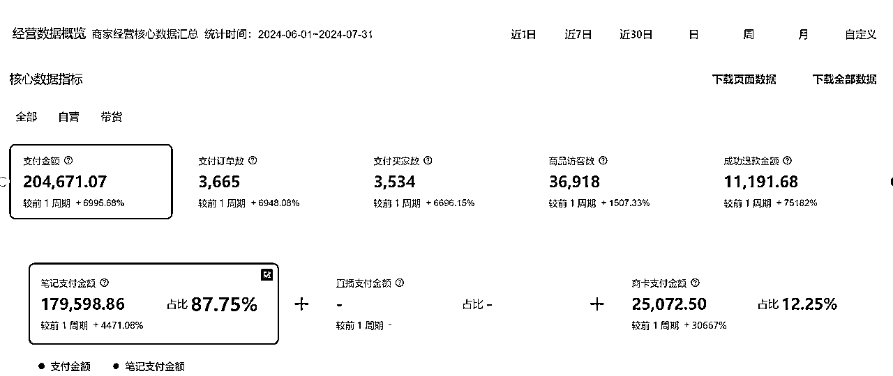

①选品

因为现在大环境不太好，而且通过平时的信息感知到，在现在这个环境下，大家对玄学更加青睐，而且玄学产品受众群体女性占比很高，非常契合小红书平台，所以我就尝试查找玄学产品关键词来找对标（找蓝海品）。

②调研

找齐对标后，做了一个整体的调研，包括：

*   产品在小红书平台最高销量

*   1688上找到货源看成本价，测算做这个产品的头部的总体利润

*   统计对标每天的销量、发笔记数量、涨粉量，看产品当下的需求情况，以及估算月利润

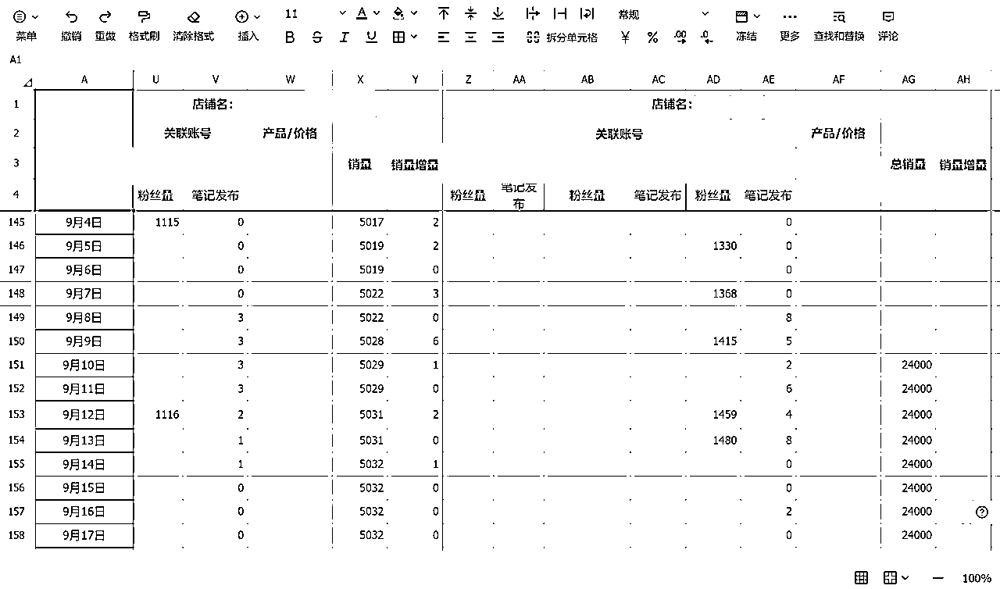

*   查看产品的有效竞争店铺/对手数量，最近1天内相关有效竞争笔记数量判断竞争度

*   判断销量高的对标账号的笔记质量自己是否能复制

③拆解

确定可以干以后，开始收集并拆解对标的爆款笔记。收集也很简单，直接复制进亨亨猫里下载下来，然后分类存放。拆解主要是从封面和运营方式这两块去拆。

封面拆解：封面拆解上段都有提到，这里就不再赘述，自己自制了一个拆解表格把详细拆解内容写清楚。

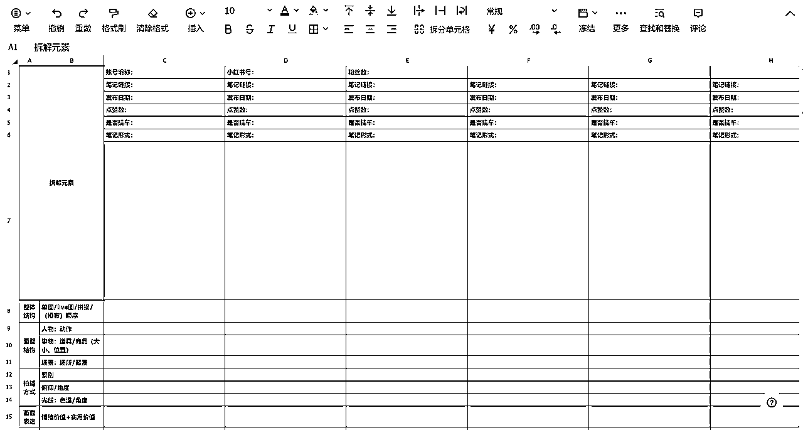

运营方式拆解：拆解运营方式主要是看这些爆款笔记里，封面、中间内容、结尾，有什么共通点，找到主要的“卖法”。

我当时发现对标会用一个框架模板，围绕一个运营逻辑来呈现笔记。

*   开头先用氛围感的背景、光线，结合产品不同的拍摄角度、道具搭配来塑造玄学感；

*   中间内容则是用一些案例展示增强用户信任，激发用户也想要实现的需求；

*   结尾则是对产品整体和配件的卖点介绍，以及使用方法说明。

基本上销量高的对标都是这个框架模板和运营逻辑。

④生产

拆解完后，就模仿爆款笔记制作素材。从实拍到后期，都尽量做到模仿对标。我一般是每隔三、四天会拿一整天拍一次，其它时间都是在制作笔记、发布测试、复盘优化等。

记得当时实拍遇到的最大的难点是灯光和背景。因为这个品在用灯光和背景来塑造玄学感上，对笔记有很大作用，而对标用的灯光有些特殊，不是普通的摄影用的常亮灯或闪光灯，我自己也是花了很多精力和时间去找这类的灯。某宝长得有点像的都买回来试过，不行又退回去。自己还分析了光线样式，去尝试买其它发光物件测试，甚至买过单独的COB灯珠自己组装。一路做下来，不同的灯光拍了很多图片，最后还是靠找人定制，才算做到了基本上还原了那种光线。

之后是后期调色和添加文字，因为拍摄设备档次和所在环境的原因，不太可能原图就很完美，实拍完后基本上都要做后期。我是美图秀秀、PS这些一起结合着用，虽然论专业性美图秀秀肯定比不上PS、LR，但也有自己的优点，比如贴纸很多，文字款式很多，而且无论是调色还是添加文字，这些工具都有批量功能，都可以批量生成。

标题和正文是最简单的了，直接复制对标的下来，扔到AI里就可以了，AI仿写出来的基本上能做到六七十分，自己再人工润色调整一下，把爆款标题、正文里出现概率高的词汇添加进去就可以用了。

⑤测试＆调整

在素材制作完成后，就是每天发笔记测试。因为实拍图片的效率还是很高的，一次拍个几百张没问题，后期批量调色就基本上可用了。

在测试过程中，我也会经常复盘对标的爆款笔记和自己制作的笔记的差别，以及数据反馈上的结果，去调整优化。复盘对标时我写的复盘思维导图都迭代了十多遍。这个产品刚开始也是没有什么起色，每天发笔记，每天数据惨淡，让我坚持下去的动力是每天看到对标账号的利润很香，然后继续复盘，拆分步骤，优化自己的操作，把能做得更好的地方都做到位，在坚持了两个月多后，曙光才终于来临。

在我看来，小红书不是一个即时反馈的平台，它的平台调性就是这样，但是它又是一个很有长尾的平台，一旦做起来，一旦一篇笔记能爆，这篇笔记是可以帮你赚很久的。所以做小红书，坚持很重要，耐心很重要，只要方向正确，方法正确，是一定能等到黎明时刻的。

# 三、选品方法（重点）

蓝海产品的核心是词根，找到蓝海词根，就能挖出相应的产品。我找词根的方法主要有以下几种

## 原始词根

所谓的原始词根，就是一个大词，在这个大词的基础上可以衍生、细分出更多的相关词汇。

例如夏季有一个很重要的需求就是防晒，那么“防晒”就可以看做是一个大词，在这个大词下可以细分出很多相关需求，防晒衣、防晒裤、防晒口罩、防晒帽等，还有针对人群可以有儿童防晒、男生防晒、婴儿防晒等

那么原始词根去哪里找呢？我主要用到的方法是

### ①热搜词

*   淘宝热搜

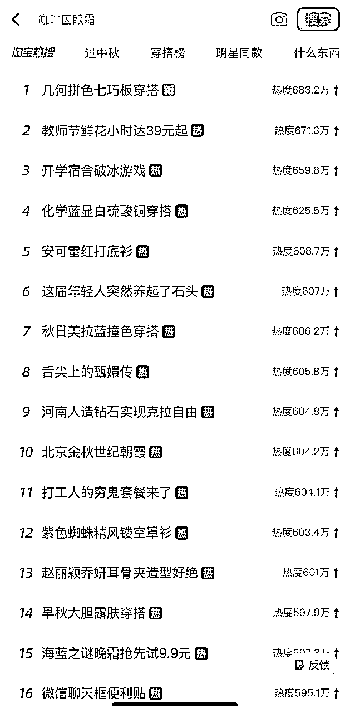

*   1688热搜

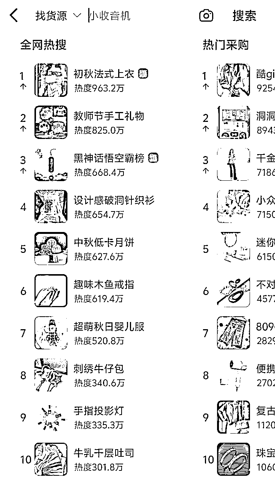

*   小红书热搜

### ②报告指南

很多时候，平台方或者一些社群、机构会提供基于用户购物行为调研、汇总出来的一些研报、报告，里面提到的一些需求关键词、品类关键词都可作为参考，特别是适合于应季产品、垂直类目。

*   巨量算数—算数报告

*   电商群

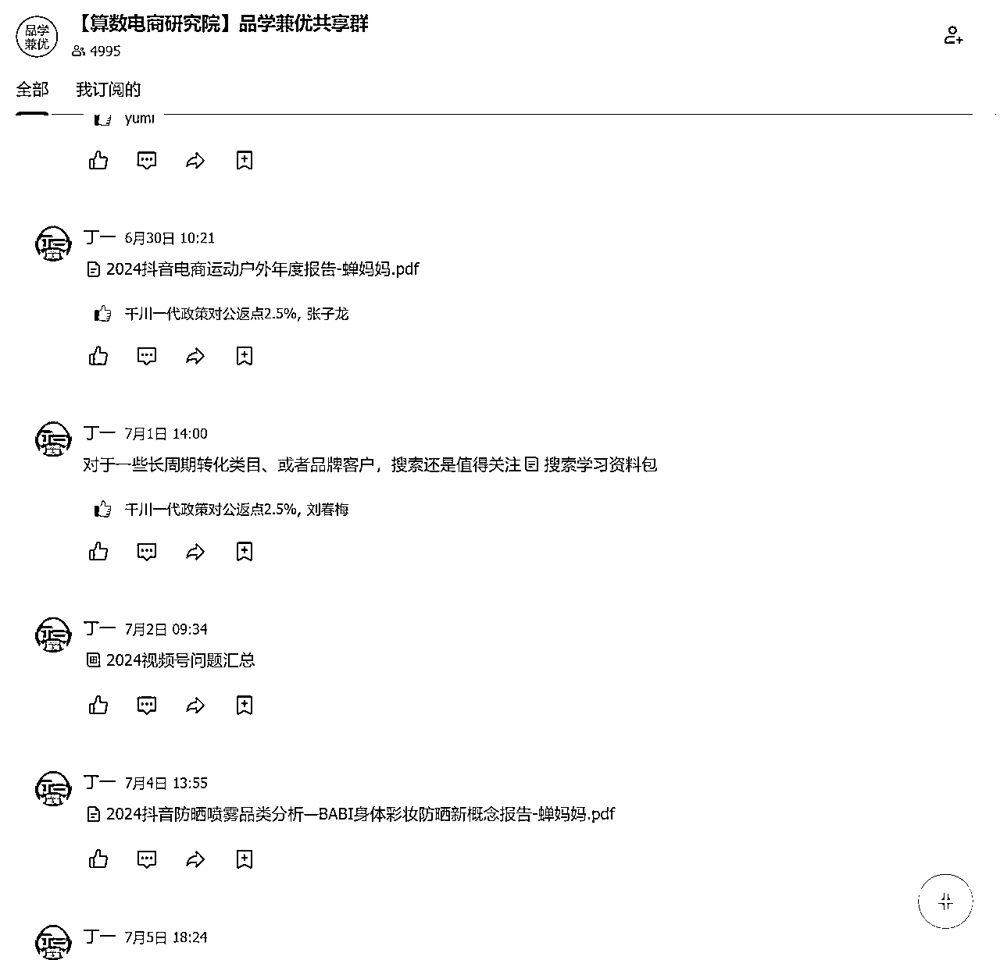

### ③类目查找

用类目关键词作为原始词根，这是个笨办法，但好处是比较全面，有很多我们想不到的词都可以在上面找到。

*   买购网

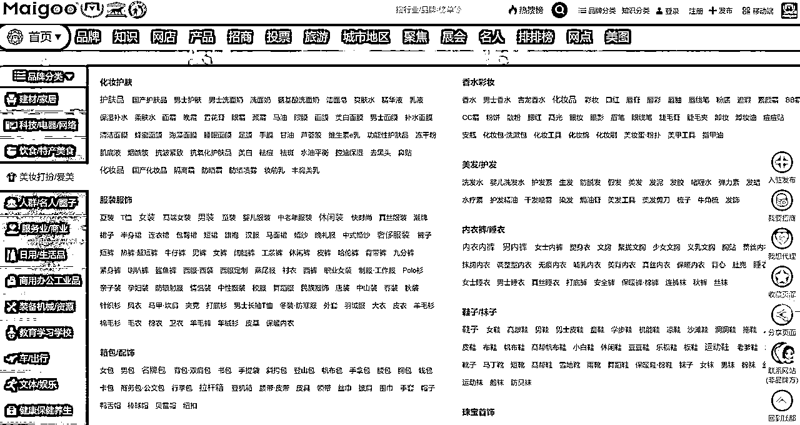

*   淘宝网—商品分类

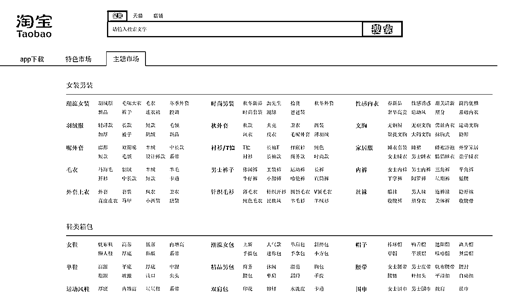

*   小红书商机中心

小红书的商机中心不但有小红书平台最全面的类目分类，还有基于大数据统计出来的近期的机会类目，也是一个很重要的选品渠道。

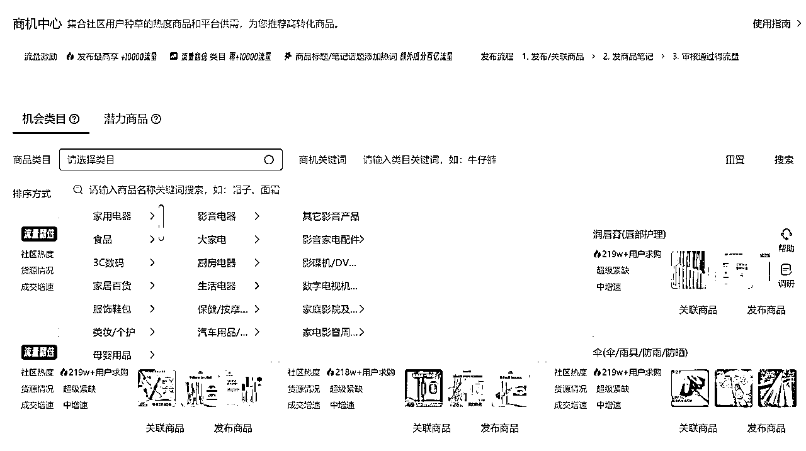

### ④日常积累

由于自己做过淘宝，积累了一些赛道、品类的细分关键词，例如人群需求、运动爱好、应季需求等，边选品边积累，就可以慢慢扩充自己的产品词库，积累选品感觉，选品的效率就更高了。

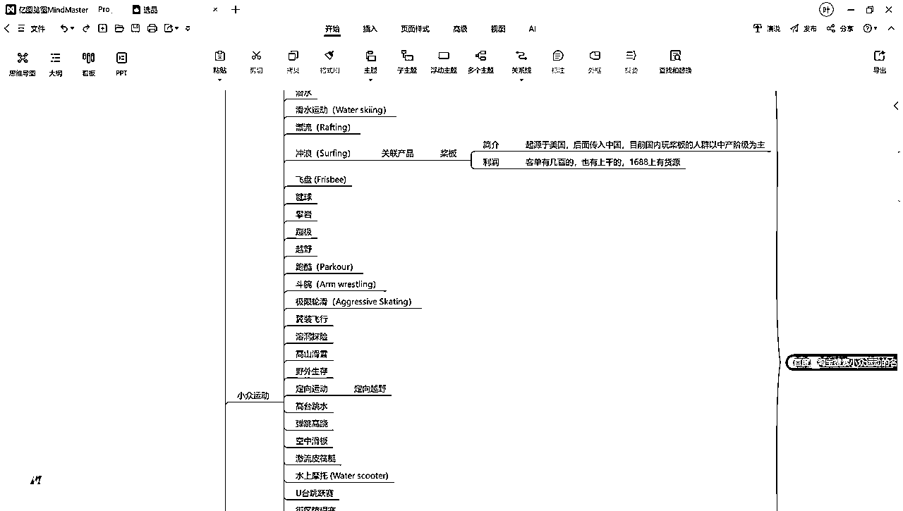

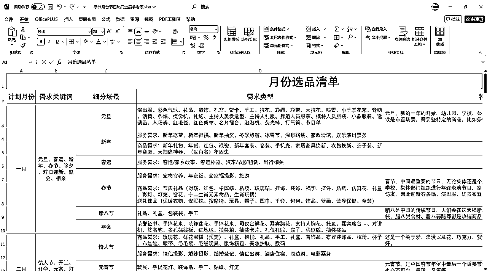

## 拓展关键词

有了原始词根，接下来就可以依据词根去拓展细分关键词，查找更多细分产品词、品类词。

### ①搜索栏下拉词

搜索栏下拉词是最常用的一种查找方式，但我这里推荐的不是什么百度搜索、360搜索、微信搜索，而是直接货架电商的搜索栏搜索。因为常规搜索可能搜出来的是用户具体的问题、需求，而不是一个关键词。

例如在百度搜索“防晒”，下拉展现的是“防晒霜哪个牌子好”、“防晒喷雾能带上飞机吗”，这是问题，不是关键词，

而只有货架电商的搜索栏，下拉推荐的才是更细分的产品、品类关键词。

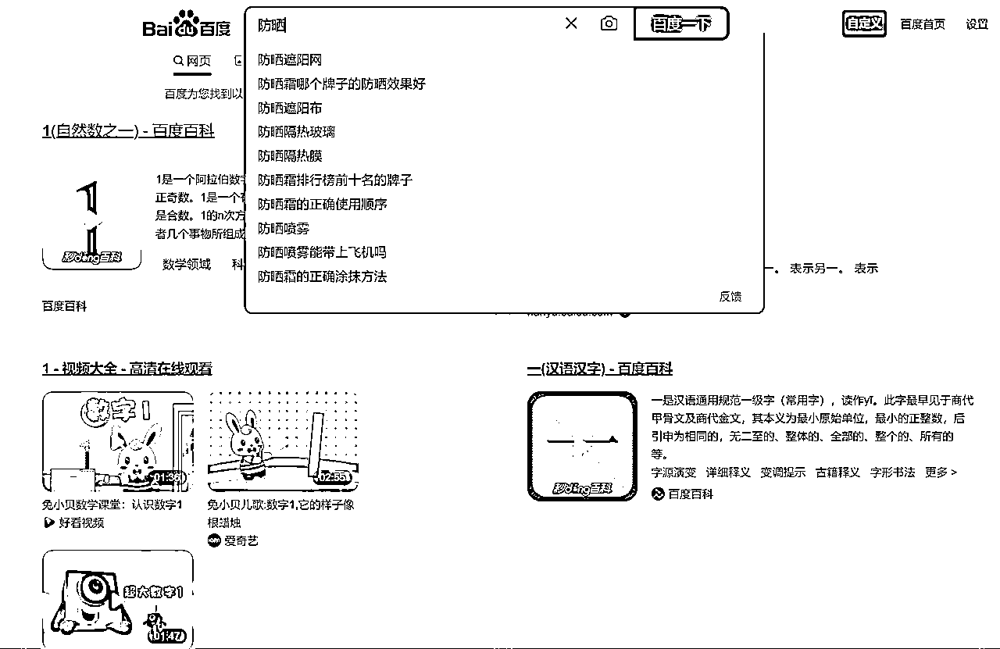

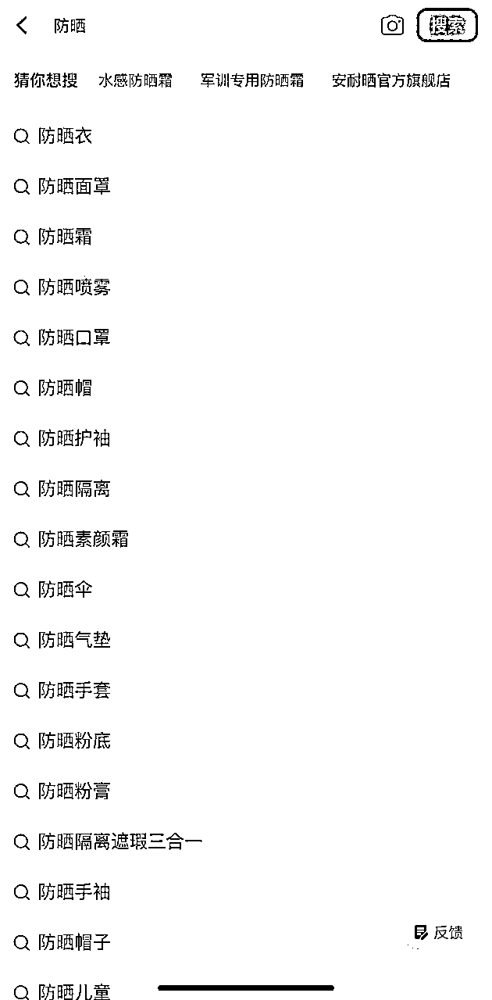

我目前用的比较多的搜索栏是，淘宝搜索栏、抖音—商城搜索栏、小红书—商品搜索栏。

### ②关联词挖掘

*   巨量算数—算数指数

抖音的算数指数也是一个很好用的关联词挖掘渠道，抖音的大数据能力毋庸置疑

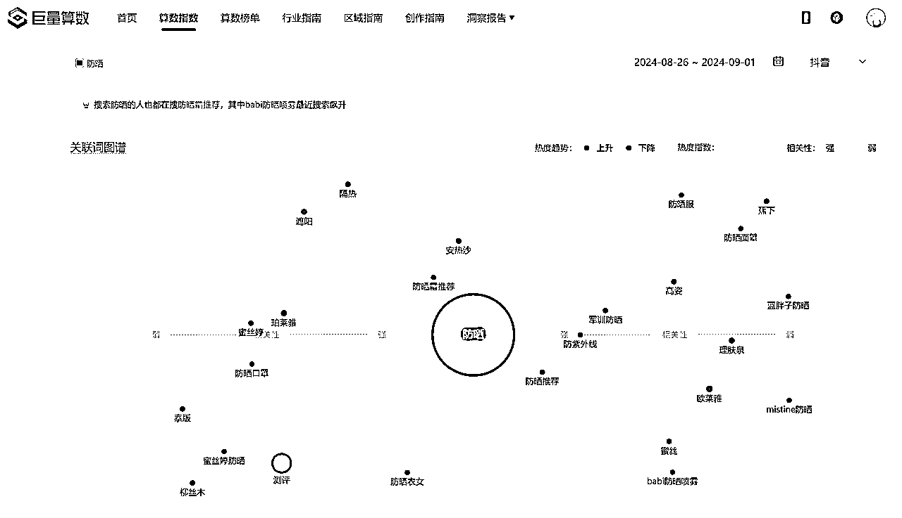

*   深言达意

深言达意是一个人工智能驱动的文本信息处理引擎，可根据模糊描述找词找句。

*   5118—相关词

5118是老牌的工具网站了，词库非常庞大。

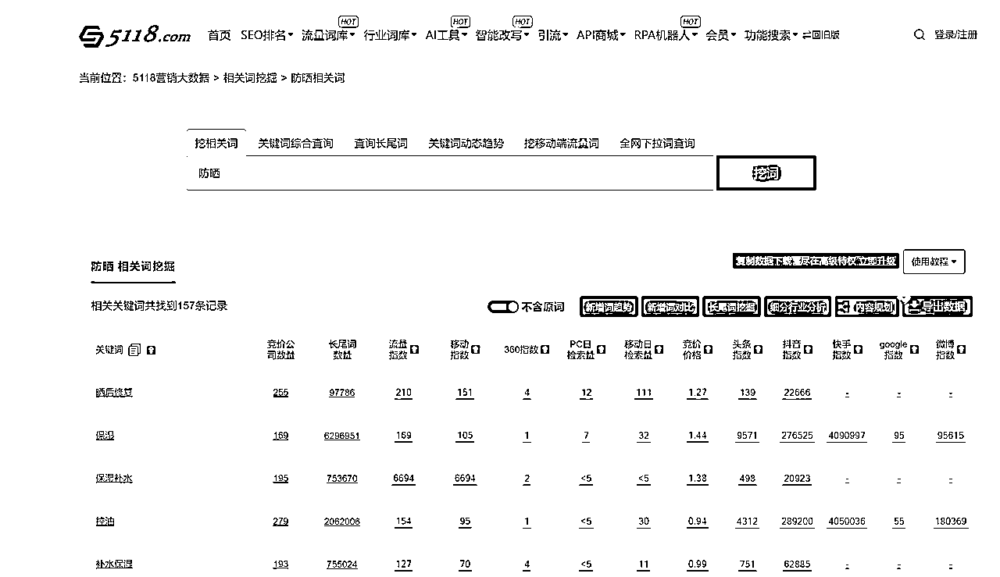

*   商品链接标题关键词

商品链接标题里，也包含很多产品词，而且很多标题是包含细分关键词的，可以拿这个细分关键词来尝试搜索，挖掘蓝海。

例如：搜索“枕头”，发现细分关键词“反牵引颈椎枕头”

例如：搜索“护颈”，发现细分关键词“加热艾草枕头”

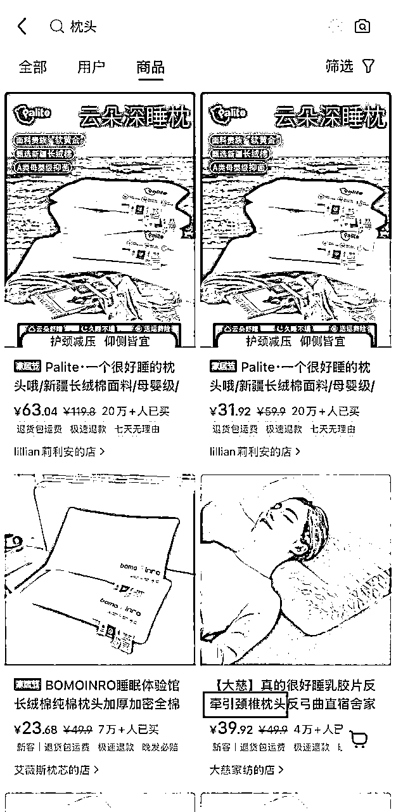

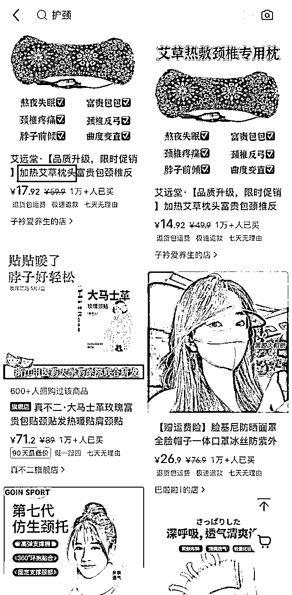

## 挖掘蓝海

接下来就可以去小红书搜索，找到该关键词下的蓝海产品、对标账号，去复制他们。

这里有一个很关键的点就是，不要在推荐页搜索，搜索出来的都是笔记效率不高，而应该在商品页搜索，然后按销量排序，找品的效率就会比较高。（此方法只适合找已在小红书平台开通店铺的产品，靠笔记引流私域、第三方平台的产品不适用）

举个我自己的案例。之前在找养生相关产品的时候，做过一个儿童足浴包的品，但因为没法产出很多原创素材，后面放弃了。

大概的选品方法，首先是在商品页搜索关键词“养生”，但是大部分都是养生茶。但是养生不可能只有养生茶这一种方式，于是又在买购网搜索养生，找出来了很多和养生相关的细分词。挑选几个词去搜索，就找到了儿童足浴包这个商品了。

# 四、入局小红书蓝海建议

对于小红书的蓝海，我感知下来现在并没有很激烈，有很多类目都有人在赚取着不错的利润，但是需要的能力一样也不少，除了选品这条硬指标外，还有对标爆款的分析能力，自身的内容能力，包括前期拍摄、布光、布景、构图，后期的调色、修图等素材的产出，还有对笔记的运营能力，对店铺的运营能力等等，每一条都不简单。

即便如此，赚钱从来就不是一件简单的事不是么，是对自身综合业务能力以及智力、体力、心力的综合考验。

小红书蓝海有一个非常大的优点就是，你可以靠爆款笔记让收益维持很久（内容合规的前提下），而不必担心像女装这类款式类的商品，一旦周期一过，需要继续找新的爆款。

所以小红书蓝海目前是值得入局尝试的一个方向。