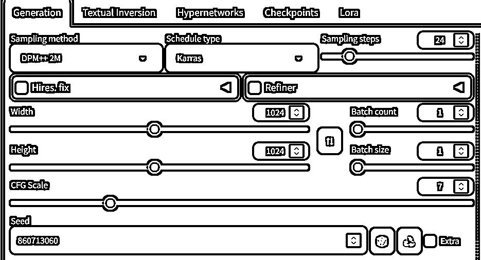
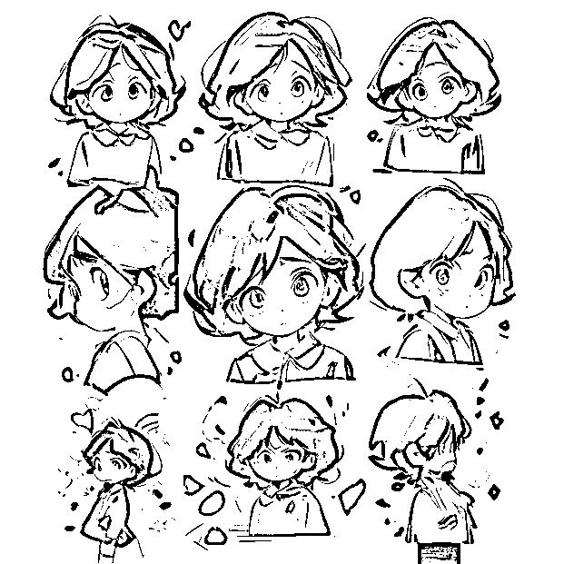
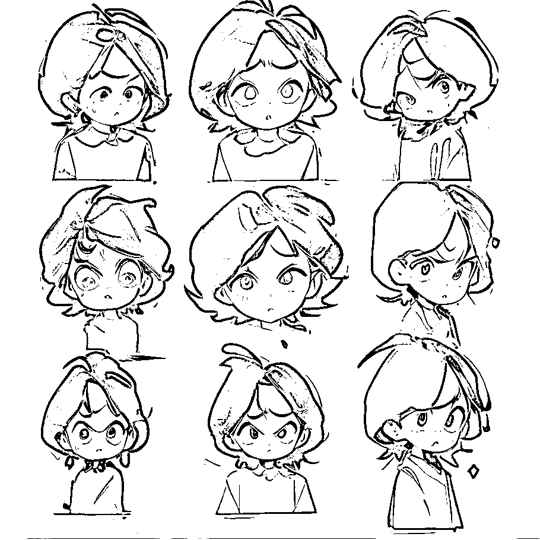

# 搞钱机器设计挑战！批量表情包工作流变现实践

> 来源：[https://kyc6qz7fy7.feishu.cn/docx/KYtddZKb7ojLt8xiFtnc9uC4nVe](https://kyc6qz7fy7.feishu.cn/docx/KYtddZKb7ojLt8xiFtnc9uC4nVe)

# 项目介绍

大家好，我是哩厘锂力。这个项目其实是Coze航海领队佳文发起的搞钱机器设计挑战，目标是从生财的风向标中找到一个项目，用国庆7天的时间将其转化为Coze的工作流，变成自动化赚钱机器。

我选中的项目是批量表情包，风向标链接是https://wx.zsxq.com/group/1824528822/topic/5121525215188554

做这个项目完全是为了逼自己一把，想跑出内容容易，真的要变现对质量还是有不小要求的。特别是从小红书搜到这个项目的原帖时发现，作者的目的是通过这个项目引流然后做培训。我在这里的目标也是优先跑通项目，抛砖引玉。

虽然这是个Coze的挑战任务，但是我不是在Coze上把这个项目跑起来的，因为Coze的图像生成能力有限，而生成表情包需要特定的模型并使用专门的AI绘画工具（本地运行的Stable diffusion WebUI、ComfyUI或者其他在线工具。这里特别提一下ComfyUI，这个工具也是工作流的形式，功能强大，生财也有相关的文章介绍）。

在这篇文档里，我着重于如何跑通MVP，不会专门讲解怎么做ai绘画，所以阅读需要有基本使用AI绘画工具的经验。

# 个人介绍

我本职是大厂程序员，工作内容就是负责训练或者优化ai模型，包括图像生成模型和语言模型。加入生财的原因是看到了朋友给推荐的出海工具站项目，我本来就打算做一些能长期积累的项目，增加副业收入，但是没有找到合适的机会，生财正好满足了我的需求。

# 加入航海

第一次航海我报名了出海工具站和Coze两个航海。其实我日常工作的内容和Coze要做的事情非常接近，都是通过搭建一些流程，把AI模型嵌入到工作中。但是我仍然报名了Coze航海，因为做一个工作流最重要的不是实现这个过程，而是想法和拆解。一个工作流哪怕再复杂，一旦有人做出来，你照着一点一点搭建，一点一点排错，最后总是能运行的。实在不行，还可以花钱请别人帮你实现。

参加航海最大的收获就是，能看到大家把自己独有的想法用工作流来实现。在生财我一开始是疑惑的，一些AI项目输出内容的质量在公司里是根本不会被认可的，但是在生财大家就是能靠这样的成果变现。工作中我的任务是在有整体流程的情况下不断提升模型的效果，而在生财要做的则是从想法到结果用最简单最直接的方法跑通。我也开始理解，为什么很多技术人员，在脱离公司的环境后就无法赚钱了。

# 流程

## 需求

需求其实很简单，通过AI绘画模型，生成表情包样式的图片，然后上架到各种平台，通过赞赏变现。

但是有一些隐含需求，图片之间风格和人物要一致，同时又要有区别，体现不同的表情，这样才是一套表情包。

## 拆解

在拆解前，我先总结了一下AI绘画模型在这个项目里的优缺点。

优点：

*   质量较高：AI绘画技术已经发展到了一个比较成熟的阶段，一般能够超过平均水平，可以被用户接受。

*   大量生成：利用AI，可以在短时间内大量生成表情包。

*   低成本：除了订阅AI工具的费用，生成表情包的过程几乎不需要其他开销，而且相较人类画师，时间成本也几乎可以忽略。

缺点：

*   效果不稳定：尽管AI生成的表情包质量较高，但效果并不是每次都完美，需要进行多次尝试并从中挑选最佳结果。

*   图片间缺少一致性：由于每次生成的结果都是独立的，AI生成的内容缺少一致性，而表情包对一致性要求很高。

*   对提示词要求高：AI生成的效果很大程度取决于输入的提示词，一套能产生优秀结果的提示词是关键。

具体拆解：

1.  生成提示词

1.  使用提示词生成内容

1.  循环步骤1和2生成更多内容

1.  将得到的表情包进行挑选并人工处理为平台需要的格式

## 流程

1.  先下载模型，生成表情包需要的lora模型可以在 https://civitai.com/ 或者https://www.liblib.art （还有很多别的站点，不一一列举了）搜索sticker。有的lora有底模要求，有的比较宽松，根据选择的lora模型挑选底模。

1.  我这里选择https://civitai.com/models/119163?modelVersionId=129369作为底模和https://civitai.com/models/124806/sdxlstickers 作为lora

1.  这个lora生成的表情是九宫格形式的，好处是可以一次得到几张相对一致的人物，缺点是需要抠图，以及单张表情的质量略差。

1.  生成提示词

1.  提示词可以在模型网站上找到别人生成好的图片直接抄过来，我使用的提示词就是在模型介绍页里直接找的

1.  正面提示词：

```
parameters stickers,biaoqing,stickers of girl in blue, white background,simple background,emotional,illustration,best quality,highly detailed,masterpiece,an extremely delicate and beautiful,extremely detailed,8k wallpaper,Amazing,finely detail,official art,
```

1.  负面提示词：

```
lowres,bad anatomy,bad hands,text,error,missing fingers,extra digit,fewer digits,cropped,worst quality,low quality,normal quality,jpeg artifacts,signature,watermark,username
```

1.  提示词中的人物描述根据自己的需求来，设定人物的样貌衣着

1.  因为是表情包，往往是要表达一定情绪的，所以需要加一些可以体现人物心情的描述。这个可以参考微信上的其他表情包，先用中文描述人物动作，然后翻译成英文。

1.  生成图片

1.  这一步可以多尝试几次，用不同的设定和随机数种子，直到找到自己满意

1.  我的设定



1.  生成出来的图片



1.  固定随机数种子的同时修改提示词，然后重新生成

1.  固定随机数种子的目的是解决内容一致性问题，不同的随机数种子就好比不同的平行世界，而提示词则是你在这个世界做出的选择。只修改部分提示词就好像你想试试如果在过去做了一个不同的选择，未来会变成什么样。

1.  这是我修改后的提示词，区别是加了一些表情的描述

```
parameters stickers,biaoqing,stickers of girl in blue with Pouting face, white background,simple background,emotional,illustration,best quality,highly detailed,masterpiece,an extremely delicate and beautiful,extremely detailed,8k wallpaper,Amazing,finely detail,official art,
```

1.  图片



1.  从生成的图片中进行挑选，然后把需要的表情抠下来整理好，上传到对应平台。

## 其他提升方法

1.  使用controlnet的reference only提供人物形象参考，提高形象一致性。

1.  优化提示词

1.  选择效果更好的模型

1.  自己训练人物lora

1.  使用其他效果优化的插件

# 总结

流程不是很复杂，但是可以修改的地方很多

*   模型、lora

*   提示词

*   参数

*   是否使用controlnet等插件

每一个可以调节的参数展开，可能都要花上半天时间。因为时间有限，我这里就没有继续做更多尝试了。

要想提升效果，一方面是多积累，尝试过有效的提示词可以记录下来，也可以经常看别人的作品，学习一下别人是怎么优化效果的。