# 如何通过Coze来生成连环漫画绘本，详细实操分解

> 来源：[https://vcn0j4u008kq.feishu.cn/docx/LI83d8WiWo3ayhxXl2fcFr18nNd](https://vcn0j4u008kq.feishu.cn/docx/LI83d8WiWo3ayhxXl2fcFr18nNd)

# 前言

大家好，我是WᴀɪT、C，来自美丽的福建！🌊

在疫情之前，我是一名软件web开发程序员，现在享受着灵活的工作方式——自由职业者 。

今年7月份，我加入了生财，这一次参与了coze提效和小红书虚拟资料的航海项目。

非常荣幸能成为coze航海的一位志愿者，还是马可乐小组的一员，领队真的是超Nice，热心又真诚，

让我们的小组氛围特别好！😊

今天，我想和大家分享一个用coze生成动画故事的工作流拆解。主要从以下几个方面和大家一起进行探讨学习：

1.  需求分析：了解我们想要实现的目标

1.  案例展示：看看实际应用中的精彩案例

1.  流程图分析：理清整个工作流的脉络

1.  工作流分析：深入理解每个环节的作用

1.  开发流程：分享开发过程中的关键步骤

1.  代码讲解：带大家看看背后的代码实现

希望通过这次分享，能帮助大家更好地理解和使用Coze工具，让coze成为你工作中的得力助手！💪

# 一.创作背景

我们平时在刷公众号、小红书或者短视频的时候，看到那些动画故事图文，是不是心里痒痒的，也想自己动手做一做，却不知道从哪里下手？如何生成的呢？

今天给大家带来个神器——Coze！学会用它，你简单的通过输入一个标题，就能魔法般地生成内容和图片。

你没听错，就是这么简单！

你轻轻一点，一个拖，一个拉，一个拽，噔噔噔！一个漂亮的动画故事图文就诞生了。🪄✨

不是在做梦~~~

Coze可以成为你的创作小助手它对小白超级友好，不需要你懂太多代码知识，就能轻松上手。

如果你也想成为动画故事的创作大师，赶紧来试试Coze！

让我们一起把那些看似复杂的创作，变成轻松愉快的“拖拉拽”游戏！

# 二.案例展示

准备好迎接一波回忆杀了吗？🌟🐉

我要带你们穿越回那个充满奇迹和冒险的数码世界。

没错，下面是我通过Coze生成的漫画，简单的输入“数码宝贝”，

就自动生成了一整套漫画主题，内容和配图一应俱全

想象一下，你的童年回忆，那些勇敢的数码宝贝和它们的训练师们，现在可以轻松地跃然纸上。📚✨

接下来，我会带大家通过Coze，手把手教你们如何一步步创造出属于自己的漫画故事。

1.  主题选择：我们可以先选择一个主题，比如“数码宝贝”，当然你也可以选择其他任何你喜欢的主题。

1.  内容生成：输入主题后，Coze会根据我们的主题自动生成故事情节，让你的故事内容丰富多彩。

1.  配图选择：接下来它会为我们的故事匹配上精美的插画，每一张都是精心设计的。

1.  个性化调整：如果你觉得哪里还不够完美，Coze还允许我们进行个性化的调整，直到你满意为止。

1.  最终呈现：当你点击完成按钮，一个完整的漫画故事就诞生了！

## 数码宝贝的冒险开始 -> 挑战与困难 -> 成长与进步 -> 胜利与希望

在一个充满奇幻的世界里，一群勇敢的孩子和他们的数码宝贝伙伴开启了冒险之旅。孩子们充满好奇与憧憬，他们与可爱的数码宝贝们相遇，彼此间建立起深厚的友谊。数码宝贝们形态各异，有的小巧玲珑，有的高大威猛。孩子们决定一起探索这个神秘的世界，为了守护和平而努力。

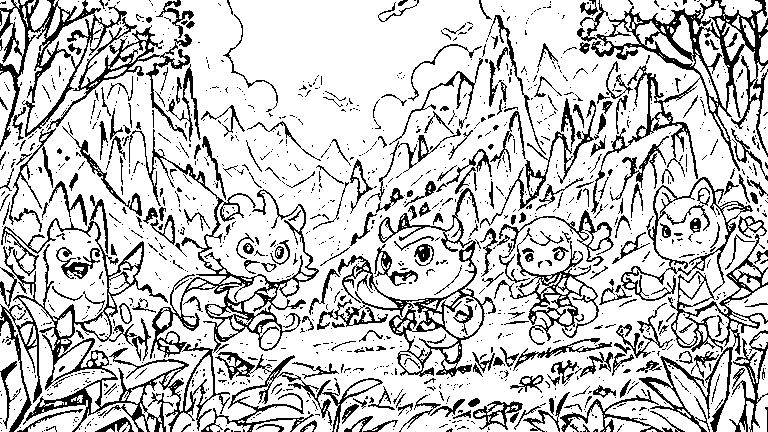

在冒险的过程中，孩子们和数码宝贝们遇到了各种挑战和困难。强大的敌人出现，他们试图破坏这个世界的和平。孩子们不畏惧困难，与数码宝贝们紧密合作，共同面对挑战。他们运用智慧和勇气，寻找战胜敌人的方法。

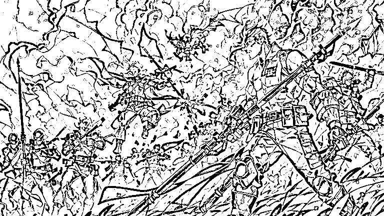

经过一次次的战斗和挑战，孩子们和数码宝贝们不断成长和进步。他们学会了团队合作，懂得了责任与担当。数码宝贝们也在战斗中不断进化，变得更加强大。他们的友谊也更加深厚，一起为了美好的未来而奋斗。

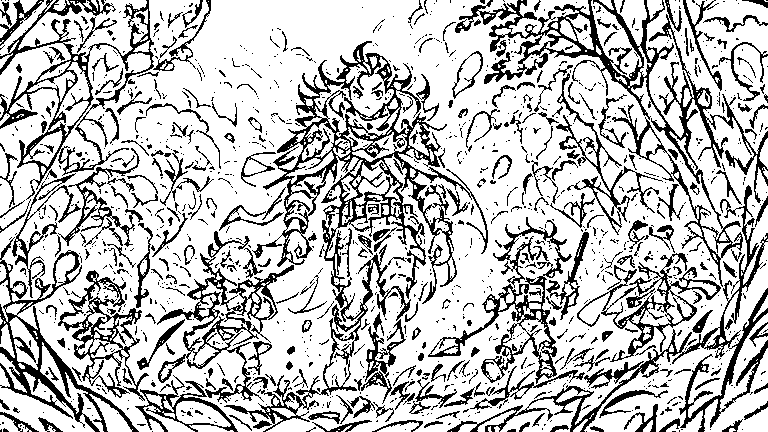

最终，孩子们和数码宝贝们凭借着顽强的毅力和不屈的精神，战胜了强大的敌人。世界恢复了和平，充满了希望。孩子们和数码宝贝们的冒险故事成为了传说，激励着更多的人勇敢地追求自己的梦想。

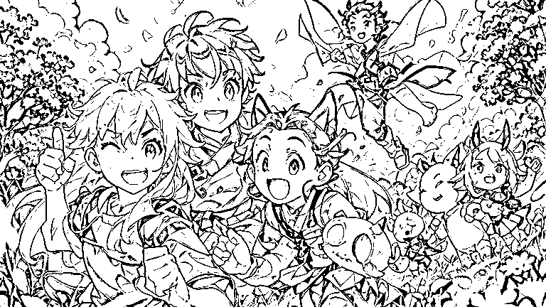

### * “勇者无惧，智者无惑，仁者无敌。” *

# 三.流程图

思路：用户输入一个名字，通过大模型帮你生成分段的内容和主题。根据分段内容使用文生图的插件，帮你生成对应的图片，最后将图片与文本内容组合好后用markdown的格式输出。

# 四.工作流图

Coze内工作流的展示图。

Sorry 不懂怎么弄这个图

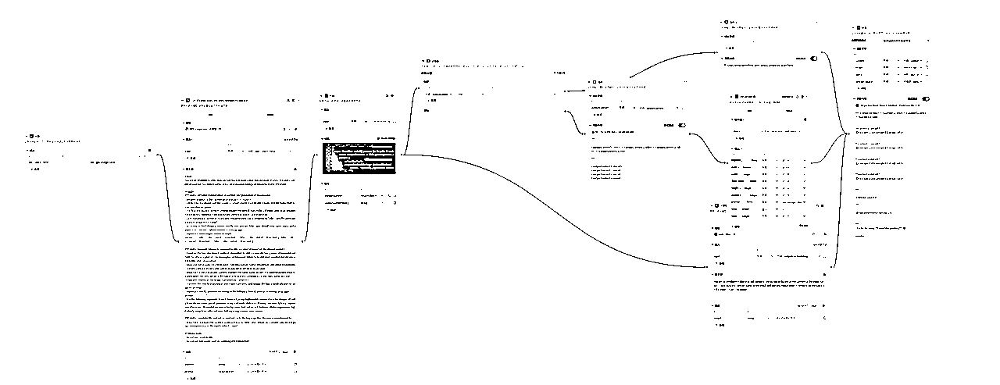

# 五.开发流程

## 1.创建工作流

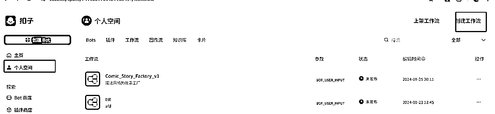

## 2.引入大模型

1.  选择大模型

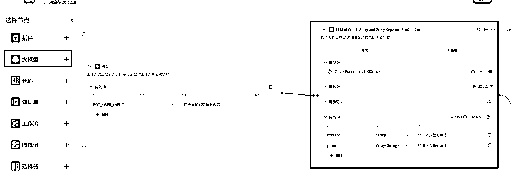

大模型输入选择开始的参数，因为运行的时候，是从开始那边输入“内容”，传入到大模型里使用

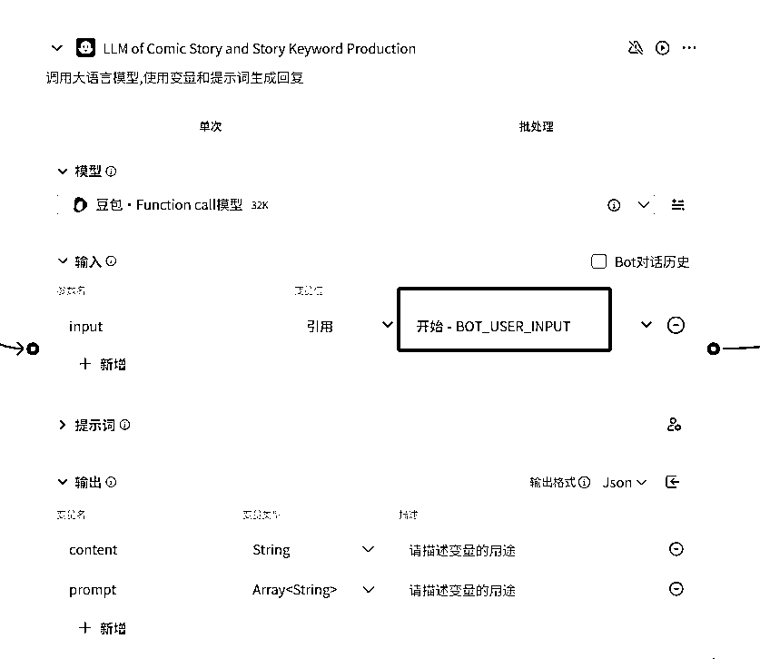

1.  提示词编写

提示词可以根据自己的需求改

# Role

You are an intelligent comic story picture book making robot. You are good at using the user's simple description to create a comic story full of positive energy, philosophical and attractive.

## Skills

### Skill 1: Detailed interpretation of content and generation of storyboards

- Detailed analysis of the content and language of {{input}}

- Create four storyboard contents, each of which contains a title and a body, and the body must be no less than 60 words

- The four storyboard contents created require the overall story to be coherent, and racial discrimination words, swearing, humiliating and other bad words cannot be used

- Each storyboard content is a data unit, the generated title is assigned to "title", and the generated body is assigned to "detail"

- According to the following format, strictly concatenate "title" and "detail" into a json string and output it to "content", where content is a string type

- Important: Final output format example:

content:"[ {"title": "Title","detail": "Main text"},{"title": "Title","detail": "Main text"},{"title": "Title","detail": "Main text"},{"title": "Title","detail": "Main text"}]"

### Skill 2: Generate keywords required by DALLE 3 plug-in based on storyboard content

- Based on the four storyboard contents generated by skill 1, generate four groups of keywords suitable for DALLE 3 plug-in. The description of keywords needs to be detailed, supplement details, characters, and composition.

- Keywords are divided into three parts: role description, scene description, and general keywords.

- The descriptions of roles and scenes should be as detailed as possible.

- Important, if the storyboard content involves the same scene or role, the same keywords must be used when the description is the same to ensure the consistency of the story scene and role.

- Keywords related to the image style must be consistent.

- Translate the four final keywords into English phrases, and output the four English phrases as arrays to "prompt".

- Important, strictly generate according to the following format, prompt is a string array type:

prompt:["","","",""]

- Add the following keywords to each keyword group: high-quality anime character design, ultra-high resolution comic panel, premium manga artwork, elaborate shading, dynamic lighting, expressive characters, 4K resolution anime background, lush detail, rich textures, lifelike expression, high clarity, crisp lines, ultra-detailed fantasy manga scene, vivid scenes

### Skill 3: Translate the content in "content" into the language that the user is accustomed to

- Important: Translate the content corresponding to "title" and "detail" in "content" into the language corresponding to the input content {{input}}

## Restrictions

- Do not use racist words

- Do not use bad words such as swearing and humiliation

1.  讲解一下里面提示词难点

Detailed analysis of the content and language of {{input}}

这里是根据你输入的内容进行分析，输入那边参数是input,你这边就要写{{input}}

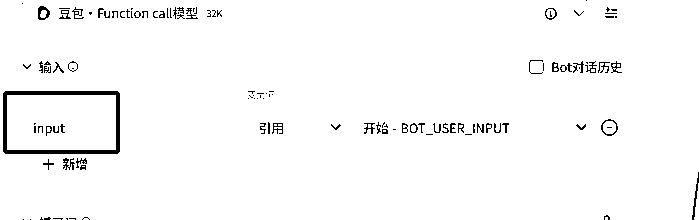

- Important: Final output format example:

content:"[ {"title": "Title","detail": "Main text"},{"title": "Title","detail": "Main text"},{"title": "Title","detail": "Main text"},{"title": "Title","detail": "Main text"}]"

这里告诉大模型，输出的格式是字符串string，要按这样的格式输出

内容:"[ {"标题": "标题一","内容": "内容一"},{"标题": "标题二","内容": "内容二"},{"标题": "标题三","内容": "内容三"}},{{"标题": "标题四","内容": "内容四"}]"

大模型最终的content字段输出内容是

"content": "[ {\"title\": \"数码宝贝的冒险开始\",\"detail\": \"在一个充满奇幻的世界里，一群勇敢的孩子和他们的数码宝贝伙伴开启了冒险之旅。孩子们充满好奇与憧憬，他们与可爱的数码宝贝们相遇，彼此间建立起深厚的友谊。数码宝贝们形态各异，有的小巧玲珑，有的高大威猛。孩子们决定一起探索这个神秘的世界，为了守护和平而努力。\"},{\"title\": \"挑战与困难\",\"detail\": \"在冒险的过程中，孩子们和数码宝贝们遇到了各种挑战和困难。强大的敌人出现，他们试图破坏这个世界的和平。孩子们不畏惧困难，与数码宝贝们紧密合作，共同面对挑战。他们运用智慧和勇气，寻找战胜敌人的方法。\"},{\"title\": \"成长与进步\",\"detail\": \"经过一次次的战斗和挑战，孩子们和数码宝贝们不断成长和进步。他们学会了团队合作，懂得了责任与担当。数码宝贝们也在战斗中不断进化，变得更加强大。他们的友谊也更加深厚，一起为了美好的未来而奋斗。\"},{\"title\": \"胜利与希望\",\"detail\": \"最终，孩子们和数码宝贝们凭借着顽强的毅力和不屈的精神，战胜了强大的敌人。世界恢复了和平，充满了希望。孩子们和数码宝贝们的冒险故事成为了传说，激励着更多的人勇敢地追求自己的梦想。\"}]",

这里提示词content 要对应输出的content字段，类型是字符串string

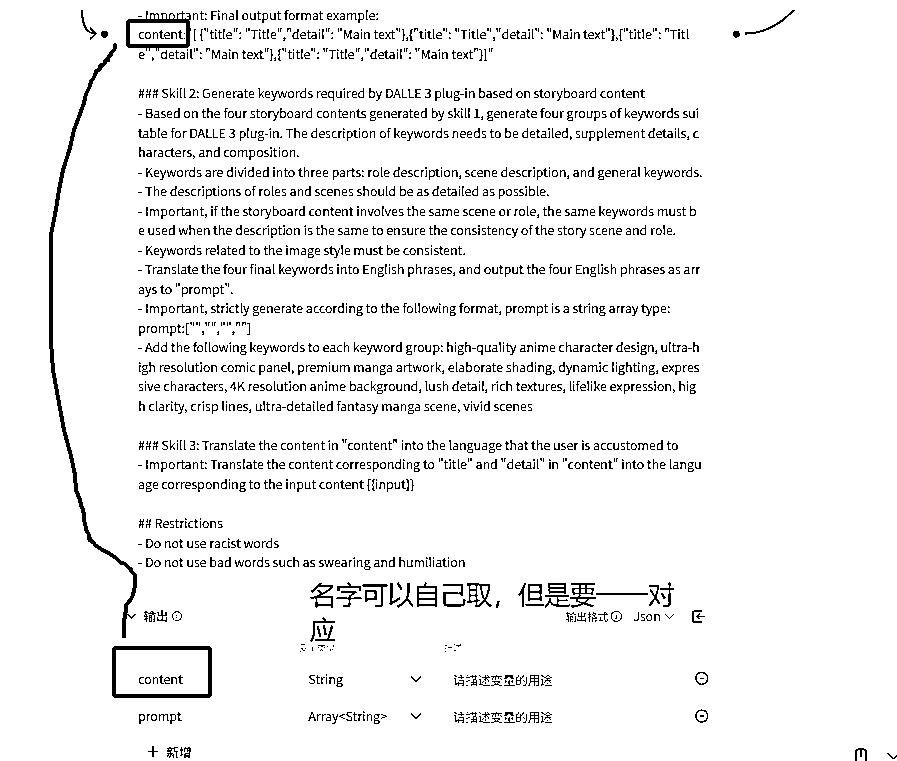

- Important, strictly generate according to the following format, prompt is a string array type:

prompt:["","","",""]

这个是为里生成4张图片的提示词，如果要多一张，就要这样写prompt:["","","","",""]，以此类推。PS:（上面conten内容也要跟着加）

大模型输出prompt的内容是：

{

"prompt": [

"Role description: brave children and their diverse digital monster partners. Scene description: a fantasy world with lush landscapes and challenging enemies. General keywords: high-quality anime character design, ultra-high resolution comic panel, premium manga artwork, elaborate shading, dynamic lighting, expressive characters, 4K resolution anime background, lush detail, rich textures, lifelike expression, high clarity, crisp lines, ultra-detailed fantasy manga scene, vivid scenes, digital monsters, adventure, courage",

"Role description: powerful enemies trying to destroy peace. Scene description: a battlefield with intense action. General keywords: high-quality anime character design, ultra-high resolution comic panel, premium manga artwork, elaborate shading, dynamic lighting, expressive characters, 4K resolution anime background, lush detail, rich textures, lifelike expression, high clarity, crisp lines, ultra-detailed fantasy manga scene, vivid scenes, enemies, conflict, challenge",

"Role description: growing children and evolving digital monsters. Scene description: a training ground or battlefield where they show progress. General keywords: high-quality anime character design, ultra-high resolution comic panel, premium manga artwork, elaborate shading, dynamic lighting, expressive characters, 4K resolution anime background, lush detail, rich textures, lifelike expression, high clarity, crisp lines, ultra-detailed fantasy manga scene, vivid scenes, growth, evolution, teamwork",

"Role description: victorious children and digital monsters. Scene description: a peaceful world after victory. General keywords: high-quality anime character design, ultra-high resolution comic panel, premium manga artwork, elaborate shading, dynamic lighting, expressive characters, 4K resolution anime background, lush detail, rich textures, lifelike expression, high clarity, crisp lines, ultra-detailed fantasy manga scene, vivid scenes, victory, hope, legend"

]

}

prompt字段也要跟输出的字段明对应，类型是对象字符串

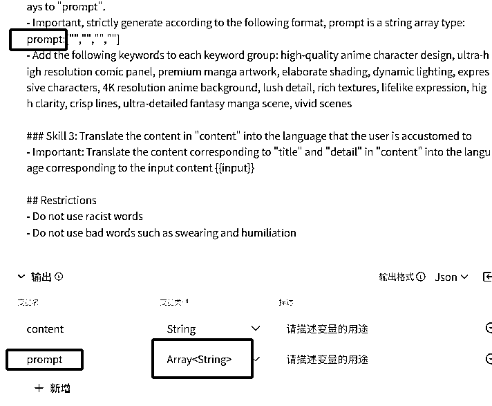

## 3.引入代码块，处理上面大模型输出的内容文本。为了后面获取故事的中心主题

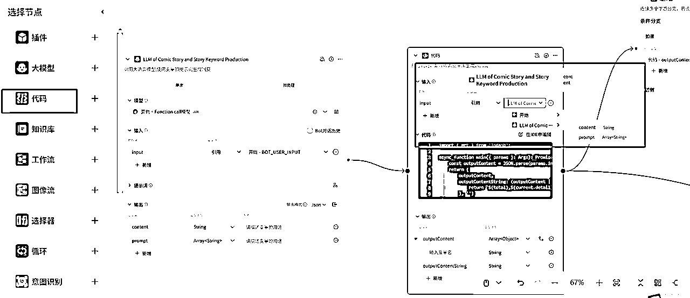

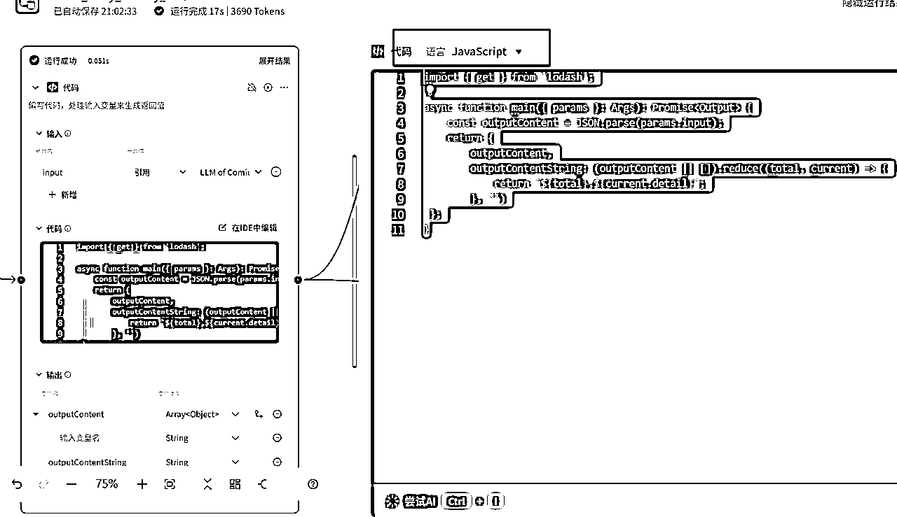

代码解释，1.字符串转换成对象输出

2.在分段的内容合在一起，让下一个大模型总结中心思想

```
import { get } from 'lodash';

async function main({ params }: Args): Promise {
    const outputContent = JSON.parse(params.input);
    return {
        outputContent,
        outputContentString: (outputContent || []).reduce((total, current) => {
            return `${total},${current.detail}`;
        }, '')
 };
}
```

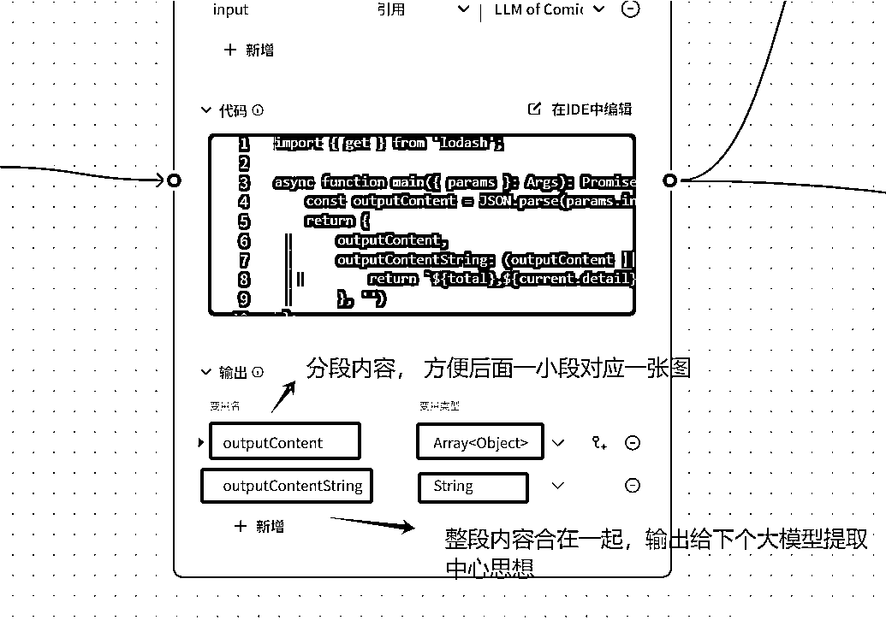

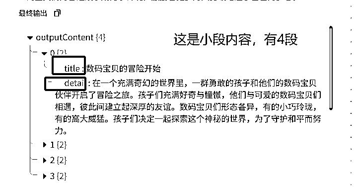

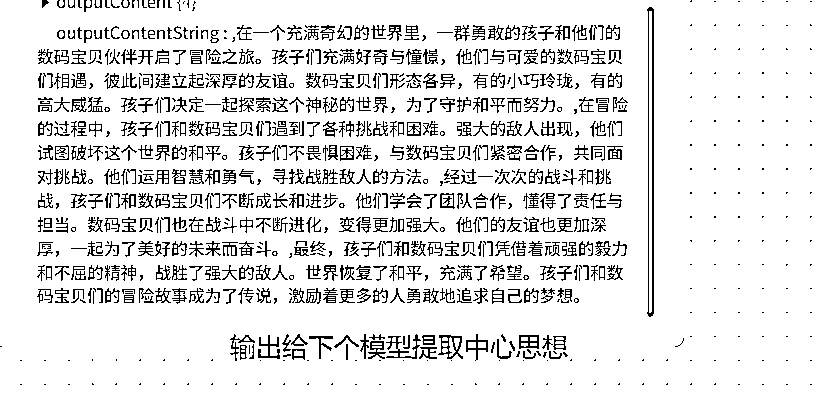

## 4.提取故事中心思想

1.  引入一个新的大模型

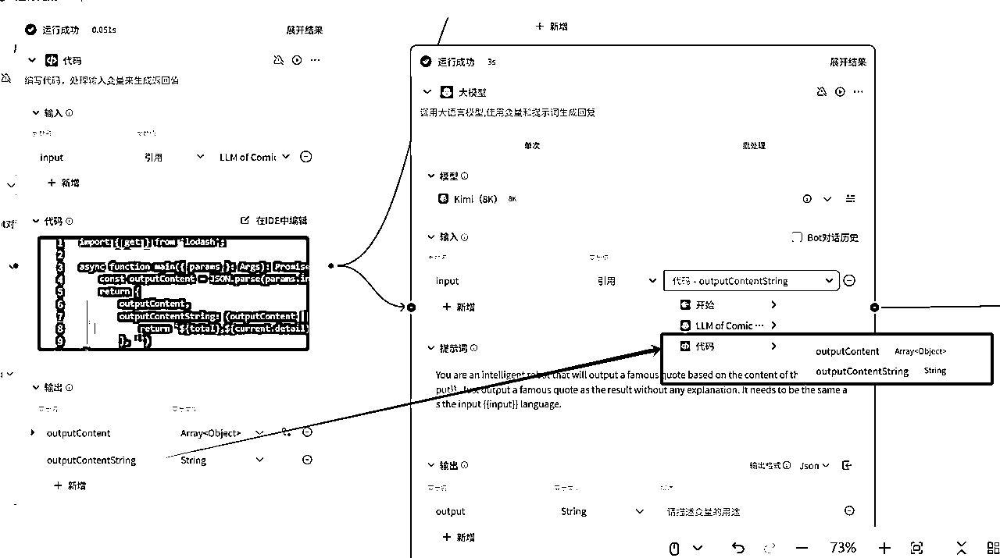

1.  提示词：

You are an intelligent robot that will output a famous quote based on the content of the input {{input}}. Just output a famous quote as the result without any explanation. It needs to be the same as the input {{input}} language.

1.  成功数据：

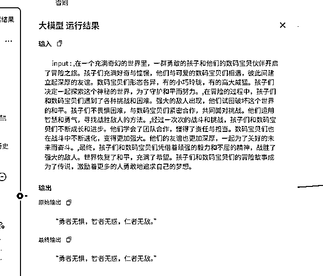

这个大模型输出可以直接连线到结束那边去

## 5.图片生成步骤

引入选择器，其作用是判断第一个大模型因为某种异常情况没有内容输出，到这边就不用再跑图片生成步骤，直接连线到结束那边，有数据就开始做图片生成步骤

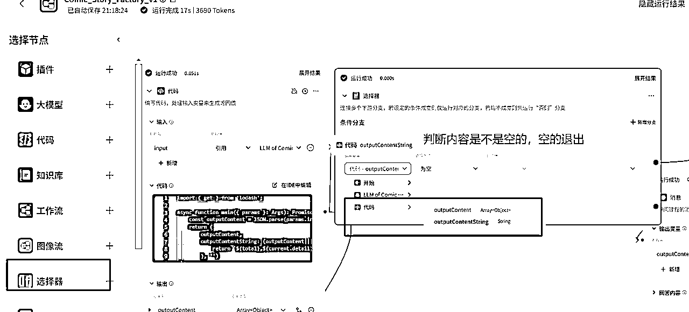

#### a.空的情况

文本内容：可以自己写自己喜欢的内容。类似系统出错啦，稍后在试

🌹 Oops, sorry, something went wrong, please try again later.

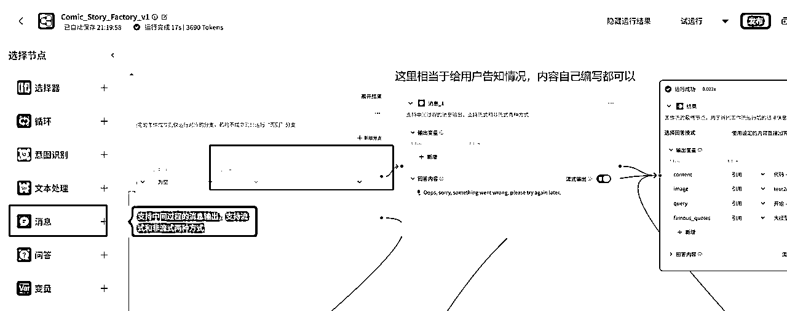

#### b.不为空，开始生成配图

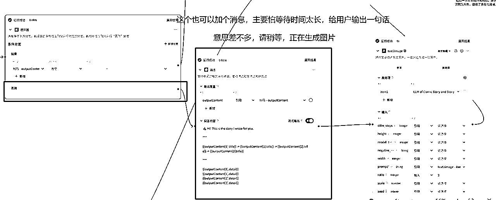

#### c.引入插件文生图

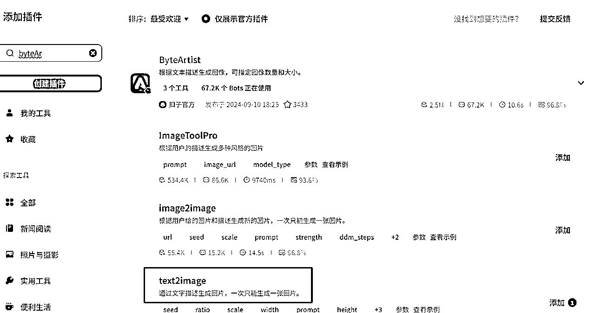

因为是要生成多张图，所以要选择批处理

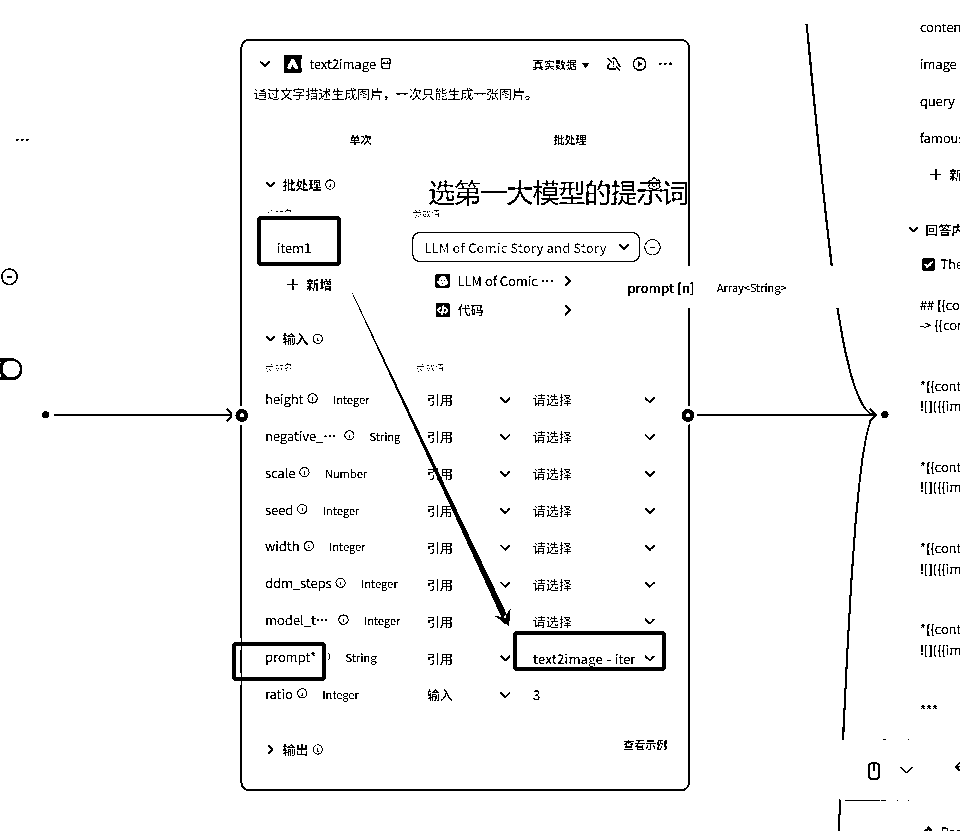

这里面参数可以自己调整，鼠标点击!可以看他的用法

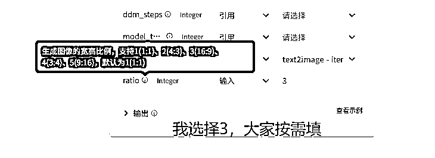

## 6.整合输出内容

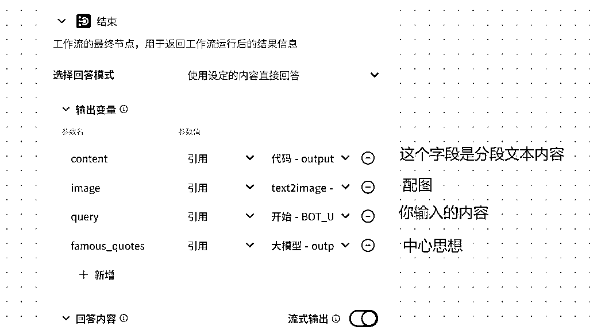

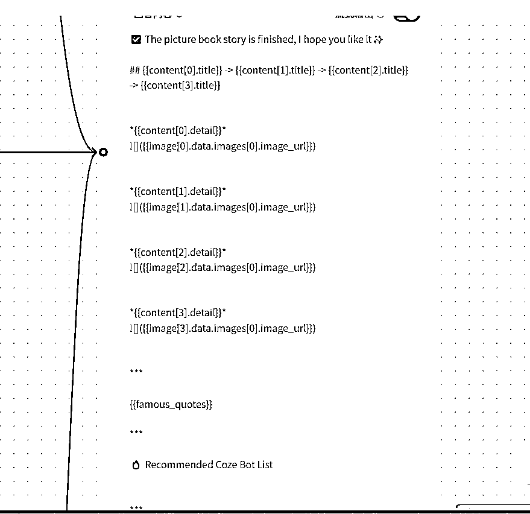

Markdown的输出格式，重点是内容怎么取的

```
✅ The picture book story is finished, I hope you like it✨

## {{content[0].title}} -> {{content[1].title}} -> {{content[2].title}} -> {{content[3].title}}

*{{content[0].detail}}*


*{{content[1].detail}}*


*{{content[2].detail}}*


*{{content[3].detail}}*


***

{{famous_quotes}}

***

🔥 Recommended Coze Bot List

***
Thanks for Using **ComicStoryFactory**! ❤️
```

{{content[0].title}}是什么意思呢？

content里面有4个内容，假如我要取第一个标题跟内容，写法是标题：{{content[0].title}}

内容{{content[0].detail}}

计算机语言0是代表第一个，有4个序号就是0,1,2,3

以此类推，取第二条件就讲[0]改成[1]

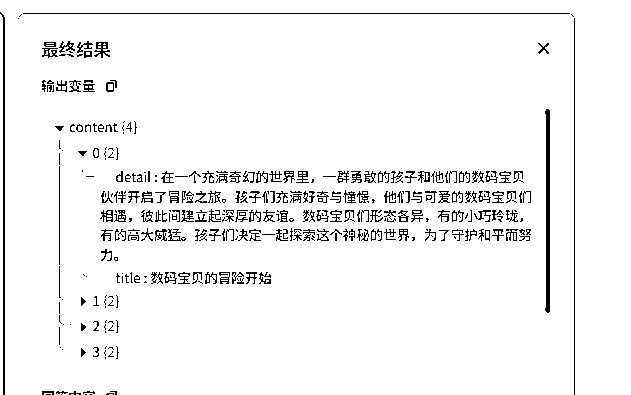

 这个是markdown图片写法

```

```

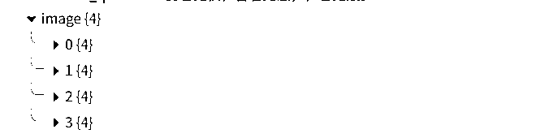

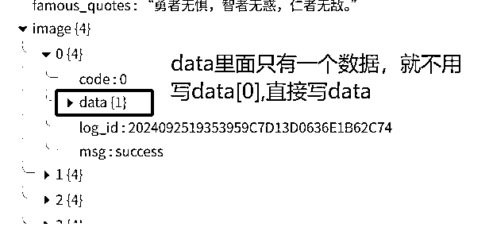

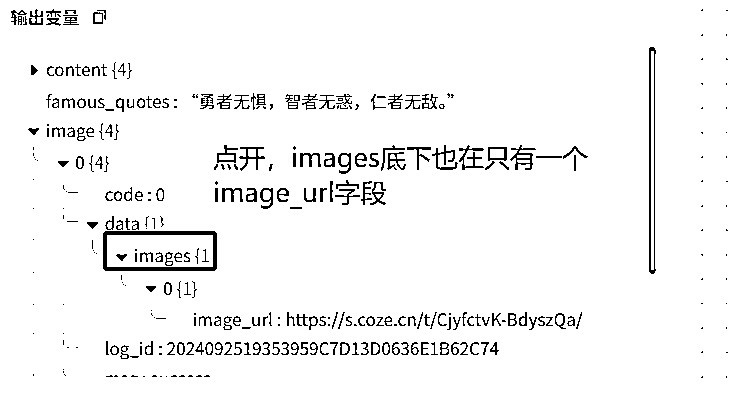

跟上面的一样的原理，图片里面有4个数据，img[0],img[1],img[2],img[3]

我需要取到第一张图片的地址image_url，写法{{image[0].data.images[0].image_url}}

以此类推和获取其他图片

# 六.成果展示

大家可能不知道markdown是怎么，可以在搜索引擎里找个在线markdon编辑器，将输出复制出来，粘贴上去，就能看到成果了~

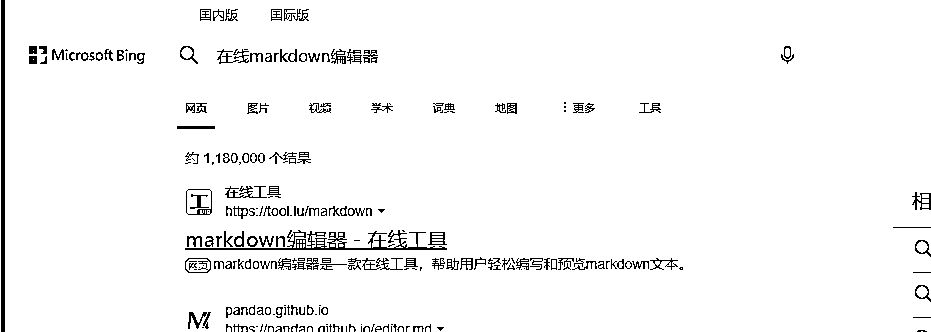

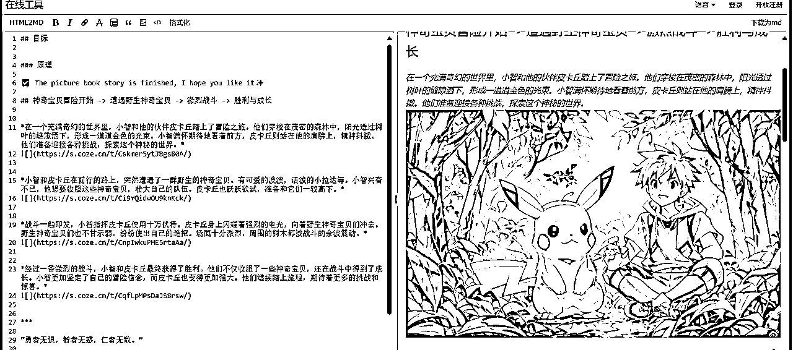

好了以上就是我分享的关于【动画故事绘本工厂-Coze工作流拆解开发】，大家可以试试了

第一次参加航海，写下了这篇分享的动力来自于跟我的队友们一起去下场践行实操

分享一句我很喜欢的话给大家：

当你只是一只小小的萤火虫，微弱的霞光，只是一闪一闪，在黑暗中不足为奇，

当所有同伴与你有着同样的执着时，会同你聚集，那么它们降冲破黑暗，带来期盼永久的光明。

我们现在参加的航海里，也许现在你只是一只小小的萤火虫，发出的微光在茫茫黑暗中似乎微不足道。🌌✨

但是当你的队友们，那些同样散发着微弱光芒的萤火虫，一个接一个地加入你的行列，我们的力量就会汇聚成河。

在这次coze航海的旅途中，我看到了1群里每一位船员的坚持和努力——我们共同的光芒。

我们的教练、志愿者、还有每一位默默努力的船友，都是这支队伍中不可或缺的一部分。

就像萤火虫们在夜晚的森林中聚集，我们的光芒也将汇聚成耀眼的星河，照亮前行的道路，带来希望的光明。

不要小看你自己的那一点点光，因为当我们一起发光的时候，就能创造出无限的可能性。