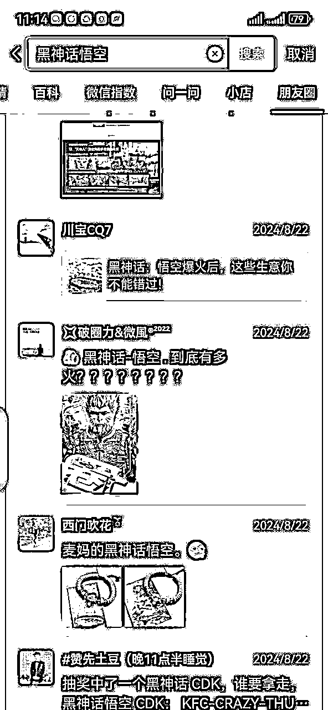

# 我自爆，借势生财有术，我拿到了百万流量，卡上了10个热搜

> 来源：[https://eulbg0ph20.feishu.cn/docx/LINMdYiw4o17fhxfxkfc8lx4nQf](https://eulbg0ph20.feishu.cn/docx/LINMdYiw4o17fhxfxkfc8lx4nQf)

哈喽大家好，我是金金，距离《黑神话悟空》爆火已经过去了一个月，但依旧有圈友能够借势搞钱，除了项目变现，我发现流量变现是最快的，写了一篇随笔，简单分享下我当时如何借势《黑神话悟空》搞流量的

随笔主要三点

1感谢生财有术这个平台

2简单记录一下这几年做ip的心得

3简单分享一些经验，可以给想做/正在做博主/知识IP的圈友（新手）一些帮助

# 这个是我的原视频

#### . https://v.douyin.com/ihkkTo9A/ jPK:/ e@B.Tl 09/06

#### 数据如下

这条视频24小时内破百万播放，吸粉1000+，有幸卡上了10+个热搜

看了视频，我相信很多人会说，这些信息谁不知道？

可是，这个世界上最遥远的距离就是知道和做到之间的距离。

如果你感兴趣，可以往下看看～

# 此条视频有哪些条件构成

## 拍摄动机

### 被黑神话悟空的热度震撼到

我是不玩游戏的人

但20号那日，打开微博，打开抖音，打开朋友圈，只要我打开我的手机刷任何社区/社交平台，都是《黑神话悟空》

这是一款游戏呀！全网霸占！

真的有被吸引到，更是被热度震撼到！我印象中就是LOL英雄联盟全球决赛之类的全民狂欢到这种程度，而一款游戏这个热度真的震惊到。

### 民族情怀

也许我比较感性，真的有被各大自媒体的文章/视频感染到。看了新华社张扬专访《黑神话悟空》制作人冯骥的纪录片，看了张大仙都晕吐还在直播闯关，看了黑神话幕后工作人员因为热爱低薪不离岗，看了多个公众号大V在讲：黑神话：悟空，它值得..........

总之！我们国家也出3A游戏了！（虽然我不会玩，不过不影响我自豪哈哈）

### 黑神话的热度太猛了

太多自媒体借势出圈、快速涨粉了！！！

AI博主：AI技术生成猴哥巴黎时尚大赛。全网吸粉无数，直接霸屏小红书瀑布流，美妆博主挑战游戏中的妖精，“黑神话悟空妖精仿妆”早已登上热搜排行榜。情侣博主都在拍“谁给男友买了这个游戏”。旅游博主为了热度纷纷去山西取景地了，热搜榜“手绘黑神话悟空挑战”，绘画博主的机会，黑神话神级音乐《云宫迅音》《三界四洲》《往生咒》《戒网》《勿听》《主题曲》，音乐人的机会，以中国神话故事西游记为背景，融入了中国山水、古建筑群、非遗文化、在游戏中了解中国古建筑，东方色彩，科普博主的机会，《黑神话：悟空》超燃神级文案，放在作文界也是相当炸裂的，情感博主的机会

有老板人设的还可以公司放假拉好感，送PS5到每人手里。有币圈大佬直接简单粗暴的涨粉，+关注+转发+评论，抽几百个送～涨粉无数～

除了以上，只要话题跟自己的行业相关，就不要怕自己的账号蹭流量蹭出问题，只要内容跟自己的人设有关系，可以大蹭！

不蹭一下悟空的热度，太亏！

## 素材来源

结合自己账号定位，我锁定了选题，就讲黑神话悟空的商业变现能力，它的搞钱能力，可以讲的很多，比如拆解游戏公司的商业帝国，比如游戏如何盈利，而这些选题都有大热门的视频在前了，很难分到一杯羹，于是我锁定普通人如何借此游戏变现～

在我之前，浅浅调研一下市场，有人讲，但并没有热门，且视频时长太短，我可以忽略不存在了，此选题——没有竞争

OK，寻找信息：

### 私域圈

#### 微信交流群

从8.20号开始我的各种媒介/交流/大佬/八卦群，都开始出现“黑神话悟空”的话题了，有聊咋搞钱的，有聊咋玩的，有聊爆炸信息的，等等

#### 微信朋友圈

朋友圈就太多信息了，刚刚去看了一眼，已经过去20天了，9.9号还有不少人在发“黑神话悟空”周边的朋友圈，朋友圈啥信息都有，简直海量信息库，光是20号-23号我硬是翻了好几页才翻完。可见全民参与度有多高。

#### 知识星球

（除了知识星球，还有其他很多的知识付费平台，这里以知识星球为代表）

##### 这里一定要提：

##### 生财有术！！！！！！

大家都知道，生财有术是一个海量信息库。我上一条说我看朋友圈的信息就非常多了，但是如果做视频或者文章，太多无效信息，能够用的上的还是得把眼光转向生财，生财有术是搞钱信息垂类集合地。同样的话题，这里只会出现能搞钱的信息！涉及到商业变现的，都在这了！

这也是我觉得最神奇的地方，其实有很多同样的信息点，在其他星球都能看到，但远远不及生财有术这么密集，不夸张的说，我视频信息好几条是参考生财有术的“风向标”。这不得要夸夸生财的运营们，其他星主无动于衷，我们生财的全民圈友都开讨论起悟空的搞钱点有哪些了，这等气氛我直接把眼光锁定在生财，着实在给我的信息输入减少了好大的弯路，果然是第一搞钱集合地，扛把子搞钱社区！

（这里也多啰嗦几句，同样的平台不同的人会有不同的视角看待，如果你是以找项目做的视角，那么，生财什么好项目都有，最新的最干的最哇塞的，当然，因为太多也容易扰乱你的专注，项目应该选哪个，这个时候无非就是多审核自己的优劣势多对比多实验，没有什么更好的办法。但如果大家以另外一个视角看待生财，比如信息聚集地，那么它只会有优势没有劣势。所以同样的一条信息，你要以什么视角去看，它给你的价值可能就是不一样的

无论哪种视角，你都要用起来看起来，我的习惯就是隔三差五的看信息，保持对信息的敏锐度，尤其是想要做商业博主的新人，真的要好好“利用”生财，因为这里的价值非常大，就看你怎去用了，有的人可能是有团队直接切入项目做第一批吃螃蟹的人了，有的人闻到了信息的价值做素材选题了，有的人..........）

### 公域圈

#### 公众号文章

这个要看大家的阅读习惯，文章一般受欢迎的平台：今日头条/公众号/知乎/鸟哥笔记等等。热点文章都会容易被推送，多看一些不同视角的《黑神话悟空》文章，会给你带来更多的信息，也更能作证你的信息

#### 抖音视频

除了抖音，还有很多平台信息，比如小红书/快手/B站/YouTube等，都是热点视频集合区

## 拍摄/剪辑

#### 01拍摄，一定要找到状态好的时候拍

这个状态不是刻意要准备好拍视频的状态，而是工作状态很好，顺便拍视频。这两者都是状态好，但前者刻意拍会对数据有所期待，以至于准备的过于花里胡哨，后者会放松太多无所谓数据，拍摄过程也会自然流露反而数据会更好。

#### 02拍摄工具俩必备（手机+麦克风）

我一般苹果原相机拍摄，是苹果手机前置摄像头，用苹果拍，配置越高的越好看（用10/11/12/13/14/15），（网络评价iPhone X和15是最好看的）

如果打光好，还瘦的话后期加个磨皮就好，如果有像我这种天生就有法令纹的，就会显老，一定要买反光板，我不懒的情况下就打俩反光板，大部分时间比较懒，就寻找室内/外光线巨好的地方，就是边走边拿手机怼脸测试，只要镜头里面看不到深深的法令纹，那光线一定就是最对的！说明四周光线比较充足，无死角都能补光到位。拍摄完觉得人脸胖就后期加个瘦脸，不够美就加美妆，不够白就加美白。

后期软件用：wink（时长短的话用，因为手机导内存），平时用剪映多一些（时长长的话也不卡），总之根据自己审美来（男生一般不会在意美不美好不好看，女生一般都会在意，不过好看一点的修容自己看也会很舒服）

状态不好/或者没化妆，就会用美颜相机拍。拍摄软件：轻颜相机

用美颜相机拍的好处就是，你真好看啊，坏处就是，画质低。就比如我这《黑神话悟空》这条，直接给我卡顿了。也是因为我没清内存，又不想大半夜的NG多条，就直接用了（好在没太多人说卡，或者热点蹭的好没有引起太多人注意力注意/体感不适，如果放平时，这视频绝对会影响视频转化率的）

麦克风是必备。看我历史视频，能看到多款麦克风。市面上的麦克风我几乎都用过，换过很多。目前我只推荐一种：大疆的。罗德的线会吊着，容易坠落摇晃。猛犸的看起来性价比好高，一个小盒也方便携带，但是经常出现音频没被收录上，0收音的情况。目前大疆的用了几个月，有猛犸的便携性有罗德的音质高，几乎不会出现“事故”，一分钱一分货。建议大家花点小钱直接一步到位。（不过盒子有点沉，把它放包里平时带着出门，像是多带了5个手机似的，十全十美不大可能）

还要提示大家，新人同学一定要备个网盘，用来存储视频。因为电脑剪辑你一直存储真的撑不下几百个几千个G。

# 做（知识）博主应该具备哪些条件？

## 要蹭热点

### 话说蹭热度的意义是啥

但是像近期小杨哥的热搜不建议蹭，未经证实，社会舆论巨大的，蹭=被骂=被公关

大家要蹭，也要三观正

社会乐呵的/积极的/围观热闹的主题都可以蹭

因为知识博主的内容相对枯燥，过于垂类只讲自己领域的事情天花板一定弱，蹭热点我认为是一定要纳入的，最好是跟自己的定位结合，突破更大的泛流量，更大的池子。

哪怕最简单的信息整合也可以

曾经，我就说了一下抖音的报告文档，破了1000万的播放，我连拼凑都没有拼，你说神奇不，我当时都觉得很狗血，我当时都觉得我把重点信息就是念了出来，仅此而已。但全网只有我一个人把这条信息制作出来，没有第二个人当回事，发个朋友圈写几个字和你拿起手机拍出来，那也是不一样的。所以不要对信息的简单/做所谓的质疑，任何信息，都可以作为你的素材，总会有你知道他不知道的，前提是你认为，它是一条有价值的信息。

也许此时此刻会有人觉得我很，投机取巧。但，投机取巧也是要会的

我的视频发布后，累计多个博主直接照抄文案，发布各大平台，还有50多万的商业博主。我觉得，这样的行为怕是最投机倒把的，既然很简单，那为什么信息拼凑的活都不会干还是懒得干，后来挨个举报对方视频被下架了～

#### 带动往期视频流量

任何平台，但凡出现一条有热度的视频，一定会涨权重+涨粉+涨流量

一般抖音出现一条，会带动前面3条近期老作品能增加3-5位数的播放量，就是一个隐形的杠杆能力

#### 稳固/增加你的“影响力”“背书”

之前视频很久没有啥水花，某个视频数据好也会大量推送给自己的铁杆粉丝的，一定程度减免铁粉流失率增加粘性

## 要不断的输入

视频的内容不是毫无征兆就有的，更不是你天天扒来扒去的。

做内容首先就是你要可持续的输出，输出的前提是输入，你脑子里没有东西没法输出，而这个东西，不是说一时半会就可以。而输入，是你平时要看大量信息，可以来源于书籍可以来源于日常实操可以来源于各大自媒体平台等等。

如果你选择做知识博主，最基础，最硬核的就是你要有知识。

80%的内容是日常工作经验输出，

20%蹭热度话题

我很少靠刷同行的视频，我一般是自己想到什么讲什么，比较随心所欲一些

我80%的视频信息来源都是日常实操碰到的那些“知识”“问题”“技巧”，给自个儿学生输出的同时也会挑一些分享给粉丝，所以我的视频，能看的出来，多半以专业知识输出为主，相对枯燥但人群精准。

有些新人看到这，肯定会质疑自己，觉得自己水平没有多高不足以授业解惑，但我以我自己的亲身经历来说，大家都有各自领域的技能，你会化妆，你可以美妆博主，你懂家居，你可以家居博主，这个经验并不需要很足，这个世界只要存在你会而其他人不会的东西，都可以成为你的能力，因为这是你的长处同时是别人的短板。就像我，有的学生的GMV比我自个做的GMV高的多多了，战绩低我就不配传递知识了吗？那不是，人外有人，天外有天，当我分享一个很不起眼的一个小知识的时候，你会发现，居然有这么多人都不知道这个点，哪怕这人很牛。有一些价值不是看结果，有一些价值是看信息，哪怕就一个很小的信息差可能会对对方收益匪浅，获益N倍。

## 不被流量裹挟

如果你是新手，我建议你要视流量为粪土

如果你是老司机，你肯定要视流量为金主

不做流量的奴隶，要做流量的掌舵者

如果你觉得你的作品巨好，就是平台不给流量，可以把视频同步分发到其他网站，你会发现好的作品一定会有平台看见你。如果都没看见，就是作品问题。

现在的平台不需要依仗千万之一的你，一个普通的UGC贡献多好的内容，它一点都不缺。平台是我们传播的一个工具，而流量是你作品好坏的反馈

没必要流量不好就不开心，谁能保证自己的考试每次都100分呢，60分不也挺好的，只要你做了就有分数，就有优化的空间，但你不做连分数都没有。

## 计划赶不上变化

做视频/做IP，时间上很难把控到位。

好比昨天，本来的计划就是拍条视频，然后跟闺蜜出去玩的，结果从两点半整到晚上9点半，一条普通视频我也没想到怎么就整了7个小时。我的计划是6点前结束的（当时内心：拍+剪三个左右小时时间够了吧）。

可能你会好奇，哇靠，7个小时？我拍个视频1分钟搞定啊！

视频是分质量的，不同的人对视频的精致程度要求是不一样的。同样的题材同样的形式不同的人做先别说结果，过程一定是不一样的。

当然并不是很多视频7个小时，很多1分钟视频1-3小时，还有的30分钟，甚至10分钟。看视频就能看出来的。为什么计划赶不上变化呢，就是因为在拍的视频在剪辑的适合又融入的太多想法或者有些设备事故等等，你以为10分钟就够结果50分钟。

这种事情会经常性发生，也许会耽误到你后面的工作安排，也许会耽误到你后面的生活安排。一旦参与，这是无法确定的事情，你要坦然接受它。

# 做自媒体博主的利弊

## 不受时间/空间/地域的各种束缚

这份职业，经常会收到朋友羡慕的眼光，因为做博主，主要的工作就是拍视频或者写文章，主要的目的就是搞流量。

口播视频更是简单，拍视频哪里都能拍，家里、办公室、工作场景、吃饭场景等等，拿起手机直接口播就完事。若是需要写文章，也是如此。

出门出差，想要直播，架起手机在酒店也照样播，毕竟不是卖货的不需要搭建场景。出去旅游玩耍，如果突然冒出来一个热点，拿起手机直接拍了，生活工作兼得。这个视频，我就是懒了我不想拍，可不可以停更一周我再拍，可以，丝毫没问题，不会说你停更你帐号就废了就没流量了，因为有没有流量90%是看你的内容不是看你为了更新频率而随机出的一条毫无营养的视频。

在工作这块，着实自由度太高

一般新手一个人足以，不需要团队，如果你是自己组建团队了，驻扎于某个城市了，那我讲的此条信息并不适用。此条“不受时间/空间/地域的各种束缚”仅限于自由工作者式的自媒体人，而非团队式

## 0成本足以撬动百万利润

做博主，真的是0成本杠杆多个万元利润

当然，这里的0成本是指的金钱0成本，时间可不是0成本

回看我的抖音，破百万的有10条以上，有的能直接给我带来金钱，比如我置顶的视频《小红书电商怎么玩》，当即有人直接加微直接转账上车学习，毕竟讲的很直接无套路。有的就是不经意间的火，比如《罗永浩的直播场景搭建》，当即有直播设备的广告商找到我打广告。也有的就是毫无变现价值的火，比如《抖音年度报告解读》，就仅仅是个解读，是个信息传播者，吸的泛粉不是太有价值，但流量权重有

## 全看平台给不给饭吃

自媒体人，我们都是给平台打工的“奴隶”

这句话说的比较犀利

但也要有心理准备

如果你的账号由于各种原因被封禁，这意味着你失业了

抖音还好，市场上总会有一些旁门左道即使你号关小黑屋了也能救一下，起码有机会救，放眼小红书/头条，封了就是封了，别想着有机会有人给你捞，其他平台在这就不点了。（不要给自己留后路，号不在你就没了生存）

比如：我的某个小红书账号，一夜之间涨了几千粉，不到一个月我的账号就异常了，说我内容敏感啥啥啥。账号异常到没有小眼睛我索性直接注销，同样内容再做一个新号，又涨粉几千，而这次并没有异常。你说这是为啥？我只能归根于“天不时地不利人不和”，难不成你还想跟平台去博弈？？？恐怕只会浪费感情

再比如：我的某个第三方平台文章，粉丝咔咔涨的时候给我封了，同样的内容别人能上热门我的直接被封，你没有啥资格埋怨，就是想跟大家说，做自媒体，类似的事情会发生的太多太多，你可能会“习以为常”

当然，也有出乎意料的时候，比如：

我曾经一篇公众号文章，阅读破万，直接变现5位数

我曾经一条长视频，上了小热门，直接变现5位数

我曾经........

而这些，都是不经意间的，你不得不承认就是“天时地利人和”，全仗平台给饭吃，都说做视频要看选题，的确，选题好或者爆炸数据大概率不会差，但，就真的大概率吗？就真的不会差吗？？？太难讲啦！甚至无规律可言。

所以我们要做的，能做的，不仅仅是选题/内容/拍摄/等等上的博弈，最大的博弈是自己，是自己的执行力

## 你的ip账号就是你的社会名片

有粉丝基础的，不管你多还是少，有一条热门视频推送到粉丝面前，他们也会拍手叫好，本来对你淡忘的意向客户，也许会增加了对你的印象

而这份印象，带来的价值没准很大

我曾经的一条热门，朋友圈的好友很多人都刷到了，起码，在当时那段视频，会有很多人考虑我的价值，

也会引起大佬的注意，比如，某千万博主曾给我付费，某某千万博主邀请一起聚会，等等等。。。

跟朋友聚会，总会有句话介绍，她的XX号，做XXX行业。

## 一定会焦虑

做ip，既要学会放快，又要学会放慢脚步

我经常对自己说，不要被流量裹挟

但人没有办法做到，真正的不在意你的流量

我在粉丝几百的时候

发各种乱七八糟的视频，自拍的，vlog的，美食的，就是没想过“钱”

我在粉丝几千的时候

开始对数据有关注了，有没有涨粉，有没有播放，开始“在意”了。

我在粉丝几万的时候

这个视频能不能爆，要不要直播呀，下个视频讲啥呀，开始“慌乱”了

我在粉丝几十万的时候

怎么没上热门呀，怎么限流了，还要不要拍了，要不要换个赛道，开始“焦虑”了

伴随你的流量增长，带来的是客户，客户会提供金钱，所以，在不经意间，你会自动将“流量=金钱”画上等号

说你在乎流量，不如说你在乎钱。

这句话听起来，好像，无可厚非。

所以，你真的能做到不在意流量吗？？？

我一直回想我当初拍视频的初心，初心，初心。

我的第一个上热门的，是50万+的播放，一条我在学校上课的视频，在做版画，引起广大美术群众的讨论。

我的初心，就是：分享

我的第二条上热门的，是XXXXX，初心是：分享

而现在，还没达到什么量级的水平，就给自己安上了太多“流量帽子”，如果你倍儿乐观，我相信你不会焦虑，但如果你认真了，只要你在场，焦虑你躲不了，不过这也是作证你有在认真对待哈哈哈

## 你会收获粉丝

当你有粉丝了，不管多还是少，都一定有黑粉/铁粉

### 要做到闭眼删

你需要有防御能力

比如“评论区”，这是你防御的第一步

一个恶评，能带动后面所有的风气

一个中评，也会影响视力，那不如，全删

比如路人，刷到你的视频，不管讲的咋滴，过来踩你一句

比如“”“”“”“”“”“”“”“

我之前真的真的，尤其大早上刷评论，看到恶评，会影响到我一天的心情，就是因为我太care，

### 要做到一笑而过

会有人夸你，各种夸

如果是同行夸，我真没啥太多情绪上起伏，因为是同行，你没法判断，这句话是捧杀还是欣赏还是反义词

但是，来的是粉丝，我会很兴奋哈哈，会感受“付出是有回报的”“啊啊啊有人看见我了”“有人懂得欣赏的”

再后来，我一笑而过

因为我这知道，这仅仅是一个开始

# 最后

认清自己，认清现状，知道自己想要什么，以及在做什么，是非常重要的一件事

多辩证的看自己，了解自己才能超越自己，做的好的地方要继续维持，不好的地方要不断优化。

以上，想到哪说到哪了，

希望对新晋博主小白有帮助呀～

也期待各位大佬前辈的批评指教～