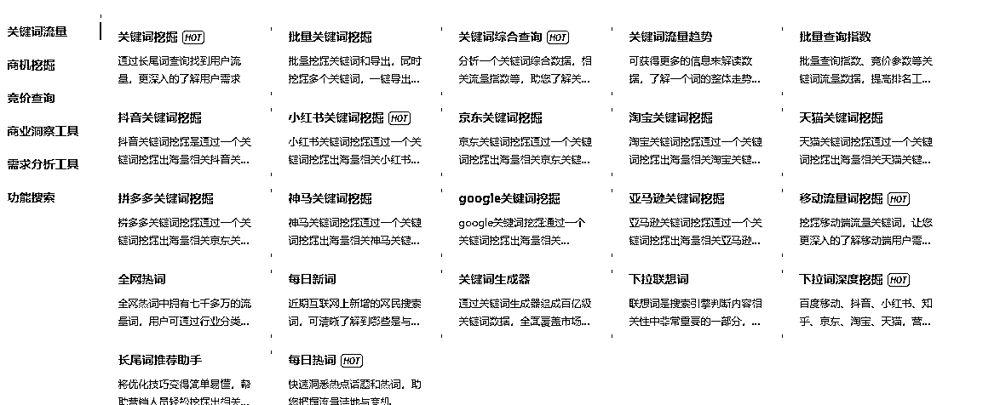
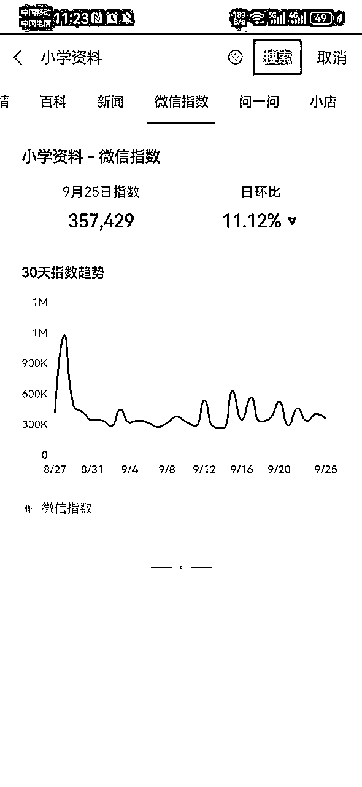

# 网盘拉新赛道大全1.0（生财）

> 来源：[https://z7h6phhn3p.feishu.cn/docx/LdUzdOUfgoQkidxZSDxc732in5c](https://z7h6phhn3p.feishu.cn/docx/LdUzdOUfgoQkidxZSDxc732in5c)

# 网盘拉新赛道有哪些？

一网根据自己的理解，把网盘拉新赛道，总结成10条大赛道，它们分别是：资料、影视、游戏、课程、工具、素材、音乐、热点、综合、其他。

# 影视赛道

韩剧、美剧、日剧、国产剧、电影、短剧、动漫、纪录片、综艺、其他

# 资料赛道

1.学科资料赛道

幼儿、小学、初中、高中、中专、大专、专升本、大学、英语四六级、考研、考公、医学、法考、财会、金融、语言、建筑、计算机、亲子教育、职业教育

2.教务资料赛道

幼儿园教师、小学教师、初中教师、高中教师、中专教师、大专教师、大学教师

3.学习资料垂直赛道

英语类赛道：通用英语、新概念英语、少儿英语、小学英语、初中英语、高中英语、专升本英语、大学英语、专四、专八、考研英语、考博英语、 托福、雅思

财会类赛道：注册会计、中级会计、初级会计、会计实操、审计师、税务师、经济师、初级经济师、中级经济师、高级经济师、资产评估师、银行从业。

医学赛道：执业医师、护士资格、药学药师

语言类赛道：汉语、普通话、英语、法语、德语、日语、韩语、俄语、阿尔巴尼亚语、保加利亚语、西班牙语、葡萄牙语、波斯语、菲律宾语、荷兰语、捷克语、柬埔寨语、拉丁语、罗马尼亚语、拉脱维亚语、卢旺达语、缅甸语、尼泊尔语、普什图语、世界语、斯瓦希里语、土耳其语、乌克兰语、希伯来语、希腊语、匈牙利语、意大利语、印度尼西亚语、印地语、亚美尼亚语、越南语、印欧语系。

4.职业教育赛道

心理学赛道、项目管理师、消防工程师、营养师、辅导员、检验师、社会工作者、导游、驾照

5.商务文档赛道

商业计划书、项目报告、市场分析报告、法律文书、策划文书、事务文书、运作文书等等

6.文案语录赛道

爱情语录、唯美文案、经典语录、人生语录、哲理文案、正能量文案、网易云文案、段子剧本、名人名言、神回复文案、短视频标题

7.话术赛道

直播话术、私域话术、酒桌话术、聊天话术、成交话术、恋爱话术、客服话术、销售话术、引流话术、情感主播话术、怼人神句、保险话术、钩子文案

8.其他资料赛道

电子书、行业报告、民宿运营资料、有声读物、学术论文、活动策划方案、电子杂志、智能家居方案、亲子活动方案、宠物训练资料、创业指南、儿童绘本、绝版书籍、旅游攻略、企业运营资料、机构运营资料、恋爱秘籍、自建房图纸、装修图纸、古书类、旅行地图、商业案例、商业模式、宠物行为、年会资料、高考志愿填报、班主任工作资料、文案语录、合同模板、创业案例、朋友圈文案、直播方案、养生资料、管理类资料、职场资料、保健资料、专注力训练资料、AI资料、强者思维资料、女性成长资料、装修知识资料、幼儿启蒙资料、家政公司创业资料、薪酬资料、招投标书、期末试卷、期中试卷、公文资料、大学生创业比赛资料、校招资料、创赛计划书、招聘资料、研学手册、旅游手册、手抄报线稿、自建房图纸、暑假资料、寒假资料。

# 素材赛道

1.视频素材

风景、治愈、雨天、城市、夜景、影视、酒吧、搞笑、星空、大海、高山、流水、情感、航拍、好物、美食、豪车、人物、商业、励志、旅行、绿幕、花朵、沙滩、伤感、宠物、开车视角、交通、解压、旧物翻新、乡村、养生等

2.音频素材

游戏音效、人类声音、动物声音、乐器音效、交通工具、爆炸音效、转场音效、开关按钮、环境声音、直播音效、打斗音效、搞笑音效、科技科幻、动漫音效、卡通音效、背景音乐、乐曲曲风、婚礼音效等

3.图片素材

航拍摄影、城市风光、自然风景、AI图片、办公商务、景观古迹、动物萌宠、餐饮美食、工程建筑等

4.PPT模板

商务、简约、酷炫、微粒体、中国风、小清新、卡通、手绘、欧美风、科技风、扁平化、水彩、杂志风O、其他。

5.壁纸

手机壁纸、AI壁纸、电脑壁纸、桌面壁纸、古风壁纸、动漫壁纸、卡通壁纸、情侣壁纸、动态壁纸等

6.表情包

7.其他素材赛道

特效素材、模板素材、字体素材、配音素材、直播素材、虚拟形象素材、公众号排版素材、简历模板、图标素材、短视频素材、矢量图、背景音乐、插画、剪映模版、思维导图、美女图片、设计素材、Live动图素材、手账素材、影视解说素材、书单素材、朋友圈素材、人事资料模版、企业实习模板、离职证明模板、Notion模板、、、、

# 游戏赛道

游戏资源、游戏素材、游戏道具、游戏攻略

# 音乐赛道

音乐合集、绝版歌曲、车载音乐、经典歌曲、串烧歌曲、背景音乐、MTV合集、单曲合集、英文歌曲、经典老歌、明星合集

# 工具赛道

视频工具、图文工具、文件处理、脚本工具、音频工具、搬运工具、其他新奇特工具

源码系列：

网站模板、网站源码、wordpress主题、小程序源码、整站源码、源码编辑器、游戏源码、游戏源码、脚本、APP源码、付费进群系统、工具导航系统、资源导航系统、博客源码、网站主题、插件拓展。

# 课程赛道

运动类：健身，舞蹈、健身、瑜伽、棋牌、羽毛球、乒乓球、高尔夫、桌球等

维修类：手机维修、家电维修、摩托车维修、电冰箱维修、汽车维修等。

养殖类：鸡鸭养殖、树木种植、龙虾养殖、养猪技术。

运营类：抖音、公众号、小红书、B站、快手、淘宝、闲鱼、京东、拼多多、视频号、知乎、微博、头条。

成长类：高效学习、最强大脑、两性婚姻、情商社交、人文历史、社科法律、自我提升、思维新知、演讲口才、时间管理。

生活技能类：美食、写作、手工、绘画、声乐、舞蹈、美妆

中医养生类：按摩、针灸、火罐、经穴、推拿、气功、食养、药浴

风水类：风水、玄学、占星

婚姻家庭类：婚恋心理学、家庭教育、婚姻法律、健康教育

IT培训类：Python教程、JAVA教程、C++教程、AI教程、PS教程、PR教程、AE教程，

其他课程：u盘装系统教程

# 热点赛道

这个赛道就是追逐热点，没有固定内容，只要有热点，整理好热点资源就可以推广。

这个赛道本身可以看做综合赛道的精华版，因为它涉及各个赛道内容，而且涉及的都是热点内容。

比如庆余年2、58页PPT控诉、天.涯.神贴、植物大战僵尸杂交版、黑神话.悟空等

做热点赛道，一旦视频爆了，拉新效果很明显，往往有一种的感觉：一年不开单，开单吃3年。

做热点赛道，需要多关注各个平台的热点排行榜：

抖音热点：https://www.douyin.com/hot

生意参谋：https://sycm.taobao.com/

每日热点：https://redian.aizhan.com/

360趋势：https://trends.so.com/

热点大全（看热点板块）： https://yw456.cn/

抖音热点宝：https://douhot.douyin.com/welcome

百度热搜：https://top.baidu.com/board

# 综合赛道

这个赛道，顾名思义，综合性，所以全部你看到的所有资源，你都可以发，比如我创建的"求学路上“，它就是属于综合赛道，啥资源都做！

# 其他赛道

塔罗牌，书法字帖，短视频脚本，思维导图，国学资源，体育运动，创业视频，别墅图纸，音乐简谱，创业思维，创业项目，小吃配方，小吃技术，装修图纸，高校求职信息、大学生秋招信息、茶饮配方

赛道内容会持续更新，欢迎关注

# 如何选择合适的网盘拉新赛道？

1.选择市场需求量大的赛道

赛道好不好，市场需求量很重要。

市场需求量大，意味着买的人多，流量大，机会多。

所以我们要专门找销量好的虚拟产品，销量好就表示买的人多，也就是需求多，一般需求多，搜索的也多，流量大。

如何找到市场需求量大的赛道？

确定赛道的热门关键词，根据热门关键词拓展长尾关键词。

拓展的方法就是使用关键词挖掘工具搜索热点关键词，找到热点关键词的长尾词。

然后把这些热门关键词和长尾关键词记录下来。

这个需要用到下面这个工具：

https://www.5118.com?promote=1F9C8B

这个工具可以进行各个平台的各种关键词的挖掘；

比如，电商平台：京东、淘宝、天猫、拼多多、亚马逊

比如，公域平台：抖音、小红书

比如：搜索引擎平台：百度、神马、google

通过上面挖掘到的关键词，然后去下面的电商平台搜索，寻找销量高的商品

推荐三个：闲鱼、淘宝、拼多多

找到销量高的商品，通过商品的情况来判断该赛道值不值得进入。

同时，你也可以通过下面的平台来辅助自己的判断：

利用微信指数搜索赛道的热门关键词和长尾关键词，判断赛道的需求，

路径：微信-搜一搜

利用百度指数搜索赛道的热门关键词和长尾词，判断赛道相关的关键词的搜索情况。

路径：https://index.baidu.com/

实际上通过电商平台的搜索，就能判断该赛道能不能进，后面几种搜索只是作为辅助。

2.选择自己熟悉的赛道

正确的赛道是成功的关键，熟悉的赛道，才不容易犯错，减少犯错，意味着能提高成功的概率。

3.选择自己感兴趣的赛道

做任何事，自己感兴趣的东西，动力往往是充足的，有动力才有强的执行力，能够做自己感兴趣的赛道，这个是最优的选择。因为当你没有正反馈的时候，兴趣能让你保持激情和动力。

4.选择没有版权的赛道

虚拟资源，很多赛道，多少都有版权问题，但版权也是分强版权和弱版权，尽量避开强版权，选择弱版权。

有时候，在强版权赛道里面，也会有弱版权或者甚至是无版权的垂直赛道。

从长远的角度，建议选择无版权赛道或者弱版权赛道，关于版权问题，不便说太多，欢迎和一网交流。

如果能够同时满足4条，那就是最好的赛道，而现实的情况往往不是这样，大多数的赛道基本上无法同时满足。

如果不能同时满足，建议优先选择市场需求量大的赛道，剩下的灵活处理。

# 网盘拉新赛道总结

1.很多网盘拉新赛道，往往是有交集的或者重复的。

2.任何赛道都做得好圈友，选择自己喜欢就好。

3.能赚到钱、能合法的赚到钱、能持续赚到钱、这样的网盘赛道都是好赛道。

4.没有最好的赛道，只有最合适自己的赛道。