# Flux AI 绘画新王者， 一文揭秘爆火的 Flux 工作流

> 来源：[https://jrnoijjrwm.feishu.cn/docx/LpA4dmIBJobAO2xeVwkcQntvnGc](https://jrnoijjrwm.feishu.cn/docx/LpA4dmIBJobAO2xeVwkcQntvnGc)

大家好，我是行者，现居深圳，23 年在生财写了 2 篇 AI 绘画精华帖。24 年潜水一年，无意中刷到亦仁的龙珠悬赏，工具使用我还是接触面比较多的，于是借着这个机会，发一篇长文。

Flux 出真人写真照片、再结合可灵、海螺等视频工具，一下子就把小红书的矩阵美女号玩爆了。

好多不玩 AI 绘画的也在问行者， 但是一问是 Flux 是要学 ComfyUI 工作流，很多人又被自己劝退了。

ComfyUI 已经进化得很快了，现在除了本地部署（需配备高性能电脑+调试环境），已经可以在线使用（比如哩布在线出图）、和租赁云端服务器（仙宫云，揽睿等云平台），开发者更是可以直接将 ComfyUI 工作流部署成小程序供用户使用，不会 SD/ComfyUI 的小白用户，完全可以使用别人部署好的工作流来出图。

本文用到的工具如下：

| 工具名称 | 工具用途 | 收费情况 | 地址 |
| ComfyUI（Flux）工作流 | 做 AI 写真、做电商商品图设计、视频转绘、AI 模特换装 | 本地部署免费。云端 4090 显卡每小时两千多 | 1、本地部署 |
| 哩布（blib.ai） | 在线生图工具 | 每天有免费生成次数，超过要收费 | https://www.liblib.art/、https://tusiart.com/ |
| 可灵 AI | 国产工具，AI 视频国内 TOP 级别工具 | 每天赠送 66 灵感值 | lingai.kuaishou.com |
| 飞影数字人 | 制作数字人，国产工具 | 收费 | https://flyworks.ai/login |

## 本文目录

第一章节：Flux AI 绘画大模型介绍

第二章节：Flux 案例分享（小红书名媛、新闻女孩、Lora 使用、字节 PuLID 插件等场景）

第三章节：Flux 4 种 使用方法

## 一、Flux AI 绘画新王者

这个时候，很多人都很关注 Flux 是什么了吧，接下来给大家科普下 Flux 及通过 Flux 工作流能干嘛。

ComfyUI 使用者、已使用过 Flux 的可自己跳过这一章节。

### 一）Flux 介绍

今年 3 月底，Stability AI 遭遇了资金和运营上的压力，内部动荡，联合创始人遭到解职，而关键团队成员 Robin 也决定退出。

经过 4 个月的沉寂，Stable Diffusion 的原团队再次出发，他们推出了性能卓越的开源文本到图像模型 FLUX.1，其表现在多个方面超越了 Midjourney 和 DALL-E。

这家新兴的黑马企业 Black Forest Labs 已成功获得 3200 万美元的融资支持。

经过 4 个月的时间，Robin 宣布了新的创业计划，成立了 Black Forest Labs。8 月 1 日，Black Forest Labs 发布了他们的 FLUX.1 图像生成模型。

官方博客宣称，该模型在图像细节呈现、提示词的遵循度、风格多样性以及场景复杂性方面均达到了行业领先水平。其官方网站上公布的 ELO 评分显示，FLUX.1 已经超过了 Midjourney-V6.0 和 Stable Diffusion3-Ultra 的评分。

官方网址：https://blackforestlabs.ai/

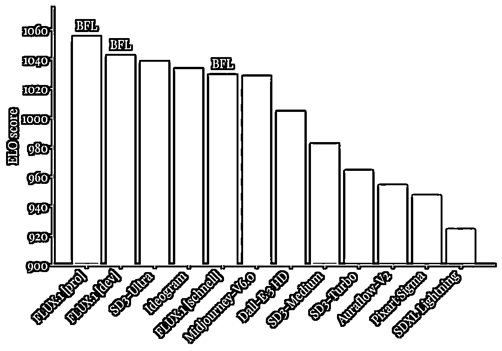

### 二、FLUX 优势说明

看评测说得很厉害的样子，那么 FLUX 到底厉害在哪，我们来看看优势说明。

*   提升的图像品质：FLUX 能够以更高的分辨率生成令人印象深刻的视觉效果，并支持各种自定义分辨率比例的直接绘图输出。在美学评分 ELO 上，FLUX 的得分在很多方面都超过了 SD3 和 MJ6。

*   先进的人体解剖学和逼真度：FLUX 在直接生成完美手指和脚趾的绘图方面取得了近乎完美的成果，显著降低了多指或畸形出现的概率。直白点说，就是画的手、脚比较不会变形，比如多手指，少手指等。

*   精确的英文文字渲染和复杂提示处理：FLUX 能够精确渲染英文文字，并且能够准确遵循复杂的提示语，展现出卓越的处理能力。

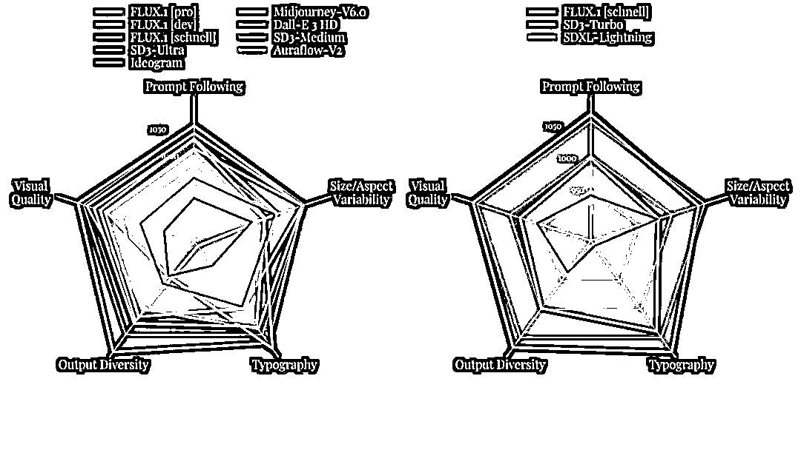

对于小白理解，简化来说就是生成的图片效果更好，分辨率更好，生成的人物手脚不会那么容易蹦。

## 二、Flux 案例分享

那么接下来介绍几个 Flux 我们常见的应用场景。

### 一）新闻女孩

FLUX 开了场 TED“真人”演讲在推特上的热度急剧上升，使用 FLUX Dev 生成图片，再到 Runway Gen3 生成视频，数字人口播已经难辩真假，更进一步推动了 FLUX 的广泛认知。

而这种效果是使用最基础的 FLUX 工作流就可以实现的，接下来我教大家怎么复刻。

打开工作流：

工作流名称： flux1-dev.json

使用说明：

1.  加载 flux1-dev.json 工作流，选择模型，低显存选择 FP8 模型（目前用的最多的）

1.  输入英文提示词，选择参数，调整图片生成比率（1024X1024 或者 1024X1536）

1.  点击运行，等待生成图片。

1.模型存放地址：ComfyUI\models\unet

2.工作流和模型可在文末网盘下载

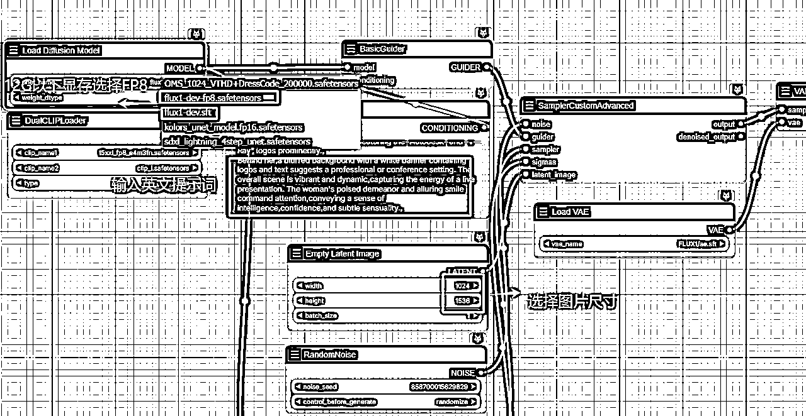

新闻女孩提示词：

提示词：

A captivating young china woman is captured mid-speech,exuding confidence and charm. Her long,black hair cascades down her back,and her bright,expressive face is accentuated by a subtle,sultry smile. Her piercing green eyes sparkle with intelligence as she gestures with her left hand,showcasing a delicate silver ring on her pinky finger. She holds a sleek,black microphone in her right hand,speaking with passion and convicti

She wears a fitted, The uniform is adorned with intricate,shimmering patterns that catch the light,adding a touch of sophistication and glamour. A green lanyard with multiple badges and logos hangs around her neck,featuring the "AIGC" logos prominently.

Behind her,a blurred background with a white banner containing logos and text suggests a professional or conference setting. The overall scene is vibrant and dynamic,capturing the energy of a live presentation. The woman's poised demeanor and alluring smile command attention,conveying a sense of intelligence,confidence,and subtle sensuality.

中文：

一位迷人的中国年轻女子在演讲中被捕捉到，流露出自信和魅力。她乌黑的长发垂在背上，她那明亮而富有表现力的脸被一个微妙而闷热的微笑所衬托。她用左手做手势时，那双锐利的绿眼睛闪烁着智慧的光芒，小指上戴着一枚精致的银戒指。她右手拿着一个光滑的黑色麦克风，充满激情和自信地说话

她穿着合身的制服，制服上装饰着错综复杂、闪闪发光的图案，这些图案能捕捉到光线，增添了一丝精致和魅力。她的脖子上挂着一条带有多个徽章和标志的绿色系索，上面醒目地印有“AIGC”标志。

在她身后，一个模糊的背景，上面有一个白色的横幅，上面有标志和文字，暗示着一个专业或会议环境。整个场景充满活力和动感，捕捉到了现场演示的能量。这位女士沉稳的举止和迷人的微笑吸引了人们的注意，传达出一种智慧、自信和微妙的性感。,

生成图片：

FLUX 生成的图片已经很逼真了，以前 AI 出的图，是一眼 AI，现在 AI 出的图，10 分钟都看不出是 AI 生成的。（当然自己得先过滤掉偶尔出现的瑕疵图片）

可灵转视频：

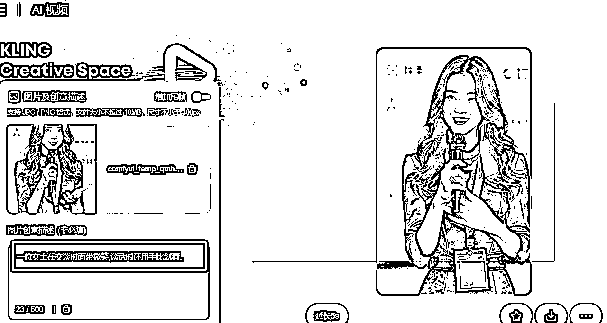

输入提示词：一位女士在交谈时面带微笑，谈话时还用手比划着。

下面是可灵生成的视频：

然后再用飞影转出数字人，创建作品。

https://flyworks.ai/login

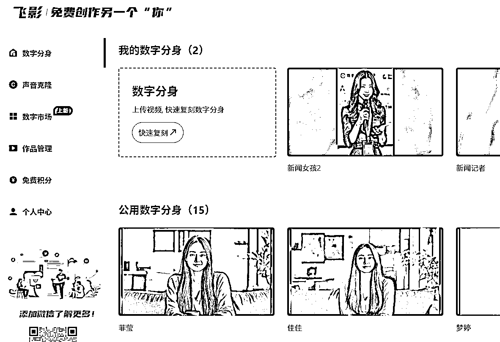

### 二）小红书名媛

这种图的制作方法要比刚才新闻女孩的方法复杂一点，能避过小红书的 AI 检测，也能让人肉眼看不出是 AI 生成的。

在标准工作流上更换 Flux 模型，增加人脸 lora，再增加一些滤镜（如细节增强_Detaile、美颜 lora），就能起到不一样的效果。当然 AI 生成的图片偶尔还是会出现手的问题，后面还是要做一些修手，修脸的节点。

接下来就举一个基础工作流增加 LORA 的使用案例。

打开工作流：

工作流名称：FLux-lora 工作流

使用说明：

1.  加载 FLux-lora 工作流

1.  选择好 lora、设置好参数

1.  输入英文提示词，调整图片生成比率（1024X1024 或者 1024X1536）

1.  点击运行，等待生成图片。

1.模型存放地址：ComfyUI\models\unet

2.lora 存放地址：ComfyUI\models\loras

打开工作流：

使用这个工作流，更换模型和 lora，即可生成逼真的，不同人脸的写实图片。

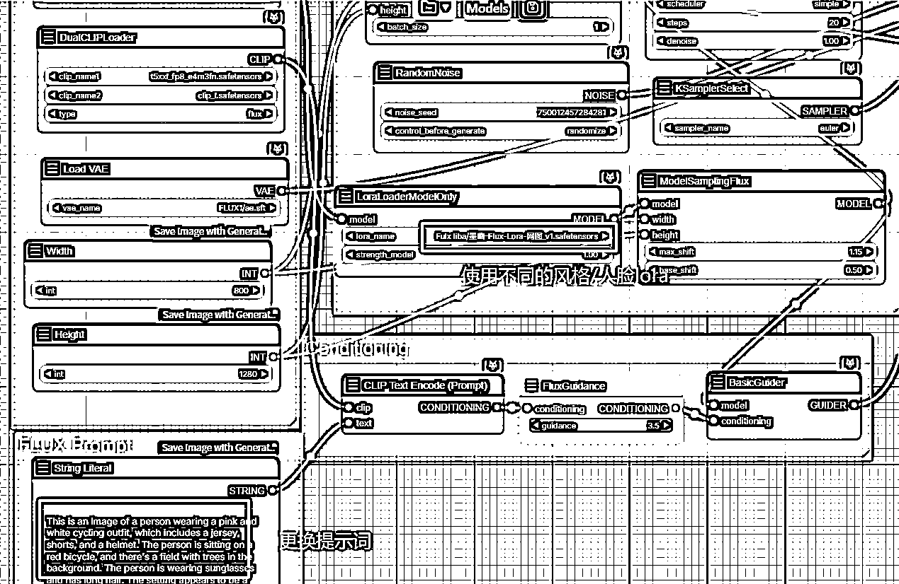

输入提示词：

英文提示词：

This is an image of a person wearing a pink and white cycling outfit, which includes a jersey, shorts, and a helmet. The person is sitting on a red bicycle, and there's a field with trees in the background. The person is wearing sunglasses and has long hair. The setting appears to be a rural or semi-rural area, given the open space and the presence of trees. The cycling outfit suggests that the person is engaged in cycling as a sport or recreational activity.

中文：

这是一张穿着粉白色自行车服的人的照片，其中包括一件运动衫、短裤和一顶头盔。这个人坐在一辆红色的自行车上，背景是一片有树的田野。此人戴着墨镜，留着长发。考虑到开阔的空间和树木的存在，环境似乎是一个农村或半农村地区。骑行装备表明该人将骑行作为一项运动或娱乐活动。

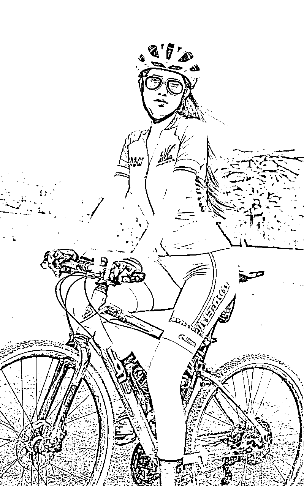

英文提示词：

The image is a high-resolution photograph featuring a young Asian woman standing outdoors on a sunny beach. She has long, straight, dark brown hair and a fair complexion. She is wearing a fitted, light grey short-sleeve top with a square neckline and a high-waisted, grey pencil skirt that accentuates her slender physique. Her outfit is stylish and modern, with a minimalist aesthetic. She is holding a small, tan leather handbag over her left shoulder, and her right hand is raised in a peace sign, adding a playful touch to her expression. The background reveals a tranquil beach scene with a clear blue sky and gentle waves lapping the shore. A tall palm tree with a smooth trunk stands to her left, and a row of white lounge chairs with cushions is positioned behind her. The beach is sandy, and a few distant figures are seen enjoying the sun and the water. The overall mood is relaxed and serene, capturing a moment of leisure and enjoyment.

中文：

这张照片是一张高分辨率照片，照片中一位年轻的亚洲女性站在阳光明媚的海滩上。她有一头又长又直的深棕色头发，皮肤白皙。她穿着一件合身的浅灰色短袖上衣，方领，高腰灰色铅笔裙，突显了她苗条的身材。她的服装时尚而现代，具有极简主义美学。她左肩上扛着一个棕色的小皮包，右手举着一个和平的手势，为她的表情增添了一丝俏皮。背景展现出宁静的海滩景色，湛蓝的天空和轻柔的海浪拍打着海岸。她左边有一棵树干光滑的高大棕榈树，身后放着一排带靠垫的白色躺椅。海滩是沙质的，可以看到几个远处的人在享受阳光和水。整体氛围轻松宁静，捕捉到一瞬间的悠闲和享受。

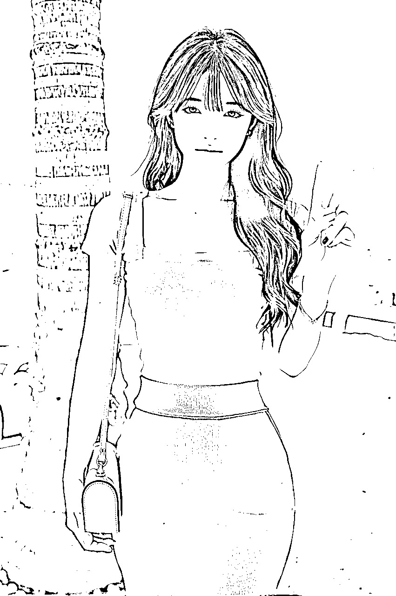

英文提示词：

This is a photo of a person standing on a street. The individual is holding a pink teddy bear and a bottle of water. They are wearing a white dress with a black cardigan, and their hair is styled in loose waves. The person is also wearing a watch on their left wrist. The background shows a residential area with houses and a car parked on the street. The sky is overcast, suggesting it might be a cloudy day. The person appears to be posing for the photo, and the overall mood of the image is casual and relaxed.

中文：

这是一张站在街上的人的照片。这个人拿着一只粉红色的泰迪熊和一瓶水。他们穿着白色连衣裙和黑色开衫，头发梳成松散的波浪形。此人的左手腕上还戴着一块手表。背景显示了一个有房子和停在街上的汽车的住宅区。天空阴沉，预示着可能是阴天。这个人似乎在为照片摆姿势，图像的整体情绪是随意和放松的。

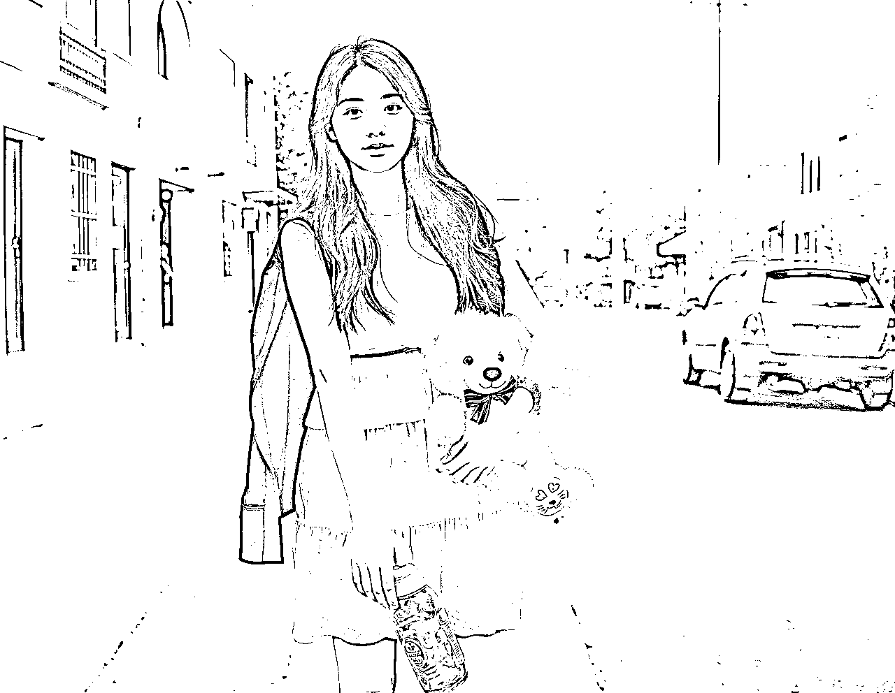

这里要简单说一下，提示词的来源：

第一种，在哩布、吐司、或者 C 站上，模型和 lora 页面，作者和创造者会提供提示词，我们复制下来即可。

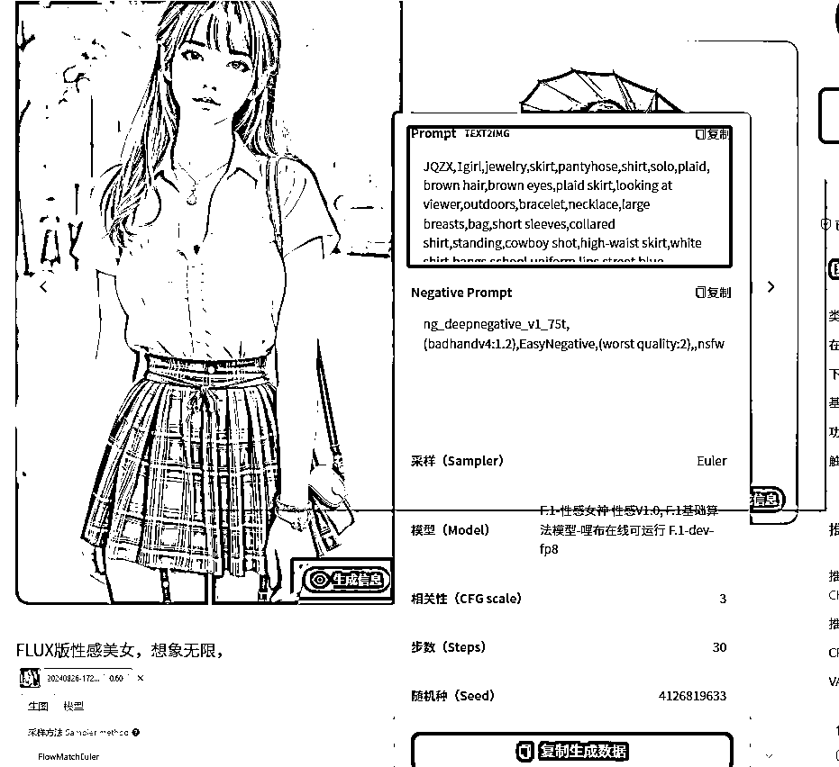

第二种方法，就是使用一些工具进行反推：

反推提示词工具有很多，比如 SD，WD14，以及下面的这个工具。

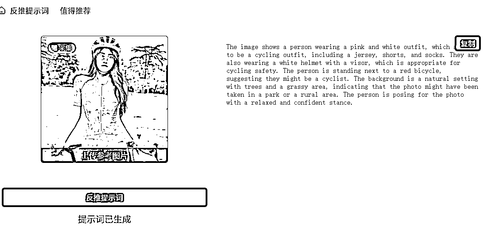

第三种方法，就是反推提示词工作流：

比如使用 Joy_caption 插件，进行反推，Joy_caption 是目前反推提示词最好的插件了，

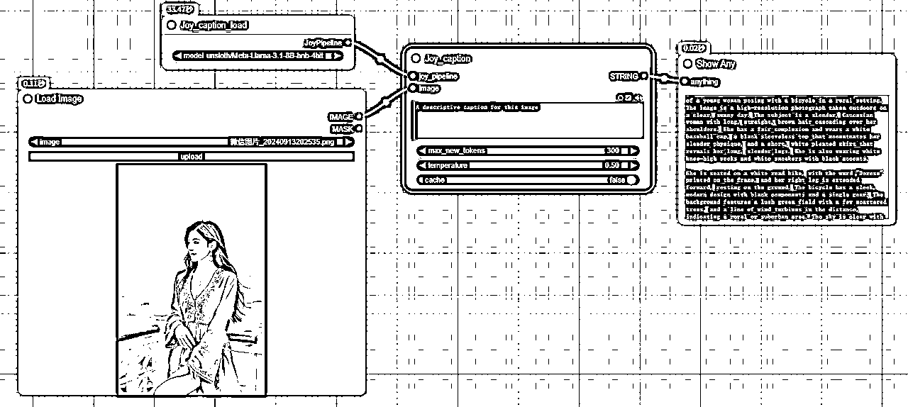

当然，还有高阶的方法，比如使用图生图工作流、WD14 反推提示词节点，大模型反推，IP-Adapter 风格迁移等方法。

### 三）Flux 风格的模型和 lora

#### 

上一步提到的基于 FlUX 训练的模型和 lora，可以在哩布等在线平台下载。

Flux 生态已经很成熟了，有好多创作者炼制了各种风格、类型的 lora。

简单一点，在使用工作流时替换 lora，生成的模特就是不同 STYLE，御姐、萝莉都到碗里来。

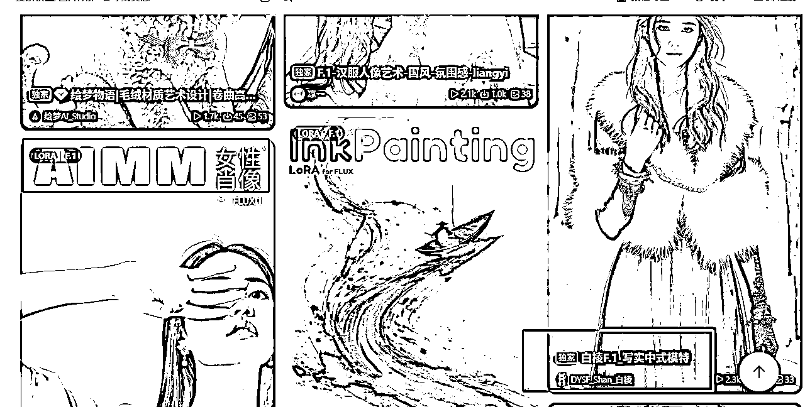

使用的墨幽随拍-F.1_v1 出的图片：

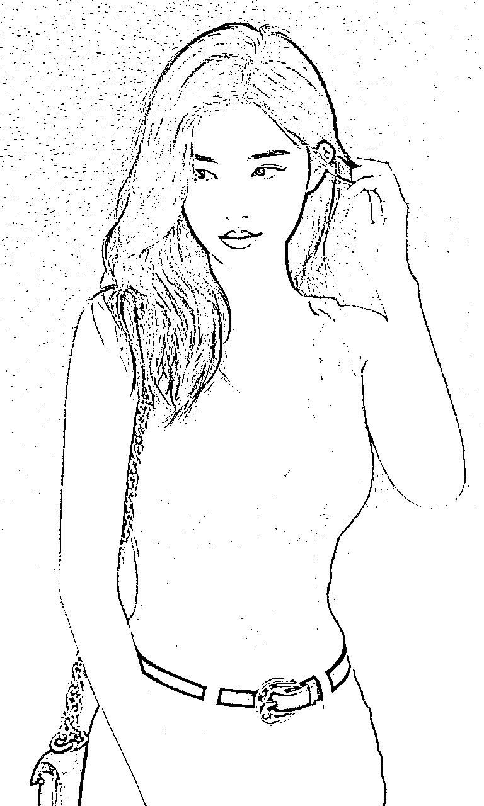

使用不同清一色高级西装 lora 出的图片：

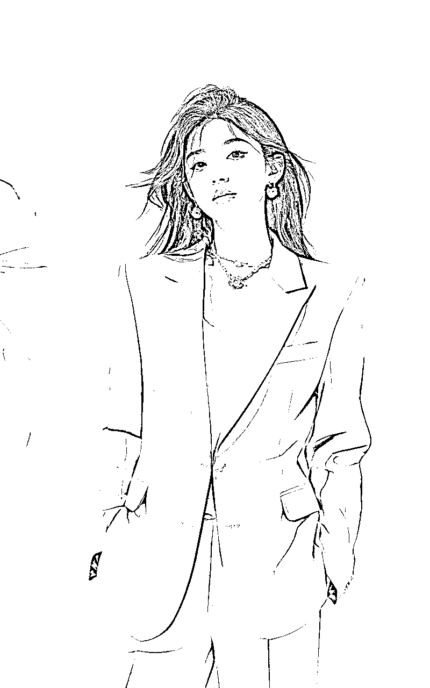

使用方法也简单：

1.在模型或者 lora 页面，看到满意的图片，点击 一键生图 在线生成图片

1.  在打开的在线 ComfyUI 工作流界面，直接点击右上角的开始生图。

1.  如果要修改提示词，在提示词输入区域输入修改过的英文提示词。

1.  点击开始生图后，等待生成图片。（生成后也可以在哩布的图库中找到所有图片）

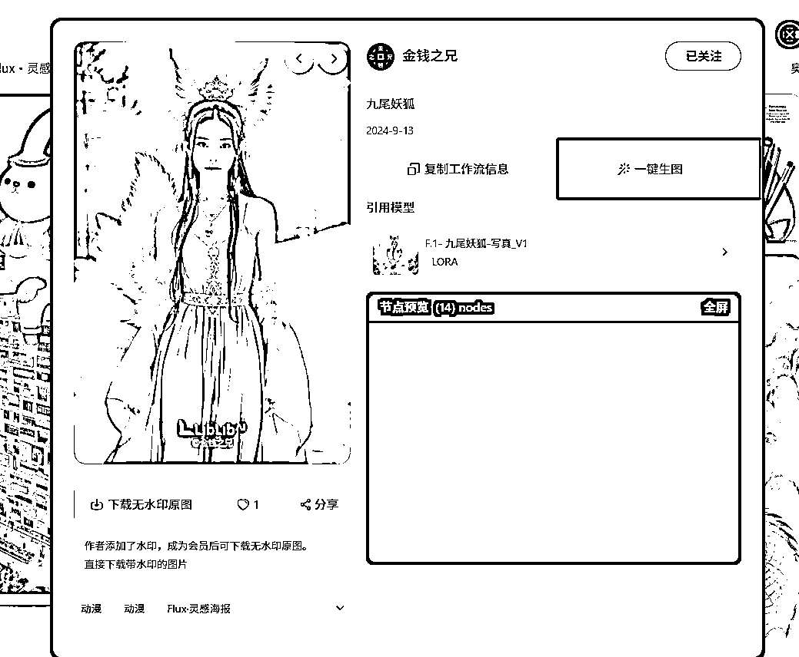

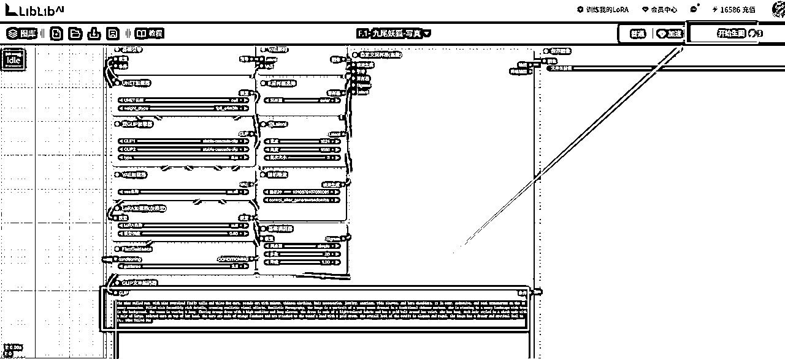

第二种，是下载模型和 lora，放入本地 ComfyUI 文件夹中，可参考上面新闻女孩，小红书两个小节。

### 四） 字节 PuLID 插件

目前 ComfyUI 中已经支持 PuLID 换脸插件，但是比较安装使用复杂了点。

可以使用下字节 PuLID 官网来体验。

PuLID 换脸插件已支持在线使用了，在官方网站上，即可一键出图（有使用次限制）

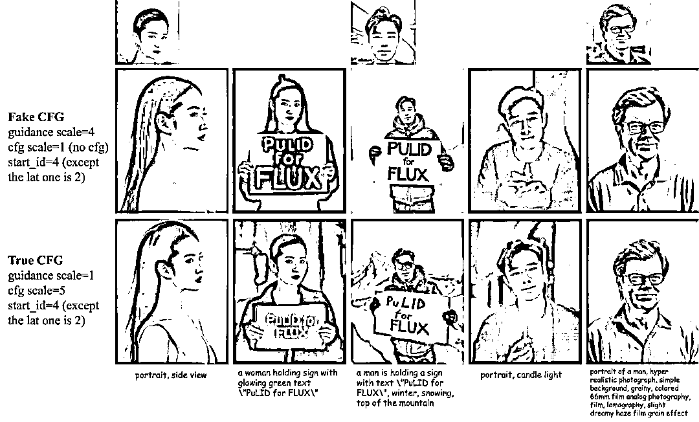

Flux Pulid 在线体验：https://huggingface.co/spaces/yanze/PuLID-FLUX

我试了下，左边是模特图，右侧是 AI 生成的效果图，使用 PuLID 默认的神仙姐姐作为模特：

提示词：This is an image of a person wearing a pink and white cycling outfit， which includes a jersey， shorts， and a helmet。 The person is sitting on a red bicycle, and there's a field with trees in the background. The person is wearing sunglasses and has long hair. The setting appears to be a rural or semi-rural area, given the open space and the presence of trees. The cycling outfit suggests that the person is engaged in cycling as a sport or recreational activity

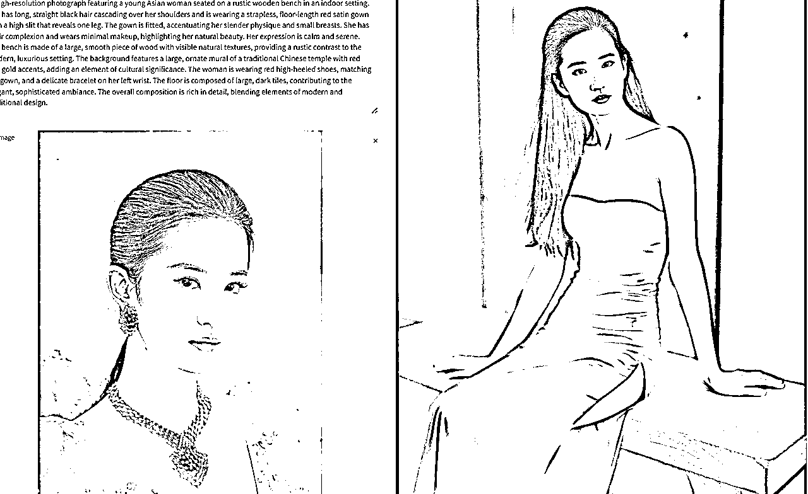

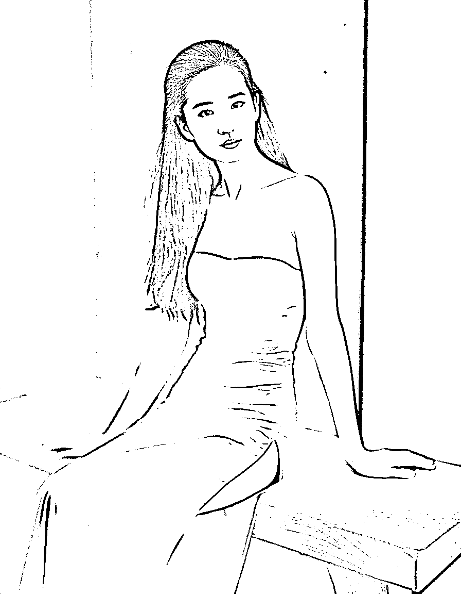

提示词：This is a high-resolution photograph featuring a young Asian woman standing indoors。 She has a slender physique and fair skin, with long, straight, dark brown hair cascading over her shoulders. Her facial features are delicate, with large, almond-shaped eyes accentuated by subtle makeup, and a full, pink-lipped smile. She wears a form-fitting, lavender-hued dress that highlights her hourglass figure, featuring thin spaghetti straps and a low V-neckline.

In her hands, she holds a small, decorative folding fan with a floral design, adding a touch of elegance to her appearance. Her nails are manicured and her makeup is subtle, with a focus on her eyes and lips. The background consists of a rich, red rose wall mural, creating a romantic ambiance. The setting appears to be a cozy, dimly lit café or lounge, with a wooden table and chairs visible to the right, and a warm, ambient lighting from fairy lights adding a soft glow to the scene. The overall composition is elegant and intimate, with a focus on the subject's serene and confident demeanor.

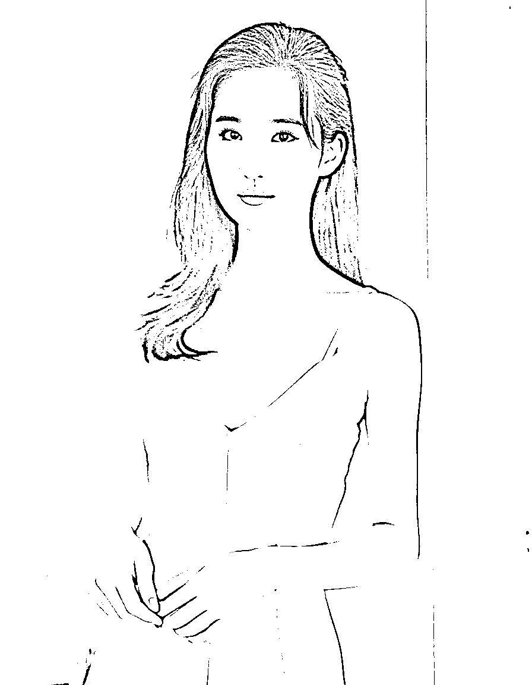

目前，字节 PuLID 体验有使用次数限制，出到第五张图就报错了。如果要继续使用，那得多注册几个账号来薅算力了。

从使用效果来说，肯定是没有自己训练的 Flux lora 效果要好。但是比较训练 lora 是一个技术活，足以难住大部分人。使用 Flux PuLID 一致性风格迁移，是否能满足需求，那得自己评估了。

当然，我们还是期待 PuLID 能早点支持 ComfyUI 调用，这样就能在节点中自己添加 lora，ControlNet 模型，放大，修复等节点。

## 三、Flux （ComfyUI 工作流）使用方法

首先简单科普下 ComfyUI，Flux 模型的主要使用方式是 ComfyUI（SD webUI 也可以）。

ComfyUI 是一个基于节点流程式的 stable diffusion AI 绘图工具， 你可以把它想象成集成了 stable diffusion 功能的 substance designer， 通过将 stable diffusion 的流程拆分成节点，实现了更加精准的工作流定制和完善的可复现性。（但节点式的工作流也提高了一部分使用门槛。)

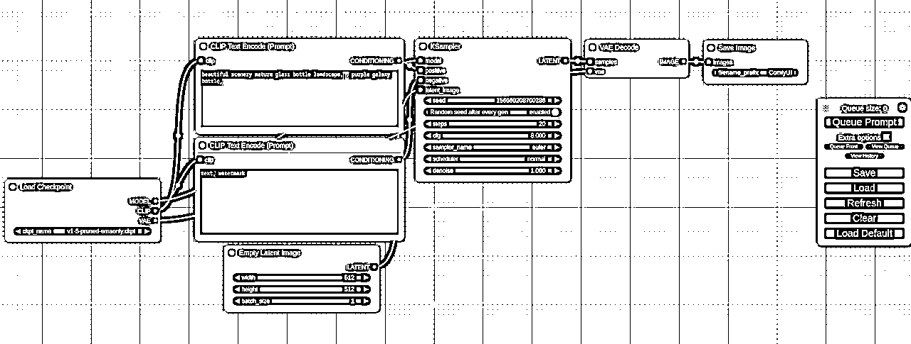

小伙伴们可以去看我在星球的精华帖《ComfyUI 宝典-新手入门和使用手册》。

文章地址 https://t.zsxq.com/fkupy

### 一）官方在线体验

如何使用 FLUX.1？ 最便捷的方式是在开源平台 Replicate 上可用。

Black Forest Labs 官网：https://blackforestlabs.ai。

在线体验方式：

*   专业版：https://replicate.com/black-forest-labs/flux-pro

*   开发者版：https://replicate.com/black-forest-labs/flux-dev

*   快速版：https://replicate.com/black-forest-labs/flux-schnell

体验地址：https://replicate.com/black-forest-labs

官方的 3 个版本，提供了在线体验的环境。

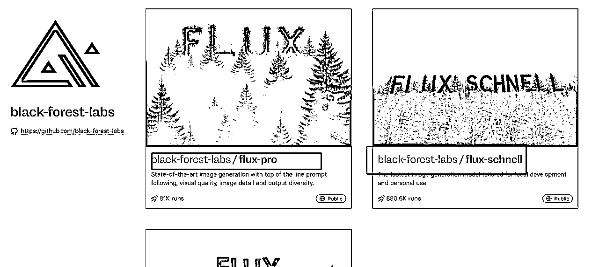

以 flux-dev 开发版为例，打开页面，输入提示词，选择分辨率，点击运行即可，在 1 分钟内就生成图片。

### 二）在线平台使用

LIBLIB 平台提供在线的 FLUX.1 工作流，内置了模型，使用时只需要点击一键运行即可。

哩布上已经有多个开发者发布了 Flux 在线工作流，可在工作流区域，选择使用。

https://www.liblib.art/workflows

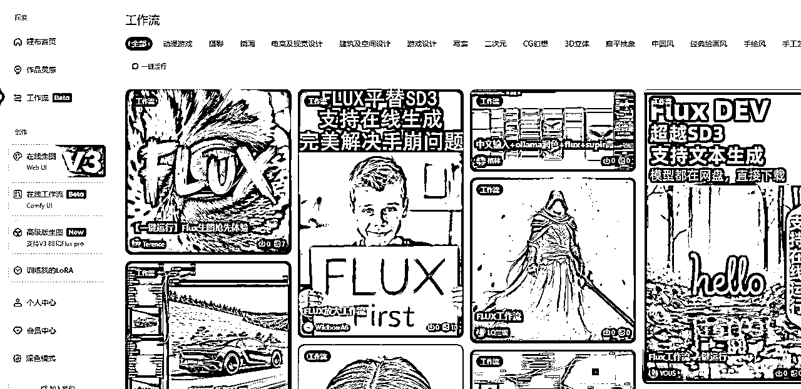

打开工作流后，输入提示词，点击右上角的开始生图，即可使用。（普通用户每天送一定作图使用额度，哩布冲会员生成图片速度会快点，）

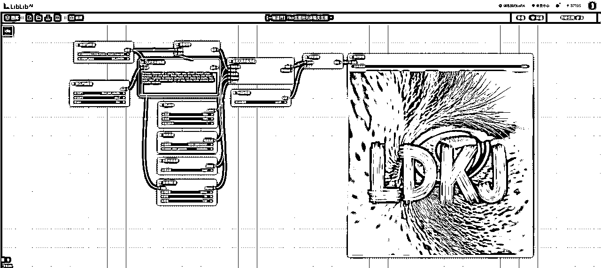

### 三）云服务器使用

在使用 ComfyUI 工作流时经常遇到插件安装，模型下载的问题，创作者（平台方）可以在云端部署 ComfyUI 镜像包，用户租赁云平台服务器，即可使用平台的显卡资源和创作者部署好的工作流。

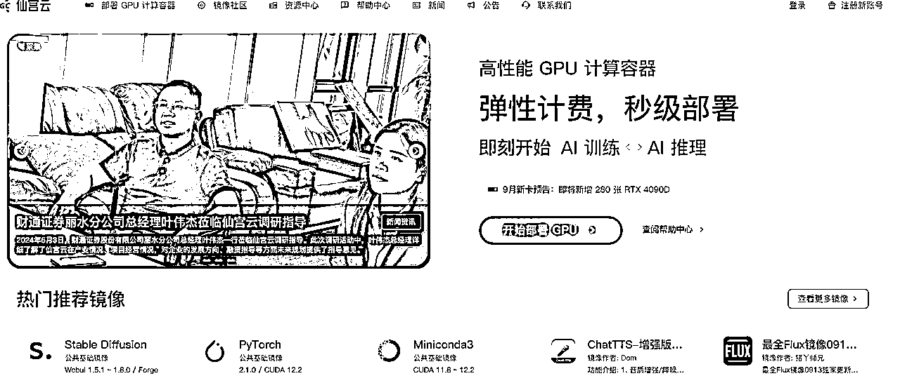

### 四）本地部署

ComfyUI 的本地安装有两种方式：下载官方纯净版，以及整合包（如葉 aaaki 大神、Blender 无限圣杯）。官方纯净版不带插件和模型，环境比较稳定。整合包会内置常用插件，基础模型，插件的安装和升级更方便。

本地安装 ComfyUI 的硬件环境是：Windows 系统，NVIDIA 显卡，显存 6G 以上。

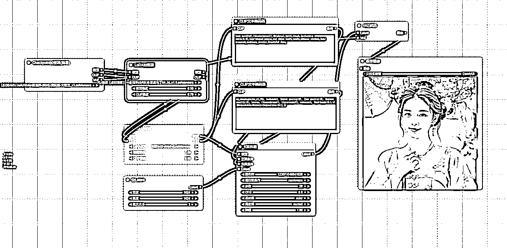

ComfyUI 的最新版本现已兼容 Flux 模型，您只需将 ComfyUI 升级至最新版即可享受这一新功能。

ComfyUI 官方文档：https://comfyanonymous.github.io/ComfyUI_examples/flux/

github 地址： https://github.com/black-forest-labs/flux

## 四、资料分享

Flux 模型，工作流：

链接： https://pan.baidu.com/s/14SQpi0PIMNROnjD-kKKLdg?pwd=9c38 提取码： 9c38

最后再介绍一下我自己，我是行者，IP 定位是 AI 绘画视频。

主要方向： AI 绘画，AI 视频，ComfyUI 工作流的玩法等。