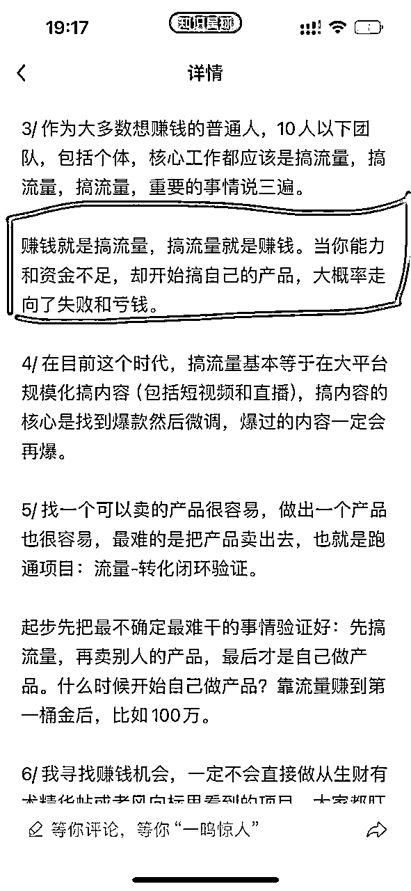

# 躬身入局，中老年知识付费项目复盘：半年投入近8万，只转化了7个用户

> 来源：[https://z1zu4xvq1ns.feishu.cn/docx/MdCedv6XZoNFpLxG2dgckIq5n4b](https://z1zu4xvq1ns.feishu.cn/docx/MdCedv6XZoNFpLxG2dgckIq5n4b)

自从小红书电商女装复盘发布之后，我们在那200平月租2万的豪华办公室里继续苦撑一个多月后，终于还是灰溜溜地撤退了，按合同约定不满一年，2个月的押金不退，所以这块又是损失4万。好在房东也许是看到经济不行，没有揪着我们合同上写的必须提前一个月通知这一条，所以，没有让我们再额外赔偿。

为了节约成本，我们搬到了一个回迁改造的居民楼里，月租金几千，算是松了一口气，至少觉得这次能苟的时间可以长一点了。

这也是给我们最大的一个教训就是，新人做项目做业务之前，绝对不要高举高打，整什么豪华配置（当初是考虑到办公环境好才好招人，毕竟一开始就在居民楼的时候谁愿意过来呢？）。

自从女装项目失败，清楚自己完全做不了一点能力圈以外的事。

暂时也没有什么别的项目可做，不管是性格还是年龄也不适合按部就班地去打工。

所以决定，还是持续通过实操项目来打磨自己的各种能力。

# 为什么做老年人培训项目？

其实在做女装项目之前，我就看过银发经济相关的精华文章，心里一直在留意，认可这个方向，尤其是针对中老年人群的兴趣爱好类的线上培训细分类目，只是打心里认为这种培训类项目要做大前期可能需要很多钱。

而我误以为女装电商项目可以更快来钱，还天真的想象过，小红书电商项目做起来之后，把项目交给别人，然后通过电商获得的现金流为老年人项目当血包。

我为什么认为培训项目需要很多钱，是因为身边有团队在做职场教育培训，一个月投放买量就要烧掉几百万，养着百人的销售转化团队……

等女装项目关闭后，我把生财上有关银发经济的所有文章都看了一遍，我朋友更猛，花了整整三天时间，把生财上整个老年人相关的所有项目、知识碎片全部整理了出来，做成了一份知识手册。

上次女装复盘文章提过我朋友，他完整闭环了小红书数码产品，会做流量内容和投放，也是对电商感觉到厌倦，我俩决定一起弄银发经济的项目。

两个人来来回回聊得比较久，两家人还一起吃饭碰面，深度沟通，大家都认可这个事情，决定好好干。

电商我俩肯定是不碰了，其他我们也一个没做过，但我俩都做过培训，所以银发经济的知识付费成了最后的选择。

（注：后面的叙述我会刻意多次使用“主观上以为”“自认为”“我觉得”这样的用语，是因为当初确实这么认为，结果实际发生的很多事根本不是那样，后面会细说）

所以，捋来捋去，只有老年人培训项目， 主观上以为全部都在我的能力圈范围之内了：

1、我做过知识付费的培训，做过群裂变和近千人的公开群发售，经历过完整的交付闭环；

话说起来，当年做那个培训，自己才从职场上出来，也是从0到1去学去模仿去请教，克服各种困难给攻下来的。带给我的成长真的特别大，也是我独自经历和操盘的完整项目（除了群裂变和公开群发售那次活动我和一个外部团队一起合作之外），可惜自己后来思考人生去躺平，没有好好地去写一份复盘总结文档，特别后悔。

2、老年人喜欢的东西，书法国画养生中医国学等等，全是我的兴趣爱好。

我自己本人在求医问药的过程中对传统文化产生了兴趣，虽然我不懂，但我很愿意去了解和接触。甚至还想过财务自由了就要专门研究这些。所以在源动力上至少没有太大的问题。

3、老年人对审美要求不高，刚好我完全没有审美，哈哈。

自从女装这个项目让我知道，想做女装没有穿搭审美拍摄构图真心别碰以后，我这个没什么审美不在乎外在的人，自认为自己找到了舒适圈。

4、课程类产品很轻度，不用操心供应链问题。

老师生产出来以后就永远不用操心了，也没有什么时效。再过去500年，课程还是这些知识点，哈哈哈。

要知道，当初做头条课程我有多么痛苦，每一次生产出课程，头条隔三差五地给我改规则，我就要赶紧盯着然后马上修改。一开始的课程是文字直播还好。后来升级到视频课的时候，修改就比较头疼了，当初就特别讨厌围绕某个平台做课程。

5、我非常愿意帮助人，用户因为你变得更好让我很快乐。

做电商，毫无尊严，用户是上帝，你是孙子；而培训类，你是老师，你有尊严，而且用户是来学习的，进步的，你赚到了钱，用户获得了成长和满足。我就特别喜欢学员对我说，因为遇见我获得了改变，诸如此类的，让我特别有成就感。

那老年人培训也是一样的，想象一下一群热爱学习的老大爷老太太，因为我做这个事，让他们在晚年获得了精神世界的享受，还能认识一群兴趣一致的同龄朋友，光想想我就觉得美好。

6、朋友喜欢研究流量，而我喜欢迭代产品和服务以及做交付，有了可靠的助力。

以前总觉得自己孤军奋战，一个人需要搞定全链条，很辛苦，一直渴望找到合适的合伙人。

这次，我自认为找到了伴，一个弄流量，一个弄产品和服务，这种组合，真的很完美。

与此同时，生财在3月份时还开过一个中老年培训的航海实战，里面的手册非常详实，基本是等于保姆级喂饭了，自认为一切都是天时地利人和。

一开始，我们计划好，先从书法这个品类入手。

流量端和产品端得先跑通一端，打算先直接分销正在做这块的财友渔火老师的书法课程，等跑通了完整的小闭环了，再开发自己的产品。

那时候航海虽然已经结束，我还是加了他说明来意，申请成为推广员。

我们按手册里说的一步步操作，但是，视频数据效果很一般，播放量都是七八百，没有任何互动，偶尔一两个点赞。朋友有个视频跑出了几万播放量，但来的都是看热闹的，很难转私域。

我们还完全整不明白视频号的推荐分发机制，它和小红书似乎是两套逻辑。

这时候，我观察到越来越多的同行进场，而我们进展特别慢，本来我俩还给自己定个小目标，说5月份还有21天，我们俩用15天剪辑视频引流，剩下一周转化，21天跑通，相当于我俩给自己整个“小航海”，但是两个星期过去了，毫无进展。

看吧，我总是容易盲目乐观主义。

那既然流量端不会那么快跑通，而同行又越来越多，我就开始琢磨加快速度，提前准备产品端，然后到时结合朋友的流量能力进行投放买量，迅速做起来。毕竟培训这个事，就算前期获取用户成本如果高一点，但是后续用户持续的复购以及这个目标人群的未来想象空间，绝对是获取成本的100倍。

所以我要迅速做这个事，快速抢用户。

和朋友说了这个想法以后，他觉得可以。

于是我和朋友兵分两路，我负责解决产品端（我跑通过知识付费闭环），他去解决流量端（他之前跑通过小红书的流量闭环）。

自己做产品最大的好处就是自己能全权把控服务和交付质量，直接卖别人的产品，会担心用户在你这里花了钱，因为信任你购买了别人的产品，结果服务不好或者产品不太行，我心里也会内疚。

# 创业以来最大的坑——流量没跑通就去弄产品

后来才知道，当初这个决策，是创业以来最大最大的坑。

### 首先，产品端并没有那么容易。

等真开始做了，发现很多事情看起来简单，执行起来就超级多细节需要考虑斟酌：

1、课程体系怎么安排？怎么做差异化？价格体系怎么设置？

2、免费体验课到底录什么内容好？

3、社群转付费时，付费课到底定价多少合适？

4、初始付费后再付费的课程适合定哪个？

5、录制课程的成本控制问题？一套体系课50-80节，成本也不小。

6、上哪找会教会讲又专业的老师？怎么辨别？

7、合作合同要怎么写？

9、课程配套的礼品包怎么找靠谱的供应商？

10、具体录制要怎么录，双机位、多机位怎么弄，怎么教老师

11、课程的版权归属问题

12、……

还有其他数不清的各种细节。

这个过程中，我实在没有办法，只能硬着头皮咨询了渔火老师，发红包提问，毕竟我只知道他一个人在弄这个，没有别的人请教了。也做好了被他拒绝的心理准备，毕竟我是要当他的同行一起竞争。

渔火老师并没有因为我要做一样的事就拒绝回答，给了我很多非常有用有价值的信息，真的非常感谢，他让我多调研市场、调研用户，看用户喜欢什么课程，绝对不能听书法老师们的。

因为书法老师们根本不懂营销不懂用户不懂市场。

目前市场上各种书法课程，体系非常混乱，课程非常多，即使我自己是个想学书法的小白，作为一个消费者的角度都会觉得犯难。

在这一点上，我特别佩服渔火老师，他在什么都不懂的时候，仅能通过用户调研就能开发出这么多课程。他一直和我强调要做用户调研，不能自己主观去看，但怎么弄调研，我很不擅长，不知道这群老年人用户到底在哪，哪里能看到他们的需求。

但是，只要是成人书法，很多需求大概是共性，不分年龄段。

于是，我就上一些课程平台去看书法相关的课程销量，又上电商平台看一下哪些字体、字贴卖得火，来增加自己的一些行业认知和理解。

还特意买了很多书法相关的书来看，看他们针对小白是怎么设置目录的。

既然要做，就做好，自己也要懂一些。

期间也通过刷直播潜伏卧底到几个同行的免费群里，看他们是怎么做免费课，又是怎么转化，留意他们的课程安排、转化话术、一对一用户。

让我难受的是，一些机构同行每天发给用户的信息，已经到了骚扰的程度。

每天早上、中午、晚上、开课前5小时、3小时、1小时、半小时、10分钟、5分钟一直给你发信息，提醒你。我统计过，单独私信一天就20多条信息。要不是为了观察同行，我真的分分钟都忍不下去了，甚至你如果没点链接进去听课，还会语音电话给我，说检查到我不在直播间听课，用户真的受得了这样的对待吗？

但是在群里好几天，又确实看到这群大爷大妈们超级配合，让签到就签到，让晒作业就晒作业，让干什么就干什么，让我无比震惊，配合度也太高了吧，这一度让我朋友怀疑群里是否全是托。

我是否要模仿这些同行们？但我自己作为用户都极度反感呀。

说实话，同行做的体验课确实抓住了书法爱好者的一些痛点，所以他们在讲的时候一直反复强调，只要跟他们学，就能很短的时间出效果。

然后看老师在示范的时候，发现一些主讲老师的水平很一般，笔画都是直接描的，不是一笔写成，因为自己买了书、也看了大量资料，知道这样是误人子弟。

这时候，就有一个问题了，你做销售做流量就必须考虑人性，但是书法学习本身又是反人性的。谁不想快速看到反馈和效果？目标用户都是老大爷老太太了，谁还有时间和耐心慢慢磨？

到底是应该快餐式教学，还是应该认真打磨做好基本功深度交付？

做前者，能活下来但时间久了口碑没了。

做后者，可能因为一直招不到真正懂这些理念的优质学生，扛不到能顺利活下来的时候。

同时，我也把市面上各种机构的或书法老师的课程一一细看， 像一个打算找一个靠谱老师学习的人一样去做功课。

搞钱当然要搞，但是我也希望自己提供的课程是真的在专业度上能打的，书法这些艺术相关的课程，我要抱着专业、负责的心去打磨，去设身处地地为用户着想。不希望出现用户花了很多钱学了几年，结果进步很慢甚至没效果的情况。

我在看《小米创业思考》这本书里，给我的启发是，忘记掉你的同行在做什么，一切只从用户的需求出发，只为用户着想。

我告诉自己，不管你的同行他们在做什么样的课程，你只需要问你自己：“你现在是一个想学书法的小白用户，或者你的孩子及朋友想学书法找你推荐，你最希望对方提供什么的课程，什么样的教学体系和服务？……”

一句话，我想做更加长远的事，我想要口碑传播。

这个时间的投入对我来说很值得，我通过几天的研究、对比、观察，尤其是在看到了非常优秀的课程体系设置之后，对书法学习的整个框架和思路都有了非常清晰的把握，再看同行的课程体系，我也能知道孰优孰劣了。

但是我也确实发现，同样做老年人课程，做得大的几个同行的课程，和专业的课程完全没法比，我不知道这是不是他们做了大量的数据测试之后对市场进行妥协的结果。

毕竟，他们明明有足够的资金和能力，去找到非常优秀的老师去录制高质量的专业课程，但是为什么他们不这样做呢？

这个疑问一直萦绕在我做整个项目的过程中，一直到我开始弄流量和转化，稍微有一点点答案。

但不管怎么说，我带着一切为了用户需求和口碑的角度出来，真的沉下心来找老师，弄课程产品。

我通过朋友介绍、各种群推荐、boss直聘等多种方式，花了一个月的时间，前后沟通了近400人左右，其中最多的就是boss直聘来的。

这里面有专业美院的，有自学的，有中书协省书协的。

一开始，我只盯着所谓的头衔，以为头衔越高，学校越好，作品越好，教学能力也不用担忧。

后来发现，书法这个圈子水太深了。

如果不是花精力进去研究了解的，小白想找个好老师带着学书法，真的非常难。

在这个过程中，我不断迭代自己挑选老师的标准，到后面，就有了一大堆的筛选流程，从专业院校、头衔、教学经验、到看本人作品（找了专业的人当顾问，并且进行交叉验证）、到笔法理论、到试讲视频到系统教学规划，到作业批改……

总之，我整了一大堆这种东西。

最后从400人里挑出了8个左右。

顾问说，我的这个老师配置，比他们看到的很多线下艺考生机构的配置还要高。

我心里想的是，用户想学书法，我就一定要给他们最好的，最专业的课程（后面证明，这想法又错了）。

总之，从5月到8月，我都在闷着头弄产品，研发书法课程。

甚至还花了大量的时间去验证老师录制的视频内容讲得如何，如果讲得不细，我自己本人或者同事作为小白们，都听不懂，get不到，就不合格。

不管怎么样，算是克服了重重困难，终于有了整体的雏形，有了可以推的初步产品。

整个过程，完全没有怎么管流量，心里想的是，朋友那边会研究，我不需要怎么管。

### 说好一起干的朋友，半路去学习暂时没法一路同行了

在我弄产品之初，朋友开始还一直担心我会突然换赛道，怕我是三分钟热度。我明确表示自己这次会沉下心认真弄。

然后因为视频号的流量机制和小红书完全不同，朋友觉得有点水土不服，决定不研究视频号了，还是研究小红书。同时说，如果我自己有精力，建议我自己也研究一下视频号。

慢慢的，我们的联系开始变少了，从零星的几次互动里，拼凑出一个信息，他好像没有在弄书法了，具体我不太了解。

到了8月我告诉他，我的产品初步有雏形了，合作老师都敲定了，可以开始推广了。

他说他很忙，他在一个很远的地方跟着某位有结果的人学习怎么做流量，帮别人搭建什么团队，细节不太了解。

期间我还特意让他来办公室给他看了一下我整个产品体系规划，录的部分课程视频，合作的老师等等。只是想表达，我一直在非常认真地做产品。

我甚至还特意当面问了一句，他是否还要继续一起弄书法，他点着头，但还要继续学习处理完手上的事，弄完了会联系我。

但是我心里已经开始凉了半截。

我自己也有全职的小伙伴，也是转行过来的，什么也不懂，在我弄产品的时候，既然朋友不想研究视频号了，那就让这位同学去研究吧，按手册里去操作，但效果很差。那时候我想着，反正朋友那边在研究流量，我把产品认真做出来，大家一起盘一盘整合整合就好了。

但是，随着时间的流逝，我才意识到，我不该把希望寄托在别人身上。我明明没有什么主动获取流量的经验，却想着不用管流量，把时间都浪费在产品研发上。

我不知道朋友需要多久才能腾出手来和我一起弄，我不可能一直等着他，我需要养活团队。

总之，我意识到，既然弄了产品，现在流量这块也必须自己亲自上了。

等真正的弄流量了，才知道自己错得有多离谱！

# 普通人想搞钱，一定要先搞流量搞流量

前不久，亦仁的小灯塔里给新人的建议里有一条，就是“普通人想搞钱，一定要先搞流量”，

一开始不要做产品这个忠告，不止亦仁讲过，其他人写的文章里也反复强调过。

我甚至在开始之前，还看过一篇程序员独自研发了半年的抖音小程序产品最后发现没用户的复盘。

以前看这些，真的没什么感觉，印象不深刻。

只有亲自经历过，才知道这些话句句是良言。

明明看了这些，我却还亲自跳进去。

哪怕当初朋友是铁了心一起弄，我也不应该直接去搞产品。应该两个人一起把流量弄懂，跑通。

更不用说如果是一个人自己弄，更应该先搞流量。

因为不管你卖什么产品，你都需要用户，都需要获客。

我什么也没弄过，毫无经验。没办法，只能硬着头皮尝试。

### 1、模仿同行尝试直播书法教学卖1元体验课

8月下旬，先试着模仿做得大的同行的模式，也搞书法主播进行直播。

毕竟之前挑选合作录课的老师时，我也有大量的老师储备。

但这时候，才发现同行们把直播价格开始卷起来了。他们给主播们的待遇是一小时40-100元不等，还有提成。同时他们还会和各种书法达人们合作，获取一个用户名片给20-30元左右。

如果按5%的转化率，实际单个付费用户获取成本是600元！而这种合作方式就有非常大的漏洞可以钻，比如推过来的用户是否精准，是不是水军，会不会是合作的人专门薅羊毛的。

我当时还笑同行蠢，这么高的获客成本，怎么赚钱？

等到自己做了，才知道小丑竟是我自己！

因为起初我认为这样的成本太高，一个实际付费用户的成本是600元。结果我们自己真的招了主播实际播了，换了好几个不同的主播去尝试，王牌主播我们给到了100元一个小时的待遇，可以做到一小时场观1500-2000，其他主播平均都是200-400场观。

转化很差，不用提了。

我们的分销团队也找了8个人，搞了半个月，居然一个用户都没有。

最后一算账，折腾半个月，实际只弄到13个用户加上微信，仅引流成本一个用户就高达300元，而同行是20-30元哦。

小丑不是我又会是谁？

于是把所有的分销兼职和主播全部停了。

请主播贵成本高，那我们自己试吧，虽然不懂书法， 但是我们可以自己按航海手册里说的打印一些作品和资料，直接这么介绍。

但是基本就是秒进秒出，一方面我的手机设备就是几百块的安卓机，一方面灯光也不行，画面很模糊，再就是整个场景非常糟糕。

问了公司其他项目小伙伴，说我们的场景看起来就像是骗子在直播。

这时候都不是什么紧张不紧张的问题，而是到底说些什么能让这些一个个活生生的用户愿意停下来听我讲一讲。

总之，不管是我们自己直播、还是招兼职主播，还是我们私信话术，没有一样是数据理想的。

回想自己，在开始研究产品的时候，还各种纠结产品的定价、课程体系，各种进行成本测算，太滑稽了，

没有流量，一切都是0！

当初甚至还花了大量的时间去研究书法的具体的笔法教学、具体的产品细节的东西，现在想想，完全搞错了重点。

只要我找的老师足够专业，内容没有大的问题，不是那种随便糊弄的垃圾产品，能好好交付就行了，产品的优化和迭代应该是在有了大量用户之后再请个专业的课程研发来负责即可。

我真的不应该浪费那么多时间在一些细节的优化迭代上。

我总算是认清了现实，做这个项目，完全就是个草台班子。

打算还是老老实实研究短视频来引流。

### 2、尝试摸索弄一下数字人

这时候，刚好又看到数字人训练营的消息，我一听AI数字人，感觉可能是我们项目未来的一种希望，果断报名，并且和同事一起学习。

但群里的同学或是教练们都没弄过书法，给不了什么建议，甚至有个教练听到我在弄书法，第一句就是让我换赛道。

我说我已经在这个事情上投入了几个月和很多钱弄产品，换赛道是不可能的。

所以只能我们自己摸索，比如把美食或者别的产品带货爆款视频的文案研究一下，看着怎么根据书法来修改，一开始我们做的即创的公模也试着做几个，但无一例外，不知道是同质化太高还是什么，都是只有一千播放，不知道是限流还是因为内容差。于是我们考虑换脸技术。

又额外花钱，配置上全新的电脑，又是一笔投入。

但是整了大半个月，数字人的数据还不如我们之前弄的书法笔画教学，效果更差，效率更低。

只好又回到开头，还是只能按生财航海手册里写的，认认真真的剪视频，认真地完成主动私信，认真地做好最基础的执行工作。

不要想什么数字人、什么ip，先把基础的执行做好。

渔火老师也提醒到，这些东西都不能交给自己的员工做，必须自己亲自做。

员工招过来是执行的，是不需要他们动脑的，让员工去开疆拓土，完全不现实，不要对一个执行层的人有任何期待。

这当然又是我在管理上出现的失误。

毕竟觉得招的小伙伴以前在其他行业是当领导的，带过小弟的，现在又愿意来创业公司从头开始，那不是来一起奋斗搞事业，那是来干什么的？

总之我在管理上也出现了重大失误，把一个沙和尚型的人当成了孙悟空去使用，这里就不细说了，都是教训和泪。

### 3、流量能力跟不上，辛苦弄来的私域用户也会流失

东搞西搞，老实执行啊，开始有用户加微信了。

按手册和同行们的做法，都是让用户参加五六天的免费体验课，然后在最后两天集中进行转化。

但是要做群发售，最少也得100人吧。

结果我们足足整了一个月，才凑起来这100人。

而且最后实际进群的80人都不到。

因为最先加上微信的用户他们等得太久了，早就流失了或者删除了你的微信。

等到第二次我们更加努力，半个月引流了近300人时，也只有180人进了群，流失率又高达40%。

如果流量能力很强，一般加上微信的用户等待的时间不宜超过一个星期，但是我们让用户等了半个月以上甚至更久。

相当于是，每一次辛苦引流，有一部分是白白浪费掉了。

我从9月开始认真搞流量，到现在复盘文章撰写之前，45天的时间，只是勉强完成了两次的群发售。

因为流量能力跟不上，来的人实在是太少了。

除了这个，销售转化也存在巨大的问题，那就是根本转化不了，销售不动。

两次群发售，转化率不到1%。

### 4、群内99%是白嫖党，用户付费能力极低

当初除了自己的能力圈这些考量，也比较看好大家说的银发经济里中老年用户有闲有钱，付费能力高。

但实际做的时候，完全是两回事，我不明白问题在哪里。

我们做的6天免费体验课，认真记录了数据，同行每天交作业的量以每天15%的速度下降，而我们这边是听课率、交作业率，都是不降反升。

很多用户都会私下告诉我，感谢我们，感谢我们这么高质量的课，感谢这么认真的服务，对他们帮助如何大。

我一直以为这是高度认可了，对转化数据信心爆棚。

结果到了要他们花钱的时候，一问一个不吱声。我的价格还是非常低的价格。

同行收费2000多的情况下，我们只收几百，却还转化不动。

我也对用户做了各种回访调研，要么说是只想写字玩玩不想有任何投资，要么说是没空，要么说是已经在同行那边报了班了没时间在这边学了（那你们都花那么多钱报班了干嘛还要来听我们的免费体验课呢？）

甚至还有用户更奇葩，看到我们的免费课快结束了，赶紧换下一站，加了我们其他账号的其他流量微信，又来打听有没有什么免费体验课。相当于是，他们不花一分钱，不断地去换不同的机构白嫖课程和作业批改服务。

我百思不得其解，我认为是引流过来的用户不精准的问题，没有消费能力。

但是渔火老师认为是我们的转化流程和产品力的问题。

因为他们也是一模一样的引流方式，就是可以做到7%-15%的群转化。

而我是1%不到！

而这实际交了钱的用户，只有那么两三个，根本不好开班，甚至是连老师的服务成本都覆盖不了。

所以我在第一次群发售的时候，有用户想报名一个长期课时，我直接拒绝了。

第二次群发售的时候，把老师的服务和课程进行价格差异设置，算是缓解了这个成本覆盖问题，但是因为报名的人太少，离养活我和团队成员还非常遥远。

而且做群发售服务实在太重度了，基本做一次全发售，其他的事完全干不了，整个人都扑在上面。

在我们现在人力极其有限的情况下，这么重度的运营，不适合我们现阶段。

我也在考虑，要不要把社群发售这种转化模式给取消掉。

我当然也考虑过和达人或者有前端流量的人合作，但一直没有找到。

# 最后

做这个项目，大半年了，一直在往里面投入真金白银，却一直看不到什么正反馈。

之前在生财直播采访时，主持人晓文还帮财友们问我，我的执行力在什么情况下会受影响？

当时我还只是想到一种情况，说当自己的结果和成绩不如别人那么大，赚钱没那么多的时候。

现在我才明白，还有一种更普遍的情况，那就是长时间没有正反馈的情况下。

自信心、抗压能力都会受到很大的影响，虽然这在另一方面也恰恰说明自己需要补得还太多太多了。

折腾这大半年，我才知道，为什么大家一直在强调流量，要搞流量，流量最难。

以前我真的不理解，我对这个事情一点也不深刻。

所以我反复回想自己以前做自媒体，头条上容易爆量，搞抖音也在稳定更新时突然爆了1000万播放，那时候一切都太顺利了，其实这时候就是一个很好地持续锻炼自己流量的能力的机会，或者说，在流量开始下滑，或者不稳定的时候，我没有意识到这些能力上的短板，而是直接去躺平了。

到了这一次，需要真真正正靠自己的努力获取流量的时候，这些短板终于清晰又具体地暴露在了我的面前。

我以前从来没有意识到这一点，没有去不断地加强和练习这一块。

一句话——我对流量一无所知！

甚至，以前还总是对追热点嗤之以鼻。以为自己有多高尚。

明明在过去的三四年里，我最应该做的事情就是锻炼自己获取流量的能力，我却完全没有意识到这一点。

而且，当初选这个项目，自以为中老年书法培训都在舒适圈，又大错特错，完全是两回事。

#### 第一，过去我的培训项目，绝大多数是内容型被动成交。

以前的培训项目，用户在加上我的微信之前已经看了大量我的文章内容，对我已经有天然的信任感，所以加上以后聊两句，直接打款。

而这次全新的项目，我没有任何品牌，也没有什么深度的长文章，全部都是和同行一样的同质化的视频，分不出来谁是谁，在你这里上课和在别人那里，他们看不出来什么区别。

相当于是，我几乎没有什么主动获客、引流和销售转化的经验，也没有任何内容辨识度。

#### 第二，过去的培训项目，是和赚钱这个刚需捆绑的。而书法只是兴趣爱好，不影响生活。

过去大家想弄副业，想搞钱，搞钱是刚需，这个在内容宣传上，在转化上本身就更具有吸引力。而书法只是茶余饭后，消遣消遣。而且，如果不是奔着专业路线走，你字写得好不好，对人生对生活都没有什么影响。也就是当初有个财友告诉我他判断一个项目行不行时有一个标准就是“需求刚不刚”。

用户可以看着免费视频自学，也可以找个老师，老师这么多，用户大概也只会找一个很会营销的，广告做得大的，毕竟他们又没有分辨能力。

最滑稽的是，在尝试转化时，当我告诉用户，我们的老师是多么专业，我们的教学体系怎么参考美院，用户非常直接地告诉我：“我只是写字玩玩，要体系没用！”

我才意识到，我整的那一套体系，只适合艺考生，或者是没考上好大学的书法生，或者是必须具体分辨能力有了一两年书法学习经验的爱好者。

但绝对不是那种只是写字玩一玩不在乎老师是不是专业、课程是不是有体系的中老年小白们。

等我重新调整时，他们还是不买账。

无论我怎么告诉他们，群内做各种知识分享，告诉他们传统的书法应该怎么学，应该要有什么的理念，不要去搞江湖写法的那一套，但是他们不听，他们宁愿去买同行的2000多课，哪怕这个课书法老师们都知道是瞎教的，很多不专业的地方。

说到这里，有个小趣事：

前两天，我另一个朋友，干了很多年教育的，来和我打听游戏行业怎么样，他不想干教育了，他想转行游戏。

我说游戏卷得要死，大家都在裁员，我们都亏上百万了，你还来？

然后知道我居然今年在开始投身到教育，

他说，教育都卷成这样，我投资的教育公司也亏了一百万了，你还来？

大概我们俩互相觉得对方是傻逼吧！

然后就开始探讨到具体的业务问题上。

之前说过，我一直想不通为什么同行明明有实力和资金的情况下不愿意做高质量的专业课程。

这位朋友说，你有没有想过一个可能——他是被逼的！

因为大家都在卷，用户又没分辨能力，你只能骗和忽悠，夸大宣传，过度地承诺，只有这样用户才买账！

老实交付老实教学，怎么干得过会忽悠的？

说起来，我们其实也还有另一种活路，已经有不止一个人建议我，直接卖量给同行。

但是我不甘心啊，我已经投入了这么多，付出这么多，而且我知道同行的课程质量是怎么一回事啊，这不是坑害用户吗？

然后我同样被不止一个人吐槽——麻烦你接一下地气，你现在是需要团队活下来，你还想着你的用户？有情怀是好事，但不建议这样用，你也没有这么多的时间和金钱一直情怀下去。情怀是好事，谁都有情怀，但请先活下来。说来说去，你还是受到的毒打太少了。

道理我都懂，谁又能知道作为一个当过老师喜欢当老师传道授业解惑的人的内心痛苦和难受呀。

说到这里，多说一个让我比较受打击的事，

国庆回老家，身边一位亲人也在弄自媒体，帮别的老板做引流转化分销，卖K12里面非常细分的数学，教孩子进行数学成绩提分的。

看了他们的话术和引流动作，那真的是简陋得令人发指。

可就算是简陋成那样，因为是直击用户痛点（孩子数学成绩上不去），根本不愁成交，私信里直接丢个手机号，加上后丢链接——成交，单独他一个人每天都能有几单成交。

只是因为这个需求有点刚，也有点痛。再简陋的动作，都能有成绩。

一对比我这个项目，光一个引流添加微信的话术都不知道测了多少轮。

社群发售不知道做了多少动作，费了多少力气，如何精细化地运营。

付出与努力，和结果根本不成正比。

但是自己又特别不甘心。

自从创业以来，我基本不着家了。

每天整到半夜23点0点回家，孩子们都睡了。

早上他们起床去上学，我还在睡觉，或者简单碰个面打个招呼我又走了。

相当于是，完全没了生活。我没有时间陪伴他们。

这完全不是我想要的状态。

我一直期待的理念状态是，把这个项目做成小而美的，成员两三个，大家朝九晚五，双休，然后每个月大家有稳定还不错的收入，离家近，工作和生活平衡。

胖东来那样的企业家是我的理想。

但是，看看现实，和我的理想状态，完全是云泥之别。

同样的项目，不同的人做，结果是完全不一样的。

渔火老师告诉我，他在做中老年项目前，已经做过别的培训项目，做出了几千万的流水业绩，团队都是自己一手搭建，所以在做这个书法项目时，能力可以直接迁移。

而我心里清楚，我是直接从0开始，自然不一样，这也是能预判的一个结果。

这个项目还是要继续做下去，只要接下来要怎么做，怎么样寻找出路，我需要再重新想想。

如果财友里面有高手，也欢迎指点一二。