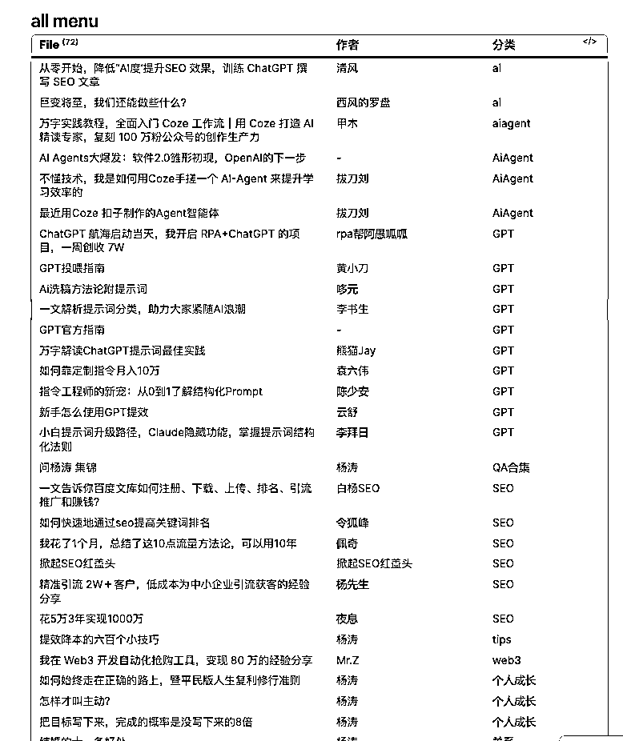
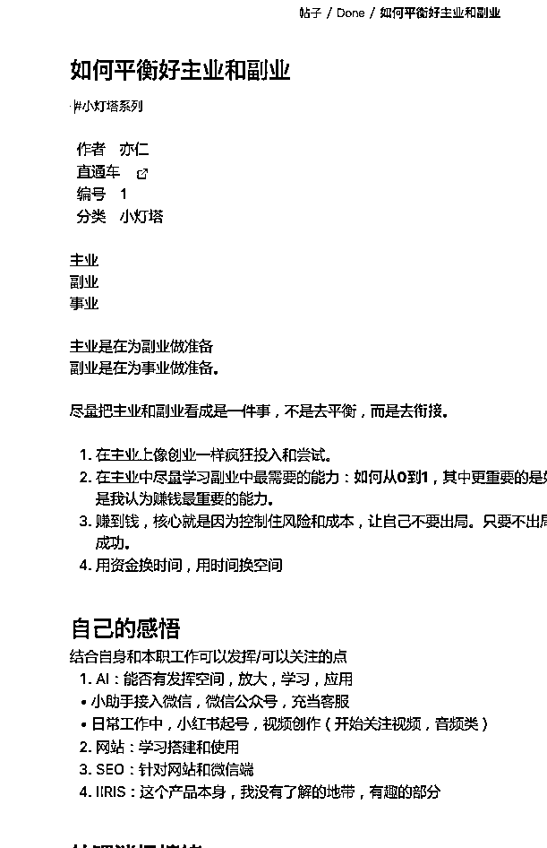
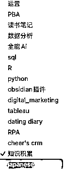
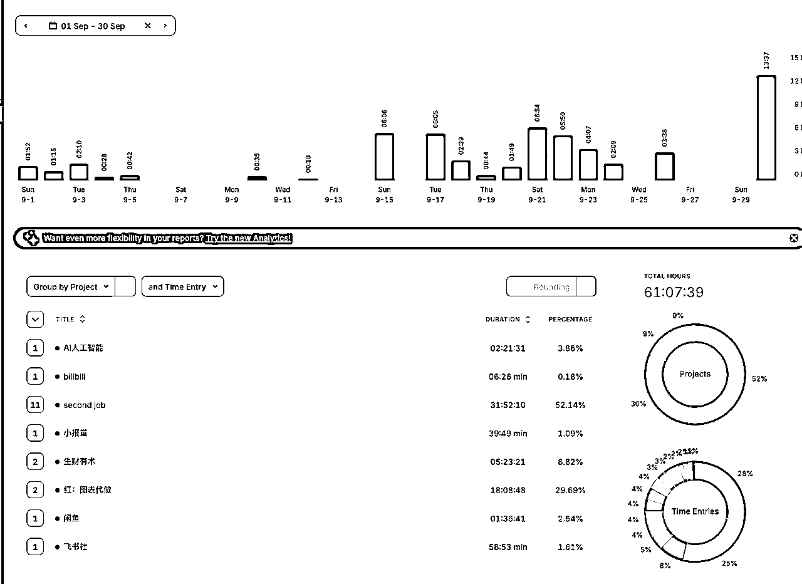
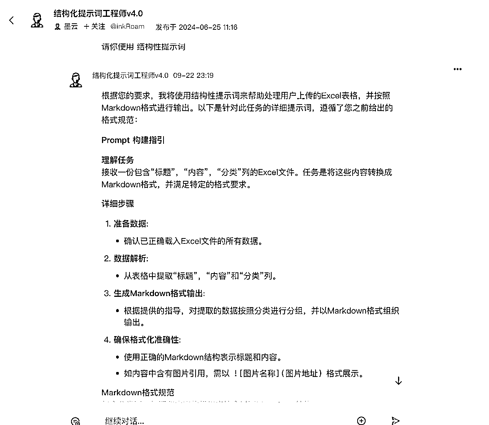
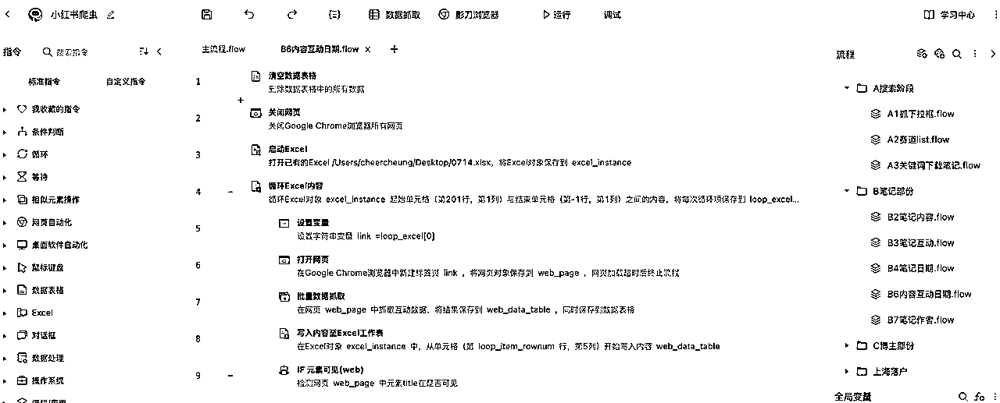
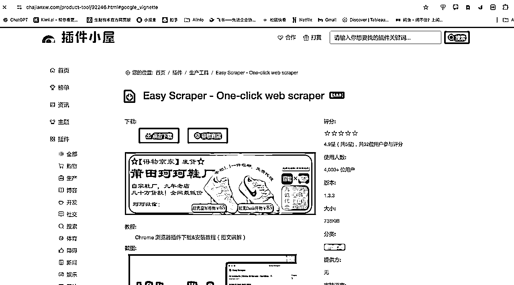
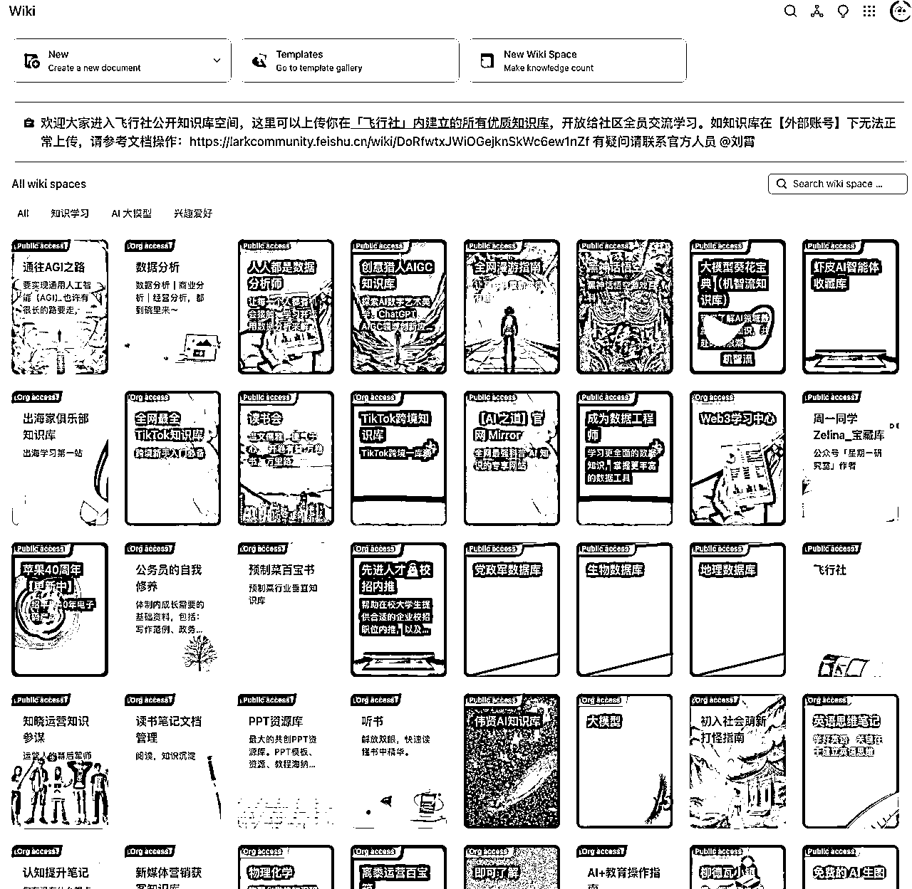
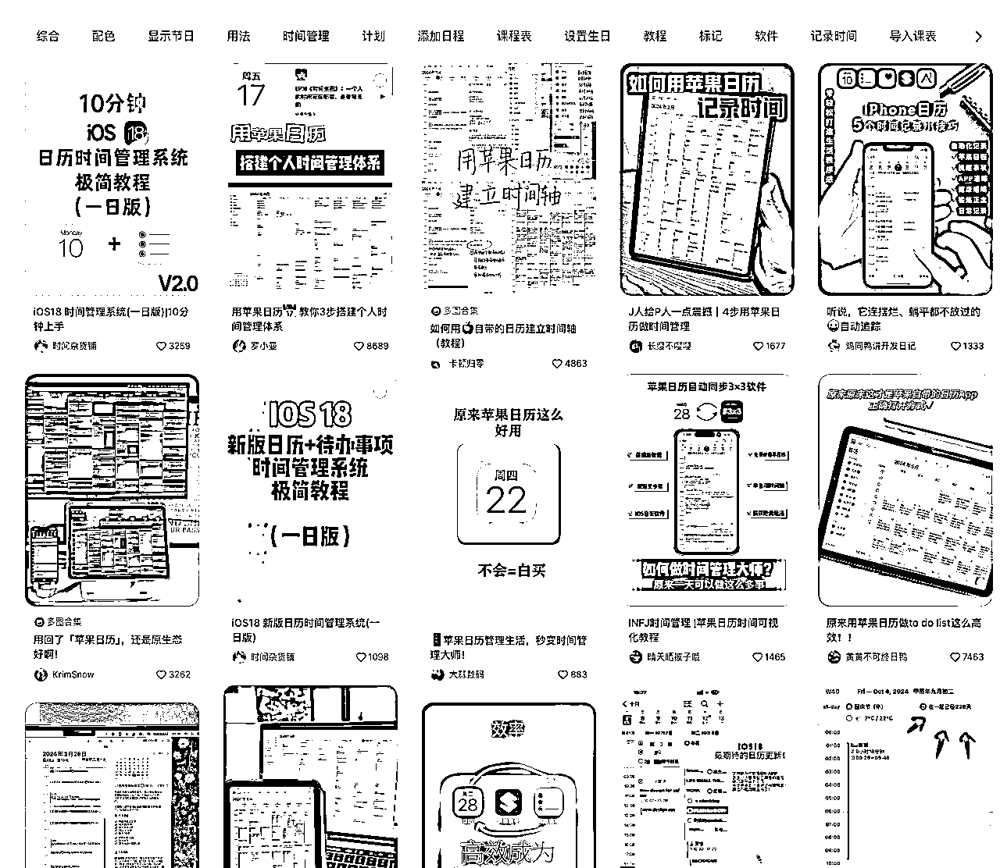
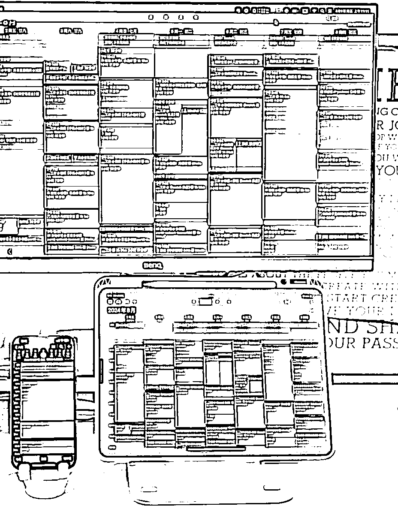

# 研究项目工具指南-悦悦子版

> 来源：[https://ewtk6agpo4c.feishu.cn/docx/Mv4hd5YLNo0Gx1xLTyRcDHtonYu](https://ewtk6agpo4c.feishu.cn/docx/Mv4hd5YLNo0Gx1xLTyRcDHtonYu)

# 🏋️关于我

About me

Name 称呼

阿悦，悦悦，小悦，大悦，Cheer......

名字千千万，跟我的个性一样，总得自己是有人格分裂，非常多面！

Fixed labels 不轻易改变的标签

🌈性别女，爱好男

♒️98年生人，爱自由的水瓶座

🐮具备社牛属性但不爱社交的INFJ

Other labels 总有一个会被你记住

知识区

B站UP主

AIGC创作者

小红书博主

超强执行力

严谨逻辑思维

拥抱多样性

快速适应环境

打破常规

新时代女性

独立且坚定

美貌与智慧并存

牛马

可视化设计师

数据分析师

外企MKTer

# 索引目录

虽然说没有做市场的充分研究，但是下面作为一名重度工具人每一个工具都是悦悦子用到烂的那种，离开了工具，我就是个废物。

1.  obsidian：知识库，写文字

1.  toggle tracker：时间追踪

1.  ChatGPT，Kimi，秘塔：聊天搜索ai

1.  coze/扣子：ai智能体平台

1.  影刀RPA：自动化工具

1.  easy scraper：google爬虫插件，不舍得分享的爬虫工具

1.  飞书和飞行社：互联网人冲浪必备

1.  提醒事项/备忘录/日历：苹果生态3件套

# obsidian

直通车：https://obsidian.md/

一个基于本地端的知识库，现在基本我所有的内容都会在obsidian里面写，方便搜索，且不会泄漏！

无论是我生财的精华贴阅读，新媒体运营记录，还是python 爬虫，我都建立了不同的知识库。（甚至开了一个dating diary记录我的约会，好久没更新了）

obsidian是知识库管理的工具之一，我看了一下整个生财关于obsidian详细的实操内容并不多，所以后续准备自己写一个我是怎么用的。

# toggle tracker

直通车：https://track.toggl.com/

时间追踪工具，我用的是电脑端，移动端的 用的比较少，主要是用于记录自己做各种事儿的时间，尤其是副业的时间用于计算自己的时薪。同时每周定期回顾，自己的时间分配都花到哪里去了，也有助于自己对抗虚无感！

# chatgpt/kimi/秘塔

ChatGPT：他是我的外籍员工，每一件事儿都离不开他，一个月30天，24小时不休息的替我工作，绝不抱怨的员工，去哪里找！

KiMi：我给我办公室同事推荐的是我的国产员工kimi，也是不错的，门槛低，也不算太傻

秘塔：学术搜索ai，每次需要有reference的时候就一定会使用这个，比起gpt胡说八道，这个更可靠。所以我一般使用是用秘塔搜索知识作为背景or知识库输入给gpt然后进行下一步

# coze/扣子

国内版： https://www.coze.cn/home

国际版：https://www.coze.com/

结构化提示词，我直接把web保存为app，存在桌面上，需要用的时候就打开。我目前还是比较old school，问gpt之前一定会先写提示词，我有自己的sop，具体可以看这篇《多工具结合使用才是YYDS》

里面还有很多其他的ai agent，挺有意思的 按需使用

# 影刀RPA

直通车：https://www.yingdao.com/

RPA让我实现了无痛爬取小红书，直接把对标分析的门槛降到了最低，上手很快，我大概是 学了2周，每天投入4小时。就做了爬小红书所有内容的程序。

影刀社区还有很多其他的公开程序，自动发消息等等。我是mac版本，阉割了很多功能，如果是win，那会更加的宝藏，学起来真的很快！

# easy scraper：爬虫的google 插件（真的舍不得分享）

easy scraper 下载连接

怎么说呢，不论是小白还是大神，这款工具，真的太绝了！

一键下载小红书热门帖子！太绝了真的！

我的小红书爬虫就是结合RPA+插件+python清晰数据

# 飞书和飞行社

飞书是加入生财以后才开始用的，因为也是markdown语言，所以上手会比较快。当然我想推荐的是，飞书社这个知识库！飞书好像自己也在推，里面的开源社区和干货内容真的超乎我想象，震惊到我投入一天一夜写下这篇

飞行社我觉得勉强算一个互联网冲浪和链接人的工具吧。

最近在写自己的“个人说明书”，如果没有公众号，那么用飞书写一个“自我介绍”/“简历”/“人类使用说明书”也是不错的选择诶！

# 苹果生态：提醒事项/备忘录/日历

## 提醒事项

我是结合siri使用，直接“hey siri，上午9点半点提醒10点钟我跟上海人开会”，然后9点半，我的电脑就会自动弹出reminder的信息，告知我10点要开会。因为记性特别差，所以我总是唤醒siri，做一个提醒事项。（后来办公室的人都跟我一样开始用这种方式了，苹果生态的体验真的会拉满，因为在办公室用mac的时间会比手机多）

## 备忘录

可以说是我的随手记，市面上有很多app，挺多功能的，但是我还是钟意原生态，很多人其实都忽略了备忘录（小红书搜索 iPhone备忘录，你会震惊 错过一个亿啊）竟然有这么多功能都没使用过

## 日历

用mac或者ipad人会好很多，被人忽略的时间管理工具！

# 结尾碎碎念

感觉我用的频率最高的就是这些了，包括现在这些文字都是在obsidian里面打出来 然后 上传飞书排版的～

希望大家能喜欢，老板给原文点个赞呗❤️