# 【生财有术】闲鱼二手机项目经验分享

> 来源：[https://x6rsxr7w3l.feishu.cn/docx/NnfydjJyJoF8s8xT0ahcmHDQnHg](https://x6rsxr7w3l.feishu.cn/docx/NnfydjJyJoF8s8xT0ahcmHDQnHg)

# 一、背景

闲鱼账号：1个，个人一直在卖闲置，买闲置的帐号，非全新帐号。

是否做过闲鱼：没有以项目形式做过闲鱼，只是会在闲鱼上卖自己闲置的产品。

对闲鱼平台：没有啥认知，就知道能买卖二手产品。

成果：成交15单，退款1单，每单利润在30-100之间。

每天花费时间：1小时左右，主要是上链接，碎片时间回复客户信息，安排发货。

# 二、流程

一件事的流程，不是每个环节都重要。

一定有重点的，非重点的。

我个人认为：

1、选品70%。

好产品，才会带来客户。

2、链接20%。

好产品也需要有好的包装。

包装本质也是一种销售。

3、1对1销售10%。

进入1对1环节，用户对产品已经看的差不多，有些个性化的疑问想问，或者是有些信息想要再确认一下。

如果前面环节做好了，销售环节，就会很好做。

## 选好产品：供需匹配

平台有货源，市场有需求，且具备竞争力的产品。

PS：货源是由圈友提供的，提供一批不同品牌，不同型号的二手机，自己去选择卖哪款，上架到闲鱼。

第一阶段：刚起步

| 选品三步 | 具体内容 |
| 有货源 | 平台的货源，决定了卖货的边界，只能从里面做挑选。 |
| 有需求 | 市场对某项机型，是否有对应需求。 |
| 竞争力 | 我的产品，是否具备竞争力？ |

按照这个流程，我选中的第一个品，上架后马上就有人问，问完30分钟就成交。

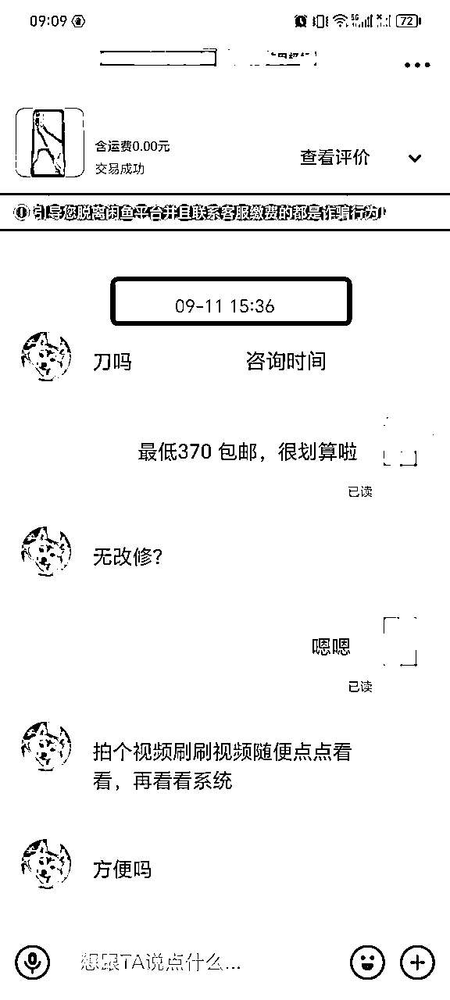

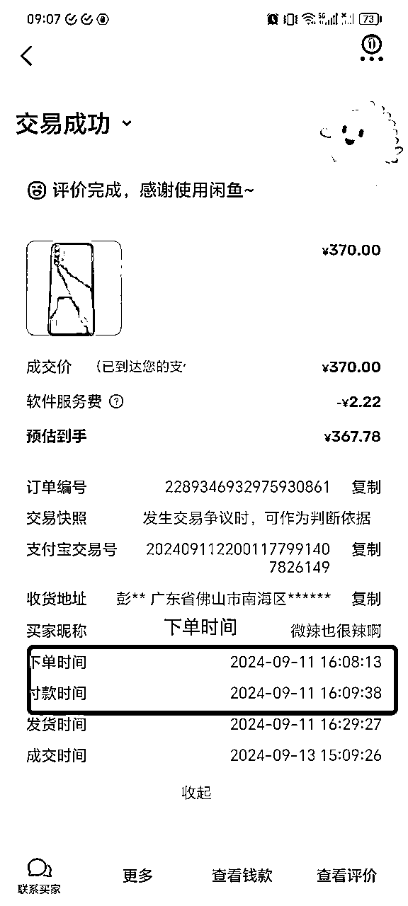

第二阶段：打破固有思维

当我成功卖出1-2个品，我就验证了我第一阶段的选品逻辑。

因为第一个品，第二个品卖的是200-400价位的手机，我当时就会默认，二手产品，大家都会倾向买低价手机。所以，200-400左右价位的手机，应该是最好卖的。

按照这个逻辑，我就持续关注上新这样的产品。

事实也是如此，低价手机确实很好卖。基本上是疯抢那种，你卖的快，其他航海者也卖的快。

我就因为速度慢了一点在发货群里锁定手机，到手的订单，就被其他航海者抢先了。

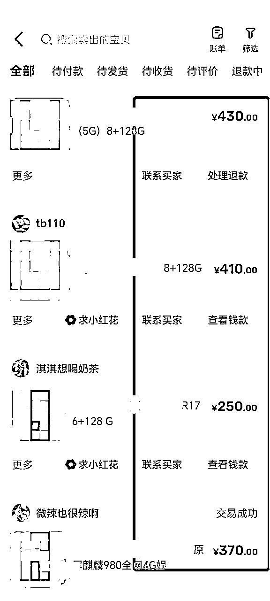

但是，过了2天，我发现平台低价手机，都卖完了。

平台都找不到这样性价比的手机。咋整？

我就开始思考，我意识到自己有一个固有认知：用户买二手手机，要的就是低价，低价就是200-400价格段的手机。所以，我一直在找价格低的手机。

但是，用户买二手产品，一定是低价吗？不是的。

价格不是唯一衡量因素。

高价值的手机，用低价格买到，才是用户的需求。

加上我看到群友出单，卖了800+客单价的手机时，我就开始思考，高价手机是不是也卖的动？

核心是你的产品价格和价值的匹配程度 。

所以，我又开始尝试卖高价手机-华为mate系列。

又拿到了正反馈。

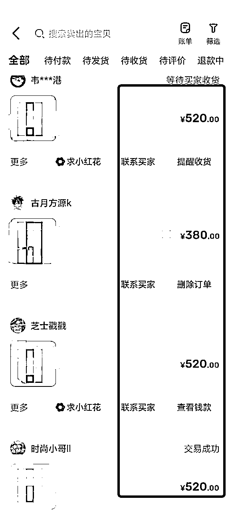

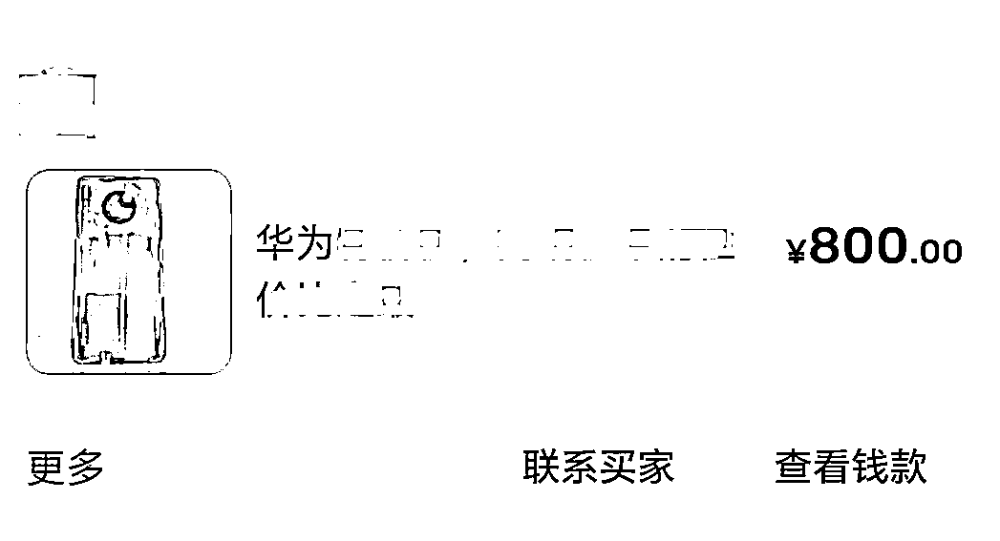

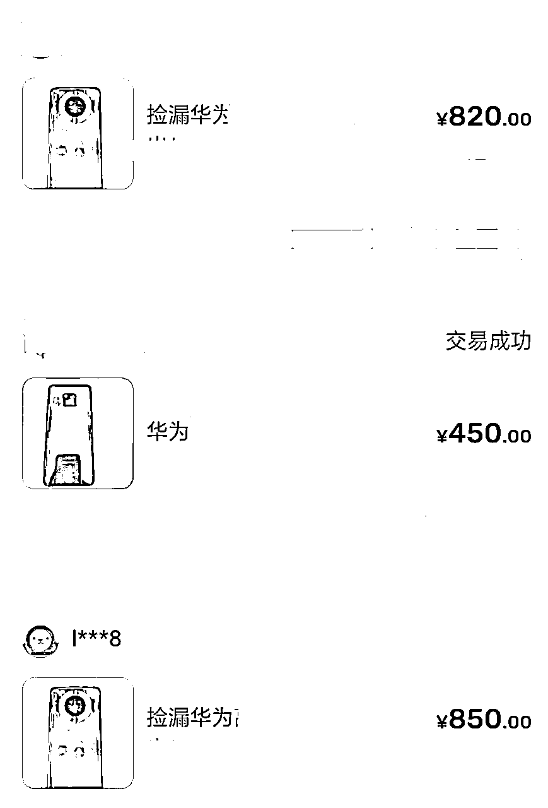

而且，我看到三星卖1800手机，OPPO卖5000的手机，都毫不犹豫出手。

因为我知道这个产品，价值很大，价格还不错，有性价比。我不会只看单一价格，哎呀这么贵的价格，也有人要？是的，真有人要。

所以，人是很容易被自己的思维所限制。

当你在一种思维模式下思考的时候，就要注意了！

要学会识别自己的思维模式，然后试着去调整一些要素，调整自己行动方式。是一件很有意思的事情！

第三阶段：看成功的人，卖的产品是什么

此外，自己拿到一定结果后，不要沉浸在自己的结果中，也要抬起头，看看大家拿到结果的是什么。

有哪些成交订单？有哪些产品是用户有需求的？

我又发现，大家卖iPad卖的不错，我又开始卖iPad。

又拿到了2单！

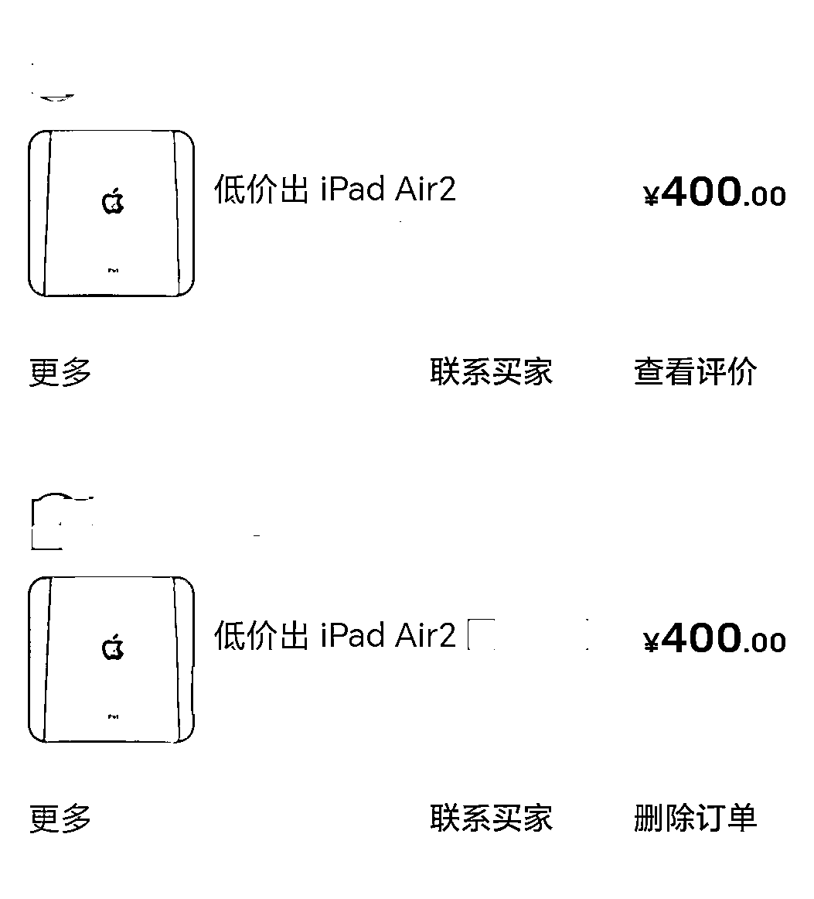

第四阶段：对货源、市场基本有了解

当我卖出5单，我大概对二手市场有基本了解。

用户对哪些机型，需求是最多的？

用户感兴趣的机型，大概定价情况如何？

当我对市场有了基本了解，我就更加知道，哪款手机是一定能吸引客户的产品！

选品就会更加有针对性。

每天都会关注商品的上新，去看下是否有市场感兴趣的产品。

如果有，第一时间就上架！

第五阶段：测试

已经成功卖出的产品类型，会带给你正反馈。

正常人都会加强这样的正反馈：继续卖这样的产品。

但是，成功过的思维是会限制一个人的。

人的需求是有很多种的。

小众需求，也值得去尝试。

一定要敢于打破自己的认知边界：这也会有人买？如果是我，我肯定不会买。

你不买，不代表市场没有这样的需求。

所以，我也会挂一些测试产品，看下是否用户是否感兴趣。

比如，iPhone SE，mini手机，我去搜小红书，发现还真的有人买。

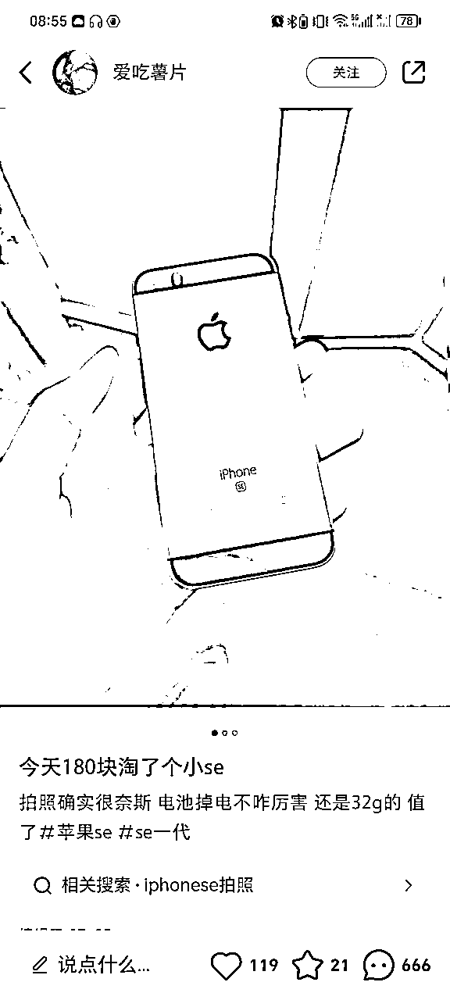

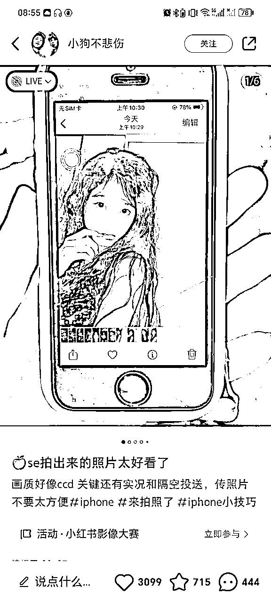

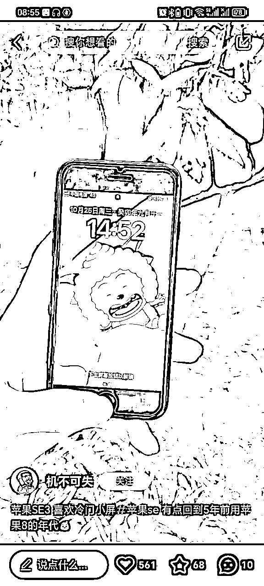

我就挂闲鱼去试试看。虽然暂时没有得到正反馈。

要敢于跨出自己的边界，去尝试一些新的东西，说不定会有意外收获。

## 上新链接：吸引上门

用户搜索一个关键词后，屏幕显示的就是好多个同行的产品。

闲鱼的产品链接显示方式，基本都是同款做比较。

用户为什么在众多的产品中选择你？这就是竞争。

要求你回答一个问题，你比同行好在哪里？

注意，做链接，第一个目的：用户看到你的第一眼，如何让他对你的产品感兴趣？让他愿意点击进来？

至于用户是否会点击“想要”，是取决于你链接里面完整的内容。

第一眼的链接，比拼的是5个主要要素：

1、首图

2、关键词文案

3、定价

4、想要人数

5、卖家信用

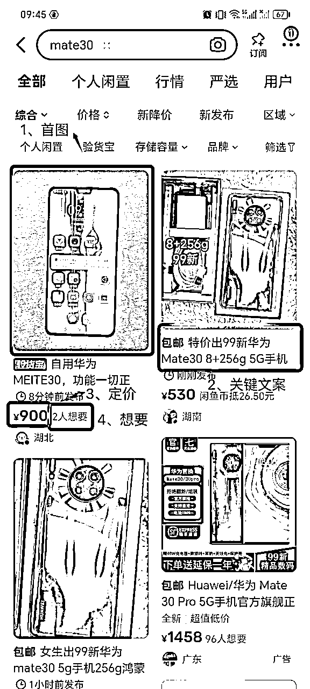

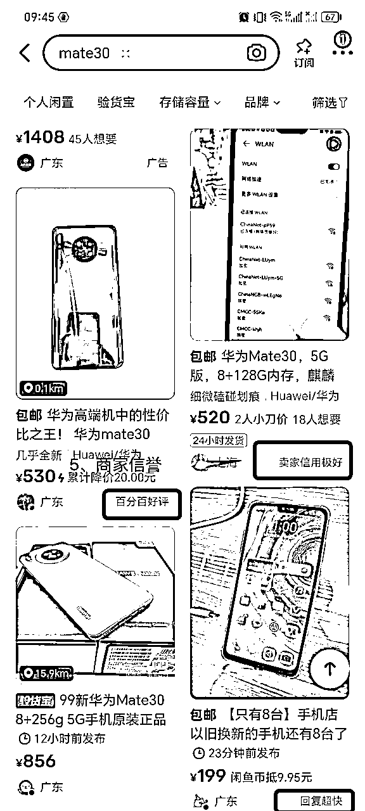

我会在首图和文案上下点功夫。

其余的，就没有花心思。

### 首图：吸引点击

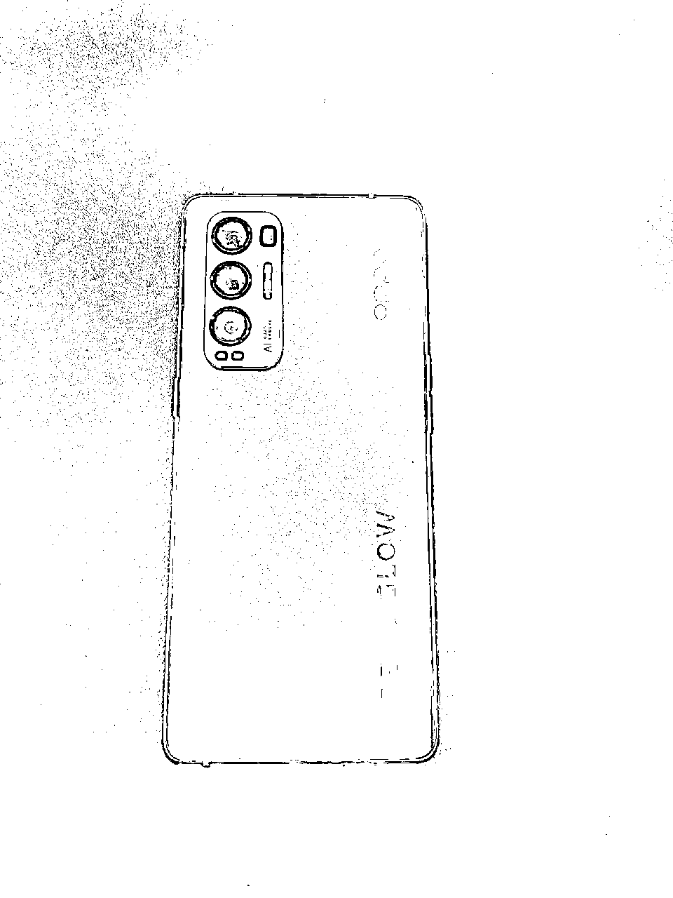

第一张，放手机背面那张。

这其实是一个很细节的部分。

我刷到过好几个和我卖同款手机的航海者，我会发现，大家都是用手机正面，亮着屏幕的那张图作为首图。

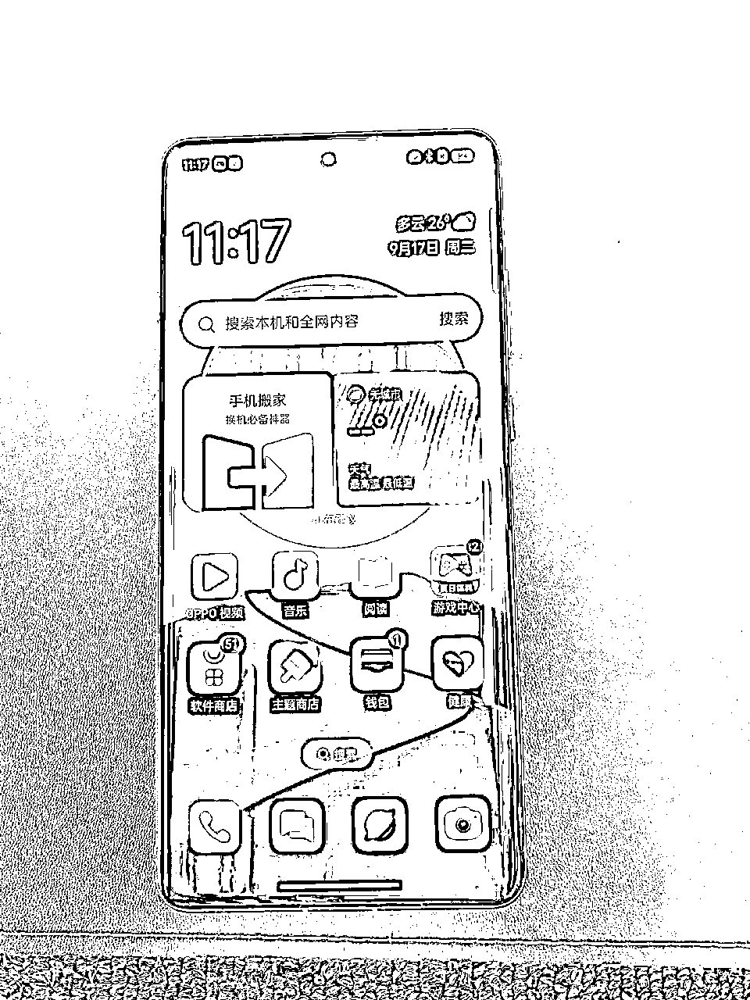

我不是。

我是放手机背面那张图。

因为只有背面图，才能看出一个手机的颜值，才能吸引客户感兴趣，点进来。

正面图，是没有任何营销信息的。用户看了，都不知道是个啥，也不会心动。

至于其余的配图，都是为了让客户了解更多产品的信息。

第二张，手机正面，亮着显示产品配置的图。

第三、四、五张，手机侧面。

第六张，问题图/其他。

（PS：我都用相册的原图，没有做任何的P图动作）

### 文案：吸引点击

每个手机，我会它专门写一句广告语。

比如，华为mate。

我会写：华为最高端机，超高性价比！

比如，三星手机。

我会写：三星万元机皇，2折就能买！

每个手机，再罗列3个卖点关键词。

*   拍照天花板

*   外观超高级

*   性价比赛高

*   宝石蓝高级

*   ...

至于剩下手机其他性能（非核心卖点），就是去找原手机详情页的信息，做基本罗列。

### 定价：合理即可

什么是合理定价？

1、用户能接受

2、商家有钱赚

我基本上是在代发价格基础上，加40-70利润差。

## 1对1销售：拿下客户

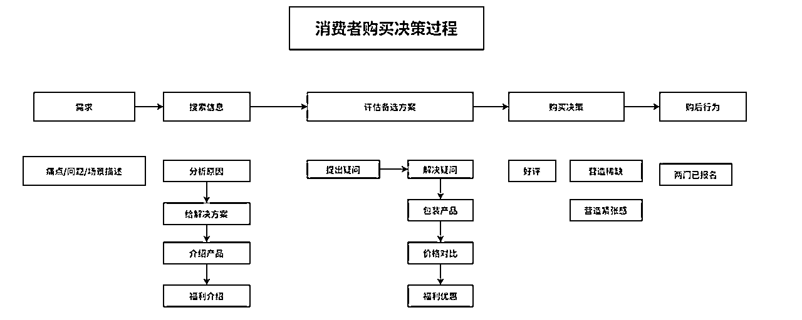

这是我做的一张消费者购买决策图，适用于每个产品。

对于销售，首先，我会根据用户提出的问题，来做出判断用户所处的阶段是什么？

根据用户所处的阶段，制定销售策略，一步步推进到成交。

1、对于二手机来说，大部分找你的人，至少都是处于次精准需求的人。

他们至少都知道，自己想要哪一个品牌的手机。

所以，在卖二手机这一点上，我个人认为，就没有必要去挖掘对方的需求。

有需求的客户，才会找上门。

只不过是需求精准程度和强烈程度的区别。

除非用户对你这一款手机不满意，那你可以问下对方的需求和预算，再做另外款式的推荐。或者用户想要买更多产品的时候，你再做推荐。

另外，还有一点很关键：内容会决定你吸引的是什么人群。

上次有个圈友问我，我做低价引流的，怎么挖掘客户需求？

低价，吸引的只是想要优惠的人，这些人对手机大概率是没有很强的认知，没有做过功课的。

如果你是直接用最真实的产品来卖，吸引的都是精准搜索的人。

2、如果用户问的是手机方面问题，那说明他处在了解产品的过程中。

这个时候，对方问什么，就做回答。

如果对方问了3-5个问题时，还没有开始进入到谈价格，或者没-有很强意愿买单时，我就开始进入意愿度最终确认。

开始进入收单环节。

我会问，对方是否诚心想要？如果想要的话，我可以给他拍个实物视频看看。

如果对方不回复，那说明意愿度是不够强的。可能就没有继续谈的必要。

如果对方同意，那说明想买的意愿度还是挺高的。

这是我就会继续把手机的卖点，信息，售后服务保障，给对方说一遍。

最后，和对方说，可以直接拍，今天就能发货。

这时对方，如果和你谈价格，说明就很有戏。

你就继续谈判，掰扯就好了。

你一定要让自己处在主动权的位置，感觉不是我急着卖，而是对方着急买。

这单基本就差不多了。

3、用户上来就问价格

我认为，价格是在成交的最后一步，我需要知道客户是否对产品各方面都已经很了解，是否需求很明确。

如果对方对产品都基本没有认知，谈再多的价格，都没有意义，是浪费时间。

上来就问价格的人，我个人认为有2种人群：

*   非常懂市场，知道市场产品情况，价格等，所以看完手机，基本上就能判断。剩下就是谈价格问题。

*   对市场不懂，就开始乱砍，单纯想要优惠和便宜的客户。

对于这两种客户，我都是一律拒绝讲价。

为什么？

对于买手机来说，做出购买的决策还是需要额外信息，不是光凭链接内容，就能下单的，他一定要了解更多的信息，才会进入到购买决策。

第一种客户，如果对你的产品实在感兴趣，就会开始问更多的问题。我也需要确认对方对产品是否了解，是否真的想买。如果真的想买，那再谈价格的商量。

第二种客户，收到回绝后，就不说话。

说明需求也不够强烈，花时间去沟通这一单，其实不划算。

对于很多意向度不够高的人，我宁愿不卖。不花时间去沟通。

面对第一条信息就是问价格的客户，怎么回应？

我不会直接回复价格问题，而是用另一个问题来转移注意力。

我会回复：手机您看了吗？满意吗？/手机问题能接受吗？为什么问这个问题？

判断对方是对产品是不是真的感兴趣？有意愿度想买？还是瞎砍价？

认真看过手机的，就会重复一遍手机问题，和你做确认。

对手机不了解，但是有意愿想买的，就会问，手机有哪方面问题？

然后你聊完手机问题，用户还是挺有意向，谈价格就会很好谈。

有的客户甚至都不会和你再讲价格了。

如果还要再谈价格，也就是优惠一点点。

如果不回复的，也不是高意向客户，就不用继续聊了。

4、看客户情况来改变沟通风格。

昨天有个小朋友来找我买平板，我就会用年轻人喜欢的沟通方式来沟通。

有个帅哥找我买手机，对方态度还蛮好的，就是比较冲，比较直，比较着急，人是挺真性情的，我对他的态度也会比较直接和真诚。

我的本色不会变，对谁都是真诚，但是沟通方式、风格可能会根据情况做出变化。

5、不要撒谎，否则就是一个谎言接着一个谎言。

比如，客户问我，是自用手机吗？我如果说，家人用。

结果，我后面很难推荐她买其他手机。因为自用的手机怎么会有这么多？

就失去了和客户推荐的机会。

6、和客户关系打好关系。第一款没有成交，根据客户需求，推荐了第二款，可能就会成交了！

7、谁拿捏谁？

案例：成交的这个客户，还挺想要这款手机。一直在和我讲价，虽然降价范围，在我利润空间内，但是我不想要降价。我就一直拖着对方。

*   谁被动，谁着急。他很想要，就不会差这20元。

*   另外，刚好有个NPC，想要这款手机，我用紧迫感来催对方。

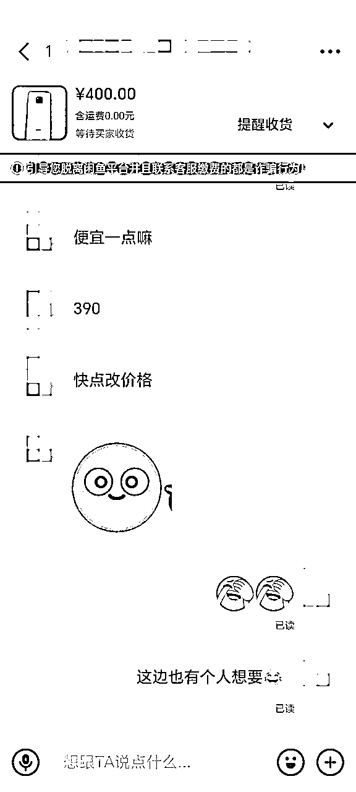

成功拿下！

做成交，位置要高，势能要高，不是我求你买，而是你心甘情愿买，还感觉买到了便宜货。

对方求我，我才有谈判的空间。

## 发货交付：有安全感

告知用户发货时间、售后保障。

发货物流单号上传后，会发信息给用户。

收到货后，会及时提醒收货，有问题第一时间沟通解决，要退也没问题。

## 退货处理：积极主动

我退货的态度，很直接。不满意就退。

但是，在这个过程，有几点反思：

*   是否过度承诺，给用户过高的预期，导致退货率高？

*   二手机产品，本身就是一般的产品，很多残缺，用户就会有很多的犹豫。你又不能夸大，夸大对方就可能会退货。

*   退货，意味着这一单的利润就为0，你前期的沟通时间成本，就白投入了。

*   我作为手机的中介，我是很难知道，货源的手机，实际成色如何。我就很难给客户一个合理的预期。

改进：

*   降低客户的预期，才会有惊喜。

*   不要过度承诺，退款了还不如不成交，浪费了很多时间，没有赚到钱，就很烦。

# 三、认知

1、闲鱼=个人出闲置的平台

你如何定义一件事，就会决定你如何做一件事。

我把闲鱼当作个人出闲置的平台，而不是商家卖货的平台。

这两者有什么区别？会影响你做事的态度和做事的方式。

个人出闲置，你会怎么写文案？

极其简单，口语化。

商家卖货，你会怎么写文案？

堆砌卖点，功能。

这是两码事。

2、我的玩法：正常售价，实物图上链接，真诚沟通卖货。无任何骚操作（低价引流、挂虚假产品图等）

3、我做项目，一般只了解框架和大致流程，就会开始实操，剩下的细节，再根据实操来做优化。

我只花了10分钟看了一遍手册，就直接开干。

看再多，都不如干一遍来的有实感。

实践出真知。

4、不出手则已，一出手必拿下。

选品是关键，看准再出手，有成功率再出手。

而不是去上10个都不太可能卖的出去的产品。

5、赚钱性价比。

赚这笔二手机卖货的差价，一单大概就在30-70。

要想清楚，你投入多少时间做这件事？

有个圈友问我，我做低价引流。

低价引流，泛流量来做变现。

这就注定，后期转化过程中，会浪费比较多的时间沟通，但是依然无法保证有结果。

我当时就问对方一句：用这么多的时间去做无效沟通，有啥意思？性价比很低。

另外，不用为了把产品卖出去，而过分夸大宣传。

要管理好客户预期。

预期过高，就很容易退款。

一旦客户退款，你这一笔订单，收入为0。

意味着你前面投入的所有时间，都是打水漂。

所以，宁肯保守一些，也不要太激进。

不然是得不偿失。

6、做生意，要能接受生意的起起落落。

做闲鱼二手机，某天爆单，某天没有业绩，这些都是正常现象。

很考验人的心态，但是正是起起落落，生活才有意思。

另外，要扛得住没有正反馈的时间，依然坚持每天上链接，每天选品，每天提升自己。

无论天气好坏，日行30公里。

* * *

最后，以上是个人的经验和认知分享，希望对你有启发！

祝大家都能拿到结果！