# 小绿书图文带货实战系列之选品篇

> 来源：[https://zyr90ttkjb.feishu.cn/docx/NrSPdKjC7ofyU2xgTnEcKI4OnVT](https://zyr90ttkjb.feishu.cn/docx/NrSPdKjC7ofyU2xgTnEcKI4OnVT)

生财的圈友们大家好，我是跨境压舱石凳子哥，现在核心在做跨境电商，分为实体电商和虚拟电商两种类型。

实体电商，是做实物产品在各跨境电商平台售卖。

虚拟电商，是给海外提供服务或者技能赚取收益。

比如：帮老外创建网站，国内代购，游戏陪玩，这类项目启动成本很小，但相对来说比较短期，所以我把他作为辅助长期实体电商发展的僚机项目。

这个国庆假期，生财的许老师指导了我们一次很重要的机会——小绿书图文带货。

所以本篇文章，核心为本次国庆假期以及这段时间，小绿书图文带货的全程复盘，想和大家分享的核心是：

【小绿书图文带货实战系列之供应链——选品篇】

什么是供应链？简单来说，供应链就是把产品从生产地送到消费者手里的整个过程。

想象一下，你买了一个手机，这个手机从工厂生产出来，经过一系列的步骤，最终送到你手上。

这个过程中涉及到的所有环节，比如原材料的采购、手机的生产、运输、存储、销售等，都构成了这个手机的供应链。

小绿书图文带货供应链&选品，其实就是站在项目全流程的角度，为大家拆解展示全流程。

小白可以怎么玩？我将从以下几个方面带大家拆解一下：

主要为圈友提供的价值点：

1，项目从0到1，快速落地执行全过程以及成果展示

2，小绿书目前的玩法分享——达人分销&自建小店

3，我的经验和技巧分享，助力各位圈友少走弯路

以及在文章最后，也会提到我需要的帮助和资源，希望在路上遇到更多同频朋友，请各位圈友多多指教。

# 14天时间，我们取得的一些成果：

9.29日0粉起新号，14天时间冲到了92w+曝光，后续有图为证。

GMV：9326.25，高于75%的同行

成交人数：307人，高于85%的同行

成交订单：337单，高于84%的同行

商品点击：35115次，高于97%的同行

共计售出：354件，目前依然在持续增长

商品总下单金额：11238.14元，高于74%的同行

目前数据依然在持续增长，小绿书图文带货的风口，我们会持续看好且发力。

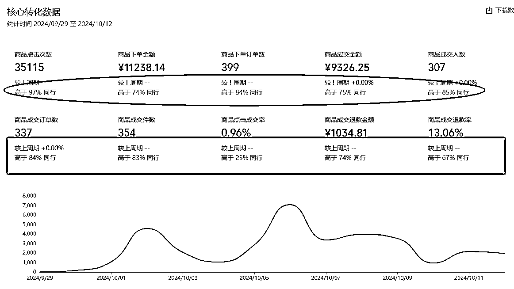

# 一，项目萌芽阶段，定方向，贵人相助

这一次能够及时把握到机会窗口，首先得益于两位贵人相助。

9.25日，是生财专门负责投资孵化的许老师，在外出差的第3天，这一天是他在外出差的最后一天，我们争取到了机会和许老师吃饭见面。

许老师在吃饭的时候，和我们聊到了这个机会，如果不是许老师，那么我们不会接触到这么好的机会。

在这里，感谢生财提供这么好的圈子，同时还有导师指导，贵人指路，比自己闷头赶路，强太多了。

第二位贵人，是我的投资人张哥，他在了解到许老师给我们分享了这个项目之后，很快让我们把这个项目，上升到战略级重要程度。

战略思维本身就是我的弱势，所以，如果没有张哥的指导，那这个项目不会跑得这么快，自己就更加不会每天加班加点的干了。

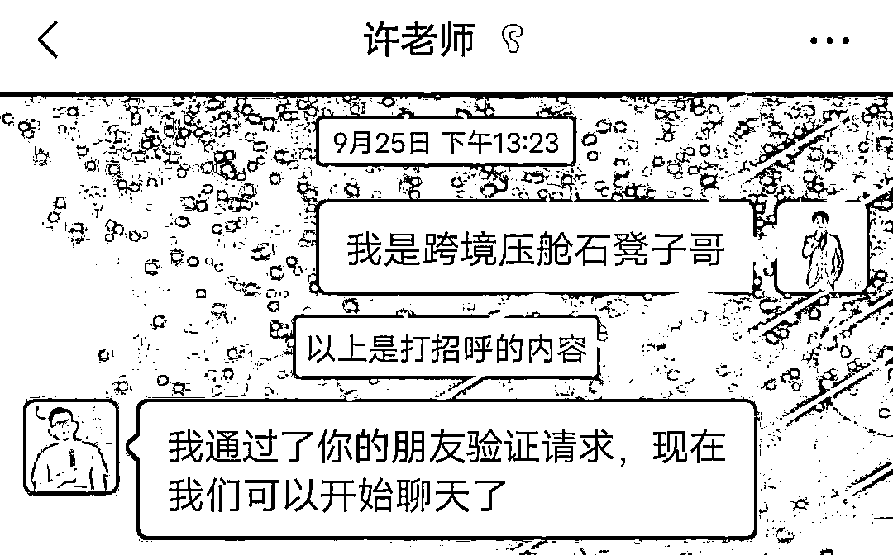

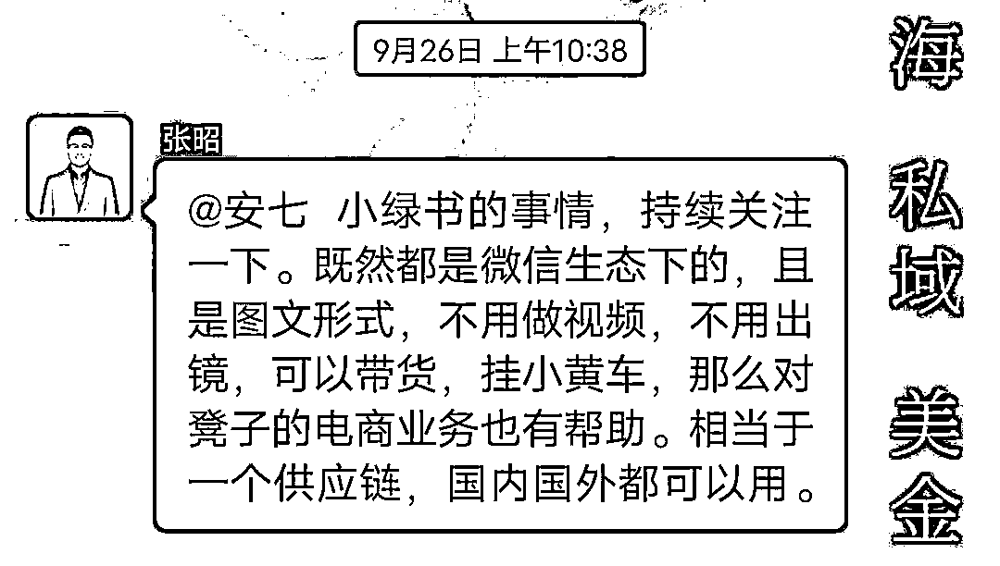

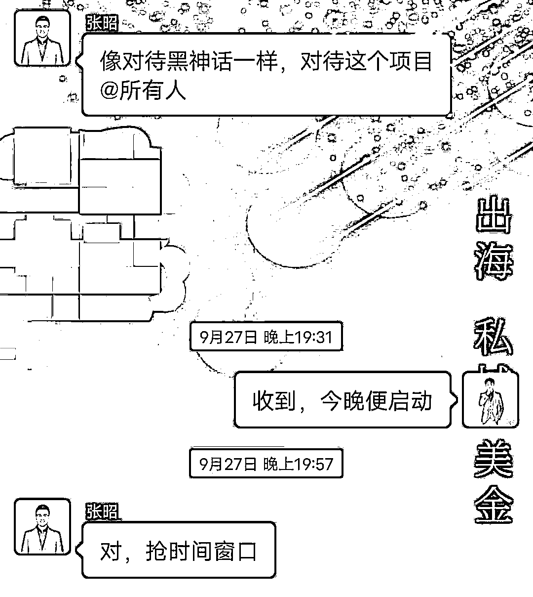

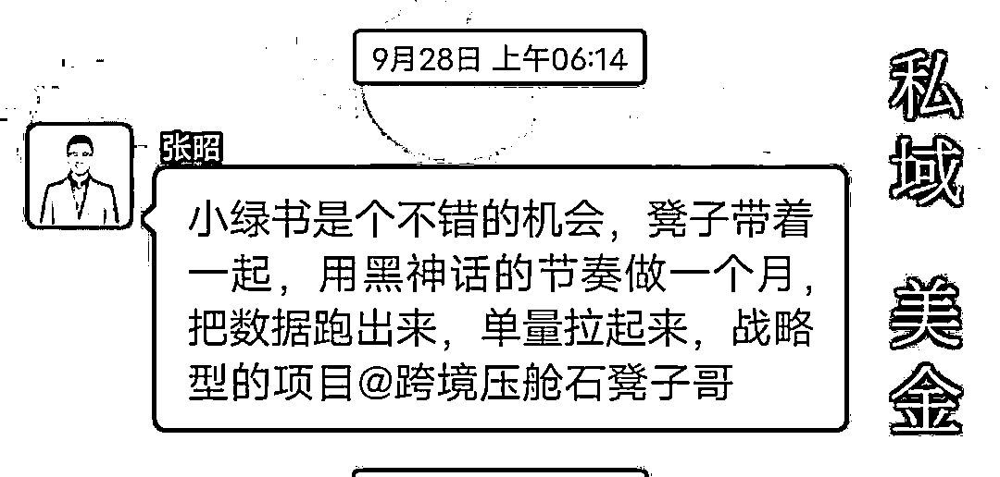

投资人经常和我说：很多人不是没有机会，而是对机会分辨能力太差，同时重视程度和执行能力太差，即使给他一个好机会，也干不出来结果。

机会和战略大方向已经定了，就像已经知道，要攻打哪座城池。

接下来，拼的就是执行力，抓住每分每秒的战机。

# 二，项目初始阶段，摸窍门，大力出奇迹

27号当天就发了一篇文章，然后后面两天左右，浏览量跑到了3000多，很明显是被系统推荐了。

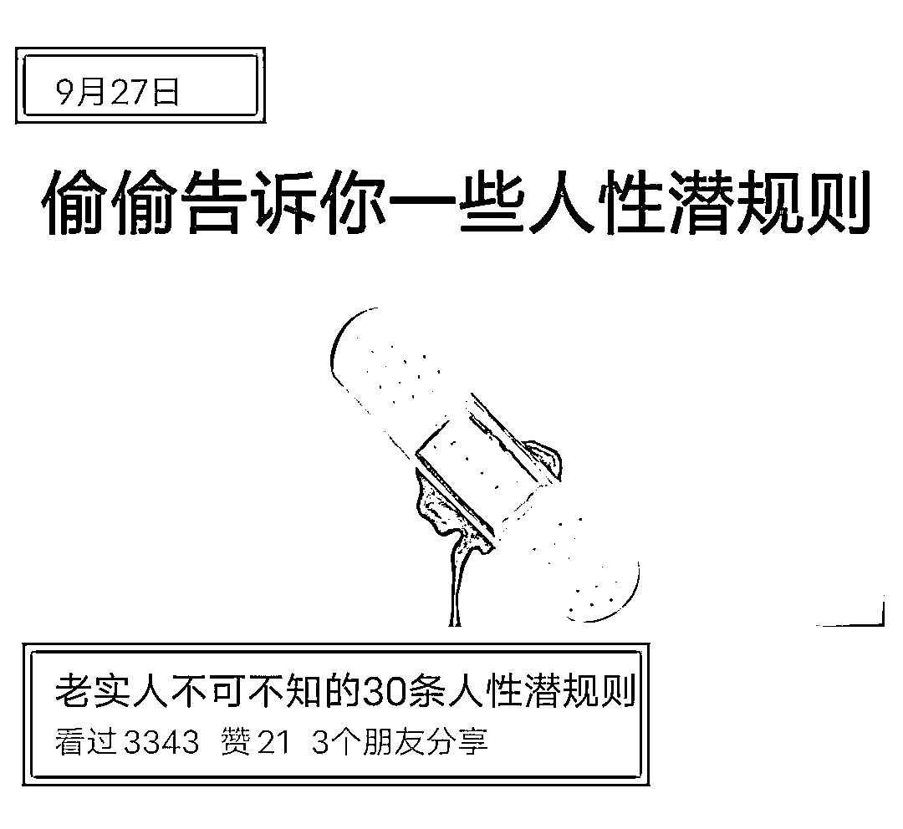

但是没有出单。

28号持续发力，开始一天干8篇起步。

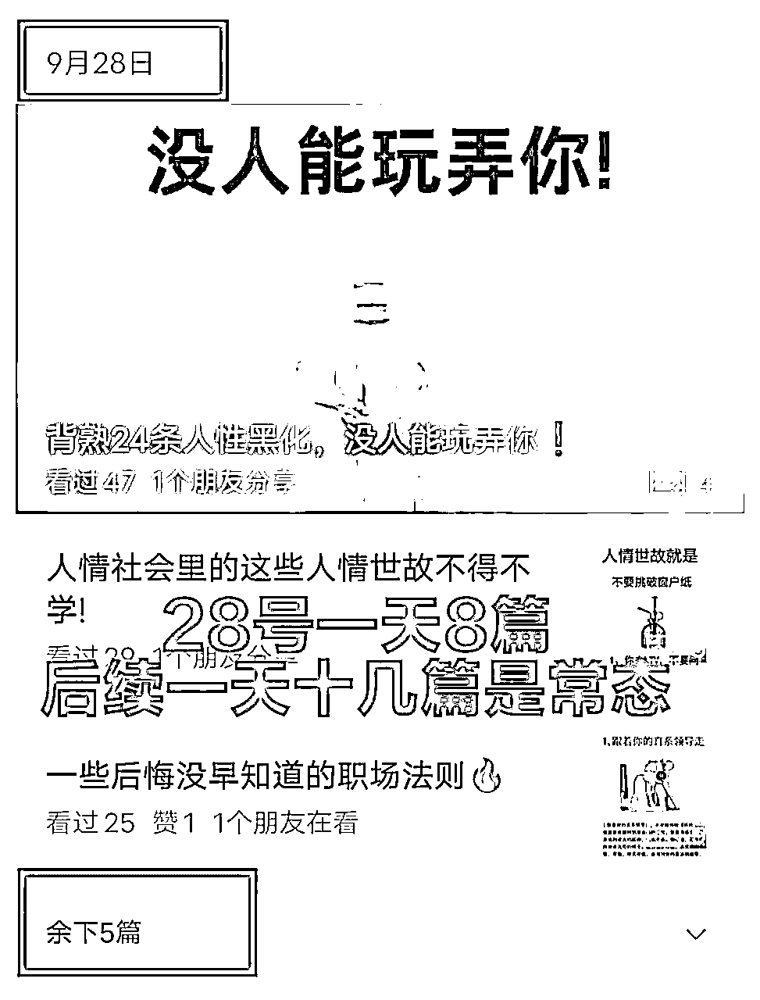

但是依然没有出单。

这个时候，我都是带的别人的货，作为一个达人的角色，在选品中心卖别人的货。

与此同时，还有了另外一个非常重要的情报：”服务号比订阅号更加好推流。“

于是立马调头转变发力方向，当天开通了自己的服务号，这个时候才发现，自己一年前就已经注册好了小店一直没用。

再加上我本身就在做跨境电商，有自己的厂家和选品经验积累。

一下子珠子连成串，灵感一触即发：

用服务号——用自己的货盘——上到自己的小店——产出爆款图文——自营带货出单——学员跟抄——学员分销出单——持续发力拉动销量

也就是从此刻起，正式确立了接下来的作战方案和行动路线。

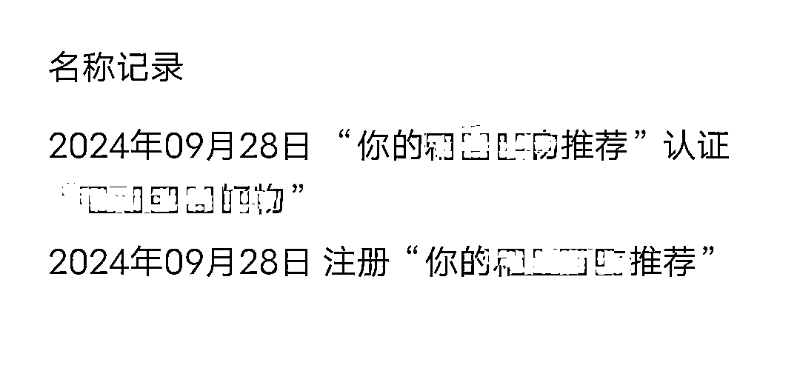

10.7日的店铺数据：

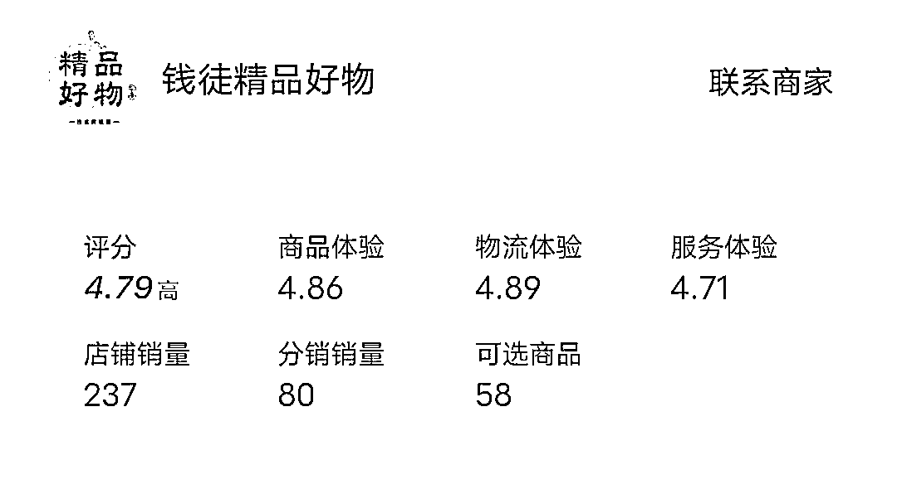

10.13的店铺数据

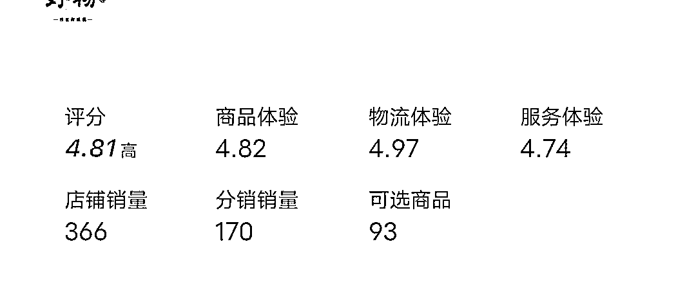

作战方案确定好了，剩下的，无他，狠狠执行即可。

9.29发布的第一篇图文，至今10.13，15天的时间里，总发布图文124篇。

跑了92.5w次浏览量，98.44%来自系统推荐，平均单篇文章浏览量7459/篇。

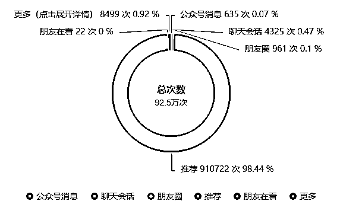

平均每天发布8.26篇，如果抛开第一天只发了1篇，以及中途有一天遇到了一个技术问题，耽误了一天，那么我的每天发文量，准确来说，是9.5篇/天。

每篇文章，一是我们团队有十分给力的爆文教练，二是每篇文章里面都对应着一个爆款产品以及选品，于是才会有现在的数据结果，单号就拉动了整体项目的大盘数据。

有自己操盘过项目的朋友，应该能够感同身受这样一句话：

”很多人，都是先看见，才能选择相信，甚至相信之后依然会怀疑和动摇；而有另外一种人，是即使目前没看到，依然选择坚定的大力相信。“

往往是后者，才能拿到最后的结果。

这段时间我的工作量就是：

1，每日上品

2，每日选品

3，每日发文

4，发货退货

跑通0到1之后，有团队伙伴，可以分担很多的事情和任务，但是以上四个板块，我依然每天在进行。

为什么？

首先作为项目方，自己一定是最用心的那个人，其次，跟着我们干的人，要看到我的状态。

如果我懈怠了或者没有跑出成绩，那是很难让人信服的，前面讲了，这个项目不仅仅是我一个人在做，而是聚拢了一批学员和搭子，他们在看着我行动。

既然绝大部分人需要看到结果才会行动，那么我要做的就是跑出结果，越快越好，真正带大家打胜仗，这就是最有信服力的东西。

在开始没多久，我就迎来了自己第一篇10w+，也因此，打开了所有局面。

# 三，项目发力阶段，不要想，干就完了

9.30这一天，我发了14篇图文，其中就有两篇打爆，一篇10w+，一篇4w+，目前其中一篇已经跑了接近40w阅读。

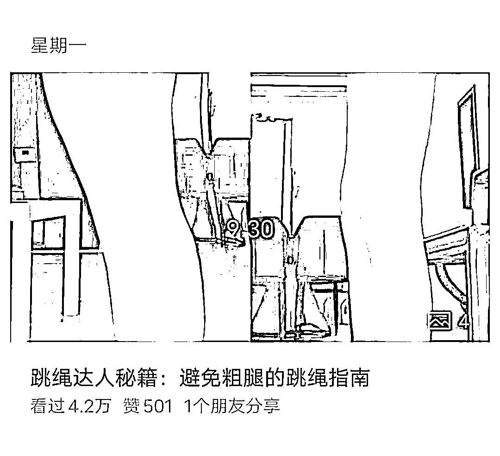

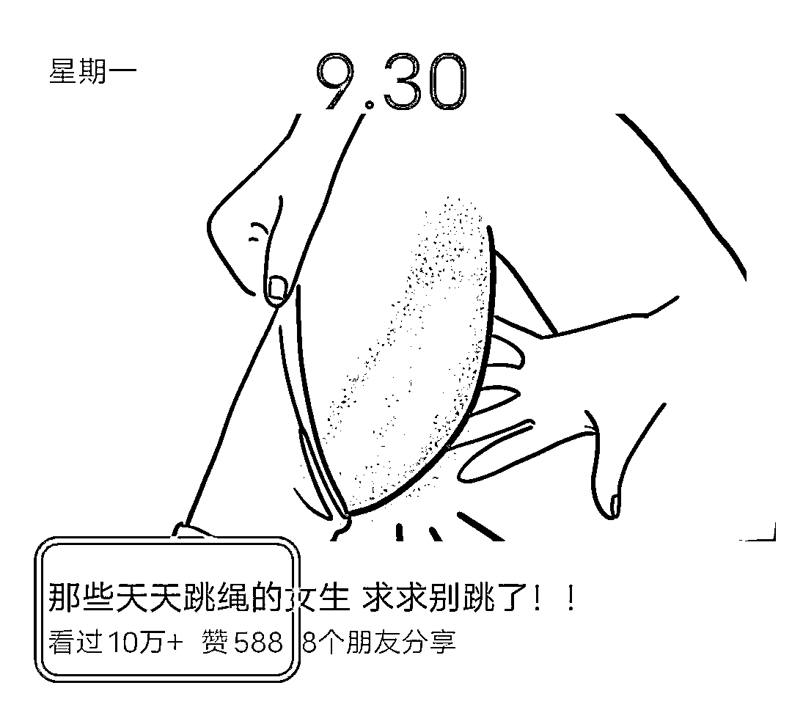

9月30日，是一个很关键的日子，这里和大家说一个很容易影响战机的点：

因为这是九月份最后一个工作日，结束之后就进入到国庆假期了，而这就意味着：

如果不在这个时间点之前，把服务号等一切需要工作日才能办理好的账号资料等弄好，后面就很麻烦，基本上只能坐以待毙，只能看着。

所以我们幸运的点就在于，行动力足够快，在假期之前就把号开通了，同时准备好了后端的设施和技术服务。

国庆假期3号注册服务号的朋友，到7号依然还没审核通过，显然是需要到工作日了。

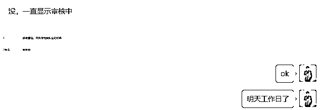

当一切成事的要素具备好之后，剩下的，就是持续发力和扩大了。

再回顾一下，我们之前确立的作战方案：

用服务号——用自己的货盘——上到自己的小店——产出爆款图文——自营带货出单——学员跟抄——学员分销出单——持续发力拉动销量

显然，这个时候，已经达成了自营带货出单的阶段性成果，下一个阶段需要做的就是发动更多的学员开始行动，让学员赚到钱，从而让势能变得更大。

# 四，项目上升阶段，跟着抄，就能赚钱

这一个板块，侧重和大家分享一下学员出单的案例。

很多人在做的时候，老是会有一个卡点就是：我喜好什么品类，我才愿意去带；我觉得哪篇文章能爆，我才去发；我觉得哪个标题更好，我才去用。

会陷在”自我觉得“的误区里，从而极大的影响了应有的效力。

我对自己的合作伙伴服务方案，非常简单粗暴，简单到什么程度呢？

只需要：

1，复制我的图片

2，复制我的标题

3，复制我给的AI口令，把内容调整一下

整个流程操作下来，三分钟不到就可以搞定一篇，我还特意给大家开了腾讯会议，教大家批量采集图片，复制口令高效利用，实操的手法是实实在在的，学会就能用。

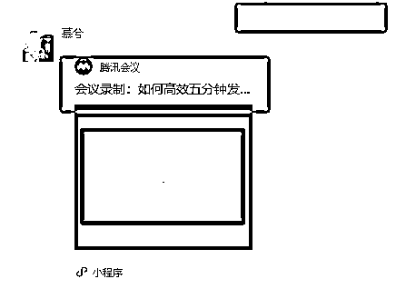

为此我建立了一个星球，专门让大家在里面打卡，报名的人数24人。

每天发了多少数量，就直接发在星球里。

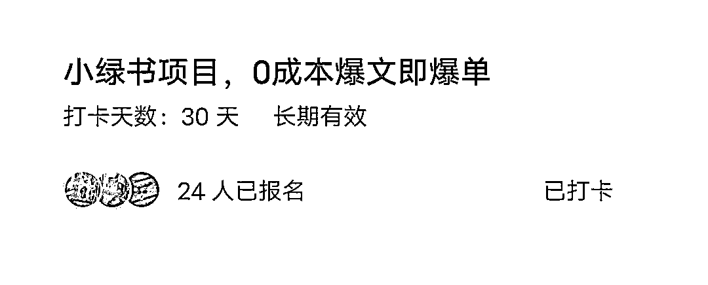

## 1，站在达人分销角度

我们的后台数据，可以看到达人分销的板块情况

一共35人出单，卖出过28种不同的商品，GMV4344.57，我给他们的佣金比例在30%~55%以上。

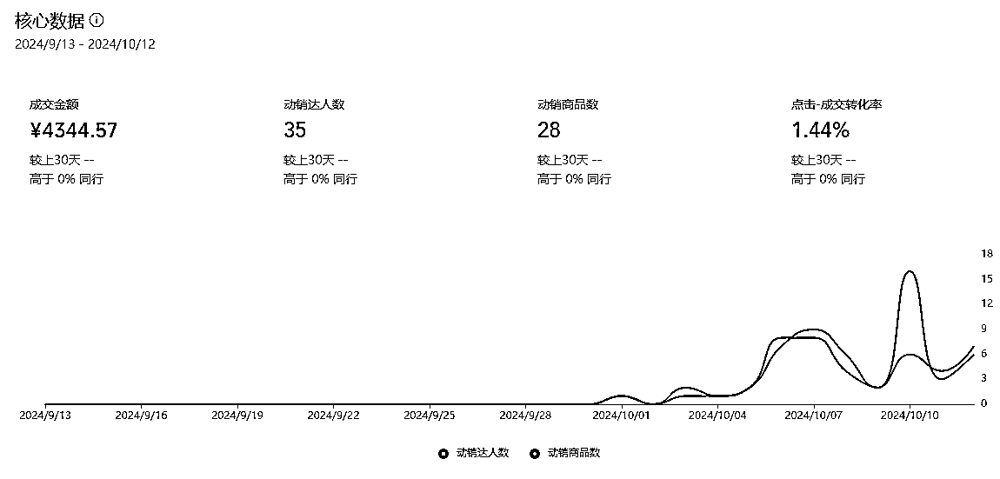

排名第一的达人，跟着我前面的那个跳绳的发，也跑出来10w+的数据，出了52单。

从我的后台来看，是10.6爆的单，也就是说，他是10.4~5号左右发的文，而这也就意味着，两三天时间，就达成了这样的营收效果。

他带的这个产品是55%的高佣链接，意味着就是，跟发我的爆款文章，他直接变现874.5元，不出意外他是单王，额外还会有红包奖励，那短短两三天时间，他的收益直接变现1000+

其他的伙伴开单营收没有这么夸张，但是也看到了不错的正反馈，我们整体的出单率在50%左右，而随着假期结束，个人订阅号流量的打开，这个比例还会持续的提升。

最重要的是，小绿书这个项目，不需要任何额外的投资，不需要承担任何囤货垫资的风险，达人带货，只需要缴纳100的橱窗保证金即可，而一旦爆文，就至少就是几百上千的收益。

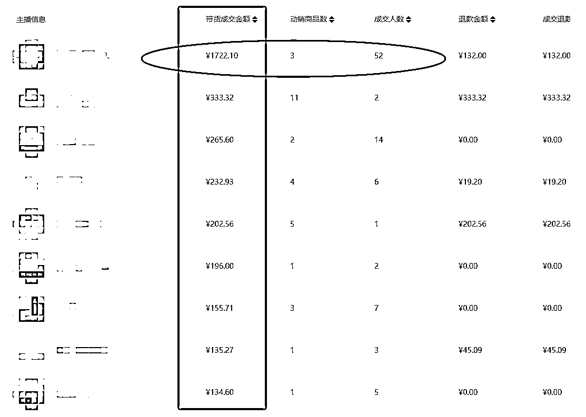

投资人说：要做那些下行亏损风险很小，但潜在天花板收益极高的项目，显然小绿书就十分符合。

## 2，站在大盘数据角度

本次国庆假期阶段，共上架93个商品，售出366单，其中卖的最好的是两款跳绳，分别销121单、55单，共计销出35种不同类型的产品。

现在去选品中心一搜成人款两用跳绳，排在第2就是我们的品，且从评分来看，我们目前是绝对优势。

这样的好处就是，会有更多的场外达人，也会主动加购带我们的货，然后形成复利效应，越滚越大

关于这一点，后续板块我会继续为大家介绍，达人分销和自开小店的玩法。

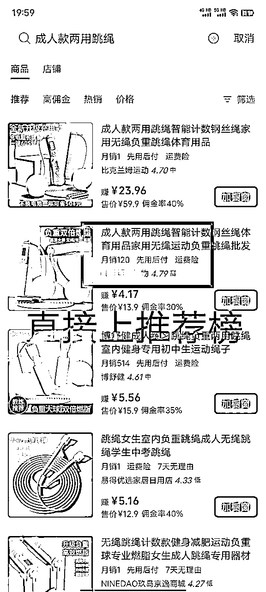

# 五，小绿书目前的玩法分享

目前小绿书的玩法主要有两类：

## 1，达人分销

如果是达人分销，那其实入局的玩法就非常简单，你只需要开通视频号橱窗，然后缴纳100元保证金，就可以开始发图文带货了。

文章爆了，你就能够出单，卖的越多，自然你就赚的越多。

优势：成本低，方便批量起号带货，流程简单，门槛低，实现自动化之后可以非常高效发布。

劣势：你不是自己的品，自己接触不到厂家，只能在选品中心里面选，对整个链条接触会比较浅。

避坑点：在选品带货的时候，要看商家是否会及时发货，我们之前有一个朋友自己做，文章爆了，出了几十单，但是商家有超过一半没发货，造成退款，那这个损失还是比较大的。

后面才了解到原因是商家国庆这几天放假，不发货，而你作为达人而言，是没有什么话语权的，如果你是自建小店，你还可以更换货源，换个厂家发货。

这里给圈友解释一下，为什么说自建小店，基本上就相当于是在自己打造供应链——

因为你有了自己的店铺，就需要去选品，去上品，去对接快递物流，去对接厂家货盘，去对外销售，这不仅仅就是简单带品发文那么简单，这是一系列的组合。

所以在后文，我都会不断提到，自建小店，其实就是我们在打造自己专属供应链的一个过程——

你销量越好，和快递谈的运费价格就越低，和厂家可以谈的拿货成本价，就越低，继而你的销量优势就更大。

## 2，自建小店（打造供应链）

如果你有了自建小店的想法，那下面这些是你需要具备的要素：

#### 1）有公司营业执照，或者是个体户，年费500~600/年

#### 2）开通服务号，年费300元

#### 3）开通你的商家后台。

做不同的类目，所需要的保证金不同，大致需要5000~10000元，你就能够做大部分不同的品类。

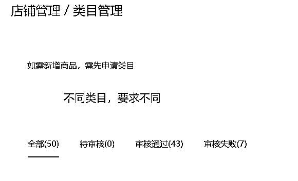

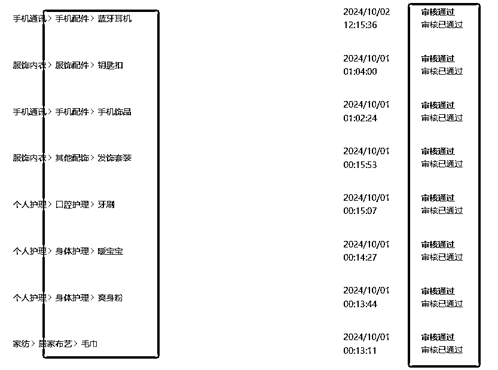

#### 4）有对应的货源，想清楚你是自发货，还是一件代发？

自发货的话去后台对接好快递合作电子面单，建议用中通快递和极兔快递，外加开通顺丰快递。

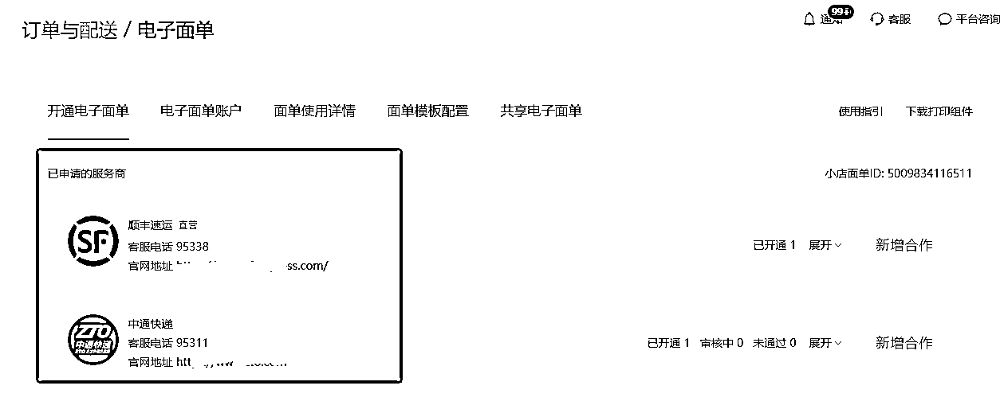

#### 5）一件代发的话：

需要买好店管家等设备工具，充几个会员，总体成本算下来大概50块钱/月

#### 6）你需要一笔货款来周转

达人分销是0成本，但是小店每出一单都是需要money的

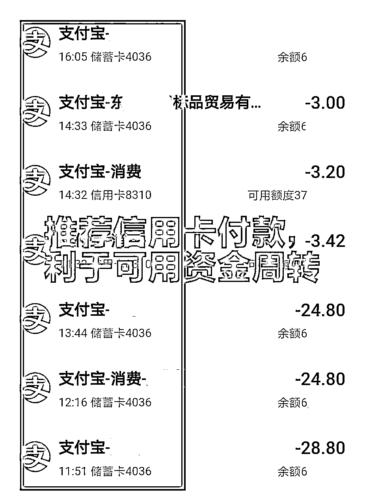

#### 7）以上流程你跑一遍，就很熟悉了。

如果你本身在营业执照，和货源，快递小哥等方面，平时都有积累，那么以上流程可以在一天的时间不到就弄齐全。

当你具备了以上条件和要素，下面和你说说，自建小店的快乐：

（自建小店这个过程，就是你打造自己供应链的过程）

1，你可以上自己觉得有潜力的爆品

2，你有自己的自主定价权

3，你可以任意给别人设置分销比例

4，你可以因此接触很多不同的厂家，积累自己的供应链

5，你可以直接接触到客户，倾听对方的心声和诉求

6，你对产品的熟悉度会越来越强，从而又促使你爆文能力越来越强

7，你可以积累建造自己的私域流量池，后面可持续转化

同时，你也会面临，客户退货退款，需要不断上品，没有流量，满足各种资质等因为没有充分熟悉规则而造成的麻烦问题。

如果你在纠结自己是做达人分销，还是自建小店，我的建议是：关键是看你的个人选择，一条简单，一条难点，两者的选择没有对错。

当你选择好身份之后，接下来都是同样的一件事情：产出爆款。

拥有更多的曝光和流量，这样才能卖出更多的货，所以与其纠结，不妨开始行动，先把手弄脏，先做达人，再做小店，也未尝不可，这不是一件两极对立的事情，重要的是你是否开始。

# 六，我的经验和技巧分享

## A，达人分销技巧和建议

### 1，没有流量怎么办？

这个基本上是大部分在做的朋友，都会遇到的问题，每天在发，但是基本上没流量，然后自己就很焦虑，会怀疑自己的努力是否有回报。

很多人中途干了一段时间，没有效果，就直接放弃了

没有流量，其实是一件非常正常的事情，作为普通人，我们能做的就是两个字：怼量。

一条发1条肯定是不行的，日更10条是基础，日更20~30条，再确保你发的每一篇都有爆款因素，这个是猛人，不可能不出结果。

### 2，选品很关键

选品这个部分，分两块，一是选实用特色的品，相对应产出爆文，出单才好；二是选这个产品背后的商家，有的商家不靠谱，那就很麻烦。

微信小店虽然有选品中心，但是不代表里面什么品都可以上.

比如，就会有人带货出了单，但是商家一直不发货，那这就很难受了，最后超时未发货，用户直接退款，出单了也是白忙活，所以找到合适的商家做后端，也非常关键。

### 3，对标爆款，复制是最好的路径

我看见太多人抄作业，也会抄错的，明明对标了一个爆款标题，但是经过他的手，再写出来的标题，就变得非常干巴巴，压根就不想点进去看了。

那如果有这种情况，其实会极大的影响最终的结果，不出单就是非常正常了.

这个时候，直接抄对方的标题，或者只改微小的一部分，其实就是最好的策略，然后在内容上优化和变动即可，小绿书目前对原创的要求不是很高。

## B，自建小店经验技巧：

### 1，0元保证金试运营

如果你选择自建小店的话，目前视频号官方是有福利政策的，可以申请开通0元保证金试运营，这样你不需要保证金也可以开始上品卖货。

但是你卖的钱不能提现，以及最多只能卖200单，然后你只有把保证金补齐了，才能解除限制。

### 2，爆文即爆单

小绿书带货的核心逻辑是：爆文即爆单，只要价格不是太离谱，一般都有不错的订单。

如果价格非常实惠的话，那就是大概率爆单，所以学一下爆文很重要，平时多去观察一下，流量好的文章都有什么共性，慢慢积累网感。

同时，可以在自己上品的时候，上的有特色一点，比如我卖了一款衣架，但是我不是卖普通的衣架，而是卖多功能衣架.

这样在输出图文的时候，就会变得更加吸引人眼球一些，曝光和订单才会有概率提升。

微信小店，目前不是说上了品就有出单，是需要去引流，然后通过曝光成交的，之前的方式是直播和视频，而现在的小绿书图文，已经大大减低了参与门槛。

### 3，把佣金比例拉高

自营小店有一个非常不错的好处就是，你自己定价，然后设置佣金比例。

在加入优选联盟之后，别人就可以在选品中心搜到你的产品和店铺，这个时候，如果你的基础销量还不错，然后你给达人的佣金比例也还不错

就会吸引外部的人，主动直接把你的品加橱窗，进行带货，然后拉动销量。

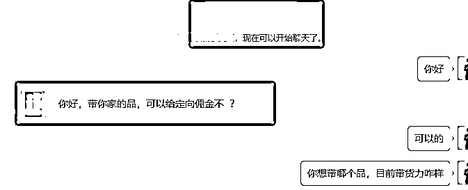

# 七，项目总结

## 1，玩法逻辑总结

当你把整个流程摸清楚之后，会发现：图片可以AI改，内容可以AI产，商品链接要么挂别人的，要么挂自己的，其实就是这么一件事情。

## 2，价值点资源总结

### 1)对于已经在做小绿书的伙伴

如果你自己目前已经在做小绿书，但是目前还没有合适的商家后端，只是停留在选品中心里面带货，那其实我们可以聊聊。

复盘一下，我目前的优势有两点：

一是选品，很多时候一款合适的产品，往往能够带来不断的复购和销量，也更加有利于爆文滚动

二是佣金，自由定价，专属佣金，有的产品，我们自己卖，有1~3倍的利润空间，我们可以合作一起出货，我这边可以给你设置专属佣金。

### 2）对于厂家的建议

其实小绿书对厂家而言，还是不太友好的，因为你上了品，但是没有曝光就没有销量，所以大部分厂家在这个平台，找人合作带货，一起分销，其实是更好的一个选择。

身边有挺多朋友，就是在给厂家带货，通过视频号发视频，然后直播挂链接，出单了直接和厂家结算，这种形式也是不错的。

有一点建议是，如果你是厂家，在一方面自己做的同时，可以尽可能去找一些做一件代发的商家，你可以让其他的商家，上架你的产品，在小店里面卖，优选联盟里面的商家，都是有直接显示联系方式的，可以主动去聊。

以上这一点建议，不管是对达人，还是商家厂家而言，都是非常好的一个资源.

做为达人，你可以主动争取高佣，作为商家，你可以主动获取更多产品资源，作为厂家，这些都是你的KOL。

### 3）如果你目前还没有开始

前面的逻辑已经有提到：小绿书，目前就是图文+怼脸开大，然后概率中出爆款，就能爆单的项目。

所以如果你想试一试副业增加收入，作为一个基本上0成本的项目，我还是建议你可以做一做，因为说不定你就有自己的一篇爆款文章呢，刷个视频3分钟的时间，不如用来发发文章。

而如果你一旦开始了，那么就请好好用心做，三天打鱼，两天晒网，不用说，最终肯定是一地鸡毛，拿不到结果是必然的事情。

因为有很多人，即使每天在努力，也依然拿不到结果，成功靠的不仅仅是努力，还有运气和概率。

而幸运的是，有圈友一起同行，那这条路，就意味着不再是孤单一人，因为我们知道，无论何时，都有同频的伙伴在身边，或是在路上。

## 3，我所需要的资源

### 1）更多靠谱的厂家货盘，能够很好的解决后端服务

如果你的产品，有特色，那么我们可以一起，卖的更好。

### 2）更多同频的伙伴分销，一起销，一起赚

市场上的蛋糕，有很多人在瓜分，这个时候就像拉帮结派抢钱一样，团结就是力量，人多力量大。

本篇小绿书复盘文章，就写到这里啦，如果有任何和小绿书相关的问题需要我的帮助，大家都可以评论区留言，看到之后我会回复。

目前的风口依然在，我们会持续继续发力，执行力拉满，相信每一位圈友都可以拿到自己想要的结果，和大家一起生财有术！