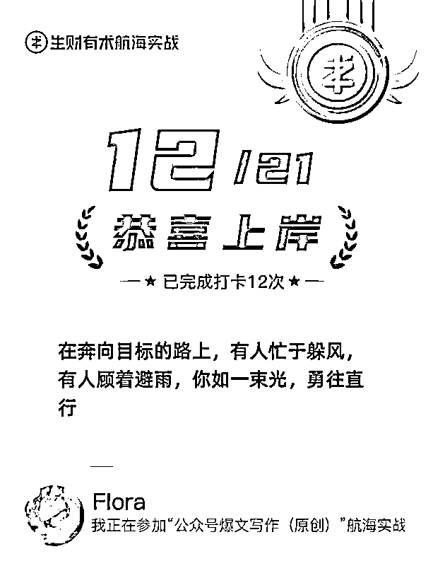
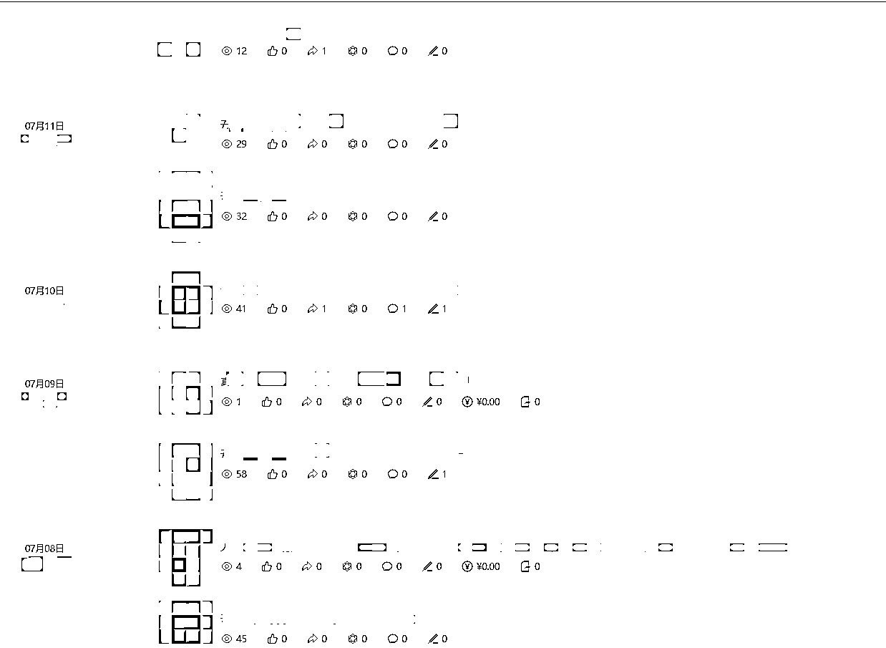

# 感谢生财航海带入门，小白坚持四个月破公众号第一个单篇100w阅读

> 来源：[https://m00rslmhlfo.feishu.cn/docx/QdxydnWtDozVrExm7U0cG9ionwg](https://m00rslmhlfo.feishu.cn/docx/QdxydnWtDozVrExm7U0cG9ionwg)

哈喽大家好，我是Flora，今年四月加入生财的新人。第一次发帖，想分享一下我从4月份加入生财到参加6月公众号航海启蒙公众号，四个月后第一次有文章突破了100万浏览，赚到了一个月的生活费的经过和心路历程。

不得不说，公众号的起号是概率事件，我是坚持加一些运气，但也相对公平，给了每个人一个低成本获得高收益的机会

来晒下近期的成绩第一篇阅读突破一百万，连续四天2000+，目前还在持续上涨

我今年四月加入了生财有术，这里要感谢下雪姨@，当时是因为听了她的节目，才知道的生财。

刚加入的时候像是老鼠掉进了米缸，每天看着各种帖子，看着有那么多除了工作之外的搞钱的路子，有那么多的能人大佬在分享着自己的搞钱经验。初来乍到先是兴奋，渐渐开始生出一些焦虑。

直到翻到亦仁大大的一个回答说，最推荐小白做的项目是公众号，既然老大都这么说了，那我就不用再犹豫，我报名参加了6月份的航海，通过这次航海，我了解到了公众号流量主的底层逻辑，并开始上手去实操

这次航海其实我的成绩非常一般（总收入1.26元）但是完成了从0-1的闭环，我已然十分知足，看到兔子鱼教练说了一句话：航海结束才是真正的开始，我意识到一件事，一定有很多人在航海结束后就放弃这个项目了，那会不会我的运气就来了？

航海结束后，我继续坚持发了一段时间，一开始对文章的内容要求很高，抠细节字眼，配图，排版什么什么都要达到我心中满意才能发出去，结果就是，辛辛苦苦三小时，一看阅读个位数，真的很痛苦难熬

投入了过高的期待付出了大量的时间，但是收效甚微，真的挺搞心态的。但是看着同期小伙伴也还在坚持，我就给自己定了一个小目标：2个月内先赚到500块钱

于是我开始改变思路，做了如下调整：

1.  发布垂直领域

1.  放弃对质量的莫名坚持，ai写啥车轱辘话我都不多计较

1.  坚持日更，起码发一篇

1.  放低预期，闭着眼睛先发够100篇再说

1.  多增加几个账号博概率

调整后的心态变化

1.  没有数据焦虑，2个月里面我爆几篇就有500了，期待

1.  熟能生巧了，每天大概花在公众号上的时间十几二十分钟，最多不会超过30分钟

九月初改变策略之后，可能是心态变好了，平时我也就是个位数，两位数，三位数，就在上周日，出现了第一个十万！！真是功夫不负有心人！

让我惊喜的是，十万之后的每一天，包括今天，这篇还在以平均每小时1万的速度在增长。单价也从一开始的30块，涨到的110块，公众号实在是太让我惊喜了😭

这一篇的含金量现在还在增长，单篇收益已经过万，在以前我都没敢想过，原来幸运也会砸到我这个小透明身上！写这篇帖子也是想鼓励一下还在坚持的小伙伴，说不定下一个百万预定就是你！我们一起加油！