# 跟紧趋势，撬动本地高价值流量【同城夜校流量操盘 】航海即将起航！

> 来源：[https://kq3ytuiktc6.feishu.cn/docx/QtBwdVd3To6JbpxTUhNcafRinPe](https://kq3ytuiktc6.feishu.cn/docx/QtBwdVd3To6JbpxTUhNcafRinPe)

# 一、为什么现在要做夜校？

今年 3 月，团中央基层建设部发布《青年之家·青年夜校项目实施指引》，“夜校”这一学习方式被重新激活，焕发出新的生机。如今，年轻人热衷于把自己送去夜校“去班味”，这无疑成为本地同城流量变现的大机会之一。

目前这个时间节点，恰好能踩住青年夜校带来的流量新机遇。

青年夜校的流量哪里来？小红书、视频号、抖音三大公域内容平台的流量可以说是最主要的来源，合理的利用好这些公域平台做引流是项目关键。

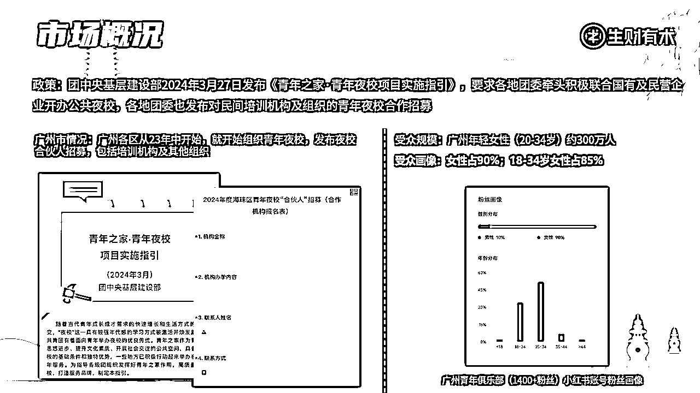

在政策风向标的引导下，我们可以从中抓住几个机会点：

*   成人教培营销薄弱、获客难；

*   教师水平参差不齐，课程产品良莠不齐；

*   单身经济下，上班族社交颇具困境等。

为此，我们结合夜校概念，挖掘出青年夜校项目从引流获客到线下同城转化交付的变现路径，具体内容如下：

## 教培行业资源整合

产品端是流量的基础，好的产品自带流量。

从去年开始，夜校的风口逐渐兴起，而兴趣班一直以来也都存在，大家的兴趣从未消退。如今，在单身经济盛行、找搭子成为潮流、年轻人渴望充实业余生活且兴趣班价格虚高的节点，夜校无疑是一个难得的契机。

然而，对于年轻人来说，想找夜校上课也存在一些卡点。比如，需要四处寻找各个地方的课程，这过程十分艰难，耗费大量时间和精力。

针对以上痛点，可以发现整合资源就是其中的机会点：夜校项目产品=商家打包的课包。我们只需要通过售卖客包，再由广大商家进行服务。和之前的营销和上课形式相比：能抹平信息差，让年轻人不再为寻找课程而苦恼。其次，能为用户提供更标准的产品选择，提升用户体验。

## 夜校的高价值粉丝

对我们的用户进行分析发现，夜校的用户画像为同城 18-35 岁有一定付费能力的女性。

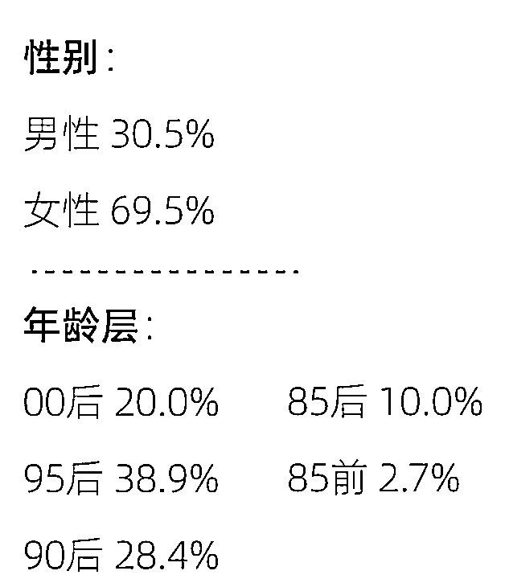

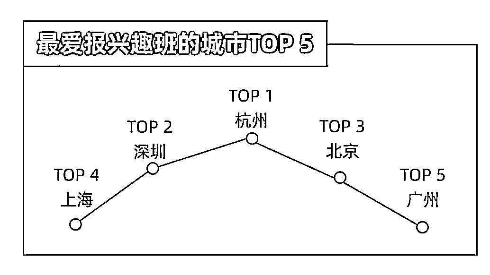

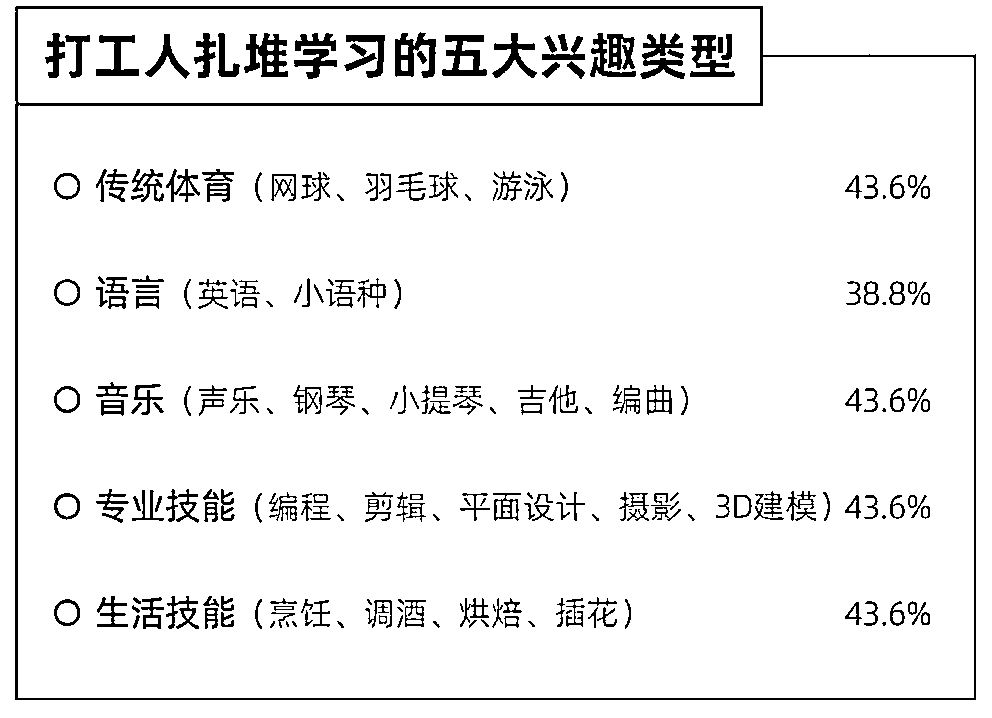

同城流量可变现的产品多，可以一粉多重变现，同时主打陪伴，持续的流量运营能伴随这部分人群的持续消费。比如现在做夜校，过几年做月子中心、医美获客，中年做儿童兴趣班招生，然后老年兴趣班。

同城流量和其他流量比起来，具有明显的稀缺性，变现能力强，并且有稳定广泛的后端支持和高用户粘性及复购。

*   稀缺性：同城流量因其地理限制，相对稀缺，不是所有产品和服务都能轻易获得本地用户的精准流量，本地商家和企业愿意为精准的本地曝光付费。

*   变现能力强：直接转化为销售和收益。用户群体的地理位置接近，推广成本较低，转化率较高。本地商家可以通过同城流量推广促销活动、优惠券等，快速吸引顾客，实现即时变现、高复购。

*   后端稳定广泛：同城流量背后通常有稳定的供应链和服务体系支持，这种稳定的后端支持能够保证服务质量和用户体验，能够增强同城流量的吸引力和竞争力。

*   用户粘性高：

*   同城流量的用户往往对本地品牌和商家有更高的忠诚度和粘性，因为面对面的交流更容易建立情感联系和信任感。本地社区的紧密联系和口碑传播也有助于提高用户粘性。

*   同城流量的用户更可能参与到长期的本地活动中，如定期的市集、节日庆典等。持续的用户参与可以增加变现机会，也加深了用户与品牌之间的联系。

*   强大的裂变能力：同城流量可以迅速进行精准的用户裂变，辐射周边范围，精准的服务各个商圈的商家。同城流量的社区效应可以增强用户粘性。本地用户更倾向于参与社区活动和支持社区内的商家。通过组织社区活动和建立社区联系，同城流量可以转化为强大的社区支持网络。

## 成熟的变现闭环

经过了 6 个月，我们在这个项目上开拓了多个城市，目前一线、新一线城市包括：北京、上海、广州、深圳、杭州、西安、厦门、长沙。三四线城市：芜湖、连云港、马鞍山、滁州等。

在做上海、北京、苏州、西安、杭州、佛山、芜湖、连云港等城市的同事，沿用已跑通的引流路径，保证日更，以及在每次遇到问题时及时复盘整改，及时跟进各线上平台动态，基本都取得了不错的成绩。有 8 个学员从一个人做，到组建团队，扩大变现模型。

同时，通过多轮验证，我们将比较耗时、难度较大的课程交付工作组建了专门的交付团队，来解决学员长周期的课程交付中出现的问题，及商家的日常维护。

目前已经跑出了稳定的变现模式，这个闭环也在多个城市复用了，证明项目可行，期待能够和一些圈友继续合作放大，做更多的城市，成为同城青年夜校的 Top。

# 二、项目情况以及我们的优势

首先，夜校项目的实际执行流程可划分为三块：

其一为线上流量获取；其二是私域转化；其三为商家承接与订单交付。

众所周知，通过线上渠道获取流量极为重要，而当前最主要的线上流量来源，就是小红书，抖音和视频号三大平台。

我们都知道在这些平台上，爆款内容是流量密码。那么怎样创作出爆款内容，或者说怎样凭借数量增加打造爆款的可能性，这是值得我们深度探究的一个问题。

本次航海将会教大家掌握挖掘爆款内容的方法，如何确保自己每日更新小红书，同时高效地制作图文，以及公域发布技巧，包括：如何应对封号，减少概率；将粉丝丝滑引流到微信进行承接；粉丝如何在各个平台进行导流；什么时候需要设置企业号；如何进行自己账号的复盘分析。

私域运营也是大家一直关注的问题，这个环节会直接导致我们的变现情况不一，每天的转化率大不相同。不同的引流运营操作所产生的转化率存在差异，有的人能做到 5%，而有的人能做到 30%，这些都是我们在航海中需要深度探讨的内容。

因此在此次航海中，我们还会涉及到如何构建与客户的联系，达成转化，涵盖：破冰、挖掘需求、需求转换、促销等一系列私域流程，同时还能接触到一些成熟的私域运营技巧，社群运营。

转化后的最后一步是商务 BD，订单交付，这一环节直接关系到我们的退款率。

开头讲到过，我们的判断是，当前夜校项目进入下一个阶段，在这个过程中，我们也踩了很多坑，迭代了多次，直到现在形成自己的差异化和优势。当然，模式不会一可能一成不变，但在当前阶段，这套模式还是很有竞争力的。

## 1、模式的快速迭代

在短短半年的时间里，我们成功地将传统夜校模式与同城其他跨界模式紧密结合，通过三次显著的模式创新，实现了快速迭代。我们仍在持续推进这一进程，确保每一步都能迅速而稳健地向前迈进。

### 1.1 传统模式：中介抽佣模式+团课组班模式

从生财最早的经验帖和风向标给大家的夜校概念就是收一波中介费，大概在 20%-60%。

首先，抽佣观念是对的，我们可以横向看下美团，各个商家每年要给美团交 2-5w 不等，大店交的更多，这只是入驻费用，不能保证客户数量，想要 ROI 正的，还需要运营好美团。

而我们之前组团课，不仅要把人组织好，还要保证 1 个月的交付，这其中任何售后问题，学生都会找到我们。我之前就经历过退费，冻结快团团，投诉等情况。

这等于给商家喂饭吃，团课，他们还有的赚，只需要上课和后续转化就行了。

这里的几个缺点：

1.  团课组班难，有的班一组就是一两个月，都不容易组满

1.  好不容易组满，大家又需要协调上课时间，2-3 个人好协调，4-6 个人就争奇斗艳的时间，工作日，周末，白天，晚上，给组班交付带来了非常繁重的数据统计量，这是我们之前的统计表格 大家可以看一下，现在真是往事不堪回首

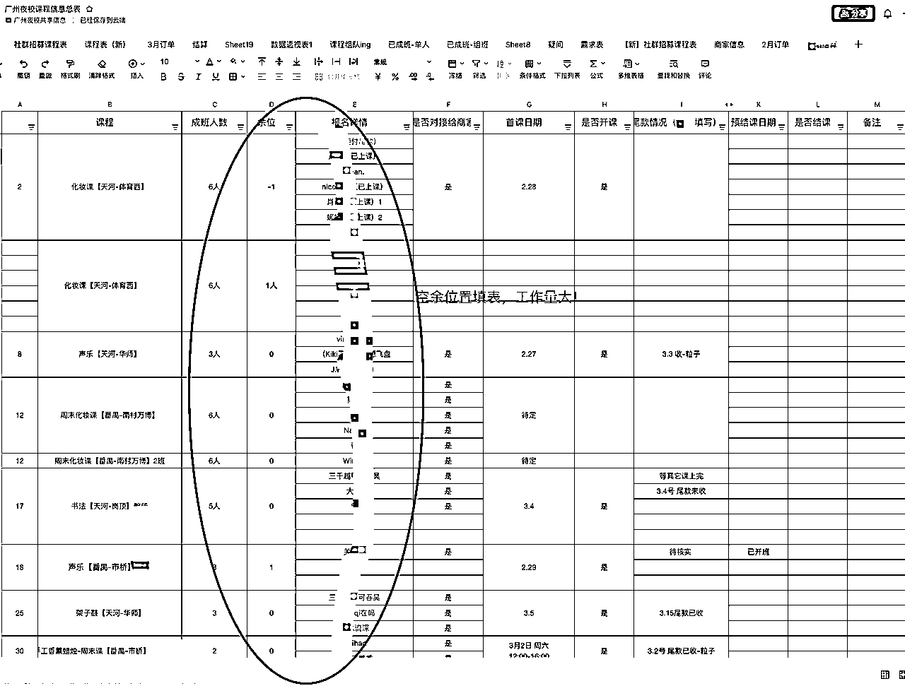

1.  退款率高，给大家看下数据，之前的退款很大程度是因为大家等不及成团，就退款了，成年人是没有忠诚度和耐心的客户

1.  兴趣班本来不是刚需，夜校主打陪伴

### 1.2 迭代模式：1.0 上线三种服务模式-C 端收钱改为 B 端收钱

商家收取获客费用：体验课在美团上，商家都标的一块钱或者免费，我们没办法在此基础上加价，我们做了第一次传统意义的迭代，保证原始团课的基础上吗，增加 1 对 1 课程，以及给机构提供获客套餐。

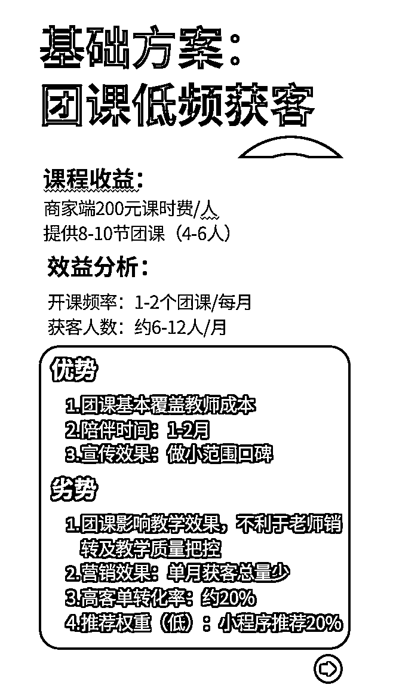

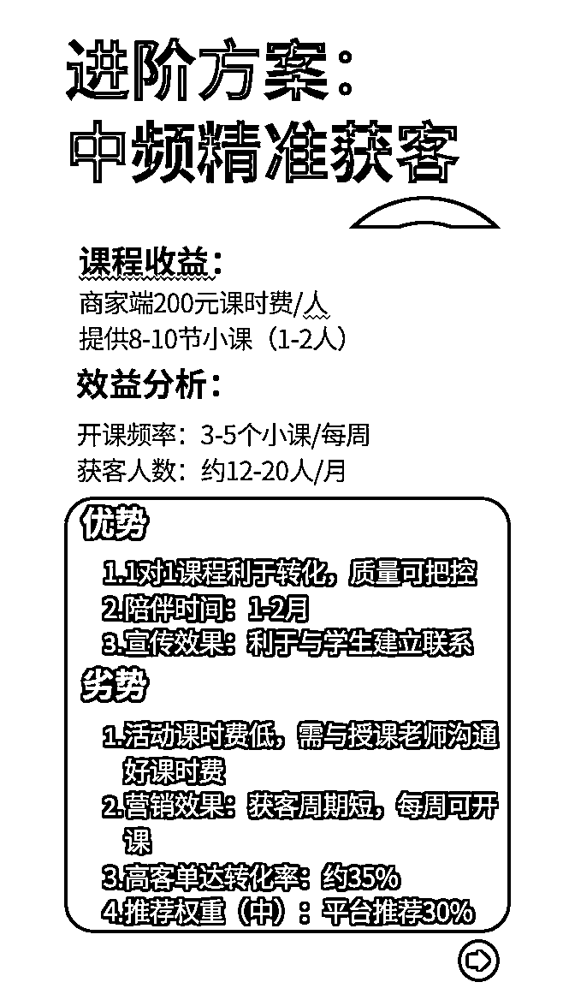

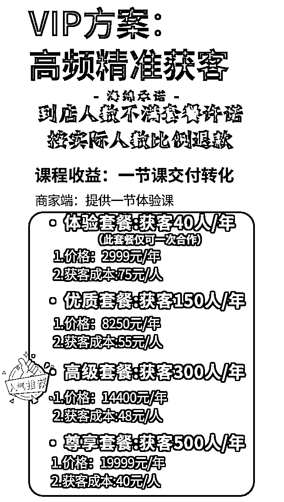

### 1.3 迭代模式：2.0 淘汰团课，组班老大难，退费 30%

退费率在 30%。这是之前单月营收（当时还在收定金 99）

之前我们组团课时，退费非常夸张！

我们逐渐淘汰了团课，因为组班的等待会导致大家退费，热情一过就不想学了

而且对于夜校初期，没有那么多用户基数，组班难上加难！

转到兜里的才是自己的，好不容易转化交了钱，因为没成班而退费，太可惜了！

2.0 模式即下线大部分团课，增加 1 对 1 课程，退款率降到 5%。

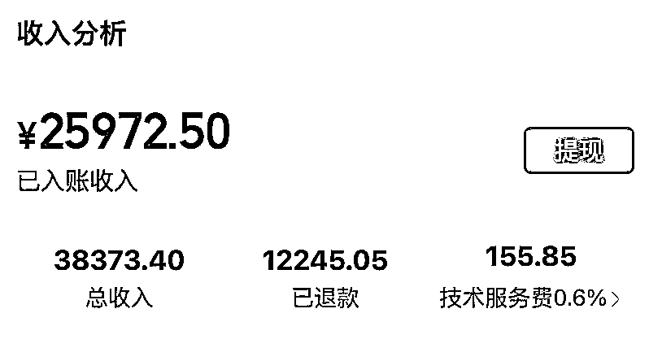

### 1.4 迭代模式：3.0 体验课会员卡上线

当前模式下其实有以下三个收益方式，根据和商家的合作方式不同，我们每单会有对应合作方式下的收益：

1\. 商家课包中介费

2\. 部分活动课纯利

3\. 部分商家的营销获客费

而在小课包的基础上，很多客户会问，能不能体验呀？你们网上加的，真实吗？或者你们这个太贵了！

这些客户就可以把她们转化到体验课。单买 50 元一节，买卡周期内免费，即健身房模式，年卡，月卡都是平台纯利。

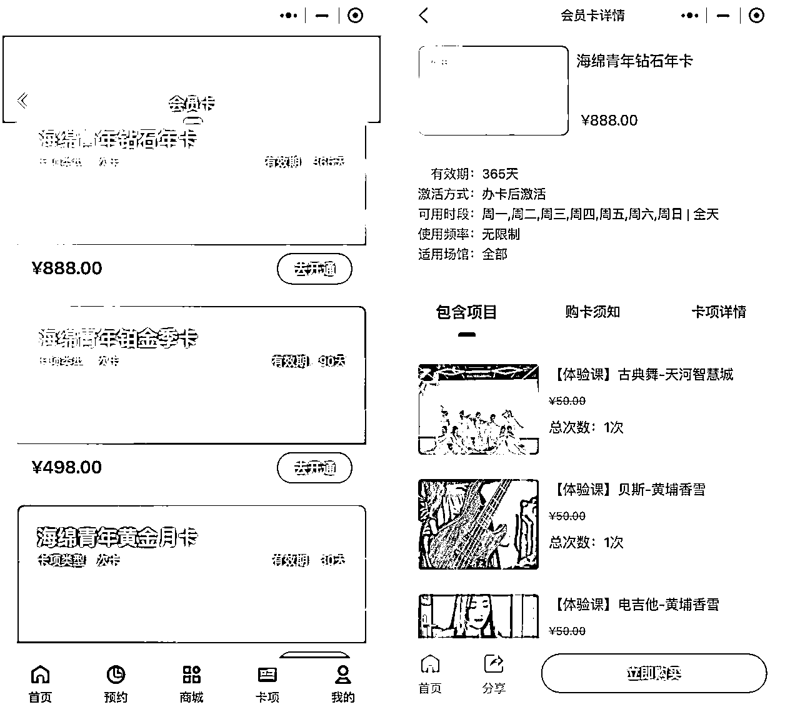

最开始我们的员工 1 天只能更新极少数的小红书，我们通过矩阵入场，通过软件赋能提效，达到单人工当天百更效果，不博爆款，每天批量发笔记批量获取私域，稳定进量，又提效且稳定。

## 2、软件提效

### 2.1 小程序帮助提高人效

当前我们找专业开发者团队开发了小程序，相比之前转化更顺畅了，退款率也随之降低，全程后台操作无需人工干预。

之前的课程交付模式中，用户下单、消课、组班等环节，完全依赖人工，进行数据记录和学员信息登记。

老师的尾款，也是头大的事。我们的小程序和管理后台，根据不断的需求收集，多次的更新，目前已经能最大限度减少我们的人员支出。

以前的夜校模式，完全要靠人工，现在的人效是之前的两倍。

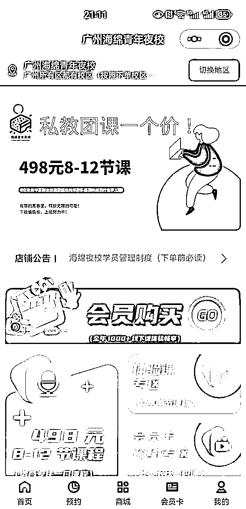

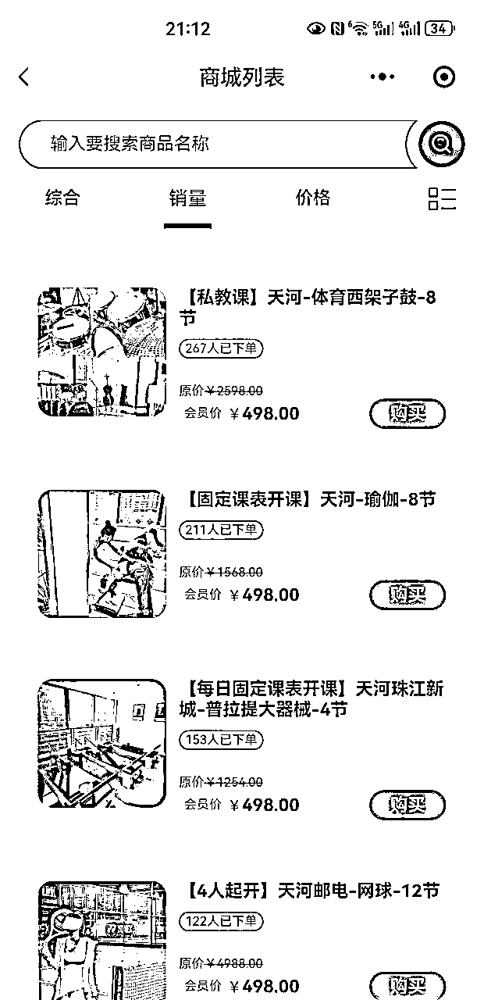

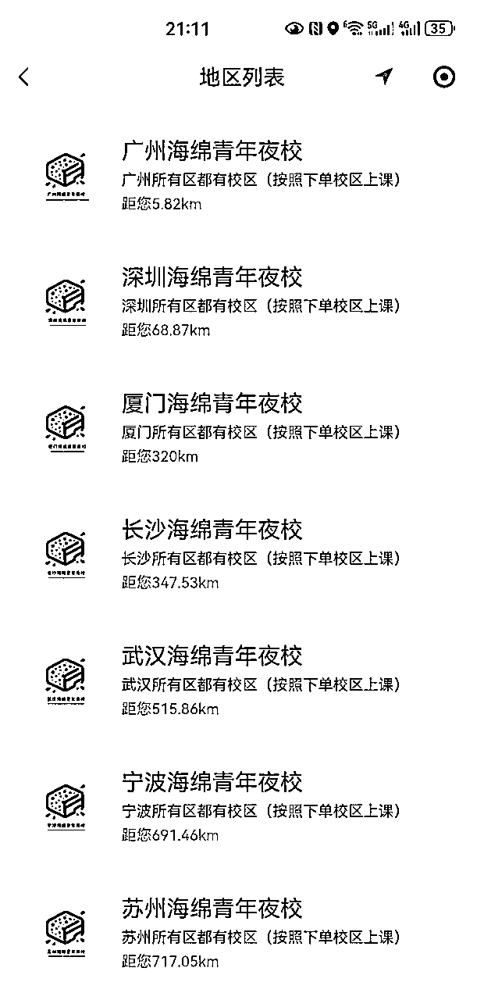

### 2.2 软件为内容创作提效

我们目前就广州已经有 50+账号，全国已经接近 500+账号，每天进流量特别稳定，并且矩阵操作借助软件几个客服就可以更新完。

使用软件前，常规的模式是人工制作图文，然后进行手动发布、手动@，所有人均手动回复消息。这样的方式效率极为缓慢，而且每个人每天人工制作的数量有封顶。

通过工具管理，能够将所有的账号聚合至同一个平台加以管理，让人工效率至少提升 3 倍。

大家无需时刻点开不同账号所在的手机，进行账号的切换，然后再发布内容。

## 3、品牌化是最大差异点

从创立伊始，海绵夜校就怀揣着成为夜校领域新氧的理念。那为什么要选择品牌化呢？

在竞争激烈的夜校赛道中，我们发现很多夜校忽略了品牌建设，而我们看到了这一机会，像新氧在其领域一样，通过品牌化实现差异化，让海绵夜校脱颖而出。深知在众多夜校里，只有让学员记住我们的名字，才有后续发展的可能，所以品牌化是关键一步。

目前，品牌初显成效，从学员的反馈来看，我们的品牌化已经取得了一定的成果，越来越多的学员能够记住海绵夜校这个名字。

相较于那些尚未涉足品牌建设的夜校，我们已经开始积累品牌资产，在未来的市场竞争中占据了有利位置。

### 3.1 世界冠军祝福视频（展示部分）

### 3.2 世界小姐代言视频

### 3.3 品牌注册与小程序

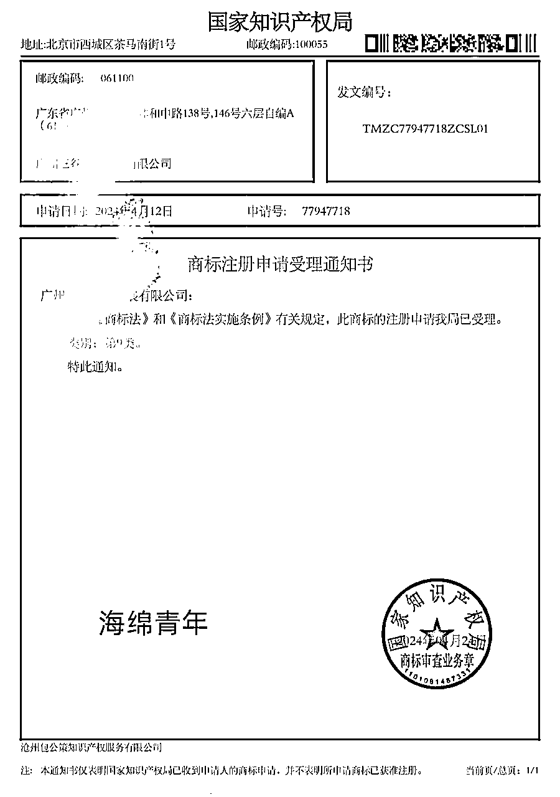

### 3.4 LOGO/吉祥物

我们最近还更新了我们的 LOGO/吉祥物，接下来会延申特别多的产品，如钥匙扣，胸章，抱枕，公仔，书签等各种周边，在消费买课的同时，我们会快递一份品牌周边给到他们，提升他们的提样，增加海绵在他们心目中的比重。

### 3.5 400 电话的介入

400-800-2770（海绵青年夜校全国唯一客服电话）

毋庸置疑 400 的电话的介入，提升了海绵青年夜校在消费者心目中的形象，并且我们有专业的客服进行接听与解答，做到了 7*18 小时有专人接听电话，大大的增加消费转化率。

## 4、一些成功案例

圈友@鸿杰

鸿杰年初就触达到这个夜校项目了，目前引流 3000 余人，最高的一天成交订单 44 单，做到了 1 天收益破万的效果。

当然其中离不开鸿杰自己的努力，经常 1 个人早上 8 点回复消息到晚上 11 点，当然中间因为项目原因停滞了 2 个月（个体工作非常累），最近 7，8 月跟着海绵夜校陪跑，目前做到抖音视频连续流量 50 天破万，连续 20 天流量破 10W 的效果，目前半年以来已经连续变现十余万元，并且私域还在持续复购当中，这次航海会成为大家的大师兄，跟大家一起战斗成长。

圈友@清华

清华兼职入场相较于西安同行较晚，但 8 月份紧跟郑钦文奥运网球夺冠的热点，突出重围，2 周跑通 0-1，做到了 70 单，顺利跑通项目闭环。

虽然团队在此之前，并不成熟。但清华通过强执行力，稳扎稳打，视频数据均过万，小红书数据均保持稳定，粉丝规模不断扩大。

目前已经拿到西安排名前 3 的一个网球机构，全年招生规划的合作。

圈友@江楠

江楠是第一个跟海绵青年一起陪跑的夜校，立足于上海，目前团队 2-3 人，在 6 月的时候就强势入场，利用自己小红书的经验进行对上海其他竞品夜校的精准打击，目前通过小红书视频号引流 5000 粉，变现 12 万并持续复购。

# 三、项目机会

从他们的经历和成绩里大家有没有看到什么共性？

对，执行和坚持。

## 执行力到位

任何项目都需要执行力，当前这个模式下的夜校流量获取，是有了执行力就有钱赚，至少不会亏本的项目。

我们已经跑通的成熟模式，有大数量的案例能成功变现，有成熟的爆款模版，我们需要做的就是按部就班的完成，等待自己的付出发芽结果。

## 乘东风，扬帆远航

夜校这个话题从全民热点发展到如今拥有成熟的变现模式，已经有众多人前赴后继地为大家验证过。那现在恰好证明它仍然是我们的刚需产品，所以当下正是不早不晚入场的时机。

但同时我们也能看到，这个赛道的竞争已经逐渐展开，留下来的创业者都是愿意在这个赛道深耕的。

时间，是最大的壁垒。

## 不下牌桌才有机会

在我们从事夜校相关工作的近一年里，可以看到许多人入场，也有许多人离场。我们所能做到的就是留在牌桌上，只要留在牌桌上，就能验证变现的真实性。

切不可一遇到困难就轻易退缩，比如不成班、产品形式不对、流量不佳、转化不好，这些都是常见的问题，我们只要去解决就行。

根据往期的数据来看，如果抓住机会坚持按节奏执行，在航海实操开始后一周你可能会赚到第一块钱，航海结束后收益约能达到 8000 的样子，平均下来每天出单量大概在 3 单。

但需要清楚的是，每个船员所拥有的账号以及转化力度各不相同，因此最终收益与自身情况也密切相关。在我们之前的培养过程中，也会有表现突出或节奏相对慢一些的小伙伴，这都是很正常的。

当然，教练团队会群策群力，协助大家一起拿到更好的结果！

# 四、项目难点

前期未曾接触过小红书图文制作和视频制作的小伙伴，会在内容制作方面耗费一定精力，例如学习小红书账号的搭建框架、抖音账号的搭建框架，高效的制作矩阵号素材进行发布。

在私域转化方面，凭感觉去转化与专业的私域运营必然存在区别。私域运营的效果和转化率息息相关。

为此，我们需要进行专门的私域框架搭建和设计，比如朋友圈该怎么发？新用户来了怎么聊？老用户怎样提高复购率？这些都是影响我们转化率的关键因素。

在城市选择方面，我们容易用主观臆想来揣测市场方向，但会出现偏颇，如何找到能赚钱的市场，也就是选择夜校能高效变现的形式，需要进行相应的市场调研，竞品分析等。

## 航海中的有力支持

1.  手机设备不知道如何设置纯净环境？

基建搭建是比较严谨的，一个步骤错，可能就会导致设备不纯净，从而使后续的起号、发帖、引流都白费。

在广州办公室，我们有专业的基建搭建人员带大家将自用设备进行环境搭建。大家只需要跟进好教练的步骤，严格执行即可，如果大家跑通项目，需要放大手里的设备矩阵，我们会协助大家设计每种设备量级的基建搭建的方案，帮助大家走稳赚钱第一步！

1.  个人可搭建的流量平台账号数量有限怎么办？

普通人的最基础的方法是个人电话卡使用，再扩大是找亲戚朋友。

航海过程中，大家先将自身可用的账号使用好就是成功第一步了，在模型搭建完成后，再放大现有矩阵，我们会协助大家根据自身情况选择合适的矩阵搭建方案。

1.  小红书、抖音、视频号没有稳定流量怎么办？

新手起号，没有手感，没有爆款，

或者流量时好时坏，

或者根本没有流量，封号。

没流量首先需要考虑账号和设备是否有问题，其次是内容优化。

而在流量内容方面，我们会提供各平台对应的爆款模版。之前就有小伙伴利用我们的模版，将视频流量从几百到破万。

1.  引流粉丝少怎么办？

粉丝少，前期需保证日更。

另外执行力到位，跟着我们的方法走，跑通引流路径不是问题。但粉丝少是需要积累的，稳定的更新，逐渐的吃到小红书长尾流量，后面会滚雪球式的越来越多。

如果每个账号流量到顶了，也赚到目前所有账号的峰值了，那时我们就需要考虑是否要放大现有矩阵。

1.  每日稳定进粉但没有转化下单怎么办？

私域运营是一个比较完整的体系，我们会有社群运营、私域运营的完善流程在航海期间交给大家，大家需跟紧步骤，搭起自己的私域。

## 另外航海期间，你可以获得什么？

1.  流量端设备搭建方法：

1.  构建纯净设备环境；

1.  构建纯净网络环境；

1.  同一网络环境下建立一账号一 IP；

1.  必要时的账号多开；

1.  扩量时的账号管理软件

1.  公域引流完整路径：

1.  独自建立账号定位框架

1.  公域平台导流方法

1.  如何根据需求利用自动化工具降本增效

1.  批量找素材

1.  爆款图文 or 视频模版复刻

1.  小红书图文制作、批量制作

1.  视频自动化制作方法

1.  私域转化运营方法：

1.  社群激活、运营

1.  朋友圈人设打造

1.  私域聊天技巧

1.  学习到成熟的商业变现模式：

1.  夜校如何在传统中介模式上做升级

1.  夜校如何通过资源整合变现

1.  在夜校课程的基础上，如何做到一粉多吃，同城流量多维变现

## 航海实战安排

### 基础培训课程：新手入门全掌握

我们会进行基建搭建、公域引流、私域转化的培训

培训教练均在改领域深耕多年

### 陪跑：保证每日任务执行力度到位

有助教老师每天进行任务完成跟进

随时答疑，并提供相应模版

每天教练会带大家进行项目复盘

及时进行动作调整

### 咨询环节：如何放大现有矩阵及后续发展路径

现有模型跑通后，想要在此项目上进行更多模式拓展或赚更多

我们会根据学员自身情况及想做的城市进行方案定制

保证大家的成功变现，或发展成自身事业

## 教练会提供什么

### ① 专业 BD 进行后端支撑

教练支持了 BD 中台资源，有专门的团队谈商家合作，主打 1v1 的夜校模式，转化率相较以往团课模式更高，当前已覆盖上海、广州、杭州等 14 个城市，建联 5000+ 商家，我们只需要专注于流量获取和转化即可，后端产品资源教练会全力支持。

### ② 交付团队全程陪伴

在原来的夜校变现形式中，负责人不仅要负责流量获取和私域转化，还需要对夜校订单进行长期跟踪，以保证订单的交付。

这会极其耗时耗力，也会占用我们在流量和私域方面的精力。

为此，我们做出了调整，安排专门的交付团队进行订单跟进和交付，从而减少小伙伴们的负担，让大家能够专注于流量和私域方面。

# 五、后续发展规划

海绵青年夜校未来一年的发展规划是：在目前已覆盖的一线城市的基础上，进一步覆盖全国的二三线城市，总计达 119 个城市。

百城计划需要更多的执行力强的操盘手和我们并肩作战。与此同时，总部会全局统筹，全国联动，中心赋能，给到所有城市相匹配的发展计划和均等的资源扶持。

这次的航海是 30 天，主要是带着大家完成流量获取的操盘经验，如果说这 30 天下来，你觉得可以深耕这个项目，长期发展，未来我们有两个主要发展方向的考虑：

1.  自营操盘手

可以在广州总部，获得第一手政策风向和流量讯息，定期培训及商业咨询

做 119 自营城市的拓展计划，跟进团队赚钱不迷路

我们也会根据实际情况为你搭建团队，快速跑马圈地

当然如果我们完成的我们梦想，在纳斯达克敲钟，你们就是我们的原始股东。共创海绵青年品牌规模化☺

1.  城市合伙人

可以共享总部带来的转化流量。如：总部直播，品牌流量及各大流量平台付费投流等。

获得总部一系列的品牌加持：代言人的加持，品牌商标使用权加持等。

城市调研和规划，将会有专业团队对你所在城市进行市场调研，保证该城市的基因与夜校模式契合

持续线上陪跑，获得第一手政策风向和流量讯息

## 城市合伙人和自营操盘手的区别

1.  自营操盘手会不断在海绵青年自营盘的基础上进行开疆扩土，相较于城市合伙人更稳定，在广州总部，信息传达，问题反馈更快；同时拥有自己的团队，共享总部资源。

1.  城市合伙人可以自行选择城市，自己搭建团队，在海绵青年的基础上做项目执行，和总部共享资源，需要自己把控项目节奏。

# 六、参加这个项目的试错成本

肯定很多小伙伴问参加这个项目需要付出什么试错成本，这边思来想去，既然项目已经开始航海了，大家自己承担自己吃饭和自己住房的房租不过分把，当然还有一个硬件的成本 ，剩下的软件成本，网络成本吗，办公室成本等就由我们教练承担。

## 线下航海的食宿开支

因为本次航海全程需要广东广州线下进行，一定要线下我们才能感受离成功最近的距离。

首先当然是先报名啦，等待面试通过后，就可以进入航海群，自行准备好生活所需的物品然后开始安排住宿和行程啦。

首先是房租：广州白云普遍的房价在 1500 左右，环境好，房间多会贵一点，如果小伙伴一起拼房的话价格会便宜一点，当然教练这边也在寻找一些可以长租的酒店供大家选择，大家根据自己经济情况各取所需。

其次是吃饭，这就说说起广东的各种餐饮店了，隆江猪脚饭，潮汕猪杂粉，烧鸭饭，白切鸡饭，煲仔饭，参考餐标 15-20 元，还是根据自己的能力选择。

## 需要准备的工具

1，你需要自行准备笔记本电脑 1 台：用来制作我们小红书需要发布的内容，电脑编辑是一定会比手机快的。

2，还需要至少 3 台手机配齐对应数量的手机卡（手机越多，赚的可能越多）

（苹果 8 以上更佳，二手参考 500-800/台，因为需要一机一号，方便准备小红书、抖音、视频号账号，每个手机上各一个，当然，有老账号可直接用的话更好。)

3，电脑和手机如果没有，都可以购买二手设备，这样子大家可以尽量降低自己试错的成本。

# 七、适合人群

1.  首先希望你是认可并愿意深扎同城夜校业务的同学，因为这是长征项目，坚持下去或许是互联网上为数不多的养老项目。

1.  希望你是有充足的时间投入这个项目的同学，因为这个项目个人/兼职玩家逐步淘汰，未来一定是团体化的项目，并且要有一定的抗压能力，无论去到哪个城市都需要面对凶猛的对手，只有战胜他们收益才会更棒。

1.  希望你具体一定的学习的能力，对项目热情，不要因为几天没有得到一个正向反馈就气馁，我们需要不断的学习，迭代，成为行业的第一。

1.  如果你做过销售行业，经过销售的打磨，在我们这对项目是有加分的。

1.  当然如果会剪辑，会 P 图那就更好了，你比其他人又快了一步。

# 八、报名安排

*   本期航海为线下孵化的模式，需要双向筛选，报名人数限 100 人，最终通过电话面试筛选 30 - 40 位合适的圈友参与。

*   报名圈友需要在报名时填写报名表单，等待面试通知，审核通过后，再进行启程准备。

*   项目周期：30 天

*   航海上课地点：广州市白云区

*   需自带工具：1 台电脑 + 至少 3 部手机及对应数量手机卡

*   时间安排：

*   报名筛选时间：10 月 10 日 -10 月 13 日

*   1 天线下大课：10 月 18 日

*   1 天基建准备：10 月 19 日

*   3 天助教陪跑：10 月 21 日 -10 月 23 日

*   25 天线下实战+复盘：10 月 24 日 -11 月 17 日

*   报名金额&退款机制

*   报名金额：2980 无保证金，路费及食宿自理。

*   退船机制：参与者在开课 5 天内（即 10 月 22 日 24:00 前）觉得不合适可无理由退款报名全额；5 天后非不可抗力不支持退款。

*   生财圈友专属：按要求完成 30 天航海的生财圈友（每个账号每天至少更新三次内容并完成当天复盘打卡），30 天后个人收益如果没到 2980，剩下的差额教练团队补齐。

# 九、常见问题

1，这个项目我 1 个人做可以赚多少钱？

答：掌握同城年轻流量，新手首月也可做到 1w+

2，1 个城市的上限在哪里？

答：基于消费主力群体经营，单城市营收 15-30w/月

3，过了红利期，为什么升级版同城夜校还适合入场？

答：①、现在的夜校直接收 500 一单，相比之前收 50 定金，现金流更好；

②、现在升级成一对一一对二的约模式，比之前的一对八人的团课模式，等待周期更短，课程核销率更高，用户体验也更好；

③、现在有工具赋能，直接小程序买课约课，比快团团工具更好用

④、现在的夜校是团队入场，个人很难做得起来了，团队的好处是有分工，直接铺矩阵号，不博爆款，每天批量发笔记批量获取私域，稳定进量。