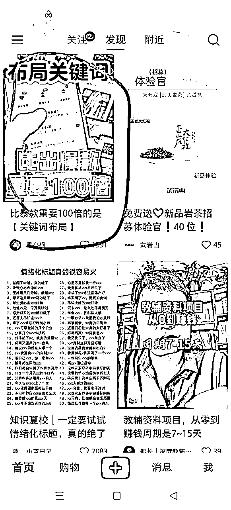

# 在小红书卖虚拟资料，比做爆款重要100倍的是【关键词布局】！

> 来源：[https://qxgrvnd4nbk.feishu.cn/docx/QvsBdv9ErovPqrxzofFcxUk4nvE](https://qxgrvnd4nbk.feishu.cn/docx/QvsBdv9ErovPqrxzofFcxUk4nvE)

圈友大家好，我是更绪，四川南充人，目前是在福建武夷山这边卖茶叶，前段时间发了一篇文章，复盘了一下我从今年4月份在小红书卖虚拟资料的整个过程👉 ，其中也比较详细阐述了整体实操玩法，奈何文字的表达力实在有限，加之很多圈友的思维被抖音这种平台的推荐算法机制影响太深，无法太好理解我想表达的点。

通过这一个多月来和很多圈友的交流，以及我自身在项目中的深耕，有了新的感悟，这二者结合起来，我能更清楚了解大家的一些困惑点。

所以用这篇文章从流量的底层逻辑出发，讨论如何在小红书上卖出去更多的虚拟资料，这也算是对曾经的自己做一个复盘！文章的内容比较主观，有问题的地方，欢迎大家进行斧正！

本文主要分为以下三个部分：

1.  推荐流量VS搜索流量

1.  小红书卖资料的常见误区

1.  为什么“曾经的我”卖不出去资料？

1.  对小红书电商板块未来的展望

# 一、推荐流量VS搜索流量

## 1.比爆款更重要的是【关键词布局】

无意之中打开小红书，feed流中刷到的第一条笔记的标题，完美表达了我想表达的点——比爆款重要100倍的是【关键词布局】

为什么我会这样觉得？

1.  我在上篇文章中提到过，小红书官方给过数据，小红书的站内的流量占比，用户通过搜索行为产生的浏览量占比超过65%，而推荐流量顶天了也就35%，为什么我们不去关注流量占比更高的搜索渠道，反而去纠结笔记能不能爆，能不能从35%的流量池里去分一杯羹？所以，比爆款重要100倍的是【关键词布局】！

1.  没有人能保证自己能随随便便做出来爆款内容，做爆款的逻辑也非常简单，核心就是抄，其它的点都是辅助作用。但是算法具有很强的不确定性，除非你的内容基数足够大，用数量去对抗算法的不确定性，但是归根结底，依然充满了不确定性。所以，比爆款重要100倍的是【关键词布局】！

1.  相对来说，通过布局关键词去吃被动的搜索流量的确定性就高多了，是可以形成完整SOP操作流程的，即通过查看搜索词的工具（聚光）——找出长尾词——制作含大量长尾词的笔记内容，这确定性不可谓不高。所以，比爆款重要100倍的是【关键词布局】！

1.  搜索流量可以吃很久，一篇布局好长尾词的SEO笔记，可以在未来超级长的一段时间内容持续出单/获客，至少我半年多以前做的笔记，现在每天都有用户通过搜索静默下单，我什么都不用管。这是费尽心思想办法做出来的爆款笔记不具备的优势！所以，比爆款重要100倍的是【关键词布局】！

1.  绝大多数的小红书内容创作者，每天纠结的是，“我的笔记小眼睛为啥这么少”、“为啥其它人抄我的笔记都能爆，我的却不能爆”，“为啥我抄了他的爆款笔记，我却不能爆”，很少有人知道搜索流量如此巨大，就算知道也只是知道，没有多少人意识到它的重要性，更没有多少人去抓这部分流量，竞争不可谓不小。所以，比爆款重要100倍的是【关键词布局】！

1.  投过聚光广告的圈友应该会知道，选择投放渠道如果选择搜索渠道，笔记的单个点击成本会比选择全站智投高出不少，这不就说明搜索流量更值钱吗？平台都直接明示你，搜索流量更精准，更值钱，爆款的推荐流量越大，反而越泛，除了看起来好看一点，其实没太大意义。所以，比爆款重要100倍的是【关键词布局】！

## 2.如何布局关键词

很简单，其实没什么太多技巧，就是做SEO而已。

这里分享一个最简单，但是最有效的找长尾词的方式——利用小红书的搜索栏！

比如我们要准备卖润德执业药师的资料，那我们就在小红书的搜索栏输入润德执业药师，后面出现的这些长尾词，穿插在我们的标题、文案的开头中间结尾、标签，就是一篇很好的SEO笔记！

## 3.如何提升搜索排名

个人体验下来，其实大多数时候是不需要刻意去提升排名的，大部分笔记发出去，随着时间的积累，它自己就能慢慢出单，慢慢积累数据，因为现在小红书的同行大多不强，很多类目的搜索流量压根没人专门去做，只要你去发了笔记，多发几篇，你就独家霸屏了，不需要和同行竞争，不需要想办法提升排名。

当然，有些类目有一些小的竞争，但是需求量更大，这个时候我们还是需要想办法提升自己的笔记排名和笔记数量，让用户更先和更多地看到我们的笔记！

小红书现在的搜索逻辑算法还不是太成熟，并不像其它电商平台一样，能够做到“模糊搜索”，其它电商平台，搜索一个关键词，出来的内容不一定是完整匹配这个关键词，可能是并没有这个关键词，但是数据很好的内容，但是它和搜索词会有一定的关联度。可以看看下图，在抖音搜索“润德执业药师资料分享”，排名比较靠前的视频，400多个点赞，但是它是分享选资料心得，并不是分享资料资源。

小红书现在的搜索，还是比较原始的“精确搜索”，也就是说，你搜索出来的笔记，和你搜索的关键词是高度匹配的。其实这对我们非常友好，因为可以排除掉很多笔记数据很好，但是没有做关键词布局，没有做SEO的笔记，少了很多的竞争！同样在小红书搜索“润德执业药师资料分享”，出来的笔记都是分享资料资源的。

小红书的笔记的搜索排名，主要由2个维度决定，关键词匹配度＋搜索满意度（笔记数据）

关键词匹配度就是由我们的关键词布局所决定的——长尾词选得好不好，SEO做得好不好。

而搜索满意度，即用户搜索看到你这篇笔记做出的用户行为，表现为在笔记停留的时间、赞藏评关等行为。

在做好笔记的SEO的前提下，最后的问题就细分到了——“如何告诉算法，我的笔记好，用户都喜欢，你得把我的笔记放在前面，这样才能帮你平台增加用户粘性”

首先得把笔记的图片做得尽量好看，笔记质量尽量高一点，这是前提，不然谁给你点赞，谁停下来看！

酒香也怕巷子深，我们得通过辅助手段，给算法多喂一点用户数据，让它知道，有很多的用户对我的笔记都很满意，我的是优质笔记。上篇文章也有提到过，就是用聚光/乘风投流，让笔记产生更多的用户数据，去喂给算法。

以上总结下来就是，保证好笔记的质量（不难看），做好笔记的SEO，再辅以一点投放，你的小红书笔记发布出去之后，在未来很长一段时间内，你都能持续通过这篇笔记获客，完完全全实现“躺赚”，躺着获客！

# 二、小红书卖资料的常见误区

## 1.非常担心版权问题

上篇文章我有详细提到过如何规避版权问题，很详细，感兴趣的话可以再去看看👉

但是除非是自己开发的资料，有自己的版权，不然不可能100%规避版权问题。

虚拟占了资料利润高、不需要发货、低成本、没有囤货亏钱等诸多的优点，但是缺点就是会存在版权问题，总不能全是好处吧！

个人实测下来，按照我说的方法去操作，足够去规避了。干任何事，做任何选择都会有风险，好比你参与交通，开车上高速的时候，不也会存在风险吗？难道我们就要因为规避高速公路出交通事故的风险，放弃高速公路给我们带来的便利？

## 2.流量焦虑

实际上很多人卖虚拟资料，笔记发出去几十播放量，就感觉废了，卖不出去了。

实则几十的播放量已经很高了，尤其是比较小众蓝海的资料，平台压根都不知道该给你分发给哪些人，第一波推荐流量自然就低了！

我发的很多笔记发出去，就一二十播放量，但是不影响它在未来很长一段时间内都持续有人搜索进来下单。

我可以给到一个非常具体的数据。玩搜索流量，小红书店铺100个访客就能出10单左右，大概100-300的利润，100个访客大概对应200-300的笔记播放量。

换句话来说，你的笔记每有200-300的浏览量，大概就能100-300的纯利润，现在你还会觉得几十和一两百的播放量很少吗？

贴一张图，最近新起的一个店铺，笔记总浏览量200多个，千帆店铺进来了66个访客，出了18单，纯利润300多，这就是搜索的转化率！

## 3.喜欢加到微信去卖资料

对于这种操作我真的不是很理解，为什么非要加到微信去卖资料，难道有更高客单价的产品可以很好的转化？

如果单纯的只是卖资料，一定要开小红书店铺去卖，开了店铺卖对没有开店铺的人来说就是降维打击！

还请尊重一下互联网流量和转化的漏斗模型， 答应我！把店铺开起来，链接挂起来好吗？

## 4.陷入选品陷阱

大家都知道，做电商，选品很重要。我记得生财后台，大家搜得最多的一个词就是“选品”。

它确实很重要，但是其实也没有那么重要。

因为大多数时候，你通过主观判断和客观数据选出来的品，不能算特别完美，但是绝对是及格的。选出来的品可能不足够卖爆，但是绝对是能卖出去一定量的。选品决定的仅仅是上限。

就像很多人动不动就喜欢讨论行业红利、风口，但是其实和你一个月赚点小钱根本没太大关系，这些决定的都是上限，就和选品一样。

大多数时候你卖不出去资料，是因为笔记做得不够好，笔记发得不够多，坚持得不够久，而不是品不好！

# 三、为什么“曾经的我”卖不出去资料？

## 1.太急了

对比起抖音，小红书的流量来得很慢，加之我又是做的搜索流量，就是慢上加慢，反馈的滞后性太久，经常就是没有布局完全，没看到反馈就质疑，从而放弃。

但是实际就是，我发过的每篇小红书笔记都没有白发过，暂时没出单，一段时间后它总能出单。选的每个品，暂时卖不出去，但是一段时间后总能卖得出去。

## 2.没有弄清楚自己为什么能卖出去

没有标准化的流程，不清楚底层逻辑，每个动作每个行为都是不自信，每个决定都是犹豫的。

现在我弄清楚了自己为啥能卖出去，并且可以非常清晰把我的思路用这篇文章讲出来。

核心还是要去持续深耕，不断总结！

前提是要相信，先相信，实在没结果再质疑！

## 3.没有知行合一

很多东西悟出来了，也没有去实操，没有去坚持实操，即使到现在，也存在一部分这个问题。

感觉是人性的问题，很难办到，希望下次再写文章的时候，能变得更加知行合一吧。

# 四、对小红书电商板块未来的展望

## 1.平台上限不高

大家可以看看下面这篇文章，讲了很多小红书老板、领导、以及内部发生的一件事。

从这篇文章可以看得出来，这平台上限真的不高，老板不是什么太正常的人，经常喜欢干些抽象事情。看完这篇文章，我愈发相信，这个世界真的是个草台班子，他们可以的，你我也一样可以。

从我自己深耕这个平台的过程中也会感受到，小红书平台干的很多事情，不是大公司的行事风格，它的上限，绝对不会达到字节这类互联网巨头的水准。

奈何这个平台的用户群体质量确实高，占有天时地利，没有人和，可惜了。

## 2.机会依然巨大

小红书的整个电商板块，正如我说的，平台做得很差，所谓的迭代更新完全就是乱来，这么多个电商平台，抄都抄不明白，好多地方还处于一片荒芜，但这其实正是属于我们普通人的机会，不完善，不成体系，反而给我们提供了更多机会。

用户的电商心智也没有培养起来，甚至很多品牌对小红书都没有电商心智，他们可能真的不知道小红书还有电商板块？

我在武夷山这边，发现有个茶叶品牌，他们的产品每个月在小红书有上万的搜索量，官方在小红书也有账号，但是他们居然没有开通小红书店铺卖茶叶？你敢信？

这个茶叶品牌现在还是在抖音投千川卖茶，小红书有几万粉，店铺都没开，都没怎么运营！

写到这里就差不多了，这篇文章既是一篇分享贴，也是我对自己的反思和复盘，大家有任何问题欢迎在星球的评论区和我交流，有问必答！