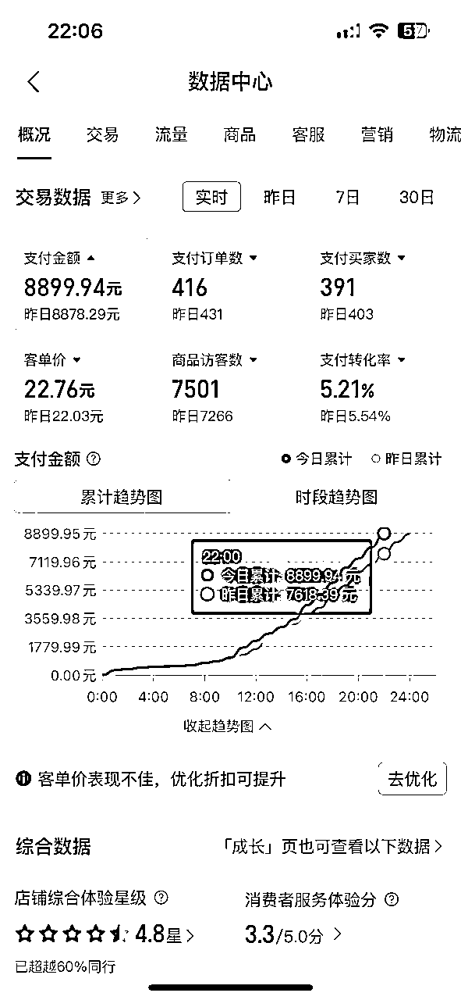

# 2024拼多多最暴力无解3种起店玩法

> 来源：[https://wwa6ugt6w2.feishu.cn/docx/RBRkd9JqSorv13xKMQncw8jAnLh](https://wwa6ugt6w2.feishu.cn/docx/RBRkd9JqSorv13xKMQncw8jAnLh)

# 当下平台现状

由于当下平台的变革与调整，现在的强付费如果你没有足够预算的话，尽量别玩。

优先考虑利润，再去考虑单量的问题。

亏本起量并不是不行，但是你后续想拉上来的话，需要对款式/类目/客单价以及运营技术都有一定的要求。

你一定要对产品有一个清楚的认知，你有没有款式优势，又没有价格优势玩不了低价的话，那应该怎么去玩付费？

我手下多个类目的店铺在跑，最核心的赛道是老照片Ai修复。

下面是我其中一个老照片修复店的数据。

每个店铺每天保持1W左右的GMV，差的时候也不会低于5000.

# 3种起店方式

1.自然流：比价截流 铺货 活动

2.半付费：卡日限额拉自然 高投产 全天付费

3.强付费：产品利润够 你的预算充足

起店初期，测链接

测链接都是你第一步需要做的。

除非你是纯自然流店铺，不管你是什么玩法。

那怎么测链接？

大家今年都常常听见铺货，裂变。

其实就是为了跑出一个或者几个优秀的链接。

比如我有几十个款，我上传之后看哪个链接数据跑的好。

比如我只有一两个款，那就上多链接用不同主图，价格，SKU，做出差异化，去上车。

看哪个车子能跑的动，增加前期车子开的动的机会。

有些车子跑不动的情况下如果我们防比价做好或者出价合适的前提下，可以说款不行或者这个链接运气不好。

防比价一定要做好，不想再多说这个了。

这也就是去上多链接测试的原因

## 自然流

比价截流

比价截流永远是最直接有效玩自然流的，前提就是你要比绝大部分链接价格低。

这种方式很简单，找好你的对标竞品可以1比1去复制你竟品的链接，但是最重要的一点就是价格通常要低10%左右，前期可以配合一点直通车，加快产品入池和系统比价的速度，一个链接起来了，继续下一个链接，一个店铺起来了，继续下一个店铺，就是裂变和矩阵的思路！

但问题是，很多有价格优势的老板，都看不上截流的利润！

铺货

简单理解就是一直找款一直上链接，用款的数量来把流量堆起来，

1个款可能给你10个访客，10个款就是100，100个款就是1000。

就是用量去堆。

缺点就是转化低，劳民费神

活动

不停的去上百万，584，万人团这些大活动，

但是前期要去做好这些链接的基础，不适合萌新，适合懂规则的商家。

反正就是一个活动接一个，不停。

这种方式也就是不停的上活动，通过一次次活动拉动权重获得自然流。

但问题就是会出现：活动下了，自然流会逐渐减少，甚至直接没有。

也就是说，除非你一直待在活动上，或者用直通车去承接。

当然，一次次活动价格会越压越低。

## 半付费

卡日限额拉自然：

如果我们一天车子只跑4-8个小时，当我们权重够高，剩下的时间会不会出自然订单？

一定是会的

这也就是我们常说的，卡日限额拉自然。

通过直通车，尽量是成交出价模式，优化好点击率，转化率等数据，每天稳稳拉住限额，

等你的营业额上去，车子下线后自然流进店。

高投产

高投产的核心一定是有足够的性价比，也就是价格要足够低，卡好高投产，前期先用指数单配合，一定要补能计入销售额指数的单子，不是随随便便的刷单，后面再开车全天付费

这个就是你尝试或者了解了前面的玩法，你的直通车能开的动，但是自然流比较少或者没有，那你就去观察数据能不能优化，点击率，转化率这些。去优化拉升一下，然后就可以去尝试转全天付费。

## 强付费

首先什么是强付费？

简单点能强付费的链接一定是利润高的产品，退一步来说，你一单利润2元做强付费能亏得你裤衩子都赔掉。

我们 Ai老照片的利润空间非常大，主要成本就是时间。

简单直接说比如一单利润10元，去掉广告费退货率手续费你还能剩下几元，这种款才适合去做强付费。

要记住尽量不开极速，容易断流，也测试不出真实数据。

强付费投产都是低拉高，千万别一开始把投产设置的高高的，一下就死。

总体就是前期出价高点没事，保本或者微亏都可以，后期慢慢拖价然后拉高投产。

能保本最好，新手什么都不懂的情况下尽量不要去货损，你玩不明白的。

做强付费一定要有推广预算，三五千块钱玩也别玩，最后容易弄个不上不下，丢了舍不得，继续做还害怕没效果。

而且做了强付费，你别想再见到免费流量！

选择了这条路就坚定走下去，穿过瓶颈期以后就会拨云见日，不断优化调整自己的AI后期团队，提高出图效率。