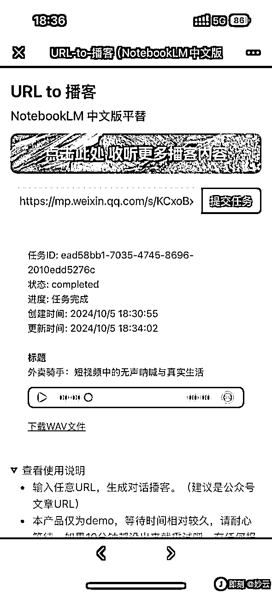

# 航海项目执行路径的100条提效指南1.0

> 来源：[https://q8smv4c9nu.feishu.cn/docx/RO9pdl9f5ojVO5xhBYOcDppqnrh](https://q8smv4c9nu.feishu.cn/docx/RO9pdl9f5ojVO5xhBYOcDppqnrh)

哈喽大家好，我是木木（张子安），这周亦仁发帖提到工具使用指南，由于工作原因和日常习惯，我喜欢挖掘各类小工具和信息。这些年不断地收藏，让我成了一个“电子仓鼠”：浏览器书签5k+，网盘大几个T。刚好借这次机会，和大家分享分享我囤的粮。

自从21年加入生财后，我参加了不少的航海和线下聚会，了解到圈友们在实操中经常会被各类小难题卡住。那接下来，我会从做项目的工作流：项目调研 --> 项目0-1 --> 项目1-10，分阶段的提供对应的解法。

本文适用人群：

1.  参加航海的新手

1.  短视频/图文相关行业的圈友

1.  对搜索资源感兴趣的（文末含搜索技巧）

先奉上一份目录，点击目录的蓝色文字直接跳转对应内容，方便查阅。个人理解难免不全，希望仅有的小技巧能帮到更多圈友。话不多说，我们开始~

* * *

### 收藏夹目录：

一、项目调研

1.1 行业数据

1.2 数据分析

1.3 数据采集

二、0-1 阶段

2.1 资源搜索

2.2 资源下载

三、1-10 阶段阶段

3.1 个人，提效

3.2 团队，矩阵

四、日常办公

五、如何快速找到适合自己的工具

5.1 搜索框大法：更便捷

5.2 无限流论坛：更精准

六、生财有术航海｜实战工具包汇总

七、其他

* * *

### 一、项目调研

#### 1.1 行业数据

年报问答

包含数千家上市公司年报，可精准溯源到原文。适合财经媒体的内容参考。

网址：财经知识库问答

中国产业信息网

提供中国产业经济信息和数据，涵盖多个行业和领域，帮助用户进行市场分析。

网址：http://cinic.org.cn/

中国统计信息网

国家统计局的官方网站，提供全面的中国政府统计数据，包括月度、季度和年度数据。

网址：http://www.stats.gov.cn/

阿里天池

阿里巴巴集团对外开放的科研数据平台，涵盖电商、娱乐、物流、医疗健康等多个行业的数据集。

网址：https://tianchi.aliyun.com/

199IT

提供全球市场研究机构的数据报告，涵盖多个行业和领域，帮助用户发现数据的价值。

网址：http://www.199it.com/

艾瑞咨询

提供互联网及数字科技领域的研究报告，帮助企业进行市场分析和商业决策。

网址：https://www.iresearch.cn/

QuestMobile

专注于移动互联网用户行为数据分析，提供全生命周期的APP数据研究。

网址：https://www.questmobile.com.cn/

Mob研究院

提供行业洞察报告和专业数据报告，涵盖多个行业和领域。

网址：http://www.mob.com/mobdata/report

前瞻数据库

提供中国宏观经济、行业经济、全球宏观和区域宏观数据，帮助用户进行市场分析。

网址：https://x.qianzhan.com/

豆丁报告网

提供各行业的行业分析报告、市场调查报告和研究报告，帮助企业进行市场分析和决策。

网址：https://baogao.docin.com/

CBNData

第一财经商业数据中心，提供消费数据和市场分析报告，帮助企业了解消费趋势和市场机会。

网址：https://www.cbndata.com/

美国政府公开数据网

美国政府公开数据的网站，包含了经济、消费、教育、医疗、农业等多个领域的数据。在国内也可以直接登录，通过在首页进行搜索查找相对应的数据集。不过网站界面是英文的，要有些英文基础才看的懂。

网址：https://data.gov/

#### 1.2 数据分析

通用数据分析

飞瓜：https://www.feigua.cn/

蝉妈妈：https://www.chanmama.com

5118：https://www.5118.com/ci?promote=1F9C8B

极客增长（dso100）：https://www.dso100.com/

新榜：https://www.newrank.cn/

微信指数：微信内打开：#小程序://微信指数/Edrmp9CMFdInP4z

抖音数据分析

巨量百应Buyin：https://www.douyinec.com/

抖查查：https://www.douchacha.com/uppoint

考古加：www.kaogujia.com

巨量算数：https://trendinsight.oceanengine.com/

抖音实选：https://dy.dataoke.com/xp?first_cate_ids=386&page=1

视频号数据分析

友望：http://www.youwant.cn/

新视：https://xs.newrank.cn/data/home/index

小红书数据分析

蝉小红：www.chanxiaohong.com

灰豚数据：https://xhs.huitun.com/#/home

千瓜：www.qian-gua.com/

新红：https://xh.newrank.cn/

#### 1.3 数据采集

### 二、0-1 阶段

#### 2.1 资源搜索

飞书-飞行社

首推飞书的飞行社，在这里你可以看到备份好类型的各类知识库，包含：AI知识库、行业报告、出海、运营、项目管理、办公提效等内容

网址：https://www.feishu.cn/community?from=app

AI知识库导航

收集了各种AI相关的知识库和教程

网址：AI 知识库导航 - Pintree

免抠图片网

网址：免抠图片网|免抠素材|透明背景图片|免费图片素材|png图片|透明背景素材|设计素材

图库

Pixabay：https://pixabay.com/

Pexels：https://www.pexels.com/zh-cn/

Hippopx：https://www.hippopx.com/

Stocksnap：https://stocksnap.io/

菜鸟图库：https://www.sucai999.com/

Piqsels：https://www.piqsels.com/

Burst：https://burst.shopify.com/

视频库

Videezy：http://www.videezy.com/

Mazwai：https://mazwai.com/mazwai/

Mixkit：https://mixkit.co/free-stock-video/

OpenFootage：https://so.vjshi.com/

Coverr：https://coverr.co/

freepik：https://www.freepik.com/videos

#### 2.2 资源下载

#### 2.3 内容处理

图片无损放大

https://bigjpg.com/

https://magicstudio.com/zh/image-upscaler/

https://www.photozoomchina.com/

像素蛋糕

商业级AI图像后期软件

网址：https://www.pixcakeai.com/

抠图工具

remove.bg：https://www.remove.bg/zh/upload

美图抠图：https://cutout.designkit.com/?utm_source=ai-bot.cn

稿定设计：https://www.gaoding.com/koutu

photokit：https://photokit.com/tools/cutout/?lang=zh

ARC：https://arc.tencent.com/zh/ai-demos/humansegmentation

一键抠图：https://www.yijiankoutu.com/

图片压缩

https://www.yalijuda.com/

最优图像优化 - Recompressor

截图工具

网页闪电截图插件-Fullpage blitz

发现一个很有趣的截图工具，如果想截网页的长截图，使用常规工具的话至少要用使用鼠标滚轮滑上五六下。而这个插件，截这种长网页的时候，只需要1s左右完成截图，而且很清晰，支持复制和下载。

网址：谷歌商店插件（需魔法）

图像分割

可自定义行、列，对图片进行分割。支持批量图像处理，可以同时拆分多个图像。

网址：图像分割器：轻松将图像拆分为多个部分

金句卡片

Retro Card，适合传播金句、小红书内容制作

网址：Retro Card

大字卡片生成

网站链接：Slogan Word

字幕截图生成器

支持上传任意图片和文字，生成电影质感字幕截图。适用于鸡汤笔记传播。

网址：https://disksing.com/fake-screenshot/

### 三、1-10 阶段

#### 3.1 个人，提效

可画

支持同类型卡片套版，且支持批量出图

网址：https://wx.zsxq.com/topic/188482455288152

流光卡片：批量创建模板卡片

一个插件可以实现和可画类似的创作功能，并支持：

1、在推特、即刻、微博网页版，一键将帖子转化成卡片，并支持二次编辑

2、网页中选中文本，右键一键生成卡片

网址：流光卡片—让分享更优雅，最好看具创意的文字卡片工具，文字转图片，小红书图文神器

可灵AI

升级后的快手可灵AI平台，支持「对口型」功能。在生成人物视频后，上传音频可可以让视频人物口型和音频同步。口播类账号狂喜。

网址：klingai.kuaishou.com

PodLM：AI播客生成器

即刻大牛开发者开发的产品，支持将URL（网页）、文本和文档，一键转换为专业质量的播客。

支持GPT-4o mini、Gemini Flash 1.5、Claude 3Haiku等10种LLM模型，和openai TTS-1模型，生成内容后可设定为多说话人模式，用于采访类的播客内容，并可以一键发布到播客流行平台。

网址：PodLM - AI播客生成器 | PodLM - AI播客生成器

播客生成器

即刻开发者用cursor一小时出的一款AI播客生成器，NotebookLM的平替。支持任意url转为音频播客。

网址：AI播客生成器

#### 3.2 团队，矩阵

小绿书图片一键生成和自动发布

通过COZE工作流和RPA，实现自动生成图文，并批量发布到多个公众号，实现小绿书项目自动化。适合不懂代码的新手玩家用于提效和矩阵化运营。

网址：《借助AI+RPA实现小绿书图片一键生成和自动发布，可矩阵（含影刀脚本）》@陈序员大康

小红书矩阵搭建sop

适用于小红书账号两位数及以上的玩家观看。如果你是打废号流，这个技术帖大概率是可以帮到你一些忙。

网址：《小红书矩阵搭建的技术sop，小白看完都能明白的门道》@明义

小红书矩阵号，如何批量注册蓝v号、批量谈货源，以及批量混剪？

网址：《在小红书铺80个矩阵号，如何批量注册蓝v号、批量谈货源，以及批量混剪？》@吴成

推特矩阵管理

借助 cursor 使用指纹浏览器+Playwright+AI，从0开始构建了一个推特矩阵运营工具，实现了自动养号、互动、定时发推等功能，实现单机多个账号矩阵管理。

网址：《【生财技能】从0到1使用AI，搭建能自动养号和发推的矩阵运营机器人》@钱塘江鲤

### 四、日常办公

Everything

支持Windows电脑，适用于本地文件高效搜索，比电脑自带的搜索功能快很多，基本上秒出结果。

在线文件批量重命名

无需下载&安装，支持大文件与多种重命名模式，一键批量完成文件重命名，高效便捷

网址：https://webrename.cn/

Umi-OCR 文字识别工具

一个免费，开源，可批量的离线OCR软件，解压后即可使用，自带离线OCR引擎，支持识别不同排版，按正确顺序输出文字。

网址：https://hiroi-sora.lanzoul.com/s/umi-ocr

屏幕录制

screenity

免费，开源，功能丰富，没啥限制

网址：https://screenity.io/en/

PDF去水印

文字教程：

*   你绝没看过如此详细的PDF去水印教程

*   PDF去水印教程 - 尼玛范爷 - 博客园

*   PDF如何去除水印？三种方法教你如何去除PDF文件水印_pdf去水印-CSDN博客

在线工具：

*   在线去除PDF水印工具 安全、快速、免费、无添加 - 专业版

*   iLovePDF | 为PDF爱好者提供的PDF文件在线处理工具

视频教程：

*   分分钟去除几百页pdf的水印_哔哩哔哩_bilibili

*   PDF去水印，自动批量删除所有水印 - 小红书

### 五、如何快速找到适合自己的工具

授人予鱼不如授人以渔，和大家分享一些我是如何快速找到自己想要的信息的，都是压箱底的小技巧，点个赞不过分吧。

1.  搜索框大法

1.  无限流论坛

#### 5.1 搜索框大法：更便捷

下面包含各类搜索渠道，在平台搜索需求，大概率可以拿到答案。除在生财和微信的搜索外，优先推荐在即刻搜索，其次是推特和抖音。

拿即刻举个例子，可以搜索对应的圈子，如AI探索站、Chrome插件分享站、JitHub程序员等，你看，在这些圈子下面都是很垂直的工具池。

1.  生财有术索引站：scys.com

1.  微信搜索：

1.  微信搜索框直接搜索信息，首选聊天记录中的内容。如果你加过很多航海群，你就会发现，你的需求在各个群内已经被解答了无数次了。如果聊天记录没有，继续点击「搜索」查看，你甚至可以选择视频号、朋友圈、公众号等信息源，直到找到你需要的内容。

1.  长按微信信息，点击「搜一搜」，可以直接跳转到搜索界面，这操作无论在手机端还是电脑端，都是无敌的懒人操作。

1.  自媒体平台

1.  即刻

1.  推特（X）

1.  抖音

1.  小红书

1.  快手

1.  Telegram

1.  YouTube

1.  TikTok

1.  ...

1.  AI 工具搜索

1.  chatgpt（首推，需要魔法）：https://chat.openai.com/auth/login

1.  豆包：https://www.doubao.com/chat/

1.  Kimi，复杂要求用Kimi 探索版：https://kimi.moonshot.cn/

1.  智谱清言：https://chatglm.cn/?lang=zh

1.  腾讯元宝：https://yuanbao.tencent.com/discovery

1.  浏览器搜索

1.  百度

1.  谷歌

1.  必应

1.  搜狗

1.  搜狐

1.  ...

#### 5.2 无限流论坛：更精准

先给大家推荐几个常用的论坛

1.  Github（首推）

全球最大的代码托管平台

网址：https://github.com/

1.  吾爱破解

专注于软件破解、逆向工程的技术论坛，国内优先使用

网址：https://www.52pojie.cn/

1.  CSDN-专业开发者社区

全球知名中文开发者社区

网址：https://www.csdn.net/

1.  NGA玩家社区

别看他是一个玩家社区，但是这里面除了游戏，还包含了职场人生、厨艺交流、IT软硬件、运动、国际新闻等板块，可是被各类网友玩出花了，比如你经常在网上刷到的黄底黑字的古老感截图，就是在NGA社区交流的

网址：https://ngabbs.com/?rand=945

1.  值得一读技术博客

每天会更新各类技术博客，也会包含各类的有趣网站

网址：https://daily-blog.chlinlearn.top/blogs

1.  V2EX

网址：https://www.v2ex.com/?tab=tech

为什么我称之为“无限流论坛”。其实你会发现，当进入一个论坛后，多数情况下会有「友情链接」的跳转，点击跳转就会发现进入到另一个论坛，可无限开启套娃。这样你就获得了数不清的工具箱。

如图

### 六、生财有术航海｜实战工具包汇总

### 七、最后

以上，只是互联网收藏夹中的冰山一角。

虽然说“工欲善其事，必先利其器”，但有一个小提醒，不要过度被工具锁住。过度的追求工具，追求效率，反而会适得其反。

一般我找工具的流程是：各个平台搜索 -- 根据需求筛选 -- 功能测试 -- 留存使用

完成这套流程必然会耗费不少时间，对于部分工作来说，并不需要使用工具完成，反而传统方法是更高效的。

在我留存的工具越来越多后会发现，有不少工具都是没有被复用的，很可惜。刚好借这次机会和大家分享一下我的屯粮，也期待大家可以参与到分享和共创中来，越分享越幸运，杜绝做一只“电子仓鼠”。