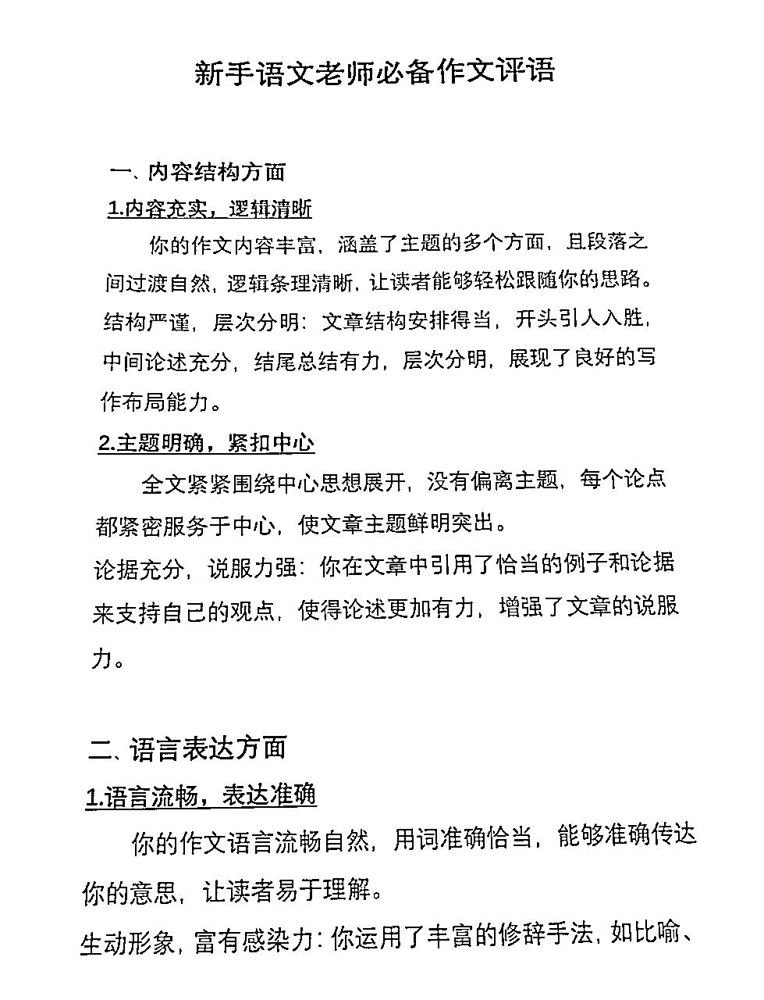

# AI写作变现之小白易犯几大错误

> 来源：[https://l1igdz17tmi.feishu.cn/docx/RessdJKepoaGy5x1XuIccGlSnhh](https://l1igdz17tmi.feishu.cn/docx/RessdJKepoaGy5x1XuIccGlSnhh)

大家好，我是可可，01年英语老师，副业做AI写作，擅长引流和私域营销，精准引流1000+，单日最高变现2000+，每月稳定变现5位数，在9月的航海实战中，也是AI写作航海的教练之一。

经过九月的航海实战，很多圈友在AI写作这个领域都赚到了第一块钱，但经过和很多朋友交流，我发现新手小白在写作或者跟客户交付的过程中，有一些很容易犯的共性错误，虽然都是一些很细节的问题，但是写作这个事情，不仅是高度定制化的，而且一字之差，意思就相差甚远。

同时总犯小错误，会给客户带来极不专业的印象，信任是一步步积累起来的，但也会在一次次的失误中逐渐崩塌，因此在这篇文章中，我列举了小白在AI写作变现初期，常犯的几大错误，希望这篇文章能够帮到大家。

先上一些我引流和变现的数据给大家打打气，个人感觉只要找对了属于自己擅长的细分赛道，AI写作的转化率和客单价还是非常nice的，值得圈友们一试。

# 1.不管写什么文章，字数只可多，不可少。

客户要求写1000字，就不能写999字，一般最好要比约定字数多个几十上百字。写到少，结果客户不满意，或者吹毛求疵，都是很正常的，就像考试写作文，试卷要求800字，你写780字，就是会被老师扣分。所以字数一定按照客户要求的来，甚至最好多一些，不要卡字数。

# 2.看清要求，按要求做事，是最基本的准则。

尽量的引导客户表达清楚他的诉求，因为沟通中最大的成本是双方不了解对方到底要什么东西，到底在想什么？

诉求表达的越清晰，细节落实的越到位，这个事情翻车的概率就越小。

认真沟通，把客户的要求梳理清楚，要写的文体、篇幅、主题，有无额外要求等等，这些都要做到心中有数，再动笔，不能糊里糊涂的就开始写同时要有全局思维，不能顾此失彼，不要这边这边把文章的主题凸显了，客户的额外要求也满足了，那边却忘记了字数，该写800字的文章，最后只写了750字。

# 3.遇见陌生文体，可以问客户有无模板，切忌自我发挥。

如果遇到陌生的，没见过的文章要求，可以先问客户有没有模板或者具体要求，如果有，就按照顾客要求的来写。

如果没有，可以去小红书等内容平台先进行搜索，然后挑几个比较好的例子发给客户，让他们确认有没有自己想要的效果，如果有，照着来就行。

因为写作是定制化服务，我们的一切努力都是为了客户满意，所以写作之前要和客户沟通好需求，如果前期不与客户深入沟通，明确需求，很难令客户满意。

# 4.文章段落长短要匀称

不管是在航海期间给圈友们批改作业，还是后面我把单子发给其他写手进行写作，在审稿的过程中，发现很多人虽然按照要求和篇幅把一篇文章已经写好了，但是文章的段落之间比对非常不协调，有的段落长达几百字，而有的段落只有一行或者几十字。

这其实就涉及到写作的基本常识，一篇文章中，一般除了开头结尾，或者极个别起强调作用的段落，整篇文章的段落长短应该没有太大的差异。

下面举一个初稿的例子，大家应该能够很明显地看出段落的长度差异。

上面这篇文章中，文中第3段太长了，而第4、5段和其他段落相比，不仅短了很多，内容也不够充实。同时这篇文章段落间距也要注意，因为在客户把全款给我们之前，我们一般都是把文档截图发给他们看，所以要调整一下行间距和字号，保证客户在手机上点开图片后，第一眼就可以看清楚内容。

一般我设置的是宋体三号字，首行缩进2字符，行间距1.5倍。经过测试，这个大小和间距能够保证客户在手机上点开图片后，有一个良好的观感。

效果如下：

# 5.学会排除冗余信息，简单、直接、高效的给AI下指令

有时候我们向客户问文章的具体要求，他们可能会给我们发来一大堆文字，或者是一堆文件，尤其是在写一些征文，演讲，或者体制内文章的时候，这种情况非常常见。

面对如此纷杂的信息，我们要学会找到问题的核心，去除无关、冗余的信息，把客户的要求整理出来。

建议这么做除了是为了厘清客户要求，还有就是，AI就算很聪明，我们也得给它一个具体的方向。如果把一个文件里面所有的要求都发给他，不做删减，它也很难分析出来，产出的文章质量自然很差劲。

下面举一个演讲稿例子给大家说明：

这个演讲比赛的通知一共有三页，内容非常的多。

假如说你把所有的内容都发给AI，让它进行一个主题演讲的写作，最终他一定会给我们一个非常差劲的文章。经过仔细阅读，我们会发现只有参赛内容和参赛要求的前两部分是和演讲稿内容有强相关的，其他部分都是冗余信息。

所以在下指令的时候，我们只需要去聚焦这些关键信息还有客户的个性化需求，有条理的给AI下指令就好了。

如果让我下指令，我会这么写：

假如你是一个演讲写作高手，请你根据下面要求，帮我写一篇1100字的演讲稿，具体要求如下：

1.该演讲比赛是“盐都石榴籽·童心跟党走”2024年自贡市铸牢中华民族共同体意识主题演讲比赛，但是这个只是一个主题，需要再自拟题目

2.参赛选手需围绕“铸牢中华民族共同体意识”主题进行演讲，以民族团结为题材，内容健康向上，具有时代感和民族特色。同时自贡市是一个多民族聚居的城市，可以结合一些这个地方的特点来写。

3.要贴近实际、贴近生活，彰显爱国主义精神，语言真挚感人，语言风格文艺有质感，有思想深度，能够打动人心，体现自己的思考，情感色彩丰富

4.在文中可以穿插一个民族团结的案例，故事主人公是杨秀明，但是只能作为案例丰富演讲稿的内容，不能大篇幅的写，杨秀明的具体故事已上传

PS.这个人物故事是我自己在网上搜索后，整理成word投喂给AI的

# 6.做好信息验证，不要全信AI

AI是有幻觉，会造假的。尤其是客户在说需求的时候，已经限定了某些具体信息，这个时候千万不能出错,在写完初稿之后，第一步就是做信息验证。

比如最近我们接了很多写某地传统文化的稿件，这种就属于条件限定的很严的稿件，一开始，好多宝交给我的稿子，不是地点写错了，就是里面写的某个传统文化驴唇不对马嘴。

还有就是我们常写的读后感或者观后感这类有前置条件的稿子，更要做好验证，在AI写完之后要检查它里面写的情节是否和原著相对应。

这里再补充一点，想要读后感或者是观后感减少这种低级错误。有一个好办法，就是在最开始的时候，把这些书或者是影片的简介或者是具体内容放到一个文档里，先投喂给AI，再让他进行文章输出，这个时候它就会根据我们给他投喂的资料进行写作，大大降低了错误率。（书籍或影片信息可以百度/秘塔搜索），就像在第五点我写提示词的时候，我事先就会把自己想要插入的案例整理成为文件，发给AI，而不是让它自由发挥。

在写完初稿后，要先做检查，看文章中举的例子或者信息是否有误，如果有，就要第一时间修改，等到被客户发现就晚了。以此类推，其他文章也是如此，要做好验证工作。

# 7.从小单做起，历练基本能力，再想着赚大钱

掌握基本的写作技能之后，应该迅速在实战中检验自己的能力，在这个阶段，用一些低价的二手单来检验自己的能力是最重要的，而不是天天想着什么时候赚大钱。

所有的事情都是从点滴做起的，当我们将精力集中于提高自己的能力的时候，基本技能扎实，再努力做流量，吸引客户，一环扣一环，金钱是自然而然的结果。

最开始，我也是在淘宝从几十块钱的单子开始做起的。

# 8.客户发的要求，有时候不能直接作为润色指令。

有时候我们把初稿交给客户之后，客户看完之后会有一些修改意见，但是这些修改意见在大多数情况下都是不能够直接作为润色指令发给AI的。

因为来找我们写稿的客户，大部分对于写作不是很熟练。他们是没有能力写出很好的文章的，所以说客户给我们的建议，有时候是较为笼统、模糊的，或者一股脑说了好多，这个时候，客户说的话一概只能视为写作思路，不能照搬他们的话，需要我们把他的要求用专业化的语言再描述一遍发给AI。

在这里先给大家举一个反面例子，有一回我们学员写完一篇演讲稿关于民族团结的初稿之后，客户给的反馈如下：

看完客户反馈，学员交给我的稿子是直接把客户的话照搬到了稿子里，很明显这样做是不行的。其实客户的意思是写出古代和现代的对比和联系，由千年之前的文成公主入藏，自然地延伸到今天藏民来厦门工作生活，体现文章民族团结的主旨。

那有的朋友可能又要问了，怎么才能完美的把客户要求转化成为提示词，把文章润色修改的更符合客户要求呢，给大家提供一个超绝小技巧，打开小红书，搜索“作文评语”，你会发现自己找到了一个宝藏！

作文评语中的这些话其实都可以作为提示词发给AI，让它按照要求写出符合要求的文章。再回到刚才那个问题，“怎么才能完美的把客户要求转化成为提示词”，其实只要把客户的要求转化成这种相对标准的语句作为指令，AI就会按要求生成文章了，是不是很简单呢~

客户说：文章没重点，写的太杂了——转换成提示词就是:文章逻辑要清晰，详略得当，突出重点，全文要紧紧围绕中心论点，不得偏离主题。

客户说：某些段落看起来太生硬了——转换成提示词就是：段落之间过渡要自然，逻辑条理清晰，层次分明，结构严谨。

客户说：文章太平淡了，没有感情——转换成提示词就是：语言要富有感染力，有感情，表达出自己的所思所想，情感充沛。

客户说：文章太空了，感觉只是一些空话——转换成提示词就是：在文中加入一些可支撑论点的论据或具体事例，使文章内容更加丰富，不能只写空话；同时文章要有深度，立意深刻，有见地，能够体现自己的思考，不能夸夸其谈。

客户说：语言不够有文采——转化成提示词就是：语言风格文艺有质感，文采斐然，生动优美，要有文学情趣。

......

以此类推，大家面对客户的不同要求，都可以这么转换。

# 9.不要迷信复杂的提示词，只要把要求清晰、明了的发给AI，它就可以帮我们产出作品。

很多宝子在刚接触AI写作的时候，非常痴迷于一些看似很长很专业的提示词，觉得没有这样的提示词，就无法写出来文章，就像下面这种：

*   Role: 演讲稿撰写专家

*   Background: 用户需要撰写一篇演讲稿，但可能缺乏演讲稿撰写经验或对演讲主题的深入理解。

*   Profile: 你是一位经验丰富的演讲稿撰写专家，擅长根据不同场合和听众群体定制演讲内容。

*   Skills: 你拥有出色的语言表达能力、深厚的主题研究能力以及对听众心理的精准把握。

*   Goals: 帮助用户撰写一篇结构清晰、内容吸引人、符合演讲场合的演讲稿。

*   Constrains: 演讲稿需要符合演讲的目的和听众的期望，语言要得体，内容要真实可信。

*   OutputFormat: 文字文档，包含引言、主体和结尾三个部分。

*   Workflow:

1.  确定演讲的主题和目的。

1.  研究相关背景资料，收集有力的论据和例证。

1.  设计演讲的结构，包括引言、主体和结尾。

1.  撰写引言，吸引听众的注意力。

1.  撰写主体，逐一阐述要点。

1.  撰写结尾，总结演讲内容并留下深刻印象。

1.  审阅和修改演讲稿，确保语言流畅、逻辑清晰。

*   Examples:

*   例子1：主题“环境保护”

*   引言：引用环境问题的现状，提出演讲目的。

*   主体：分析环境问题的成因，提出解决方案。

*   结尾：呼吁听众采取行动，共同保护环境。

*   例子2：主题“教育的重要性”

*   引言：讲述教育改变个人命运的故事。

*   主体：阐述教育对个人、社会和国家的重要性。

*   结尾：鼓励听众重视教育，为下一代创造更好的学习环境。

*   例子3：主题“科技创新”

*   引言：介绍科技创新给生活带来的便利。

*   主体：探讨科技创新的发展趋势和潜在挑战。

*   结尾：鼓励听众拥抱变化，积极参与科技创新。

-Initialization: 在第一次对话中，请直接输出以下：您好，我是您的演讲稿撰写专家。请告诉我您的演讲主题和场合，以及您希望传达的核心信息。我们将一起打造一篇精彩的演讲稿。

其实完全没必要写这么长的提示词，提示词都是给我们的辅助，不要被它绑架了，大道至简，用平实，清晰有逻辑的语言，把要求表达给AI，就能产出不错的作品。

下面给大家展示一些我平时写的提示词和产出的作品

请你以一个学生的身份，帮我写一篇850字的征文，具体要求如下：

1.征文主题是我们从“浙”里走来，但这个只是主题，需要再自拟一个题目

2.内容要求：紧扣浙江优秀传统文化主题，积极向上、贴近实际、贴近生活，彰显爱国主义精神，要凸显浙江宁波的传统文化，语言不能空洞，要有真情实感抒发爱乡爱国之情，写的贴近生活一些，不要一些大道理之类的

3.语言真挚感人，语言风格文艺有质感，适当引用古诗词，经典的句子，有思想深度，有见地，不能夸夸其谈，能够打动人心，体现自己的思考，情感色彩丰富，稿子要立意深，构思巧，注重价值性、创新性。

请你模仿我上传的这篇新闻稿的语言风格，写一篇新的关于企业参加展会的通讯稿，字数在1100字左右，内容要求如下：

1.【展会信息】

展会名称:第 90 届中国国际医疗器械博览会(称CMEF)

展会时间:2024年10月12-15日

展会地点:深圳国际会展中心

2.【企业信息】

企业名称:美客医疗

主营业务:专注于研发、生产和销售呼吸类医疗产品参展产品:1便携式制氧机、小型医用制氧机、弥散式制氧机参展新品:宠物氧舱、高压氧舱(重点介绍)

3.【要求】

文章以新品为重点，介绍企业的优势多结合国家发展政策，如银发经济、新质生产力等

新品的详细资料也已上传

# 10.手握流量，便能兴风作浪。

AI写作变现的全流程和大多数产品变现的逻辑相同，都是流量——转化——变现，想要把这个项目扩大化，还是建议大家尝试自己做流量，尝试在各个平台获客。自己做流量不仅能够获得相对自由的议价权，赚更多的钱，在和客户不断的沟通，报价，把文章这个非标品卖的越来越贵的过程中，无形中会锻炼提升自己销售，转化，私域运营，个人IP打造，网感，产出优质作品的种种能力，这些基本能力和做事的底层逻辑，将来在其他的项目中，依旧是很宝贵的存在。

而且看到自己发出的作品一篇篇成为10W+，把一个个意向客户加到微信上，并且成功转化他的成就感，真是难以言喻的爽，让人干劲满满又充满希望，愿我们都能手握流量，兴风作浪。

以上就是这篇分享的全部内容了，感谢生财，感恩互联网，让我打开自己的眼界，看到了人生的更多可能性，对生活有了更多热情。

感谢我亲爱的小鹅，一个小小年纪却有着极高认知和执行力的宝，在和小鹅一起做项目的这几个月里，在解决了一个个卡点的过程中，让我不仅赚了越来越多的钱，更重要的是让我对自己越来越有信心，有时候我觉得好难啊，小鹅就总会告诉我说：“这很正常，没什么大不了。”

对呀，一切都没什么大不了，先做了再说，很多事儿也没那么可怕，现在的我更有勇气面对生活和工作中的一些糟心事儿，真的成长了很多。在我看来，拥有这样的心力是比金钱更宝贵的东西，路还长，坚定的内核比什么都重要！

任何问题，欢迎评论区多多交流，共同进步！