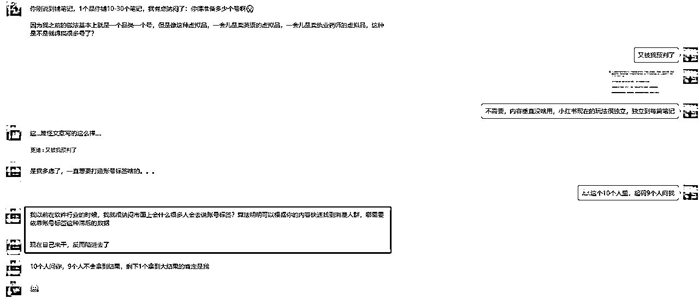
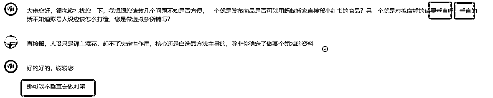
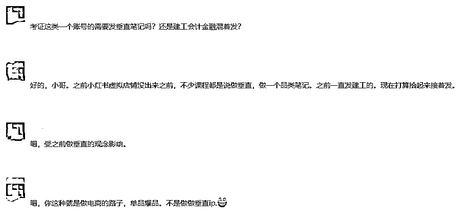
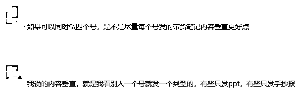

# 小红书十大“谣言”合辑，承认是自己的问题，真的很难！

> 来源：[https://qxgrvnd4nbk.feishu.cn/docx/RqzhdH0oGoO0pNxGbPCcebwmnoc](https://qxgrvnd4nbk.feishu.cn/docx/RqzhdH0oGoO0pNxGbPCcebwmnoc)

圈友大家好，我是更绪，四川南充人，去年大学毕业，目前是福建武夷山这边创业，深耕小红书平台，擅长通过内容、投放获取客资、销售产品。

日常混迹各种小红书相关的社群，自己也有做一些陪跑服务，因此结识了不少从事小红书的朋友，通过与他们的交流，结合自己一路做小红书过来踩的坑，特意写一篇文章来记录常见的小红书“谣言”，并尝试从底层逻辑去把他们讲清楚。不光局限在小红书，其它的UGC平台也同样适用！

细数这些“谣言”，其实背后都对应的是“人性”——当遭遇不顺的时候，人们总是喜欢去找客观原因，很少会从自身出发去找原因，我希望用这篇文章来时刻提醒自己——“遇到事情多想解决办法，不要总是把失败的原因推给平台等客观因素”。这样才能离真相更近，离成功更近一点！

以上内容比较主观，如果有不同意见，欢迎各位圈友在星球评论区斧正！

文章主要包含的“谣言”如下：

1.  新号要先养号？

1.  小红书好恶心啊，又限流我的笔记！

1.  为啥我抄了爆款爆不了，别人抄我都能爆？他是不是投流了？

1.  要保证内容垂直，不然会没有流量？

1.  要保证一卡一机一号，不然会限流？

1.  粉丝很重要，新号得先涨粉，粉丝多账号权重高！

1.  投过流之后，之后不投流的话，平台就不会给自然流了，逼你花钱？

1.  不要每天发笔记，要每天刷小红书、点赞关注收藏，不然会被判断成营销号

1.  挂了商品链接，笔记的流量会变差？

1.  只要投放素材好，投放就一定有很好的效果！

# 一、逐个击破十大“谣言”

## 1.新号要先养号

新号不需要养号，所谓的养号就是在浪费时间，影响项目进程和节奏，正常的账号不需要养号，不正常（被风控）的账号养号也没用。

“先连续登录超过x天，每天刷多少条笔记，评论点赞多少条笔记，才能去发布内容“，这种东西竟然真的有人信...没有任何依据...

所谓的“养号动作”都只是用户行为，创作者和用户是两个体系，你作为用户刷了很多的笔记并不能为你的账号带来更稳定的流量，账号的流量只受到一个因素影响：“你的内容质量好不好”，好内容的本质是基于对受众的需求洞察而创作出来的优质内容，谁的内容更好，谁的账号流量就更好，而不是谁养号养的好。

因为每篇内容的流量分发都是由算法驱动的，通过用户的点赞、评论、收藏、关注、停留时间等数据，赛马赛出来的！

平台不是傻子，如果你的内容质量很好，用户很喜欢，它不给你分发更多的流量，那小红书就可以直接倒闭了...

当然，你也可以选择“养号”，给自己一点心理安慰，排除掉一个客观因素，这样到时候没有流量，也不会怪没有“养号”！

个人推测“养号”这种说法应该是最初从微信传出来的，因为新注册的微信号在转账等地方确实会比老微信号更容易被限制，但是微信和其它UGC平台完全不是一个逻辑。

## 2.小红书好恶心啊，又限流我的笔记

“哎呀，我的笔记怎么只有几十的播放量呀，小红书好恶心啊，又把我的笔记限流了！”

在笔记能投薯条的情况下（说明账号是正常，没有被风控），笔记的播放量低，只能说明内容垃圾，至少是小红书平台觉得你的内容垃圾。

不要老是觉得平台把你限流了。

平台不是傻子，如果你的内容质量很好，用户很喜欢，它不给你分发更多的流量，那小红书就可以直接倒闭了...

其实可以把生财有术社群理解成一个小的小红书，我在生财发优质内容，帮生财增加用户粘性，亦仁会专门针对我的账号给我限流吗？

## 3.为啥我抄了爆款爆不了，别人抄我都能爆？他是不是投流了？

紧跟上面，你可能会说“明明我抄的同行的爆款，他都能爆，我爆不了，我不是被限流了那是怎么了？”

“同行抄我的笔记它都能爆，难道我不是被限流了？”

“难道说同行投流了？ ”

大概率都不是这些原因，核心原因还是因为算法充满了不确定性。

你的笔记能有多少流量，取决于平台的算法觉得你的内容好不好，而算法只能参考数据去判断你的笔记好不好，参考的数据就是用户的点赞、评论、收藏、关注、停留时间等数据。

那为什么算法充满了不确定性？

当你的笔记发出去之后，分发给的第一批用户，即使是一模一样的两篇笔记，算法也不能保证推送给完全一模一样的用户，而用户不一样，他们对你的笔记的喜欢程度就不一样，从而做出的点赞、评论等行为就不一样。从而即使是一模一样的笔记，可能有些会爆，有些不会爆。

退一万步来说，即使算法能把两篇一模一样的笔记，第一波就推送给一模一样的用户，那这些用户看到这两篇笔记的时间都可能会不一样，同样的用户在不同的时间心情可能都不一样，心情好就给你点赞，心情差懒得看，直接就划走了。

所以算法是充满了不确定性的。

对抗算法不确定的性：

要么扩大笔记的数量，通过数量去对抗算法的不确定性。

要么就通过投放，去尽可能校准用户画像。

所以抄爆款，不要抄了一两篇没爆，你就觉得你被限流了，如果抄完100篇还没爆，那你确实可能就被限流了...

另外再多提一嘴，小红书的流量来得很慢很慢很慢，要有耐心，我写的上篇文章有提到过👉

感兴趣的朋友，可以去看看~

## 4.要保证内容垂直，不然会没有流量

有无数人问过我这个问题...

从上面提到的算法的角度来说，内容能垂直当然更好，毕竟能让算法推的人更精准，但是它只是一个锦上添花的东西，并非是必须的，尤其是做百货类的电商，核心的点还是在选品上面，上面品需求大，竞争小，我们就做什么品。

这个时候所谓的”垂直“就没有任何意义，反而会影响我们的决策。

”内容垂直“这个说法，在我个人看来，仅仅适用于有人设的IP、品牌这类账号。

对我们这种做电商百货、卖虚拟资料、或者是废号流打粉来说，没有太大意义~

## 5.要保证一卡一机一号，不然会限流？

和”内容垂直“一样，大多数时候也是很鸡肋的一个注意事项，有更好，没有也不影响，更多的来说还是个心理安慰作用。

我觉得只有一种情况，最好能一卡一机一号。

”账号特别多，且有些账号的价值比较高，其它账号又是玩的废号流，又容易违规“，这个时候为了保护这个”高价值账号“，麻烦一下，搞个一卡一机一号，甚至一个独立IP没问题。

好多朋友一共没几个号，上来就纠结这个，真心没必要，行动起来发内容才是更实在的。

当然，你也可以选择搞个“一卡一机一号”，给自己一点心理安慰，排除掉一个客观因素，这样到时候没有流量，也不会怪到这上面来了！

个人推测，“一卡一机一号”这个说法最初应该是从淘宝传出来的，因为淘宝是同一台电脑如果多家店铺类目相同会被风控，但是和小红书压根不是一回事！

## 6.粉丝很重要，新号得先涨粉，粉丝多账号权重高！

其实粉丝的重要程度取决于两个方面：粉丝粘性和粉丝召回率

粉丝粘性主要由账号的定位决定，一般来说越偏IP，干货输出的账号，粘性相对更高。

粉丝召回率这个数据就和平台有关了，不同的平台的倾向性不一样，比如快手的粉丝召回率就很高，整个电商板块的GMV一大半都是博主的粉丝贡献的。而抖音这个平台的去中心化就比较明显，有很多“凉了”的千万博主，没有持续创作出优质的内容，视频的数据照样很差。

所以粉丝的重要度在不同的场景下重要程度不一样。

但是可以肯定的是，在任何场景下，内容的重要程度都很高，在UGC平台，内容可以单独拿出来看，可以不和其它任何东西联系起来，只要你的内容好（算法觉得你好），你就一定能拿到流量。

而粉丝量这些东西，有点用，但是真不多。

## 7.投过流之后，之后不投流的话，平台就不会给自然流了，逼你花钱？

这种说法其实是让人有点无语的...

这种说法能广为流传的原因，其实就是人性的体现——当遭遇不顺的时候，人们总是喜欢去找客观原因，很少会从自身出发去找原因。

在你的账号没有违规的情况下（能投薯条），你的笔记发出去没流量，要么就是内容太垃圾，要么就是发得不够多。

你可能会说，“为啥我之前没投流有些笔记还能爆，投过之后，再发笔记，如果不投流就只有几百的小眼睛？这不就是平台故意的？”

幸存者偏差太严重了！爆款只是极少数，偶尔爆一条，不是你的能力，只是你的运气好罢了！

平台没有任何责任和义务给你的笔记爆款的流量，想要爆款，你就得给平台提供足够的价值，发优质的内容，且还要发得足够多！

如果你的内容质量很好，用户很喜欢，它不给你分发更多的流量，那小红书就可以直接倒闭了...

## 8.不要每天发笔记，要每天刷小红书、点赞关注收藏，不然会被判断成营销号

这个和“养号”谣言差不多。

作为内容创作者，能给平台提供的价值无非这些：

①给你同样的流量，你能卖出更多的GMV，平台获取更多的抽佣

②你给平台付广告费

③你创作出来优质的、用户喜欢的内容内容，帮助平台留住更多的C端用户

你如果能满足上面3个条件，你就是平台的大爷，你就能拿到更多的流量，和竞价广告的逻辑比较像。

只要不违反平台的规则，哪来的“营销号”这一说法？

说实话，我至今没懂"营销号"这个词是怎么传出来...

或许也是给自己内容差、发的笔记少，从而没有流量找的一个借口？

## 9.挂了商品链接，笔记的流量会变差？

这个说法在抖音这种比较成熟的平台，应该是没问题的，应该这种平台很完善，商品视频的推流不仅要考察互动数据，还要考察商品数据（商品的收藏、加购、购买等）。毕竟平台要把流量利益最大化，要保证每个流量产生最大的电商GMV。

但是小红书不会，至少现在不会，就是因为小红书平台电商板块还不完善，不成熟，它没有针对商品数据对笔记流量分发的完善机制。

当然，上面这个结论只是基于我对小红书平台的了解，以及我的实战还有观察同行得出来的结论。

目前这个东西没法完美论证，各种例子也有特殊性，不太能说明问题。不过我得出这个结论，也是参考了大量的例子，具有一定的参考性。

## 10.只要投放素材好，投放就一定有很好的效果！

这个是我自己踩过的一个坑。

以前投小红书聚光的电商的时候，投得不好老是纠结素材不行，因为以前靠一个素材模板投爆过，所以一直纠结素材。

但是现在后知后觉发现，素材好是投流效果好的必要不充分条件，能投出来你的素材一定好，但是投不好，也不一定是因为素材不好。

因为现阶段的小红书电商投放整体就不行，这是平台的问题...

聚光投客资还可以~

# 二、“谣言”背后更深层的东西

说实话，上面这些谣言，我自己也曾经深信不疑。

笔记没流量了，我就会想：

“是不是没养号呀？难道给我风控了？不给我流量”

“是不是因为一台手机登了2个号，被平台发现了？”

“是不是因为没投流啊？平台好贱啊，就想让我花钱！”

......

但是我几乎从来没有想过是自己的问题，是自己内容做得差，是自己发的内容太少了。

最近接了一个视频号直播IP陪跑的服务，对方播了几场效果不好，在我看来其实有很多的问题都没有优化好，但是她确在纠结：

“视频号都是中老年人，是不是视频号平台不适合这个类目的直播”

“是不是因为开播时间不固定？”

但是也没有很主动去反思自己直播内容的问题。

这其实是人性使然，人们总是喜欢去找客观原因，很少会从自身出发去找原因~

虽然我现在深刻懂得这个道理，但是遇到问题，还是会下意识去找客观因素，所以写下这篇文章来时刻提醒自己，也希望对你有帮助呀~