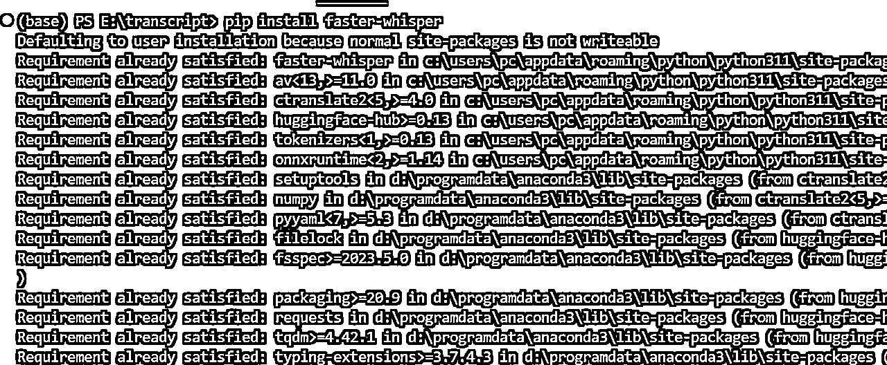
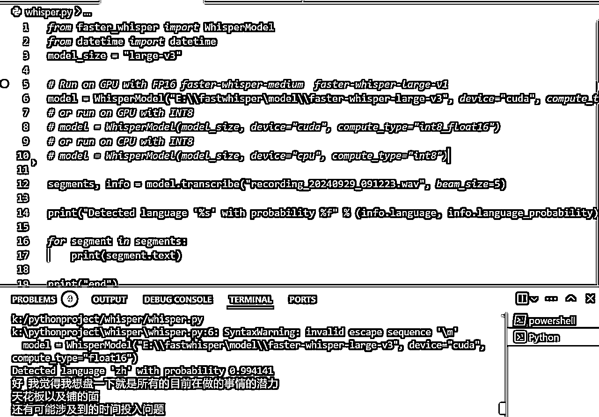
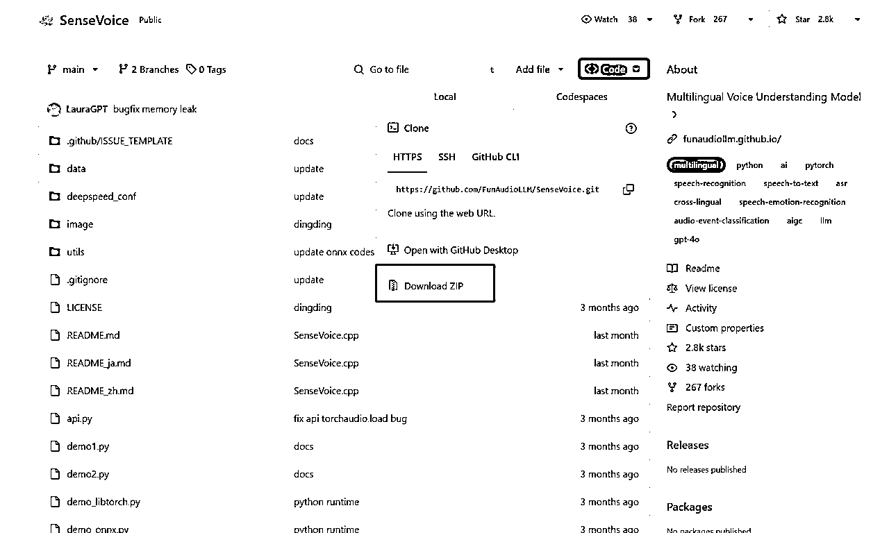
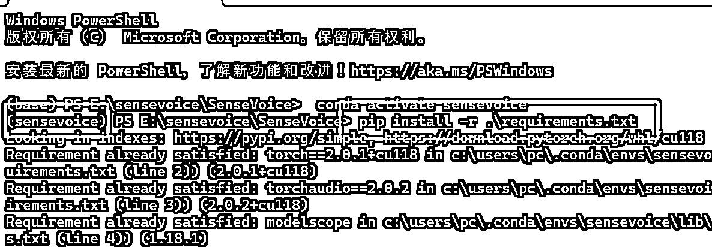
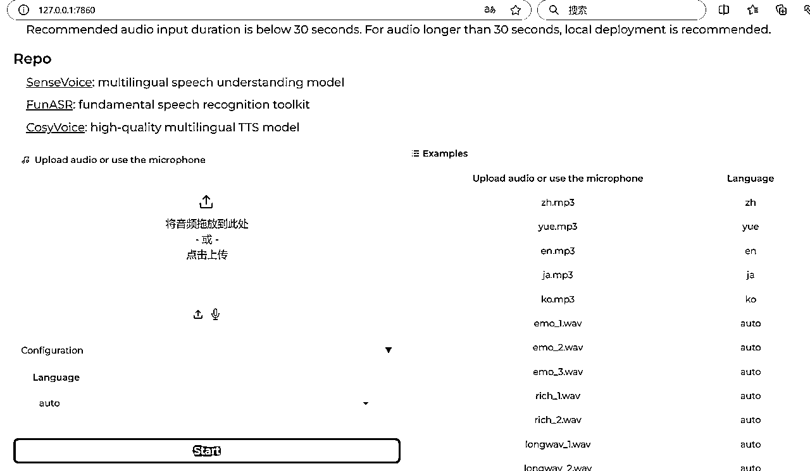
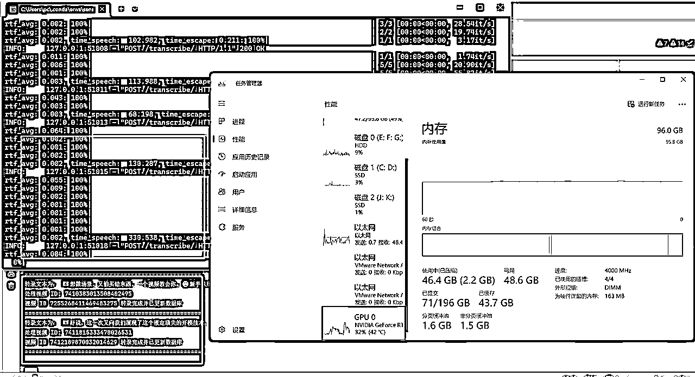
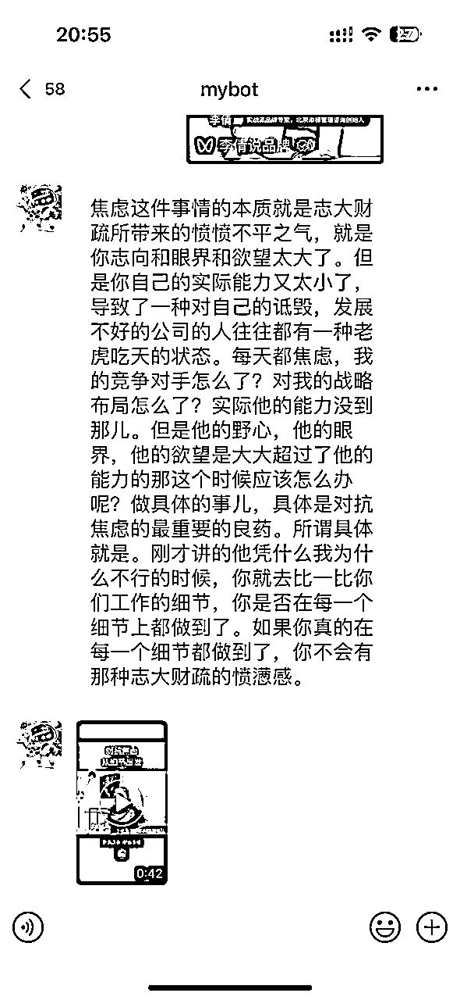
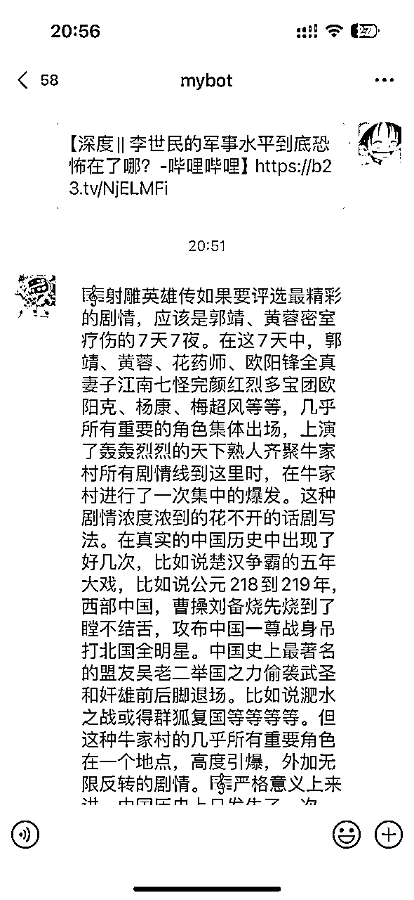

# 借助AI打造高效短视频工作流，从抖音/小红书等日均提取2万+爆款视频文案

> 来源：[https://ia0969wpr2.feishu.cn/docx/SPnXd5bDUoQKrBxLVFVcXYFCnrh](https://ia0969wpr2.feishu.cn/docx/SPnXd5bDUoQKrBxLVFVcXYFCnrh)

在短视频创作领域，紧跟热点、分析爆款文案至关重要。但是利用第三方如轻抖、通义等只能逐条提取视频文案，效率低下，难以应对批量采集批量提取的大规模数据要求。接下来我将分享我的工作流，如何通过本地部署 利用 whisper 或 sensevoice 实现日均提取抖音/小红书/B站视频号等视频文案 2 万+条。

### 整体工作流如下

1.  视频作品采集：使用RPA或者自己开发或者第三方工具等都可以，目的就是通过策略或者手动筛选获取到自己的对标视频

1.  视频作品无水印解析及下载: 本地或者服务器部署开源项目，解析目标平台如抖音、小红书、B站等的视频链接，获取无水印视频地址并下载。

1.  音频转换: 利用 ffmpeg 工具将下载的视频文件转换为音频文件，为后续语音识别做准备。

1.  语音识别: 使用 whisper 或 sensevoice 等语音识别引擎将音频文件转录为文本。其中，sensevoice 速度更快，而 whisper large 相比准确率更高，可根据实际需求选择。

1.  数据整理与AI重写等: 将识别出的文案信息根据实际需求使用AI进行清洗和格式化，导出为可供分析的数据格式

这套流程效率极高。以使用sensevoice为例，在我的 4070Ti super 显卡上，处理一条抖音小红书视频通常只需3-5秒，B站视频较长30秒内也可以转录完成。在开启并发的情况下，单日最多处理约2.6万条各类平台视频，总计超1000小时的数据。

### 硬件要求

为了保证文案提取的效率和速度，建议使用具备一定性能的硬件设备：

*   GPU: 建议选择 8G 以上显存的 GPU，充分发挥 whisper 和 sensevoice 的性能。本机实际转录的时候发现，16G 显存的 GPU 在处理大多数视频时，一般使用率在 40% 以上，8G 显存显然也能满足需求。

*   内存: 建议 32 GB 以上内存，保证程序运行流畅。

### 前置环境准备

1.  安装语音识别引擎:

首先我们要安装faster-whisper 或 sensevoice，选一即可。

*   faster-whisper: 可以通过 PyPI 快速安装，首次运行时会自动下载模型文件。推荐使用 large-v3 模型，该模型参数量大，准确率相对较高，但硬件要求高，转录速度相对较慢。

*   sensevoice: 阿里开源的，引擎转录速度极快，一分钟的音频1秒左右即可完成，但准确率略低于 whisper。

1.  部署平台视频解析工具 部署开源项目，通过作品链接获取作品详情，包括图片与无水印视频地址等。我是基于下面的项目进行魔改的，总体效果不错门槛也较低，省去了二次开发的投入：https://github.com/NanmiCoder/MediaCrawler

1.  安装 ffmpeg: 用于视频和音频格式转换

下面是详细的安装教程

## 语音识别引擎安装

## 安装faster-whisper

faster-whisper地址：https://github.com/SYSTRAN/faster-whisper

为了简单，我们直接从PyPI安装即可，就可以直接在脚本中使用了。我们执行：

```
pip install faster-whisper
```

如下即为安装完成



运行官方示例脚本，首次加载会下载对应模型，这里我自己使用的large-v3，这个模型参数大，准确率相对最高，但是转录速度也最慢，4分钟的视频要20S左右才能转录完成，相比之下sensevoice从来不会超过5S，当然whisper的准确率会比sensevoice高一些。

这里注意，如果你本地网络不好的话，可以自己先从hugging face上面下载模型，然后本地加载，

```
from faster_whisper import WhisperModel
model_size = "large-v3"
# Run on GPU with FP16
model = WhisperModel(model_size, device="cuda", compute_type="float16")
# or run on GPU with INT8
# model = WhisperModel(model_size, device="cuda", compute_type="int8_float16")
# or run on CPU with INT8
# model = WhisperModel(model_size, device="cpu", compute_type="int8")
segments, info = model.transcribe("audio.mp3", beam_size=5)
print("Detected language '%s' with probability %f" % (info.language, info.language_probability))
for segment in segments:
    print("[%.2fs -> %.2fs] %s" % (segment.start, segment.end, segment.text))
```

这时我们运行脚本，转录一条测试数据，发现已经转录成功了。



## Sense voice 安装

sensevoice 安装相比会比较麻烦一些，首先我们进入到项目地址 https://github.com/FunAudioLLM/SenseVoice

一、使用git克隆代码

git clone https://github.com/FunAudioLLM/SenseVoice.git

如果本机没有有git，那么直接download zip也是可以的



二、创建环境和安装三方库:

1.  安装Miniconda(如果安装过conda,可跳过)

下载地址: https://docs.anaconda.com/miniconda/

如果安装成功，输入conda --version，能返回conda版本号


2.创建虚拟环境、下载三方库:

```
conda create -n sensevoice python=3.8
conda activate sensevoice
```

在conda环境下执行以下命令安装第三方库

```
pip install -r requirements.txt
```



等待安装完成，我们就可以启动web ui了，启动完成后使用浏览器打开 http://127.0.0.1:7860/，这时候我们发现已经部署成功了



但是如果要嵌入到我们的工作流中，最好是API或者模块直接调用的方式，好在官方也提供了API启动的方式，我们可以设置GPU启动，为了测试我使用内存转录了一次，不知道是不是设置的原因，转录一次内存会占用至少40G，对于大部分人的电脑来说是很难达到这个配置要求的，所以这里暂时就不考虑了。

API启动方式：

```
export SENSEVOICE_DEVICE=cuda:0
fastapi run --port 50000
```

接下来我们的转录环境就准备好了，就可以做视频无水印下载这块了

## 无水印下载

这里我主要是使用的github 开源的第三方项目，根据自己的实际需求魔改和适配了下，因为涉及到爬虫部分就不详细展开了。大家可以参考下面的这个地址的源项目：https://github.com/NanmiCoder/MediaCrawler

## ffmpeg安装

ffmpeg的官方网站是：https://ffmpeg.org//download.html，我们进入网站后直接点击下载到本地，下载完成后直接进行解压，然后配置环境变量。

1.  打开“环境变量”窗口： 右键点击“此电脑”，选择“属性”，在弹出的系统属性窗口中点击“高级系统设置”，然后点击“环境变量”按钮。

1.  编辑系统变量 Path： 在“系统变量”区域找到名为“Path”的变量，选中后点击“编辑”按钮。

1.  添加 ffmpeg 路径： 在弹出的“编辑环境变量”窗口中，点击“新建”，并将 ffmpeg 的 bin 文件夹路径（例如：E:\ffmpeg-6.1.1-full_build\bin）粘贴进去。请确保将路径替换为您实际安装 ffmpeg 的路径。


配置完成环境变量后点击确定，进行ffmpeg安装成功验证。打开命令提示符窗口。输入命令“ffmpeg –version”。如果命令提示窗口返回FFmpeg的版本信息，那么就说明安装成功了。


## 工作流组装：实现端到端自动化

接下来就是批量解析了，我们把上一步采集到的链接放到脚本目录下，或者从自己的采集源中进行转录，比如我的数据都保存到我的数据表中作为素材库使用，这是根据自己的实际业务需求自定义逻辑即可，下面是我使用cursor写的一个脚本，首先一个后台线程批量进行视频下载，然后一个多线程前端转录，这样下载和转录相互分开，增加转录速度。


下面是5个线程批量转录的硬件占用情况，，GPU占用大概在30-60之间，总体转录效率很OK，图二是开启三个线程的情况，转录100个抖音红书和B站视频，大概花了6分多钟，这其中包括了几个3G的长达一小时的B站视频。




随后开启了五个线程进行转录，一千条左右的视频大概花费40分钟左右，GPU始终没有超过60%，大家可以双击看到下面的转录文本，sensevoice会识别情绪和音乐，使用emoji进行标识，转录速度和准确率相对是比较均衡的，后面可以使用AI再次对这些文案进行优化和重写。总体效果达到预期。


下面是完整的下载和转录脚本，所有代码几乎都是借助cursor一次生成，大家可以参考。8666端口是视频解析的服务，基于上面提到的github爬虫部署，8000是sensevocie端口，用于转录，我们也可以使用faster whisper替换sensevoice，脚本如下：

```
def whisper(file_path):
    # 在 GPU 上使用 FP16 运行 faster-whisper-large-v3 模型
    model = WhisperModel("E:\\fastwhisper\model\\faster-whisper-large-v3", device="cuda", compute_type="float16")
    segments, info = model.transcribe(file_path, beam_size=5)
    print("Detected language '%s' with probability %f" % (info.language, info.language_probability))
    texts = []
    for segment in segments:
        texts.append(segment.text)
        print(segment.text)
    full_transcript = '\n'.join(texts) 
    return full_transcript
```

下载脚本：

```
import sqlite3
from datetime import datetime
import requests
import os
from tqdm import tqdm
import subprocess
from datetime import datetime
from concurrent.futures import ThreadPoolExecutor, as_completed

def get_video_url(link):
    url = "http:/localhost:8666"
    response_content_body = requests.request("POST", url, data={'url': link})
    res_data = response_content_body.json()

    url = res_data['video_url']
    return url
import shutil
def convert_to_mp3(video_path, output_dir='downloads'):
    """
    使用 ffmpeg 将视频转换为 mp3

    :param video_path: 视频文件路径
    :param output_dir: 输出目录
    :return: mp3 文件路径
    """
    # 确保输出目录存在
    os.makedirs(output_dir, exist_ok=True)

    # 生成输出文件名
    video_filename = os.path.basename(video_path)
    mp3_filename = os.path.splitext(video_filename)[0] + '.mp3'
    mp3_path = os.path.join(output_dir, mp3_filename)

    # 检查 MP3 文件是否已存在
    if os.path.exists(mp3_path):
        print(f"MP3 文件已存在：{mp3_path}")
        return mp3_path

    ffmpeg_dir = r"E:\ffmpeg-6.1.1-full_build\bin"
    os.environ["PATH"] = ffmpeg_dir + os.pathsep + os.environ["PATH"]

    # 尝试找到 ffmpeg
    ffmpeg_path = shutil.which('ffmpeg')
    if ffmpeg_path is None:
        print("错误：无法在系统路径中找到 ffmpeg。")
        print("当前系统 PATH：", os.environ.get('PATH'))
        return None

    print(f"找到 ffmpeg 路径：{ffmpeg_path}")

    # 构建 ffmpeg 命令
    command = [
        ffmpeg_path,
        '-i', video_path,
        '-vn',  # 不包含视频
        '-acodec', 'libmp3lame',  # 使用 MP3 编码器
        '-q:a', '2',  # 音频质量，2 是较好的质量
        mp3_path
    ]

    try:
        # 执行 ffmpeg 命令
        print(f"执行命令：{' '.join(command)}")
        result = subprocess.run(command, check=True, stdout=subprocess.PIPE, stderr=subprocess.PIPE, text=True, encoding='utf-8', errors='replace')
        print(f"命令输出：\n{result.stdout}\n{result.stderr}")
        print(f"已成功将视频转换为 MP3：{mp3_path}")
        return mp3_path
    except subprocess.CalledProcessError as e:
        print(f"转换失败：{e}")
        print(f"错误输出：\n{e.stdout}\n{e.stderr}")
        return None
    except FileNotFoundError:
        print("错误：尽管在系统路径中找到了 ffmpeg，但无法执行。请检查文件权限。")
        return None
def download_video(video_info, output_dir='downloads'):
    """
    根据给定的URL下载视频并保存到指定路径,同时显示下载进度
    如果文件已存在，则直接返回文件路径

    :param video_info: 包含视频信息的字典
    :param output_dir: 保存视频的目录，默认为'downloads'
    :return: 保存的文件路径
    """
    url = video_info['url']
    title = video_info['title']

    # 创建安全的文件名，并限制长度
    safe_title = "".join([c for c in title if c.isalnum() or c in (' ', '-', '_')]).rstrip()
    safe_title = safe_title[:10]  # 限制标题长度为10个字符
    output_path = os.path.join(output_dir, f"{safe_title}.mp4")

    # 如果文件名仍然太长，使用哈希值作为文件名
    if len(output_path) > 255:
        import hashlib
        hash_object = hashlib.md5(title.encode())
        safe_title = hash_object.hexdigest()
        output_path = os.path.join(output_dir, f"{safe_title}.mp4")

    # 确保输出路径是绝对路径
    output_path = os.path.abspath(output_path)

    # 检查文件是否已存在
    if os.path.exists(output_path):
        print(f"文件 '{output_path}' 已存在，跳过下载。")
        return output_path
    headers = {
        'User-Agent': 'Mozilla/5.0 (Windows NT 10.0; Win64; x64) AppleWebKit/537.36 (KHTML, like Gecko) Chrome/91.0.4472.124 Safari/537.36',
    }

    response = requests.get(url, stream=True, headers=headers)
    response.raise_for_status()  # 如果请求不成功则抛出异常

    # 获取文件大小
    total_size = int(response.headers.get('content-length', 0))

    # 确保输出目录存在
    output_dir = os.path.dirname(output_path)
    if output_dir:
        os.makedirs(output_dir, exist_ok=True)

    # 使用tqdm创建进度条
    with open(output_path, 'wb') as file, tqdm(
        desc=os.path.basename(output_path),
        total=total_size,
        unit='iB',
        unit_scale=True,
        unit_divisor=1024,
    ) as progress_bar:
        for data in response.iter_content(chunk_size=1024):
            size = file.write(data)
            progress_bar.update(size)

    return output_path

# 新增函数:从数据库读取aweme_id和link
def get_video_links_from_db(db_path, limit=800):
    """
    从SQLite数据库中读取aweme_id和link

    :param db_path: 数据库文件路径
    :param limit: 限制读取的记录数,默认为10
    :return: 包含aweme_id和link的列表
    """
    conn = sqlite3.connect(db_path)
    cursor = conn.cursor()
    cursor.execute("SELECT aweme_id, link FROM videos WHERE video_path IS NULL LIMIT ?", (limit,))
    results = cursor.fetchall()
    conn.close()
    return results

# 新增函数:更新数据库中的视频和音频路径
def update_video_paths(db_path, aweme_id, video_path, mp3_path):
    """
    更新数据库中指定aweme_id的视频和音频路径

    :param db_path: 数据库文件路径
    :param aweme_id: 视频的aweme_id
    :param video_path: 下载的视频文件路径
    :param mp3_path: 生成的MP3文件路径
    """
    conn = sqlite3.connect(db_path)
    cursor = conn.cursor()
    cursor.execute("UPDATE videos SET video_path = ?, mp3_path = ? WHERE aweme_id = ?", 
                   (video_path, mp3_path, aweme_id))
    conn.commit()
    conn.close()
def process_video(db_path, aweme_id, link):
    try:
        link = link.replace('douyin.com', 'iesdouyin.com')
        print(f"处理链接: {link}")

        video_url = get_video_url(link)
        if video_url:
            downloaded_file = download_video(video_url)
            # 转换视频为 MP3
            mp3_file = convert_to_mp3(downloaded_file)
            if mp3_file:
                print(f"MP3 文件已生成: {mp3_file}")
                print("开始调用:", datetime.now().strftime("%Y-%m-%d %H:%M:%S"))
                # 更新数据库中的视频和音频路径
                update_video_paths(db_path, aweme_id, downloaded_file, mp3_file)
        else:
            print("无法获取视频信息")

        print("=" * 50)  # 分隔不同链接的处理结果
    except Exception as e:
        print(f"处理链接 {link} 时发生错误: {e}")

# 修改主程序
def main(max_workers=5):
    db_path = "douyin_data.db"
    video_links = get_video_links_from_db(db_path)

    with ThreadPoolExecutor(max_workers=max_workers) as executor:
        futures = [executor.submit(process_video, db_path, aweme_id, link) for aweme_id, link in video_links]

        for future in as_completed(futures):
            future.result()  # 这里可以处理每个任务的结果，如果需要的话

if __name__ == "__main__":
    main(max_workers=10)  # 设置10个并发线程
```

转录脚本：

```
import requests
import os
from tqdm import tqdm
from faster_whisper import WhisperModel
from datetime import datetime
import sqlite3
from concurrent.futures import ThreadPoolExecutor
import concurrent.futures
from datetime import datetime

def call_asr_api(file_path, language="auto"):
    # API端点
    url = "http://localhost:8000/transcribe/"
    # 准备文件
    with open(file_path, 'rb') as audio_file:
        files = {'audio_file': (os.path.basename(file_path), audio_file)}
        # 发送POST请求
        response = requests.post(url, files=files)
    # 检查响应
    if response.status_code == 200:
        return response.json()["transcription"]
    else:
        return f"错误: {response.status_code}, {response.text}"

def process_video(aweme_id, mp3_path):
    print(f"处理视频 ID: {aweme_id}")
    if os.path.exists(mp3_path):
        try:
            full_text = call_asr_api(mp3_path)
            print("转录文本为：", full_text)
            transcript_time = datetime.now().strftime("%Y-%m-%d %H:%M:%S")
            return aweme_id, full_text, transcript_time
        except Exception as e:
            print(f"处理视频 ID {aweme_id} 时出错: {str(e)}")
            return aweme_id, None, None
    else:
        print(f"MP3 文件不存在: {mp3_path}")
        return aweme_id, None, None

def process_videos_from_db(max_workers=5):
    db_path = 'douyin_data.db'
    conn = sqlite3.connect(db_path)
    cursor = conn.cursor()
    try:
        cursor.execute("SELECT aweme_id, mp3_path FROM videos WHERE (mp3_path is not null or mp3_path!='') and ( transcript IS NULL OR transcript = '')")
        videos = cursor.fetchall()

        with ThreadPoolExecutor(max_workers=max_workers) as executor:
            future_to_video = {executor.submit(process_video, aweme_id, mp3_path): (aweme_id, mp3_path) for aweme_id, mp3_path in videos}

            for future in concurrent.futures.as_completed(future_to_video):
                aweme_id, full_text, transcript_time = future.result()
                if full_text is not None:
                    cursor.execute("""
                        UPDATE videos 
                        SET transcript = ?, transcript_time = ? 
                        WHERE aweme_id = ?
                    """, (full_text, transcript_time, aweme_id))
                    conn.commit()
                    print(f"视频 ID {aweme_id} 转录完成并已更新数据库")
                print("=" * 50)

    finally:
        conn.close()
def main():
    max_workers = 5  # 设置并发线程数
    print("开始转录:", datetime.now().strftime("%Y-%m-%d %H:%M:%S"))
    process_videos_from_db(max_workers)
    print("结束转录:", datetime.now().strftime("%Y-%m-%d %H:%M:%S"))

if __name__ == "__main__":
    main()
```

## 包装接口，轻量级使用

批量转录虽然适合后台批处理作品，但操作流程上还可以进一步优化。未来计划开发更便捷的GUI集成界面，提升使用体验。

另外可能还有日常零散视频的轻量化处理需求，所以我想，干脆一不做二不休，直接在飞书和微信上做一个机器人方便自己随时使用，下面是我自己实现的效果，这里我们可以使用开源的wechatpy 或者基于hook协议去做，这块我就不展开了，github上面有许多基于wechatpy的项目，大家可以以此为关键词在github搜索一下魔改然后直接拿一个小号即可。







后续规划

1.  智能分析：集成AI，实现文案主题分类、文案二次创作优化和分发

1.  实时监控：开发实时监控系统，及时监控捕捉最新爆款文案

1.  包装GUI：更快速便捷地使用