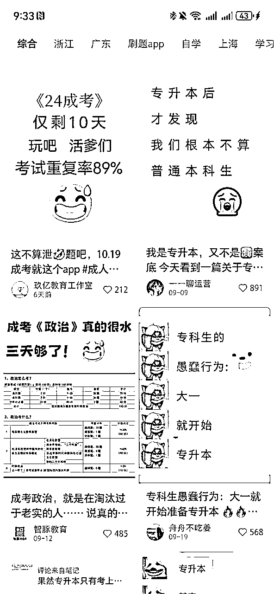
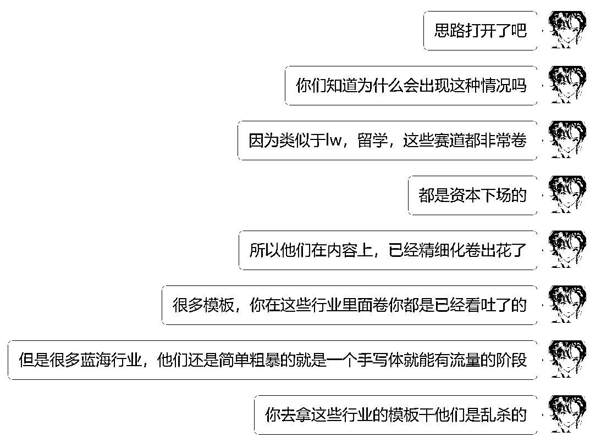

# 如何四小时吃透一个陌生行业

> 来源：[https://ywfmllgra2k.feishu.cn/docx/Q9JMdOh4xo9x6zxmlojcNQ1Qnab](https://ywfmllgra2k.feishu.cn/docx/Q9JMdOh4xo9x6zxmlojcNQ1Qnab)

本文作者：小鹅 ，转载发布请联系作者获取授权

极速省流版本部分【配合主题版】：

本文当中所有的工具网站：

巨量算数

费用：免费

https://trendinsight.oceanengine.com/

DSO100

费用：工作室版4999/年

https://dso100.com/

灰豚

费用：闲鱼可买日卡，周卡一般40-60左右

https://dy.huitun.com/app/#/

秘塔AI搜索

费用：免费

https://metaso.cn/

Kimi

费用：免费

Kimi.ai - 帮你看更大的世界 (moonshot.cn)

八月在杭州跟雪姨聊天的时候，雪姨问到我们一个问题：你们进生财的时候是小白吗

我的00后朋友们都说不是，她们进之前生意已经很有规模

我说，我是去年4月来的，真真纯小白，当时进来里面没一个字是我看得懂的

可能每个人都要经历一个看山不是山，看山还是山的阶段

刚开始想要自己做点小生意，感觉接触不到信息和人脉

加进来生财以后，发现巨量信息和纷繁芜杂的人铺天盖地的向你涌来，那个时候的感觉是欣喜若狂的

越看反而越来越觉得迷茫，能挣钱的项目这么多，到底什么是我能做的？

其实，在我基本面不足的时候，其实对项目的认识都是很浅显的，很多时候我以为这条路自己能走，最终数据证明了我是在自嗨

对内容的敏感度，对关键词的敏锐度，销售转化的能力，组织能力，搜商，工具提效，耐挫力……这些基本面都在沉浸式做某件事情的时候一遍遍被迫提高

同样的项目给不同的人做完全是天差地别的效果，基本面强的人做什么都能跑通，基本面弱的人再简单的小项目都搞不到第一块钱

所以这篇文章是一篇关于基本面的故事，给一些小伙伴做一些基础型的扫盲

我是一个比较喜欢琢磨和研究的人

从我自己出发，电商，博主，私域我都是做过的，我自己很清楚我最喜欢公域引流+私域IP的方式，这是我的舒适区

所以我在找的时候只找做引流的，凡是不符合这个逻辑的我都pass了

大家自己根据自己喜欢的逻辑筛选就好

# 一.前期判断调研部分【1.5h】

整体的思路一定是在一个足够广阔的大行业下找小切口的垂类细分服务，也就是巨头阴影下的小机会

这句话是今年暑假在广州曹大见面会上听到的，对我来说属于是吸烟刻肺了

## 1.市场广度和入场时机

市场广度我一般直接看巨量算数，然后看他的整个峰值和数据情况

是大众市场还是小众市场

【一般巨量能搜出来的，就已经是大众市场了】

是有明显的周期性需要还是长期被市场需要

【看数值波段和峰值】

比较经典的案例，拿我比较熟悉的教育类目来举例：

打开巨量算数，把时间拉长到一年的维度

长期被市场需要的，雅思

中间有一个非常异常的峰值，一般这种我们就可以直接忽略掉，因为一般出现这种莫名其妙的峰值是因为同名词撞了

这个就是比较经典的案例，雅思撞名了某个乒乓球组合所以在奥运会出现了异常值，强行拉高了整个大盘的关注度

雅思考试的特性是全年一直有，每个月四次，在申请季前夕需求量最大

强烈季节性的，四级

这个波峰就非常明显了，因为一年会有两次报名，两次考试时间

那我们怎么选择入场时机呢？

有点像买股票，低点入，高点收割一波走

也就是从平均线以下向高线爬升的这个节点收精准粉，然后在情绪最顶点做泛粉

因为情绪最顶点是考试刚结束的这个节点，虽然社会关注度高，流量大，但是其实这个时候你的群体是不需要你的服务的，关心这个词的大部分都是跟四级没什么关系的人

我们放到一起对比一下，就可以发现整个赛道的受众空间，四级是一个更大的赛道

但是广度可能大概率同时意味着大公司专业玩家更多，个体户没有入场机会

所以我们要做进一步的调研和分析，下面进入第二节，竞对水平篇

## 2.竞对水平

### 竞价

竞价是最直观最绝对性的展示

最好的办法是直接问做流量的朋友cpa【单粉价格】，就能对卷度有一个基本判断了

如果列表没有对应朋友的话，有两种办法自己查

一个是直接上小红书聚光号的后台看价格，自己充的话600一个号

另一个是使用DSO100搜索，选择到小红书，价格显示跟聚光后台是一样的

https://dso100.com/KeywordDouyin

【在这里表白一下微天使，感谢令狐总给的会员福利，太好用了】

非常明显，四级的均价跟雅思根本不在一个档位上，说明雅思是一个天神下凡大乱斗的场地，我们凡人很难跟人家大资金玩家硬碰硬

这里其实并不是劝退大家放弃，而是意味着机遇和挑战并存

比如同样的产品质量和服务水平+同样的内容能力，一个新手到四六级赛道去卷，能更容易拿到结果

如果你能够在卷王赛道挖掘出垂类的小细分，你能够靠内容能力在公域拿到雅思的量，能更容易变现高客单

都是根据自己自己手上有的底牌进行筛选的，不存在绝对的好坏之分

### 数量竞争激烈程度

这个其实就是看大盘或者看7天/30天内的笔记数量就好

灰豚就行，选灰豚主要是灰豚最便宜，别的数据分析平台也行

https://dy.huitun.com/app/#/

这个原则还是蛮好用的，因为当年做小红书电商的时候完全不怎么管也有出单的原因就是找了个小蓝海类目，当时是把所有类目的需求数量/笔记数量一个个扣着算出来选的赛道，相对来讲比例越健康对新人来说越有机会

### 在最新里是否有有效低粉爆款

一般受众宽广的赛道都会在最近3-4天都有低粉 素人 变现导向 爆款内容

这个办法只能排除你的赛道是不是太小众了

如果最近3-4天都没有一篇数据还凑活的笔记，要么说明你这个赛道蓝的爆炸，几乎还没有同行做，要么说明你这个赛道一发一个违规，同行隔两天就没了

### 赛道专业号含量

很简单，就是在一众蓝v里看有没有能跑通闭环的素人号，然后看这个素人号有没有参考价值【入局时间点/内容制作成本】

比如高中数学，一眼看过去几乎没有蓝v，大概率说明这个赛道资质卡的非常严，哪怕是投流也只能擦边投，反而对素人友好一点

【不过同时也可能意味着你这个赛道在整个平台都是被ban的，素人号能活一天是一天，看具体行业，belike保险，律师】

### 内容水平

同样是教育行业，下面是雅思和专升本的对比

专升本的全部是别的赛道已经看吐的了简单粗暴的老模板，大部分都是纯搬运＋简单去重，雅思已经开始做伪实拍和案例分析了

如果你发现一个赛道大家居然都在做半原创，没办法，那说明是被同行卷的受不了了

## 3.变现路径筛选

风向标里真的有很多很多非常牛逼的消息，还有各种生财的群讨论的机会有时候我看到了去做就能带一点小伙伴去跑一跑，都能挣点钱，但是大家在生财其实有一个共通的痛点：信息太多，太复杂，感觉能做的事太多反而无从下手

其实选产品的核心还是看你自己和产品的匹配度+变现路径适不适合你

一个事值不值得做核心还是看它的上升空间和变现路径

主要是看：

大家都在卖什么

是怎么卖的

前面说过了，我不喜欢接商单和电商，所以我只看能做私域的，下面是个直接在小红书找的一些案例

### ①大家都在卖什么

同样的目标群体，把所有拓展服务都扒出来，上游，下游，平行端的产品全部扒一遍

我比较喜欢的生意是覆盖一个人的生命成长周期的生意

举一个简单易懂的例子

坤大汀老师以前在某英语软件，那时我16岁，我在给他管的产品付费，现在在生财有术当coo，我20了，我还在给他管的产品付费

两个产品分别对应了一个人的不同需求，在未成年的时候有学科学习的需求，在成年以后有做副业的需求

如果说有一个很强的私域IP人设可以丝滑的串联这两者，就可以把一个流量的ltv（客户生命周期价值 ）拉到最高

上面这个案例，学科到副业本身是跨度比较大的，所以相应的转化难度也大很多，比较丝的上下游可能类似于：

一个大三的学生：

四六级辅导-毕业论文辅导①-简历-求职辅导

②-雅思学习-申请文书

主要要算清楚账，算清楚到底什么是引流品，利润品

初阶辅导/资料可能是一个低成本建立信任门槛的引子，这里真的要学习k12机构！！！

k12在这方面精细化的程度真的超乎大家所有人的想象

这个上下游具体挖的路径还是多刷生财找感觉，我这里列的品类都是很泛的品类，小而美的细分在生财里都能挖到，比如我刚刚随手打开看见的这个

口算练习题就是一个很好的细分的引流品，后续可以再找数学辅导/课程之类的做利润品

这里面牵扯的能做的产品真的很多，如果没有固定的后端的话直接在生财有术里#资源对接板块一个个找后端筛选，接受前期试错就好了，找后端的路上真的踩过很多坑…

尽量找交叉验证过的，有口皆碑的小伙伴，生人还是提高警惕度为妙

### ①是怎么卖的

重点：不要自己瞎想！！！要看有没有人在跟你用相同的方式变现

这个我觉得考试类的有点无聊，我就随便找了一个我不知道能不能变现的词去搜，mbti，然后首页就有很多的笔记【搜这个的初衷应该是在风向标刷中了什么，但找不到原帖了】

给他们全部归类一下

#### 1号选手：商单+蒲公英佣金

这里的小清单我之前没见过，于是发到航海家群里问了一下，纪钟老师给我科普了一下【ps：有问题有问的地方就很开心！所以珍惜每一次航海群和生财这个场域呀~】

小红书满1000粉后，可以在创作中心-直播选品-我的界面点击

小清单，开通小清单功能

粉丝在你这购买平台的商品，你就会获得2%-50%的佣金。这个和淘宝客、阿里妈妈的模式一样，凡是通过你的入口成交，你就有佣金。

不需要你囤货、发货等一系列复杂的操作

#### 2号选手：付费挂链接玩家

这种下方有直接的跳转链接的都是保护费交足了的玩家

#### 3号选手：导流公众号型

顺着加过去看了一眼，也是卖测试的，等于是2号选手（偷流量版）

#### 4号选手：为爱发电/玩梗型

没啥好说的…几乎占了这个词条的60%

综上所述，mbti这个词就很清晰了，关注度高，但是不变现，玩梗为爱发电的内容占比多，能做的变现模式也就是站内带货/卖测试结果，卖测试的都是机构号没有素人号，肉眼可见的客单价低，结论就是：属于离钱远的地方，并且这个路径不是我要的路径

# 二.产品熟悉部分【0.5h】

我自己个人做项目的体感的话，做域完全不懂产品只做流量是一件非常非常痛苦的事情

会出现2种情况：

1.因为你不懂产品，所以在找对标的时候出发点就是错的，很多时候A内容和B内容看起来一样，实际上完全是两个不同群体在关注

eg.我想要的群体：在校学汉语言文学的大学生

我做的内容：汉语言文学

但其实当你去搜汉语言文学这个词的时候，你发现内容非常纷繁芜杂，有分享大学日常vlog的，有填报志愿科普的，有出考研资料的，搜这个词的人并不是你的最精准的人群

但是当你搜索现代汉语这个词，情况完全不一样，因为现代汉语是汉语言文学的一门课，会搜这个词的人只有需要学这门课的人

2.因为你不懂产品，所以在转化过程中除非你已经有非常标化的SOP，否则客户流失率非常高，越是高客单越明显

## 案例1：具体产品-草蛇灰线

产品选定了以后我们就直接顺着草蛇灰线的找

比如今天在航海家群刷到的这个，代写回忆录

很显然，做这个获客在视频号和公众号是最丝滑的，于是我们去刷一下，一路顺着线索找过去

然后就发现，哦，回忆录是这样的呀，这个产品是能做的

他们的产品路径：

前端公众号视频号seo引流-产品1：免费体验课上企微+收集客资-产品2：转化高客单写回忆录的服务

这是一个理解成本比较低的产品的例子，我们找一些理解成本高的例子

## 案例2：复杂的服务型产品-AI积累宏观行业人士

比如留学，没留学过的人是很难理解这个复杂的申请和提交过程的

在我们连行业的基本概念都没有的时候，我们可以先借助AI建立一个基本的逻辑框架

打开秘塔AI搜索，搜索留学申请的时间节点，打开右边的思维导图

要注意，AI是有幻觉问题的，它给你总结的有可能是错误的，重点快速地总结收集信息，点击旁边的数字标注符号，它可以给你跳转到信息源头

信息源里面的信息自行阅读，一般正规网站，时效新的内容都是正确的

如果你在百度直接搜索的话，前排出现的全是乱七八糟的seo广告，根本找不到纯净的信息

从头到尾看下来，我就从纯小白积累了一个对留学行业的基本认识：

通用的服务有：文书（代写，优化）【时间根据对应国家学校倒推】

背景提升（科研，论文，实习…） 【5-8月】

语言成绩（托福，雅思，GRE，GMAT…）【几乎全年】

主要的切口和区分度在不同国家甚至于不同层次的学校，每个国家对应的各自淡旺季都是不同的

然后我们随机选择一个切口深入探寻，比如雅思考试，中间有很多东西都可以靠AI辅助理解

引流的钩子：

生僻的语境：

kimi【小程序搜索即可】

每个群体都会有自己语言体系和梗，这个时候AI就能很快的帮我们翻译出来

## 最终的产品选择

1.理清楚群体，理清楚变现路径，在一开始可以拿一张纸随意发散，接受所有思路的涌现，把你认为自己能做的全部mark down下来

2.最终通过筛选和排除，选择自己的当前最优解

【内容成本你能cover，账号成本你能cover，产品理解难度不算太大，有普通人能变现，在你的能力范围内努力就能挣到第1块钱】

# 三.转化路径部分【0.5h】

销售和转化这件事，在这个时期的调研我们只能学形式，比如同行第一句怎么跟你打招呼，后续怎么引导你表达诉求，怎么跟你推荐产品的

前期当你完全不会这个东西的时候，最笨的办法就是全部复制下来，慢就是快

真正的销转能力得最起码跟1k个真实客户聊过天才能培养出来

给大家一个小技巧，最好能养成一个习惯，平时买东西的时候，多想一下什么是促使你在这里下单买这个产品的理由

你为什么选择别人，别人就为什么选择你

哪怕是一模一样的话术库给不同的sales他们的业绩也是天差地别的

我每次买东西遇到好的话术都会记下来，我会记下来他们在成交我的过程中做了哪些点促使我本来没那么想买突然产生了欲望

# 四.内容引流部分【1.5h】

## 内容一级选题

吃透一个陌生行业就是大概先扫一眼他们大致的内容体系都是怎么构成的，用户都在关心什么话题

一个赛道大的选题其实就那么几个，随便分析几个同行的号就能看出来

我随便打开手机找了几个案例

设计考研：优秀学生案例showcase+专业报名问题+课程干货

香港优才：拿身份的好处+怎么拿身份

## 内容二级选题

还是打开我们的老朋友DSO100

看看用户到底都在关心什么

随便找一个，香港身份，看看左边的下拉词

以下是大部分搜索香港身份的用户关心的话题：

一.香港身份的好处

1.香港身份与孩子教育

2.香港身份与免签

3.香港身份与美国绿卡

二.怎么拿香港身份

1.香港保险申请条件

2.香港身份和内地身份冲突吗

3.孩子怎么拿香港身份

4.香港身份怎么续签

然后就非常简单，依然是顺着草蛇灰线挖掘

我们可以根据这些线索搜集到大量的内容，一个二级选题下有abcdefg等各种各样的文字信息，只要我们花时间把他们整合到一起

a和b凑到一起是一篇新内容，a换形式是一篇新内容，a换背景是一篇新内容……

只要你挖的足够多是不可能缺内容的

## 内容形式部分

形式这件事真的只能在某些卷王行业看到吐才有感觉…

有些行业已经卷到人均真人出镜IP，手绘漫画的程度了你拿什么跟他们玩

所以跨行业降维打击才是最舒服的

我自从带我们团队的小伙伴跑通了一些行业的小闭环，我带他们去看别的行业的内容都是思路打开的一个状态

至于怎么找到降维打击的点……

自己看！！！鹅已经写了6k字了，鹅的命也是命好吗！！！现在！立刻！马上！打开小红书！随便找个行业硬着头皮看四个小时！

# 五.说点没用的鸡汤…

上面大部分讲的都是工具，思路和技巧，我觉得都不难

关键大部分时候大部分人根本没卡在这些地方上，卡在了奇奇怪怪的心态上

belike：

## 1.自我设限

有时候我真的最害怕的一句话就是，我是小白，我不会，能做吗

亲爱的，谁没当过小白呀

我到现在都忘不了去年这个时候生财说要喊我直播…我真的直播前的一整周都没睡好，那是我的第一次直播，当时上体育课我一边蹲在球场边上一边emo一边焦虑，那几天我把往期所有直播都看了一遍，在b站看了20遍的沟通与表达课程，晚上做梦梦见我直播说错话被全网嘲然后惊醒

如果我没记错的话当时我每天都要给青柠说一遍我好紧张…

然后我舍友问我说我咋了，我说周三晚上有个直播，我没播过，压力很大，很害怕

她说，那就不播呗，要是我，我就放弃

我仔细想了想，对哦，为什么要硬着头皮上呢

其实是我觉得如果这一次害怕了，畏缩了，当我再去面临人生每一个类似岔路口时，我都会在逃避中错过下一站的自己

那天晚上播了什么我都忘了，反正数据我觉得挺好的，人均观看时长9min，还帮生财出了一单

在今年，我说要跟朋友直播，早上说开晚上就播了，朋友看着我熟练的拉预告准备问题准备灯牌，她说你直播老手啊，我说没有，这是第二次

有过一次，就会了嘛

就跟上面那个香港的身份选题拆解，我也是人生第一次在搜索框输入这个词

## 2.curiousity

初一那年，我在加拿大上了一阵子的暑校，当时那个老师一下课看到教室外面坐了两排的中国学生全在玩手机，忍不住发出一声惊叹：“guys，你们的curiosity去哪里了！！”

后来虽然我英语一直不咋好，但我永远的记住了这个词

他不理解为什么这群人坐了十五个小时的飞机舟车劳顿来到温哥华光看了n天的手机，对完全没见过的世界一点好奇心和求知欲都没有了

后来的后来，在生财认识了一大堆过很有成就的小伙伴，发现这群人的好奇心太tm强了

看到路边的摊子在脑子里算营收，看到路边的银行开始聊各自的投资，去skp买个东西开始研究代购的汇率差能挣多少

大部分时候这些研究好像没有什么用

但是其实你已经默默积攒了无数颗珍珠

珍珠会在某一天，因为某些神奇的机遇串成了项链

一切的一切，都可能只是起源于某一天，刷到了某个帖子，因为莫名其妙的curiosity去搜了一下……

## 3.知道知识在哪里，比知道知识是什么更重要

之前参加航海家超级链接者的分享的时候，hexin老师说这句话的时候我就挺触动的

大概是今天跟朋友们聊天又更进一步深刻了

哪怕是同一个城市经常吃饭的朋友，哪怕是在一起很多年的男女朋友，彼此之间关于某些方面都有着巨大的信息差

最爽的状态肯定是每件你不了解的事，你都能找到的对应的人去问

比如下港澳签，我会问深圳圈友

比如去日本玩，我可以问海外群群主国强

比如有AI相关的问题，我可以问刀姐

比如有框架设计上的问题，我可以问许老师

比如我不太擅长回消息和给情绪价值，我会问我关系建立突出的朋友虎牙

比如我有流量的困惑，我就问每个月投放百万的柠柠

这就是在生财最幸福最幸福的地方，我日常身边的人离这些东西太远，而生财里会这些的人才比比皆是

【西安编外员工今日营业结束】

多的就不说啦，我要去上课啦！

一起生财有术，有问题可以在评论区探讨喔！