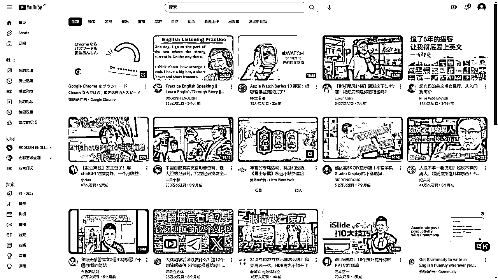
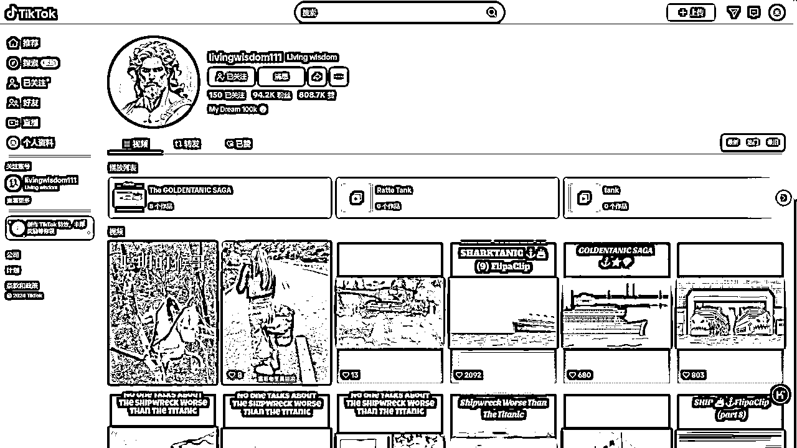
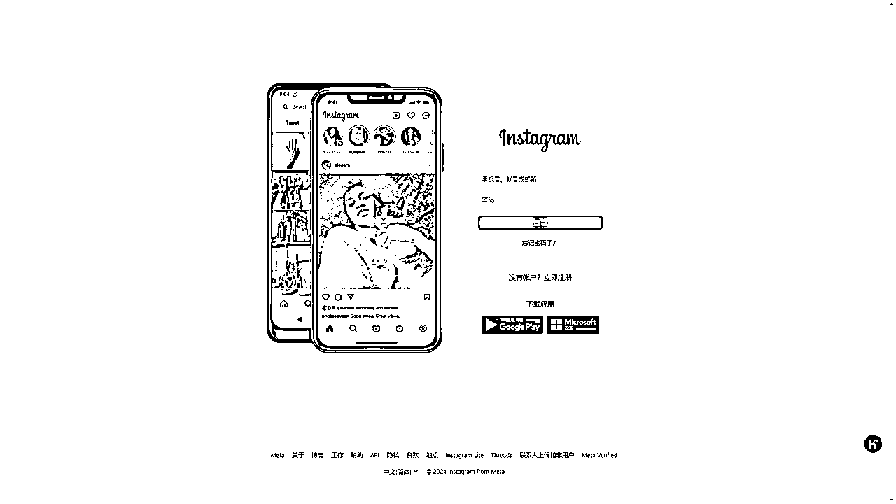
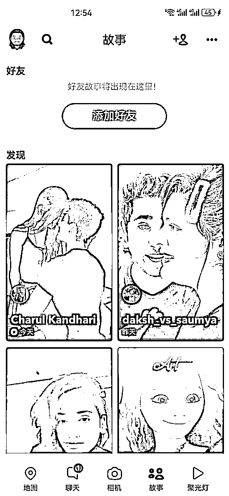
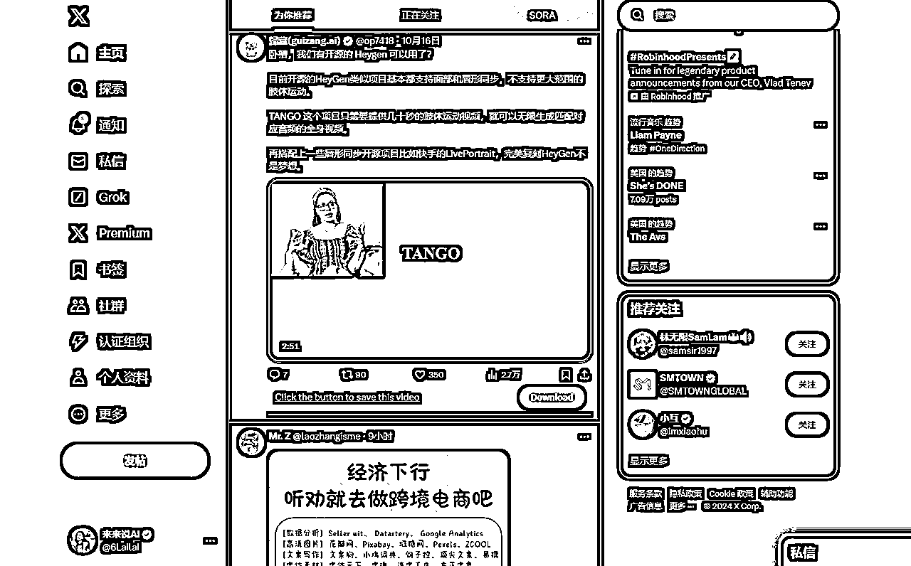
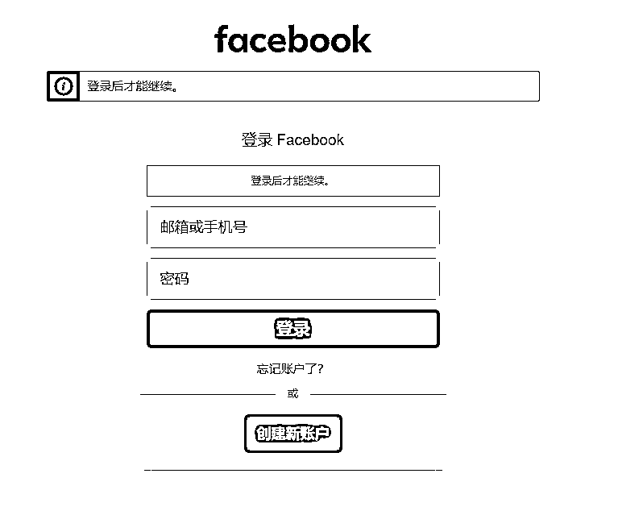
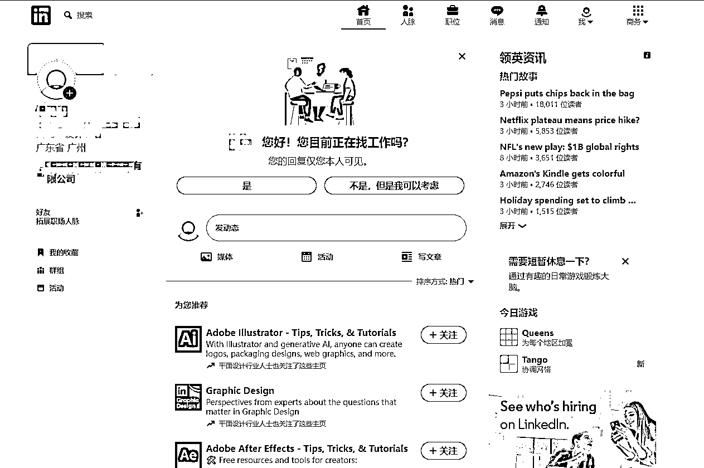

# 海外社交平台-项目研究工具手册【附工具名称，网址，优缺点，使用场景，收费情况】

> 来源：[https://duuxkmjwsy.feishu.cn/docx/QAiHd40viosLIyxplC2cKlMinBb](https://duuxkmjwsy.feishu.cn/docx/QAiHd40viosLIyxplC2cKlMinBb)

### 以下工具部分是重叠的

# 视频类：YouTube

# 视频类：TikTok

# 图片类：Instagram

# 图片类：Pinterest

# 聊天类：Snapchat

# 社交类：Twitter

# 社交类：Facebook

封号较为严重，要严格固定好地域。

# 职场类：LinkedIn

# 参考资料

使用常见：是基于一般市场接受度和用户反馈的主观评估，并不是基于具体的使用数据。

youtube工具来源：https://www.wpade.com/zh-CN/best-youtube-seo-tools.html

tiktok工具来源：https://www.cifnews.com/article/149693

介绍了8大类常用海外社交软件的营销类型：https://www.woshipm.com/marketing/5245364.html