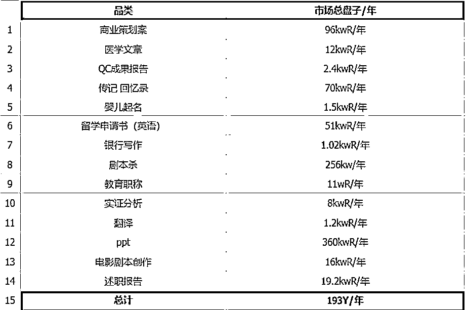

# 创业小白，如何去选择一个适合自己的项目，一点个人的经验分享

> 来源：[https://atbs4xk1uw.feishu.cn/docx/TXecdo4N3o0m0zxzPSJcwCIMnde](https://atbs4xk1uw.feishu.cn/docx/TXecdo4N3o0m0zxzPSJcwCIMnde)

大家好，我是Cheese海盐芝士，从去年7月份观望AI代写项目，到去年9月正式入局，到今天2024-09-27，我在项目一线实操正好一年了，创业真的挺苦逼的，但又极其性感，一旦上船，这辈子应该下不去了。这一年，很遇到了各种不在预期和计划内的问题，崩溃过，怀疑过世界运转规则，也被同路人温暖过，被正反馈治愈过，也帮助过很多人解答和解决了很多问题，当然还有很多解决不如跳过的伪命题，真的在路上，才能真真切切感受到这一程旅途的点点滴滴，日日夜夜

今天，想和大家分享一下，我有限的这唯一一次创业经历中，在有限的认知和记忆里，小白常问的“创业小白，如何去选择一个适合自己的项目，以及我能赚多少钱？”，关于这一点，一年前，选择创业项目时，我是如何思考的。条条大路通罗马，任何问题都没有标准答案和标准路径，希望能对刚入局和准备入局的宝子们，有一点点帮助~仅供参考~

话不多说，直奔主题

# 小白如何选择一个适合自己的副业or创业项目？

23年5月，海盐作为从来没创过业也没做过副业的小白，就在面临这个问题，初次想创业，一开始真的毫无头绪。这时，【先上路，比先思考清楚更有效】

# 对我自身而言，进行分析

我是大数据技术出身的，一直在做toB业务。工作和个人成长需要，也一直趴在蜘蛛网上，看国外各种开源和企业级技术，工作中也在关注和使用各种算法模型，一个关键的节点是，22年11月份就在接触和使用ChatGPT了，工作中代码开发、计算机底层原理、操作系统、网络等知识学习，GPT都帮了我大忙。

曾经写一个模块，需要3天时间，现在用GPT，我20分钟连测试都搞定了；曾经，写解决方案，专业术语介绍和应用场景，我需要搜索、整合、处理很久，现在用GPT，从大纲到内容，结合已有的公司资料进行输出，分分钟搞定；

写技术架构和详设文档，初版的起草和吹牛B对我来说是最慢的，GPT可以快速帮我写初稿，我来审核和二次优化，再加上公司的测试数据，修改细节，只能说一句，丝滑....

特别是在客户的生产环境中，奇奇怪怪的bug太多了，同样的机器软硬件配置，都会遇到不同的问题，小小的一个从来没注意过的OS初始参数不同，就可以让集群中的一台小弟跑两天就干宕机了...而生产问题，经常是那种问了各种P8、P9大家都没见过的，怎么办？查找蛛丝马迹，层层抽丝剥茧，找线索，死磕！！！

我计算机基础很不好，生产问题，大多数都是上层业务代码没问题，是底层框架源码没做OS参数兼容，导致的，就需要掌握大量的计算机原理、操作系统、网络等的知识，包括我一个搞java、python、scala的，需要去看和分析框架的c语言源码这里的功能设计，去从设计角度找问题，才能找到问题关键。

从前，我真的是，遇到底层原理问题，要去翻好多本4-5cm厚的计算机原理书籍，有了GPT，只需要我稍微懂一点思路，在他可能出错，或逻辑不通的时候，引导他一下正确方向，他就真的可以帮我解答很多原理问题，极其高效......我经常用1天时间，搞定很多天的工作量，每天在公司研究自己感兴趣的技术，到晚上12点、1点、2点、3点，当时就一个念头，要ALL IN AI。

当时，我能想到的是，【要尽量选择自身有经验和时间积累的事情去结合着做，才可能有壁垒可言】

那无论是生财中看到的流量、供应链、虚拟产品、营销，各个环节，我好像都没什么擅长的。另一个关键节点是，我发现了23年5月的ChatGPT航海，申请做了志愿者，看了大量信息，发现，AI好像可以直接变现，有卖提示词的、有用AI做公众号的，有用AI做小红书的，有做AI海外工具的。而AI的使用，正好我擅长。OK，或许可以用AI变现了？

# 又卡住了....

关注和分析了大量其他圈友用AI在干的事情，和航海好事，我发现，用AI做公众号变现的圈友，他原本就在做公众号爆文项目了，我只会AI的使用，并不懂AI爆文的具体业务，那我完全不知道用AI写一个10w+的爆文，这个关键点在哪里，那么多的AI爆文的赛道，有什么异同，哪一个适合我？这就不仅仅是需要研究AI玩法了，而需要深入研究公众号爆文这条业务线了，粗略了研究和观望了一圈，我发现主流的玩法，是1.要有网感，能找到爆款话题，总结出爆款文案常用的几个结构 2.日常就要大量阅读10w+爆文，拆解并存如入自己的素材库，方便后续排列组合，拼装 3.要能搞到几十个公众号账号，后续需要矩阵放大，赛马机制跑流量 用数量战胜流量的不确定性 4.要能搞一搞RPA，能自动化提效，手搓和发布，后期的几十个账号，可能直接整个人就被耗死了

# 结合海盐自身，分析项目与自身匹配度

我适合原创、输出个人真实的思考，如果每天看一些实际上对人类进步没什么价值的“爆文、爽文、鸡汤文”，甚至对人类进步有价值得“健康赛道、jun事赛道”，我也都觉得，不是我活着得人生意义，不喜欢，也大概率做不到，每天看这些内容，会很难受。RPA也有学习成本，可能不如写代码调用api来的快，但又需要我自己去踩坑，测试，圈友现成的经验，又不能用了，链路太长了，到变现说不定什么时候了，不适合我

做AI领域的小红书博主？拆解了这个赛道的关键点应该是：1.GPT能提效小红书文案（这个我行） 2.找到一个方向的内容，持续输出（AI的使用分享？AI工具分享？AI最新资讯分享？这个我也行）3.确认变现方式（广告?至少千粉以上，而且好像前期小博主大多数赚的不太多，那我需要正反馈才能坚持下去，这不太行。卖货？实物供应链，比如AI绘画定制白T恤？我没有一点资源，需要去1688、拼多多找供应链渠道，供应链坑太多了，我流量如果做起来了，到时候由于供应链不靠谱，偷工减料或供应不上，电商经常发生的70%退货率，那我白玩了，流量白做了。虚拟产品？这个行！AI写作教程我可以出，可以卖！啊....那还得先花个月八的去写教程，做海报，包装，找朋友学习下，测试等等，不够直接。）而且，我一个流量小白，这小红书账号啥时候能做起来，真不知道....链路太长了，不适合我。因为海盐是一个单线程动物，没办法一般上班，一边干副业，慢慢跑，看见稳定变现了，再切掉主业，就蛮需要短期先见到正反馈的，哪怕100块钱，来支撑自己继续走下去的希望。海盐干一个事情，只能ALL IN...睡觉都会想，如果做小红书AI博主了，一定要辞职，全身心投入，开发课程，做IP流量，就干不了主业了。对于海盐来说，还没看到可预期到的变现具体路径的项目，还不足够吸引我放弃主业。

啊，想创业好难啊，需要各种各样的资源和技能，拆解了关键路径的关键点后，才发现，一个技能，并不能创业或变现，而且一个项目所需要的这些必须的关键技能点，都测试和跑通了，连在一起，才具备真正实现一个小项目最小的0-1闭环的前提。注意，这仅仅是前提。

# 接下来，一个关键的节点

是，7月份发现了一个生财圈友，在做AI代写，他直接在咸鱼上（流量端口），卖AI写的稿件赚钱，不需要流量端口去打粉引流和做IP，链路那么长，来的人还可能很多是白嫖资料的，而不是直接购买付费的。而直接卖稿件，这个很适合初次创业的海盐，应该是链路最短可能拿到正反馈的方式了。

一直观察他到8月份，包括也去他的免费测试的小训练营里，当志愿者，去旁观他们怎么玩的，能玩到什么程度。大概数据是，他自己（AI能力极其一般，甚至可以用他自己的话说，上学的时候一直是个差等生）和几个人（之前也有所了解，观察后也觉得不是大佬级别，都是非常普通的普通人），都能快速跑出月入过万的成绩，【一个项目，占了AI风口，符合我ALL IN AI 的想法，普通的再普通不过的普通人下场可以直接月入过万，这是一个蓝海早期的项目，是个很不错的入局机会】，有的玩

但是，我是一个要干，就要把一个项目，ALL IN，干成主业的人，很难三心二意。他会不会是个2、3年的短平快的项目呢？干一锤子，没了？快，先去粗略调研一下市场空间，和同行的情况，用体感感受一下。

# 市场份额有多大

从以下3份数据出发，保守预估，文字内容创作领域的年市场份额在千亿元以上

下图1：15种写作题材在淘宝平台的的年实际交易数据（去掉了虚假和无效数据），统计结果为193亿元；

这193亿中不包括其它写作题材在淘宝的市场份额，不包括线上的其它媒体/电商渠道的市场份额，也不包括线下渠道的市场份额，且不包括海外市场份额

下图2：国家统计局数据，2022年内容创作生产行业的营业收入为33193亿元

下图3：猪八戒网数据，2024年，单单商业策划全案几家店铺，线上销售额半年6kw+，年1.2亿+

图1：

图2：

图3：

稿件类型已发展出成千上万种，已确定的订单获取渠道有十几种，从淘宝平台入手，粗略调研了15种AI写作题材，市场份额达193Y（亿）；猪八戒网上，单做品牌策划文案的几家写作同行，年营业额就在1.2亿+；再加上其他新媒体、电商平台流量端口、实体门店客资、老客户渠道等；以及更多题材的市场份额；我判断，AI写作是至少百亿甚至千亿的市场。

又去和几个身边传统的同行聊了一下，有干7年的，有在打印社干了20多年的（常年顺带代写），还有传统的文案、解决方案、设计公司，其中一个朋友，专门给奔驰宝马和周杰伦婚礼做高端解决方案、宣发的，其实都是“代写”，再追溯一下，代写行业已存在了一千年。我国古代，代写服务尤为盛行，文人墨客常为权贵或皇室成员提供代写服务，有些皇帝的圣旨也是由大臣代写。在宋代，就有专门从事为人代写书信、诉状的专职人员，这一行当延续了一千多年。古代的讼师也有代写状子的服务，这是他们合法地对案件施加影响的唯一方式。代写书信也是一个古老而又现代的行业，古代不会写字的人需要写家书时，就会求助代写信的写字先生。这是一个传统老项目，只是被圈友，用AI提效了。AI风口赋能传统老项目，市场空间也大，这项目应该可以干十年了。

# 有的搞

可是，海盐没创过业，是流量小白，怎么获客呢？自己去跑闲鱼，可能会踩坑，直接去找这个圈友，说明诉求，买他的闲鱼经验，他刚开始做不久，可能经验并不sop和成熟，但是对于学习能力很OK的海盐来说，少踩点坑都足够了。OK，流量经验搞到了，AI写作我大概率OK。销转能力在toB搞定客户几十个客户的验证下，也应该比较OK。0-1闭环的前提条件，码足了

大方向定了，关键点几乎不卡，剩下的就是实操过程中可能的小问题了。那接下来，就是，瞄准方向目标，执行力、自驱力、ALL IN，死磕

# 对于刚想创业或副业变现的小白，新人的一点建议（对方法论的套用）

当你看好一个项目，或者仅仅是对这个项目好奇，感兴趣，首先要做的是，去拆解你看见的真实案例，越多越好。

比如，上方说的小红书IP，如果你原本主业就是运营，或者天生网感很好，你拆解小红书IP变现项目的关键点后，结合自身优势去分析，你非常适合，多个真实案例的关键点共性，你都具备，那这个项目就很适合你来选择了。

再比如说，很多人经常会问我的一个问题“一个普通人做写手一个月大概能赚多少钱？需要投入多少时间？”

还是我说的，大家去拆解，比如说你看到咱们本次的AI写作航海这个好事上，对吧？去爆出来的这些变现的效果，你可以看到一个低的多少、中的多少、高的多少，你首先有一个大体的体感，其次是有一些圈友，他会在航海日志里面就分享，包括我们有一些精华帖，或者说是圈友发的帖子也会分享他的一个变现路径，那你去拆解他的路径，比如说你看他一天大概花了 3 个小时，还是 8 个小时，还是 10 个小时，他多久做到的？你看他大概是一个什么学历水平？那我一直说的学历水平代表的是一个学习力，也就是你学东西慢还是学东西快？你大概地和他对比一下，或者你有自我的认知也可以，对吧？我就是学习能力很强，那这一点就 OK 的。

另外一个就是执行力，你每天在这想，你能想出 100 个问题，你真的下场实战把手弄脏，你可能只碰到一个问题，然后有可能这一个问题还是你可以快速解决掉的。那这个问题解决不掉，还是要靠你的执行力去搜索对标，看别人怎么解决的。还可以去找办法去向其他人提问，去向圈友提问，对吧？

那你还是要把这个路径都拆解掉，看你和这个被分享出来的这个案例你们相差在哪？这个细粒度的拆解每一个关键点相差在哪儿，你就会知道你和对方的差距都在哪，大概可以赚多少钱了

没人能准确回答你是否适合一个项目，和你能在一个项目赚到多少钱。

但是，这是我个人的思考过程，结合了我项目的关键点的拆解，结合了对自己的认知和了解的判断分析。这个方法论，对案例和自我拆解的经验，也可以套用在你的身上，希望能够有所帮助~~

最后，一句海盐一直奉为至宝的一句话，送给大家：【实干兴邦，生财有术，勇敢者先享受世界】