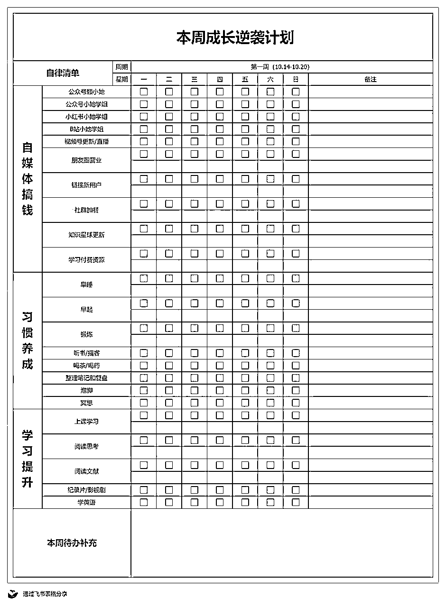

# 效率提升篇｜如何可视化一周的任务并效率翻倍（附带周计划表）

> 来源：[https://z182k46i27c.feishu.cn/docx/AgGWdW8uioQ1Kwxj0micJfM7ns5](https://z182k46i27c.feishu.cn/docx/AgGWdW8uioQ1Kwxj0micJfM7ns5)

新的一周，来给大家做本周很重要的一次分享，有帮助的话一周都会过得很充实～

今天分享的内容是：《效率提升篇｜如何可视化一周的任务并效率翻倍（附带周计划表）》

新的一周开始了，不知道大家这周的计划有没有做好？是否对这周要完成的工作做到心里有数？这周主要的生活主题是什么？大家可以顺便思考一下这些问题。

我试过很多种时间计划和管理的方法，最终得出的结果是：按照每周作为周期来划分，是最适合我的。

一个月的时间比较长，不利于随时做统计和复盘；而每一天细致规划又不够灵活。于是我按照每月自律打卡表的思路，以自己的生活习惯和事项为主，搭建了一份自己的每周计划表。

大家也可以按照类似的方法去搭建和填写。这里把我的表格发给大家作为参照，因为每个人设置的任务不一样，链接我就先不放上来了～

# 一、表格板块划分

按照自己的习惯，把任务作为总体的区分，我目前主要围绕三个关键词展开【自媒体】【学习】和【生活】。

这也比较符合我现在所处的身份，是自媒体博主的同时，也是一个在校的研究生，这意味着，我不仅有自己的学业，也要努力吃上自媒体这碗饭。

关于生活部分是一些能够让我们生活有幸福感的一些小习惯，这些习惯不会耽误我们每天太多的时间，也不会作为特别核心的事项和任务，但是长期坚持下去，就能让我们变得更优秀更开心。

大家首先先去思考自己人生中比较核心的关键词，围绕着这些关键词去展开下面的子任务，这样做的好处是不容易跑偏，也不容易盲目从众。

我们所设立的每一个任务，都是围绕自己的主题词展开的，都是自己最迫切的最核心的成长路径。

接着表格上需要呈现的是每天按部就班需要完成的工作，也就是我们需要留专门的时间去处理，就可以设置本周你最重要的几件事。这也是我觉得按照周去打卡的一个好处，可以比较灵活的调整自己的任务。

这样大家就可以量化自己一周完成情况，表格搭建的目的主要是为了可视化自己一周的努力：看见自己在哪些事项上有认真投入，而哪些重要的事情被自己一直忽略，才能够在下一个周期有所改进。

# 二、临时任务补充

可以看到表格上面除了一些按部就班的每日打卡事项，我还单独空出了一个本周待办清单，因为每周肯定会有一些临时的工作和比较重要的事情，表格就比较方便进行补充。

比如说现在开始读研究生之后，某一周可能会突然有一个研究课题，或者有一个PPT需要交上去，那我就可以把他很机动的放在本周事项里，然后围绕这个事情去安排时间，最终一定确保最重要的事情能够完成。

像很多的习惯，比如说泡脚啊冥想啊这些，就属于是一些改善我们生活的小方法，但是并不一定要每天都坚持做，一周完成三四次就算达标。

大家不要一上来就为自己设立过于严苛的标准，这样很容易因为某一天某件事情没有完成，就自我批评。

# 三、一周结束复盘

用这表格不光是记录，一周结束之后才是这张表格最大派上用场的时候。我们可以对本周的任务完成情况进行一个整体的复盘和调整。

比如说一周到底写了几篇公众号文章，发了几条朋友圈，发了几条短视频，这些都会有一个具体的量化。

大家也可以看到有一些我除了空着打对号的格子，还在下面有一个单独的空格：这个额外的空格就是为了补充具体的数目。

一周结束之后，大家可以按照这张表格去思考以下几点：

•表格上重要的任务，你有没有完成？

•一周花在哪些事项上的时间最多？

•有哪些任务很耗费时间和精力，需要减少或者删去？

这样我们的第二周可以有一个更新版本的表格。可以看到这一周我的事项列了比较多，因为第一周主要用来试错，我也需要一定的时间周期去看一下这些任务具体的完成情况。

最后跟大家分享我这一周比较重要的几件事：

❶学习（专业课以及自媒体课程）

这一周我差不多每天会留两个小时左右的时间来进行一个专注学习，学习的内容除了我自己专业课的东西，更重要的是我手上的一些付费资源和课程。这些的学习进度和一些干货分享，我后面也会给大家安排。

不光是输入，有具体的产出同样很重要，所以不管学习哪方面的东西，我基本都会做一个产出。

❷拍视频（小红书 B站 视频号 抖音）

拍视频这件事情我没有太多的宣传过，差不多最近这段时间拍摄的会比较多一些，会在以上的四个平台同步，这样也不会浪费拍摄的视频，能够最大限度的曝光。

整体我还是依赖视频内容输出的方式去进行客户引流。因为现在对于引流的操作已经越来越严格了，在视频口播的过程中说一些引流的字眼是我目前觉得比较安全的一个方式，所以最近也在尝试，效果还不错。

【视频更新】

B站 1.2万粉丝

视频号 近1000粉丝

小红书 已有2个百赞小爆款

抖音主要是随缘同步，这个平台不适合发过长的视频。

❸课程交付和打磨（小红书课程和私教）

然后这周会花一点时间，给自己下一期的小红书课程宣发做一些准备，也会多在我们的社群分享一些小红书的入门干货。大家可以蹲一下后面更新～

其次的一些固定动作基本已经形成肌肉记忆，比如说发朋友圈，还有社群分享，基本上就是有灵感，拿起手机就能够完成。这已经不需要占据自己太多的时间，各种零碎时间就可以完成一些工作。

最后想和大家说的是：无论你想变成什么样的人，都不能靠幻想和羡慕别人，也不能沉浸在短视频里。任何美好的愿望都需要自己脚踏实地的行动去完成。

所以希望大家好好思考一下自己想成为什么样的人，然后也朝着目标一点一点的去靠近。