# 深度挖掘推特AI前沿资讯和工具分享：从采集监控到可视化

> 来源：[https://ia0969wpr2.feishu.cn/docx/UCQMd2zt0oZIJuxiPhec5ugAnsh](https://ia0969wpr2.feishu.cn/docx/UCQMd2zt0oZIJuxiPhec5ugAnsh)

上周亦仁提出了第一个超级标，那就是做AI自媒体相关。那么问题来了，我们如何才能找到 AI 领域最新、最前沿的信息源，作为我们的素材呢？

推特作为目前全球最活跃的信息平台之一，汇聚了大量来自技术大佬、AI公司官方账号一手资讯。我们可以利用自动化流程实时监控这些 AI领域的KOL 和官方账号，还有一些国内有名的的归藏大佬、小互等优质的内容生产者，实时追踪他们的推文内容，直接锁定一手信息源，在此基础上再结合 AI 自动摘要和推送功能，这样我们是不是就可以有源源不断的AI相关的素材了吗？

根据实际需求，我使用cursor开发了一个小工具，可以采集推特list时间线的推文，我们可以获取到目前比较火的推特AI list，也可以把自己想关注的用户放到新建的list中，方便集中监控采集，采集完成后使用AI做总结摘要和选题分析参考、作为素材生成多媒体等。

最后让cursor糊了个界面，pyside糊了一个可视化界面，并且打成了exe 包 可以直接解压使用，我把工具链接放到了后面，有需要的也可以直接下载解压使用就可以了。当然目前还是第一版，但是基本的功能都有了，有bug或者需要优化的地方在星球评论区共同讨论即可。

工具界面如下，输入推特list链接和cookie，设置采集的页码数，勾选是否AI摘要，如果需要的话填写deepseek key，这样就可以采集相关的推文了，为了更直观地阅读和挑选素材，我还用Claude 设计了一个页面，也一并打包到了文件中，所有数据都存储在本地，完全打造一个私有的AI咨询素材库。

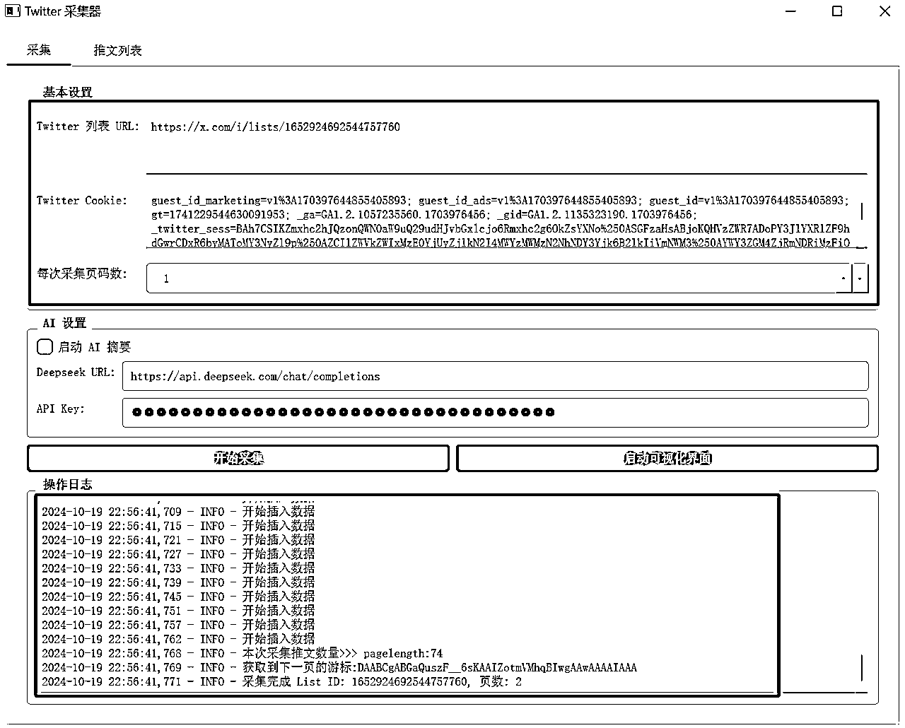

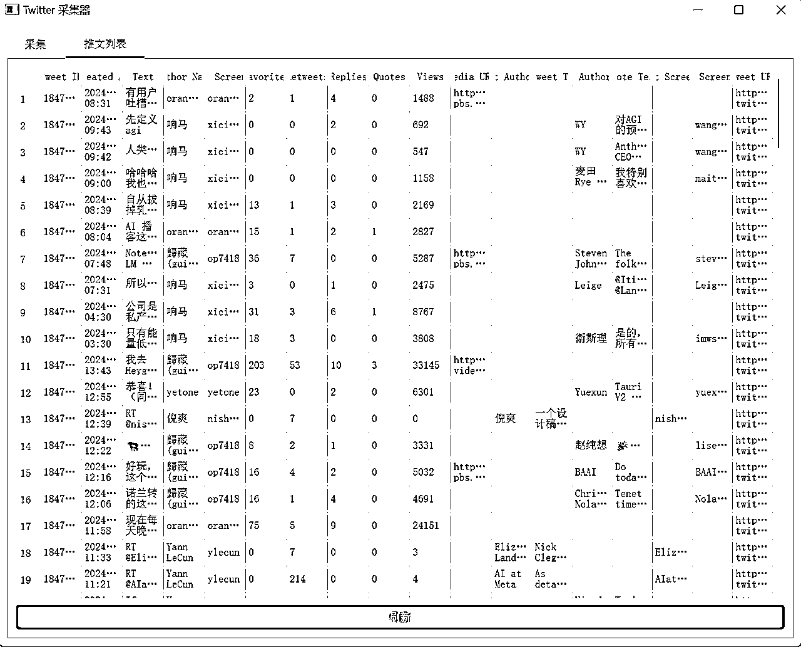

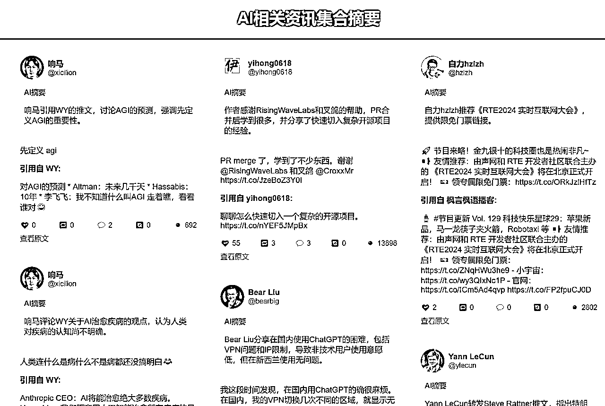

整个工具的开发借助使用cursor+gemini 完成，所以还简单记录了cursor提示词和生成的代码等，也一并分享给大家，希望对大家有启发。

下面是实现思路复盘

1.  第一步肯定是推特list和账号最新推文监控，采集推文的方法有很多，这里简单介绍两种，一种是使用影刀RPA，使用影刀也有多种实现方式，因为推特前端页面样式是动态变化的，所以我们没办法使用样式选择器，这时候就只能自己手写xpath或者通配符匹配，总体而言效率比较低，当然，使用影刀也有快速的办法，就是直接请求拦截，影刀默认也是支持的，拦截之后我们可以针对这部分数据进行解析，我快速实现了下，使用影刀大概每分钟可以采集60-100条左右，轻度使用是足够的，但是总体而言影刀的效率还是比较低的，只有API方式采集的1/10左右，还有就是影刀实现侵入性比较强，因为他会接管鼠标键盘，影响我们的其他操作，如果是临时性采集可以使用这种方案，如果是实时监控或者重度采集，就只能使用API了

1.  定时执行和推送：解决采集问题后，我们可以定时如每分钟或每小时运行一次采集最新推文，同时更新推文的点赞评转阅读量等数据，方便直观对比热度。同时对采集到的推文进行AI摘要和推送。

1.  数据可视化，既然采集完成只在数据库，阅读体验肯定很差，所以我们可以让cursor写一个简单的静态页面集成到工具中，帮助我们查看采集到的推文。

接下来介绍下推特API获取数据，这里也有多种方式，第一是使用企业版API，马斯克买下推特后，关闭了API的免费使用权限，现在企业版价格很贵能采集的数据也很少，性价比很低，对于我们来说没必要。那我们就只能自己借助AI逆向下推特API，然后花几毛钱买个推特cookie白号，这种方式几乎可以实现无限采集和监控，而且推特 API 相对稳定，无需频繁维护，可以长期使用。相比之下，使用影刀等其他方案，虽然入门简单，但在效率和成本方面不具有优势。

下面就介绍下如何使用web端API获取数据

生财之前的AI编程课中也有类似的爬虫模块，航海手册中有很多介绍，我们在这里就不赘述了，以list接口为例，我们打开需要监控的List，F12打开控制台，在页面上找一段文字复制一下，比如这里我找的是“Open science is”，控制台调起Ctrl+F，输入这段文字，这时候我们就可以找到返回前端推文数据的接口了，那就是：ListLatestTweetsTimeline

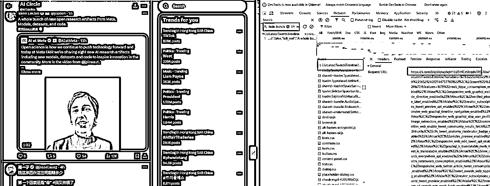

定位到接口之后就是如何通过该接口去调用数据了，我们打开github上开源的推特api document，地址是：https://github.com/fa0311/TwitterInternalAPIDocument/blob/7d63d8905f4ea9225af44381beebeb078cd6e1fe/docs/json/API.json

全局搜下list API的接口参数：

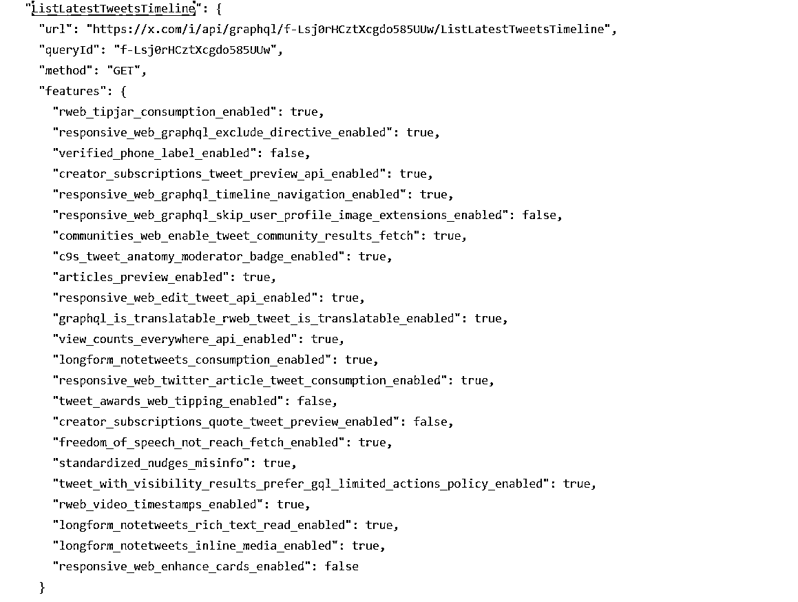

这时候我们就可以让claude 或者 gemini 接管代码部分了，我们在控制台直接右击接口选择复制-复制curl，然后打开gemini studio，这里可以免费使用gemini 1.5 Pro 002，之所以使用gemini 做前期的工作，是因为他的上下文极大，有200万token，相比claude来说可以一次性生成代码，我们把刚刚复制的curl信息发送给Gemini生成代码。

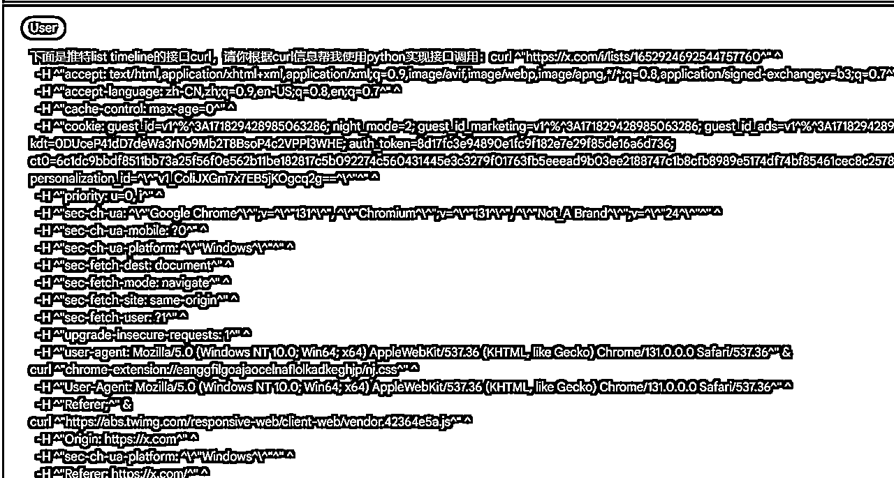

等待一下我们可以看到gemini已经给出了第一版本的代码；

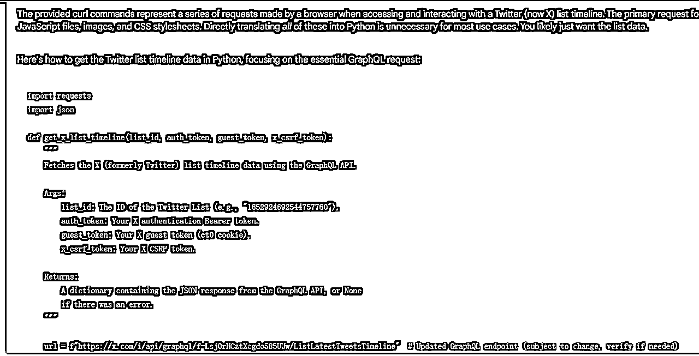

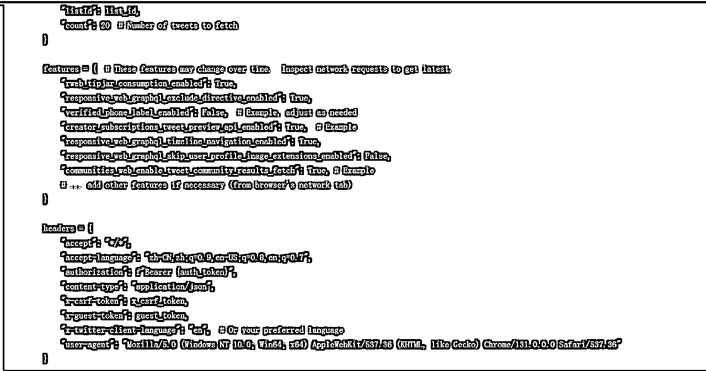

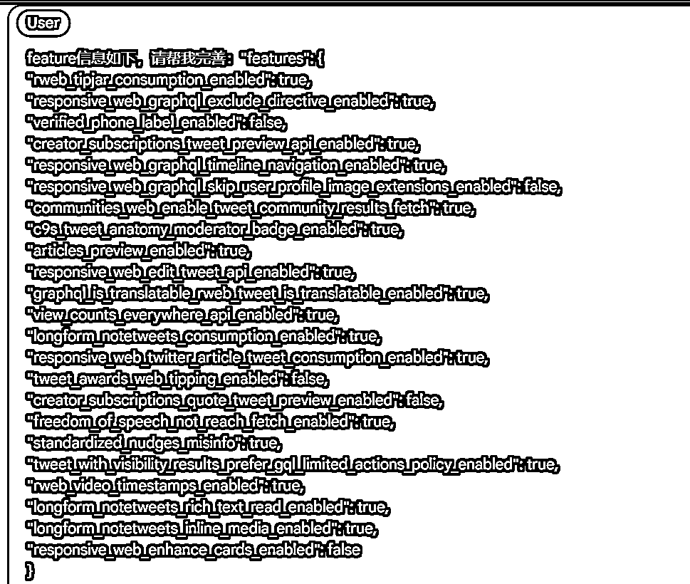

这个版本可以看到省略了一些features，我们把刚刚拿到的API json补充给gemini，让他帮我们完善这部分代码，直接拷贝代码尝试执行：

```
import requests
import json

def get_x_list_timeline(list_id,cookie, auth_token, guest_token, x_csrf_token):
    """
    Fetches the X (formerly Twitter) list timeline data using the GraphQL API.

    Args:
        list_id: The ID of the Twitter List (e.g., "1652924692544757760").
        auth_token: Your X authentication Bearer token.
        guest_token: Your X guest token (ct0 cookie value).
        x_csrf_token: Your X CSRF token.

    Returns:
        A dictionary containing the JSON response from the GraphQL API, or None 
        if there was an error.
    """

    url = f"https://x.com/i/api/graphql/f-Lsj0rHCztXcgdo585UUw/ListLatestTweetsTimeline"

    variables = {
        "listId": list_id,
        "count": 20  # Number of tweets to fetch
    }

    features = {  # Copied directly from your provided features (but verify in your browser)
        "rweb_tipjar_consumption_enabled": True,
        "responsive_web_graphql_exclude_directive_enabled": True,
        "verified_phone_label_enabled": False,
        "creator_subscriptions_tweet_preview_api_enabled": True,
        "responsive_web_graphql_timeline_navigation_enabled": True,
        "responsive_web_graphql_skip_user_profile_image_extensions_enabled": False,
        "communities_web_enable_tweet_community_results_fetch": True,
        "c9s_tweet_anatomy_moderator_badge_enabled": True,
        "articles_preview_enabled": True,
        "responsive_web_edit_tweet_api_enabled": True,
        "graphql_is_translatable_rweb_tweet_is_translatable_enabled": True,
        "view_counts_everywhere_api_enabled": True,
        "longform_notetweets_consumption_enabled": True,
        "responsive_web_twitter_article_tweet_consumption_enabled": True,
        "tweet_awards_web_tipping_enabled": False,
        "creator_subscriptions_quote_tweet_preview_enabled": False,
        "freedom_of_speech_not_reach_fetch_enabled": True,
        "standardized_nudges_misinfo": True,
        "tweet_with_visibility_results_prefer_gql_limited_actions_policy_enabled": True,
        "rweb_video_timestamps_enabled": True,
        "longform_notetweets_rich_text_read_enabled": True,
        "longform_notetweets_inline_media_enabled": True,
        "responsive_web_enhance_cards_enabled": False
    }

    headers = {
        "accept": "*/*",
        "accept-language": "zh-CN,zh;q=0.9,en-US;q=0.8,en;q=0.7",
        "authorization": f"Bearer {auth_token}",
        "content-type": "application/json",
        "x-csrf-token": x_csrf_token,
        "x-guest-token": guest_token,
        'Cookie': cookie,
        "x-twitter-client-language": "en",
        "user-agent": "Mozilla/5.0 (Windows NT 10.0; Win64; x64) AppleWebKit/537.36 (KHTML, like Gecko) Chrome/131.0.0.0 Safari/537.36"  # Use a recent User-Agent
    }

    params = {
        "variables": json.dumps(variables),
        "features": json.dumps(features)
    }

    try:
        response = requests.get(url, headers=headers, params=params)
        response.raise_for_status()  
        return response.json()
    except requests.exceptions.RequestException as e:
        print(f"Error fetching list timeline: {e}")
        return None

# Example usage (replace with your actual tokens and list ID):
list_id = "1652924692544757760"  
auth_token = "YOUR_BEARER_TOKEN"  
guest_token =  "YOUR_GUEST_TOKEN" 
csrf_token = "YOUR_CSRF_TOKEN"
cookie = """guest_id_marketing=v1%3A170397644855405893; guest_id_ads=v1%3A170397644855405893; guest_id=v1%3A170397644855405893; gt=1741229544630091953; _ga=GA1.2.1057235560.1703976456; _gid=GA1.2.1135323190.1703976456; _twitter_sess=BAh7CSIKZmxhc2hJQzonQWN0aW9uQ29udHJvbGxlcjo6Rmxhc2g6OkZsYXNo%250ASGFzaHsABjoKQHVzZWR7ADoPY3JlYXRlZF9hdGwrCDxR6byMAToMY3NyZl9p%250AZCIlZWVkZWIxMzE0YjUyZjlkN2I4MWYzMWMzN2NhNDY3Yjk6B2lkIiVmNWM3%250AYWY3ZGM4ZjRmNDRiMzFiOGUzNWNmMDQ0M2Q0MQ%253D%253D--a1032fec6b1279a56ef98ed6409fb8e9303b54e6; NID=511=MSkwom0gp_PpMgPDCVicYVO8odOhWyGU4B1TtKZ8lahQWKob7RPqwK5p4Jjdyvi7xNeW0dIDQL7e71ZKqv7Z5cWN26x-1YCgsLo58tkHqy2rC6Im9xBrcSw9Zndg4Gf_xDaaCizmTTWCx4r1zYeI_oY1S3VqkW2ai37NJDyJJ9g; kdt=SiX4cEsjpuX5mSWohFt2yFyOV3ANPqzQd3ZHhytq; auth_token=730391e07856f7dd3515e0eb7c97800516767076; ct0=d66936b453dbcf3f95157e281da838810f3c3be41a1c057b9657672df2a7f16c81a55972370652ea76b552bbe2decdb56bd3b3f0616cf5b93cfec70aa4920de87f9624478df0baad08011257c82f1f09; att=1-l49KMoXof90t5eHuSXqsfFl90UEKwVD8hhJxnl0i; lang=en; personalization_id="v1_9sDk8dsuFpe6HoiVDmtyQA=="; twid=u%3D1716477605153501184"""
timeline_data = get_x_list_timeline(list_id, auth_token, guest_token, csrf_token)

if timeline_data:
    # Now you can work with the timeline_data.  For example, to get the tweets:
    tweets = timeline_data['data']['list']['tweets_timeline']['timeline']['instructions'][0]['entries']
    # ... process the tweets
    print(json.dumps(tweets, indent=4))
```

第一次执行当然会报错，因为我们还没有处理token的问题，我们在谷歌搜索“推特账号购买”，多点几个网址进去比对之后选择一个最便宜的号商，比如这里就有几毛钱的账号，我们直接买一个就可以了，可以直接接购买cookie号，也可以账号登录后手动导出或者复制cookie，都一样。

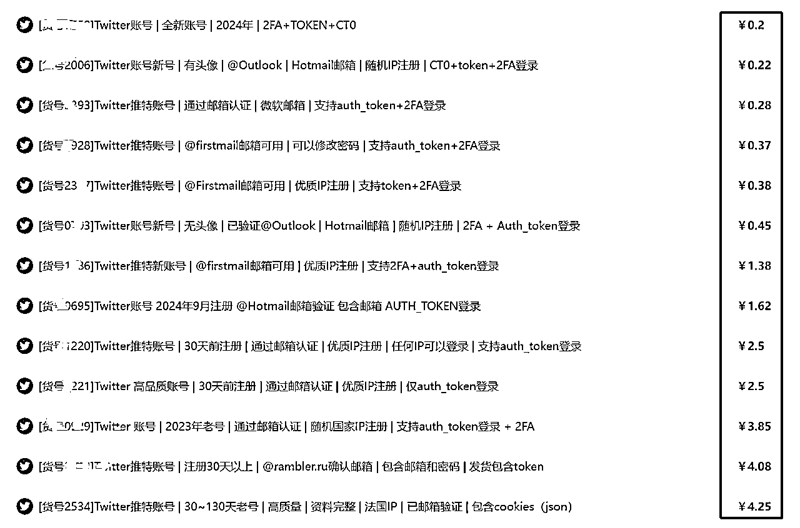

搞定cookie之后我们就可以直接通过cursor进行完善了。我们把cookie加到代码中。删掉没用guest_token，然后从cookie中正则提取x_csrf_token：x_csrf_token = ''.join(re.findall(r'ct0=(.*?);', cookie)[:1])，然后添加固定的Authorization：AAAAAAAAAAAAAAAAAAAAANRILgAAAAAAnNwIzUejRCOuH5E6I8xnZz4puTs%3D1Zv7ttfk8LF81IUq16cHjhLTvJu4FA33AGWWjCpTnA

到此我们就可以执行代码了，我们发现数据已经解析成功了，同理我们可以使用相同的办法获取推特的用户主页推文，多花几块钱买几个白号搭建账号池，每隔几秒执行一次监控最新推文。当然如果我们实时性要求不高的话，每隔一个小时执行一次就好了。这样的话一个账号就足够了，也无需代理，本地即可。

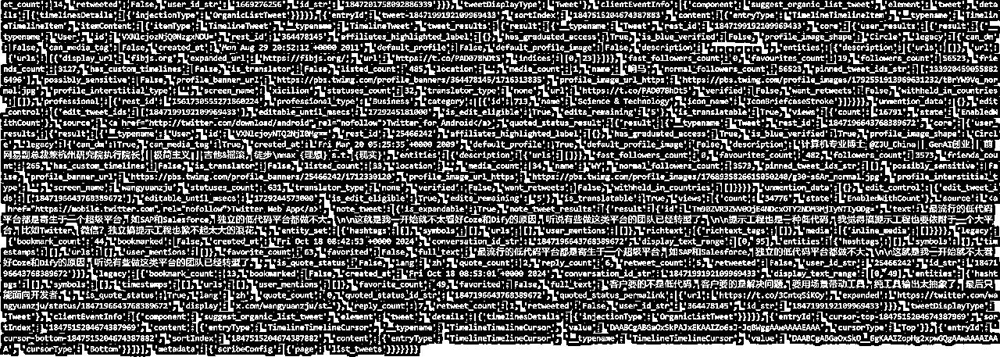

下面就是数据解析后保存了，这里为了方便后续的分析可视化与推送，我直接选择落表到数据库，我们可以选择sqlite或者mysql，这里和之前分享过的AI编程相关的提示词没啥区别，

下面是gemini生成的解析和保存代码，怎么说呢，反正是实现了，至于代码优不优雅我们也不用管那么多，前期能用就好。

```
def extract_tweet_info(self, result):
        """
        Extracts information from a single tweet result.
        """
        tweet_info = {}

        legacy = result['legacy']
        quoted_status_result = result.get('quoted_status_result', {}).get('result', {}).get('legacy', {})

        tweet_info['quoted_status_text'] = quoted_status_result.get('full_text')
        tweet_info['quoted_name']  = result.get('quoted_status_result', {}).get('result', {}).get('core',{}).get('user_results',{}).get('result',{}).get('legacy',{}).get('name')
        tweet_info['quoted_screen_name']  = result.get('quoted_status_result', {}).get('result', {}).get('core',{}).get('user_results',{}).get('result',{}).get('legacy',{}).get('screen_name')

        retweeted_status = legacy.get('retweeted_status_result')
        if retweeted_status:
            tweet_info['retweeted_name'] = retweeted_status['result']['core']['user_results']['result']['legacy']['name']
            tweet_info['retweeted_screen_name'] = retweeted_status['result']['core']['user_results']['result']['legacy']['screen_name']
            # 如果是转推，则覆盖full_text为转推前的文案
            tweet_info['retweeted_full_text'] = retweeted_status['result']['legacy']['full_text']
            quoted_status = retweeted_status['result'].get('quoted_status_result',{})
        views = result.get('tweet', result).get('views', {}).get('count',0)
        user_legacy = result.get('tweet', result).get('core', {}).get('user_results', {}).get('result', {}).get(
            'legacy', {})
        screen_user = user_legacy.get('screen_name')
        followers_count = user_legacy.get('followers_count')
        fast_followers_count = user_legacy.get('fast_followers_count')
        name = user_legacy.get('name')
        profile_url = user_legacy.get('profile_image_url_https')
        reply_count = result.get('legacy', {}).get('reply_count', 0)
        quote_count = result.get('legacy', {}).get('quote_count', 0)
        retweet_count = result.get('legacy', {}).get('retweet_count', 0)
        favorite_count = result.get('legacy', {}).get('favorite_count', 0)
        user_link = f'https://twitter.com/{screen_user}'
        tweet_text = result['note_tweet']['note_tweet_results']['result']['text']
        tweet_create_time = result['tweet']['legacy']['created_at'] if 'tweet' in result else result['legacy'][
            'created_at']
        converted_time = datetime.strptime(tweet_create_time, '%a %b %d %H:%M:%S %z %Y')
        formatted_time = converted_time.strftime('%Y/%m/%d %H:%M')

        tweet_info.update({
            "tweet_id": tweet_id,
            "tweet_url": tweet_url,
            "user_link":user_link,
            "tweet_text": tweet_text,
            "views": views,
            "followers_count": followers_count,
            "fast_followers_count": fast_followers_count,
            "reply_count": reply_count,
            "retweet_count": retweet_count,
            "favorite_count": favorite_count,
            "tweet_create_time": formatted_time,
            "quote_count": quote_count,
            "screen_name": screen_user,
            "name": name,
            "profile_url": profile_url,
            "media_urls": media_urls
        })

        return tweet_info
```

保存后的数据如下，包括了所有主流AI KOL和一些AI官方的推文，包括点赞、收藏、转推、浏览数等，这些数据足够我们使用了：

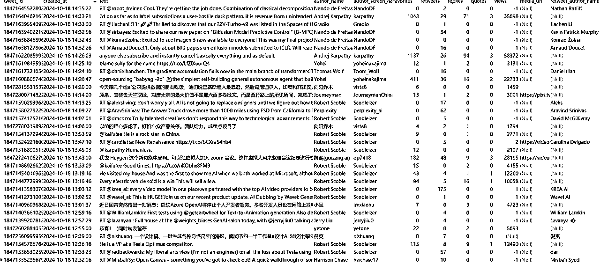

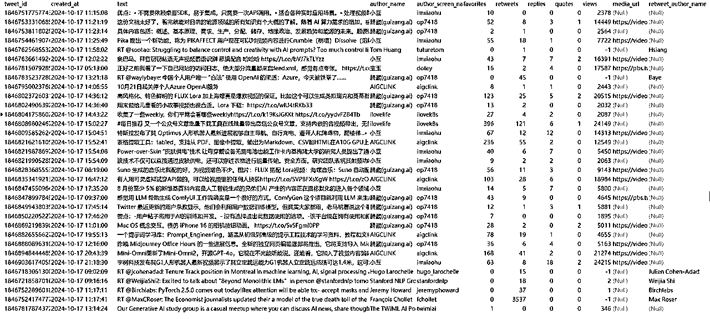

## AI摘要和数据分析

采集到数据之后才是第一步，在表中的阅读体验非常差，每天几百上千篇文章我们也不可能有足够的时间去阅读，所以我们需要使用AI总结、可以在可视化界面选择素材、推送到飞书或者微信等。

接下来我们就使用AI对推文进行总结

### AI摘要

这里推荐大家使用deepseek或者豆包，当然通义千问也是可以的，主要是量大便宜，100万token也就一两块钱，用起来不心疼，而且ds注册还送500万token，豆包送1亿token，足够玩很长时间了。

这里以deepseek为例，我们打开官方地址：https://platform.deepseek.com/，直接实名认证然后创建一个新的API key 就好了

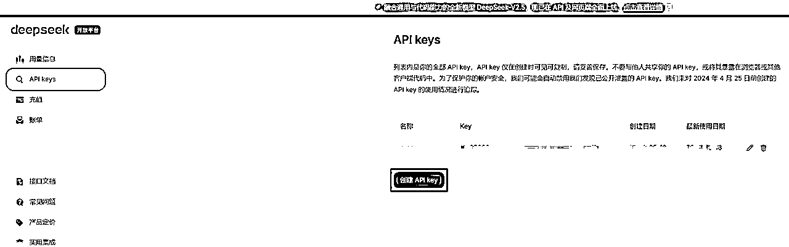

然后打开接口文档：https://api-docs.deepseek.com/zh-cn/，ds与openai接口完全是兼容的，我们使用oai库或者自己写request都一样，没啥问题。

接下来我们选择Python代码，直接拷贝到我们项目中，与cursor沟通，每次采集完成后请帮我使用AI模型总结推文摘要：

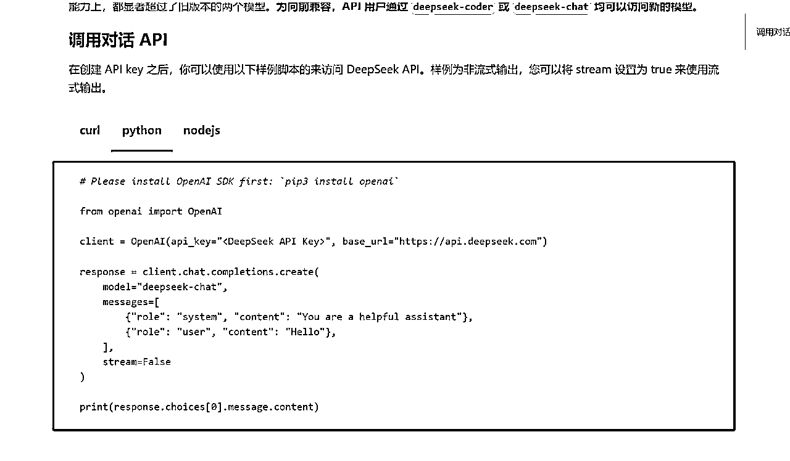

以下是AI大模型的调用方式，请你帮我修改代码，我希望在采集完成推特数据之后，能够使用AI总结推文，提供给大模型的信息要有：原推文正文、转推正文、引用正文、作者或者引用作者。请完成功能：#

from openai import OpenAI

client = OpenAI(api_key="<deepseek api="" key="">", base_url="https://api.deepseek.com")</deepseek>

response = client.chat.completions.create(

model="deepseek-chat",

messages=[

{"role": "system", "content": "You are a helpful assistant"},

{"role": "user", "content": "Hello"},

],

stream=False

)

print(response.choices[0].message.content)

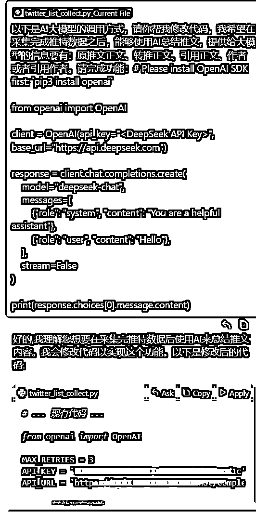

```
def get_tweets_from_db():
    conn = mysql.connector.connect(**connection_params)
    cursor = conn.cursor(dictionary=True)
    cursor.execute('''
    SELECT 
        tweet_id,
        author_name,
        text,
        retweet_author_name,
        retweet_text,
        quote_author_name,
        quote_text
    FROM tweets_list WHERE ai_summary IS NULL OR ai_summary = ''
    ''')
    tweets = cursor.fetchall()
    cursor.close()
    conn.close()
    return tweets
```

```
def fill_tweets_ai_summary():
    tweets = get_tweets_from_db()
    print(f"获取到的推特数量：{len(tweets)}")
    for tweet_data in tweets:
        tweet_content = f"""
        author_name:```{tweet_data['author_name']}```
        text:```{tweet_data['text']}```
        retweet_author_name:```{tweet_data['retweet_author_name'] if tweet_data['retweet_author_name'] else ''}```
        retweet_text:```{tweet_data['retweet_text'] if tweet_data['retweet_text'] else ''}```
        quote_author_name:```{tweet_data['quote_author_name'] if tweet_data['quote_author_name'] else ''}```
        quote_text:```{tweet_data['quote_text'] if tweet_data['quote_text'] else ''}```
        """
        print(tweet_content)
        summary = get_deepseek_response(tweet_content)
        if summary:
            print(f"推文ID: {tweet_data['tweet_id']}")
            print(f"摘要: {summary}")
            # 更新数据库中的ai_summary字段
            upate_tweet_summary(tweet_data['tweet_id'], summary)
```

我推文总结用到的提示词为：

请总结以下推文数据，精简全面地说明推文的重点，以帮助我判断推文价值，进行素材选题。我会提供给你author_name（作者）、text（推文）、retweet_text（转发推文），quote_author_name(引用推文作者)、quote_text（引用推文正文） 如果retweet_text存在，说明该条推文是作者转发了其他人的推文。如果quote_text存在，则说明是作者针对该推文进行的回复后者评论。请根据推文信息，帮我用精简的语言全面总结推文的重点。无需解释，请直接使用中文进行回复，并不超过50字概括推文核心内容

这个提示词根据自己需求决定就行了，自己想根据这些推文获取什么信息做什么处理按照自己想法来即可。以下为上面提示词总结后的效果，建议大家打开看一下，我个人还是挺满意的。

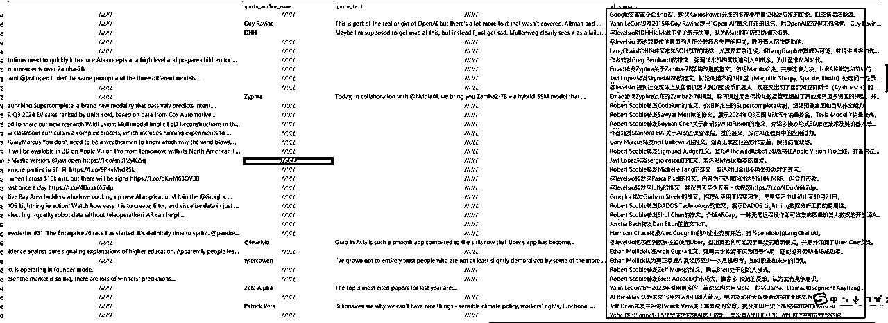

### 前端可视化展示

我们采集到了文章，也使用AI进行了摘要总结或者重写，那么如何展示呢，总不能每次都要打开一堆数据库管理软件导出表格吧，那就直接做一个可视化界面吧，反正有了AI，就是一段提示词的事嘛：

我的本地mysql数据库表结构如下：CREATE TABLE tweets_list (

tweet_id varchar(255) COLLATE utf8mb4_unicode_ci NOT NULL,

created_at datetime DEFAULT NULL,

text text COLLATE utf8mb4_unicode_ci,

author_name varchar(255) COLLATE utf8mb4_unicode_ci DEFAULT NULL,

author_screen_name varchar(255) COLLATE utf8mb4_unicode_ci DEFAULT NULL,

favorites int DEFAULT NULL,

retweets int DEFAULT NULL,

replies int DEFAULT NULL,

quotes int DEFAULT NULL,

views int DEFAULT NULL,

media_url text COLLATE utf8mb4_unicode_ci,

retweet_author_name varchar(255) COLLATE utf8mb4_unicode_ci DEFAULT NULL,

retweet_text text COLLATE utf8mb4_unicode_ci,

quote_author_name varchar(255) COLLATE utf8mb4_unicode_ci DEFAULT NULL,

quote_text text COLLATE utf8mb4_unicode_ci,

ai_summary text COLLATE utf8mb4_unicode_ci,

collected_at timestamp NOT NULL DEFAULT CURRENT_TIMESTAMP,

PRIMARY KEY (tweet_id)

) ENGINE=InnoDB DEFAULT CHARSET=utf8mb4 COLLATE=utf8mb4_unicode_ci;

请你使用pytho fastapi帮我写一个页面，渲染AI摘要和原推文内容、链接等。注意页面以卡片方式呈现，排版布局合理，阅读要友好，视觉效果要好，主题色和推特同款天蓝色即可。

一句话就写好了，一字未改而且正确渲染，虽然第一版不太好看，那我们可以继续使用提示词优化知道满意为止：

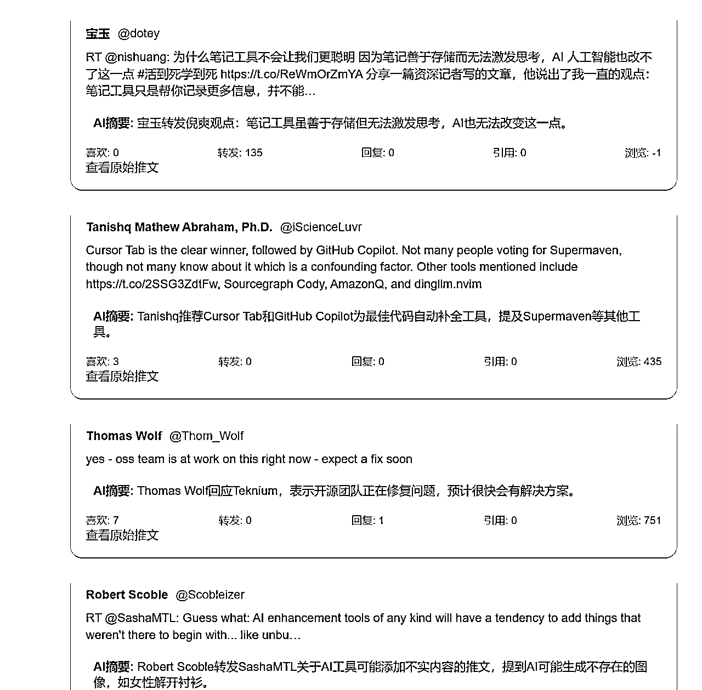

请添加样式等，每条推文都用card包围，然后添加好看的样式，横铺瀑布流的形式。请给出完整代码

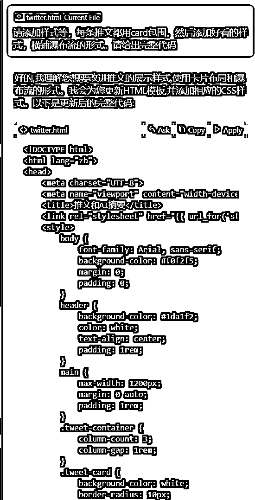

好了，第二版是我想要的结果，效果如下。当然还有改进的空间，比如把图片或者视频也渲染出来，但是现在我觉得没啥必要，因为我们可以点击原文进去查看吗，或者在推送的时候自动下载视频帮我们发送到飞书或者微信就好了。

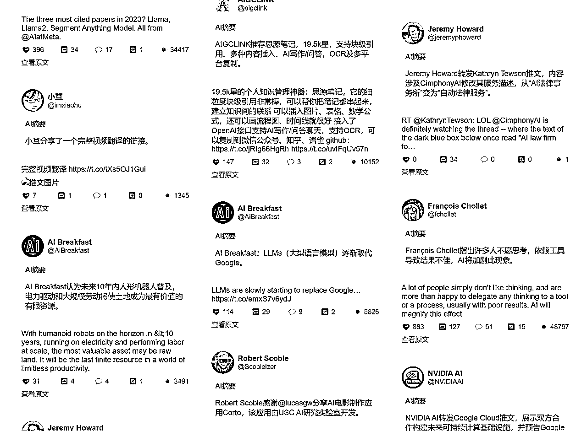

完整代码如下：

```

    推文和AI摘要

# 推文和AI摘要

            

                    

## {{ tweet.author_name }}

@{{ tweet.author_screen_name }}

### AI摘要

{{ tweet.ai_summary }}

{{ tweet.text }}

                
                
                

                    ❤️ {{ tweet.favorites }}
                    🔁 {{ tweet.retweets }}
                    💬 {{ tweet.replies }}
                    🔄 {{ tweet.quotes }}
                    👁️ {{ tweet.views }}

                [查看原文](https://twitter.com/{{ tweet.author_screen_name }}/status/{{ tweet.tweet_id }})

            

```

### 飞书&微信推送

飞书机器人推送官方文档：“数据推送”机器人

微信因为官方不支持机器人，所以如果有需求的话最好用小号，可以使用wechatpy或者wcf，一般来说稳定性都是可以的，切忌不要用大号！！这块很简单就跳过不展开了。

### GUI封装

到这里我们的主要功能其实就已经实现了，接下来我们用GUI包装一层，方便自己使用：

请基于目前的代码使用pyside6实现一个GUI可视化界面。页面分为采集tab和列表tab，采集tab中可以输入要采集的推特list链接，推特cookie，需要采集的页数。列表tab需要展示所有采集到的推文信息，推文信息参考现有代码，从当前目录的sqlite数据库中的tweets_list表中获取。请根据现有代码实现这个功能。

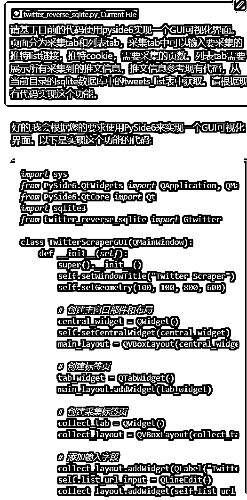

直接执行之后第一版界面如下所示，第一观感比较差：

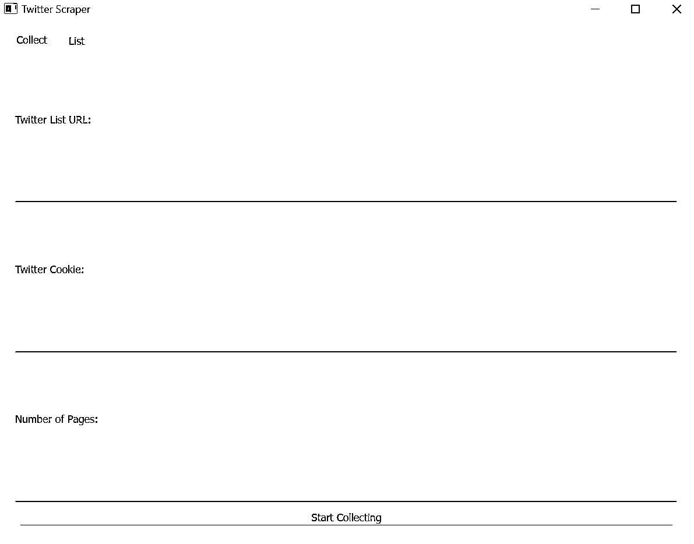

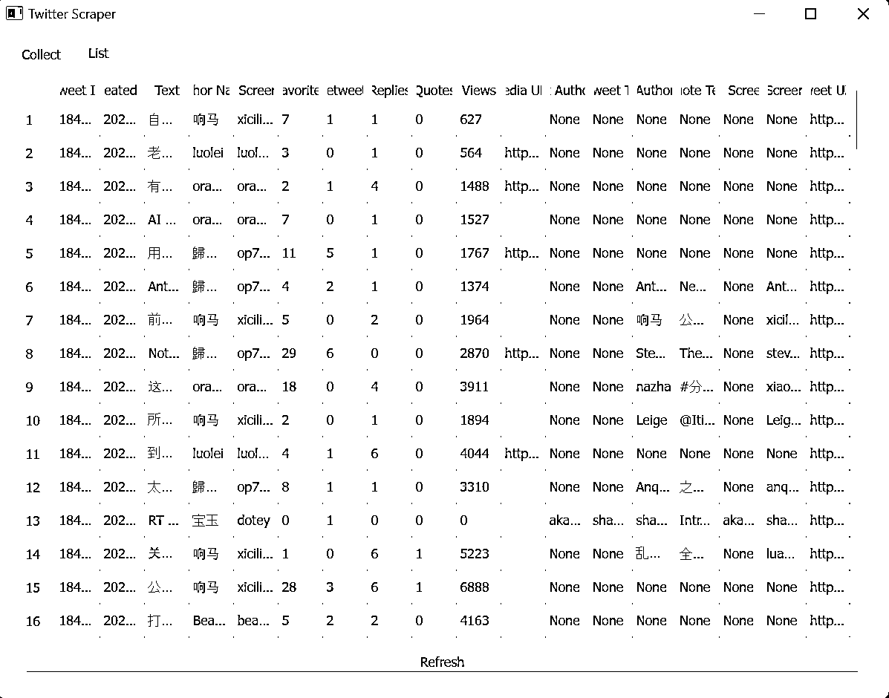

那就继续修改样式，直到我们满意为止：

请你帮我修改采集tab，在页面下方添加一个日志框，用于显示操作记录或系统消息。另外现在页面太丑了，请你根据内容框进行合理的视觉设计设计，添加样式，更改布局，使页面更加美观大方。请给完整的代码

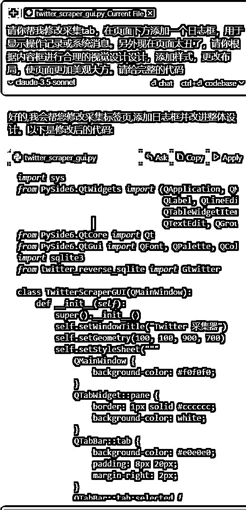

修改后如下，这样看起来是不是就好多了？

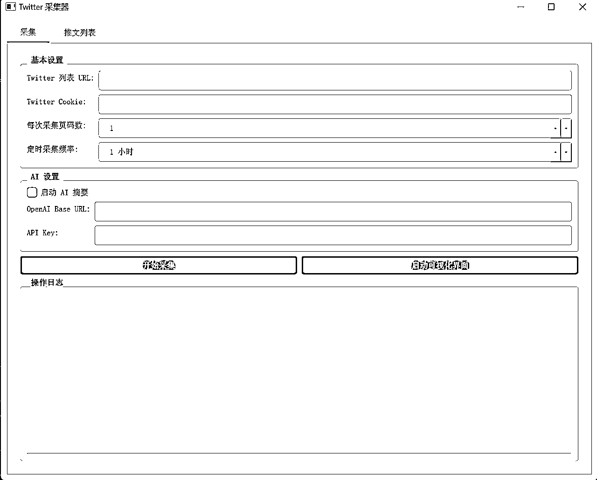

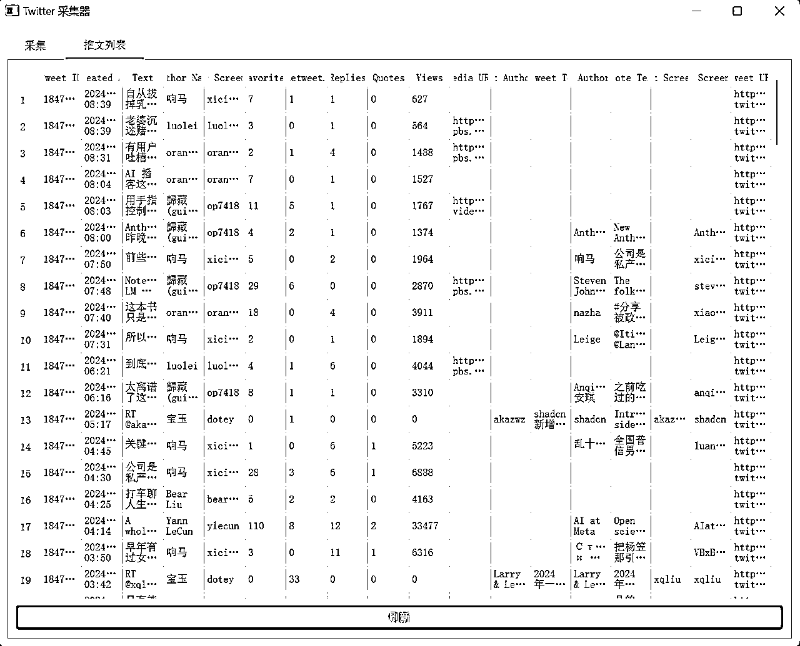

OK，到这最小的MVP就实现了，再有就是我们解析保存了原始推文的所有信息，极大方便我们后续扩展功能，比如我们可以加上推文的图片和视频下载等等。再比如就是我们虽然已经接入了AI，但是我们只是做了摘要，可以在列表后面新增一个“改写”，自定义提示词，改写后一键添加到素材库，方便我们后续创作或者集成发布到多平台等等，总之我个人觉得有很多玩法。大家有什么好玩的功能推荐，可以把你的想法写在评论区，如果呼声比较高我后面都加上。

OK，以上就是整个的开发过程，工具打包为了exe，放到了下面，大家感兴趣可以下载试用。

还有这个软件除了数据采集外没有任何网络交互，所有的数据都存储在本地，api key等存储在当前目录下的config.json，数据存储在当前目录下的twitter_data。

为了方便大家玩的开心，我放了一个cookie在下面，大家如果懒得买推特小号可以复制这个cookie直接采集，另外采集的时候需要保证自己是有外网的，毕竟要科学，这个不多解释

```
guest_id_marketing=v1%3A170397644855405893; guest_id_ads=v1%3A170397644855405893; guest_id=v1%3A170397644855405893; gt=1741229544630091953; _ga=GA1.2.1057235560.1703976456; _gid=GA1.2.1135323190.1703976456; _twitter_sess=BAh7CSIKZmxhc2hJQzonQWN0aW9uQ29udHJvbGxlcjo6Rmxhc2g6OkZsYXNo%250ASGFzaHsABjoKQHVzZWR7ADoPY3JlYXRlZF9hdGwrCDxR6byMAToMY3NyZl9p%250AZCIlZWVkZWIxMzE0YjUyZjlkN2I4MWYzMWMzN2NhNDY3Yjk6B2lkIiVmNWM3%250AYWY3ZGM4ZjRmNDRiMzFiOGUzNWNmMDQ0M2Q0MQ%253D%253D--a1032fec6b1279a56ef98ed6409fb8e9303b54e6; NID=511=MSkwom0gp_PpMgPDCVicYVO8odOhWyGU4B1TtKZ8lahQWKob7RPqwK5p4Jjdyvi7xNeW0dIDQL7e71ZKqv7Z5cWN26x-1YCgsLo58tkHqy2rC6Im9xBrcSw9Zndg4Gf_xDaaCizmTTWCx4r1zYeI_oY1S3VqkW2ai37NJDyJJ9g; kdt=SiX4cEsjpuX5mSWohFt2yFyOV3ANPqzQd3ZHhytq; auth_token=730391e07856f7dd3515e0eb7c97800516767076; ct0=d66936b453dbcf3f95157e281da838810f3c3be41a1c057b9657672df2a7f16c81a55972370652ea76b552bbe2decdb56bd3b3f0616cf5b93cfec70aa4920de87f9624478df0baad08011257c82f1f09; att=1-l49KMoXof90t5eHuSXqsfFl90UEKwVD8hhJxnl0i; lang=en; personalization_id="v1_9sDk8dsuFpe6HoiVDmtyQA=="; twid=u%3D1716477605153501184
```