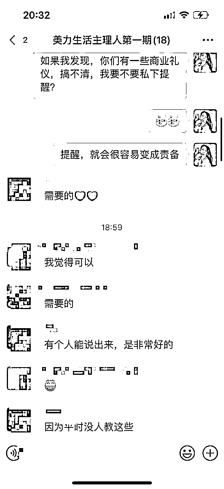
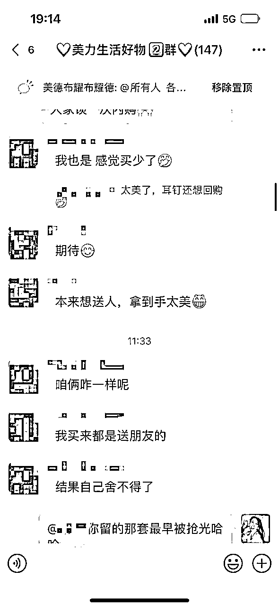
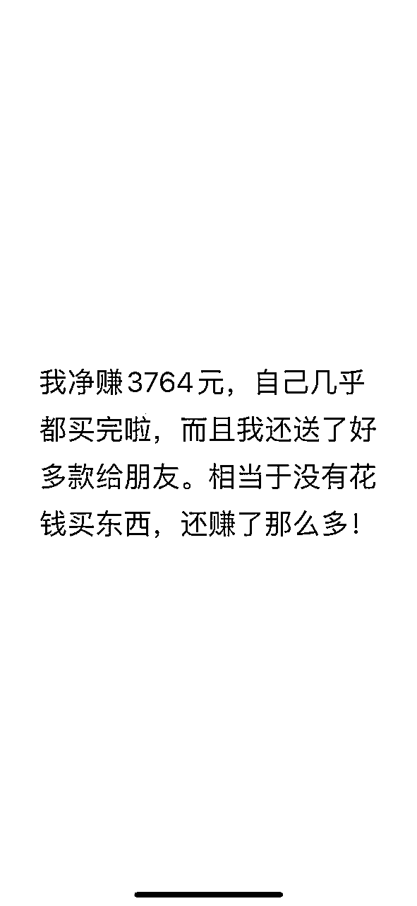
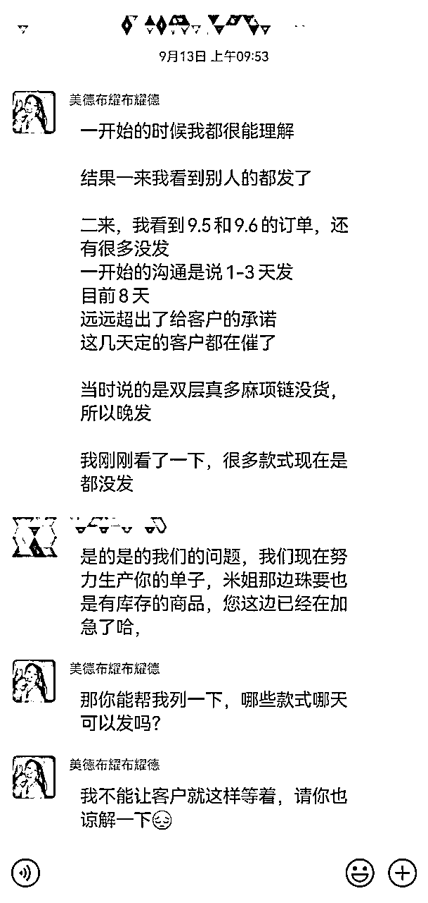
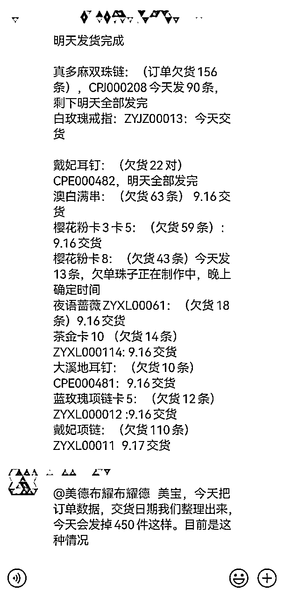

# 把珍珠卖给爱美的女孩，适合女性私域销售手册

> 来源：[https://eqskzik48t.feishu.cn/docx/UGE2dq5QooLQ3zxgcVJc7F4bnUh](https://eqskzik48t.feishu.cn/docx/UGE2dq5QooLQ3zxgcVJc7F4bnUh)

大家好，我是美德，微信名就是那个美德布耀布耀德。

首先，衷心感谢生财有术这个平台，让我不断遇见贵人，开拓视野。2019年，我在生财的上海线下聚会中，当着全场1000人自我介绍，正式踏入生财的大家庭。在这里，我深刻感受到了“人外有人，天外有天”的真谛。

过去，我常在某些领域取得小成绩，却缺乏将其沉淀为 SOP 的意识。然而，在生财，每当我对某个领域产生兴趣时，总能看到比我想得更长远、做得更深入、实践更到位的文章，内容细致且全面。每次阅读都让我意识到自己的不足，同时也看到了更广阔的成长空间。对此，我由衷感激这个平台带来的启发与成长。特别感谢梁靠谱、根源、明白、刺猬和芷蓝等贵人。因此，我萌生了将自己的阶段性经验沉淀下来，并分享给大家的想法。

# 前言

我是一个自由奢侈品培训师，同时经营两个方向的私域社群：奢侈品内购&资源群和美力生活好物群。我一直以来的目标，就是帮助客户去除品牌溢价，让他们省下大笔开支，同时享受到高品质的好物。

在这篇文章中，我将实战回顾2024年9月份的一次主理人招募&私域社群激活全过程。总结而言，我通过微信朋友圈招募到了42位主理人，并带领其中20位，在短短3天内成功赚取500-12000元。同时，我激活了10000+客户，最终自己变现10万，团队总共变现30万。

我发起主理人项目的初衷，仅仅是想帮助那些我能力范围内可以顾及的女性。我深信，女性想要成长，仅依靠成长课程是不够的，必须放下打工思维，投入到真实的商业环境中。朋友圈带货是门槛最低但天花板高的机会，同时也接近商业底层逻辑，因此我选择了这条路。

值得一提的是，整个流程并不是一开始就全部布局好的，而是每走一步根据当下的情况做出的选择。然而，回过头来，我发现很多选择的结果都相当不错，因此特此总结分享。

以下是这次私域社群活动的全纪实，如果你也准备激活自己的私域社群，这篇文章将为你提供很好的参考。

# 目录

1、念起：我怎么选择爆款潜质产品

2、聚人：我如何0成本招募主理人

3、起势：如何快速集中大规模发售

4、打法：像素级模仿+规则确立+经验分享

5、杠杆：客户正反馈+主理人信心+贵人引荐

6、总结：无互动不成私域，真诚才有成交

# 念起：我怎么选择产品

### 一、私域经验

每个想要在私域进行销售的主理人，初期都会面临许多挑战。尤其是当还没有在朋友圈中建立起一个完整的好物分享人设时，依靠个人IP来销售产品会非常困难。朋友圈的好友看到你的广告，可能会疑惑：“你为什么突然卖这个？你有何资格销售？如何证明你的产品值得信赖？”

因此，我们需要通过产品吸引关注，再以关注带来销售，以服务打开口碑，进而促进客户沉淀。这才是正确打开私域的方式。

早在2019年，我通过奢侈品内购和奢侈品小样吸引了第一批私域客户，这一经验至今仍在发挥作用。这也是我决定招募主理人的初衷，希望复用这些经验，帮助一批想要成长的女性提升赚钱能力。与此同时，帮助她们的过程也将回馈于我，比如拓展我的客群和影响力。如果我能影响到他人，这将让我感到快乐。在这个过程中，我引导主理人无需过多关注原理，先进行像素级模仿，赚到第一桶金，这样自然能激发她们不断增加学习投入与销售技巧，走上正向循环。

### 二、产品筛选

在选择产品时，我坚持四个核心原则：低门槛引流、利润高于私域常规产品、产品颜值高、物超所值。

低门槛旨在让客户“易入”，利润高则是为了吸引拥有私域客户的主理人，颜值高便于“传播”，而物超所值则提供“情绪价值”。

因此，我将目标放在复购率很高的饰品上。最终我对比了几家产品，通过朋友的资源，我选择了以水晶珠为基底，厚镀5层珍珠粉的人造珍珠饰品。

人造珍珠，这个品的成本很低，市场没有大品牌，通常不同品类的零售价在50-300之间。单价很低，但是产品足够美丽，调性也高，许多奢侈品品牌都在用人造珍珠为原材料。因此吸引来的客户，消费能力也比较好。

这些珍珠可以做到以假乱真的效果，特别是入手的沉坠感，在视觉和触感上跟真珍珠无异，这也是产品端特别能打的原因，这样最能迅速提升用户的信任感和复购意愿。

在实际操作中，我选择了一款基础耳钉产品，定价为0元，9.9包邮，自己还承担了少部分费用，打造为低门槛引流品。

这样既可以提供给客户物美价廉、零压下单的快感，又能让主理人轻松破冰、唤起客户。对于主理人来说，产品简单易推且受众广泛，促使她们轻松上手，快速赚到第一块钱。

我们的私域零售定价基本上都是市场价的5折，私域的朋友可以花很低的价格买到好产品，她们非常开心。而我和代工厂各自赚一点搬砖费，把利润大头给到主理人帮卖团队。帮卖主理人也非常开心，相比市场上私域电商平台的3-20元佣金，我们的珍珠具备显著的利润优势。这也是为什么，我除了能吸引0经验的小白选手，也很容易能吸引到拥有私域客户资源的“小达人”。

# 聚人：我怎么0成本招揽主理人团队

### 一、招募主理人团队

招募主理人团队的关键在于，寻找那些愿意参与、具备基本销售能力并在微信朋友圈拥有一定好友基础的人。为了高效完成这一环节，我采用了朋友圈发布信息加上设置流程筛选的方式。这不仅确保了参与者的质量，也让整个招募过程更为顺畅。

筛选是关键，所以我的筛选主要分为以下流程：

*   1.主理人看到我在朋友圈的招募，愿意进群听宣讲【宣讲中，我会详细介绍我自己，以及这个项目，以及我的理念】。

*   2.听完宣讲，主理人自愿填写申请问卷。

*   3.问卷填写会看是否走心，是否信任我，提交时间是否及时。

*   4.通过问卷的筛选，进入第一轮。

*   5.按要求做完作业，进入第二轮。

*   6.按要求吸引至少100人入自己的社群，进入最终轮。

以上流程的设置，确保了最终加入的，都是无比信任我，真正愿意行动的朋友。

### 二、筛选主理人

在筛选主理人时，我主要考察3个核心问题：

1.  你的微信好友数量是多少？

1.  你是如何看待私域带货的？

1.  你是否在美德这里消费过？

——对于好友数量超过500且有私域副业经验的人，我会优先通过。这类人本身有潜力，能够在短时间内完成从“学”到“卖”的转变。

——对于私域带货如何看待，也会决定，大家的发心，是否合适，如果觉得带货丢人，且未能克服相关的羞耻感，也很难真正展开工作。

——对于是否在我这里消费过，这一点尤为重要。 因为我比较希望有一批对我有基础信任的主理人，否则带领起来需要花大量时间解释，会非常疲惫。本身这是一次无偿的带大家赚钱的活动，简单相信，下场去做，是最好的状态。

——并且如果在我这里没有消费过，如何相信我是可以为客户把关，对客户负责的人，又如何确认我的货品和服务没问题，从而信心满满推荐给自己客户呢？

——而对于没有经验的新人，我会针对性地提供额外的培训支持，帮助她们三天内至少组建100人的社群，用来带货珍珠。最终，我成功筛选出了42位主理人，并建立了一个主理人微信群，便于互通有无。

但是经过初步筛选，也并不能保证每个人都在最初就愿意全力投入。每个人性格特质不一样，花期不一样，开始的节奏也不一样。

比如，行动力强的人通常会快速冲上来，而审慎型的人往往需要观察和犹豫，只有在看到第一波反馈后才会跟进。

此外，还有一些人因为自身的事务，无法100%投入，他们也可能需要看到结果或完整体验流程后，才能全身心参与。这种节奏差异是完全正常的。我接纳并允许这种不同，但我会以我的节奏为主导，努力带动大家前进。

### 三、招募助理

其次，在做私域的项目时，有个得力助手，是很重要的。因为，私域的工作，常常比较琐碎，助理可以帮助我们处理一些繁琐的工作，从而让我们有时间保持清晰的思路，制定战略方向。

如何最大化的找到得力助手，我有以下经验分享：

1、深入了解自己：你得非常了解你自己，我的盖洛普优势才干，基本上都集中在战略思维和影响力。执行力和关系建立偏弱。因此，我在找助理的时候，她的细心耐心，以及和他人关系建立的能力，我就比较看重。一般按此挑选，合作起来都会比较顺畅。

2、明确规矩，信任对方：设置好规矩后，用人不疑，疑人不用。我对她的定位不是助理，而是我们的项目负责人。让对方有自主权，比如售后处理我会给她很大的权限，怎么赔付，怎么处理，她都可以自己决策。当一个人拥有自主权，她也会拥有积极性。

3、透明沟通：同步所有的决策给对方，让对方知道why，从而更好的服务好各方，包括供应商，合作方，C端客户。

4、给好工资。

# 起势：如何集中大规模发售

确定好主理人后，下一步就是如何集中起势。

### 一、制定集中发售日策略

为了尽快制造出一个销售爆点，我制定了一个集中发售日策略。9月10日左右，我就告诉主理人：“我们在9月15日这天进行集中发售，大家一起行动，制造一个群体效应。”

### 二、增加紧迫感

为了增加紧张感，我限制了内购价的有效时间，第一批内购仅持续三天（9月15日至9月18日）。这个消息，让主理人们提前三天，在朋友圈广而告之。

在正式开始之前，我还采取以下措施：

*   1.朋友圈预热：只在朋友圈，让客户看到一些产品。同时发朋友圈，告知三天后有内购，造势。

*   2.产品体验：提前让所有主理人先体验自家的产品，收到样品后拍照返图，共同用于宣传。

*   3.借助影响力：提前找一些长相较好、身份较高的朋友寄拍，档次感瞬间拉高，缓解客户对人造珍珠与自身身份不符的顾虑。

### 三、发售当天的推广

发售当天，我给主理人群内提供了详细的推广话术，甚至连朋友圈发文的格式都提前做好了模板。例如，早上9点发产品介绍，中午12点发限时活动提醒，下午6点再来一波“最后抢购提醒”。

### 四、分配与引流策略

每位主理人分得10-20份不等的9.9元引流品，共计200份。

通过这种“集中+限时”的打法，当天晚上8点1分，200个低价产品在几小时内被抢购一空。这样的集体发力不仅提升了主理人的信心，也激活了客户的紧迫感，带动了其他产品的销售。

### 五、设计朋友圈引流活动

为第二轮预热的活动，我选择了一个简单有效的方式——“朋友圈点赞送福利”。这个活动的核心目的就是让朋友圈中的所有人都能看到，并且能够快速参与，提升互动率。通过这种方式，不仅可以增加活动的曝光度，还能激发用户的参与感和好奇心，进一步扩大活动的影响力。

# 打法：像素级模仿+制定竞争规则+鼓励经验分享

起势之后，细节决定成败。我引入了三种策略：像素级模仿、竞争规则、经验分享。

### 一、像素级模仿

首先，针对新手主理人，我要求她们完全复制我给出的文案，不做任何改动。这种像素级模仿能让她们在不熟悉私域销售的情况下，避免犯错，减少内耗，并迅速看到效果。

一抄二改三优化，没有最开始的“复制的过程”，就没法领会销售套路的精髓。比如：

为什么要这么写？

为什么要这么说？

为什么选择这个时间点？

这些都不是凭空设定的，而是经过反复实践总结出的最佳路径，模仿是学习的第一步。

### 二、竞争机制

其次，我在主理人内部建立了一个竞争机制，让大家更有目标感。每周都会公布各位主理人的销售数据，销量最多的前3名将获得额外奖励，不仅有奖金激励，还能享受不同的推广资源支持，甚至在拿货价上也有优待。

这种奖励机制为每位主理人提供了额外的压力和动力，形成了一种良性的竞争氛围，每个人都想在这个榜单上取得好成绩，互相督促、促进，共同成长。

### 三、经验分享

最后，我鼓励主理人在群内分享经验。我会定期邀请那些销售成绩优异的主理人分享她们的心得体会，其他人则可以借鉴和模仿。通过这种方式，主理人团队的整体能力不断提升，个人的销售成绩也越来越好。

# 杠杆：第一波客户反馈+第一波主理人感恩+第一波贵人下场+供应商合作绑定

在社群运营中，杠杆效应发挥了极大的作用。我在客户、主理人、贵人、供应商4个人群中巧妙地利用了这个原理，取得了显著效果。

### 一、第一波客户的反馈

在发售结束后，我第一时间收集了客户的使用反馈，并将这些真实的评价分享到主理人群和朋友圈。这些反馈不仅增加了产品的可信度，还为主理人提供了更多推广素材。

真实的客户评价是一种极其有效的杠杆，能够直接提升主理人销售时的说服力。通过分享这些反馈，客户可以更直观地看到产品的实际效果，主理人也能用这些评价做“口碑营销”，使得潜在客户更愿意下单。

因为产品性价比太高，本身又真的很漂亮，带动了一大批自动返图的客户。很多客户本身身价不菲，气质出众，帮我们迅速积累了很多美图素材。同时，供应链密切沟通，得知串珠的工人都是住别墅的富婆姐姐们。这样一来，产品的能量迅速扩大！

### 二、主理人的感恩反馈

在带领主理人赚到钱后，我巧妙地引导她们分享自己的赚钱经历和感悟。这些感恩反馈不仅仅是对我个人的感谢，更重要的是，它们成了激励新主理人的重要手段。

当这些反馈发布在群内时，效果是双重的：

*   一方面，它极大地提升了新主理人的信心。那些还在摸索阶段的主理人，看到前辈们已经开始收获成功，心里会产生强烈的动力，知道这个项目是行得通的，值得全力以赴。

*   另一方面，观望的潜在客户看到这么多真实的成功案例，也会产生“错过机会的恐惧感”，更愿意尝试加入或者购买产品。这是一种无形的“社群共鸣效应”，能够有效带动更多的参与和销售。

感恩反馈不仅增强了团队内部的凝聚力，也成为了外部客户引流的一个强大工具。通过真实的故事和真挚的感受，它们让整个项目更具人情味和可信度。

### 三、贵人定向邀约下场

在销售的第二天，我请到了一位有影响力的行业大咖加入销售珍珠。这种外部资源的介入不仅仅是对主理人们的激励，更为整个团队增加了强大的信任背书。

由于前两天的业绩非常突出，我很快吸引到了更多私域达人来合作。通过这次成功的经验，后期每天的订单量都能稳定在500+以上，销售态势至今还在持续。

大部分拥有私域大盘的达人，之前可能都是集中在某一领域，这么多年过去，如果产品没有更多变化，其实销售也会疲软。

而我们的人造珍珠项目，经过验证后，证明是能够帮助他们激活私域客户的新方向。也同样适合这些人，帮助她们激活她们私域的客户，大家都很大局观，所有和我合作的达人，都没有在我定价的基础上加钱，都是想用目前惠于客户的价格，赢得一波好感。后面赚到钱，是顺带的结果。

通过这样的方式，我不仅收获了销量的增长，也筛选出了更适合长期合作的伙伴。这些人未来在更多项目中都可以继续携手，发挥更大的协同效应。

### 四、供应商合作绑定

供应商在我们的项目中也是关键的合作伙伴，可以说是另一类贵人。通过第一波销售，我们与供应商进行了深入的正向沟通，为后续合作奠定了基础。然而，初期的合作并非一帆风顺，尤其是在节奏上的对接上出现了一些卡顿。

例如，在第一波发货时，就遇到了发货时间比预期延后的问题。这是因为供应商大多采用备货+采购的模式，而我们的项目是第一次与私域合作。前几天只有10单、20单的小规模试单，主要供主理人们拍摄、测试产品。这让供应商没有提前大批量备货。结果在正式发售后的第一天，订单量一下子冲到500单，三天内更是攀升到了1000单。这种超出预期的增长让供应商应接不暇，从工厂加工到饰品组装，再到云仓包装发货，都出现了滞后反应。

前五天由于供货跟不上，导致没有及时发货，这对获取第一波客户反馈造成了不小的影响。

这些问题在项目初期确实是无法完全预料的，但通过不断的沟通和磨合，我们逐步解决了这些问题。这样的经验教训也让我们意识到，供应链的协调与效率在未来的大规模私域销售中尤为重要。

在项目中，与供应链的磨合非常关键，我总结了以下几点经验，希望能为其他伙伴提供一些借鉴。

#### 1.一定要预估好发货时间

供应链上游的确定性把控，需要磨合。发货时间的承诺对客户来说很重要，客户在意的不一定是时长，但是说到没做到一定不行。

#### 2.合作伙伴，都必须有共赢思维。

这个世界，没有人愿意一直吃亏，只有大家都赚到，合作或者关系才能持久。

我们的供应链非常靠谱，我自己也很靠谱，大家都愿意为了最终客户的满意度，而去让渡自己的利益，这是很难得的。

比如刚刚讲的发货问题，第一批订单，最后100单左右，发货已经延迟5天了，来催单的客户虽然不多，但我们都觉得很不好意思。供应链和我商量，为了表示歉意，最后还没发的100单，给我按5折算。

但我觉得不应该让供应商承担这份损失，我当下决定，自己不能要这个优惠，因为这些天的合作，对方也很有诚意，比如不小心多发的款式，就直接送给客户了。所以我选择不接受这个优惠，而是给客户送了一对耳钉作为补偿，最终客户、供应商和我们三方都非常满意。这种互相体谅和合作，才是长久合作的基石。

合作伙伴，都是在实际项目的互动中，更能看出各自的人品和担当。找到靠谱的合作伙伴，是更有安全感，勇往直前的关键。

#### 3.但是，你也不能过度让渡自己的利益。

有时候，人和人的边界是互相试探出来的。我们的订单在一开始，并没有被排到优先的顺序去发货，这时候也需要严格去谈判，让对方明确知道自己的原则，就是商量好的事情，自己是一定有要求的。

有要求，有格局，有张有弛，别人才会尊重你。

# 总结：私域就是聚人，不走心没有成交

### 一、用心经营社群，建立信任

每位主理人都必须用心经营自己的群，不仅仅是分享产品，而是要分享自己的故事、心得，拉近与客户的距离。在社群运营中，走心的态度尤为重要，社群不能只是一个简单的销售工具，而应该是一个为主理人和客户提供真正价值的地方。只有这样，客户才会信任你，成交才能自然而然地发生，社群才能保持持续的活跃与增长。

### 二、赋能主理人，创造成长体验

赋能主理人不仅是提供产品让他们销售，更是帮助他们学习和成长。当主理人觉得跟着你不仅能赚钱，还能学到新技能并提升自己时，他们会更愿意长期合作。

比如，一位奢侈品修复的主理人并没有太多的销售经验，我教她如何通过朋友圈发布吸引潜在客户的内容，如何用真实的态度展示自己，并通过从小红书引流客户，转化为愿意跟随她购买产品的忠实粉丝。结果她在三天内就赚到了3662元，并且她还将我的方法介绍给了一位开实体店的朋友，对方通过模仿，也迅速提升了业绩。

私域的个人IP打造，我确实有一定的优势，我本身研究私域销售已经7年，也是这方面的讲师，梵克雅宝、卡地亚等品牌，也是我的客户。我一直属于能够把自己所讲的内容，实战化的讲师，这也是我做主理人项目，能够很快出结果的一大原因。之前分享过高转化私域运营的经验，也收获了一篇龙珠文，感兴趣的小伙伴可以移步《服务流程打造仪式感，CRM提升管理效率，高客单价社群也能实现74%转化》。

这次私域社群激活的全流程实战就分享到这里啦！希望能给大家在私域社群变现的路上带来一些灵感和启发😄